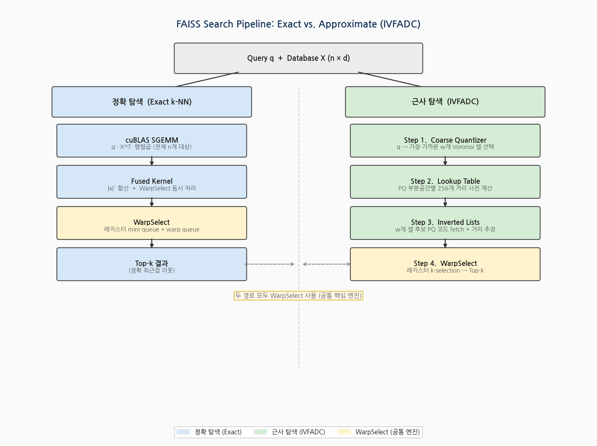
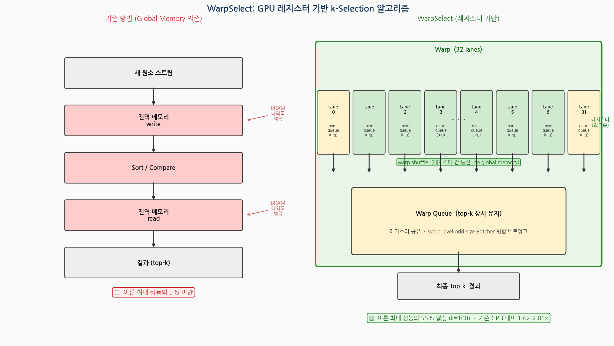
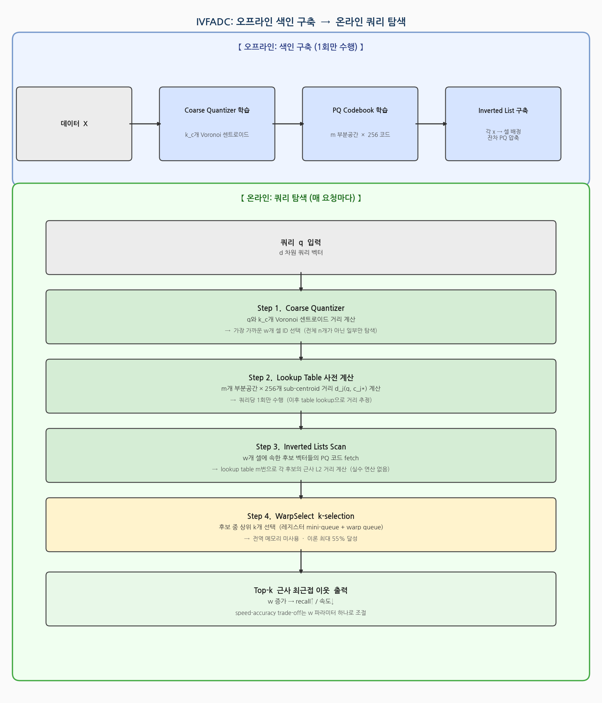
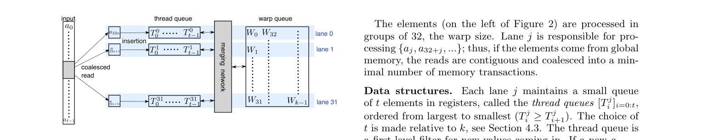
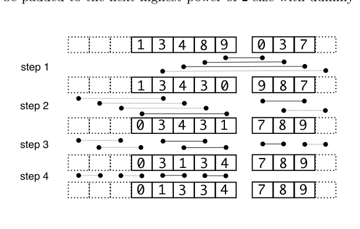
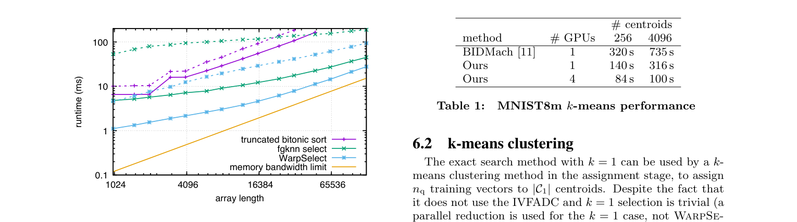
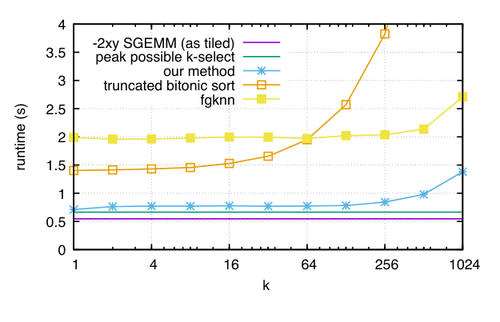
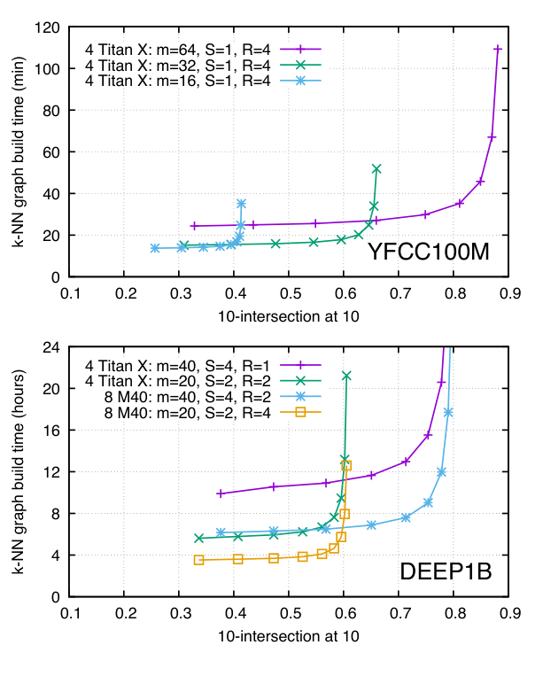
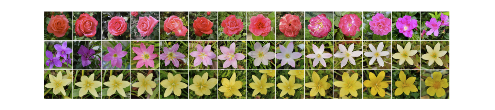

# FAISS: Billion-Scale Similarity Search with GPUs

저자 :

Jeff Johnson, Matthijs Douze, Hervé Jégou

Facebook AI Research

발표 : IEEE Transactions on Big Data, 2021 (arXiv 1702.08734, 초고 2017)

논문 : [PDF](https://arxiv.org/pdf/1702.08734)

출처 : [https://arxiv.org/abs/1702.08734](https://arxiv.org/abs/1702.08734)

---

## 0. Summary

### 0.1. 문제 (Problem)

* **유사도 검색(Similarity Search)** 은 추천, 이미지 검색, 자연어 처리, 클러스터링 등 현대 ML 파이프라인의 핵심 primitive다.
* 웹 규모 데이터 폭발로 **수십억(billion) 개 벡터 색인·검색**이 현실적 요구 사항이 됐지만, 기존 CPU 기반 접근법은 이 규모에서 비실용적이다.
* GPU는 대규모 병렬성을 제공하지만, **GPU 메모리 계층(레지스터·공유 메모리·전역 메모리)** 에 맞게 알고리즘을 근본적으로 재설계해야 한다.
* k-NN의 핵심인 **k-selection(상위 k개 선택)** 연산이 GPU에서 효율적으로 구현되지 않아 이론 성능의 5% 미만에 그쳤다.

### 0.2. 핵심 아이디어 (Core Idea)

* **핵심 한 줄**: GPU 레지스터를 최대한 활용한 WarpSelect k-selection 알고리즘으로 정확·근사 탐색 모두를 8.5× 빠르게 만들고, 수십억 벡터 규모까지 확장한다.

* **(1) WarpSelect — 레지스터 기반 k-selection**
  * 기존 GPU k-selection은 global/shared memory에 중간 상태를 쓰는 방식 → 메모리 대역폭 병목.
  * WarpSelect는 **warp 내 각 lane이 thread-local mini-queue를 레지스터에 보유**하고, warp-wide queue와 warp shuffle로 병합. 전역 메모리 패스 불필요.
  * 비유: 팀원 32명이 각자 메모지에 최고 후보 목록을 갖고 있다가, 주기적으로 팀 공유 화이트보드와 동기화 → 공용 스토리지 병목 없이 빠르게 상위 k개 유지.

* **(2) 융합 커널(Fused L2/k-selection)**
  * 거리 행렬을 전부 계산한 다음 k-selection을 따로 하면 $n_q \times n$ 행렬을 전역 메모리에 쓰고 다시 읽어야 한다.
  * L2 마지막 합산($\|x\|^2$ 항 추가)과 k-selection을 **단일 커널에서 융합** → 전역 메모리 패스 1회 절감, **25% 추가 속도 향상**.

* **(3) IVFADC GPU 최적화**
  * 근사 탐색(ANN)을 위한 IVFADC(Inverted File + Product Quantization) 구조를 GPU에서 효율적으로 구현.
  * lookup table 사전 계산, 멀티패스 k-selection, 다중 GPU replication/sharding 전략.

### 0.3. 효과 (Effects)

* k-selection: 이론 최대 성능의 **55%** 달성 (k=100 기준), 기존 GPU 최고 대비 1.62–2.01× 빠름.
* 정확 탐색(SIFT1M): 이론 최대의 **85%** 달성, 융합 커널이 비융합 대비 25% 빠름.
* 근사 탐색(SIFT1B): 기존 GPU 최고 대비 **8.5× 빠름**, Recall@10도 0.376 vs 0.35으로 더 높음.
* 수십억 규모: YFCC100M 9500만 이미지 10-NN 그래프를 4 GPU에서 **35분** 완성, DEEP1B 10억 벡터는 **12시간 이내** 처리.

### 0.4. 결과 (Results)

| 벤치마크 | 본 논문 | 비교 대상 | 지표 |
|---|---|---|---|
| SIFT1B (10억 vectors) | 17.7 μs/query, R@10=0.376 | Wieschollek: 150 μs, R@10=0.35 | **8.5× 빠름** |
| SIFT1M (exact) | 이론 최대 85% 달성 | Thrust sort | **10× 빠름** |
| k-selection (ℓ=128K) | 1.62× (k=100), 2.01× (k=1000) | fgknn | — |
| DEEP1B (10억 CNN, 4GPU) | R@1=0.4517 @ 0.0133ms | CPU: 20ms | ~1500× 빠름 |
| k-means MNIST8m | 140s (256 centroids) | BIDMach CPU: 320s | **2.3× 빠름** |

### 0.5. 상세 동작 방식 (How It Works)

FAISS는 **정확 탐색(Exact k-NN)** 과 **근사 탐색(IVFADC)** 두 경로를 제공한다. 두 경로 모두 공통적으로 **WarpSelect**(GPU 레지스터 기반 k-selection)를 핵심 엔진으로 사용한다.

#### 다이어그램 1 — 전체 두 경로 비교

<p align='center'>

</p>

```
         [쿼리 벡터 q]  +  [데이터베이스 X (n x d)]
                  |
       +----------+------------------+
       |                             |
       v                             v
  [정확 탐색 Exact k-NN]     [근사 탐색 IVFADC]
       |                             |
       v                             v
  cuBLAS SGEMM               Step 1. Coarse Quantizer
  q * X^T 행렬곱              q -> 가까운 w개 Voronoi 셀
  (전체 n개 벡터 대상)               |
       |                             v
       v                       Step 2. Lookup Table
  Fused Kernel                 PQ 부분공간별 256개 거리
  |x|^2 합산 +                 사전 계산 (쿼리당 1회)
  WarpSelect k-sel                   |
       |                             v
       v                       Step 3. Inverted Lists
  [Top-k 결과]                 w개 셀 후보 PQ 코드 fetch
  (정확 최근접)                      |
                                     v
                               Step 4. WarpSelect
                               레지스터 k-selection
                                     |
                                     v
                               [Top-k 결과]
                               (근사 최근접)
```

#### 다이어그램 2 — WarpSelect 내부: GPU 레지스터 기반 k-selection

기존 방법은 중간 결과를 전역 메모리(DRAM)에 쓰고 읽어 병목이 발생했다. WarpSelect는 **레지스터**에서 모든 것을 처리한다.

<p align='center'>

</p>

```
  기존 방법 (느림)
  ───────────────
  새 원소 -> [전역 메모리 write] -> sort -> [전역 메모리 read]
              ^^^ 대역폭 병목, 이론 최대의 5% 미만

  WarpSelect (빠름)
  ─────────────────
  Warp = 32개 lane (thread)

  Lane 0   Lane 1   Lane 2   ...  Lane 31
  +-----+  +-----+  +-----+       +-----+
  |mini |  |mini |  |mini |  ...  |mini |  <-- 레지스터
  |queue|  |queue|  |queue|       |queue|      (thread-local)
  | t_h |  | t_h |  | t_h |       | t_h |      k/32 + 2개 유지
  +--+--+  +--+--+  +--+--+       +--+--+
     |        |        |               |
     +--------+--------+--- ... -------+
                    warp shuffle (레지스터 간 통신)
                         |
                         v
              +----------------------+
              |   Warp Queue (top-k) |  <-- 레지스터 (warp 공유)
              |   항상 상위 k개 유지 |      이론 최대의 55% 달성
              +----------------------+

  동작: 새 원소 v 도착
    1. 각 lane: v < 자신의 mini-queue 최대값? -> 삽입 후 재정렬
    2. 주기적으로: mini-queue를 warp queue로 drain
       (odd-size Batcher 병합 네트워크로 병합)
    3. Warp queue = 항상 현재까지의 global top-k 유지
```

#### 다이어그램 3 — IVFADC 상세 흐름 (근사 탐색)

<p align='center'>

</p>

```
  [오프라인: 색인 구축]
  ──────────────────────────────────────────────────
  데이터 X
   |
   +-> Coarse Quantizer 학습  (k_c개 Voronoi 센트로이드)
   +-> PQ Codebook 학습       (m 부분공간 x 256 코드)
   +-> 색인: 각 벡터 x에 대해
         x -> 가장 가까운 센트로이드 배정
         잔차(x - 센트로이드) -> PQ 코드(m바이트) 압축
         Inverted List[셀 번호]에 PQ 코드 추가

  [온라인: 쿼리 탐색]
  ──────────────────────────────────────────────────
  쿼리 q (d차원)
       |
       v
  [Step 1] Coarse Quantizer
  q와 k_c개 센트로이드 거리 계산
  -> 가장 가까운 w개 셀 ID 선택
  (전체 n개 대신 일부만 검색 -> 속도 향상 핵심)
       |
       v
  [Step 2] Lookup Table 사전 계산
  m개 부분공간 x 256개 sub-centroid 거리
  d_j(q, c_j*) = 쿼리당 1회, GPU 병렬 계산
       |
       v
  [Step 3] Inverted Lists Scan
  선택된 w개 셀의 PQ 코드들을 전역 메모리에서 읽어옴
  각 후보: m번의 table lookup -> 근사 L2 거리 계산
  (실수 계산 없이 table lookup만으로 거리 추정)
       |
       v
  [Step 4] WarpSelect k-selection
  수천~수백만 후보 중 상위 k개 선택
  레지스터 mini-queue + warp queue로 처리
       |
       v
  [Top-k 근사 최근접 이웃]
  recall 조절: w(탐색 셀 수) 늘리면 정확도↑, 속도↓
```

---

## 1. Introduction

유사도 검색은 데이터베이스 시스템과 머신러닝의 근본 primitive다. 특히 k-NN 그래프 구축, 이미지/텍스트 검색, k-means 클러스터링은 모두 "주어진 벡터와 가장 가까운 것을 빠르게 찾는" 문제로 귀결된다.

현대 산업 배포 규모는 조(trillion) 단위 데이터셋이 현실화됐다. 10억 명의 사용자가 각각 1000개 아이템과 상호작용하면 1조 개 항목이 된다. CPU 기반 시스템으로는 이 규모에서의 실시간 탐색이 불가능하다.

GPU는 대규모 병렬 행렬 연산에 매우 적합하지만, 유사도 검색의 핵심인 **k-selection(N개 중 상위 k개 선택)** 은 GPU 아키텍처에 잘 맞지 않아 병목이 됐다. 기존 GPU k-selection 구현은 global memory를 과도하게 사용해 이론 성능의 5% 미만에 그쳤다.

**본 논문의 세 가지 기여**:
1. 레지스터에서 동작하는 **WarpSelect** k-selection 알고리즘
2. 정확 탐색을 위한 **융합 L2/k-selection 커널**
3. 근사 탐색을 위한 **GPU 최적화 IVFADC** + 다중 GPU 확장

---

## 2. 배경: GPU 메모리 계층과 유사도 탐색

### 2.1 GPU 메모리 계층

GPU는 3계층 메모리 계층이 있으며 대역폭 비율이 매우 크다:

| 메모리 종류 | 대역폭 (Titan X 기준) | 특성 |
|---|---|---|
| 레지스터 파일 | ~17 TB/s | 스레드 전용, 최고 속도 |
| 공유 메모리 | ~100 GB/s | warp/block 공유 |
| 전역 메모리(DRAM) | ~336 GB/s | 전체 공유, 병목 |

레지스터 >> 공유 메모리 >> 전역 메모리 순서의 속도 차이를 활용하는 것이 GPU 최적화의 핵심이다.

### 2.2 유사도 탐색 기본 구조

**정확 탐색**: 모든 $n$개 데이터베이스 벡터와 쿼리의 L2 거리를 계산 후 상위 k개 선택. 복잡도 $O(n \cdot d)$.

**근사 탐색 (IVFADC)**:
1. **학습**: coarse quantizer ($k_{coarse}$ 센트로이드) + PQ 코드북 ($m$ 부분공간) 학습
2. **색인**: 각 데이터 벡터를 가장 가까운 coarse 센트로이드에 할당; 잔차를 PQ 코드로 저장
3. **탐색**: 쿼리의 $w$개 가장 가까운 coarse 센트로이드를 찾아, 해당 inverted list 내 벡터만 검색

### 2.3 Product Quantization

벡터 $x \in \mathbb{R}^d$를 $m$개 부분벡터로 분할, 각각 $k^* = 256$개 centroid로 양자화.
- 표현: $m$ 바이트 (압축)
- 거리 추정: 쿼리별 lookup table 사전 계산 → multiply-add $m$회로 거리 추정
- Asymmetric: 쿼리는 실수값, DB는 양자화 코드

---

## 3. WarpSelect: GPU k-selection 알고리즘

### 3.1 설계 원칙

k-selection의 핵심은 스트리밍되는 $\ell$개 원소 중 최소 k개를 유지하는 것이다. GPU warp(32 lanes)를 활용해 이를 레지스터에서 처리한다.

**두 수준의 자료구조**:
1. **Thread-local queue**: 각 lane이 레지스터에 $t_h = k/32 + 2$개 원소의 정렬된 mini-queue 보유
2. **Warp queue**: warp 전체 공유 상위 k개 저장 (warp shuffle로 접근)

**불변조건**: 실제 k-nearest neighbor는 항상 thread-local queue 또는 warp queue 중 하나에 존재한다.

### 3.2 WarpSelect 동작 흐름

<p align='center'>

</p>

> Figure 2: WarpSelect 개요. 입력 값은 왼쪽에서 stream in되고, 오른쪽 warp queue가 출력 결과를 보유한다.

```
새 원소 v 도착:
1. 각 lane: v < 자신의 queue 최대값인가?
   → 아니면: 버림
   → 맞으면: 삽입, mini-queue 재정렬
2. 주기적으로: thread queue를 warp queue로 drain
   → warp-level odd-size merge network로 병합
3. Warp queue 갱신: 새 상위 k개 확정
```

### 3.3 Odd-size 병합 네트워크

<p align='center'>

</p>

> Figure 1: 크기 5와 3의 배열을 병합하는 odd-size 네트워크. 점은 병렬 compare/swap. 점선은 생략된 원소 또는 비교.

비표준 크기 k를 처리하기 위해 Batcher의 비트닉 정렬을 확장한 **odd-size 병합 네트워크** 도입. 크기 $a$와 $b$의 정렬된 시퀀스를 ($a + b = k$) 최소 compare-swap 연산으로 병합.

### 3.4 성능 결과

<p align='center'>

</p>

> Figure 3: 다양한 k-selection 방법의 실행 시간 (배열 길이 ℓ의 함수). nq=10000. 실선 k=100, 점선 k=1000.

| 설정 | WarpSelect vs fgknn | 이론 최대 대비 |
|---|---|---|
| k=100, ℓ=128K | **1.62× 빠름** | **55%** |
| k=1000, ℓ=128K | **2.01× 빠름** | 16% |

---

## 4. 정확 탐색 최적화

### 4.1 L2 거리 분해

$$\|q - x\|^2 = \|q\|^2 - 2q^Tx + \|x\|^2$$

$q^Tx$ 항: cuBLAS SGEMM (행렬 곱) → GPU에서 이미 고도로 최적화됨.
$\|x\|^2$ 항: 사전 계산 가능, 마지막에 더하기만 하면 됨.

### 4.2 융합 커널

**비융합**: SGEMM → 전역 메모리에 쓰기 → $\|x\|^2$ 합산 → 다시 읽어서 k-selection → **2× 전역 메모리 접근**

**융합**: SGEMM → $\|x\|^2$ 합산 + WarpSelect k-selection을 **동시에 처리** → 전역 메모리 1회만 읽음

<p align='center'>

</p>

> Figure 4: SIFT1M 데이터셋에서 k 값에 따른 정확 탐색 k-NN 시간 (1 Titan X GPU).

결과: **25% 속도 향상**, SIFT1M에서 이론 최대의 **85% 달성**.

---

## 5. 근사 탐색: GPU IVFADC

### 5.1 Lookup Table 최적화

PQ 거리 추정의 핵심은 쿼리별 lookup table 사전 계산:
- 각 부분공간 $j$에 대해 모든 $k^* = 256$개 sub-centroid와의 거리 $d_j(q, c_j^*)$ 계산
- 내적 루프 순서를 $d \times 256$ → $256 \times d$로 바꿔 **캐시 효율 극대화**
- GPU에서 각 쿼리가 독립적으로 병렬 처리

### 5.2 멀티패스 k-selection

대용량 inverted list에 대해 2단계 선택:
- 1단계: 각 chunk에서 thread별 상위 $k'$개 선택
- 2단계: 병합된 후보에서 최종 상위 k개 선택

### 5.3 근사 탐색 실험 결과

**SIFT1M** (vs. Wieschollek et al., 동일 시간 예산):

| | 본 논문 | Wieschollek |
|---|---|---|
| Recall@1 | **0.80** | 0.51 |
| Recall@100 | **0.95** | 0.86 |
| 탐색 시간 | 0.02ms/query | — |

**SIFT1B** (10억 벡터, 8바이트 인코딩):

| | 본 논문 | Wieschollek |
|---|---|---|
| Recall@10 | **0.376** | 0.35 |
| 탐색 시간 | **17.7 μs/query** | 150 μs/query |

→ **8.5× 빠르면서 Recall도 높음**

**DEEP1B** (10억 CNN 특징벡터, 4 GPU):

| | 본 논문 | CPU 기준선 |
|---|---|---|
| Recall@1 | 0.4517 | 0.45 |
| 탐색 시간 | **0.0133ms/vector** | 20ms/vector |

---

## 6. 다중 GPU 전략

### 6.1 복제(Replication)

- 모든 GPU가 동일한 색인 복사본 보유
- 쿼리 배치를 GPU 간에 분배 → 처리량에 대해 선형에 가까운 확장
- 적합: 대용량 쿼리 처리량 중심 애플리케이션

### 6.2 샤딩(Sharding)

- 색인을 GPU 간에 분할, 각 GPU가 자신의 샤드를 탐색 후 결과 병합
- 적합: 단일 GPU 메모리를 초과하는 초대형 색인

### 6.3 k-means 클러스터링 결과 (MNIST8m)

| 방법 | 256 centroids | 4096 centroids |
|---|---|---|
| 본 논문 (1 GPU) | **140s** | **316s** |
| BIDMach (CPU) | 320s | 735s |
| 본 논문 (4 GPU) | **84s** | **100s** |

→ CPU 대비 **2.3×**, 4-GPU로 **3.2× 추가 향상**

---

## 7. 대규모 실험

### 7.1 YFCC100M (9500만 이미지)

<p align='center'>

</p>

> Figure 5: YFCC100M과 DEEP1B 데이터셋에서의 10-NN 그래프 구축 속도/정확도 트레이드오프.

- 데이터셋: Flickr 이미지 9500만 장, 128차원 CNN 특징
- 태스크: 정확도 0.8 이상의 10-NN 그래프 구축
- 결과: **4× Titan X GPU로 35분** 완성

<p align='center'>

</p>

> Figure 6: YFCC100M 9500만 이미지 k-NN 그래프의 경로. 첫 번째와 마지막 이미지가 주어지면 알고리즘이 두 이미지 사이의 가장 매끄러운 경로를 계산한다.

### 7.2 DEEP1B (10억 벡터)

- 데이터셋: 10억 개 딥러닝 CNN 특징벡터 (96차원)
- 결과: **4× Maxwell Titan X GPU로 12시간 이내** k-NN 그래프 완성
- 의의: 이전에 수백 대 서버 클러스터가 필요했던 작업을 단일 워크스테이션으로 수행

---

## 8. FAISS 라이브러리

본 논문은 **FAISS(Facebook AI Similarity Search)** 를 오픈소스로 공개했다:

- C++ 코어 + Python 바인딩
- 정확/근사 k-NN 탐색, k-means 클러스터링 지원
- PCA, PQ 인코딩, IVF 구조 내장
- CPU + GPU 구현 모두 제공, 다중 GPU 지원

FAISS는 현재 학계와 산업계에서 가장 널리 사용되는 벡터 검색 라이브러리로, RAG(Retrieval-Augmented Generation), 추천 시스템, 이미지 검색, 벡터 데이터베이스 등 수많은 응용의 기반이 된다.

---

## 9. 관련 연구

### 9.1 CPU 기반 ANN

| 방법 | 특징 | 한계 |
|---|---|---|
| KD-tree / Ball tree | 저차원 효과적 | 고차원(d>20) 성능 급락 |
| LSH | 이론 보장 | 실용 성능 제한 |
| Product Quantization (Jégou 2011) | 압축 + 효율적 거리 추정 | FAISS의 기반 |
| HNSW (Malkov 2018) | 높은 Recall, 그래프 기반 | 메모리 집약적 |

### 9.2 GPU 기반 탐색

- **fgknn / TBiS**: GPU k-selection 선행 연구, global/shared memory 의존으로 성능 제한
- **Wieschollek et al. (2016)**: GPU ANN 탐색 구현, 본 논문 대비 Recall과 속도 모두 열세

---

## 10. Conclusion

본 논문은 GPU에서의 대규모 유사도 탐색을 세 핵심 기여로 혁신했다:

1. **WarpSelect**: 레지스터에서 동작하는 k-selection으로 이론 최대의 55% 달성
2. **융합 L2/k-selection 커널**: 전역 메모리 패스 제거로 25% 추가 속도 향상
3. **GPU IVFADC**: 기존 GPU ANN 대비 8.5× 빠른 근사 탐색

**핵심 메시지**: 소비자용 GPU 4장으로 10억 벡터 k-NN 그래프를 12시간 내에 완성할 수 있다. 이는 이전에 수백 서버 클러스터가 필요했던 작업으로, 연구자와 엔지니어 모두에게 대규모 유사도 탐색을 민주화했다.

FAISS는 2017년 공개 이후 사실상 업계 표준 벡터 검색 라이브러리가 됐으며, LLM 시대의 RAG 파이프라인에서 벡터 DB의 핵심 엔진으로 광범위하게 사용된다.

---

## 선행 지식 (Prerequisites)

### 필수 배경

| 개념 | 중요도 | 설명 |
|---|---|---|
| GPU 아키텍처 (warp, 메모리 계층) | ★★★ | WarpSelect 동기 이해에 필수 |
| Product Quantization (Jégou 2011) | ★★★ | IVFADC의 핵심 기반 |
| BLAS / cuBLAS (SGEMM) | ★★ | 거리 계산 커널 |
| Batcher's Sorting Networks | ★★ | odd-size 병합 네트워크 |
| k-NN / ANN 개요 | ★★ | 문제 이해 |

### 추천 참고 자료

1. Jégou et al., "Product Quantization for Nearest Neighbor Search," TPAMI 2011 — FAISS의 핵심 기반
2. CUDA Programming Guide (NVIDIA) — warp, 레지스터, shuffle intrinsics
3. Malkov & Yashunin, "Efficient and robust approximate nearest neighbor search using HNSW," TPAMI 2018 — 주요 대안 방법
4. FAISS 공식 문서: https://faiss.ai
