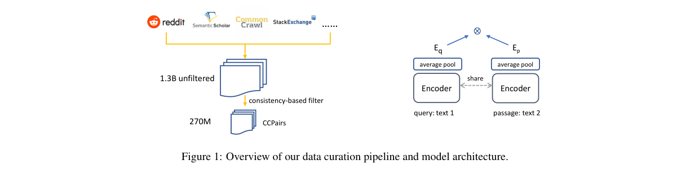
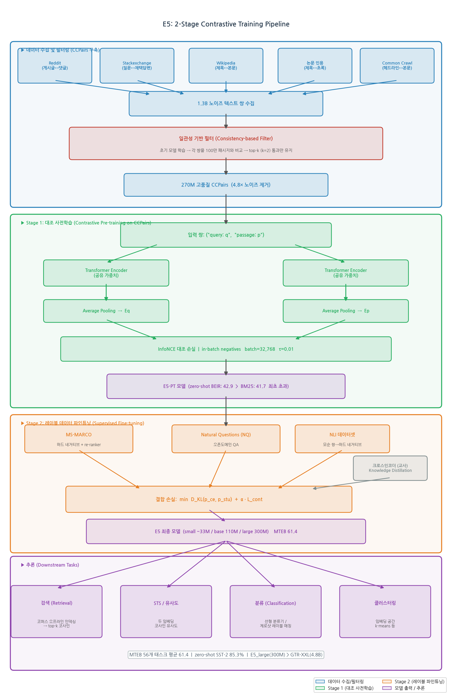

# Text Embeddings by Weakly-Supervised Contrastive Pre-training

저자 :

Liang Wang, Nan Yang, Xiaolong Huang, Binxing Jiao, Linjun Yang, Daxin Jiang, Rangan Majumder, Furu Wei

Microsoft Corporation

발표 : arXiv 2022

논문 : [PDF](https://arxiv.org/pdf/2212.03533)

출처 : [https://arxiv.org/abs/2212.03533](https://arxiv.org/abs/2212.03533)

---

## 0. Summary

<p align='center'>

</p>

### 0.1. 문제 (Problem)

* 기존 텍스트 임베딩 모델은 소규모 레이블 데이터(NLI, MS-MARCO)에 의존하거나, ICT·랜덤 크로핑 등 자동 생성 데이터를 사용하는데, 이 자동 데이터는 **품질이 낮아** 추가 파인튜닝 없이는 BM25 기준선조차 넘지 못함.
* 범용 임베딩 모델이 없어서 검색, 분류, 클러스터링 등 태스크마다 별도의 임베딩을 학습해야 함.
* 대형 모델(GTR-XXL, Sentence-T5-XXL, 약 4.8B 파라미터)이 MTEB 리더보드 상위를 차지하지만, 실용적인 소형 모델로도 이를 따라잡을 방법이 필요함.

### 0.2. 핵심 아이디어 (Core Idea)

**E5 (EmbEddings from bidirEctional Encoder rEpresentations)**는 두 가지 핵심 아이디어로 구성된다.

* **CCPairs — 웹 규모 약지도 텍스트 쌍 데이터셋**:
  * 이 데이터셋은 "질 좋은 대형 데이터"의 딜레마를 해결한다. 기존엔 레이블 데이터(소규모, 고품질)와 자동 데이터(대규모, 저품질) 사이의 타협이 필요했다.
  * Reddit의 (게시글, 댓글) 쌍, Stackexchange의 (질문, 채택 답변) 쌍, 위키피디아의 (항목+섹션 제목, 본문) 쌍, 논문 인용 쌍 등 **반정형(semi-structured) 웹 데이터**를 수집해 1.3B 쌍을 구성.
  * 이 데이터가 "약한 지도 신호(weak supervision)"를 제공 — 사람이 직접 레이블을 달지 않았지만, 구조적으로 관련성 있는 쌍.
  * **일관성 기반 필터(Consistency-based filter)**: 먼저 1.3B 노이즈 데이터로 초기 모델을 학습하고, 그 모델을 이용해 각 쌍을 100만 개 무작위 패시지와 비교해서 top-k(k=2)에 드는 쌍만 남김. 결과: 270M 고품질 쌍. "신경망은 처음에 깨끗한 레이블을 먼저 기억한다"는 성질을 역이용해 초기 모델이 올바르게 예측하는 쌍만 선별하는 방식.
  * 비유: "좋은 선생님(초기 모델)이 수험생 답안지를 채점해서, 정답 가능성 높은 문제들만 남겨두는 것"

* **2단계 대조 학습(2-stage Contrastive Training)**:
  * **1단계 — CCPairs 대조 사전학습**: InfoNCE 손실 함수와 인배치 네거티브(in-batch negatives, 배치 내 다른 샘플들을 오답으로 활용)를 사용. 배치 크기 32,768로 매우 크게 설정해 충분한 음성 샘플 확보. 비유: "한 번에 32,768명의 수험생 답안을 동시에 비교하면서 진짜 정답을 가려내는 학습"
  * **2단계 — 레이블 데이터 파인튜닝**: MS-MARCO, NQ, NLI 3가지 소규모 레이블 데이터셋에서 추가 학습. 크로스인코더 교사 모델로부터 지식 증류(knowledge distillation)를 적용해 소프트 레이블도 함께 활용.
  * 입력 텍스트에 "query:", "passage:" 접두사를 붙여 쿼리와 패시지를 구분하는 비대칭 설계.

수식:

$$L_{cont} = -\frac{1}{n}\sum_i \log \frac{e^{s_\theta(q_i, p_i)}}{e^{s_\theta(q_i, p_i)} + \sum_j e^{s_\theta(q_i, p^-_{ij})}}$$

여기서 $s_\theta(q, p) = \cos(E_q, E_p) / \tau$는 쿼리-패시지 임베딩의 코사인 유사도를 온도 $\tau=0.01$로 스케일링한 점수.

### 0.3. 효과 (Effects)

* 레이블 데이터 없이도 BM25를 최초로 능가 (BEIR 벤치마크 zero-shot 설정): E5-PT_base 42.9 vs BM25 41.7.
* 파인튜닝 후 E5_large는 MTEB 56개 데이터셋 평균 61.4로, 파라미터 수 10배 이상 큰 GTR-XXL(59.0), Sentence-T5-XXL(59.5)을 능가.
* 범용 임베딩 — 검색, 분류, 클러스터링, STS, 텍스트 매칭 등 다양한 태스크에 단일 모델 사용 가능.

### 0.4. 결과 (Results)

**BEIR 벤치마크 — Zero-shot (레이블 없음, nDCG@10)**

| 모델 | 평균 nDCG@10 | 비고 |
|---|---|---|
| Contriever | 36.0 | 랜덤 크로핑 방식 |
| BM25 | 41.7 | 고전 희소 검색 기준선 |
| **E5-PT_base** | **42.9** | **레이블 없이 BM25 최초 초과** |
| **E5-PT_large** | **44.2** | |

**BEIR 벤치마크 — Supervised Fine-tuning (nDCG@10)**

| 모델 | 평균 nDCG@10 |
|---|---|
| GTR_large | 47.0 |
| E5_base | 48.7 |
| **E5_large** | **50.0** |

**MTEB 벤치마크 (56개 데이터셋 평균)**

| 모델 | 파라미터 | MTEB 평균 |
|---|---|---|
| GTR-XXL | 4.8B | 59.0 |
| Sentence-T5-XXL | 4.8B | 59.5 |
| E5_small | ~33M | 58.9 |
| E5_base | 110M | 60.4 |
| **E5_large** | **300M** | **61.4** |

E5_large(300M)가 파라미터 16배 이상 큰 GTR-XXL, Sentence-T5-XXL을 모두 능가.

**Zero-shot 텍스트 분류 (SST-2)**

| 모델 | 정확도 |
|---|---|
| 다수결 baseline | 50.9% |
| BERT_base (지도학습) | 58.9% |
| **E5_large (zero-shot)** | **85.3%** |

### 0.5. 상세 동작 방식 (How It Works)

<p align='center'>

</p>

전체 파이프라인 흐름:

```
[웹 데이터 수집] → [1.3B 노이즈 텍스트 쌍]
        ↓
[일관성 기반 필터] → [270M 고품질 CCPairs]
        ↓
[Stage 1: 대조 사전학습]
  query: text1 → Transformer Encoder → Average Pool → E_q
  passage: text2 → Transformer Encoder → Average Pool → E_p
  InfoNCE Loss (in-batch negatives, batch=32768)
        ↓
[E5-PT 모델: zero-shot 강점]
        ↓
[Stage 2: 레이블 데이터 파인튜닝]
  MS-MARCO + NQ + NLI + Cross-Encoder 지식 증류
        ↓
[E5 최종 모델: 범용 임베딩]
        ↓
[다운스트림 태스크]
  검색 / STS / 분류 / 클러스터링
```

**Step 1 — 데이터 수집 및 필터링**:
- 입력: Reddit, Stackexchange, Wikipedia, 논문, Common Crawl 등 반정형 웹 소스
- 처리: 단순 휴리스틱 필터로 1.3B 쌍 수집 → 초기 대조 모델 학습 → 각 쌍을 100만 패시지 풀과 비교해 top-2 안에 드는 쌍만 유지
- 출력: 270M 고품질 CCPairs

**Step 2 — 대조 사전학습**:
- 입력: CCPairs (q, p) 쌍
- 처리: 공유 Transformer 인코더(BERT 기반)로 q와 p를 각각 인코딩 → average pooling으로 고정 크기 임베딩 추출 → InfoNCE 손실로 학습. 배치 내 다른 모든 (q, p) 쌍이 현재 쿼리의 오답 역할
- 출력: E5-PT 임베딩 모델

**Step 3 — 레이블 데이터 파인튜닝**:
- 입력: MS-MARCO (하드 네거티브 포함), NQ, NLI 데이터셋
- 처리: 대조 손실 $L_{cont}$ + 크로스인코더 교사 모델 KL 발산 $D_{KL}$ 결합 손실 $\min D_{KL}(p_{ce}, p_{stu}) + \alpha L_{cont}$
- 출력: 최종 E5 모델

**Step 4 — 추론 (임베딩 활용)**:
- 검색: 코퍼스 전체 임베딩 오프라인 인덱싱 → 쿼리 임베딩과 코사인 유사도로 top-k 검색
- 분류: 임베딩 위에 선형 분류기 or 제로샷 레이블 매칭
- STS: 두 텍스트 임베딩의 코사인 유사도 계산

---

## 1. Introduction

텍스트 임베딩은 임의 길이의 텍스트를 저차원 고정 크기 벡터로 변환하는 표현 방법으로, 대규모 검색, 텍스트 매칭, 분류 등 NLP 태스크의 핵심 도구다. TF-IDF 같은 희소(sparse) 표현과 달리, 밀집(dense) 임베딩은 어휘 불일치(lexical mismatch) 문제를 극복하고 의미적으로 유사한 텍스트를 근접하게 표현할 수 있다.

BERT, GPT 같은 사전학습 언어 모델이 강력한 문맥 표현을 제공하지만, 이 모델들은 단일 벡터 임베딩보다 토큰 레벨 표현에 최적화되어 있어 검색이나 텍스트 매칭에는 직접 사용하기 어렵다. 이를 개선하기 위해 Sentence-BERT, SimCSE 등이 대조 학습을 활용해 시퀀스 레벨 임베딩을 학습했지만, 레이블 데이터 의존도가 높거나 합성 데이터의 품질 문제로 성능에 한계가 있었다.

이 논문에서 저자들은 E5를 제안한다. CCPairs라는 웹에서 수집한 대규모 텍스트 쌍 데이터셋으로 대조 사전학습을 수행해, 레이블 없이도 BM25를 최초로 능가하는 임베딩을 만들어냈다. 핵심은 "약한 지도 신호(weak supervision)"를 쓰면서도 일관성 기반 필터로 데이터 품질을 높인 것이다.

## 2. Method

### 2.1. CCPairs 데이터셋 구축

CCPairs(Colossal Clean text Pairs)는 다양한 반정형 웹 소스에서 수집한 텍스트 쌍 데이터셋이다:

| 데이터 소스 | 쌍 구성 | 특징 |
|---|---|---|
| Reddit | (게시글, 댓글) | 대용량, 노이즈 존재 |
| Stackexchange | (질문, 채택 답변) | 전문성 높음 |
| Wikipedia | (항목+섹션, 본문) | 구조적 |
| 논문 인용 | (제목, 초록) | 과학 도메인 |
| Common Crawl / News | (제목, 본문) | 광범위 커버리지 |

초기 1.3B 쌍을 수집한 후 **일관성 기반 필터(Consistency-based filter)**를 적용한다:
1. 1.3B 노이즈 데이터로 초기 대조 모델 학습
2. 학습된 모델로 각 쌍을 100만 개 무작위 패시지와 비교해 순위 계산
3. top-k(k=2) 안에 드는 쌍만 유지
4. 결과: 270M 고품질 쌍

이 방식은 "신경망이 노이즈 데이터에서도 처음엔 깨끗한 레이블을 먼저 학습한다"는 관찰에 기반한다.

### 2.2. 대조 사전학습

<p align='center'>

</p>

비인코더(bi-encoder) 아키텍처를 사용한다. 쿼리 $q$와 패시지 $p$를 공유 Transformer 인코더로 각각 인코딩하고, 출력 레이어의 평균 풀링(average pooling)으로 고정 크기 임베딩 $E_q, E_p$를 얻는다.

점수 함수:

$$s_\theta(q, p) = \frac{\cos(E_q, E_p)}{\tau}$$

여기서 $\tau = 0.01$은 온도 하이퍼파라미터.

InfoNCE 대조 손실:

$$L_{cont} = -\frac{1}{n}\sum_i \log \frac{e^{s_\theta(q_i, p_i)}}{e^{s_\theta(q_i, p_i)} + \sum_j e^{s_\theta(q_i, p^-_{ij})}}$$

인배치 네거티브(in-batch negatives): 배치 내 다른 모든 패시지를 음성 샘플로 사용. 배치 크기 32,768로 설정해 충분한 네거티브 확보.

비대칭 설계: 쿼리에는 "query:" 접두사, 패시지에는 "passage:" 접두사를 붙여 구분.

### 2.3. 레이블 데이터 파인튜닝

소규모 고품질 레이블 데이터 3종으로 2단계 파인튜닝:
* MS-MARCO 패시지 순위 데이터셋 (하드 네거티브 + 크로스인코더 re-ranker 점수 활용)
* Natural Questions (NQ) 데이터셋
* Natural Language Inference (NLI) 데이터셋 (모순 문장을 하드 네거티브로 활용)

결합 손실:

$$\min D_{KL}(p_{ce}, p_{stu}) + \alpha L_{cont}$$

여기서 $p_{ce}$는 크로스인코더 교사 모델의 확률, $p_{stu}$는 학생 모델의 확률, $\alpha$는 두 손실을 균형 잡는 하이퍼파라미터.

## 3. Experiments

### 3.1. 설정

3가지 모델 크기:
* E5_small: MiniLM 초기화, 배치 크기 32,768, 16 V100 GPU, 1일 학습
* E5_base: bert-base-uncased 초기화, 배치 크기 32,768, 32 V100 GPU, 1일 학습
* E5_large: bert-large-uncased-whole-word-masking 초기화, 64 V100 GPU, 2일 학습

20,000 스텝(약 2.5 에포크) AdamW 최적화. 파인튜닝은 8 GPU, 3 에포크.

### 3.2. BEIR 벤치마크 결과

**Zero-shot (레이블 없음, nDCG@10)**:

| 모델 | 평균 |
|---|---|
| BM25 | 41.7 |
| Contriever | 36.0 |
| E5-PT_base | **42.9** |
| E5-PT_large | **44.2** |

E5-PT_base는 레이블 데이터 없이 BM25를 1.2점 차로 처음 초과. E5-PT_large는 44.2로 더욱 개선.

**Supervised fine-tuning (nDCG@10)**:

| 모델 | 평균 |
|---|---|
| GTR_large | 47.0 |
| E5_base | 48.7 |
| E5_large | **50.0** |

E5_large가 15개 BEIR 데이터셋 중 5개에서 1위.

### 3.3. MTEB 벤치마크 결과 (56개 데이터셋)

| 모델 | 파라미터 | 평균 |
|---|---|---|
| GTR-XXL | 4.8B | 59.0 |
| Sentence-T5-XXL | 4.8B | 59.5 |
| E5_small | ~33M | 58.9 |
| E5_base | 110M | 60.4 |
| E5_large | 300M | **61.4** |

E5_large(300M)가 파라미터 16배 이상 큰 모델들을 능가. E5_small(~33M)도 Sentence-T5-XXL(4.8B)에 근접.

### 3.4. 분석

* **배치 크기 효과**: 1K → 8K → 32K로 늘릴수록 BEIR 평균 45.8 → 50.2 → 51.6 향상.
* **데이터 필터링 효과**: 1M 쌍 기준 필터 적용 시 평균 34.9 → 40.7 (+5.8점). 전체 데이터에서도 필터가 4배 많은 노이즈 데이터를 능가.
* **파인튜닝 데이터 조합**: MS-MARCO+NQ는 검색에, NLI는 STS/분류에 상호 보완적. 세 데이터셋 결합이 MTEB 평균 최고 성능.
* **네거티브 샘플링**: 인배치 네거티브가 pre-batch, MoCo보다 안정적으로 우수.
* **한계점**: BM25 대비 약점이 여전히 존재 — 장기 꼬리(long-tail) 도메인(Trec-Covid), 긴 문서 검색(Touche-2020), 정확 어휘 일치 의존 태스크(Fever, Climate-Fever)에서는 추가 연구 필요. 일관성 필터의 반복 적용은 향후 연구 과제로 남겨둠.

## 4. Conclusion

이 논문은 웹 규모 약지도 텍스트 쌍 데이터셋 CCPairs와 일관성 기반 필터를 활용한 대조 사전학습으로, 레이블 데이터 없이도 BM25를 최초 초과하는 범용 텍스트 임베딩 E5를 제안했다. 이후 소규모 레이블 데이터로 파인튜닝하면 MTEB 56개 태스크에서 40배 큰 모델을 능가한다.

**Summary 코멘트**: E5의 핵심 기여는 "데이터의 양보다 질"이라는 단순하지만 효과적인 통찰에 있다. 1.3B 노이즈 데이터에서 270M 고품질 데이터로 줄여도 오히려 성능이 올라간다는 결과는, 대규모 사전학습에서 데이터 품질 관리가 모델 크기 확장만큼 중요함을 보여준다. e5-small-v2, e5-large-v2 등 후속 모델들이 실무 임베딩 모델로 널리 사용되는 배경이 된 논문이다.

---

## 부록: 사전 지식 (Prerequisites)

### A.1. 알아야 할 핵심 개념

- **대조 학습(Contrastive Learning)** — 유사한 샘플은 가까이, 다른 샘플은 멀리 위치하도록 임베딩 공간을 학습하는 방법. SimCLR, SimCSE 등이 대표적.
  - 본문 위치: §4.1 — E5의 핵심 학습 방법론, InfoNCE 손실의 기반.
- **InfoNCE 손실(InfoNCE Loss)** — Noise Contrastive Estimation의 확장. 하나의 정답과 n-1개의 오답 중 정답을 맞추는 소프트맥스 분류 손실. 배치가 클수록 어려운 오답이 많아져 학습이 강해짐.
  - 본문 위치: §4.1 Eq.(1) — 사전학습의 핵심 손실 함수.
- **인배치 네거티브(In-batch Negatives)** — 미니배치 내의 다른 샘플들을 자동으로 음성(negative) 샘플로 활용하는 기법. 별도의 네거티브 마이닝 없이 배치 크기만 키우면 네거티브 수가 늘어남.
  - 본문 위치: §4.1, §5.5 Table 5 — 배치 크기 1K→32K시 성능 5.8점 향상.
- **이중 인코더(Bi-encoder) 아키텍처** — 쿼리와 패시지를 각각 독립적으로 인코딩해 임베딩을 만들고, 코사인 유사도로 비교하는 구조. 교차 인코더(cross-encoder)보다 빠르지만 맥락 상호작용 없음.
  - 본문 위치: §4.1 — E5의 기본 아키텍처.
- **평균 풀링(Average Pooling)** — Transformer 출력 토큰 표현들의 평균을 취해 고정 크기 문장 임베딩을 얻는 방법. [CLS] 토큰 방식의 대안.
  - 본문 위치: §4.1 — 쿼리/패시지 임베딩 $E_q$, $E_p$ 생성 방법.
- **BM25** — TF-IDF를 개선한 고전 희소(sparse) 검색 알고리즘. 어휘 기반이라 어휘 불일치(lexical mismatch)에 취약하지만, 역사적으로 zero-shot 검색의 강력한 기준선.
  - 본문 위치: §1, §5.3 — E5의 주요 비교 기준. 최초 초과가 이 논문의 핵심 기여.
- **BEIR 벤치마크** — 19개 정보 검색 데이터셋의 모음. 다양한 도메인에서 zero-shot 전이 성능을 측정. nDCG@10이 주요 메트릭.
  - 본문 위치: §5.2, §5.3 — E5 zero-shot 성능의 주 평가 지표.
- **MTEB 벤치마크** — 56개 텍스트 임베딩 태스크를 포함하는 대규모 평가 프레임워크. 분류, 클러스터링, STS, 검색, 요약 등 다양한 태스크 포함.
  - 본문 위치: §5.2, §5.4 — E5의 범용성 평가에 활용.
- **지식 증류(Knowledge Distillation)** — 큰 "교사(teacher)" 모델의 출력(소프트 레이블)을 활용해 작은 "학생(student)" 모델을 훈련하는 기법. 교사 모델의 미묘한 확률 분포를 전달.
  - 본문 위치: §4.2 — 크로스인코더 교사 모델로부터 KL 발산 손실로 지식 증류.
- **약지도 학습(Weakly-supervised Learning)** — 완전한 인간 레이블 대신 자동 생성된 노이즈 레이블(약한 신호)로 학습하는 방법. 대규모 데이터 확보 가능 + 비용 절감.
  - 본문 위치: §1, §3 — CCPairs의 핵심 설계 철학.

### A.2. 먼저 읽으면 좋은 논문

1. **[2019][BERT]** ([arxiv](https://arxiv.org/abs/1810.04805)) — BERT: Pre-training of Deep Bidirectional Transformers for Language Understanding
   - 한 줄: Transformer 양방향 사전학습 모델. NLP의 전이학습 시대를 연 논문.
   - **왜?** E5는 BERT (bert-base-uncased, bert-large-uncased-wwm)를 기반 인코더로 사용. BERT를 이해해야 E5 아키텍처를 이해 가능.

2. **[2021][SimCSE]** ([arxiv](https://arxiv.org/abs/2104.08821)) — SimCSE: Simple Contrastive Learning of Sentence Embeddings
   - 한 줄: dropout을 positive augmentation으로 사용하는 간단한 대조 학습 임베딩 방법. NLI 데이터로 supervised 버전도 제안.
   - **왜?** E5의 직접적 선행 연구. 대조 학습 임베딩 방법론의 기준선 역할이자, CCPairs 필터의 dropout 아이디어와 연결됨.

3. **[2022][Contriever]** ([arxiv](https://arxiv.org/abs/2112.09118)) — Unsupervised Dense Information Retrieval with Contrastive Learning
   - 한 줄: 레이블 없이 랜덤 크로핑만으로 대조 학습하는 밀집 검색 모델.
   - **왜?** E5의 핵심 비교 대상. 랜덤 크로핑 방식의 한계를 극복하는 것이 CCPairs의 동기.

4. **[2021][GTR]** ([arxiv](https://arxiv.org/abs/2112.07899)) — Large Dual Encoders Are Generalizable Retrievers
   - 한 줄: T5 기반 대형 이중 인코더로 레이블 데이터만으로 강력한 검색 임베딩 학습.
   - **왜?** BEIR와 MTEB에서 E5의 주요 비교 모델. GTR-XXL(4.8B)를 E5_large(300M)가 능가한다는 점이 이 논문의 핵심 결과.

5. **[2020][SimCLR]** ([paper](https://proceedings.mlr.press/v119/chen20j.html)) — A Simple Framework for Contrastive Learning of Visual Representations
   - 한 줄: 이미지 대조 학습의 표준 프레임워크. InfoNCE 손실과 대규모 배치의 중요성을 입증.
   - **왜?** E5가 사용하는 InfoNCE 손실의 원본 제안 논문. 배치 크기가 클수록 좋아지는 이유를 이해하는 데 필수.

6. **[2021][BEIR]** ([arxiv](https://arxiv.org/abs/2104.08663)) — BEIR: A Heterogeneous Benchmark for Zero-shot Evaluation of Information Retrieval Models
   - 한 줄: 19개 다양한 도메인 검색 데이터셋 벤치마크. zero-shot 전이 성능 측정 표준.
   - **왜?** E5 zero-shot 성능의 주요 평가 무대. 벤치마크 구성과 메트릭 이해 필수.

### A.3. 관련/후속 논문

- **[2024][E5-mistral]** ([arxiv](https://arxiv.org/abs/2401.00368)) — Improving Text Embeddings with Large Language Models — E5 팀의 후속 연구. LLM(Mistral-7B)을 활용해 합성 데이터로 임베딩 학습. E5 아이디어를 LLM 시대로 확장.
- **[2022][MTEB]** ([arxiv](https://arxiv.org/abs/2210.07316)) — MTEB: Massive Text Embedding Benchmark — E5 평가에 활용된 56개 태스크 벤치마크. 텍스트 임베딩 평가의 사실상 표준이 됨.
- **[2023][GTE]** ([arxiv](https://arxiv.org/abs/2308.03281)) — Towards General Text Embeddings with Multi-stage Contrastive Learning — E5와 유사한 다단계 대조 학습 방법.
- **[2024][BGE-M3]** ([arxiv](https://arxiv.org/abs/2402.03216)) — BGE M3-Embedding: Multi-Lingual, Multi-Functionality, Multi-Granularity Text Embeddings Through Self-Knowledge Distillation — E5의 다국어·다기능 확장 방향. 실무에서 E5와 경쟁하는 주요 임베딩 모델.
- **[Adaptive-RAG 정리됨]** — RAG 파이프라인에서 임베딩 품질의 중요성 연구: [Agentic_AI/[논문][2024][Summary][Adaptive-RAG]...md](./[논문][2024][Summary][Adaptive-RAG]%20Adaptive-RAG%20-%20Learning%20to%20Adapt%20Retrieval-Augmented%20Large%20Language%20Models%20through%20Question%20Complexity.md)
