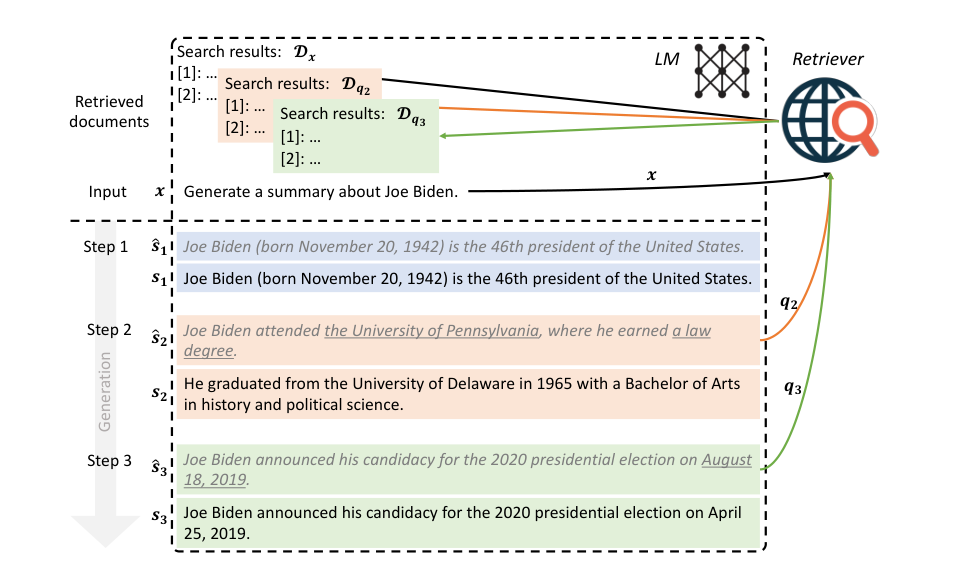
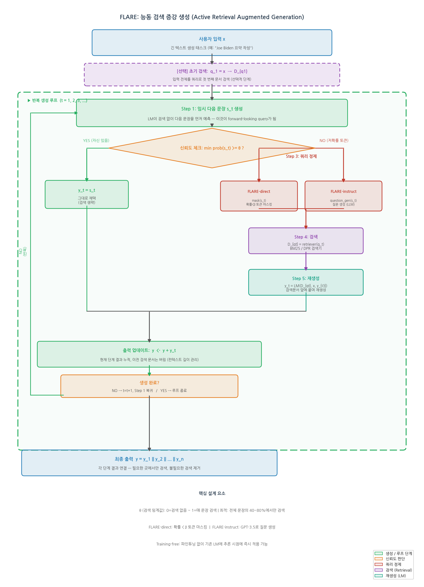
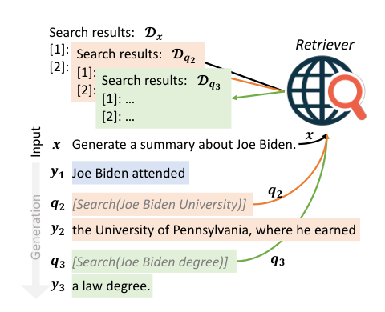
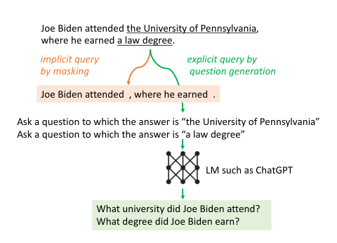
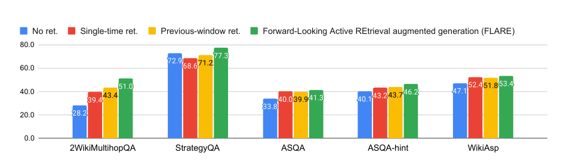
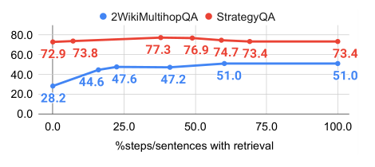

# FLARE: Active Retrieval Augmented Generation

저자 :

Zhengbao Jiang*, Frank F. Xu*, Luyu Gao*, Zhiqing Sun*, Qian Liu, Jane Dwivedi-Yu, Yiming Yang, Jamie Callan, Graham Neubig (* Lead contributors)

Language Technologies Institute, Carnegie Mellon University / Sea AI Lab / FAIR, Meta

발표 : EMNLP 2023

논문 : [PDF](https://arxiv.org/pdf/2305.06983)

출처 : [https://arxiv.org/abs/2305.06983](https://arxiv.org/abs/2305.06983)

코드 : [https://github.com/jzbjyb/FLARE](https://github.com/jzbjyb/FLARE)

---

## 0. Summary

<p align='center'>

</p>

### 0.1. 문제 (Problem)

* LLM은 긴 텍스트를 생성할 때 중간에 필요한 사실 지식을 **환각(hallucinate)** 하는 경향이 있다.
* 기존 **검색 증강 생성(RAG)** 은 입력 기반으로 딱 한 번만 검색하는 방식(single-time retrieval)이 대부분이다. 짧은 질문에는 충분하지만, **긴 텍스트 생성** 에는 생성 도중 여러 시점에서 다양한 지식이 필요하다.
* **수동적 반복 검색**(고정 간격으로 과거 컨텍스트 기반 검색 — RETRO, IC-RALM, IRCoT)은 미래에 생성하려는 내용을 반영하지 못하고, 불필요한 시점에도 검색이 일어난다.
* **질문 분해 방식**(Self-Ask, ReAct)은 태스크별 수동 어노테이션이 필요하여 일반화가 어렵다.

### 0.2. 핵심 아이디어 (Core Idea)

* **핵심 한 줄**: 생성 중에 임시 다음 문장을 미리 예측해보고, 저확률 토큰이 있으면 그 문장을 쿼리로 삼아 검색·재생성하는 **순방향 능동 검색(Forward-Looking Active Retrieval)** 을 반복한다.

* **(1) 순방향 쿼리 (Forward-Looking Query)**
  * 정의: 단계 `t`에서, 이전에 생성된 내용 `y_{<t}`를 바탕으로 **검색 없이 임시 다음 문장 `ŝ_t`를 먼저 생성**한다. 이 문장은 LM이 앞으로 생성하려는 내용의 예측치다.
  * 왜 필요한가: 과거 컨텍스트로 검색하면 LM의 미래 생성 의도를 반영하지 못한다. 미래를 "미리 엿본" 쿼리를 사용해야 필요한 지식을 정확히 겨냥할 수 있다.
  * 비유: 에세이를 쓰다가 다음 단락에서 무엇을 쓸지 미리 스케치해보고, 그 내용에 필요한 자료를 찾아오는 것.

* **(2) 신뢰도 기반 검색 트리거 (Confidence-Based Retrieval Trigger)**
  * 정의: `ŝ_t`의 임의 토큰 확률이 임계값 `θ`보다 낮으면 검색을 실행한다. `θ=0`이면 검색 없음, `θ=1`이면 매 문장 검색.
  * 왜 필요한가: LM은 잘 캘리브레이션되어 있어, 낮은 토큰 확률 = 지식 부족의 신호다 (Kadavath et al. 2022). 자신 있을 때 불필요하게 검색하면 노이즈가 오히려 생성을 방해한다.
  * 공식: `y_t = ŝ_t (자신 있으면)` 또는 `y_t = LM([D_{q_t}, x, y_{<t}]) (자신 없으면, 검색 후 재생성)`

* **(3) 저확률 토큰 기반 쿼리 정제 (Low-Confidence Query Formulation)**
  * 정의: `ŝ_t`에 오류 가능 토큰이 있으므로, 그대로 쿼리로 쓰면 검색기를 오도할 수 있다. 두 가지 정제 방법:
    * **마스킹(암묵적)**: 확률 < β인 토큰을 마스킹해 잘못된 내용 제거
    * **질문 생성(명시적)**: 저확률 스팬에 대한 질문을 GPT-3.5-turbo로 생성 (예: "Joe Biden이 어느 대학을 다녔나?")
  * 비유: 틀린 내용이 섞인 초안에서 불확실한 부분만 골라 "이 부분을 확인하라"는 명확한 질문을 만드는 것.

### 0.3. 효과 (Effects)

* 파인튜닝 없이 **추론 시에 기존 LM에 바로 적용 가능** (inference-time, training-free).
* 필요한 때만 검색하므로 **불필요한 검색을 줄이면서도** 핵심 지식 갭을 모두 채운다.
* 4개 다양한 지식 집약적 태스크 전체에서 단일/반복 검색 베이스라인을 능가한다.

### 0.4. 결과 (Results)

* **2WikiMultihopQA** (멀티홉 QA): FLAREdirect EM **51.0**, F1 **59.7** — 단일 검색(EM 39.4) 대비 +11.6, 최강 베이스라인인 질문 분해(EM 47.8) 대비 +3.2.
* **StrategyQA** (상식 추론): FLARE EM **77.3** — No retrieval(72.9) 대비 +4.4.
* **ASQA-hint** (장문 QA): FLARE DR **37.2** — Single-time retrieval(30.4) 대비 +6.8.
* **WikiAsp** (오픈도메인 요약): FLARE UniEval **53.4** — Single-time retrieval(52.4) 대비 +1.0.
* **순방향 검색 효과**: 다음 문장으로 검색 EM 48.8 vs 이전 문장으로 검색 EM 39.0 (+9.8, Table 3).
* **최적 검색 비율**: 전체 문장의 40-80%에서만 검색할 때 최적 성능 달성.

### 0.5. 상세 동작 방식 (How It Works)

<p align='center'>

</p>

**[입력 → 임시 생성 → 신뢰도 체크 → 조건부 검색·재생성 → 반복]** 흐름으로 동작한다.

```
[사용자 입력 x]
   │
   ▼ (초기 검색: q_1 = x)
[LM 생성 시작]
   │
   ├── [단계 t: 임시 다음 문장 ŝ_t 생성 (검색 없이)]
   │       │
   │       ├── 모든 토큰 확률 ≥ θ? → ŝ_t 그대로 채택 (검색 생략)
   │       │
   │       └── 저확률 토큰 존재?
   │               │
   │               ├── 쿼리 공식화: mask(ŝ_t) 또는 question_gen(ŝ_t)
   │               ├── 검색: D_{q_t} = retriever(q_t)
   │               └── 재생성: s_t = LM([D_{q_t}, x, y_{<t}])
   │
   └── 생성 끝까지 반복 → 최종 출력 y
```

* **Step 1. 초기 검색**: 사용자 입력 `x`를 쿼리로 초기 문서 검색.
* **Step 2. 임시 문장 생성**: 검색 없이 다음 문장 `ŝ_t`를 우선 생성. 이것이 쿼리 역할.
* **Step 3. 신뢰도 판단**: `ŝ_t` 내 최소 토큰 확률을 임계값 `θ`와 비교.
  * 자신 있으면(모두 ≥ θ): `ŝ_t`를 최종 다음 문장으로 채택.
  * 자신 없으면(저확률 토큰 존재): 쿼리 정제 → 검색 → 재생성.
* **Step 4. 쿼리 정제 (두 가지 옵션)**:
  * 암묵적: 확률 < β 토큰을 마스킹한 문장을 쿼리로 사용.
  * 명시적: 저확률 스팬마다 gpt-3.5-turbo로 질문 생성, 각각 검색 후 결과 통합.
* **Step 5. 검색 및 재생성**: 검색 문서 `D_{q_t}`를 앞에 붙여 다음 문장 재생성.
* **Step 6. 반복**: 생성 끝까지 Step 2-5 반복. 이전 단계 검색 문서는 버리고 현재 단계 것만 사용(컨텍스트 길이 관리).

전체 과정 요약:
```
[추론] 입력 x → {임시 생성 → 신뢰도 체크 → (필요시) 쿼리정제→검색→재생성} 반복 → 최종 출력
```

---

## 1. Introduction

생성 언어 모델(LM)은 놀라운 언어 능력을 갖추었지만, **사실 정보를 환각** 하는 경향이 있다. 외부 지식 코퍼스에서 관련 정보를 검색해 LM을 강화하는 검색 증강 생성(RAG)이 유망한 해법이다.

그러나 기존 RAG의 주류인 **단일 검색(single-time retrieval)** — 입력 기반으로 한 번 검색하고 전체 답변을 생성 — 은 **긴 텍스트 생성** 에서 한계를 드러낸다. 예를 들어, Joe Biden에 대한 요약을 생성할 때, "Joe Biden" 하나로 검색한 결과만으로는 교육 이력, 대통령 선거 날짜 등 세부 사항을 모두 커버하기 어렵다. 생성 도중 필요한 지식을 지속적으로 보충해야 한다.

여러 번 검색하는 방법들이 시도되었으나 각자 한계가 있다:
1. **수동적 과거 기반 검색** (RETRO, IC-RALM, IRCoT): 고정 간격으로 과거 컨텍스트를 쿼리로 사용 → 미래 생성 의도 미반영, 부적절한 시점에 검색.
2. **질문 분해** (Self-Ask, ReAct): 태스크별 수동 어노테이션 필요 → 새 태스크 일반화 어려움.

저자들은 핵심 질문을 던진다: "생성 과정 전반에 걸쳐 **언제, 무엇을** 검색할지 능동적으로 결정하는 단순하고 일반적인 방법을 만들 수 있는가?"

그들의 가설: LM은 필요한 지식이 없을 때만 검색해야 한다(불필요한 검색 방지), 그리고 검색 쿼리는 과거가 아닌 **미래 생성 의도**를 반영해야 한다. 이 두 원칙을 구현한 것이 **FLARE(Forward-Looking Active REtrieval augmented generation)** 다.

---

## 2. Active Retrieval Augmented Generation 프레임워크

### 2.1. 형식화

사용자 입력 `x`, 문서 코퍼스 `D = {d_i}`가 주어지면, 단계 `t`에서:

**쿼리 공식**: `q_t = qry(x, y_{<t})`

**생성**: `y_t = LM([D_{q_t}, x, y_{<t}])`

여기서 이전 단계 검색 문서들 `∪_{t'<t} D_{q_{t'}}`은 버리고 현재 단계 문서만 사용 (컨텍스트 길이 한계 관리).

기존 방법들은 모두 이 프레임워크의 특수 케이스:
- **단일 검색**: `q_1 = x`, 이후 검색 없음
- **Previous-window**: `q_t = y_{t-1}` (이전 l개 토큰)
- **Previous-sentence**: `q_t = y_{t-1}` (이전 문장)

---

## 3. FLARE 구현

<p align='center'>

</p>

### 3.1. FLAREinstruct

Toolformer (Schick et al. 2023)에서 영감받아, LM이 `[Search(query)]` 토큰을 생성할 때 검색을 트리거한다. Few-shot prompting으로 구현:

```
Skill 1. 검색 지시 + 예시
Skill 2. 다운스트림 태스크 지시 + 예시
→ Skill 1+2 결합 지시 + 테스트 입력
```

GPT-3.5 API에서 신뢰도가 낮아 FLAREdirect보다 성능 열세.

### 3.2. FLAREdirect (주요 방법)

<p align='center'>

</p>

**3.2.1 신뢰도 기반 능동 검색**

단계 `t`에서:
1. 임시 다음 문장 생성: `ŝ_t = LM([x, y_{<t}])` (검색 없이)
2. 조건부 채택/재생성:

```
y_t = ŝ_t                        (모든 토큰 확률 ≥ θ이면)
y_t = LM([D_{q_t}, x, y_{<t}])   (저확률 토큰 있으면, 재생성)
```

**3.2.2 쿼리 공식화**

저확률 토큰 문제를 해결하는 두 방법:

| 방법 | 설명 | 특징 |
|------|------|------|
| **마스킹 (암묵적)** | 확률 < β 토큰을 제거한 문장을 쿼리로 사용 | 오류 토큰 제거, β=0.4 최적 |
| **질문 생성 (명시적)** | 저확률 스팬마다 zero-shot 질문 생성 (gpt-3.5-turbo) | 정밀하지만 추가 API 호출 필요 |

두 방법의 성능은 유사 (ASQA-hint DR: 37.3 vs 37.2), 실용적으로는 마스킹이 더 효율적.

### 3.3. 구현 세부 사항

- **기반 LM**: text-davinci-003 (GPT-3.5, API)
- **검색기**: Wikipedia 기반 BM25, 웹 기반 Bing Search API
- **문서 포맷**: 검색 문서를 순위별로 linearize해 사용자 입력 앞에 추가

---

## 4. 비교 베이스라인

| 방법 | 검색 시점 | 쿼리 내용 | 한계 |
|------|---------|---------|------|
| No retrieval | 없음 | - | - |
| Single-time | 1회 (입력 기반) | 사용자 입력 | 장문 생성에 불충분 |
| Previous-window | l=16 토큰마다 | 이전 l개 토큰 | 미래 의도 미반영 |
| Previous-sentence | 매 문장 | 이전 문장 | 미래 의도 미반영 |
| Question decomposition | 동적 (서브질문 시) | 수동 생성 서브질문 | 태스크별 어노테이션 필요 |

---

## 5. 실험

### 5.1. 설정

- **평가 데이터셋**: 각 최대 500개 샘플, few-shot in-context learning
- **하이퍼파라미터**: 개발 세트로 θ, β 선택

### 5.2. 평가 태스크

| 태스크 | 데이터셋 | 설명 | 주요 메트릭 |
|--------|---------|------|------------|
| 멀티홉 QA | 2WikiMultihopQA | 2-hop 복잡 추론 (composition, comparison) | EM, F1 |
| 상식 추론 | StrategyQA | Yes/No 질문 + CoT 추론 | EM |
| 장문 QA | ASQA / ASQA-hint | 모호한 질문의 다중 해석 커버 | DR (Disambig-F1 + ROUGE) |
| 오픈도메인 요약 | WikiAsp | 위키피디아 20개 도메인 측면 기반 요약 | UniEval |

---

## 6. 결과

<p align='center'>

</p>

### 6.1. 전체 성능 비교

**Table 1: 2WikiMultihopQA 결과**

| 방법 | EM | F1 | Prec. | Rec. |
|------|----|----|-------|------|
| No retrieval | 28.2 | 36.8 | 36.5 | 38.6 |
| Single-time retrieval | 39.4 | 48.8 | 48.6 | 51.5 |
| Previous-window | 43.2 | 52.3 | 51.7 | 54.5 |
| Previous-sentence | 39.0 | 49.2 | 48.9 | 51.8 |
| Question decomposition | 47.8 | 56.4 | 56.1 | 58.6 |
| FLAREinstruct (ours) | 42.4 | 49.8 | 49.1 | 52.5 |
| **FLAREdirect (ours)** | **51.0** | **59.7** | **59.1** | **62.6** |

**Table 2: 다른 태스크 결과**

| 방법 | StrategyQA EM | ASQA-hint DR | WikiAsp UniEval |
|------|--------------|-------------|----------------|
| No retrieval | 72.9 | 34.4 | 47.1 |
| Single-time | 68.6 | 36.0 | 52.4 |
| Previous-window | 71.2 | 36.6 | 51.8 |
| Previous-sentence | 71.0 | 36.7 | 52.6 |
| **FLARE (ours)** | **77.3** | **37.2** | **53.4** |

주요 관찰:
- 멀티홉 QA에서 가장 큰 향상 (태스크 특성상 2-hop 추론이 순방향 검색과 잘 맞음)
- ASQA-hint > ASQA (힌트 제공으로 모호성 처리 향상)
- StrategyQA에서 단일 검색이 오히려 No retrieval보다 낮음 (잘못된 문서가 상식 추론 방해)

### 6.2. Ablation Study

<p align='center'>

</p>

**순방향 vs 과거 컨텍스트 검색 (Table 3)**

| 방법 | 2WikiMultihopQA EM | ASQA-hint DR |
|------|-------------------|-------------|
| 이전 문장으로 검색 | 39.0 | 35.5 |
| **다음 문장으로 검색** | **48.8** | **36.6** |

순방향 검색이 +9.8 EM 우위 → 미래 의도 반영의 중요성 확인.

**과거 윈도우 크기 (Table 4)**

| 토큰 수 | EM | F1 |
|---------|----|----|
| 16 | 43.2 | 52.3 |
| 32 | **43.6** | **52.4** |
| 48 | 40.0 | 49.3 |
| All | 39.0 | 48.5 |

과거 컨텍스트가 많을수록(>32) 오히려 성능 저하 → 과거 컨텍스트는 미래 의도와 관련성 낮음.

**능동 검색 임계값 θ (Figure 5)**
- 2WikiMultihopQA: 검색 비율 60% 초과 시 성능 정체 (자신 있을 때 검색 불필요)
- StrategyQA: 검색 비율 50% 초과 시 성능 저하 (불필요한 검색 = 노이즈)
- **최적 검색 비율: 40-80%**

**마스킹 임계값 β (Table 5)**

| β | EM |
|---|----| 
| 0.0 (전체 문장) | 0.488 |
| 0.2 | 0.498 |
| **0.4** | **0.510** |
| 0.6 | 0.506 |

β=0.4 마스킹 최적 → 저확률 오류 토큰 제거가 검색 품질 향상.

---

## 7. 관련 연구

| 카테고리 | 대표 연구 | FLARE와의 차이 |
|---------|----------|---------------|
| 단일 검색 RAG | DPR, RAG, REALM, FiD | FLARE는 생성 중 능동적 다중 검색 |
| 고정 간격 검색 | RETRO, IC-RALM, KNN-LM | FLARE는 신뢰도 기반 능동 타이밍 |
| 반복 정제 | IRCoT | FLARE는 과거가 아닌 미래 지향적 쿼리 |
| 질문 분해 | Self-Ask, ReAct | FLARE는 태스크별 어노테이션 불필요 |
| 브라우저 강화 | WebGPT, WebCPM | 파인튜닝 필요, FLARE는 training-free |
| HyDE | Gao et al. 2022 | FLARE는 가설 문서 생성 아이디어를 장문 생성에 일반화 |
| 적응형 검색 | Mallen et al. 2022, Li et al. 2023 | FLARE는 장문 생성 + 능동 시점 결정 |

---

## 8. 한계 및 향후 방향

### 성능 향상 미미한 태스크
- **Wizard of Wikipedia**: 출력이 짧아(~20 토큰) 반복 검색 이점 없음
- **ELI5**: 개방형 질문, 검색 근거화 어려움 (Krishna et al. 2021 지적 문제)

### 계산 비용
- 검색·생성 인터리빙 → LM을 여러 번 활성화
- KV 캐시 없는 구현 시 이전 활성화 재계산 필요
- 해결 방향: 검색 문서 `D_{q_t}`와 입력/생성 `(x/y_{<t})`를 독립적으로 인코딩하는 아키텍처

### 미래 연구 방향
- 더 나은 능동 검색 전략 개발
- 검색-생성 효율적 통합 아키텍처

---

## 9. 논문 평가

**강점**:
- 단순하고 직관적인 아이디어: 미래를 "미리 엿보고" 필요할 때만 검색
- 추가 학습 없이 기존 LM에 inference-time 적용
- Active Retrieval 프레임워크로 기존 방법들을 통일적 시각으로 형식화
- 4개 다양한 태스크에 걸친 포괄적 검증 + 상세 ablation

**약점**:
- text-davinci-003 단일 모델에만 검증 (open-source LM 미검증)
- 토큰 확률 접근이 필요 → API-only 블랙박스 모델엔 FLAREinstruct로만 가능 (성능 열세)
- 계산 비용 문제 인정
- ELI5, Wizard of Wikipedia에서 한계

**의의**: FLARE는 RAG 연구에서 "능동적·순방향 검색"의 중요성을 체계적으로 입증한 이정표 논문. 이후 Self-RAG, Adaptive-RAG, DRAGIN 등 다양한 능동 검색 방법들의 토대가 되었다.

---

## 10. 선행 지식 (Prerequisites)

이 논문을 깊이 이해하려면:

**필수**:
1. **RAG 기초** — Lewis et al. 2020 (RAG), DPR (Karpukhin et al. 2020)
2. **LLM 및 In-Context Learning** — Brown et al. 2020 (GPT-3), few-shot prompting
3. **LLM 캘리브레이션** — Kadavath et al. 2022 (LM의 낮은 확률 = 불확실성)

**권장**:
4. **Chain-of-Thought** — Wei et al. 2022 (CoT prompting)
5. **멀티홉 QA** — Ho et al. 2020 (2WikiMultihopQA)
6. **BM25 희소 검색** — Robertson & Zaragoza 2009
7. **Toolformer** — Schick et al. 2023 (FLAREinstruct의 영감 출처)

**맥락**:
8. **수동적 반복 검색**: RETRO (Borgeaud et al. 2022), IC-RALM (Ram et al. 2023), IRCoT (Trivedi et al. 2022)
9. **HyDE** — Gao et al. 2022 (가설적 쿼리 생성의 선행 연구)
