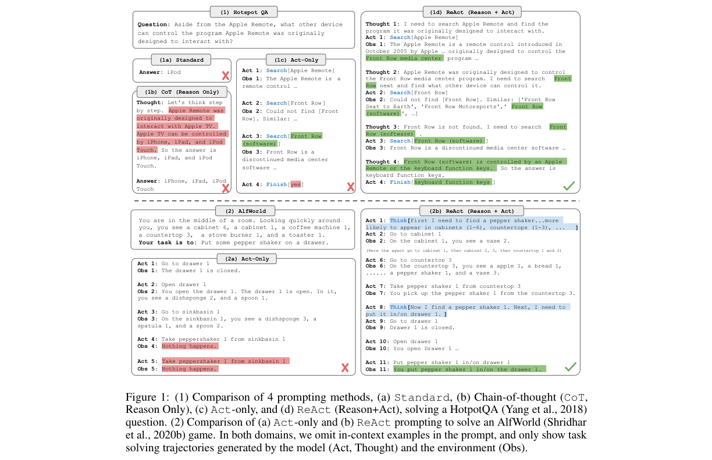
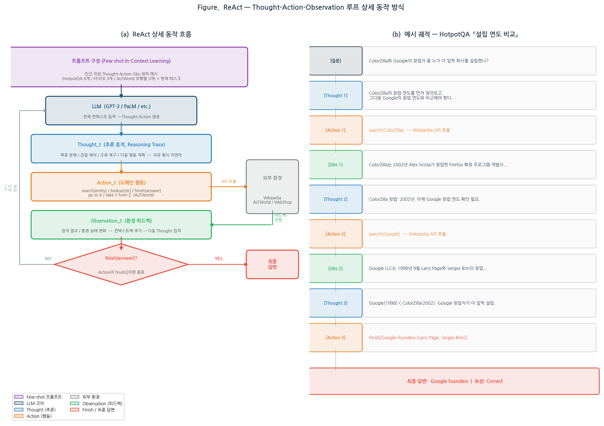
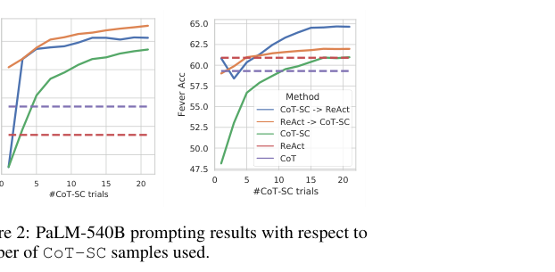
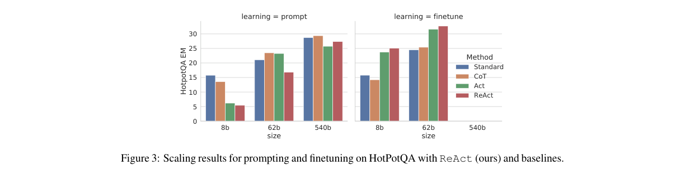

# ReAct: Synergizing Reasoning and Acting in Language Models

저자 :

Shunyu Yao, Jeffrey Zhao, Dian Yu, Nan Du, Izhak Shafran, Karthik Narasimhan, Yuan Cao

Department of Computer Science, Princeton University

Google Research, Brain team

발표 : ICLR 2023

논문 : [PDF](https://arxiv.org/pdf/2210.03629)

출처 : [https://arxiv.org/abs/2210.03629](https://arxiv.org/abs/2210.03629)

---

## 0. Summary

<p align='center'>

</p>

> **Figure 1 설명** — 4가지 프롬프팅 방식을 동일한 HotpotQA 질문으로 비교한 궤적 예시.
>
> | 방식 | 특징 | 한계 |
> |---|---|---|
> | **Standard** | 질문 → 바로 답변 (추론·검색 없음) | 사실 오류 다발 |
> | **CoT** | Thought만 생성, 외부 검색 없음 | Hallucination — 없는 사실 지어냄 |
> | **Act** | 검색 API만 호출, Thought 없음 | 검색 결과 해석 실패, 목표 추적 어려움 |
> | **ReAct** | Thought → Action → Observation 교차 | 검색 결과를 추론으로 해석 → 올바른 답 도달 |
>
> 핵심 포인트: CoT는 내부 추론만, Act는 외부 행동만 하지만, **ReAct는 두 흐름을 번갈아 실행**하여 서로를 보완한다. Thought가 다음 Action의 방향을 결정하고, Observation이 다음 Thought의 근거가 된다.

### 0.1. 문제 (Problem)

* LLM(대형 언어 모델)의 **추론(reasoning)**과 **행동(acting)** 능력은 지금까지 별도 연구 주제로만 다뤄졌음.
  * Chain-of-Thought(CoT) 같은 추론 전용 방식은 외부 세계와 단절되어 있어 hallucination(환각)과 오류 전파(error propagation) 문제가 발생.
  * 행동 전용(Act-only) 방식은 고수준 목표를 분해하거나 맥락을 추적하는 추론 능력이 없어 복잡한 과제에서 실패.
* 두 가지 능력을 **유기적으로 결합**하는 방법이 부재하여, 지식 집약적 QA(질의응답)와 대화형 의사결정 과제에서 성능 한계가 있음.

### 0.2. 핵심 아이디어 (Core Idea)

* **ReAct = Reasoning + Acting 교차 생성(Interleaved)**

  ReAct의 핵심은 단순하다: LLM이 "생각(Thought)"과 "행동(Action)"을 번갈아 가며 자유롭게 생성하도록 프롬프트를 구성하는 것이다. 기존에는 '생각'과 '행동'이 따로였지만, ReAct는 이 둘을 한 궤적(trajectory) 안에 섞는다.

  * **Thought(추론 흔적, reasoning trace)**: 실행 가능한 외부 행동은 아니지만, 모델이 현재 상황을 분석하고 다음 행동 계획을 세우는 내부 언어 독백. "나는 이제 A를 찾아야 하고, 그다음엔 B를 확인해야 한다"와 같이 자연어로 표현됨. 마치 요리사가 "냄비를 올리기 전에 재료를 다 썰어야지"라고 속으로 생각하는 것과 같다.
  * **Action(행동)**: Wikipedia 검색, 환경 조작 등 외부 시스템과 실제로 상호작용하는 단계. 행동 결과는 Observation(관찰)으로 돌아온다.
  * **Observation(관찰)**: 환경이나 외부 API가 돌려준 피드백. 이것이 다시 다음 Thought의 입력이 된다.

* **왜 필요한가?** Thought가 없으면 모델은 관찰 결과를 그냥 받아들이며 무작정 행동한다. Thought가 있으면 "지금 받은 검색 결과가 내 목표와 어떻게 연결되는지"를 추론한 후 적절한 다음 행동을 선택할 수 있다.

* **Action Space 확장**: 기존 행동 집합 $A$를 언어 공간 $L$로 확장하여 $\hat{A} = A \cup L$로 정의. 언어 공간 내 행동(Thought)은 외부 환경에 영향을 미치지 않지만, 컨텍스트 $c_t$를 $c_{t+1} = (c_t, \hat{a}_t)$로 업데이트하여 미래 추론을 지원한다.

* **프롬프팅만으로 구현**: 별도 학습 없이 few-shot in-context 예시(사람이 작성한 Thought-Action-Observation 궤적)를 LLM에 제공하여 ReAct 패턴을 유도. 지식 추론 태스크에는 매 단계마다 Thought를 넣는 "밀집(dense)" 방식, 의사결정 태스크에는 필요한 지점에만 Thought를 넣는 "희소(sparse)" 방식을 사용.

### 0.3. 효과 (Effects)

* **Hallucination 감소**: Wikipedia API 등 외부 지식 베이스와 상호작용하여 사실 기반 추론 경로를 생성함으로써, CoT 대비 허위 정보 생성률을 크게 낮춤 (CoT 실패 원인의 56%가 hallucination → ReAct는 0%).
* **해석 가능성(Interpretability) 향상**: Thought-Action-Observation 흐름이 사람이 읽을 수 있는 형태로 남아, 모델이 무엇을 알고 있고 무엇을 외부에서 가져왔는지 명확히 구분 가능.
* **Human-in-the-loop 제어**: 추론 흔적을 사람이 직접 편집하면 모델 행동 방향을 바꿀 수 있어, 오류 복구 및 제어 가능성이 높음.
* **Fine-tuning 효과 극대화**: 3,000개 ReAct 궤적으로 소형 모델(PaLM-8B)을 파인튜닝하면, PaLM-62B 프롬프팅 방식 전체를 능가.

### 0.4. 결과 (Results)

* **HotpotQA** (다중 홉 질의응답): ReAct + CoT-SC 결합이 EM 35.1로 최고 성능. 단순 CoT(29.4), CoT-SC(33.4) 대비 향상.
* **FEVER** (사실 검증): ReAct + CoT-SC 결합이 Acc 64.6으로 CoT(56.3), CoT-SC(60.4) 대비 큰 개선.
* **ALFWorld** (텍스트 기반 가정환경 게임): ReAct best-of-6 성공률 **71%** — Act-only (45%), BUTLER RL (37%) 모두 크게 상회.
* **WebShop** (온라인 쇼핑 내비게이션): ReAct 성공률 **40.0%** — IL (29.1%), IL+RL (28.7%) 대비 **약 10%p 절대 향상**.

### 0.5. 상세 동작 방식 (How It Works)



ReAct는 LLM에게 "Thought → Action → Observation" 루프를 반복하도록 프롬프트로 유도한다. 아래는 HotpotQA(지식 추론)와 ALFWorld(의사결정) 두 가지 태스크에서의 흐름이다.

```
[질문/태스크 입력]
     │
     ▼
[Thought 1] 목표 분해: "A를 먼저 찾고, B와의 관계를 확인해야 한다"
     │
     ▼
[Action 1] search[A]  ──→  외부 Wikipedia API 호출
     │
     ▼
[Observation 1] "A는 1984년에 설립된 회사로..."
     │
     ▼
[Thought 2] 결과 분석: "A의 설립 연도가 1984년이고, 다음은 B를 확인해야 함"
     │
     ▼
[Action 2] search[B]  ──→  외부 Wikipedia API 호출
     │
     ▼
[Observation 2] "B는 1989년 A의 자회사로 출범..."
     │
     ▼
[Thought 3] 최종 합산: "A(1984) < B(1989), 따라서 A가 먼저 설립됨"
     │
     ▼
[Action 3] finish[A]
     │
     ▼
[최종 답변]
```

**Step 1 — 프롬프트 구성**: 인간이 작성한 Thought-Action-Observation 궤적 예시(HotpotQA는 6개, FEVER는 3개, ALFWorld는 각 과제 유형별 3개)를 few-shot 예시로 LLM 프롬프트에 넣는다.

**Step 2 — Thought 생성**: LLM이 현재 컨텍스트(질문 + 지금까지의 행동 및 관찰 이력)를 기반으로 자유 형식 언어로 추론 흔적을 생성. 이 Thought는 목표 분해, 관찰 추출, 오류 복구, 다음 행동 계획 등을 수행.

**Step 3 — Action 생성**: Thought 직후 도메인별 행동을 생성. 지식 태스크에서는 `search[entity]`, `lookup[string]`, `finish[answer]`; 의사결정 태스크(ALFWorld)에서는 `go to cabinet 1`, `take apple from table` 같은 환경 조작 명령.

**Step 4 — Observation 수신**: 외부 환경(Wikipedia API, 시뮬레이션 환경)이 행동에 대한 피드백을 반환. 이 Observation이 컨텍스트에 추가되어 다음 Thought의 입력이 됨.

**Step 5 — 루프 반복**: finish 행동이 나올 때까지 Step 2–4를 반복. 의사결정 태스크에서는 Thought가 희소하게(필요한 지점에만) 삽입되며, 언제 Thought를 생성할지도 LLM이 스스로 결정.

```
[전체 흐름 요약]
LLM 프롬프트
  ├── Few-shot 예시 (인간 작성 Thought-Action-Obs 궤적)
  └── 현재 태스크
        ↓
  [Thought_1 → Action_1 → Obs_1] → [Thought_2 → Action_2 → Obs_2] → ... → finish
        ↑________외부 환경 (Wikipedia / ALFWorld / WebShop)__________↑
```

---

## 1. Introduction

인간 지능의 독특한 특징 중 하나는 목표 지향적 행동과 언어적 추론(내부 독백)을 자연스럽게 결합하는 능력이다. 요리를 할 때 우리는 "이제 재료를 다 썰었으니 물을 끓여야 한다"고 생각하고(추론), 냄비를 올리는 행동을 취하며, 냉장고를 열어 재료를 확인(행동)하면서 "소금이 없으니 간장으로 대체해야겠다"고 다시 추론한다. 이 행동과 추론의 긴밀한 상호작용이 인간으로 하여금 새로운 상황에서도 빠르게 학습하고 견고한 의사결정을 내릴 수 있게 한다.

그러나 기존 LLM 연구에서 **추론**과 **행동**은 서로 분리된 방향으로 발전해왔다:

* **추론 전용(Chain-of-Thought, CoT)**: LLM이 단계적 추론 흔적을 생성하지만, 이는 모델 내부 표현에만 의존하는 "정적인 블랙박스"다. 외부 세계와의 상호작용이 없어 사실 hallucination과 오류 전파에 취약하다.
* **행동 전용(Act-only)**: LLM을 대화형 환경에서의 계획 및 행동 생성에 활용하지만, 추상적 고수준 추론이나 작업 기억(working memory) 관리 능력은 거의 없다.

ReAct는 이 간극을 메우는 단순하면서도 강력한 패러다임이다. LLM이 추론 흔적과 행동을 **교차적으로** 생성하도록 프롬프트하여 두 능력의 시너지를 이끌어낸다: 추론이 행동 계획 수립과 업데이트를 돕고, 행동이 외부 지식 획득을 통해 추론을 풍부하게 한다.

논문의 주요 기여는 네 가지다: (1) ReAct라는 새로운 프롬프트 기반 패러다임 제안, (2) 다양한 벤치마크에서 few-shot 설정으로 기존 방법 대비 우월성 검증, (3) 추론과 행동의 중요성에 대한 체계적 분석, (4) fine-tuning을 통한 ReAct의 확장 가능성 탐색.

## 2. Method

### ReAct 형식화

시간 $t$에서 에이전트는 환경으로부터 관찰 $o_t \in \mathcal{O}$를 받고, 컨텍스트 $c_t = (o_1, a_1, \ldots, o_{t-1}, a_{t-1}, o_t)$를 기반으로 정책 $\pi(a_t | c_t)$에 따라 행동 $a_t \in \mathcal{A}$를 취한다.

ReAct의 핵심 아이디어는 행동 공간을 언어 공간으로 확장하는 것이다:

$$\hat{\mathcal{A}} = \mathcal{A} \cup \mathcal{L}$$

언어 공간 $\mathcal{L}$ 내의 행동 $\hat{a}_t$ (Thought)는 외부 환경에 영향을 미치지 않지만, 컨텍스트를 $c_{t+1} = (c_t, \hat{a}_t)$로 업데이트하여 이후 추론과 행동을 지원한다.

### 태스크별 프롬프트 설계

<p align='center'>

</p>

**지식 집약적 추론 태스크 (HotpotQA, FEVER)**:
- 행동 공간: `search[entity]` (Wikipedia 엔티티 검색), `lookup[string]` (현재 페이지에서 문자열 검색), `finish[answer]` (답변 완료)
- Thought 패턴: 질문 분해 → 검색 방향 결정 → 관찰 분석 → 중간 결론 → 답변 합산
- 프롬프트: HotpotQA 6개, FEVER 3개의 인간 작성 궤적을 few-shot 예시로 사용

**대화형 의사결정 태스크 (ALFWorld, WebShop)**:
- 행동 공간: 가정 환경 조작 명령(ALFWorld), 웹 검색/상품 선택/구매(WebShop)
- Thought 패턴: 희소(sparse) — 필요한 지점에만 목표 분해, 서브목표 추적, 상식적 추론 삽입
- 모델이 자율적으로 Thought 생성 시점을 결정

### ReAct + CoT-SC 결합 전략

ReAct(사실 기반, 외부 지식 활용)와 CoT-SC(추론 구조 강점)의 상보적 특성을 활용한 두 가지 결합 방식:

* **ReAct → CoT-SC**: ReAct가 정해진 단계(HotpotQA 7스텝, FEVER 5스텝) 내에 답변을 생성하지 못하면, CoT-SC로 fallback.
* **CoT-SC → ReAct**: CoT-SC 샘플 n개 중 최다 답변이 n/2 미만 (내부 지식이 불확실)이면 ReAct로 fallback.

## 3. Experiments

### 실험 설정

4개 벤치마크에서 PaLM-540B를 기반 모델로 실험:

| 벤치마크 | 유형 | 평가 지표 |
|---|---|---|
| HotpotQA | 다중 홉 QA | Exact Match (EM) |
| FEVER | 사실 검증 | Accuracy (Acc) |
| ALFWorld | 텍스트 게임 | 성공률 (%) |
| WebShop | 웹 쇼핑 내비게이션 | 성공률 (%), Score |

비교 기준:
* **Standard**: 추론·행동·관찰 모두 제거한 직접 답변
* **CoT**: 추론 흔적만 있는 reasoning-only
* **CoT-SC**: CoT에 self-consistency(21개 샘플 다수결) 적용
* **Act**: Thought 없이 행동만 생성하는 acting-only

### 주요 결과

**지식 집약적 추론 태스크 (Table 1)**:

| 방법 | HotpotQA EM | FEVER Acc |
|---|---|---|
| Standard | 28.7 | 57.1 |
| CoT | 29.4 | 56.3 |
| CoT-SC | 33.4 | 60.4 |
| Act | 25.7 | 58.9 |
| ReAct | 27.4 | 60.9 |
| CoT-SC → ReAct | **35.1** | 62.0 |
| ReAct → CoT-SC | 34.2 | **64.6** |

**대화형 의사결정 태스크**:

* ALFWorld: ReAct best-of-6 성공률 **71%** vs Act (45%), BUTLER RL (37%)
* WebShop: ReAct 성공률 **40.0%** vs IL (29.1%), IL+RL (28.7%)

<p align='center'>

</p>

### 오류 분석 (HotpotQA, Table 2)

50개 정답/오답 궤적을 인간이 수동 분류:

* **성공 모드**: ReAct의 정확한 추론·사실 비율 94% (CoT 86%). CoT의 false positive(허위 성공) 14% vs ReAct 6%.
* **실패 모드**: CoT 실패의 56%가 hallucination. ReAct 실패의 주된 원인은 반복 루프(47%)와 비유익 검색 결과(23%). **ReAct의 hallucination 기반 실패는 0%**.

### Fine-tuning 결과

3,000개 ReAct 궤적으로 소형 모델 파인튜닝 시:
* PaLM-8B fine-tuned ReAct > 모든 PaLM-62B 프롬프팅 방식
* PaLM-62B fine-tuned ReAct > 모든 PaLM-540B 프롬프팅 방식

ReAct 파인튜닝은 "외부 정보를 찾아 행동하는 법"을 가르쳐 더 일반화 가능한 기술을 학습한다.

## 4. Conclusion

ReAct는 LLM의 추론과 행동을 교차 생성하도록 프롬프트하는 단순하지만 효과적인 패러다임이다. 다중 홉 QA, 사실 검증, 텍스트 게임, 웹 내비게이션 등 다양한 태스크에서 ReAct는 추론 전용 또는 행동 전용 방식 대비 우월한 성능과 높은 해석 가능성을 보인다. 특히 Hallucination 감소 효과와 Human-in-the-loop 제어 가능성은 실용적 AI 에이전트 설계에 중요한 시사점을 제공한다.

**한계점**: 복잡한 태스크에서 많은 행동이 필요할 경우, 긴 in-context 예시가 LLM의 입력 길이 한계를 초과할 수 있다. 또한 현재 프롬프팅 방식은 지원 가능한 추론·행동 패턴이 제한적이며, 더 많은 고품질 인간 주석 데이터를 통한 fine-tuning이 성능 향상의 핵심이 될 것이다.

**Commentary**: ReAct는 현재 LLM 기반 에이전트(Agentic AI)의 표준 패러다임이 된 "Thought + Action" 루프의 원조 논문이다. 이후 AutoGPT, LangChain ReAct agent, OpenAI function calling 등 수많은 에이전트 프레임워크가 이 패러다임을 기반으로 구축되었으며, 2022년 발표 이후 빠르게 Agentic AI 분야의 핵심 참고 논문으로 자리잡았다.

---

## 부록: 사전 지식 (Prerequisites)

### A.1. 알아야 할 핵심 개념

- **Chain-of-Thought Prompting (CoT)** — LLM에게 "단계별로 생각해보자"는 식의 프롬프트를 통해 중간 추론 과정을 생성하게 하는 기법. ReAct의 추론 전용 베이스라인이자 직접 비교 대상.
  - 본문 위치: §1, §3.2 (ReAct vs CoT 비교)

- **Self-Consistency (CoT-SC)** — 동일 질문에 여러 번 CoT를 실행하여 다수결로 답을 결정하는 방식. 단순 CoT보다 안정적이며, ReAct와 결합 시 최고 성능 달성.
  - 본문 위치: §3.2, Figure 2

- **Few-shot In-context Learning** — 모델 가중치 업데이트 없이, 프롬프트에 예시(demonstration)를 몇 개 넣어 새 태스크를 수행하게 하는 방식. ReAct의 핵심 구현 방법.
  - 본문 위치: §2, §3.2, §4

- **Hallucination (환각)** — LLM이 존재하지 않거나 부정확한 사실을 마치 사실인 것처럼 생성하는 현상. CoT 실패 원인의 56%가 hallucination이며, ReAct는 외부 지식 검색으로 이를 억제.
  - 본문 위치: §1, §3.3, Table 2

- **Interactive Decision Making (대화형 의사결정)** — 에이전트가 환경과 상호작용하며 일련의 행동을 통해 목표를 달성하는 프레임워크. ALFWorld, WebShop이 이 유형에 해당.
  - 본문 위치: §4

- **Wikipedia API** — ReAct가 지식 추론 태스크(HotpotQA, FEVER)에서 사용하는 외부 지식 베이스. `search[entity]`, `lookup[string]`, `finish[answer]` 3가지 행동으로 구성된 단순 API.
  - 본문 위치: §3.1

- **Imitation Learning / Reinforcement Learning (IL/RL)** — 전문가 궤적을 모방하거나 보상 신호로 학습하는 방식. ReAct는 단 1-2개 in-context 예시만으로 수천~수만 개 IL/RL 학습 데이터로 훈련된 모델을 능가.
  - 본문 위치: §4, Table 3, Table 4

- **Action Space (행동 공간)** — 에이전트가 취할 수 있는 모든 가능한 행동의 집합 $\mathcal{A}$. ReAct는 이를 언어 공간 $\mathcal{L}$로 확장하여 $\hat{\mathcal{A}} = \mathcal{A} \cup \mathcal{L}$을 정의.
  - 본문 위치: §2

- **HotpotQA** — 두 개 이상의 Wikipedia 단락을 추론해야 답할 수 있는 다중 홉(multi-hop) QA 데이터셋. Exact Match(EM) 지표로 평가.
  - 본문 위치: §3

- **FEVER (Fact Extraction and VERification)** — Wikipedia 기반 사실 검증 데이터셋. 각 클레임을 SUPPORTS/REFUTES/NOT ENOUGH INFO로 분류. Accuracy로 평가.
  - 본문 위치: §3

### A.2. 먼저 읽으면 좋은 논문

1. **[2022][CoT] Chain-of-Thought Prompting Elicits Reasoning in Large Language Models** ([arxiv](https://arxiv.org/abs/2201.11903)) — Wei et al., NeurIPS 2022
   - LLM에게 단계별 추론 흔적을 생성하도록 프롬프트하여 산술·상식·기호 추론을 크게 향상시킨 핵심 선행 연구. ReAct의 직접 비교 대상.
   - **왜?** ReAct는 CoT의 hallucination 문제를 행동(acting)으로 보완한 논문이므로, CoT를 먼저 이해해야 ReAct의 동기와 차별점이 명확해짐.

2. **[2022][CoT-SC] Self-Consistency Improves Chain of Thought Reasoning in Language Models** ([arxiv](https://arxiv.org/abs/2203.11171)) — Wang et al., ICLR 2023
   - 여러 번 CoT를 실행하여 다수결로 답을 결정하는 방식. ReAct + CoT-SC 결합이 최고 성능을 보임.
   - **왜?** ReAct의 CoT-SC와의 결합 전략(§3.2) 이해에 필수.

3. **[2022][WebGPT] WebGPT: Browser-assisted question-answering with human feedback** ([arxiv](https://arxiv.org/abs/2112.09332)) — Nakano et al.
   - LLM이 웹 브라우저와 상호작용하여 질문에 답하는 초기 연구. ReAct의 Act-only 방식과 유사하지만 human feedback 기반 RL을 사용.
   - **왜?** ReAct의 acting-only 베이스라인 개념적 선조. ReAct가 어떻게 다른지(추론 흔적 없음 vs. 있음) 비교 이해에 도움.

4. **[2022][SayCan] Do As I Can, Not As I Say: Grounding Language in Robotic Affordances** ([arxiv](https://arxiv.org/abs/2204.01691)) — Ahn et al.
   - LLM을 로봇 행동 계획에 활용한 연구. ReAct와 달리 affordance 모델로 행동을 재순위화.
   - **왜?** ReAct의 의사결정 분야 선행 연구로, LLM + 행동 공간의 초기 접근 방식 이해에 도움.

5. **[2022][Inner Monologue] Inner Monologue: Embodied Reasoning through Planning with Language Models** ([arxiv](https://arxiv.org/abs/2207.05608)) — Huang et al.
   - 환경 피드백을 "내부 독백"으로 삽입하여 로봇 행동 계획에 활용. ReAct-IM 베이스라인의 영감.
   - **왜?** ReAct가 Inner Monologue 방식(외부 피드백 반응)과 어떻게 다른지(내부 추론 vs. 단순 반응) 이해에 필수.

6. **[2022][STaR] STaR: Bootstrapping Reasoning With Reasoning** ([arxiv](https://arxiv.org/abs/2203.14465)) — Zelikman et al.
   - 모델 스스로 생성한 추론 흔적으로 fine-tuning하는 bootstrapping 방식. ReAct의 fine-tuning 전략이 이를 채택.
   - **왜?** ReAct 파인튜닝 실험(§3.2) 이해에 직접 연관.

### A.3. 관련/후속 논문

- **[2023][Toolformer]** ([arxiv](https://arxiv.org/abs/2302.04761)) — LLM이 다양한 외부 도구(계산기, 검색 엔진 등)를 사용하도록 학습하는 방식. ReAct의 "외부 도구 활용" 아이디어를 학습 기반으로 확장.

- **[2023][HuggingGPT/JARVIS]** ([arxiv](https://arxiv.org/abs/2303.17580)) — ChatGPT를 컨트롤러로, HuggingFace 모델들을 도구로 사용하는 멀티모달 에이전트. ReAct 패러다임의 실용적 확장 사례.

- **[2023][AutoGPT / BabyAGI]** — ReAct의 Thought-Action 루프를 자율적으로 목표 분해·실행하는 오픈소스 에이전트 프레임워크. LangChain ReAct agent도 동일 패러다임 기반.

- **[2024][Adaptive-RAG]** — 질문 복잡도에 따라 검색 전략을 동적으로 적응하는 RAG 방식. ReAct의 동적 정보 검색과 상보적 개념.
  - **Repo 내 정리**: [Agentic_AI/[논문][2024][Summary][Adaptive-RAG] Adaptive-RAG - Learning to Adapt Retrieval-Augmented Large Language Models through Question Complexity.md](./[논문][2024][Summary][Adaptive-RAG]%20Adaptive-RAG%20-%20Learning%20to%20Adapt%20Retrieval-Augmented%20Large%20Language%20Models%20through%20Question%20Complexity.md)

---

*Figure 4 (HotpotQA 업데이트된 라벨 예시) 및 Figure 5 (Human-in-the-loop 수정 예시) 이미지는 `figs/ReAct/fig_04.png`, `figs/ReAct/fig_05.png`에 저장되어 있습니다.*
