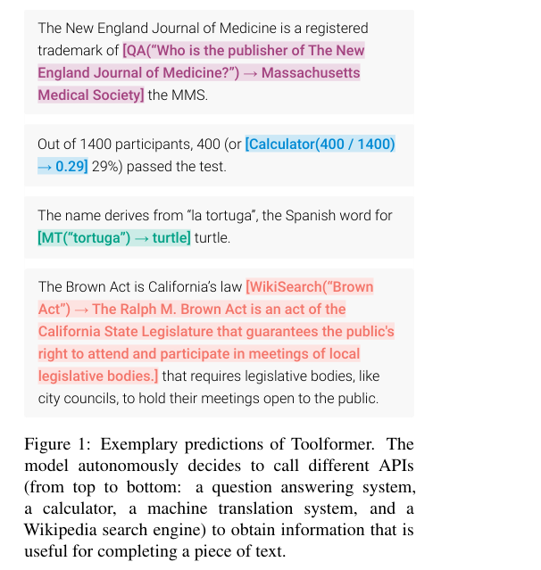
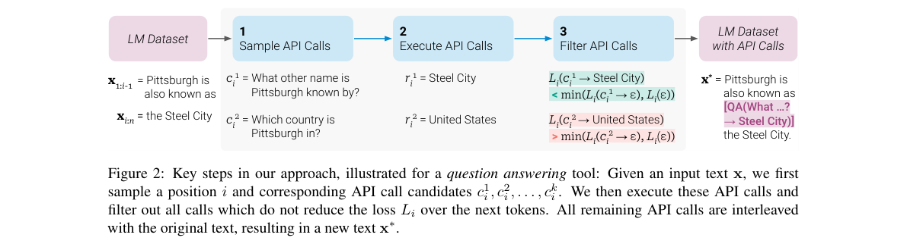
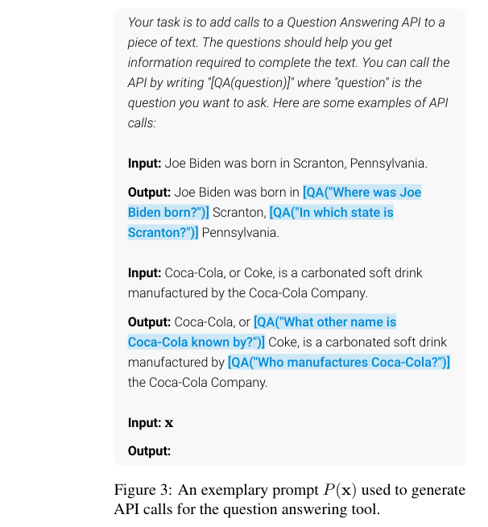
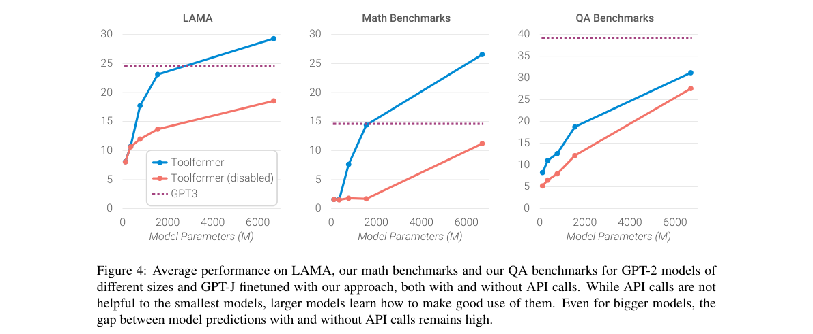

# Toolformer: Language Models Can Teach Themselves to Use Tools

저자 :

Timo Schick, Jane Dwivedi-Yu, Roberto Dessì, Roberta Raileanu, Maria Lomeli, Luke Zettlemoyer, Nicola Cancedda, Thomas Scialom

Meta AI Research

Universitat Pompeu Fabra (Roberto Dessì)

발표 : NeurIPS 2023

논문 : [PDF](https://arxiv.org/pdf/2302.04761)

출처 : [https://arxiv.org/abs/2302.04761](https://arxiv.org/abs/2302.04761)

---

## 0. Summary

<p align='center'>

</p>

### 0.1. 문제 (Problem)

* 대형 언어 모델(LLM)은 몇 개의 예시만으로 새로운 태스크를 수행하는 놀라운 능력을 가지지만, 역설적으로 산수 계산, 최신 정보 조회, 날짜 인식 등 간단한 기능에서 훨씬 작은 모델보다 떨어지는 성능을 보인다.
* 기존의 외부 도구 활용 접근법은 두 가지 한계 중 하나를 갖는다: (a) 도구 사용 방법을 알려주는 대량의 인간 어노테이션이 필요하거나, (b) 특정 태스크에 한정된(task-specific) 방식으로만 도구를 쓸 수 있어 범용성이 없다.
* 언제, 어떤 도구를 써야 하는지 모델 스스로 결정하고 학습하는 자기지도(self-supervised) 방식이 없었다.

### 0.2. 핵심 아이디어 (Core Idea)

* **자기지도 API 호출 데이터 생성**: 모델 스스로 텍스트에 API 호출을 삽입하고, 그것이 실제로 도움이 되는지 퍼플렉시티(perplexity, 모델이 다음 토큰을 얼마나 잘 예측하는지 나타내는 지표)를 기준으로 필터링한다. "API 호출이 있을 때 손실이 줄어드는가?"를 통과한 경우만 훈련 데이터로 쓰는 것이 핵심이다.
  * 비유: 도서관 사서가 책을 쓰면서 "이 문장을 완성하려면 사전을 찾아봐야 한다" → 사전을 찾아봄 → 실제로 글이 더 잘 완성되면 그 과정을 기록. 그러지 않으면 기록 안 함.
* **API 호출 표현 방식**: API 호출을 특수 토큰 `<API>`, `</API>`, `→`로 텍스트 안에 자연스럽게 삽입한다. 예: `[QA("What is the capital of France?") → Paris]`. 기존 어휘(vocabulary)를 수정할 필요가 없다.
  * 비유: 문장 안에 각주를 다는 것처럼, LM이 생성하는 텍스트 흐름을 잠시 멈추고 외부 정보를 끌어온 뒤 이어 쓴다.
* **필터링 기준 (가장 중요한 아이디어)**: API 호출 결과 $r$이 있을 때의 손실 $L^+_i$가 API 호출이 없거나 결과 없이 호출만 했을 때의 손실 $L^-_i$보다 임계값 $\tau_f$ 이상 낮을 때만 해당 호출을 보존한다.

$$L^-_i - L^+_i \geq \tau_f$$

  여기서 $L^+_i$는 API 호출과 결과를 모두 제공했을 때의 가중 크로스 엔트로피 손실이고, $L^-_i$는 호출이 없거나 결과 없이 호출만 한 경우의 최솟값이다. 이 기준은 "API 호출이 정말 유용할 때만 쓴다"는 원칙을 수식으로 구현한 것이다.
* **범용 도구 학습**: 계산기, Q&A 시스템, 위키피디아 검색, 번역 시스템, 캘린더 등 5가지 도구를 동일한 파이프라인으로 학습시키며, 특정 태스크에 묶이지 않고 모델이 스스로 어떤 도구를 쓸지 결정한다.

### 0.3. 효과 (Effects)

* 언어 모델이 기존 언어 모델링 능력을 잃지 않으면서 외부 도구를 자율적으로 활용할 수 있게 된다.
* 사람이 직접 API 사용 예시를 작성하는 비용을 최소화(도구당 몇 개의 데모만 필요)할 수 있다.
* 6.7B 파라미터 모델(GPT-J 기반)이 175B 파라미터 GPT-3를 여러 태스크에서 앞서는 성능을 달성한다.

### 0.4. 결과 (Results)

* **사실 질의(LAMA)**: Toolformer가 GPT-J 최고 기준선 대비 SQuAD +11.7p, Google-RE +5.2p, T-REx +18.6p 향상. GPT-3 (175B)도 제쳤다.
* **수학 추론**: ASDiv 40.4%, SVAMP 29.4%, MAWPS 44.0%로 GPT-3 (175B)의 각각 14.0%, 10.0%, 19.8%를 크게 상회.
* **질의응답(WebQS/NQ/TriviaQA)**: 동급 크기 모든 기준선을 상회. GPT-3 (175B)에는 뒤처짐(WebQS 26.3 vs 29.0).
* **언어 모델링 품질 보존**: API 호출 비활성화 시 WikiText/CCNet 퍼플렉시티가 GPT-J + CC와 동등(10.3/10.5) — 일반 언어 능력 유지.
* **스케일링 법칙**: 약 775M 파라미터 이상에서만 도구 활용 능력이 실질적으로 발현된다.

### 0.5. 상세 동작 방식 (How It Works)

전체 파이프라인은 세 단계의 데이터 생성 → 파인튜닝 → 추론으로 구성된다.

```
[언어 모델 M + 데이터셋 C]
        │
        ▼
 Step 1: API 호출 샘플링
  P(x) 프롬프트로 M이 텍스트 x의 각 위치 i에서
  <API> 토큰 생성 확률 p_i 계산
  → 임계값 τ_s 초과 위치에서 후보 API 호출 c^1_i ... c^k_i 생성
        │
        ▼
 Step 2: API 호출 실행
  각 후보 c^j_i 를 실제 API에 전달 → 결과 r^j_i 획득
  (계산기: Python 스크립트 / QA: Atlas 모델 / 검색: BM25+Wikipedia / 번역: NLLB / 캘린더: 시스템 날짜)
        │
        ▼
 Step 3: 유용한 호출 필터링
  L^-_i - L^+_i >= τ_f 조건 체크
  → 통과한 (c, r) 쌍만 텍스트에 삽입: x* = x_{1:i-1}, e(c,r), x_{i:n}
        │
        ▼
 Step 4: 증강 데이터셋 C* 생성 & 파인튜닝
  모든 API 도구의 통과 데이터를 합산 → C*
  M을 C*로 파인튜닝 (표준 언어 모델링 objective)
        │
        ▼
 Step 5: 추론 (Inference)
  일반 디코딩 진행 중 → <API> 토큰 생성 시
  디코딩 중단 → 해당 API 호출 → 결과 삽입 → 디코딩 재개
        │
        ▼
[최종 출력: 필요한 곳에 도구 결과가 삽입된 텍스트]
```

**Step 1 상세 — 샘플링**:
프롬프트 P(x)는 각 API 도구별로 수작업 작성된 몇 개의 시범 예시를 포함한다. M이 이 프롬프트를 보고 텍스트 x에 API 호출을 삽입한 버전을 생성한다. 각 위치 i에서 `<API>` 토큰의 생성 확률이 $\tau_s$(기본 0.05) 이상이면 후보 위치로 선정, 최대 $k=5$개 위치, 위치당 $m=5$개 후보를 샘플링한다.

**Step 3 상세 — 필터링**: 가중치 함수 $w_t = \max(0, 1-0.2t)$를 써서 API 호출 직후 토큰들의 손실에 더 높은 가중치를 부여한다. 이는 API 결과가 바로 인접한 텍스트에 실제로 도움이 되는 경우만 선별하기 위함이다.

**Step 5 상세 — 추론**: 표준 그리디 디코딩에서 `<API>` 토큰이 상위 $k=10$ 후보 안에 들면 API 호출을 시작한다($k=1$은 일반 그리디 디코딩). 무한 루프 방지를 위해 입력당 최대 1회 API 호출로 제한한다.

---

## 1. Introduction

대형 언어 모델(LLM)은 제로샷·퓨샷 설정에서 다양한 NLP 태스크를 놀라운 수준으로 수행한다(Brown et al., 2020; Chowdhery et al., 2022). 그러나 이런 모델들은 구조적으로 해결하기 어려운 한계를 가진다.

**LLM의 주요 한계점**:
* 최근 사건에 대한 정보 접근 불가 및 이와 연관된 사실 환각(hallucination) 경향
* 저자원 언어(low-resource language) 이해의 어려움
* 정확한 수치 계산을 위한 수학적 능력 부족
* 시간의 흐름(현재 날짜 등)에 대한 인식 부재

이러한 한계를 극복하는 간단한 방법은 LM에 검색 엔진, 계산기, 캘린더 같은 외부 도구를 사용하는 능력을 주는 것이다. 그러나 기존 접근법들은 대량의 인간 어노테이션에 의존하거나(Komeili et al., 2022; Thoppilan et al., 2022), 특정 태스크에만 도구를 쓸 수 있는 설정(Gao et al., 2022; Parisi et al., 2022)에 머물러 있었다.

Toolformer는 이 두 제약을 동시에 해결한다:
* **자기지도(self-supervised)** 방식으로 대규모 어노테이션 없이 학습
* 특정 태스크에 묶이지 않고 **범용적**으로 언제/어떤 도구를 쓸지 스스로 결정

핵심 아이디어는 in-context learning을 활용해 대규모 언어 모델링 데이터셋에 잠재적 API 호출을 자동으로 주석 달고, 이 중 실제로 다음 토큰 예측에 도움이 되는 것만 필터링하여 모델을 파인튜닝하는 것이다. 실험에서 Toolformer(6.7B, GPT-J 기반)는 GPT-3(175B)를 여러 태스크에서 앞질렀다.

---

## 2. Method

<p align='center'>

</p>

### API 호출 표현

각 API 호출 $c = (a_c, i_c)$는 API 이름 $a_c$와 입력 $i_c$의 튜플로 표현한다. 결과 $r$과 함께 텍스트에 다음과 같이 삽입된다:

$$e(c) = \text{<API>}\ a_c(i_c)\ \text{</API>}$$

$$e(c, r) = \text{<API>}\ a_c(i_c) \rightarrow r\ \text{</API>}$$

이 특수 토큰들은 기존 어휘(vocabulary)를 변경하지 않고 `" ["`, `"]"`, `"->"` 로 구현된다.

### API 호출 샘플링

각 API 도구마다 수작업 작성된 몇 개의 데모를 포함하는 프롬프트 $P(x)$를 사용한다. 텍스트 $x = x_1, \ldots, x_n$에서 각 위치 $i$에 대해:

$$p_i = p_M(\text{<API>}\ |\ P(x), x_{1:i-1})$$

샘플링 임계값 $\tau_s$보다 높은 위치 집합 $I = \{i | p_i > \tau_s\}$를 선정하고, 각 위치마다 최대 $m$개의 API 호출 후보를 샘플링한다.

<p align='center'>

</p>

### API 호출 필터링

위치 $i$에서의 API 호출 $c_i$와 결과 $r_i$에 대해 가중 크로스 엔트로피 손실을 다음과 같이 정의한다:

$$L_i(z) = -\sum_{j=i}^{n} w_{j-i} \cdot \log p_M(x_j | z, x_{1:j-1})$$

가중치 함수 $\tilde{w}_t = \max(0, 1 - 0.2t)$는 정규화하여 $w_t = \tilde{w}_t / \sum_{s \in \mathbb{N}} \tilde{w}_s$로 사용한다. 이를 통해 API 결과가 직후 토큰 예측에 더 직접적으로 도움이 되는 경우를 우선한다.

두 손실을 비교한다:

$$L^+_i = L_i(e(c_i, r_i)), \quad L^-_i = \min(L_i(\varepsilon), L_i(e(c_i, \varepsilon)))$$

필터링 임계값 $\tau_f$ 이상의 손실 감소가 있는 경우만 보존한다:

$$L^-_i - L^+_i \geq \tau_f$$

### 모델 파인튜닝

필터링을 통과한 API 호출들을 원본 텍스트에 삽입하여 증강 데이터셋 $C^*$를 구성한다. $C^*$는 $C$의 텍스트를 그대로 포함하므로 파인튜닝 후에도 언어 모델링 능력이 보존된다. 훈련 설정: 배치 크기 128, 학습률 $1 \times 10^{-5}$, 선형 워밍업 10%, DeepSpeed ZeRO-3, 8× A100 40GB, BF16, 최대 2k 스텝.

### 도구 목록

| 도구 | 구현 | 용도 |
|------|------|------|
| 질의응답(QA) | Atlas (Izacard et al., 2022) | 사실 조회 |
| 계산기(Calculator) | Python 스크립트 (4칙 연산) | 수치 계산 |
| 위키피디아 검색(WikiSearch) | BM25 + KILT Wikipedia dump | 정보 검색 |
| 번역(MT) | NLLB 600M (200개 언어) | 다국어 이해 |
| 캘린더(Calendar) | 시스템 날짜 조회 | 시간 인식 |

---

## 3. Experiments

### 실험 설정

* **베이스 모델**: GPT-J (6.7B) 기반
* **데이터셋**: CCNet 서브셋 $C$ (언어 모델링용)
* **제로샷 평가**: 태스크별 in-context 예시 없이 자연어 프롬프트만 사용
* **비교 모델**: GPT-J, GPT-J+CC, Toolformer (비활성화), Toolformer, OPT (66B), GPT-3 (175B)

<p align='center'>

</p>

### 주요 결과

**LAMA (사실 질의)**:

| 모델 | SQuAD | Google-RE | T-REx |
|------|-------|-----------|-------|
| GPT-J | 17.8 | 4.9 | 31.9 |
| GPT-J + CC | 19.2 | 5.6 | 33.2 |
| Toolformer (disabled) | 22.1 | 6.3 | 34.9 |
| **Toolformer** | **33.8** | **11.5** | **53.5** |
| OPT (66B) | 21.6 | 2.9 | 30.1 |
| GPT-3 (175B) | 26.8 | 7.0 | 39.8 |

Toolformer는 QA 도구를 98.1%의 예시에서 자율적으로 선택하여 GPT-3 (175B)를 명확히 앞선다.

**수학 추론 (ASDiv / SVAMP / MAWPS)**:

| 모델 | ASDiv | SVAMP | MAWPS |
|------|-------|-------|-------|
| GPT-J | 7.5 | 5.2 | 9.9 |
| **Toolformer** | **40.4** | **29.4** | **44.0** |
| GPT-3 (175B) | 14.0 | 10.0 | 19.8 |

97.9%의 예시에서 계산기 도구를 사용하여 GPT-3 (175B)의 2~3배 수준을 달성.

**질의응답 (WebQS / NQ / TriviaQA)**:

| 모델 | WebQS | NQ | TriviaQA |
|------|-------|-----|---------|
| GPT-J | 18.5 | 12.8 | 43.9 |
| **Toolformer** | 26.3 | 17.7 | 48.8 |
| GPT-3 (175B) | 29.0 | 22.6 | 65.9 |

동급 모델 중 최고 성능이지만 GPT-3 (175B)에는 미달 — 검색 엔진 품질과 단일 API 호출 제한이 원인으로 분석.

**시간적 질의 (TEMPLAMA / DATESET)**:

| 모델 | TEMPLAMA | DATESET |
|------|----------|---------|
| GPT-J | 13.7 | 3.9 |
| **Toolformer** | 16.3 | **27.3** |
| GPT-3 (175B) | 15.5 | 0.8 |

DATESET에서는 캘린더 도구(54.8% 사용)를 활용하여 압도적 성능.

### 스케일링 분석

GPT-2 계열 124M ~ 1.6B 모델로 분석한 결과, **약 775M 파라미터 이상에서야 도구 활용 능력이 실질적으로 발현**된다. 소형 모델은 도구를 써도 성능 개선이 없다.

### 디코딩 전략 분석

greedy decoding ($k=1$)에서는 T-REx에서만 API 호출이 유효하고 WebQS에서는 거의 호출 안 함(8.5%). $k=10$으로 설정 시 T-REx 98.1%, WebQS 100% 호출률 달성. $k=1$ 시 모델이 실제로 필요한 경우(평균보다 낮은 성능 예시)를 어느 정도 선별하는 캘리브레이션이 관찰되었으나 $k$가 커지면 이 특성이 사라진다.

---

## 4. Conclusion

Toolformer는 언어 모델이 자기지도 방식으로 외부 도구 사용법을 학습하는 최초의 범용 프레임워크를 제안했다. 퍼플렉시티 기반 필터링이라는 단순하고 우아한 기준으로, 6.7B 파라미터 모델이 175B GPT-3를 다수의 벤치마크에서 앞서는 결과를 달성했다.

한계점으로는 (1) 도구 체이닝 불가 (각 API 호출이 독립 생성), (2) 인터랙티브 도구 사용 불가 (검색 결과 브라우징이나 쿼리 재구성 없음), (3) 입력 표현에 민감한 도구 호출 결정, (4) 계산기 등 일부 도구에서 샘플 비효율성(100만+ 문서 처리 시 유용한 호출이 수천 건에 불과)이 있다. 이후 ReAct, ToolLLM, Gorilla 등 후속 연구들이 이 한계들을 해결하는 방향으로 발전했다.

**Summary 저자 코멘트**: Toolformer는 "도구를 쓸지 말지"를 사람이 정해주지 않고 모델이 스스로 학습하게 한 최초의 시도로, 이후 Tool Augmented LLM 연구 전체의 토대가 되었다. 손실 기반 필터링이라는 아이디어는 간단하지만 강력하며, 이 파이프라인이 현대 Agentic AI 시스템에서 도구 사용 능력의 원형(prototype)으로 자리잡았다.

---

## 부록: 사전 지식 (Prerequisites)

### A.1. 알아야 할 핵심 개념

- **GPT/자기회귀 언어 모델 (Autoregressive Language Model)** — 이전 토큰들로부터 다음 토큰을 예측하는 방식으로 훈련되는 언어 모델. Toolformer의 기반(GPT-J)이 이 방식.
  - 본문 위치: §2, §4.1 (GPT-J, GPT-2 계열 실험 전체)

- **퍼플렉시티 (Perplexity, PPL)** — 언어 모델이 텍스트를 얼마나 잘 예측하는지 측정하는 지표. 낮을수록 좋음. Toolformer에서 API 호출 유용성을 판단하는 핵심 기준으로 사용.
  - 본문 위치: §2 (필터링 기준), §4.3 (언어 모델링 보존 검증)

- **In-Context Learning (ICL)** — 모델 파라미터 업데이트 없이 프롬프트 안에 몇 가지 예시(few-shot)를 넣어주는 것만으로 새로운 태스크를 수행하는 능력. Toolformer에서 API 호출 후보 샘플링에 사용.
  - 본문 위치: §2 "Sampling API Calls", §1 Introduction

- **자기지도 학습 (Self-Supervised Learning)** — 레이블 없이 데이터 자체의 구조를 이용해 학습 신호를 만드는 방법. Toolformer는 API 호출의 유용성을 모델 자신의 손실로 판단하여 어노테이션 없이 훈련.
  - 본문 위치: §1, §2 전체

- **크로스 엔트로피 손실 (Cross-Entropy Loss)** — 모델 예측 분포와 실제 레이블 분포 사이의 차이. $L_i(z)$가 이 손실로 정의되며, API 호출 필터링의 핵심 수식.
  - 본문 위치: §2 "Filtering API Calls"

- **파인튜닝 (Fine-tuning)** — 사전학습된 모델을 특정 데이터셋에 추가 학습시키는 것. Toolformer는 API 호출이 삽입된 $C^*$로 GPT-J를 파인튜닝.
  - 본문 위치: §2 "Model Finetuning", §4.1

- **BM25 (Best Match 25)** — 키워드 기반 정보 검색 알고리즘. TF-IDF의 개선 버전. Toolformer의 WikiSearch 도구에 사용.
  - 본문 위치: §3 "Wikipedia Search"

- **제로샷 (Zero-Shot) 평가** — 모델에게 태스크 수행 예시를 전혀 주지 않고 자연어 지시만으로 평가. Toolformer 전체 실험의 핵심 평가 설정.
  - 본문 위치: §4.2 전체

- **스케일링 법칙 (Scaling Laws)** — 모델 크기(파라미터 수)에 따른 성능 변화 패턴. Toolformer에서 도구 활용 능력이 약 775M 이상에서만 발현됨을 분석.
  - 본문 위치: §4.4

### A.2. 먼저 읽으면 좋은 논문

1. **[2020][GPT-3] Language Models are Few-Shot Learners** ([arxiv](https://arxiv.org/abs/2005.14165)) — Brown et al., NeurIPS 2020
   - 한 줄 설명: GPT-3를 통해 in-context learning의 강력함을 처음 대규모로 보인 논문.
   - **왜?** Toolformer가 베이스라인으로 직접 비교하며, in-context learning 기반 API 샘플링 아이디어의 직접적 토대. 논문 곳곳에 Brown et al., 2020이 인용됨.

2. **[2021][GPT-J] GPT-J-6B: A 6 Billion Parameter Autoregressive Language Model** ([github](https://github.com/kingoflolz/mesh-transformer-jax)) — Wang & Komatsuzaki, 2021
   - 한 줄 설명: Toolformer의 기반 모델인 GPT-J 6B에 대한 기술 보고서.
   - **왜?** Toolformer는 GPT-J를 파인튜닝한 모델이므로, 기반 모델의 특성을 이해하는 것이 결과 해석에 필수.

3. **[2022][TALM] Tool Augmented Language Models** ([arxiv](https://arxiv.org/abs/2205.12255)) — Parisi et al., 2022
   - 한 줄 설명: 계산기와 검색 엔진 도구 사용을 self-supervised로 학습시킨 선행 연구.
   - **왜?** Toolformer가 "가장 밀접하게 관련된 선행 연구"로 직접 언급. 차이점(task-specific vs. general)을 이해하려면 필독.

4. **[2022][Atlas] Atlas: Few-Shot Learning with Retrieval Augmented Language Models** ([arxiv](https://arxiv.org/abs/2208.03299)) — Izacard et al., 2022
   - 한 줄 설명: 대규모 검색 보강 언어 모델로 퓨샷 학습 성능을 높인 논문.
   - **왜?** Toolformer의 QA 도구가 Atlas를 직접 사용하며, 주요 비교 대상이기도 함.

5. **[2022][ReAct] ReAct: Synergizing Reasoning and Acting in Language Models** ([arxiv](https://arxiv.org/abs/2210.03629)) — Yao et al., 2022
   - 한 줄 설명: 언어 모델이 추론(Reasoning)과 행동(Acting, 도구 사용)을 교차하며 수행하는 프레임워크.
   - **왜?** Toolformer가 참고문헌으로 인용하며, 이후 Agentic AI의 핵심 방법론 중 하나. Toolformer의 한계(단일 호출)를 ReAct가 체이닝으로 확장함.

### A.3. 관련/후속 논문

- **[2023][ToolLLM] ToolLLM: Facilitating Large Language Models to Master 16000+ Real-world APIs** ([arxiv](https://arxiv.org/abs/2307.16789)) — Qin et al., 2023 — Toolformer를 확장해 수만 개의 실제 API를 LLM이 활용하도록 하는 후속 연구. depth-first search 기반 다중 호출 가능.

- **[2023][Gorilla] Gorilla: Large Language Model Connected with Massive APIs** ([arxiv](https://arxiv.org/abs/2305.15334)) — Patil et al., 2023 — API 문서 검색을 통해 정확한 API 호출을 생성하는 특화 LLM.

- **[2023][ART] Automatic Reasoning and Tool-use** ([arxiv](https://arxiv.org/abs/2303.09014)) — Paranjape et al., 2023 — 추론과 도구 사용을 자동화하여 few-shot 데모 없이도 작동하는 프레임워크.

- **[2024][Adaptive-RAG]** — 질의 복잡도에 따라 검색 전략을 동적으로 선택하는 RAG 접근법.
  - **Repo 내 정리**: `Agentic_AI/[논문][2024][Summary][Adaptive-RAG] Adaptive-RAG - Learning to Adapt Retrieval-Augmented Large Language Models through Question Complexity.md`
