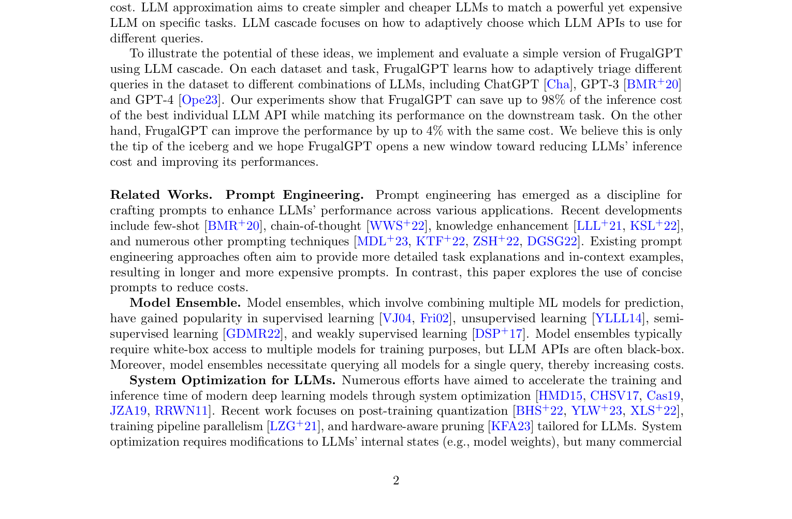
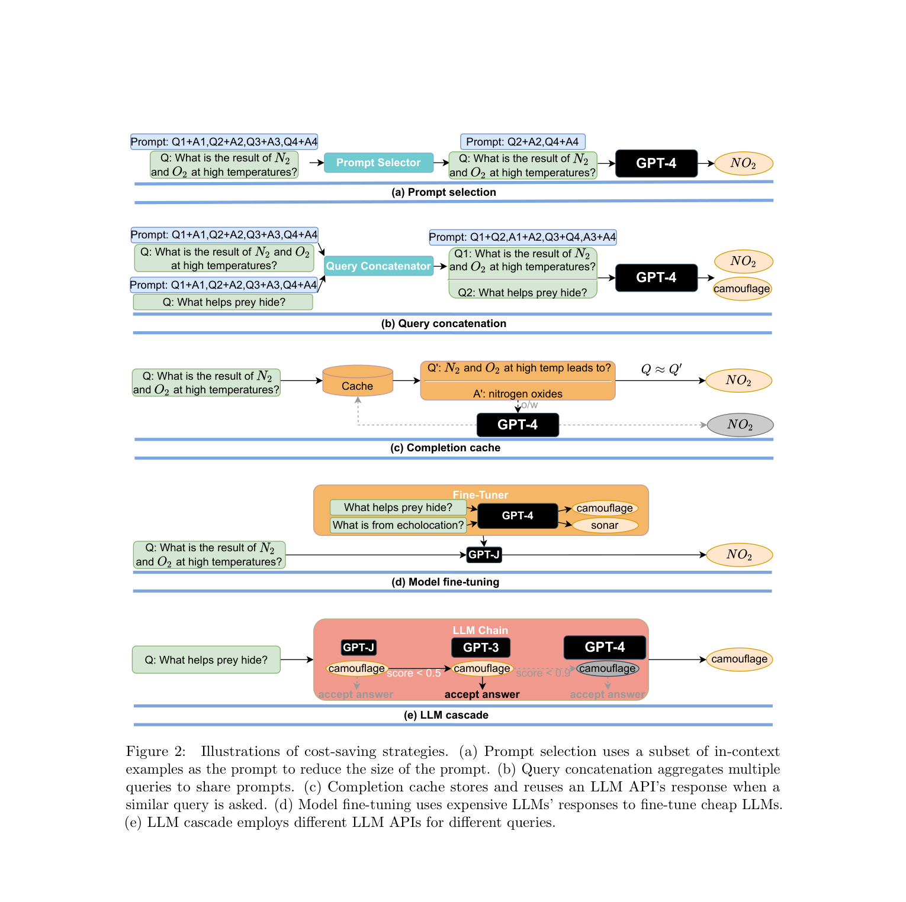
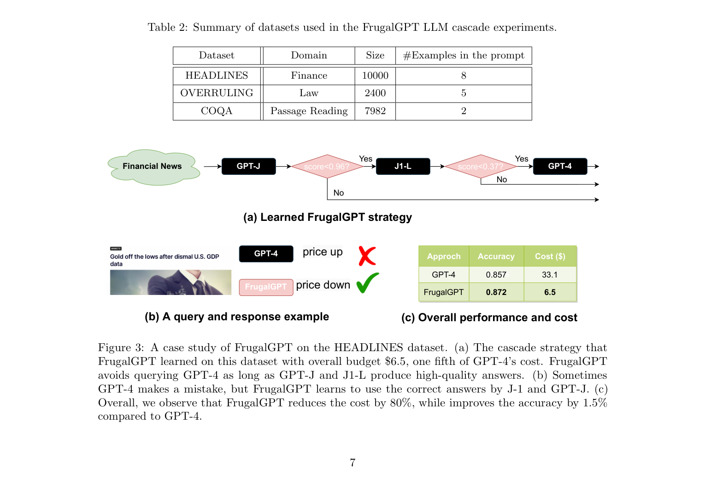
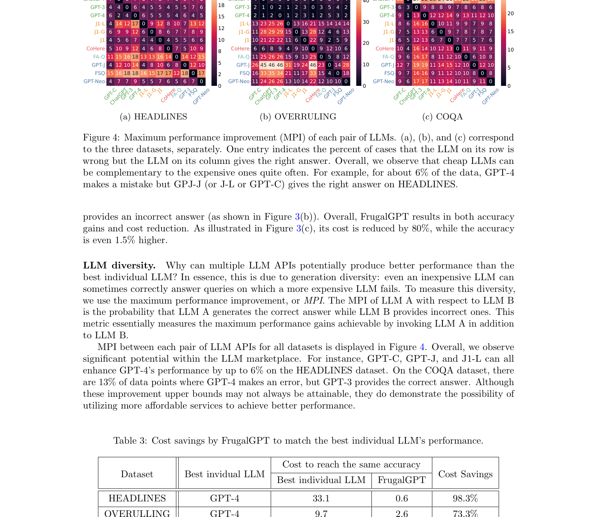
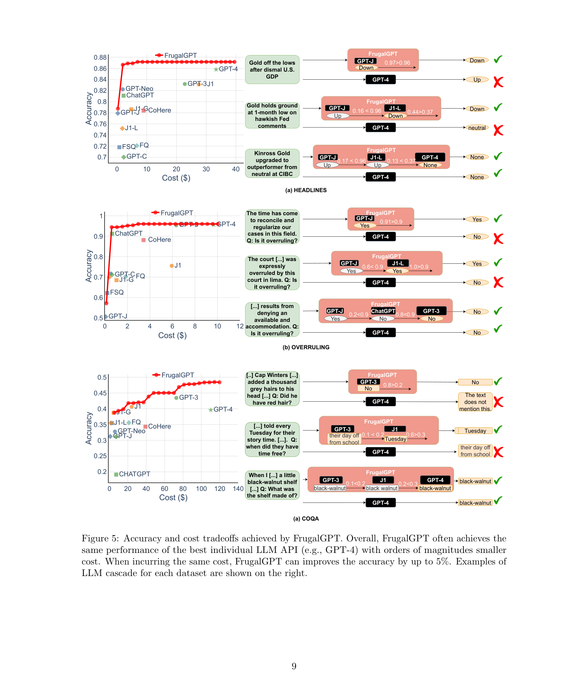

# FrugalGPT: How to Use Large Language Models While Reducing Cost and Improving Performance

저자 :

Lingjiao Chen, Matei Zaharia, James Zou

Stanford University

발표 : arXiv 2023 (2023년 5월)

논문 : [PDF](https://arxiv.org/pdf/2305.05176)

출처 : [https://arxiv.org/abs/2305.05176](https://arxiv.org/abs/2305.05176)

---

## 0. Summary

<p align='center'>

</p>

### 0.1. 문제 (Problem)

* LLM API(GPT-4, ChatGPT, J1-Jumbo 등)는 놀라운 성능을 제공하지만, **대규모 쿼리 처리 시 비용이 폭발적으로 증가**한다. GPT-4의 고객 서비스 운영 비용은 월 $21,000 이상에 달할 수 있으며, ChatGPT 운영 비용은 하루 $700,000이 넘는다.
* 12개 상용 LLM API를 비교한 결과, **동일 10M 토큰 처리 비용이 최대 100배(2 orders of magnitude) 차이**가 난다(GPT-J $0.2 vs GPT-4 $30).
* 단순히 가장 저렴한 LLM만 사용하면 **어려운 쿼리에서 성능이 크게 저하**되고, 가장 좋은 LLM(GPT-4)만 사용하면 간단한 쿼리에도 불필요한 비용이 소모된다.
* 기존 모델 앙상블은 LLM 내부 가중치에 대한 화이트박스 접근이 필요하거나, 모든 모델을 매 쿼리마다 호출해 비용을 오히려 증가시킨다.

### 0.2. 핵심 아이디어 (Core Idea)

* **핵심 한 줄**: 쿼리가 들어오면 **저렴한 LLM부터 순차적으로 시도하고, 신뢰도 점수가 충분히 높으면 거기서 멈추는 LLM Cascade** 방식으로 비용을 최소화하면서 정확도를 유지하거나 개선한다.

* **(1) 세 가지 비용 절감 전략**
  * **Prompt Adaptation**: 프롬프트 길이를 줄여 비용 절감. (a) 프롬프트 선택 — few-shot 예시 중 일부만 유지, (b) 쿼리 연결 — 여러 쿼리를 하나의 프롬프트로 묶어 중복 처리 방지.
  * **LLM Approximation**: 비싼 LLM을 저렴한 모델로 근사. (a) Completion Cache — 유사 쿼리의 응답을 캐시해 재사용, (b) Model Fine-tuning — 비싼 LLM의 응답으로 저렴한 LLM을 파인튜닝.
  * **LLM Cascade**: LLM API를 순차적으로 호출하되, 각 단계에서 신뢰도 점수가 임계값을 넘으면 즉시 응답. 가장 저렴한 LLM이 먼저 시도되어 쿼리 비용을 최소화.

* **(2) LLM Cascade의 핵심 구성 요소**
  * **Generation Scoring Function** g(q, a) ∈ [0,1]: 쿼리-응답 쌍이 주어졌을 때 해당 응답의 신뢰도를 예측하는 회귀 모델. DistilBERT를 회귀로 파인튜닝하여 사용. LLM API보다 훨씬 작아 scoring 비용이 전체 비용에 미치는 영향이 미미하다.
  * **LLM Router**: m개의 LLM API를 선택해 순서를 정하고, 각 단계의 임계값 τ를 학습하는 최적화 문제. 예산 제약 조건 하에 정확도를 최대화.
  * 비유: 콜센터에서 간단한 문의는 ARS나 신입 직원이 처리하고, 복잡한 문의만 전문가에게 에스컬레이션하는 방식.

* **(3) LLM 다양성(Diversity)의 활용**
  * 비싼 LLM도 특정 쿼리에서는 실수를 하며, 저렴한 LLM이 그 쿼리에서 오히려 정답을 맞히는 경우가 상당히 많다.
  * **MPI(Maximum Performance Improvement)** 지표: LLM A가 LLM B의 오답 쿼리에서 정답을 맞히는 비율. HEADLINES에서 GPT-J가 GPT-4의 오답 중 6%를 맞히며, COQA에서는 GPT-3이 GPT-4 오답의 13%를 정정한다.
  * Cascade는 이 다양성을 활용해 단일 최고 모델보다도 높은 정확도를 달성할 수 있다.

### 0.3. 효과 (Effects)

* 기존 LLM API 코드를 수정하지 않고 **블랙박스 방식으로 여러 API 위에 FrugalGPT를 올려서** 비용-정확도 최적화를 수행.
* 비싼 LLM(GPT-4 등)은 저렴한 LLM들이 처리하기 어렵다고 판단한 쿼리에만 호출되어 **비용을 선택적으로 집중 투자**.
* 하나의 프레임워크로 세 전략을 조합(예: prompt selection + LLM cascade)하면 추가 비용 절감 가능.

### 0.4. 결과 (Results)

* **HEADLINES(금융 뉴스)**: GPT-4 비용의 1/5인 $6.5 예산으로 GPT-4보다 **1.5% 높은 정확도** 달성(정확도 0.857 → 0.872). 최종 GPT-4 동등 성능 매칭 시 **98.3% 비용 절감**(비용 $0.6 vs $33.1). 같은 비용을 쓸 경우 Figure 5 기준 최대 5% 정확도 개선.
* **OVERRULING(법률 문서)**: GPT-4 대비 **73.3% 비용 절감**($2.6 vs $9.7)하면서 정확도 1% 개선.
* **COQA(독해 QA)**: GPT-3 대비 **59.2% 비용 절감**($29.6 vs $72.5)하면서 GPT-3과 동등한 정확도.
* 전체적으로 FrugalGPT는 단일 최고 모델 성능의 **Pareto 경계(성능-비용 tradeoff 최전선)** 를 지속적으로 능가한다.

**한 줄 commentary**: "어떤 쿼리에 어떤 LLM을 쓸 것인가"라는 실용적 질문에 수식화된 최적화 프레임워크로 답하며, LLM 생태계의 이질성(heterogeneity)을 낭비가 아닌 자원으로 전환하는 발상이 인상적이다. 2023년 시점의 특정 API 가격에 의존하는 한계가 있지만, 프레임워크 자체는 가격이 계속 변하는 현재에도 적용 가능한 범용적 구조다.

### 0.5. 상세 동작 방식 (How It Works)

**LLM Cascade 동작 흐름**:

```
[쿼리 q]
   │
   ▼
[첫 번째 LLM (가장 저렴, e.g. GPT-J)]
   │
   ├── g(q, answer) ≥ τ₁ ──→ [응답 반환]  (비용 최소)
   │
   ▼ (점수 부족)
[두 번째 LLM (중간, e.g. J1-L)]
   │
   ├── g(q, answer) ≥ τ₂ ──→ [응답 반환]  (중간 비용)
   │
   ▼ (점수 부족)
[세 번째 LLM (최고, e.g. GPT-4)]
   │
   └── [응답 반환]  (최대 비용, 최대 정확도)
```

**HEADLINES 케이스 스터디** (예산 $6.5 = GPT-4 비용의 1/5):
- 학습된 Cascade: GPT-J(임계값 0.96) → J1-L(임계값 0.37) → GPT-4
- "Gold off the lows after dismal U.S. GDP data" → GPT-J 점수 0.97 ≥ 0.96 → GPT-J가 "Down" 정답 반환 (GPT-4는 오답 "Up")
- 대부분의 쿼리를 GPT-J, J1-L이 처리하고 GPT-4는 가장 어려운 쿼리에만 투입

**최적화 문제** (혼합 정수 최적화):
```
max_{L,τ}  E[r(a, f_{L_z}(q))]
s.t.  E[Σ_{i=1}^z cost(L_i, q)] ≤ b
      z = argmin_i { g(q, f_{L_i}(q)) ≥ τ_i }
```
- 탐색 공간 가지치기(응답 불일치가 작은 LLM 조합 제거)
- 소수 샘플 보간으로 목적 함수 근사

---

## 1. Introduction

대규모 LLM 서비스 사용 비용이 급격히 증가하면서, 실용적인 LLM 활용을 위한 비용-정확도 최적화가 핵심 과제로 부상했다. 저자들은 12개 상용 LLM API의 가격 구조를 분석해 최대 100배의 가격 차이를 확인하고, 이를 체계적으로 활용하는 세 가지 전략(Prompt Adaptation, LLM Approximation, LLM Cascade)을 제시한다.

FrugalGPT는 그 중 LLM Cascade의 구체적 구현체로, 데이터 적응형으로 각 쿼리에 맞는 LLM 조합을 선택해 비용 대비 최고 성능을 달성한다. 세 가지 실세계 태스크(금융 뉴스 분류, 법률 문서 판별, 독해 QA)에서 검증해 GPT-4와 동등한 성능을 최대 98% 적은 비용으로 달성할 수 있음을 보인다.

## 2. 문제 설정 (Scope and Problem Statement)

**LLM 마켓플레이스**: K개의 LLM API {f_i(·)}_{i=1}^K. 각 API의 비용:

$$c_i(p) = \tilde{c}_{i,2}\|f_i(p)\| + \tilde{c}_{i,1}\|p\| + \tilde{c}_{i,0}$$

(출력 길이 비례 + 입력 길이 비례 + 고정 비용)

**목표 함수** (예산 제약 하 성능 최대화):

$$\max_s \; \mathbb{E}_{(q,a)\in Q \times A}[r(a, \hat{a}(s,q))]$$
$$\text{s.t.} \quad \mathbb{E}_{(q,a)\in Q \times A}[c(s,q)] \leq b$$

**12개 LLM API 가격 비교** (2023년 3월 기준):

| 제공자 | API | 크기(B) | 10M 입력 ($) | 10M 출력 ($) |
|--------|-----|---------|-------------|-------------|
| OpenAI | GPT-4 | N/A | 30 | 60 |
| OpenAI | GPT-3 | 175 | 20 | 20 |
| OpenAI | ChatGPT | N/A | 2 | 2 |
| OpenAI | GPT-Curie | 6.7 | 2 | 2 |
| AI21 | J1-Jumbo | 178 | 0 | 5 |
| AI21 | J1-Grande | 17 | 0 | 5.8 |
| AI21 | J1-Large | 7.5 | 0 | 10 |
| Cohere | Xlarge | 52 | 10 | 15 |
| ForeFrontAI | QA | 16 | 5.8 | 35 |
| Textsynth | GPT-J | 6 | 0.2 | 5 |
| Textsynth | FAIRSEQ | 13 | 0.6 | 15 |
| Textsynth | GPT-Neox | 20 | 1.4 | 35 |

## 3. 세 가지 비용 절감 전략

<p align='center'>

</p>

### 3.1. Strategy 1: Prompt Adaptation

프롬프트 길이를 줄여 비용을 줄이는 전략. LLM API 비용이 입력 토큰 수에 선형 비례하므로, 프롬프트를 압축하면 직접적인 절감으로 이어진다.

**방법 (a) Prompt Selection**: Few-shot 예시 전체가 아닌 일부만 선택해 프롬프트 크기를 줄임. 어떤 예시를 유지할지가 핵심 도전 과제.

**방법 (b) Query Concatenation**: 동일 프롬프트로 여러 쿼리를 동시에 처리. 개별 처리 시 매번 전송되는 중복 프롬프트 비용 제거.

### 3.2. Strategy 2: LLM Approximation

비싼 LLM을 저렴한 모델로 대체하거나 근사하는 전략.

**방법 (a) Completion Cache**: 이전 응답을 데이터베이스에 캐시. 새 쿼리 입력 시 유사 쿼리가 있으면 캐시에서 응답. 반복적인 유사 쿼리가 많을 때(예: 검색 엔진) 큰 효과.

**방법 (b) Model Fine-tuning**: 비싼 LLM의 응답으로 작은 LLM을 파인튜닝. 세 단계: (1) 비싼 LLM으로 소수 쿼리 응답 수집, (2) 수집한 응답으로 저렴한 모델 파인튜닝, (3) 파인튜닝된 모델 배포. 비용 절감과 함께 지연시간도 개선.

### 3.3. Strategy 3: LLM Cascade (FrugalGPT의 핵심)

서로 다른 LLM API들을 순차적으로 호출하되, 각 단계에서 응답 신뢰도가 충분하면 즉시 반환하는 전략.

**핵심 구성 요소**:
- **Generation Scoring Function** g(·,·): Q × A → [0,1]: 쿼리-응답 쌍의 신뢰도 점수. 회귀 모델(DistilBERT)로 학습
- **LLM Router**: m개 API의 순서 리스트 L ∈ [K]^m과 임계값 벡터 τ를 최적화

**최적화**:

$$\max_{L,\tau} \; \mathbb{E}[r(a, f_{L_z}(q))]$$

$$\text{s.t.} \quad \mathbb{E}\left[\sum_{i=1}^{z}\left(\tilde{c}_{L_i,2}\|f_{L_i}(q)\| + \tilde{c}_{L_i,1}\|q\| + \tilde{c}_{L_i,0}\right)\right] \leq b$$

$$z = \arg\min_{i} \{g(q, f_{L_i}(q)) \geq \tau_i\}$$

혼합 정수 최적화 문제이므로 두 가지 효율화: (1) 응답 불일치가 작은 LLM 조합 탐색 공간 제거, (2) 소수 샘플 보간으로 목적 함수 근사.

**전략 조합**: Prompt Selection + LLM Cascade = 각 쿼리에 대해 가장 작은 프롬프트와 가장 저렴한 LLM을 동시에 탐색하는 더욱 공격적인 비용 절감.

## 4. 실험 결과

### 4.1. 실험 설정

- **LLM API**: 5개 제공사 12개 API (OpenAI, AI21, CoHere, Textsynth, ForeFrontAI)
- **데이터셋**: HEADLINES(금융, 10K), OVERRULING(법률, 2.4K), COQA(독해, 7.98K)
- **Cascade 길이**: 3 (탐색 공간 단순화)
- **Scoring Function**: DistilBERT 회귀 파인튜닝

### 4.2. 케이스 스터디 및 비용 절감 결과

<p align='center'>

</p>

**Table 3: 비용 절감 요약**

| 데이터셋 | 최고 단일 LLM | 단일 LLM 비용 | FrugalGPT 비용 | 절감률 |
|---------|------------|-------------|---------------|-------|
| HEADLINES | GPT-4 | $33.1 | $0.6 | **98.3%** |
| OVERRULING | GPT-4 | $9.7 | $2.6 | **73.3%** |
| COQA | GPT-3 | $72.5 | $29.6 | **59.2%** |

### 4.3. LLM 다양성과 MPI

<p align='center'>

</p>

MPI(Maximum Performance Improvement) 히트맵: HEADLINES에서 GPT-C, GPT-J, J1-L이 GPT-4의 오답 중 최대 6%를 보정 가능. COQA에서 GPT-4 오답 중 13%를 GPT-3이 정정. 이는 저렴한 LLM이 비싼 LLM을 보완할 상당한 잠재력을 보여주며, LLM Cascade가 단일 최고 모델보다 우수해질 수 있는 이론적 근거가 된다.

### 4.4. 성능-비용 Tradeoff

<p align='center'>

</p>

- 모든 데이터셋에서 FrugalGPT가 Pareto 경계를 지배
- OVERRULING에서 GPT-4 대비 1% 정확도 향상 + 73% 비용 절감 동시 달성
- 비용 순위는 데이터셋에 따라 달라짐: J1은 HEADLINES에서 두 번째로 비싸지만 OVERRULING/COQA에서는 GPT-3이 더 비쌈 — 이는 J1이 출력 토큰만 과금하지만 GPT-3은 입/출력 모두 과금하는 이질적 가격 구조 때문. **최고 성능 API가 항상 최고 비용인 것은 아니다.**

## 5. 한계 및 미래 방향

**한계**:
1. Cascade 학습을 위한 레이블 데이터 필요
2. 학습 데이터와 테스트 데이터의 분포가 유사해야 함
3. Cascade 학습 자체에 초기 비용 발생 (쿼리 양이 충분히 많을 때 효율적)
4. Attention 연산 가속 등 일부 비용 절감 기법은 다루지 않음

**미래 방향**:
- 레이턴시, 공정성, 프라이버시, 환경 영향 등 다차원 최적화
- LLM 출력의 불확실성 정량화
- 지속적으로 변화하는 LLM 생태계에 적응하는 동적 프레임워크

---

## 부록: 사전 지식 (Prerequisites)

### A.1. 알아야 할 핵심 개념

- **LLM API 과금 구조 (LLM API Pricing)** — 상용 LLM API 비용은 대개 세 컴포넌트로 구성된다: (1) 입력 토큰 수에 비례하는 프롬프트 비용, (2) 출력 토큰 수에 비례하는 생성 비용, (3) 쿼리당 고정 비용. 제공사마다 과금 구조가 이질적이어서 동일 워크로드에도 최대 100배 차이가 난다.
  - 본문 위치: §2(Problem Statement, 비용 공식), Table 1(12개 API 가격 비교)

- **Few-shot In-Context Learning (ICL)** — LLM에 태스크 수행 예시 몇 개를 프롬프트에 포함시켜 추가 파인튜닝 없이 성능을 끌어올리는 기법. 예시 수가 많을수록 비용이 증가하므로, Prompt Selection 전략의 동기가 된다.
  - 본문 위치: §3.1(Prompt Selection 설명), Related Works(Prompt Engineering)

- **Chain-of-Thought (CoT) 프롬프팅** — 중간 추론 단계를 단계적으로 생성하게 하는 프롬프팅 기법. CoT 프롬프트는 일반 zero-shot 프롬프트보다 훨씬 길어 비용이 높다 — Prompt Adaptation의 절충 대상.
  - 본문 위치: §1(Figure 1b, CoT를 프롬프팅 전략의 하나로 언급), Related Works

- **모델 파인튜닝 (Model Fine-tuning)** — 비싼 LLM의 출력을 활용해 작고 저렴한 모델을 특정 태스크에 최적화하는 방법. LLM Approximation 전략의 핵심 인스턴스.
  - 본문 위치: §3.2(Model Fine-tuning, Figure 2d)

- **모델 Cascade / 조기 종료 (Model Cascade / Early Exit)** — 여러 모델을 복잡도 순으로 순차 호출하되, 현재 모델의 출력 신뢰도가 충분히 높으면 더 비싼 모델 호출을 생략하는 패러다임. Viola-Jones 얼굴 검출기(2004)나 정보 검색 시스템에서 먼저 쓰인 고전적 아이디어를 LLM API 맥락에 적용.
  - 본문 위치: §3.3(LLM Cascade 핵심 구성요소), Related Works([VJ04, WLM11] 인용)

- **FrugalML** — 이 논문 저자들의 선행 연구(Chen et al., 2020/2022). 예측 레이블 집합이 고정된 **분류 API** 환경에서 여러 ML API를 비용 효율적으로 결합하는 방법을 제안한 직접 선행 연구. FrugalGPT는 이를 자유 형식 텍스트를 생성하는 LLM으로 일반화한다.
  - 본문 위치: §1(Related Works, "FrugalML [CZZ20, CZZ22]"), Problem Statement

- **DistilBERT** — BERT를 지식 증류(knowledge distillation)로 압축한 소형 언어모델(약 66M 파라미터). FrugalGPT 구현에서 Generation Scoring Function으로 사용. LLM API보다 훨씬 저렴하므로 신뢰도 판정 비용이 cascade 전체 비용에 미치는 영향이 미미하다.
  - 본문 위치: §4(Case Study 설정, "DistilBERT tailored to regression as the scoring function")

- **혼합 정수 최적화 (Mixed-Integer Optimization)** — 연속 변수(임계값 τ)와 이산 변수(LLM 순서 L)가 섞인 최적화 문제. LLM Router 학습이 이 형태이며, 정확한 풀이는 계산 비용이 크므로 탐색 공간 가지치기와 보간 근사로 효율화한다.
  - 본문 위치: §3.3(Optimization problem 수식 및 solver 설명)

---

### A.2. 먼저 읽으면 좋은 논문

1. **[2020][FrugalML]** ([arXiv:2006.07512](https://arxiv.org/abs/2006.07512)) — *FrugalML: How to Use ML Prediction APIs More Accurately and Cheaply* (Chen, Zaharia, Zou, NeurIPS 2020)
   - 한 줄 설명: 고정된 레이블 집합이 있는 분류 태스크에서 여러 ML API를 비용 효율적으로 선택·조합하는 방법.
   - **왜?** FrugalGPT는 FrugalML의 직접적 후속 연구(동일 저자). FrugalML의 cascade 아이디어를 LLM의 자유 형식 텍스트 생성으로 확장한 것이 이 논문의 핵심 기여다. Problem Statement와 Related Works에서 명시적 비교 대상으로 반복 등장한다.

2. **[2020][GPT-3]** ([arXiv:2005.14165](https://arxiv.org/abs/2005.14165)) — *Language Models are Few-Shot Learners* (Brown et al., NeurIPS 2020)
   - 한 줄 설명: 175B 파라미터 LLM이 few-shot in-context learning만으로 광범위한 태스크를 수행할 수 있음을 보인 기념비적 논문.
   - **왜?** FrugalGPT 실험의 핵심 LLM API 중 하나(GPT-3, ChatGPT, GPT-4)이자, few-shot prompting의 표준 기반. Prompt Adaptation 전략이 다루는 비용-예시 수 tradeoff의 출발점.

3. **[2022][Chain-of-Thought]** ([arXiv:2201.11903](https://arxiv.org/abs/2201.11903)) — *Chain-of-Thought Prompting Elicits Reasoning in Large Language Models* (Wei et al., NeurIPS 2022)
   - 한 줄 설명: 중간 추론 단계를 예시로 제공하는 CoT 프롬프팅이 LLM의 복잡한 추론 능력을 대폭 향상시킴.
   - **왜?** Figure 1b에서 Prompt Adaptation이 최적화해야 할 프롬프팅 전략 유형 중 하나로 명시. CoT 프롬프트는 매우 길기 때문에 비용 절감의 핵심 타깃이다.

4. **[2004][Viola-Jones Cascade]** ([IJCV 2004](https://link.springer.com/article/10.1023/B:VISI.0000013087.49260.fb)) — *Robust Real-Time Face Detection* (Viola and Jones, IJCV 2004)
   - 한 줄 설명: 간단한 특징들을 cascade로 구성해 대부분의 음성 사례를 초반에 빠르게 필터링하는 고전적 얼굴 검출 알고리즘.
   - **왜?** LLM Cascade 아이디어의 개념적 원형. 논문은 Related Works에서 "[VJ04]"를 model cascade의 원조 선행 연구로 직접 인용한다.

5. **[2019][DistilBERT]** ([arXiv:1910.01108](https://arxiv.org/abs/1910.01108)) — *DistilBERT, a distilled version of BERT: smaller, faster, cheaper and lighter* (Sanh et al., 2019)
   - 한 줄 설명: 지식 증류로 BERT 크기를 40% 줄이면서 97% 성능을 유지하는 경량 사전훈련 언어모델.
   - **왜?** FrugalGPT 케이스 스터디에서 Generation Scoring Function 구현체로 직접 사용. 전체 LLM보다 훨씬 저렴한 모델이 신뢰도 평가를 담당함으로써 cascade 오버헤드를 최소화한다.

---

### A.3. 관련/후속 논문

- **[2023][LLM-Blender]** ([arXiv:2306.02561](https://arxiv.org/abs/2306.02561)) — *LLM-Blender: Ensembling Large Language Models with Pairwise Ranking and Generative Fusion*
  - 여러 LLM의 출력을 쌍별 비교(PairRanker)와 생성적 융합(GenFuser)으로 앙상블하는 방법. FrugalGPT의 LLM Cascade와 상호 보완적인 접근.

- **[2024][RouteLLM]** ([arXiv:2406.18665](https://arxiv.org/abs/2406.18665)) — *RouteLLM: Learning to Route LLMs with Preference Data*
  - 쿼리 복잡도에 따라 강한 모델과 약한 모델 중 하나를 선택하는 라우팅 프레임워크. FrugalGPT의 2-LLM cascade 아이디어를 선호도 데이터 학습으로 발전.

- **[2023][Speculative Decoding]** ([arXiv:2211.17192](https://arxiv.org/abs/2211.17192)) — *Fast Inference from Transformers via Speculative Decoding* (Leviathan et al., ICML 2023)
  - 작은 드래프트 모델이 토큰을 생성하고 큰 모델이 검증하는 방식으로 지연시간을 줄이는 기법. 단일 추론 파이프라인 내의 cascade로, FrugalGPT의 API 레벨 cascade와 보완적 관계.
