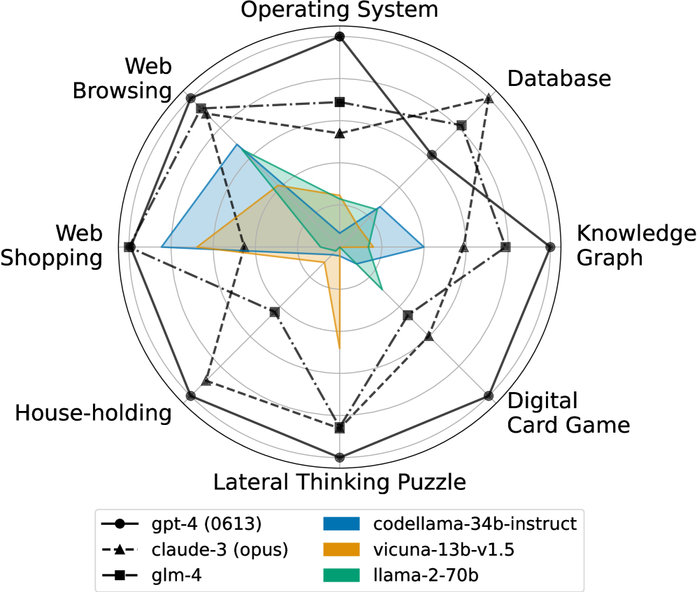
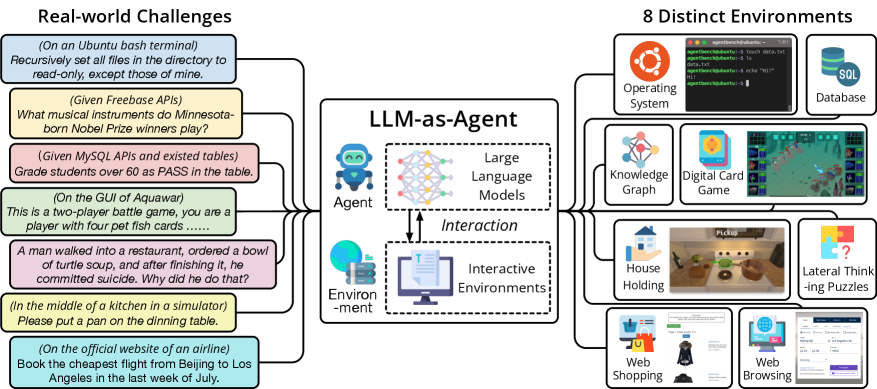
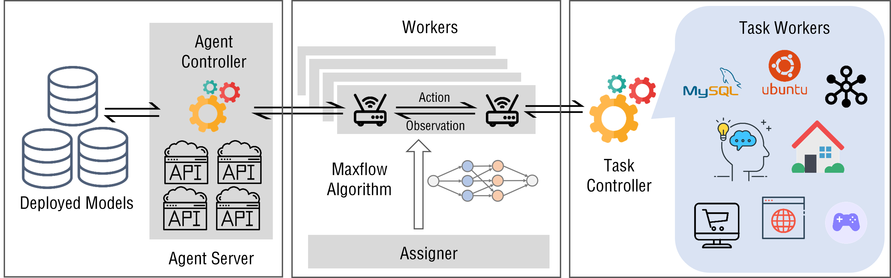
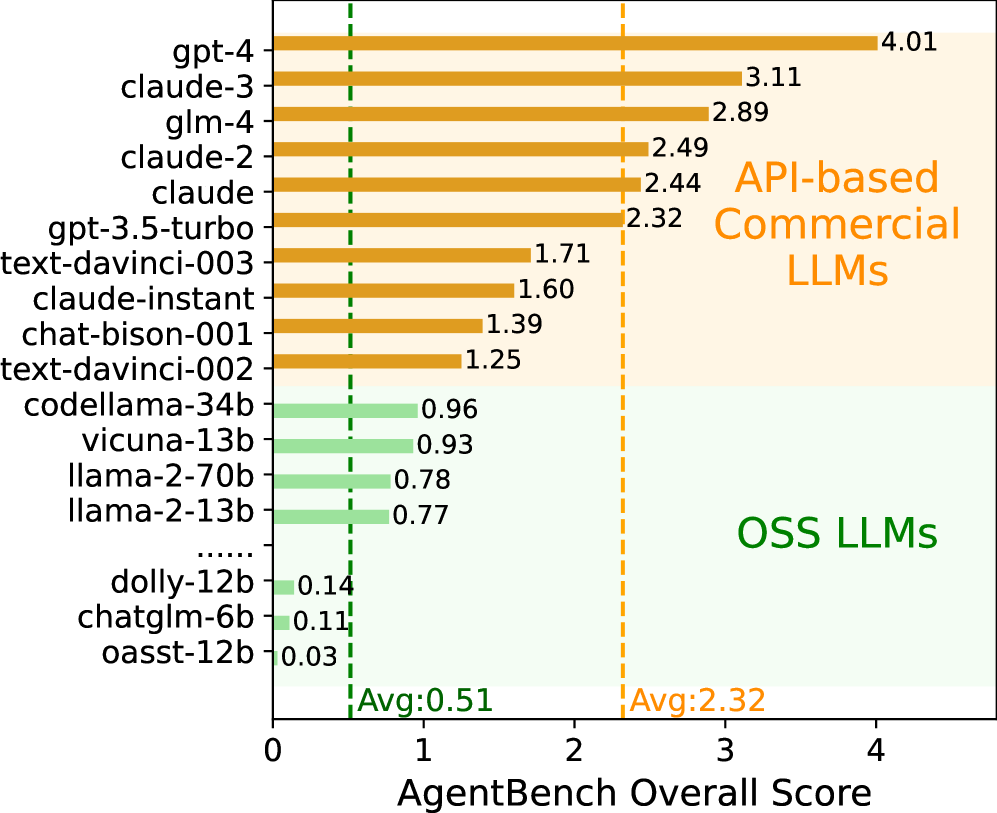
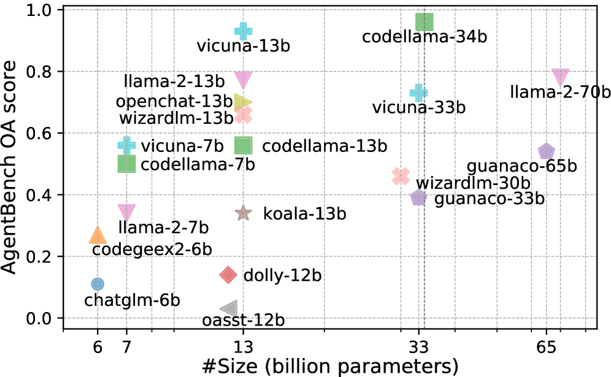

# AgentBench: Evaluating LLMs as Agents

저자 :

Xiao Liu, Hao Yu, Hanchen Zhang, Yifan Xu, Xuanyu Lei, Hanyu Lai, Yu Gu, Hangliang Ding, Kaiwen Men, Kejuan Yang, Shudan Zhang, Xiang Deng, Aohan Zeng, Zhengxiao Du, Chenhui Zhang, Sheng Shen, Tianjun Zhang, Yu Su, Huan Sun, Minlie Huang, Yuxiao Dong, Jie Tang

Tsinghua University / The Ohio State University (THUDM)

발표 : ICLR 2024

논문 : [PDF](https://arxiv.org/pdf/2308.03688)

출처 : [https://arxiv.org/abs/2308.03688](https://arxiv.org/abs/2308.03688)

코드 : [https://github.com/THUDM/AgentBench](https://github.com/THUDM/AgentBench)

---

## 0. Summary

<p align='center'>

</p>

### 0.1. 문제 (Problem)

* LLM은 점점 자율 에이전트로 사용되고 있지만, 기존 벤치마크(MMLU, BIG-bench 등)는 **정적 단일 턴 QA 태스크**만 평가해 실제 에이전트 능력을 측정하지 못한다.
* 에이전트는 **다단계 상호작용(multi-round interaction)**, 실시간 피드백, 동적 의사결정이 필요한데, 이런 능력을 체계적으로 측정하는 표준 프레임워크가 없었다.
* 오픈소스 LLM이 상업용 모델 대비 얼마나 뒤처지는지에 대한 **정량적 비교**도 부재했다.

### 0.2. 핵심 아이디어 (Core Idea)

* **핵심 한 줄**: 코드·게임·웹 3가지 도메인에 걸친 8개 실제 환경에서 LLM 에이전트를 다단계 상호작용으로 평가하는 최초의 체계적 멀티환경 벤치마크를 구축한다.

* **(1) 8개 다양한 환경 (Three Grounding Types)**
  * **코드 기반 (Code-Grounded)**: OS(리눅스 쉘), DB(SQL 데이터베이스), KG(지식그래프 쿼리)
  * **게임 기반 (Game-Grounded)**: DCG(디지털 카드 게임), LTP(측면적 사고 퍼즐), HH(가정 업무)
  * **웹 기반 (Web-Grounded)**: WS(웹 쇼핑), WB(웹 브라우징)
  * 왜 필요한가: 단일 도메인 평가는 특정 능력만 측정한다. 다양한 그라운딩 타입을 포함해야 에이전트의 **범용 추론·의사결정** 능력을 전체적으로 볼 수 있다.

* **(2) 다단계 상호작용 프로토콜**
  * 정적 QA가 아닌 **평균 5~50 라운드**의 실시간 에이전트-환경 상호작용을 통해 평가
  * Chain-of-Thought 기반 "Thought + Action" 분리 프롬프트 구조 사용
  * 그리디 디코딩(temperature=0)으로 재현성 확보

* **(3) 분산 평가 인프라**
  * Task Server, Agent Server, Evaluation Client를 HTTP로 분리한 **서버-클라이언트 아키텍처**
  * Docker 격리로 다양한 환경 간 충돌 방지
  * Edmonds-Karp 알고리즘으로 에이전트·태스크 워커 활용도 최대화

### 0.3. 효과 (Effects)

* 29개 LLM을 동일한 조건에서 비교해, 상업용 API 모델과 오픈소스 모델 사이의 **4.5배 성능 격차**를 정량화
* 실패 모드를 TLE/IF/IA/CLE 4가지로 분류해 **오픈소스 모델의 주요 병목 3가지** 식별: 장기 추론 부족, 지시 따르기 실패, 유효 행동 공간 인식 부족
* 얼라인먼트 데이터 품질이 모델 크기보다 중요하다는 것을 Vicuna-13B vs Llama-2-70B 비교로 실증

### 0.4. 결과 (Results)

* GPT-4가 전체 점수 **4.01**로 1위. Claude-2(2.49), GPT-3.5-turbo(2.32) 순.
* 오픈소스 모델 평균은 **0.51** — 상업용 API 평균(2.32) 대비 약 1/4 수준.
* 최강 오픈소스인 CodeLLaMA-34B조차 전체 점수 **0.96**으로 GPT-3.5-turbo에 크게 못 미침.
* GPT-4도 측면적 사고 퍼즐(LTP)에서 **16.6%**에 그쳐, 최상위 모델조차 장기 추론에 한계가 있음을 확인.

### 0.5. 상세 동작 방식 (How It Works)

**[에이전트 평가 흐름]**

```
[태스크 서버]          [에이전트 서버]         [평가 클라이언트]
    │                      │                       │
    ├── 환경 초기화 ────────►│                       │
    │                      ├── Thought 생성          │
    │                      ├── Action 생성           │
    │◄── Action 전송 ───────┤                       │
    ├── 환경 실행           │                       │
    ├── Observation 반환 ──►│                       │
    │                      │  (최대 N 라운드 반복)    │
    ├── 최종 결과 ──────────────────────────────────►│
    │                      │                       ├── 점수 집계
    │                      │                       └── 실패 모드 분석
```

**평가 과정 상세:**

* **Step 1. 환경 초기화**: 태스크별로 Docker 컨테이너 안에 OS/DB/KG/게임/웹 환경을 구성한다.
* **Step 2. 프롬프트 전달**: 에이전트에게 태스크 설명과 가능한 행동 공간(Action space)을 지시어(instruction)로 제공한다.
* **Step 3. Thought-Action 루프**: 에이전트는 `Thought: [추론]` → `Action: [실행 명령]` 형식으로 응답하고, 환경이 `Observation: [결과]`를 반환한다. 이 루프를 최대 N 라운드 반복한다.
* **Step 4. 종료 판정**: 태스크 성공 또는 최대 단계 초과 시 종료. 5가지 결과 카테고리(Success, TLE, IF, IA, CLE)로 분류.
* **Step 5. 점수 정규화**: 태스크별 점수를 전체 모델 평균 1.0이 되도록 재스케일해 쉬운 태스크가 총점을 지배하지 않도록 한다.

---

## 1. Introduction

최근 LLM은 단순 텍스트 생성기에서 자율 에이전트로 진화하고 있다. ReAct, AutoGPT, BabyAGI 같은 프레임워크는 LLM을 코드 실행, 웹 검색, 파일 조작 등 실제 환경과 상호작용하는 에이전트로 사용한다.

그러나 기존 벤치마크에는 심각한 한계가 있다. MMLU와 BIG-bench는 정적 단일 턴 문제만 평가하며, WebShop과 ALFWorld는 각각 한 가지 좁은 도메인만 다룬다. 즉 **실제 에이전트 능력을 포괄적으로 평가하는 멀티 환경 벤치마크가 없었다.**

AgentBench는 이 공백을 메운다. 8개 다양한 환경에 걸친 체계적인 에이전트 평가 프레임워크를 제공하며, 29개 LLM을 동일한 조건에서 비교해 다음을 밝힌다:

1. 상업용 모델과 오픈소스 모델 사이의 정량적 성능 격차
2. 각 환경별 실패 모드와 그 원인
3. 코드 학습, 얼라인먼트 데이터 품질, 모델 크기가 에이전트 성능에 미치는 영향

---

## 2. 벤치마크 설계: 8개 환경

<p align='center'>

</p>

### 2.1. 코드 기반 환경 (Code-Grounded)

**운영체제 (OS)**
- 에이전트가 Ubuntu Docker 배시(bash) 환경에서 리눅스 관리 태스크를 해결
- 예: "특정 파일에서 패턴을 찾아 다른 파일로 복사하라"
- 평가 지표: 성공률 | 테스트 샘플: 144개
- GPT-4: 42.4% | 대부분 오픈소스: <15%

**데이터베이스 (DB)**
- 에이전트가 실제 데이터베이스에 SQL 쿼리를 실행해 자연어 질문에 답
- 단순 SQL 번역이 아닌 실제 상호작용 기반 평가
- 평가 지표: 성공률 | GPT-4: 32.0%
- 오픈소스 모델은 포맷 오류(IF)로 53.3%가 실패

**지식그래프 (KG)**
- 에이전트가 Freebase 같은 대규모 지식 베이스를 탐색해 복잡한 질문에 답
- 평가 지표: F1 | GPT-4: 58.8% F1 | 대부분 오픈소스: <15%
- 태스크 한계 초과(TLE) 실패율 67.9% — 장기 추론 능력 부족

### 2.2. 게임 기반 환경 (Game-Grounded)

**디지털 카드 게임 (DCG / Aquawar)**
- 에이전트가 물고기 팀을 지휘해 턴제 전략 전투
- 평가 지표: 누적 보상 | GPT-4: 74.5% | 많은 오픈소스: 거의 0점
- 게임 규칙 이해와 전략적 계획 능력 측정

**측면적 사고 퍼즐 (LTP)**
- 에이전트가 예/아니오 질문으로 수수께끼를 풀어나감
- 창의적 추론과 전략적 질문 생성 능력 측정
- 평가 지표: 게임 진행률 | **GPT-4조차 16.6%** — 최상위 모델의 한계 확인

**가정 업무 (HH)**
- ALFWorld에서 채택; 에이전트가 가정 태스크 수행 (예: "프라이팬을 식탁에 올려라")
- 평가 지표: 성공률 | GPT-4: 78.0%
- 유효하지 않은 행동(IA) 실패율 64.1% — 행동 공간 인식 부족

### 2.3. 웹 기반 환경 (Web-Grounded)

**웹 쇼핑 (WS / WebShop)**
- 에이전트가 전자상거래 인터페이스를 탐색해 요구사항에 맞는 제품 구매
- 평가 지표: 보상 기반 | GPT-4: 61.1%
- 코드 튜닝 모델의 효과가 엇갈림 — 절차적 탐색에는 강, 전략적 판단에는 약

**웹 브라우징 (WB / Mind2Web)**
- 에이전트가 다양한 실제 웹사이트에서 복잡한 다단계 태스크 수행
- 평가 지표: 단계 성공률 | GPT-4: 29.0%
- 가장 어려운 환경 중 하나로 실제 웹 인터페이스의 복잡성 반영

---

## 3. 평가 인프라 및 방법론

<p align='center'>

</p>

### 3.1. 분산 평가 시스템

```
[Task Server] ←HTTP→ [Evaluation Client] ←HTTP→ [Agent Server]
     │                                                  │
  Docker 컨테이너                                    LLM API
  (8개 환경 격리)                               (OpenAI, Anthropic, 
                                                오픈소스 모델들)
```

**주요 설계 결정:**
- Edmonds-Karp 알고리즘으로 에이전트와 태스크 워커의 네트워크 플로우 최대화
- 중단된 평가를 이어서 진행하는 재개 가능(resumable) 기능
- 29개 모델, 1,014개 테스트 샘플, 총 ~11,000회 추론 호출

### 3.2. 프롬프트 전략

- `Thought:` 필드에서 추론 수행, `Action:` 필드에서 실행 명령 생성 (CoT 기반)
- Temperature: 0 (그리디 디코딩, 재현성 확보)
- 동적 히스토리 절단: 컨텍스트를 3,500 토큰 이하로 유지

### 3.3. 점수 정규화

각 환경의 평균 점수를 1.0으로 재스케일:

$$\text{normalized\_score}_{i,j} = \text{raw\_score}_{i,j} / \text{avg\_score}_j$$

쉬운 태스크(HH 78%)가 어려운 태스크(LTP 16.6%)보다 총점을 지배하는 것을 방지한다.

---

## 4. 실험 결과

<p align='center'>

</p>

### 4.1. 전체 성능 순위

| 모델 | 전체 점수 | 유형 |
|------|---------|------|
| GPT-4 | 4.01 | 상업용 |
| Claude-2 | 2.49 | 상업용 |
| GPT-3.5-turbo | 2.32 | 상업용 |
| CodeLLaMA-34B | 0.96 | 오픈소스 |
| Vicuna-13B | ~0.8 | 오픈소스 |
| Llama-2-70B | ~0.5 | 오픈소스 |
| 오픈소스 평균 (<70B) | 0.51 | 오픈소스 |

**핵심 관찰:** 오픈소스 평균(0.51) vs 상업용 평균(2.32) — **약 4.5배 격차**

### 4.2. GPT-4 환경별 성능

| 환경 | 점수 | 평가 지표 |
|------|------|---------|
| OS | 42.4% | 성공률 |
| DB | 32.0% | 성공률 |
| KG | 58.8% | F1 |
| DCG | 74.5% | 보상 |
| LTP | 16.6% | 진행률 |
| HH | 78.0% | 성공률 |
| WS | 61.1% | 보상 |
| WB | 29.0% | 단계 성공률 |

### 4.3. 실패 모드 분석

<p align='center'>

</p>

| 실패 유형 | 설명 | 주로 발생하는 환경 |
|---------|------|-----------------|
| **TLE** (Task Limit Exceeded) | 최대 단계 초과 — 가장 흔한 실패 | KG (67.9%), LTP (82.5%) |
| **IF** (Invalid Format) | 지시된 형식 미준수 | DB (53.3%), DCG (38.5%) |
| **IA** (Invalid Action) | 허용 행동 공간 밖의 명령 | HH (64.1%), WB (8.4%) |
| **CLE** (Context Limit Exceeded) | 컨텍스트 길이 초과 | 단문맥 모델에서만 발생 |

**근본 원인 3가지:**
1. 장기 추론 및 의사결정 능력 부족 → TLE
2. 지시 따르기(instruction following) 실패 → IF
3. 행동 공간(action space) 인식 부족 → IA

---

## 5. 심층 분석

### 5.1. 코드 학습의 양날의 검

CodeLLaMA vs Llama-2 비교:
- 코드 튜닝 모델: 절차적 태스크(WS 웹 쇼핑)에서 **우수**
- 코드 튜닝 모델: 전략적 추론(DCG 카드 게임)에서 **열세**
- 결론: 코드 학습이 특정 능력을 향상시키는 동시에 다른 능력을 손상시킬 수 있다

### 5.2. 얼라인먼트 데이터 품질 > 모델 크기

- Vicuna-13B (GPT-4 생성 ShareGPT 데이터로 파인튜닝): Llama-2-70B를 능가
- Vicuna-13B: 2.6배 큰 CodeLLaMA-34B와 **동등한 성능**
- 시사점: **고품질 얼라인먼트 데이터가 파라미터 수보다 에이전트 능력에 더 중요**

### 5.3. Llama-2 스케일링 이상 현상

- Llama-2-13B ≈ Llama-2-70B (5.4배 크기 차이에도 거의 동일한 성능)
- 추정 원인: 대형 모델의 사전학습 부족 OR 지시 따르기 얼라인먼트 부족
- 아키텍처 문제가 아님을 확인

### 5.4. 상업용 vs 오픈소스 격차의 성격

단순 스케일 문제가 아님:
- 70B 이하 오픈소스 모델 모두 GPT-3.5-turbo에 미달
- 격차는 **장기 다단계 추론**과 **지시 따르기** 능력에서 특히 두드러짐
- 오픈소스 모델은 "생각하고 행동하는" 루프를 유지하는 데 근본적인 어려움 존재

---

## 6. 개선 방향

논문이 제시하는 세 가지 우선 개발 방향:

1. **지시 따르기 향상**: 형식 준수와 명령 구조 이해를 위한 명시적 훈련
2. **얼라인먼트 데이터 품질**: 고품질 다회차 대화 데이터(특히 GPT-4 생성) 학습
3. **태스크별 균형 조정**: 절차적 능력과 일반 추론 능력 사이의 균형

---

## 7. 결론

AgentBench는 다음을 실증했다:

- **GPT-4**는 실용적 에이전트로 가장 근접하지만, LTP(16.6%)에서 드러나듯 여전히 한계 존재
- **오픈소스 모델**은 단순 스케일이 아닌 근본적 능력 격차가 있음
- **장기 추론, 의사결정, 지시 따르기** — 이 세 가지가 사용 가능한 LLM 에이전트 개발의 핵심 병목
- **얼라인먼트 데이터 품질**이 파라미터 수보다 에이전트 성능에 더 결정적

이 벤치마크는 8개 다양한 환경을 통해 서로 다른 실패 모드와 능력 경계를 드러내며, 향후 에이전트 연구의 명확한 실증적 방향을 제시한다.

---

## 부록: 사전 지식 (Prerequisites)

### A.1. 알아야 할 핵심 개념

- **LLM-as-Agent / 에이전트 루프** — LLM을 단순 응답 생성기가 아닌 환경과 반복적으로 상호작용하는 자율 에이전트로 사용하는 패러다임. Thought-Action-Observation 루프가 핵심 구조.
  - 본문 위치: §1(Introduction), §2(환경 설계), §3.2(프롬프트 전략)

- **ReAct (Reasoning + Acting)** — LLM이 추론(Reasoning)과 행동(Acting)을 번갈아 수행하도록 프롬프팅하는 기법. "Thought: [추론] → Action: [실행]" 형식이 AgentBench의 프롬프트 기반.
  - 본문 위치: §3.2(프롬프트 전략), 관련 선행 연구

- **Chain-of-Thought (CoT) 추론** — 복잡한 문제를 단계별 중간 추론을 생성하며 풀어나가는 프롬프팅 기법. 에이전트의 Thought 필드에서 활용됨.
  - 본문 위치: §3.2(프롬프트 전략)

- **얼라인먼트 / RLHF** — 인간의 선호에 맞게 LLM을 미세조정하는 과정. 고품질 얼라인먼트 데이터가 에이전트 성능에 크게 영향을 미침(Vicuna-13B 분석).
  - 본문 위치: §5.2(얼라인먼트 데이터 품질 분석)

- **Docker 컨테이너 환경 격리** — 서로 다른 소프트웨어 환경을 독립적으로 실행하는 가상화 기술. AgentBench의 8개 이질적 환경을 충돌 없이 동시 운용하는 데 사용.
  - 본문 위치: §3.1(분산 평가 인프라)

- **Edmonds-Karp 알고리즘** — 최대 유량(max-flow) 문제의 효율적 해법. 에이전트 서버와 태스크 워커의 연결을 최적화하는 데 사용.
  - 본문 위치: §3.1(평가 인프라 아키텍처)

- **ALFWorld** — 텍스트 기반 가정 환경 에이전트 시뮬레이터. AgentBench의 HH(House-Holding) 환경 기반.
  - 본문 위치: §2.2(HH 환경 설명)

- **WebShop / Mind2Web** — 각각 웹 쇼핑, 실제 웹 브라우징을 평가하는 선행 에이전트 벤치마크. AgentBench의 WS/WB 환경 기반.
  - 본문 위치: §2.3(웹 기반 환경)

---

### A.2. 먼저 읽으면 좋은 논문

1. **[2022][ReAct]** ([arXiv:2210.03629](https://arxiv.org/abs/2210.03629)) — *ReAct: Synergizing Reasoning and Acting in Language Models* (Yao et al., ICLR 2023)
   - 한 줄 설명: LLM이 "생각(Thought) → 행동(Action) → 관찰(Observation)" 루프를 반복하며 태스크를 해결하는 프롬프팅 프레임워크.
   - **왜?** AgentBench의 프롬프트 구조(Thought + Action 분리)가 ReAct 패러다임을 직접 채택한다. 에이전트 평가의 기본 프로토콜을 이해하는 데 필수.

2. **[2022][WebShop]** ([arXiv:2207.01206](https://arxiv.org/abs/2207.01206)) — *WebShop: Towards Scalable Real-World Web Interaction with Grounded Language Agents* (Yao et al., NeurIPS 2022)
   - 한 줄 설명: 실제 e-commerce 웹 환경에서 언어 에이전트가 제품을 탐색·구매하는 벤치마크.
   - **왜?** AgentBench의 WS(웹 쇼핑) 환경 기반. 웹 그라운딩 에이전트 평가의 원형.

3. **[2021][ALFWorld]** ([arXiv:2010.03768](https://arxiv.org/abs/2010.03768)) — *ALFWorld: Aligning Text and Embodied Environments for Interactive Learning* (Shridhar et al., ICLR 2021)
   - 한 줄 설명: 텍스트 기반 지시어로 가정 내 물체 조작 태스크를 수행하는 에이전트 환경.
   - **왜?** AgentBench의 HH(House-Holding) 환경 직접 채택. 물리적 행동 공간(Action space)을 텍스트로 표현하는 방법론의 기반.

4. **[2023][Mind2Web]** ([arXiv:2306.06070](https://arxiv.org/abs/2306.06070)) — *Mind2Web: Towards a Generalist Agent for the Web* (Deng et al., NeurIPS 2023)
   - 한 줄 설명: 137개 실제 웹사이트에서 2,000개 이상의 복잡한 웹 태스크를 평가하는 벤치마크.
   - **왜?** AgentBench의 WB(웹 브라우징) 환경 기반. 실제 웹 환경의 복잡성을 에이전트 평가에 도입한 선행 연구.

5. **[2022][CoT]** ([arXiv:2201.11903](https://arxiv.org/abs/2201.11903)) — *Chain-of-Thought Prompting Elicits Reasoning in Large Language Models* (Wei et al., NeurIPS 2022)
   - 한 줄 설명: 중간 추론 단계를 생성하도록 프롬프팅해 LLM의 복잡 추론 능력을 끌어내는 기법.
   - **왜?** AgentBench의 Thought 필드가 CoT 원리 기반. 에이전트 추론 능력 평가의 이론적 토대.

---

### A.3. 관련/후속 논문

- **[2024][SWE-bench]** ([arXiv:2310.06770](https://arxiv.org/abs/2310.06770)) — *SWE-bench: Can Language Models Resolve Real-World GitHub Issues?* (Jimenez et al., ICLR 2024)
  - 실제 GitHub 이슈를 해결하는 코딩 에이전트 평가 벤치마크. AgentBench의 OS/DB 환경과 유사한 코드 기반 에이전트 평가의 후속 흐름.

- **[2024][OSWorld]** ([arXiv:2404.07972](https://arxiv.org/abs/2404.07972)) — *OSWorld: Benchmarking Multimodal Agents for Open-Ended Tasks in Real Computer Environments*
  - 실제 운영체제 환경에서 스크린샷 기반 멀티모달 에이전트를 평가. AgentBench OS 환경의 멀티모달 확장판.

- **[2023][AutoGPT]** — GPT-4를 기반으로 자율적으로 태스크를 계획·실행하는 오픈소스 에이전트 프레임워크. AgentBench가 평가하는 에이전트 능력의 실제 응용 사례.
