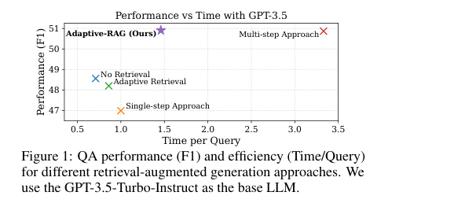
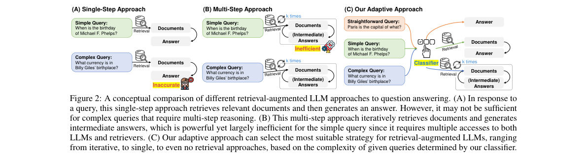
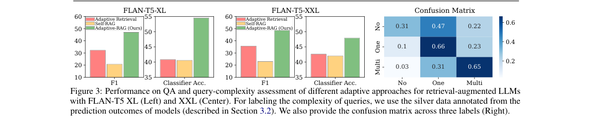
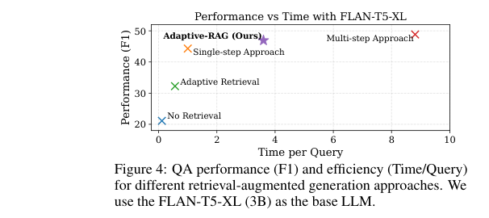
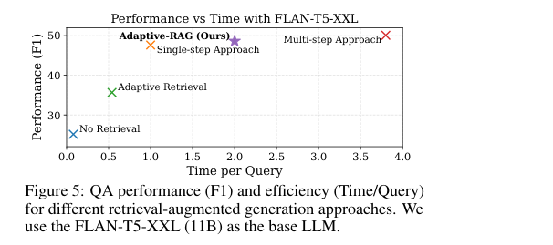

# Adaptive-RAG: Learning to Adapt Retrieval-Augmented Large Language Models through Question Complexity

저자 :

Soyeong Jeong, Jinheon Baek, Sukmin Cho, Sung Ju Hwang, Jong C. Park

School of Computing, Korea Advanced Institute of Science and Technology (KAIST)

Graduate School of AI, Korea Advanced Institute of Science and Technology (KAIST)

발표 : NAACL 2024

논문 : [PDF](https://arxiv.org/pdf/2403.14403)

출처 : [https://arxiv.org/abs/2403.14403](https://arxiv.org/abs/2403.14403)

---

## 0. Summary

<p align='center'>

</p>

### 0.1. 문제 (Problem)

* 검색 증강 LLM(Retrieval-Augmented LLM)은 외부 지식을 끌어와 QA 정확도를 높이지만, **모든 질문에 같은 전략을 적용하는(one-size-fits-all)** 방식이 문제다.
* 단일 단계(Single-step) 검색은 간단한 질문엔 충분하지만 여러 문서를 연결해야 하는 **복잡한 multi-hop 질문**에는 부족하다.
* 반대로 다단계(Multi-step) 반복 검색은 복잡한 질문엔 강력하지만, "파리는 어느 나라의 수도인가?" 같은 **간단한 질문에도 LLM과 retriever를 여러 번 호출**해 불필요한 계산 비용을 낭비한다.
* 기존 적응형(Adaptive) 검색 기법은 (a) 단순히 검색 여부만 이진 결정하거나(Mallen et al.) (b) 단일 모델에 의존(Self-RAG)해, 실제로 다양한 난이도가 섞인 질문들을 세밀하게 다루지 못한다.

### 0.2. 핵심 아이디어 (Core Idea)

* **핵심 한 줄**: 질문이 들어오면 먼저 그 **복잡도(complexity)** 를 분류기로 판정하고, 난이도에 맞는 검색 전략(검색 안 함 / 한 번 / 여러 번)을 동적으로 골라 쓴다.

* **(1) 3단계 복잡도 라벨 (A/B/C)**
  * 정의: 모든 질문을 세 등급으로 나눈다. **A** = LLM 혼자 답 가능(검색 불필요), **B** = 한 번 검색하면 충분(single-step), **C** = 여러 번 반복 검색·추론 필요(multi-step).
  * 왜 필요한가: 기존 적응형은 "검색할까 말까"의 이진 결정뿐이라 복잡한 multi-hop을 못 잡았다. 중간 등급(B)과 최고 난이도(C)를 분리해야 비용과 정확도의 균형이 잡힌다.
  * 비유: 환자가 오면 증상에 따라 "약만 처방(A) / 일반 진료(B) / 정밀 검사(C)"로 나누는 트리아지(triage)와 같다.

* **(2) 질문 복잡도 분류기 (Query-Complexity Classifier)**
  * 정의: 들어온 질문 $q$를 받아 라벨 $o \in \{A, B, C\}$ 를 내놓는 작은 언어모델(T5-Large, 770M). 식으로는 $o = \text{Classifier}(q)$.
    여기서 $q$는 사용자 질문, $o$는 예측된 복잡도 등급이다.
  * 왜 필요한가: LLM 본체나 retriever를 건드리지 않고, 라우팅 결정만 담당하는 가볍고 교체 가능한 "스위치"가 필요하기 때문이다.
  * 비유: 콜센터의 ARS 안내처럼, 본론(LLM)을 건드리지 않고 전화를 적절한 부서로 연결해주는 교환원이다.

* **(3) 자동 라벨 수집 (Auto-labeling, 사람 주석 없음)**: 복잡도 라벨이 달린 데이터셋이 없으므로 아래 **두 가지 방식**을 합쳐 학습 데이터를 자동 생성한다.
  * 실제 예측 결과 기반(silver): 세 전략을 모두 돌려보고 **정답을 맞힌 가장 단순한 전략**을 라벨로 준다. (검색 없이 맞히면 A, 검색 없이는 틀리지만 single·multi 둘 다 맞히면 더 단순한 B)
  * 데이터셋 편향(inductive bias) 기반: 세 전략 모두 틀려 라벨이 안 붙은 질문은, **single-hop 데이터셋이면 B, multi-hop 데이터셋이면 C**로 채운다.
  * 비유: 답안지를 채점해 "이 문제는 암산으로 풀렸네(A)"처럼 자동 분류하고, 채점으로도 애매한 문제는 출처(문제집 종류)를 보고 라벨을 메운다.

### 0.3. 효과 (Effects)

* LLM 본체나 retriever의 **구조·파라미터 변경 없이**, 분류기 하나만 추가해 세 전략 사이를 자유롭게 오간다.
* 간단한 질문은 빠르게, 복잡한 질문에만 자원을 집중 → **정확도와 효율의 균형**을 동시에 달성.
* 분류기는 60M~770M 사이에서 성능 차이가 거의 없어, **작은 모델로도** 자원 효율적으로 운용 가능.

### 0.4. 결과 (Results)

* GPT-3.5 기준, Adaptive-RAG의 평균 F1은 **50.91** 로, 모든 질문에 반복 검색을 쓰는 Multi-step(F1 50.87)과 **동등한 정확도**를 달성하면서 평균 검색 단계는 **1.03 vs 2.81** 로 약 1/3 수준이다.
* 적응형 baseline 대비 우위: Adaptive Retrieval(F1 48.20), Self-RAG(F1 22.98)보다 정확도가 높다.
* 예측 라벨 분포(GPT-3.5)는 A(검색 없음) **8.6%** / B(한 번) **53.3%** / C(여러 번) **38.1%**. 질문당 절대 소요 시간은 A 0.35초, B 3.08초, C 27.18초로 라벨에 따라 큰 차이가 난다.
* Oracle(완벽한 분류기 가정)은 F1 62.80으로 상한선을 보여주며, 분류기 개선 여지가 충분함을 시사한다.

### 0.5. 상세 동작 방식 (How It Works)

**[입력 → 분류 → 분기 → 출력]** 흐름으로 동작한다. 핵심은 "본체를 안 바꾸고, 질문마다 다른 경로로 보낸다"는 점이다.

```
[질문 q]
   │
   ▼
[분류기 Classifier(q)]  ← 작은 LM(T5-Large), 라벨 A/B/C 출력
   │
   ├── A (쉬움) ─────────→ [LLM(q)]                        → [답]   (검색 0회)
   │
   ├── B (보통) ─→ [Retriever] → 문서 d → [LLM(q, d)]      → [답]   (검색 1회)
   │
   └── C (복잡) ─→ ┌─ [Retriever] → d_i ─┐
                   │   [LLM(q, d_i, c_i)] │  ← k번 반복 (CoT 추론 끼워넣기)
                   └─ 중간답·문서 누적 c ─┘ → [최종 답]      (검색 여러 회)
```

* **Step 1. 질문 입력**: 사용자 질문 $q$가 들어온다.
* **Step 2. 복잡도 판정**: 분류기가 $o = \text{Classifier}(q)$ 로 라벨 A/B/C 중 하나를 예측한다. 이 단계가 전체의 "두뇌" 역할로, 어느 경로로 보낼지 결정한다.
* **Step 3. 전략 분기(라우팅)**:
  * A → 검색 없이 LLM 내부 지식만으로 답 ($\bar{a} = \text{LLM}(q)$). 가장 빠름.
  * B → retriever로 관련 문서 $d$를 한 번 검색해 LLM에 붙여 답 ($\bar{a} = \text{LLM}(q, d)$).
  * C → retriever와 LLM을 $k$번 반복. 매 단계 $i$에서 새 문서 $d_i$를 검색하고 이전 문서·중간답을 모은 맥락 $c_i$와 함께 입력 ($\bar{a}_i = \text{LLM}(q, d_i, c_i)$), 답이 나올 때까지 추론 체인(Chain-of-Thought)을 이어간다.
* **Step 4. 출력**: 선택된 경로의 최종 답 $\bar{a}$를 반환한다.

학습 단계에서는 위 세 경로를 모두 돌려본 결과(silver)와 데이터셋 편향을 합쳐 자동으로 (질문, 라벨) 쌍을 만들고, **교차 엔트로피 손실(Cross-Entropy Loss)** 로 분류기를 학습한다. 추론 시에는 분류기 한 번 호출로 경로가 정해진다.

전체 데이터 흐름 요약:

```
[학습] 6개 QA 데이터셋 → 3전략 실행 결과 + 데이터셋 편향 → (질문,라벨) 자동수집 → 분류기 학습
[추론] 질문 q → 분류기 → {A: LLM only | B: 1회 검색 | C: k회 반복 검색} → 답
```

---

## 1. Introduction

최근 LLM은 QA를 비롯한 다양한 작업에서 뛰어난 성능을 보이지만, 지식이 파라미터 메모리에만 의존하기 때문에 사실과 다른 답(hallucination)을 내거나 최신·정밀 지식을 다루지 못한다. 이를 보완하는 것이 **검색 증강 LLM**으로, 외부 지식 베이스(예: 위키백과)에서 질문 관련 문서를 검색해 LLM 입력에 넣어 정확성과 최신성을 높인다.

문제는 질문마다 난이도가 다르다는 점이다. 초기 연구는 정답이 한 문서 안에 있는 **single-hop 질문**에 집중했지만, "Billy Giles의 출생지에서 쓰는 통화는?" 처럼 여러 문서를 연결·종합해야 하는 **multi-hop 질문**은 한 번의 검색-응답으로 풀리지 않는다. 그래서 최근 연구는 LLM과 retriever를 반복 호출하는 **multi-step QA**에 집중했지만, 이는 무거운 계산 비용을 수반한다.

저자들은 핵심 질문을 던진다. **"실제 사용자 질문이 모두 복잡한가?"** 오히려 "파리는 어느 나라의 수도인가?" 같은 단순 질문이 훨씬 자주 들어오고, 이런 질문은 LLM 혼자서도 답할 수 있다. 즉 모든 질문에 multi-step을 쓰면 간단한 질문에 불필요한 비용이 들고(Figure 2의 B), 반대로 복잡한 질문을 single-step이나 검색 없이 처리하면 정확도가 부족하다(Figure 2의 A). 따라서 **질문 복잡도에 따라 전략을 동적으로 바꾸는 적응형 QA 시스템**이 필요하다.

기존 적응형 기법은 (a) 질문 속 개체(entity)의 빈도로 검색 여부만 결정하거나(Mallen et al., 2023 — 지나치게 단순해 multi-hop을 못 잡음), (b) 모델이 끝낼 시점을 스스로 정하는 방식(Trivedi et al., 2023 — 지나치게 복잡)이라 모두 차선책이다. 저자들은 **검색 없음 / single-step / multi-step** 세 전략 중 질문에 가장 적합한 것을 고르는 프레임워크를 제안하며, 이를 작은 분류기로 구현한다. 분류기의 학습 데이터는 사람 주석 없이 (1) 모델 예측 결과와 (2) 데이터셋 내재 편향으로 자동 수집한다. 이 프레임워크를 **Adaptive-RAG (Adaptive Retrieval-Augmented Generation)** 라 부른다.

기여는 세 가지다. (1) 다양한 복잡도의 질문이 섞이는 현실 시나리오를 지적하고, 기존 기법이 지나치게 단순하거나 복잡함을 보인다. (2) 분류기가 판정한 복잡도에 맞춰 검색 증강 LLM을 적응시킨다. (3) GPT-3.5와 FLAN-T5 계열에서 정확도와 효율을 모두 개선함을 검증한다.

## 2. Method

<p align='center'>

</p>

### 2.1. Preliminaries — 세 가지 기본 전략

먼저 LLM을 입력 토큰 시퀀스 $x$를 받아 출력 $y$를 생성하는 모델 $y = \text{LLM}(x)$ 로 정의한다. QA에서는 입력이 질문 $q$, 출력이 답 $\bar{a}$ 이다.

* **검색 없음(Non Retrieval)**: 가장 단순한 방식.

$$\bar{a} = \text{LLM}(q)$$

  LLM 내부 지식만 사용해 매우 효율적이지만, 특정 인물·사건 등 내부 지식 밖의 정밀·최신 지식이 필요한 질문에는 취약하다.

* **단일 단계(Single-step)**: 외부 지식원 $D$(예: 위키백과)에서 질문과 관련된 문서 $d$를 한 번 검색해 LLM에 함께 넣는다.

$$d = \text{Retriever}(q; D), \qquad \bar{a} = \text{LLM}(q, d)$$

  여기서 $\text{Retriever}$는 BM25 같은 임의의 검색 모델, $d \in D$는 검색된 문서다.

* **다단계(Multi-step)**: 여러 문서를 종합·추론해야 하는 복잡한 질문용. 매 검색 단계 $i$에서 새 문서 $d_i$를 검색하고, 이전 문서·중간답으로 구성된 맥락 $c_i = (d_1, ..., d_{i-1}, \bar{a}_1, ..., \bar{a}_{i-1})$ 와 함께 입력한다.

$$d_i = \text{Retriever}(q, c_i; D), \qquad \bar{a}_i = \text{LLM}(q, d_i, c_i)$$

  강력하지만 retriever와 LLM을 반복 호출하므로 비용이 크다.

### 2.2. Adaptive-RAG

**적응(Adapting)**: 모든 질문이 같은 복잡도가 아니므로, 답을 시도하기 전에 질문의 복잡도를 먼저 판정해 전략을 동적으로 고른다. LLM과 retriever의 동작 자체는 입력에 무관하게 일정하므로, **내부 구조나 파라미터를 바꾸지 않고** 세 전략 사이를 매끄럽게 오갈 수 있다.

**복잡도 판정(Query Complexity Assessment)**: 작은 언어모델 분류기가 질문 $q$를 받아 라벨을 출력한다.

$$o = \text{Classifier}(q), \qquad o \in \{A, B, C\}$$

여기서 A는 $\text{LLM}(q)$ 로 답 가능한 직관적 질문, B는 적어도 single-step $\text{LLM}(q, d)$ 가 필요한 중간 난이도, C는 multi-step $\text{LLM}(q, d, c)$ 가 필요한 복잡한 질문이다.

**학습 전략(Training Strategy)**: 질문-복잡도 쌍 데이터셋이 없으므로 두 방식으로 자동 구축한다.

* **모델 결과 기반 silver 라벨**: 세 전략을 모두 실행해, 정답을 맞힌 **가장 단순한 전략**을 라벨로 부여한다(동률은 단순한 쪽 우선). 예) 검색 없이 맞히면 A, 검색 없이는 틀리지만 single·multi 둘 다 맞히면 B.
* **데이터셋 편향 기반 보완**: 세 전략 모두 틀려 라벨이 비는 질문은, single-hop 데이터셋이면 B, multi-hop 데이터셋이면 C로 채운다(데이터셋 생성 방식 자체가 단일/다중 추론을 반영하므로).

이렇게 모은 쌍으로 분류기를 **교차 엔트로피 손실**로 학습하고, 추론 시 $o = \text{Classifier}(q)$ 로 경로를 결정한다.

### 2.3. 분류기 학습 상세

원문(§4 Implementation Details, Appendix)에 학습 설정이 명시되어 있다.

* **모델**: T5-Large (770M 파라미터). FLAN-T5 Small(60M)/Base(250M)/Large(770M) 등 다양한 크기를 ablation했으나 크기 간 성능 차이가 거의 없어 Large를 기본값으로 선택.
* **학습 데이터 규모**: 6개 데이터셋 각각에서 400개 쿼리를 샘플링해 라벨을 붙인다.
  * 데이터셋 편향(inductive bias) 기반: 6 × 400 = 2,400쌍
  * 모델 결과 기반 silver 라벨: 같은 400개에서 세 전략을 실행해 추가 수집 (미라벨 쿼리는 편향 방식으로 보완)
  * **테스트 질문과 겹치지 않도록** 별도 분리하여 구성
* **옵티마이저**: AdamW, 학습률 **3e-5**
* **학습 종료 조건**: 최대 100 iteration 안에서 검증셋(validation set) 기준 최고 성능 epoch 저장 (early stopping)
* **추론 시**: 분류기 가중치 고정(frozen) 상태로 게이트 역할만 수행 — LLM / retriever 파라미터는 일절 변경 없음

요약하면, 분류기는 **아주 작은 학습 데이터(데이터셋당 400개)로 빠르게 수렴**하고, 모델 크기를 키워도 성능 향상이 미미해 60M 소형 모델로도 충분히 대체 가능하다. Oracle과의 격차는 라벨 품질(silver label 오류)에 기인하므로, 라벨링 전략 개선이 주요 미래 연구 방향으로 명시된다.

## 3. Experiments

### 3.1. Setup

* **데이터셋**: 현실 시나리오(다양한 난이도 혼재)를 모사하기 위해 single-hop과 multi-hop을 함께 사용한다.
  * Single-hop: SQuAD v1.1, Natural Questions, TriviaQA
  * Multi-hop: MuSiQue, HotpotQA, 2WikiMultiHopQA
* **LLM**: FLAN-T5-XL(3B), FLAN-T5-XXL(11B), GPT-3.5(turbo-instruct)
* **Retriever**: 모든 모델 공통으로 BM25(희소 검색) 사용. 분류기는 T5-Large(770M)로 학습.
* **Baseline 분류**: Simple(No Retrieval, Single-step) / Adaptive(Adaptive Retrieval[Mallen], Self-RAG[Asai], **Adaptive-RAG**) / Complex(Multi-step[Trivedi, IRCoT]). 상한선으로 완벽한 분류기를 가정한 **Adaptive-RAG w/ Oracle** 도 보고한다.
* **Metric**: 효과성 — EM, F1, Accuracy. 효율성 — 검색-생성 단계 수(Step), 질문당 시간(Time, single-step=1.00 기준 상대값).

### 3.2. Main Results

전체 데이터셋 평균(Table 1)에서 단순 전략은 복잡 전략보다 정확도가 낮고, 복잡 전략은 단순 전략보다 비용이 훨씬 크다는 가설이 그대로 확인된다. 적응형 중에서는 Adaptive-RAG가 두드러진다.

* **GPT-3.5**: Adaptive-RAG F1 **50.91** 로 Multi-step(50.87)과 사실상 동등하면서, 평균 단계는 **1.03 vs 2.81** 로 약 1/3. 적응형 baseline인 Adaptive Retrieval(48.20), Self-RAG(22.98)를 크게 앞선다.
* **FLAN-T5-XL(3B)**: Adaptive-RAG F1 46.94, Multi-step 48.85. Multi-step의 평균 단계 4.69 / 시간 8.81에 비해 Adaptive-RAG는 단계 2.17 / 시간 3.60으로 훨씬 효율적이다.
* **FLAN-T5-XXL(11B)**: Adaptive-RAG F1 48.62, Multi-step 50.09. 단계 1.35 / 시간 2.00으로 효율 우위.
* **Oracle 상한**: GPT-3.5에서 F1 62.80(Adaptive-RAG보다 높고 단계 0.50으로 더 효율적). 완벽한 분류기가 있다면 정확도·효율 모두 개선되므로, 분류기 향상 여지가 큼을 보여준다. (Oracle은 달성된 결과가 아니라 상한선임에 유의)

특히 multi-hop 데이터셋(Table 2)에서, 검색 여부만 이진 결정하는 단순 적응형은 여러 문서 종합이 필요한 복잡 질문을 제대로 못 다룬다. Adaptive-RAG는 복잡 질문에 반복 모듈을 투입해 더 세밀한 처리를 한다.

### 3.3. 분석 (Analyses)

<p align='center'>

</p>

* **분류기 성능**: Adaptive-RAG의 분류 정확도가 다른 적응형 baseline보다 높고, 이것이 전체 QA 향상으로 이어진다. 혼동 행렬(Figure 3 우측)을 보면 C(Multi)를 B(One)로(약 31%), A(No)를 B(One)로(약 47%) 오분류하는 경향이 있어 개선 여지가 있다.
* **효율(절대 시간)**: 예측 라벨 분포는 A 8.6% / B 53.3% / C 38.1%이며, 질문당 절대 소요는 A **0.35초**, B **3.08초**, C **27.18초** (Table 3). 단순 질문을 빨리 식별할수록 효율이 크게 개선됨을 보인다. (이 시간은 절대값으로, Table 1의 상대 시간과는 별개)
* **학습 데이터 ablation(Table 4)**: silver 라벨만 쓰면 분류 정확도는 높아도 오답 질문의 복잡도를 못 배워 일반화가 떨어지고, 데이터셋 편향만 쓰면 "검색 불필요(A)" 케이스를 못 잡는다. 둘을 합친 전체 전략이 균형을 이룬다.
* **분류기 크기(Table 6)**: Small(60M)~Large(770M) 사이 성능 차가 거의 없어, 작은 분류기로도 성능 손실 없이 자원 효율적 운용이 가능하다.
* **Case study(Table 5)**: 단순 질문("1999년 이후 첫 로고 변경" → Google)은 Adaptive-RAG가 검색 없이(A) 정답을 내지만, Adaptive Retrieval은 불필요한 문서를 끌어와 'Microsoft'로 오답. 복잡 질문에서는 Adaptive-RAG가 multi-step(C)으로 'John Cabot의 아들 Sebastian Cabot'을 찾아내지만, Adaptive Retrieval은 외부 정보를 요청하지 못해 오답.

<p align='center'>

</p>

<p align='center'>

</p>

## 4. Conclusion

이 논문은 질문 복잡도에 따라 검색 전략을 동적으로 선택하는 **Adaptive-RAG** 를 제안한다. 핵심은 작은 분류기로 질문을 A(검색 없음) / B(single-step) / C(multi-step) 세 등급으로 라우팅하는 것이며, 분류기 학습 데이터는 모델 예측 결과(silver)와 데이터셋 편향으로 사람 주석 없이 자동 수집한다. 그 결과 간단한 질문은 빠르게 처리하고 복잡한 질문에만 자원을 집중해, 모든 질문에 동일 전략을 강요하는 기존 방식보다 정확도와 효율을 동시에 끌어올린다. 한계로는 분류기 학습 데이터·구조의 개선 여지(Oracle과의 격차)와 자동 라벨링의 오류 가능성을 든다.

**한 줄 commentary**: "질문을 풀기 전에 질문의 난이도를 먼저 푼다"는 발상이 RAG에 트리아지(triage) 관점을 도입한 점이 인상적이다. LLM·retriever 본체를 건드리지 않고 가벼운 라우터만 얹는 구조는 실서비스에 바로 적용 가능한 실용성이 크며, Oracle과의 격차는 분류기 자체를 더 잘 만들면 추가 이득이 있음을 분명히 보여준다.

---

## 부록: 사전 지식 (Prerequisites)

### A.1. 알아야 할 핵심 개념

- **RAG / 검색 증강 생성 (Retrieval-Augmented Generation)** — 외부 지식 베이스(예: 위키백과)에서 관련 문서를 검색해 LLM의 입력에 함께 넣어 응답 정확도를 높이는 패러다임.
  - 본문 위치: §0.1(문제), §1(Introduction), §2.1(Non-Retrieval / Single-step 전략)

- **오픈 도메인 QA / 리트리버·리더 구조 (Open-Domain QA, Retriever-Reader)** — 질문에 대한 관련 문서를 검색하는 리트리버(Retriever)와 문서를 읽고 답을 생성하는 리더(Reader)로 이루어진 QA 파이프라인.
  - 본문 위치: §2 Related Work(Open-domain QA), §3.1(BM25 리트리버 + LLM 리더 조합)

- **단일 홉 / 다중 홉 QA (Single-hop / Multi-hop QA)** — 단일 홉은 한 문서로 답을 찾는 질문, 다중 홉은 여러 문서를 순차적으로 연결·종합해야 하는 질문.
  - 본문 위치: §1(Introduction 동기), §2.1(Multi-step 전략 소개), §3.1(6개 데이터셋 구성)

- **BM25 희소 검색 (BM25 Sparse Retrieval)** — 문서와 쿼리 간 키워드 매칭으로 관련 문서를 순위화하는 고전적 확률적 정보 검색 기법(Robertson et al., 1994).
  - 본문 위치: §3.1(모든 모델에 공통 적용되는 리트리버로 사용)

- **Chain-of-Thought (CoT) 추론** — 복잡한 문제를 풀 때 중간 추론 단계를 단계별로 생성해 최종 답으로 이어가는 프롬프팅 기법.
  - 본문 위치: §2.1(Multi-step 전략의 C 경로 — 반복 검색마다 CoT 추론을 끼워넣어 중간 맥락 c_i 구성)

- **반복적 다단계 검색 (Iterative Multi-step Retrieval)** — LLM과 리트리버를 k회 반복 호출하면서 매 단계 이전 중간 답과 문서를 누적 맥락으로 삼아 다음 검색 쿼리를 생성하는 방식.
  - 본문 위치: §2.1(Multi-step 전략 수식), §0.5(C 경로 동작 상세)

- **질문 복잡도 분류기 / LM 라우터 (Query-Complexity Classifier)** — 들어온 질문의 복잡도 등급(A/B/C)을 예측하는 작은 언어모델(T5-Large, 770M). 본체 LLM이나 리트리버를 변경하지 않고 전략 선택 역할만 담당.
  - 본문 위치: §2.2(분류기 정의 및 학습 전략), §3.3(분류기 크기 ablation)

- **Silver 라벨 / 모델 결과 기반 자동 레이블링 (Silver Label / Auto-labeling)** — 사람 주석 없이 모델 예측 결과와 데이터셋 내재 편향(inductive bias)을 조합해 학습 데이터를 자동 생성하는 방법.
  - 본문 위치: §2.2(Training Strategy — silver 라벨 + 데이터셋 편향 기반 보완), §3.3(ablation Table 4)

- **FLAN-T5 / Instruction Tuning** — 다양한 작업에 대한 지시어(instruction)로 파인튜닝된 T5 계열 인코더-디코더 LLM. 본 논문에서 답 생성 LLM(XL 3B, XXL 11B)으로 사용.
  - 본문 위치: §3.1(모델 설정), §3.2(결과 표 — FLAN-T5-XL/XXL)

---

### A.2. 먼저 읽으면 좋은 논문

1. **[2023][IRCoT]** ([arXiv:2212.10509](https://arxiv.org/abs/2212.10509)) — *Interleaving Retrieval with Chain-of-Thought Reasoning for Knowledge-Intensive Multi-Step Questions* (Trivedi et al., ACL 2023)
   - 한 줄 설명: CoT 추론의 각 문장 사이에 리트리버 호출을 끼워 넣어 다단계 QA를 해결하는 기법.
   - **왜?** Adaptive-RAG의 Multi-step(C 경로)은 IRCoT 구현을 직접 채택한다. 논문 전체에서 "Trivedi et al., 2023"이 multi-step 기준선이자 구현 참조점으로 반복 등장하며, 검색 단계 수·프롬프트 설계를 그대로 따른다.

2. **[2023][Adaptive Retrieval]** ([arXiv:2212.10511](https://arxiv.org/abs/2212.10511)) — *When Not to Trust Language Models: Investigating Effectiveness of Parametric and Non-Parametric Memories* (Mallen et al., ACL 2023)
   - 한 줄 설명: 쿼리 속 개체의 출현 빈도를 기반으로 검색 여부를 이진 결정하는 적응형 리트리벌 기법.
   - **왜?** Adaptive-RAG가 직접 극복하려는 "지나치게 단순한 적응형 방식"의 대표 baseline. 실험 프로토콜(BM25 리트리버, 평가 metric)도 이 논문을 따른다.

3. **[2024][Self-RAG]** ([arXiv:2310.11511](https://arxiv.org/abs/2310.11511)) — *Self-RAG: Learning to Retrieve, Generate, and Critique through Self-Reflection* (Asai et al., ICLR 2024)
   - 한 줄 설명: 특수 반영 토큰(reflection token)으로 검색 여부·품질을 스스로 판단하도록 단일 LLM을 훈련시키는 프레임워크.
   - **왜?** Adaptive-RAG의 "단일 모델 기반 적응형" baseline. 본 논문은 Self-RAG의 복잡도 처리 한계를 논거로 삼아 별도 라우터의 필요성을 주장한다.

4. **[2022][CoT]** ([arXiv:2201.11903](https://arxiv.org/abs/2201.11903)) — *Chain-of-Thought Prompting Elicits Reasoning in Large Language Models* (Wei et al., NeurIPS 2022)
   - 한 줄 설명: 중간 추론 단계를 단계별로 생성함으로써 LLM의 복잡 추론 능력을 끌어내는 프롬프팅 기법.
   - **왜?** Adaptive-RAG의 Multi-step(C) 경로의 핵심 원리. IRCoT과 함께 다단계 추론-검색 루프의 개념적 토대를 이룬다.

5. **[2020][RAG 원조]** ([arXiv:2005.11401](https://arxiv.org/abs/2005.11401)) — *Retrieval-Augmented Generation for Knowledge-Intensive NLP Tasks* (Lewis et al., NeurIPS 2020)
   - 한 줄 설명: 파라메트릭 메모리(LLM 가중치)와 비파라메트릭 메모리(외부 문서 인덱스)를 결합한 최초의 RAG 프레임워크.
   - **왜?** 논문 전체를 관통하는 "검색 증강 LLM" 개념의 출발점. Single-step(B) 전략의 기반이 되는 구조를 확립했다.

---

### A.3. 관련/후속 논문

- **[2026][RAGRouter-Bench]** ([arXiv:2602.00296](https://arxiv.org/abs/2602.00296)) — *RAGRouter-Bench: A Dataset and Benchmark for Adaptive RAG Routing* (2026)
  - Adaptive-RAG의 라우팅 아이디어를 체계화한 벤치마크. 4개 도메인 7,727개 쿼리에 factual / reasoning / summarization 세 유형 레이블을 붙여 RAG 라우터 연구를 위한 첫 표준 평가 프레임워크를 제공한다.

- **[2026][Lightweight Query Routing]** ([arXiv:2604.03455](https://arxiv.org/abs/2604.03455)) — *Lightweight Query Routing for Adaptive RAG: A Baseline Study on RAGRouter-Bench*
  - RAGRouter-Bench를 이용해 소형 라우터들의 성능을 비교 분석한 후속 연구. Adaptive-RAG의 분류기 크기 무관성 발견을 더 넓은 벤치마크에서 검증한다.
