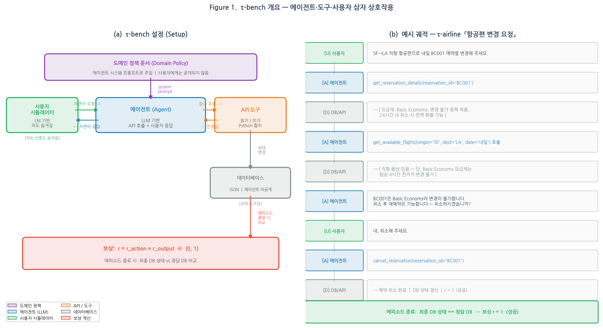
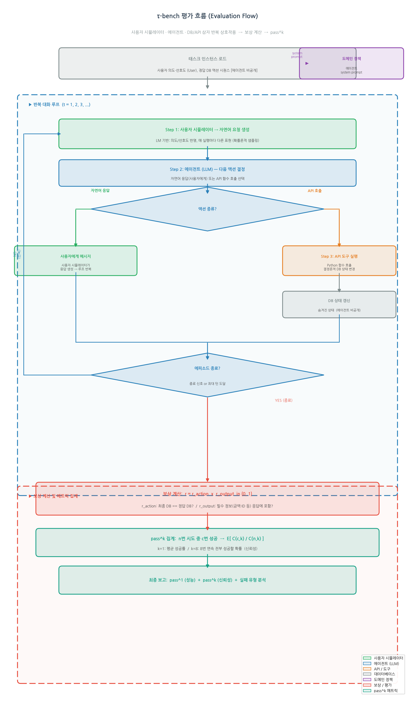
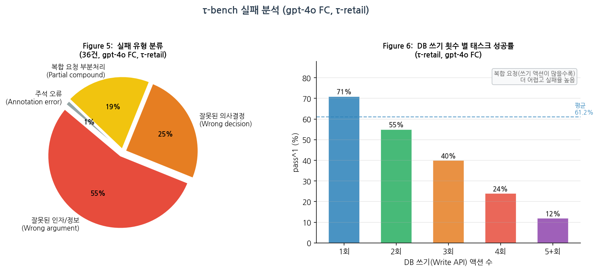
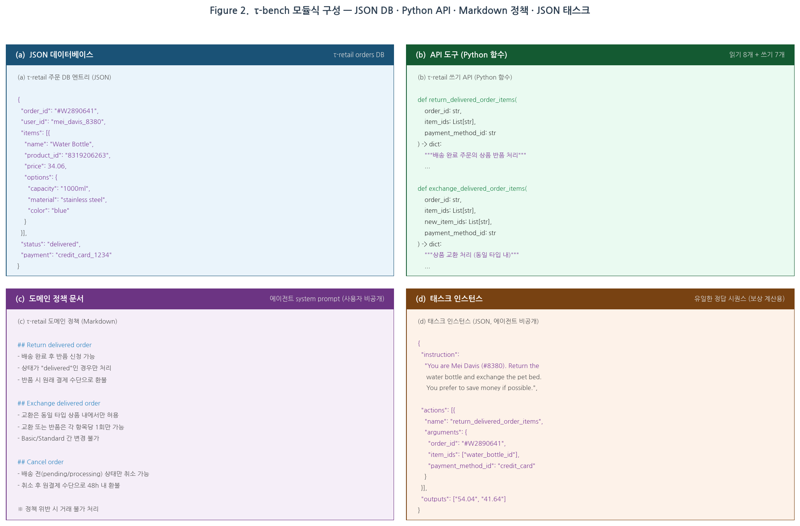
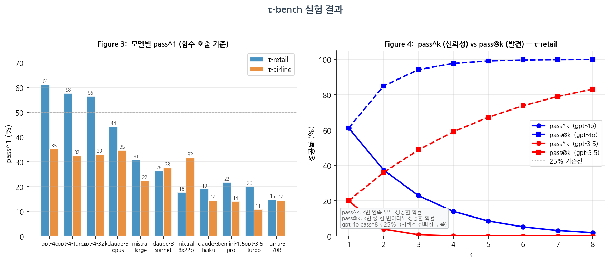

# τ-bench: A Benchmark for Tool-Agent-User Interaction in Real-World Domains

저자 : Shunyu Yao, Noah Shinn, Pedram Razavi, Karthik Narasimhan

소속 : Sierra

발표 : arXiv 2024

논문 : [PDF](https://arxiv.org/pdf/2406.12045)

출처 : [https://arxiv.org/abs/2406.12045](https://arxiv.org/abs/2406.12045)

코드 : [https://github.com/sierra-research/tau-bench](https://github.com/sierra-research/tau-bench)

---

## 0. Summary

<p align='center'>

</p>

### 0.1. 문제 (Problem)

* 기존 에이전트 벤치마크(SWE-bench, WebArena, AgentBench 등)는 모든 정보를 처음부터 주고 환경(웹·코드·API)과만 상호작용하는 단순화된 설정이라, **실제 서비스에서 필수적인 두 가지 능력을 전혀 평가하지 못한다**: (1) 사용자와 다단계 대화를 통해 정보를 수집하고 의도를 해결하는 능력, (2) 도메인별 정책·규칙을 정확히 준수하는 능력.
* 도구 사용 벤치마크(BFCL, ToolBench 등)는 단일 단계 함수 호출 정확도만 평가하며, 태스크 지향 대화 벤치마크는 정적 데이터셋에 의존해 에이전트의 **일관성과 신뢰성(reliability) 검증이 불가능**하다.
* 실제 서비스에 배포하려면 수백만 건의 상호작용에서도 **항상 일관된 결과**를 내야 하는데, 이를 측정하는 메트릭도 존재하지 않았다.
* 요약: **"사람과 대화하며 API를 쓰고 복잡한 정책을 지키는" 에이전트를 신뢰성 있게 평가하는 벤치마크가 없었다.**

### 0.2. 핵심 아이디어 (Core Idea)

* **핵심 한 줄**: 실제 고객 서비스 환경(소매·항공)을 POMDP로 모델링하고, 언어 모델로 사용자를 동적으로 시뮬레이션하여 에이전트와 다단계 대화를 나누게 하고, 대화 후 **데이터베이스 최종 상태를 정답과 비교**하는 객관적 평가를 수행한다.

* **(1) POMDP 기반 삼자 상호작용 정식화**
  * 정의: 각 태스크를 부분 관찰 마르코프 결정 과정(POMDP)으로 정식화. 상태 = 데이터베이스 상태(S_db) × 사용자 상태(S_user), 액션 = API 호출(A_db) ∪ 사용자 메시지(A_user).
  * 왜 필요한가: 에이전트는 DB를 직접 볼 수 없고 API를 통해서만 접근 — 실제 배포 환경의 정보 비대칭을 정확히 반영한다.
  * 비유: 콜센터 상담원이 사내 시스템(DB)에 직접 접근 못하고 전용 소프트웨어(API)만 쓸 수 있는 것과 같다.

* **(2) LM 기반 동적 사용자 시뮬레이션**
  * 정의: gpt-4-0613으로 사용자를 시뮬레이션. 사용자 시스템 프롬프트에 사용자 신원·의도·선호도가 담겨 있으며, 에이전트는 이를 볼 수 없다.
  * 왜 필요한가: 고정 스크립트 대신 LM 샘플링을 쓰면 같은 태스크도 매번 다른 표현으로 대화가 전개되어 **에이전트의 일관성을 다각도로 검증**할 수 있다.
  * 비유: 실제 고객이 같은 요청을 할 때마다 다른 말로 표현하는 상황과 동일하다.

* **(3) 데이터베이스 상태 기반 보상 — 빠르고 객관적인 평가**
  * 정의: 보상 r = r_action × r_output ∈ {0, 1}. r_action은 최종 DB가 유일한 정답 DB와 일치하는지, r_output은 에이전트 응답에 필수 정보(금액, ID 등)가 포함되었는지를 체크.
  * 왜 필요한가: 대화 궤적이 달라도 결과만 같으면 성공으로 인정하므로 **인간 평가 없이도 객관적이고 빠른 평가**가 가능하다.
  * 비유: 레시피가 달라도 완성된 요리 맛이 같으면 합격으로 보는 것과 같다.

* **(4) pass^k 신뢰성 메트릭 — 새로운 측정 표준**
  * 정의: n번 시도 중 c번 성공 시, pass^k = E_task[C(c,k)/C(n,k)]. k번 **연속으로 모두** 성공할 확률의 기댓값. 코드 생성의 pass@k(k번 중 한 번이라도 성공)와 정반대 개념.
  * 왜 필요한가: 고객 서비스에서는 "가끔 성공"이 아니라 "항상 성공"이 필요하다. pass@k는 높은데 pass^k가 낮으면 일관성 없는 에이전트임을 드러낸다.
  * 비유: 의사가 10번 진단 중 9번은 정확하지만 1번은 치명적 오진을 하면 안전하지 않다 — pass^k는 "전부 맞춰야 한다"는 기준이다.

### 0.3. 효과 (Effects)

* 기존 벤치마크가 간과했던 **사람-에이전트-도구의 삼자 상호작용(Tool-Agent-User)**을 하나의 통합 프레임워크로 평가한다.
* LM 사용자 시뮬레이션으로 **무한히 다양한 대화 변형**을 생성할 수 있어, 소수 고품질 태스크(τ-retail 115개, τ-airline 50개)만으로도 풍부한 에이전트 신뢰성 분석이 가능하다.
* 정책 문서 없이 통과 가능한 태스크(τ-retail)와 정책이 핵심인 태스크(τ-airline)를 함께 제공해 **규칙 준수 능력을 세밀히 분리 평가**한다.

### 0.4. 결과 (Results)

* 최고 성능 모델인 gpt-4o도 함수 호출 기준 τ-retail에서 **61.2%**, τ-airline에서 **35.2%**의 pass^1(1회 시도 성공률)을 기록 — **모든 모델이 벤치마크를 "풀지" 못했다**.
* τ-retail gpt-4o의 **pass^8 < 25%**: 같은 태스크를 8번 반복할 때 전부 성공할 확률이 1/4 이하다.
* 오픈 웨이트 최강 모델(llama-3-70b)은 평균 14.6%로 GPT-4급 대비 30%p 이상 낮은 성능.
* 함수 호출(FC) > ReAct > Act 순으로 성능이 일관되게 높다.
* 도메인 정책 제거 시 τ-airline에서 gpt-4o가 **33.2% → 10.8%로 급락**(−22.4%p) — 복잡한 규칙일수록 정책 준수가 핵심.

### 0.5. 상세 동작 방식 (How It Works)

<p align='center'>

</p>

**[벤치마크 구조]**

```
[τ-bench 태스크]
   ├── 데이터베이스 (JSON): 사용자, 상품/예약, 주문/항공편 정보
   ├── API 도구 (Python): 읽기 API + 쓰기 API (각 7-8개)
   ├── 도메인 정책 (Markdown): 에이전트 시스템 프롬프트로 제공되는 규칙 문서
   └── 태스크 인스턴스 (JSON): 사용자 시뮬레이션 지시 + 정답 DB 액션 [에이전트에게 숨겨짐]
```

**[평가 흐름]**

```
[사용자 시뮬레이터 (gpt-4-0613)]
   │ 자연어 요청 생성
   ▼
[에이전트]  ←── 도메인 정책 (시스템 프롬프트)
   │
   ├── 자연어 응답 ──→ [사용자 시뮬레이터] (다단계 반복)
   │
   └── 도구 호출 ──→ [데이터베이스 API (Python 함수)]
                          │ 결정론적 상태 변화
                          ▼
                   [DB 상태 업데이트 (숨겨진 상태)]
                          │
                   [에피소드 종료 시]
                          │
                          ▼
        [최종 DB 상태 vs 정답 DB 비교] → reward r ∈ {0, 1}
```

**[실패 유형 분석 (τ-retail, gpt-4o, 36건)]**

<p align='center'>

</p>

- **55%: 잘못된 인자/정보** (wrong argument/info) — 복잡한 DB 추론 실패. 예: 사용자가 원하는 조건의 상품을 찾지 못하거나 가격 계산 오류.
- **25%: 잘못된 의사결정** (wrong decision) — 도메인 규칙 무시. 예: "교환은 1회만 가능" 규칙을 간과하고 한 번에 하나씩 교환 시도.
- **19%: 복합 요청 부분 처리** (partial compound) — 여러 요청 중 일부를 누락. 예: 모든 주문의 주소를 변경해야 하는데 하나만 수정 후 종료.

---

## 1. 문제 정의 및 배경

기존 에이전트 벤치마크들은 **에이전트-환경 상호작용**만 측정하며, 처음부터 모든 정보가 주어지는 단순화된 설정이다. 이는 실제 서비스 배포에서 필수적인 두 가지 능력을 전혀 평가하지 못한다:
1. 사용자와의 **동적 다단계 대화**를 통해 정보를 수집하고 의도를 해결하는 능력
2. 도메인별 **정책·규칙**을 정확히 준수하는 능력

도구 사용 벤치마크(BFCL, ToolBench 등)는 단일 단계 함수 호출만 평가하며, 태스크 지향 대화 벤치마크는 정적인 사전 수집 데이터셋을 사용하거나 규칙 기반/크라우드소싱 사용자 시뮬레이터에 의존한다.

τ-bench는 이 공백을 메운다. LM 기반 동적 사용자 시뮬레이션으로 에이전트의 도구 사용·사용자 상호작용·정책 준수·신뢰성을 통합 평가한다.

---

## 2. τ-bench 프레임워크

<p align='center'>

</p>

### 2.1 형식적 정의 (POMDP)

τ-bench의 각 태스크는 POMDP (S, A, O, T, R, U)로 정식화된다:
- **상태**: S = S_db ⊗ S_user (DB 상태 × 사용자 상태) — 에이전트에게 숨겨짐
- **액션**: A = A_db ∪ A_user (API 호출 or 자연어 사용자 응답)
- **전이**: T_db는 결정론적(Python 함수), T_user는 확률론적(LM 샘플링)
- **보상**: r = r_action × r_output ∈ {0, 1}
- 에이전트는 **도메인 정책 문서**도 추가로 제공받는다 (부분적 세계 모델).

### 2.2 두 도메인

**Table 1: τ-retail과 τ-airline 주요 통계**

| 항목 | τ-retail | τ-airline |
|------|---------|-----------|
| 데이터베이스 | 사용자 500명, 상품 50종, 주문 1,000건 | 사용자 500명, 항공편 300편, 예약 2,000건 |
| 쓰기 API | 7개 (취소/교환/반품/수정) | 6개 (예약/취소/업그레이드 등) |
| 읽기 API | 8개 | 7개 |
| 태스크 수 | 115개 | 50개 |
| 정책 복잡도 | 상대적으로 단순 (상식적 규칙) | 복잡 (등급별·좌석 클래스별 규칙) |

**τ-retail 주요 규칙**: 교환/수정은 1회만 가능, 동일 상품 타입 내 변경만 허용, 결제 수단 제약, 배송 상태별 가능 액션 상이

**τ-airline 주요 규칙**: Basic Economy 변경 불가, 멤버십 등급별 수하물 허용량(Regular 0/1/2, Silver 1/2/3, Gold 2/3/3), 여행 보험에 따른 취소 규정, 24시간 내 전액 환불, 결제 수단 조합 제약(여행 증명서 1개 + 신용카드 1개 + 기프트카드 최대 3개)

### 2.3 pass^k 신뢰성 메트릭

n번 시도 중 c번 성공했을 때:

$$\text{pass}^k = \mathbb{E}_{\text{task}} \left[ \binom{c}{k} / \binom{n}{k} \right], \quad \text{pass}@k = 1 - \mathbb{E}_{\text{task}} \left[ \binom{n-c}{k} / \binom{n}{k} \right]$$

- **pass^k**: k번 연속 모두 성공할 확률 → **신뢰성(reliability)** 측정
- **pass@k**: k번 중 한 번이라도 성공할 확률 → 코드 생성에서 사용하는 **발견 능력** 측정
- 기본 보고 지표: pass^1 = pass@1 = E[r] (평균 성공률)

### 2.4 3단계 벤치마크 구축

1. **Stage I**: 데이터베이스 스키마, API, 정책 수동 설계 (실제 서비스 참고 + 단순화)
2. **Stage II**: gpt-4로 데이터 생성 코드 작성 → 코드 실행으로 DB 자동 생성 (τ-retail 기준: 사용자 500명, 주문 1,000건)
3. **Stage III**: 태스크 수동 주석 + gpt-4-turbo로 반복 실행하여 모호성 제거 (**각 τ-retail 태스크 40회 이상 실행**)

---

## 3. 실험 결과

<p align='center'>

</p>

### 3.1 모델 성능 비교 (pass^1)

**Table 2: 모델별 pass^1 성능 (FC 기준, Llama-3만 text-ReAct)**

| 모델 | τ-retail | τ-airline | 평균 |
|------|---------|-----------|------|
| **gpt-4o** | **61.2** | **35.2** | **48.2** |
| gpt-4-turbo | 57.7 | 32.4 | 45.1 |
| gpt-4-32k | 56.5 | 33.0 | 44.8 |
| claude-3-opus | 44.2 | 34.7 | 39.5 |
| mistral-large | 30.7 | 22.4 | 26.6 |
| claude-3-sonnet | 26.3 | 27.6 | 27.0 |
| mixtral-8x22b | 17.7 | 31.6 | 24.7 |
| gemini-1.5-pro | 21.7 | 14.0 | 17.9 |
| claude-3-haiku | 19.0 | 14.4 | 16.7 |
| gpt-3.5-turbo | 20.0 | 10.8 | 15.4 |
| meta-llama-3-70B | 14.8 | 14.4 | 14.6 |

주목할 점:
- GPT-4급(gpt-4o, gpt-4-turbo, claude-3-opus)과 나머지 모델 간 **명확한 성능 절벽**이 있다.
- τ-airline이 τ-retail보다 일관되게 더 어렵다 (복잡한 정책 때문).
- 오픈 웨이트 모델 최강자(llama-3-70b)도 14.6%의 평균으로 가장 낮은 성능.

### 3.2 에이전트 방법론 비교

FC > ReAct > Act 순서로 성능이 높다. 특히 ReAct에서 Act로 줄이면(추론 과정 제거) 성능이 일관적으로 하락 — 추론 트레이스가 비정형 출력 형식 처리에 도움. FC 에이전트에 "think" 함수를 추가하는 것은 성능 향상이 없었다 (FC 모델들이 해당 방식으로 훈련되지 않았기 때문으로 추정).

### 3.3 신뢰성 분석 (pass^k)

gpt-4o FC의 τ-retail pass^1 = 61.2%이지만 **pass^8 < 25%**. 즉, 같은 태스크를 8번 반복할 때 모두 성공할 확률이 1/4 이하다. 이는 수백만 건의 상호작용이 일어나는 실제 서비스에서 중요한 문제다.

### 3.4 도메인 정책 의존성 분석

**Table 3: 도메인 정책 제거 시 pass^1 변화**

| 모델 | τ-retail | τ-airline |
|------|---------|-----------|
| gpt-4o | 61.2 → 56.8 (−4.4%p) | **33.2 → 10.8 (−22.4%p)** |
| gpt-3.5 | 20.0 → 14.5 (−5.5%p) | 10.8 → 9.6 (−1.2%p) |

τ-retail의 규칙은 상식적이어서 정책 없이도 통과 가능한 경우가 많다. 반면 τ-airline의 복잡한 규칙(등급별 수하물 허용량 등)은 gpt-4o가 실제로 활용하지만 gpt-3.5는 애초에 처리 능력이 없다.

---

## 4. 실패 유형 심층 분석

τ-retail gpt-4o FC 에이전트 115개 궤적 샘플링 → **36건 에이전트 실패** (4건은 주석 오류 수정 후):

### Failure 1: 잘못된 인자/정보 (55%)
복잡한 DB 추론 실패. 올바른 종류의 도구 호출은 하지만 인자를 틀리게 채운다. 예: 사용자가 원하는 조건(clicky 스위치, RGB, 풀사이즈)의 키보드를 찾지 못해 잘못된 제품 추천.
- gpt-4o FC: 태스크당 0.46건의 존재하지 않는 ID 사용 (gpt-3.5 FC: 2.08건, Act: 6.34건)

### Failure 2: 잘못된 의사결정 (25%)
도메인 규칙을 이해하지 못해 잘못된 종류의 도구 호출. 예: 정책에 "교환 도구는 1회만 호출 가능"이라고 명시되어 있지만 에이전트가 이를 무시하고 하나씩 두 번 교환 시도.

### Failure 3: 복합 요청 부분 처리 (19%)
여러 요청이 있을 때 일부를 누락. 더 많은 DB 쓰기 액션이 필요한 태스크일수록 성공률이 낮아진다. 예: 모든 주문의 주소를 변경해야 하는데 하나만 수정 후 종료.

---

## 5. 한계 및 미래 연구

* **사용자 시뮬레이터 한계**: 지시 내 모호성, 도메인 지식 부재, LM 추론/계산 오류 가능. 그러나 이는 실제 다양한 역량의 사용자 집단을 반영하는 측면도 있다.
* **도메인 확장**: 의료, 세금, 법률 등 더 복잡한 도메인으로 확장 가능. 후속 연구로 τ²-bench(arXiv:2506.07982)가 이미 뱅킹 도메인을 추가했다.
* **평가 메트릭 확장**: 현재 rule-based 보상 외에 LM 기반 체크(특정 규칙 준수 여부 판단) 추가 가능.
* **데이터 구축 편향**: gpt-4-turbo FC 에이전트로 태스크 주석을 반복 정제했으므로 해당 모델에 유리할 수 있다.
* **에이전트 개선 방향**: 도메인별 파인튜닝, 에이전트 코드 스캐폴딩이 유망한 미래 연구 방향.

---

## 6. 의의 및 결론

τ-bench는 언어 에이전트 평가의 중요한 공백 — "사람과 대화하며 API를 쓰고 복잡한 정책을 지키는" 능력 — 을 채우는 최초의 통합 벤치마크다. 주요 기여:

1. **실제 고객 서비스를 모사하는 두 도메인** (τ-retail, τ-airline) 공개 릴리즈
2. **pass^k 메트릭** 제안: 에이전트의 **신뢰성(reliability)**을 측정하는 새로운 표준
3. **모듈식 프레임워크** 제공: 커뮤니티가 새 도메인을 쉽게 추가할 수 있음
4. **실패 유형 심층 분석**: DB 추론, 규칙 준수, 복합 요청 처리가 핵심 과제임을 규명

실험 결과는 명확한 메시지를 전달한다: **현재의 최고 LM 기반 에이전트도 실세계 고객 서비스 배포에 필요한 수준의 일관성과 규칙 준수 능력에 훨씬 못 미친다.** τ-bench는 이 격차를 좁히는 연구를 촉진하는 표준 평가 도구로 자리잡을 것으로 기대된다.

---

## 사전 지식 (Prerequisites)

이 논문을 완전히 이해하기 위해 도움이 되는 배경 지식:

### 필수
* **언어 에이전트 (Language Agents)**: LLM이 도구 호출·환경 상호작용을 통해 복잡한 태스크를 수행하는 패러다임. ReAct(arXiv:2210.03629) 참고.
* **함수 호출 / 도구 사용 (Function Calling)**: LLM이 미리 정의된 API 함수를 JSON 형식으로 호출하는 능력. OpenAI/Anthropic API의 function calling 문서 참고.
* **POMDP 기초**: 에이전트가 환경 상태를 완전히 관찰할 수 없는 의사결정 프레임워크. 상태 공간, 액션 공간, 보상 함수의 개념.

### 권장
* **pass@k 메트릭**: Codex 논문(Chen et al., 2021, arXiv:2107.03374)에서 도입된 코드 생성 평가 지표. pass^k와 대조 개념이므로 이해가 필요.
* **태스크 지향 대화 (Task-Oriented Dialogue)**: MultiWOZ 등 기존 대화 시스템 벤치마크의 한계를 알면 τ-bench의 혁신을 더 잘 이해할 수 있다.
* **LM 기반 사용자 시뮬레이션**: Park et al.(2023) "Generative Agents"(arXiv:2304.03442) — LM으로 인간 행동을 시뮬레이션하는 선행 연구.

### pass^k 계산 예시

태스크 T에 대해 n=10회 시도, c=6회 성공 시:
- pass^1 = 6/10 = 0.60 (평균 성공률)
- pass^2 = C(6,2)/C(10,2) = 15/45 ≈ 0.33 (2번 연속 성공 확률)
- pass^8 = C(6,8)/C(10,8) = 0 (6번 성공이면 8번 연속은 수학적으로 불가능)
