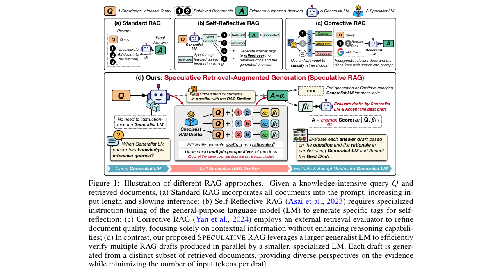
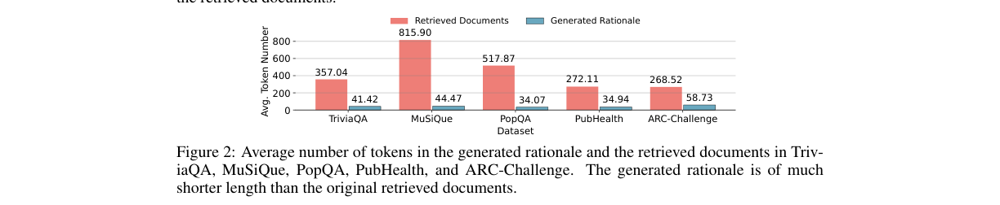
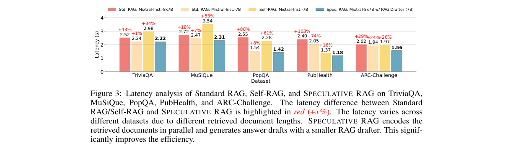
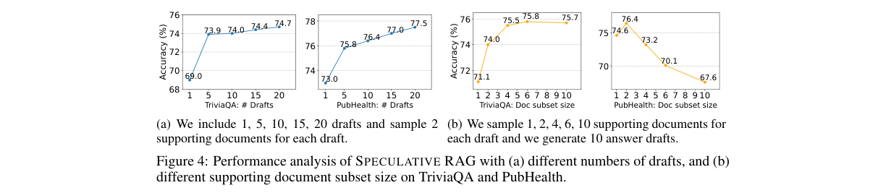

# Speculative RAG: Enhancing Retrieval Augmented Generation through Drafting

저자 :

Zilong Wang, Zifeng Wang, Long T. Le, Huaixiu Steven Zheng, Swaroop Mishra, Vincent Perot, Yuwei Zhang, Anush Mattapalli, Ankur Taly, Jingbo Shang, Chen-Yu Lee, Tomas Pfister

University of California, San Diego

Google Cloud AI Research

Google DeepMind

Google Cloud AI

발표 : ICLR 2025

논문 : [PDF](https://arxiv.org/pdf/2407.08223)

출처 : [https://arxiv.org/abs/2407.08223](https://arxiv.org/abs/2407.08223)

---

## 0. Summary

<p align='center'>

</p>

### 0.1. 문제 (Problem)

* **RAG의 비효율성**: 기존 RAG 시스템은 모든 검색 문서를 하나의 긴 프롬프트에 통합해 LLM에 입력한다. 문서 수가 많아질수록 입력 토큰이 폭발적으로 늘어나 처리 지연(latency)이 크게 증가한다.
* **위치 편향(position bias)**: 검색 문서가 길어질수록 LLM이 긴 컨텍스트의 중간 부분 정보를 제대로 활용하지 못하는 "lost-in-the-middle" 현상이 발생한다.
* **추가 훈련 의존성**: Self-Reflective RAG나 Corrective RAG 등 기존 고급 RAG 방법은 generalist LM에 대한 추가 instruction-tuning이나 외부 평가 모델을 필요로 해 실용성이 떨어진다.
* **정확도-지연 간 트레이드오프**: 검색 품질을 높이기 위해 여러 번의 정제 반복을 거치면 처리 속도가 더욱 느려지는 딜레마가 존재한다.

### 0.2. 핵심 아이디어 (Core Idea)

* **SPECULATIVE RAG**: "초안 생성 후 검증(Draft-then-Verify)" 패러다임을 RAG에 적용한 프레임워크. 소규모 전문가 모델이 여러 초안을 병렬로 빠르게 생성하고, 대규모 범용 모델이 한 번의 검증 패스로 최선의 초안을 채택한다.
  * 비유: 팀 프레젠테이션 준비에서 여러 파트 담당자가 각자 섹션 초안을 동시에 작성하고, 팀장이 가장 좋은 초안을 최종 선택하는 방식이다.

* **Specialist RAG Drafter (전문 초안 작성 모델)**: Mistral-7B 기반의 소규모 모델을 instruction-tuning해 검색 문서 이해에 특화시킨다. 이 모델은 '초안 답변(α)'과 '근거(β, rationale)'를 함께 생성하도록 훈련된다.
  * 왜 필요한가: 대형 모델이 직접 모든 문서를 처리하는 대신, 특화된 소형 모델이 빠르게 초안을 만들어 병목을 해소한다.

* **Multi-Perspective Sampling (다관점 샘플링)**: 검색된 문서들을 K-Means로 군집화하고, 각 군집에서 하나씩 문서를 추출해 서브셋을 구성한다. 서로 다른 서브셋(= 다른 관점)을 각 초안에 사용한다.
  * 비유: 동일 사건을 취재한 여러 신문 기사가 있을 때, 비슷한 기사끼리 묶은 뒤 각 묶음에서 하나씩 골라 다양한 시각을 확보하는 것과 같다.

* **Generalist RAG Verifier (범용 검증 모델)**: 추가 fine-tuning 없이 off-the-shelf LLM(Mixtral-8x7B 등)을 사용한다. 원본 검색 문서 대신 짧은 근거(β)만 보고 세 가지 점수를 계산해 최선의 초안을 선택한다:
  * $\rho_{Draft}$: 초안 작성 모델이 얼마나 자신 있게 생성했는지 (드래프터 자체 확률)
  * $\rho_{Self-contain}$: 근거가 질문과 얼마나 자연스럽게 연결되는지 (자기 일관성)
  * $\rho_{Self-reflect}$: "이 근거가 답을 지지하는가?"라는 자기 반성 질문에 대한 'Yes' 확률

  최종 점수: $\rho_j = \rho_{Draft,j} \cdot \rho_{SC,j} \cdot \rho_{SR,j}$

### 0.3. 효과 (Effects)

* **정확도 향상**: PubHealth 벤치마크에서 기존 Standard RAG 대비 최대 **12.97%** 정확도 향상.
* **지연 감소**: PubHealth에서 **50.83%** 지연 감소. TriviaQA에서 11.90%, PopQA에서 44.31% 감소.
* **추가 훈련 불필요**: Generalist LM에 대한 instruction-tuning 없이 범용 사전훈련 LM을 그대로 활용.
* **위치 편향 완화**: 각 초안이 소수의 문서 서브셋만 처리하므로 긴 컨텍스트로 인한 편향이 줄어든다.
* **병렬 처리**: 여러 초안이 동시에 생성되므로 초안 수를 늘려도 추가 지연이 없다.

### 0.4. 결과 (Results)

* **5개 벤치마크 전 부문 SOTA**: TriviaQA (74.24%), MuSiQue (31.57%), PopQA (57.54%), PubHealth (76.60%), ARC-Challenge (80.55%) — MVerifier-8x7B + MDrafter-7B 기준.
* **단독 RAG Drafter만으로도 경쟁력**: MDrafter-7B를 단독 사용해도 대부분의 baseline을 능가.
* **Ablation 결과**:
  * 다관점 샘플링 제거 시 TriviaQA -1.22~1.88%, PubHealth -1.22~2.23% 하락.
  * 검증 점수 중 하나라도 제거 시 최대 -5.69% 하락 (random selection 비교).
* **근거(rationale)의 효율성**: 근거 토큰 수는 검색 문서의 10~15% 수준에 불과하지만, 원본 문서를 쓸 때와 성능이 동등하거나 더 낮은 지연을 보인다.

### 0.5. 상세 동작 방식 (How It Works)

```
[질문 Q + 검색 문서 D]
    ↓
[Step 1: 다관점 샘플링]
  문서 D를 K-Means로 k개 군집으로 분류 (instruction-aware 임베딩 사용)
  군집별 1개 문서씩 샘플링 → 서브셋 δ_j (j=1..m)
    ↓
[Step 2: 병렬 초안 생성 (Specialist RAG Drafter)]
  각 서브셋 δ_j + 질문 Q → MDrafter → (초안 α_j, 근거 β_j)
  (m개 인스턴스 병렬 실행)
    ↓
[Step 3: 초안 검증 점수 계산 (Generalist RAG Verifier)]
  각 (α_j, β_j, Q) → MVerifier → ρ_Draft × ρ_Self-contain × ρ_Self-reflect
  (단일 forward pass로 모든 점수 계산)
    ↓
[Step 4: 최선 초안 선택]
  Â = argmax_j ρ_j
    ↓
[최종 답변 Â]
```

**Step 1 — 다관점 샘플링**: 쿼리를 고려한 instruction-aware 임베딩 모델(InBedder)로 모든 검색 문서를 벡터화한 뒤 K-Means 클러스터링. 각 클러스터에서 무작위로 1개 문서를 추출해 서브셋 δ를 구성. 이 과정을 m회 반복해 총 m개의 서브셋을 만든다. 각 서브셋은 다른 관점(topic)을 대표하므로 정보 다양성을 보장하고 중복을 최소화한다.

**Step 2 — 병렬 초안 생성**: instruction-tuning된 소형 RAG Drafter가 각 서브셋을 입력으로 받아 (답변 초안 α, 근거 β)를 생성. 훈련 시 강한 LM(Gemini-Ultra)으로 자동 합성한 근거를 지도 학습. 여러 드래프터 인스턴스가 동시에 실행되므로 초안 수가 많아도 지연이 늘지 않는다.

**Step 3 — 검증 점수 계산**: Generalist LM이 프롬프트 `[Q, α, β, R, "Yes"]`를 한 번에 인코딩해 자동회귀 확률에서 세 점수를 추출. $\rho_{SC}$는 α와 β의 토큰 생성 확률의 곱, $\rho_{SR}$은 "Yes" 토큰의 조건부 확률로 계산.

**Step 4 — 최선 초안 선택**: 복합 점수 $\rho_j = \rho_{Draft,j} \cdot \rho_{SC,j} \cdot \rho_{SR,j}$가 가장 높은 초안을 최종 답변으로 채택.

---

## 1. Introduction

대형 언어 모델(LLM)은 방대한 매개변수 기억(parametric memory)을 통해 질의응답 등 다양한 작업에서 뛰어난 성능을 보인다. 그러나 최신 정보나 비공개 사실을 요구하는 지식 집약적 질문에서는 사실 오류와 환각(hallucination)을 생성하는 근본적인 한계가 있다.

검색 증강 생성(Retrieval Augmented Generation, RAG)은 이 문제에 대한 핵심 해결책으로 부상했다. 외부 데이터베이스에서 관련 문서를 검색해 LLM의 컨텍스트에 포함시켜 사실 오류를 줄인다. 그러나 현실에서는 단일 질문에 여러 문서를 검색해야 하며, 이로 인해 입력 토큰이 증가하고 처리 지연이 심화된다.

기존 고급 RAG 방법들은 두 가지 방향으로 발전해왔다. (1) Self-Reflective RAG(Self-RAG)는 LLM이 검색 여부와 문서 관련성을 스스로 판단하는 특수 태그를 생성하도록 instruction-tuning하지만, 이 추가 훈련은 비용이 크고 망각(forgetting) 위험이 있다. (2) Corrective RAG(CRAG)는 외부 NLI 모델로 문서 품질을 평가하지만 고수준 추론 능력이 부족하다. 두 방법 모두 실시간 환경에서 지연 문제를 개선하지 못한다.

SPECULATIVE RAG는 이 딜레마를 "분업(divide-and-conquer)"으로 해결한다. Speculative Decoding(초안 토큰을 소형 모델이 생성하고 대형 모델이 병렬 검증하는 추론 가속화 기법)에서 영감을 받아, 이를 토큰 단위가 아닌 답변 단위로 확장했다. 소형 전문화 모델(RAG Drafter)이 다양한 관점의 초안을 빠르게 병렬 생성하고, 대형 범용 모델(RAG Verifier)이 초안의 근거만을 보고 한 번에 검증해 최선의 답변을 선택한다.

## 2. Method

### 2.1 개요 (Overview)

SPECULATIVE RAG는 두 모델의 협업 구조로 설계된다:
- **MDrafter**: Mistral-7B 기반, instruction-tuning된 소형 전문가 모델
- **MVerifier**: Mixtral-8x7B 또는 Mistral-7B, 추가 훈련 없는 범용 LLM

알고리즘은 크게 4단계로 구성된다:

1. **문서 군집화**: 검색된 n개 문서를 instruction-aware 임베딩 모델로 k개 클러스터로 분류
2. **다관점 서브셋 구성**: 각 클러스터에서 1개씩 샘플링해 k개 문서로 구성된 서브셋 δ를 m개 구성
3. **병렬 초안 생성**: MDrafter가 m개 서브셋에 대해 병렬로 (α_j, β_j) 쌍 생성
4. **검증 및 선택**: MVerifier가 각 초안의 복합 점수 계산, 최고 점수 초안 채택

### 2.2 Specialist RAG Drafter

**Instruction Tuning**: 학습 데이터 (Q, A, D) 트리플릿에서 강한 LLM(Gemini-Ultra)을 이용해 근거 E를 자동 합성. MDrafter는 다음 목적함수로 훈련된다:

$$\mathcal{L} = \mathbb{E}_{(Q,A,D,E)} \log P_{M_{Drafter}}(A, E \mid Q, D)$$

여기서 Q는 질문, A는 답변, D는 검색 문서, E는 합성된 근거다.

**Multi-Perspective Sampling**: instruction-aware 임베딩 모델 E를 사용해 문서를 임베딩한 뒤 K-Means 군집화:

$$\{emb(d_1), \ldots, emb(d_n)\} = \mathcal{E}(d_1, \ldots, d_n \mid Q)$$

$$\{c_1, \ldots, c_k\} = \text{K-Means}(emb(d_1), \ldots, emb(d_n))$$

$$\delta = \{\text{random.sample}(c) \text{ for } c \in \{c_i\}^k_1\}$$

각 서브셋은 k개의 문서로 구성되며, 서로 다른 토픽 클러스터를 대표해 다관점 커버리지를 보장한다.

### 2.3 Generalist RAG Verifier

MVerifier는 원본 문서를 직접 처리하지 않고, MDrafter가 생성한 근거(β)만을 입력으로 받아 세 가지 점수를 단일 forward pass에서 계산한다:

**자기 일관성 점수 (Self-Consistency Score)**:

$$\rho_{SC} = \prod_{t_i \in \alpha} P(t_i \mid t_{<i}) \cdot \prod_{t_i \in \beta} P(t_i \mid t_{<i})$$

**자기 반성 점수 (Self-Reflection Score)**:

$$\rho_{SR} = \prod_{t_i \in \text{"Yes"}} P(t_i \mid t_{<i})$$

프롬프트 구조: $[Q, \alpha_j, \beta_j, R, \text{"Yes"}]$를 순서대로 인코딩해 각 위치의 토큰 조건부 확률을 읽어낸다. 이를 통해 단일 forward pass에서 두 점수를 동시에 추출할 수 있다.

**최종 점수**: $\rho_j = \rho_{Draft,j} \cdot \rho_{SC,j} \cdot \rho_{SR,j}$

최종 답변: $\hat{A} = \arg\max_{\alpha_j} \rho_j$

## 3. Experiments

### 실험 설정

- **벤치마크**: TriviaQA, MuSiQue, PopQA (자유형 QA), PubHealth, ARC-Challenge (폐쇄형 생성)
- **모델**: MDrafter = Mistral-7B(v0.1) instruction-tuned, MVerifier = Mistral-7B 또는 Mixtral-8x7B (미세조정 없음)
- **임베딩**: InBedder-RoBERTa (instruction-aware)
- **추론 프레임워크**: vLLM, greedy decoding
- **설정**: TriviaQA/PopQA/PubHealth/ARC-C: top 10 문서, m=5 초안, k=2 / MuSiQue: top 15 문서, m=10 초안, k=6

### 주요 결과

Table 1에서 SPECULATIVE RAG (MVerifier-8x7B + MDrafter-7B)는 5개 벤치마크 전체에서 모든 baseline을 능가한다:

| 방법 | TriviaQA | MuSiQue | PopQA | PubHealth | ARC-C |
|---|---|---|---|---|---|
| Mixtral-Instruct8x7B (Standard RAG) | 73.91 | 29.42 | 53.68 | 63.63 | 78.41 |
| Self-RAG Mistral-7B | 64.84 | 21.72 | 52.68 | 72.44 | 74.91 |
| Self-CRAG Mistral-7B | 65.43 | - | 56.11 | 72.85 | 75.26 |
| **Spec. RAG (8x7B+7B)** | **74.24** | **31.57** | **57.54** | **76.60** | **80.55** |

### 근거(Rationale) 효율성 분석

<p align='center'>

</p>

생성된 근거의 평균 토큰 수는 원본 검색 문서의 약 10~15% 수준 (예: TriviaQA의 경우 문서 357.04 토큰 vs 근거 41.42 토큰). 그럼에도 원본 문서를 직접 사용하는 것과 유사한 성능을 유지하면서 지연은 오히려 낮다.

### 지연 분석

<p align='center'>

</p>

SPECULATIVE RAG는 모든 벤치마크에서 최저 지연을 달성:
- PubHealth: Standard RAG 대비 **50.83%** 지연 감소
- PopQA: **44.31%** 감소
- TriviaQA: **11.90%** 감소

이는 소형 RAG Drafter가 더 짧은 컨텍스트를 처리하고, 병렬 실행으로 추가 지연 없이 다수 초안을 생성하기 때문이다.

### Ablation 연구

<p align='center'>

</p>

- **다관점 샘플링 제거**: TriviaQA -1.88%, PubHealth -2.23%
- **ρ_Self-contain 제거**: TriviaQA -2.20%
- **ρ_Self-reflect 제거**: TriviaQA -1.88%
- **검증 전혀 없음 (랜덤 선택)**: TriviaQA -5.69%, PubHealth -5.37%

### 초안 수 및 서브셋 크기 분석

- 초안 수를 늘릴수록 성능이 향상 (TriviaQA: 1개→69.0%, 20개→74.7%), 병렬 실행이므로 지연 불변
- 서브셋 크기(문서 수)는 최적값이 있음 (TriviaQA: k=4~6에서 최고, PubHealth: k=2에서 최고)

## 4. Conclusion

SPECULATIVE RAG는 RAG를 "초안 생성(drafting)" + "검증(verification)"으로 분리해 정확도와 속도를 동시에 향상시키는 새로운 패러다임을 제시한다. 소형 전문가 모델이 다관점 문서 서브셋에서 병렬로 초안을 생성하고, 범용 대형 모델이 추가 훈련 없이 근거 기반 검증을 수행한다. 5개 벤치마크에서 SOTA 달성과 함께 지연을 최대 50.83% 줄이는 효과를 입증했다.

**작성자 코멘트**: Speculative Decoding의 "소형 모델로 초안 생성 → 대형 모델로 검증" 아이디어를 토큰 단위가 아닌 답변 단위로 창의적으로 확장한 것이 핵심이다. 특히 Verifier 모델에 fine-tuning이 전혀 필요 없어 실용성이 높다. 다만 RAG Drafter 훈련 데이터 구축에 강한 LLM(Gemini-Ultra)의 근거 합성이 필요해 그 비용이 숨겨진 제약으로 남는다. 병렬 추론 인프라(여러 Drafter 인스턴스)가 필요하다는 점도 현실 배포 시 고려해야 할 사항이다.

---

## 부록: 사전 지식 (Prerequisites)

### A.1. 알아야 할 핵심 개념

- **RAG (Retrieval-Augmented Generation, 검색 증강 생성)** — 외부 데이터베이스에서 관련 문서를 검색해 LLM의 컨텍스트에 포함시켜 사실성을 높이는 기법.
  - 본문 위치: §1 Introduction, §2 Related Works

- **Speculative Decoding (투기적 디코딩)** — 소형 draft 모델이 여러 토큰을 미리 생성하고, 대형 target 모델이 병렬로 검증해 자동회귀 디코딩을 가속화하는 기법.
  - 본문 위치: §2 Related Works, §1 (영감의 원천으로 명시)

- **K-Means Clustering (K-평균 군집화)** — 데이터를 k개의 군집으로 나누는 비지도 학습 알고리즘. 각 포인트를 가장 가까운 군집 중심에 할당해 군집 내 분산을 최소화.
  - 본문 위치: §3.2 Multi-Perspective Sampling에서 검색 문서 군집화에 사용

- **Instruction Tuning (명령어 미세조정)** — 자연어 명령어-응답 쌍으로 사전훈련된 LLM을 추가 훈련해 지시 따르기 능력을 향상시키는 기법.
  - 본문 위치: §3.2 Specialist RAG Drafter 훈련 방식

- **Position Bias / Lost-in-the-Middle** — LLM이 긴 컨텍스트를 처리할 때 중간 위치 정보를 상대적으로 덜 활용하는 현상 (Liu et al., 2024).
  - 본문 위치: §1 Introduction, §3.1 Overview에서 해결 동기로 언급

- **Self-Consistency (자기 일관성)** — 동일 질문에 여러 번 답변을 생성해 다수결로 최종 답변을 선택하는 기법. 여기서는 답변-근거 쌍이 얼마나 자연스럽게 연결되는지 점수화에 적용.
  - 본문 위치: §3.3 Evaluation Scores (ρ_Self-contain)

- **Autoregressive Language Modeling (자동회귀 언어 모델링)** — 이전 토큰들을 조건으로 다음 토큰의 확률을 예측하는 LLM의 기본 훈련/추론 방식. 검증 점수 계산의 기반.
  - 본문 위치: §3.3 Computation Method

- **vLLM / PagedAttention** — LLM 추론을 위한 고효율 서빙 프레임워크. KV 캐시를 페이지 단위로 관리해 메모리 효율과 처리량을 향상.
  - 본문 위치: §4.2 Experiment Settings에서 사용

### A.2. 먼저 읽으면 좋은 논문

1. **[2023][Speculative Decoding]** ([arxiv](https://arxiv.org/abs/2211.17192)) — 소형 draft 모델 + 대형 target 모델의 draft-then-verify 패러다임으로 LLM 추론을 2~3배 가속화.
   - **왜?** Speculative RAG의 핵심 아이디어가 이 논문의 토큰 수준 투기적 디코딩을 답변 수준으로 확장한 것. 이 논문 없이 Speculative RAG의 설계 동기를 이해하기 어렵다.
   - **Repo 내 정리**: [General_AI/[논문][2023][Speculative Decoding] Fast Inference from Transformers via Speculative Decoding.md](../General_AI/[논문][2023][Speculative%20Decoding]%20Fast%20Inference%20from%20Transformers%20via%20Speculative%20Decoding.md)

2. **[2023][Self-RAG]** ([arxiv](https://arxiv.org/abs/2310.11511)) — LLM을 instruction-tuning해 검색 여부 판단, 관련성 비판, 답변 지지 여부를 특수 reflection 태그로 생성하는 RAG 방법.
   - **왜?** Speculative RAG의 주요 비교 baseline. Self-RAG의 instruction-tuning 의존성 한계를 극복하는 것이 Speculative RAG의 동기 중 하나.

3. **[2024][Adaptive-RAG]** ([arxiv](https://arxiv.org/abs/2403.14403)) — 쿼리 복잡도에 따라 RAG 전략을 동적으로 선택(단순 → 단일 스텝, 복잡 → 다단계)하는 적응형 RAG.
   - **왜?** RAG를 질문 복잡도에 맞게 적응시키는 방향의 선행 연구. Speculative RAG와 같은 "효율 + 정확도" 균형 추구 계보.
   - **Repo 내 정리**: [Agentic_AI/[논문][2024][Summary][Adaptive-RAG] Adaptive-RAG - Learning to Adapt Retrieval-Augmented Large Language Models through Question Complexity.md](../Agentic_AI/[논문][2024][Summary][Adaptive-RAG]%20Adaptive-RAG%20-%20Learning%20to%20Adapt%20Retrieval-Augmented%20Large%20Language%20Models%20through%20Question%20Complexity.md)

4. **[2024][CRAG]** ([arxiv](https://arxiv.org/abs/2401.15884)) — 외부 NLI 모델로 검색 문서 품질을 평가해 correct/ambiguous/incorrect로 분류 후 정제하는 RAG.
   - **왜?** Speculative RAG의 또 다른 주요 baseline. CRAG의 "문서 품질 평가" 아이디어와 Speculative RAG의 "초안 검증"의 차이를 이해하는 데 필요.

5. **[2024][VisRAG]** ([arxiv](https://arxiv.org/abs/2410.10594)) — 텍스트 대신 페이지 이미지를 직접 임베딩해 멀티모달 문서에 RAG를 적용하는 방법.
   - **왜?** RAG의 멀티모달 확장 방향. Speculative RAG 이후 RAG 생태계의 발전을 이해하는 데 참고.
   - **Repo 내 정리**: [General_AI/[논문][2025][Summary][VISRAG] VISION-BASED RETRIEVAL-AUGMENTED GENERATION ON MULTI-MODALITY DOCUMENTS.md](../General_AI/[논문][2025][Summary][VISRAG]%20VISION-BASED%20RETRIEVAL-AUGMENTED%20GENERATION%20ON%20MULTI-MODALITY%20DOCUMENTS.md)

### A.3. 관련/후속 논문

- **[2024][SURE]** (Kim et al., arxiv:2404.13081) — 검색 결과를 답변 후보로 요약(summarization)해 open-domain QA 정확도를 높이는 방법. Speculative RAG의 근거(rationale) 기반 검증과 유사한 "문서 압축" 아이디어.

- **[2024][Medusa]** (Cai et al., arxiv:2401.10774) — 단일 LLM에 여러 디코딩 헤드를 추가해 한 번에 여러 미래 토큰을 예측하는 투기적 디코딩 변형. Speculative Decoding의 단일 모델 버전.

- **[2023][Active RAG / FLARE]** (Jiang et al.) — LLM이 스스로 검색 쿼리를 생성하고 필요할 때 검색하는 능동적(active) RAG. Speculative RAG와 보완적인 "언제 검색할 것인가" 방향.
