# The Cost of Dynamic Reasoning: Demystifying AI Agents and Test-Time Scaling from an AI Infrastructure Perspective

저자 :

Jiin Kim, Byeongjun Shin, Jinha Chung, Minsoo Rhu

KAIST

발표 : HPCA 2026

논문 : [PDF](https://arxiv.org/pdf/2506.04301)

출처 : [https://arxiv.org/abs/2506.04301](https://arxiv.org/abs/2506.04301)

---

## 0. Summary

<p align='center'>
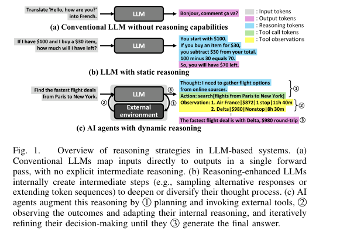
</p>

### 0.1. 문제 (Problem)

* 기존 LLM 서빙(Serving) 연구는 대부분 **정적(static)·단일 턴(single-turn) 추론** — 즉 입력 한 번에 출력 한 번 — 을 가정하고 시스템/아키텍처를 최적화해 왔다.
* 그러나 최근의 **AI Agent**는 LLM이 외부 도구(검색, 계산기, 코드 실행기 등)를 호출하고 결과를 관찰한 뒤 다시 추론하는 과정을 수십 번 반복하는 **동적 추론(Dynamic Reasoning)** 을 수행한다.
* 이 반복 구조는 한 요청당 LLM 호출 수, 토큰 길이, latency, 에너지 소비를 **수십~수백 배** 증가시키지만, 시스템 레벨에서 그 비용이 정량적으로 분석된 적이 없었다.
* 그 결과 학계/업계는 "어제의 워크로드(단일 턴)"에 맞춰진 인프라를 짓고 있어, agent 시대의 **지속가능성(sustainability)** 위기가 가려져 있었다.

### 0.2. 핵심 아이디어 (Core Idea)

* 이 논문은 새로운 알고리즘을 제안하는 것이 아니라, **AI Agent의 시스템 비용을 처음으로 정량 측정·해부(demystify)한 특성 분석(characterization) 연구**다. 핵심 개념을 풀어 설명하면:

* **(1) 동적 추론(Dynamic Reasoning) = agent 루프**
  * 정의: LLM이 "계획 → 도구 호출 → 결과 관찰 → 추론 갱신"을 반복하다가 답을 내는 구조.
  * 왜 필요한가: 복잡한 문제는 한 번에 못 푸니, 사람처럼 검색하고 계산하며 단계적으로 푼다.
  * 비유: 셰프가 레시피를 한 번에 외워 요리하는 게 아니라(단일 턴), 맛을 보고(관찰) 간을 다시 맞추는(추론 갱신) 과정을 여러 번 반복하는 것.

* **(2) 테스트타임 스케일링(Test-Time Scaling)**
  * 정의: 모델 파라미터는 그대로 두고, **추론 시점에 계산량을 더 써서** 정확도를 올리는 기법.
  * 두 가지 방식: **순차 스케일링(Sequential)** = 반성(reflection) 단계를 더 깊게 쌓는 것(Reflexion), **병렬 스케일링(Parallel)** = 여러 추론 가지를 동시에 펼쳐 best를 고르는 것(LATS의 트리 탐색).
  * 비유: 순차는 "한 사람이 답을 16번 고쳐 쓰는 것", 병렬은 "16명이 동시에 답을 써서 가장 좋은 걸 뽑는 것".

* **(3) Prefix Caching**
  * 정의: 반복 호출 시 공통으로 겹치는 앞부분 입력(prefix)의 KV 캐시(Key-Value cache, attention 중간 계산값)를 재사용해 중복 연산을 건너뛰는 기법.
  * 왜 필요한가: agent는 매 단계마다 이전 대화·도구 결과를 누적해 입력에 다시 붙이므로 prefix가 크게 겹친다.

* **(4) per-query 에너지 → 데이터센터 전력**
  * 핵심 발견: agent 한 질의는 단일 턴 대비 GPU 에너지를 **62.1~136.5배** 더 소모하며, 정확도는 계산을 늘릴수록 **수확 체감(diminishing returns)** 한다.
  * 이를 다음 식으로 데이터센터 전력으로 환산: $P = (\text{Wh/query}) \times (\text{Queries/day} / 24)$
  * 여기서 $P$는 데이터센터 전력(W), Wh/query는 질의당 GPU 에너지, Queries/day는 하루 질의 수.

### 0.3. 효과 (Effects)

* AI Agent의 latency·GPU 활용률·토큰·에너지·전력 수요를 **5종 agent × 4종 벤치마크**에 걸쳐 처음으로 end-to-end 정량화.
* "계산을 더 쓰면 정확도가 오른다"는 통념이 **빠르게 포화/수확 체감**하며, tail latency(꼬리 지연)만 늘어남을 실증.
* Prefix caching 같은 기존 최적화가 agent에는 단일 턴보다 훨씬 큰 효과(throughput +5.62배)를 줌을 규명.

### 0.4. 결과 (Results)

* **호출 폭증**: agent는 CoT 대비 평균 9.2배 많은 LLM 호출. LATS는 질의당 평균 71.0회 LLM 호출.
* **latency 구성**: LLM 추론 69.4% / 도구 실행 30.2%. GPU idle이 최대 54.5%까지 발생, decode가 GPU 시간의 74.1%(prefill은 4.7%).
* **에너지(HotpotQA, Table III)**: 단일 턴(ShareGPT)은 0.32 Wh(8B)/2.55 Wh(70B). Reflexion은 41.53/348.41 Wh, LATS는 22.76/158.48 Wh → 단일 턴 대비 62.1~136.5배.
* **전력(Table IV)**: 하루 7,140만 질의 가정 시 70B-Reflexion은 약 1 GW(단일 턴의 거의 1000배). Google 검색 규모(137억 질의/일)로 환산하면 70B-Reflexion은 약 200 GW로, 미국 전체 평균 부하(476.9 GW)의 절반에 육박.
* **병렬 스케일링의 묘미**: LATS의 child node를 1→16으로 늘리면 정확도 +14.4%p **이면서 동시에** 평균 latency −196.3s. 단, 동시 LLM 호출 증가로 메모리 압박.

### 0.5. 상세 동작 방식 (How It Works)

이 논문은 "알고리즘"이 아니라 **측정 파이프라인**으로 동작한다. 배경 지식이 없어도 따라올 수 있도록 단계별로 정리한다.

```
[사용자 질의]
   │
   ▼
[Agent 루프] LLM 추론 ⇄ 도구 호출 (N회 반복)
   plan → tool → observe → refine ... → answer
   │
   ▼
[vLLM 서빙 백엔드] 연속 배칭(continuous batching) + prefix caching
   │
   ▼
[측정] latency / GPU 활용률 / 토큰 수 / 질의당 에너지(Wh)
   │
   ▼
[스케일 환산] × (Queries/day) ÷ 24h
   │
   ▼
[데이터센터 전력(GW)] → 지속가능성 판정
```

Step 1. **agent 워크플로우 정의** — CoT, ReAct, Reflexion, LATS, LLMCompiler 5종을 reasoning/도구 사용/reflection/트리 탐색/구조적 계획 유무로 분류해 측정 대상을 확정한다. (입력: agent 공식 구현체 / 출력: 통일된 평가 프레임워크)

Step 2. **agent 루프 실행** — 한 질의가 들어오면 worker가 LLM 추론(다음 행동 결정)과 도구 호출(위키 API, 파이썬 계산기 등)을 번갈아 수행한다. LLM 출력이 있어야 어떤 도구를 부를지 정해지고, 도구 결과(관찰)가 있어야 다음 LLM 호출이 가능하므로 둘은 **순차 의존(sequential dependency)** 관계다 → 이 때문에 GPU가 도구를 기다리며 idle.

Step 3. **서빙 시스템 측정** — vLLM(version 0.6.6) 백엔드에 Llama-3.1 8B(A100 1장) / 70B(A100 8장)를 올리고, Poisson 도착 분포로 동시 요청을 흘려 QPS별 tail latency·KV 캐시 메모리를 측정한다. prefix caching 켬/끔을 비교.

Step 4. **per-query 비용 산출** — 질의당 GPU 에너지(Wh/query), 토큰 사용량, latency를 agent별·모델 크기별로 집계한다.

Step 5. **데이터센터 전력 환산** — 위 식 $P = (\text{Wh/query}) \times (\text{Queries/day}/24)$ 로 ChatGPT 추정 트래픽(7,140만/일)과 Google 검색 트래픽(137억/일) 시나리오의 전력 수요를 산출하고, 실제 도시/국가 전력망과 비교해 지속가능성 위기를 진단한다.

전체 데이터 흐름 요약: **[질의] → [반복 agent 루프] → [vLLM 측정] → [질의당 Wh] → [×트래픽/24h] → [GW 단위 전력 수요]**.

<p align='center'>
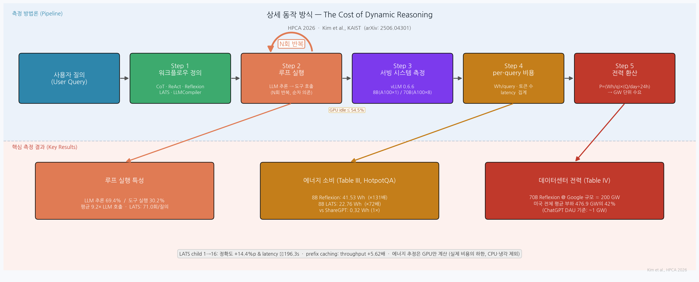
</p>

---

## 1. Introduction

최근 LLM 발전의 축은 모델 크기·사전학습 데이터 확장에서 **추론 시점의 행동을 개선**하는 방향, 즉 테스트타임 스케일링(test-time scaling)으로 옮겨가고 있다. Chain-of-Thought, Tree-of-Thought 같은 기법은 파라미터를 바꾸지 않고 추론 단계를 늘려 정확도를 올린다. 그러나 이런 reasoning-enhanced LLM조차 수천 장의 GPU 위에서 돌며, 전력·냉각·자본 비용으로 월 수천만 달러가 든다. ChatGPT 질의 한 번이 웹 검색의 약 10배 전기를 쓴다는 추정도 있다.

여기에 **AI Agent**가 등장하면서 인프라 압력은 폭증한다. agent는 정적 매핑이 아니라, 외부 환경과 능동적으로 상호작용하며(그림 1(c)) 계획→도구 호출→관찰→추론 갱신을 한 질의에 수십 번 반복하는 **동적 추론**을 한다. 시스템 레벨 혁신 없이는 질의당 계산 비용이 수십~수백 배로 뛸 수 있다. OpenAI의 Stargate, Meta의 Hyperion 같은 차세대 데이터센터가 **기가와트(GW)급** 전력과 수천억 달러를 예고하는 배경이다.

그럼에도 컴퓨터 아키텍처 커뮤니티는 여전히 정적 LLM에만 집중해, 동적 추론 워크로드의 인프라 함의는 거의 탐구되지 않았다. 본 논문은 이 공백을 메우기 위해, 다양한 agent 설계와 벤치마크에 걸쳐 **자원 사용·latency·에너지 수요를 정량적으로 측정한 최초의 시스템 레벨 특성 분석**을 제시한다. 목표는 동적 추론 배포의 인프라 비용을 정량 평가하고, 지속가능하고 효율적인 설계 원칙의 시급성을 커뮤니티에 경고하는 것이다.

## 2. Method

본 논문의 "method"는 새 알고리즘이 아니라 **측정 방법론(methodology)** 이다.

<p align='center'>
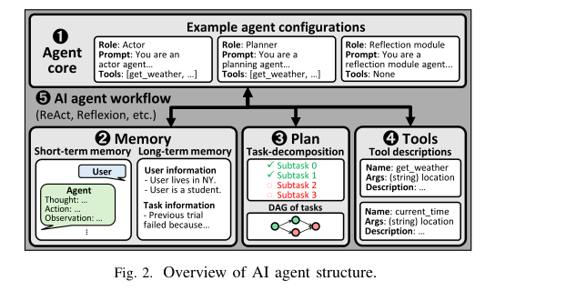
</p>

**AI Agent의 구조 (그림 2).** agent는 네 가지 핵심 컴포넌트로 구성된다.

* **(1) Agent core**: actor(다음 행동 결정), planner(목표를 하위 작업으로 분해), reflection(과거 추론을 평가)의 역할(role)로 동작하는 LLM(들).
* **(2) Memory**: 단기 상호작용 기록과 장기 지식을 저장해 추론 단계 간 연속성 유지.
* **(3) Plan**: 목표를 하위 작업 시퀀스 또는 의존성 DAG(Directed Acyclic Graph)로 조직.
* **(4) Tools**: 검색 엔진, 계산기, 코드 실행기 등 외부 환경과의 상호작용.
* 이들이 반복 상호작용하는 **(5) agent workflow**는 (a) LLM 추론 단계와 (b) 도구 사용 단계가 교대로 일어나며 진행된다.

<p align='center'>
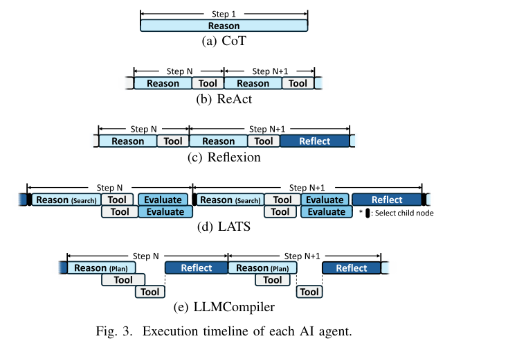
</p>

**측정 대상 agent 5종 (Table I, 그림 3 — 실행 타임라인).**

* **CoT**: 외부 도구 없이 내부 추론만 (단일 턴 baseline).
* **ReAct**: reasoning + tool use를 단순 반복.
* **Reflexion**: 주기적 self-evaluation과 reflection을 추가한 가장 기본적인 reflective agent (순차 스케일링 대표).
* **LATS (Language Agent Tree Search)**: Monte Carlo Tree Search로 여러 추론·행동 분기를 시뮬레이션 (병렬 스케일링 대표).
* **LLMCompiler**: 의존성을 분석해 DAG 계획을 세우고 도구 호출을 비동기·병렬 스트리밍 실행해 latency를 줄임.

**벤치마크 4종 (Table II).** HotpotQA(멀티홉 QA, 위키 API), WebShop(온라인 쇼핑, 웹 내비게이션), MATH(수학, Wolfram Alpha·파이썬 계산기), HumanEval(프로그래밍, 자가 생성 테스트 코드 실행). 비교용 비-agent 데이터셋으로 ShareGPT(단일 턴 챗봇)도 사용. 부적합한 조합(예: 도구 없는 CoT는 WebShop 제외)은 생략.

**LLM 백엔드/하드웨어.** vLLM 0.6.6 + PyTorch 2.6 + CUDA 12.8, prefix caching 활성화(기본). 기본 모델은 Llama-3.1-8B-Instruct, 모델 크기 영향 분석에는 Llama-3.1-70B-Instruct도 사용. 하드웨어는 GCP의 A100 40GB GPU (8B는 1장, 70B는 8장).

**핵심 수식 (전력 환산).** per-query 에너지를 데이터센터 전력으로 옮기는 단 하나의 식:

$$P = (\text{Wh/query}) \times \frac{\text{Queries/Day}}{24\ \text{hours}}$$

여기서 $P$는 데이터센터 전체 전력 수요(Watt), Wh/query는 질의 1회당 GPU 에너지 소비, Queries/Day는 일일 질의 수다. 이 단순 환산이 "modest한 트래픽도 질의당 에너지가 ~100 Wh를 넘으면 GW급 전력이 된다"는 결론의 근거가 된다.

## 3. Experiments

평가는 각 벤치마크 50문항 샘플에 대해 평균 정확도와 계산 비용을 측정한다. 정확도는 HotpotQA/MATH는 exact match, WebShop은 태스크 점수, HumanEval은 유닛 테스트 통과율.

**(1) 워크플로우 특성.**

<p align='center'>
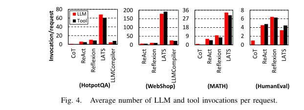
</p>

* **호출 폭증**: tool-augmented agent는 CoT 대비 평균 **9.2배** 많은 LLM 호출. **LATS는 질의당 평균 71.0회** (트리 노드 확장 시 child마다 별도 LLM 추론).
* **latency 구성**: 평균적으로 LLM 추론 **69.4%**, 도구 실행 **30.2%**. 둘은 순차 의존이라 겹치기 어려움(LLMCompiler가 비동기로 겹쳐도 overlap은 18.2%에 그침). 도구 latency는 워크로드에 따라 큼 — WebShop은 로컬 웹으로 호출당 ~20 ms, HotpotQA는 위키 API로 평균 1.2초.
* **GPU 활용률**: HotpotQA/MATH처럼 CPU·외부 시스템 도구를 쓰면 GPU idle이 최대 **54.5%**. LLM 실행 시간 중 decode가 **74.1%**, prefill이 **4.7%** — memory-bound한 decode 비중이 커 GPU 저활용 심화.

<p align='center'>
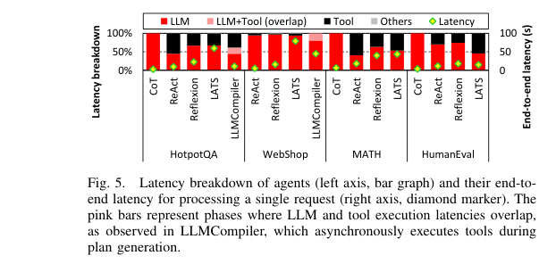
</p>

**(2) 토큰·prefix caching 효과.**

* agent는 누적되는 LLM history·tool history 때문에 입력 토큰이 길다. HotpotQA는 초기 ~1,000 토큰이 이후 3~4배로 증가.
* prefix caching은 prefill latency를 평균 **60.1%** 감소, end-to-end LLM latency를 **15.7%** 감소. CoT는 decode 지배적이라 효과 작음.
* 메모리: tool-augmented agent는 CoT 대비 질의당 **3.0배**(최악 5.4배) KV 캐시 사용. LATS에서 병렬 호출의 공유 prefix 재사용으로 메모리 **64.8%** 절감.

**(3) 서빙 특성.**

<p align='center'>
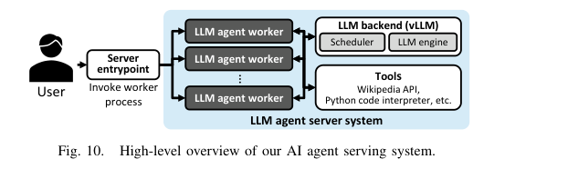
</p>

* 순차 실행 대비 동시 실행 시 throughput이 HotpotQA 25배, WebShop 6.2배 향상(평균 latency는 2.1배 증가).
* 단일 턴(ShareGPT)은 최대 6.4 QPS를 지탱하지만, ReAct는 HotpotQA 2.6 QPS, WebShop 1.2 QPS로 크게 낮음.
* prefix caching의 throughput 향상: ShareGPT는 1.03배에 그치나 **ReAct는 평균 5.62배** — agent는 질의당 다회 LLM 호출이라 중복 prefill 제거 효과가 증폭. 서빙 시 KV 캐시 평균 51.7%, 최대 63.5% 절감.

**(4) 테스트타임 스케일링과 비용 효율 (수확 체감).**

<p align='center'>
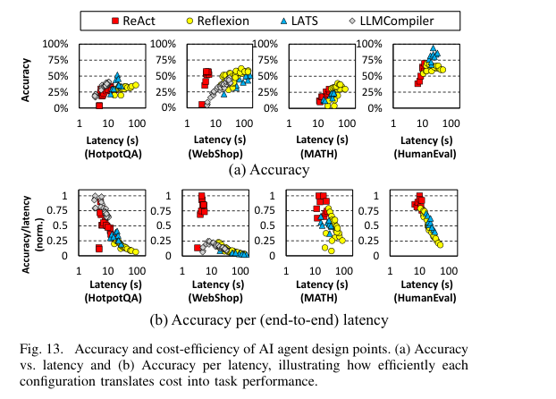
</p>

* **Pareto 분석**: agent 설계점(few-shot 수, 최대 iteration 등)을 정확도-latency 평면에 펼치면, ReAct는 낮은 latency로 적당한 정확도(높은 비용 효율), Reflexion은 reflection으로 소폭 정확도↑·큰 latency↑, LATS는 트리 탐색으로 높은 정확도↑·큰 계산 오버헤드↑. 모든 agent·워크로드에서 **"계산이 늘면 정확도는 오르되 수확 체감"** 패턴이 일관되게 나타나, 정확도만 좇기보다 Pareto frontier 근처 설정을 찾아야 함을 강조.

<p align='center'>
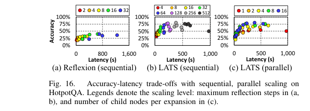
</p>

* **순차 스케일링 수확 체감**: Reflexion에서 16.9s→25.6s(+4%p)는 저렴하지만, 동일 향상을 56.0s 이후에 얻으려면 +269.5s(31배 비용).
* **병렬 스케일링의 우월**: LATS child 1→16은 정확도 **+14.4%p**이면서 동시에 평균 latency **−196.3s**. 단, 동시 LLM 호출 증가로 메모리 압박·확장성 제약.
* **모델 크기 (그림 17)**: 70B는 적은 단계로 높은 정확도. 8B는 더 많은 토큰/단계가 필요하나, A100 1장만 쓰므로 질의당 에너지는 오히려 효율적. 흥미롭게도 **8B + LATS(병렬 스케일링)** 조합은 70B에 근접한 정확도를 더 낮은 에너지로 달성 — 테스트타임 전략이 저자원 환경의 보완재가 됨.

<p align='center'>
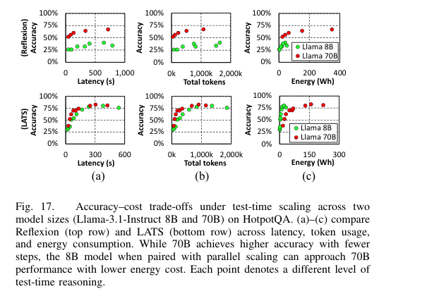
</p>

**(5) 인프라 함의 (Table III, IV).**

<p align='center'>
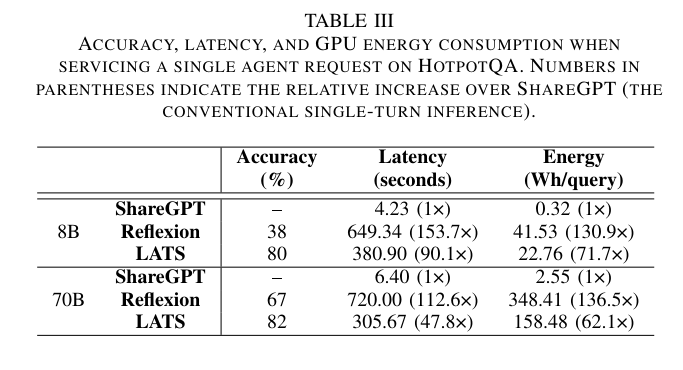
</p>

* per-query 에너지(HotpotQA): ShareGPT 0.32 Wh(8B)/2.55 Wh(70B) vs Reflexion 41.53/348.41 Wh, LATS 22.76/158.48 Wh → **62.1~136.5배**.
* 하루 7,140만 질의(보수적 ChatGPT DAU, 사용자당 1질의) 가정 시 70B-Reflexion은 일일 24.89 GWh ≈ 시애틀권 일일 전력 소비(24.8 GWh).

<p align='center'>
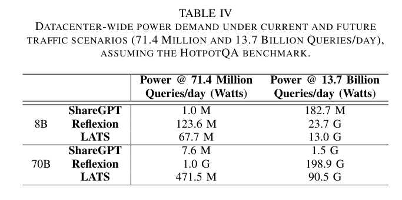
</p>

* 데이터센터 전력: 7,140만 질의/일에서 8B agent도 67.7~123.6 MW, 70B agent는 약 **1 GW** (Stargate 예고 규모와 일치). Google 검색 규모(137억/일)로 환산하면 70B-Reflexion은 약 **200 GW** — 미국 평균 부하(476.9 GW)의 절반에 육박, 어떤 발표된 데이터센터 프로젝트(Meta Hyperion 5 GW 등)도 초과.

## 4. Conclusion

본 논문은 AI 인프라 관점에서 AI Agent를 **시스템 레벨로 특성 분석한 최초의 연구**다. agent는 강력한 추론 능력을 보이지만, 단일 턴 LLM 대비 **수십~수백 배의 에너지 오버헤드**와 무거운 latency·인프라 비용을 유발하며, 테스트타임 스케일링은 정확도에서 급격한 수확 체감을 보인다. 따라서 무차별적 brute-force 스케일링에서 벗어나, **계산 인지형(compute-aware) 추론 전략** — 스마트 스케줄링, 캐싱, 프롬프트 엔지니어링, 하이브리드 스케일링 — 으로 단위 비용당 정확도를 최적화해야 한다. 향후 방향으로 SLM/LLM 혼합 멀티에이전트, carbon-aware computing, 난이도 기반 적응적 스케일링을 제시한다.

한계로는, 에너지 추정이 GPU만 계산하고 CPU·메모리·네트워킹·스토리지·냉각 오버헤드는 포함하지 않아 실제 비용의 하한에 해당하며, 요청 배칭(batching)도 반영하지 않아 conservative한 추정임을 저자들도 인정한다. 또한 분석에 사용된 최대 모델(70B)이 실제 frontier LLM(수천억~조 파라미터)보다 훨씬 작아 현실의 비용은 더 클 수 있으며, SLA 제약 하의 효율적 agent 서빙 분석은 향후 과제로 남겨져 있다.

**Commentary (작성자 한 줄평):** 새 모델 없이 "측정"만으로 강력한 메시지를 던진 논문 — agent가 똑똑해질수록 전기 청구서는 도시 하나를 삼킨다는 것을, 누구나 따라 할 수 있는 한 줄 전력 환산식으로 증명한 점이 인상적이다.

---

## 부록: 사전 지식 (Prerequisites)

### A.1. 알아야 할 핵심 개념

- **동적 추론 루프 (Dynamic Reasoning Loop / Agentic Workflow)** — LLM이 "계획 → 도구 호출 → 결과 관찰 → 추론 갱신"을 반복하다 최종 답을 내는 구조. 정적 단일 턴 추론과 대비되는 개념.
  - 본문 위치: §2 (Agent 구조 및 5종 분류), §0.1–0.2

- **테스트타임 스케일링 (Test-Time Scaling)** — 모델 파라미터는 고정한 채 추론 시점에 연산량을 늘려 정확도를 높이는 기법. 순차 스케일링(sequential)과 병렬 스케일링(parallel) 두 축으로 구분.
  - 본문 위치: §0.2, §3(4) 테스트타임 스케일링과 비용 효율 (Pareto 분석, 수확 체감)

- **Prefill vs. Decode 단계** — 트랜스포머 자기회귀 생성의 두 단계: prefill은 입력 토큰 전체를 병렬 처리(compute-bound), decode는 토큰을 한 번에 하나씩 생성(memory-bandwidth-bound). 두 단계의 특성이 다르므로 GPU 활용률 분석에서 중요.
  - 본문 위치: §3(1) 워크플로우 특성 (decode 74.1%, prefill 4.7%)

- **KV 캐시 (Key-Value Cache)** — Transformer attention 계산 시 과거 토큰의 Key·Value 벡터를 GPU 메모리에 보관해 재계산을 피하는 기법. 입력 길이에 비례해 메모리 사용량이 증가하며 agent에서 특히 중요.
  - 본문 위치: §3(2) 토큰·prefix caching 효과 (tool-augmented agent가 CoT 대비 최대 5.4배)

- **Prefix Caching** — 반복 LLM 호출 시 공통으로 겹치는 앞부분 입력의 KV 캐시를 재사용해 중복 prefill 연산을 생략하는 기법. Agent는 누적 history 때문에 prefix 중복도가 높아 효과가 크다.
  - 본문 위치: §3(2), §3(3) 서빙 특성 (throughput +5.62배, prefill latency −60.1%)

- **연속 배칭 (Continuous Batching)** — 고정 크기 배치가 끝날 때까지 기다리지 않고 개별 요청이 끝나는 즉시 새 요청을 미니배치에 삽입하는 서빙 최적화 기법. vLLM(PagedAttention)이 기반.
  - 본문 위치: §2 (서빙 백엔드로 vLLM 사용), §3(3) 서빙 특성 분석

- **Tail Latency (꼬리 지연)** — 응답시간 분포의 상위 퍼센타일(p99 등). 평균 latency가 낮아도 tail이 크면 사용자 경험 악화. Agent는 반복 LLM 호출로 variance가 크게 증가.
  - 본문 위치: §3(4) 테스트타임 스케일링 (순차 스케일링 수확 체감, tail latency 급증)

- **수확 체감 / Pareto Frontier** — 계산 자원을 늘릴수록 정확도 향상 폭이 점점 줄어드는 현상. Pareto frontier란 latency-정확도 평면에서 비용 효율이 최적인 설계점들의 집합.
  - 본문 위치: §3(4) 테스트타임 스케일링과 비용 효율, §0.4

- **Few-shot Prompting** — 프롬프트에 예제 몇 개(shot)를 포함시켜 LLM이 태스크 형식을 학습하도록 유도하는 기법. Shot 수가 늘면 입력 토큰 증가 → 비용 증가.
  - 본문 위치: §3(4) (few-shot 수에 따른 accuracy-cost tradeoff 분석)

- **데이터센터 전력 환산 공식** — $P = (\text{Wh/query}) \times (\text{Queries/day}/24)$. 질의당 GPU 에너지와 일일 트래픽으로 데이터센터 전력 수요를 단순 환산. 논문의 핵심 주장(GW급 위기)이 이 식 하나에서 도출됨.
  - 본문 위치: §2 (Method), §3(5) 인프라 함의 (Table III–IV)

---

### A.2. 먼저 읽으면 좋은 논문

1. **[2023][ReAct]** ([arXiv:2210.03629](https://arxiv.org/abs/2210.03629)) — *ReAct: Synergizing Reasoning and Acting in Language Models*. Yao et al., ICLR 2023.
   - Reasoning과 tool-action 단계를 번갈아 수행하는 가장 기본적인 agentic 루프 패러다임.
   - **왜?** 본 논문이 측정하는 5종 agent 중 하나(ReAct)이자, Reflexion·LATS의 직접적인 기반 구조.
   - **Repo 내 정리**: [Agentic_AI/[논문][2023][ICLR][ReAct][Summary] ReAct - Synergizing Reasoning and Acting in Language Models.md](../Agentic_AI/[논문][2023][ICLR][ReAct][Summary]%20ReAct%20-%20Synergizing%20Reasoning%20and%20Acting%20in%20Language%20Models.md)

2. **[2022][Chain-of-Thought]** ([arXiv:2201.11903](https://arxiv.org/abs/2201.11903)) — *Chain-of-Thought Prompting Elicits Reasoning in Large Language Models*. Wei et al., NeurIPS 2022.
   - 외부 도구 없이 중간 추론 단계를 프롬프트로 유도하는 기법. 논문의 단일 턴 baseline.
   - **왜?** 모든 tool-augmented agent 비용을 CoT 대비 몇 배(평균 9.2× LLM 호출)로 표현하는 비교 기준점.

3. **[2023][Reflexion]** ([arXiv:2303.11366](https://arxiv.org/abs/2303.11366)) — *Reflexion: Language Agents with Verbal Reinforcement Learning*. Shinn et al., NeurIPS 2023.
   - 이전 실패를 언어로 반성(reflection)해 다음 시도를 개선하는 순차 스케일링 대표 기법.
   - **왜?** 본 논문의 "순차 스케일링" 측정 대상 agent이며, 에너지 비용이 가장 극단적(70B 기준 348.41 Wh/query)으로 분석됨.

4. **[2024][LATS]** ([arXiv:2310.04406](https://arxiv.org/abs/2310.04406)) — *Language Agent Tree Search Unifies Reasoning, Acting, and Planning in Language Models*. Zhou et al., ICML 2024.
   - Monte Carlo Tree Search를 LLM agent에 적용해 병렬로 추론·행동 분기를 탐색하는 병렬 스케일링 기법.
   - **왜?** 본 논문의 "병렬 스케일링" 측정 대상 agent. child 수 확장에 따른 정확도·latency·메모리 tradeoff 분석의 핵심 사례.

5. **[2024][LLMCompiler]** ([arXiv:2312.04511](https://arxiv.org/abs/2312.04511)) — *An LLM Compiler for Parallel Function Calling*. Kim et al., ICML 2024.
   - 도구 호출의 의존 관계를 DAG로 파악한 뒤 비동기·병렬 스트리밍으로 실행해 latency를 줄이는 structured planning agent.
   - **왜?** 본 논문 5종 agent 중 하나로, "GPU idle 시간을 DAG 병렬화로 줄일 수 있는가"를 검증하는 비교 대상.

6. **[2023][PagedAttention / vLLM]** ([arXiv:2309.06180](https://arxiv.org/abs/2309.06180)) — *Efficient Memory Management for Large Language Model Serving with PagedAttention*. Kwon et al., SOSP 2023.
   - KV 캐시를 OS의 페이지 메모리처럼 비연속 블록으로 관리해 메모리 단편화를 줄이고 continuous batching을 가능하게 한 vLLM의 핵심 기법.
   - **왜?** 논문 전체의 LLM 서빙 백엔드가 vLLM이며, prefix caching·KV 캐시 절감 결과를 이해하려면 PagedAttention 동작 원리가 전제되어야 함.

7. **[2024][Test-Time Compute Scaling]** ([arXiv:2408.03314](https://arxiv.org/abs/2408.03314)) — *Scaling LLM Test-Time Compute Optimally Can Be More Effective Than Scaling Model Parameters*. Snell et al., 2024.
   - 파라미터 스케일링 대신 추론 시점 compute를 최적 배분하는 것이 더 효율적임을 이론·실험으로 규명.
   - **왜?** 본 논문의 테스트타임 스케일링 개념(ref [75])의 직접 선행 논문. 이 논문의 주장을 시스템 비용 관점에서 재검토하는 것이 본 논문의 동기.

---

### A.3. 관련/후속 논문

- **[2025][Autellix]** ([arXiv:2502.13965](https://arxiv.org/abs/2502.13965)) — *Autellix: An Efficient Serving Engine for LLM Agents as General Programs*. Luo et al., 2025. Agent 프로그램을 first-class citizen으로 보고 프로그램 수준 스케줄링을 통해 vLLM 대비 최대 15× throughput을 달성. 본 논문이 제기한 "agent 서빙 비효율" 문제에 직접 대응하는 시스템 논문.

- **[2025][Budget-Aware Tool-Use]** ([arXiv:2511.17006](https://arxiv.org/abs/2511.17006)) — *Budget-Aware Tool-Use Enables Effective Agent Scaling*. 2025. 토큰·도구 호출 수를 예산(budget) 제약 하에 최적화해 agent 스케일링의 비용 효율성을 높이는 연구. 본 논문의 "compute-efficient reasoning" 방향 제안과 같은 맥락.

- **[2025][Energy use of AI inference]** — *Energy use of AI inference, efficiency pathways, and test-time scaling*. Joule, 2025. AI 추론 전반의 에너지 사용량과 테스트타임 스케일링이 에너지 효율에 미치는 영향을 분석한 연구. 본 논문의 지속가능성 위기 진단을 다른 각도에서 보완.
