# Agent-X: Full Pipeline Acceleration of On-device AI Agents

저자 :

Jinha Chung, Byeongjun Shin, Jiin Kim, Minsoo Rhu

KAIST (Republic of Korea, Daejeon)

발표 : MobiSys 2026

논문 : [PDF](https://arxiv.org/pdf/2605.10380)

출처 : [https://arxiv.org/abs/2605.10380](https://arxiv.org/abs/2605.10380)

---

## 0. Summary

<p align='center'>
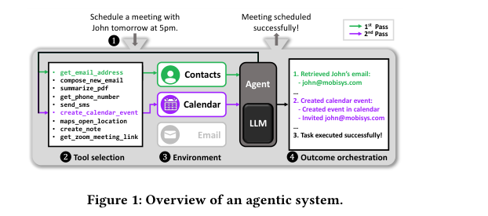
</p>

### 0.1. 문제 (Problem)

* LLM 기반 AI 에이전트(도구를 호출해 작업을 자동 수행하는 LLM)는 성능은 뛰어나지만, 엣지 디바이스(노트북·휴대폰 등 로컬 기기)에서 실행하면 단순한 작업조차 매우 느리다. "내일 5시에 John과 미팅 잡아줘" 같은 간단한 질의도 Mac mini(M4 Pro)에서 26.7초, 평균적으로는 한 작업에 35.4초가 걸린다.
* 클라우드 LLM은 지연(latency)의 95% 이상이 디코드(decode) 단계에 몰려 있어 디코드만 가속하면 됐다. 그러나 온디바이스 에이전트는 **프리필(prefill, 입력 처리)이 21.7%, 디코드가 68.7%** 로 두 단계 모두 큰 비중을 차지한다. 어느 한 단계만 고쳐서는 부족하다.
* 그 이유는 두 가지다. (1) 에이전트는 출력보다 입력 토큰이 훨씬 길어 프리필이 본질적으로 무겁고, (2) 온디바이스 가속기는 서버급 H200 대비 메모리 대역폭이 최대 11%, 연산 성능이 약 2%에 불과해 그 무거운 프리필이 더 비싸진다.
* 기존 가속 기법은 그대로 쓰기 어렵다. 프리필을 줄이는 prefix caching은 프롬프트 앞부분이 매 질의마다 바뀌어 캐시 재사용이 거의 막히고, 디코드를 줄이는 speculative decoding은 별도의 draft LLM이 필요해 엣지에 부담스러우며 온디바이스에서는 오히려 느려지기까지 한다.

### 0.2. 핵심 아이디어 (Core Idea)

* **전체 파이프라인을 모두 가속한다.** 프리필용 **PromptWeaver**, 디코드용 **ExSpec** 두 모듈을 결합해, 정확도 손실 없이(iso-accuracy) 순수 소프트웨어만으로 온디바이스 에이전트의 처음부터 끝까지를 빠르게 만든다.

* **PromptWeaver — "바뀌는 부분을 뒤로 몰아 캐시를 살린다."**
  * (a) 한 줄 정의: 매 질의마다 달라지던 프롬프트 앞부분을 항상 똑같은 정적(static) 형태로 다시 짜서 prefix caching이 먹히게 만드는 기법.
  * (b) 왜 필요한가: prefix caching은 "두 입력이 앞부분(prefix)을 공유하면 그 부분의 계산(KV cache)을 재사용"하는 기술인데, 첫 글자 하나만 달라도 그 뒤로는 재사용이 끊긴다. 에이전트 프롬프트는 전체의 단 1.6% 지점부터 동적 토큰이 나와 캐시가 거의 무용지물이었다.
  * (c) 비유: 매번 거의 똑같은 서론으로 시작하는 글에서, 한 단어만 앞에서 바뀌어도 서론 전체를 다시 써야 한다면 손해다. PromptWeaver는 바뀌는 단어를 글 맨 뒤로 옮겨, 저장해 둔 서론을 통째로 재사용한다. 구체적으로 (1) 선택된 도구만 넣던 설명을 **모든 도구 설명을 포함한 정적 블록**으로 바꾸고, (2) 함께 쓰이는 도구들끼리 묶은(클러스터링) 예시를 고정 순서로 배치해 그 KV cache를 미리 SSD에 저장해 둔다.

* **ExSpec — "프롬프트 안의 답을 베껴 쓰는 LLM 없는 speculative decoding."**
  * (a) 한 줄 정의: 작은 draft LLM 대신, 질의가 들어올 때마다 즉석에서 만드는 $n$-gram 룩업 테이블(lookup table, LUT)을 draft 모델로 쓰는 추측 디코딩.
  * (b) 왜 필요한가: 에이전트 출력의 96%(Planner)·87%(Arbiter)가 입력 프롬프트의 예시 토큰과 겹친다. 즉 "추론이 필요 없는 뻔한 토큰"을 생성하느라 시간을 쓴다. 이미 프롬프트에 있는 답을 베끼면 되는데, 굳이 무거운 draft LLM을 둘 이유가 없다.
  * (c) 비유: 옆에 펼쳐 둔 예시 문장(few-shot 예시 + 사용자 질의)으로 만든 자동완성 사전을 쓰는 것과 같다. 사전에 다음 단어가 있으면 즉시 제안하고, 없으면 그냥 LLM에게 맡긴다. 여기서 $n$-gram LUT는 직전 $n-1$개 토큰을 key로, 가장 자주 따라 나오는 다음 토큰을 value로 저장한 표이며, 크기는 수 KB에 불과하다($n=3$ trigram이 최적).
  * (d) multi-token tax 회피: 온디바이스에서는 토큰 2개를 한꺼번에 검증하는 게 1개씩 하는 것보다 오히려 느리다(131ms→244ms, 1.86배 느림). 이를 "multi-token tax"라 부르며, ExSpec은 LUT에 적중(hit)이 예상될 때만 추측을 켜고 아니면 일반 디코딩으로 즉시 되돌아가(selective decoding) 이 세금을 회피한다.

### 0.3. 효과 (Effects)

* 순수 소프트웨어 기법이라 기존 온디바이스 에이전트에 별도 하드웨어·재학습 없이 바로 통합 가능하다.
* 정확도 무손실. 오히려 PromptWeaver는 동적 예시 1개($K=1$)를 덧붙여 baseline(0.836)보다 약간 높은 0.841까지 정확도를 올린다.
* 추가 자원 부담이 작다. 전체 KV cache 저장은 15개 클러스터 기준 6.26GB SSD, ExSpec의 LUT는 질의당 83ms·수 KB 수준으로 무시할 만하다.

### 0.4. 결과 (Results)

* **프리필 단계 1.97배** 가속(PromptWeaver): 세부적으로 Planner 1.57배, Arbiter 4.35배.
* **디코드 단계 1.73배** 가속(ExSpec): 반면 일반 draft LLM(Llama-3.2-1B) 기반 speculative decoding은 오히려 baseline보다 느려졌다.
* **종단 간(end-to-end) 1.61배** 가속(PromptWeaver+ExSpec). PromptWeaver 단독 1.16배, ExSpec 단독 1.43배.
* 15개 클러스터(6.26GB)만으로 도구 사용 예시의 74.4%를 커버하며, 사용 불가(uncacheable) 토큰을 1,711 → 519개로 약 70% 감소시켰다.

### 0.5. 상세 동작 방식 (How It Works)

Agent-X는 **오프라인 준비**와 **온라인 실행** 두 단계로 나뉜다. 핵심은 "오프라인에 미리 계산해 둔 것을 온라인에서 베껴 쓰기"다.

<p align='center'>
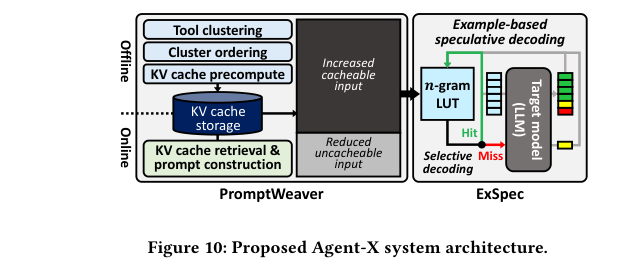
</p>

```
[오프라인 준비 — 1회]
도구 동시활성 행렬 → NMF 클러스터링(8개 클러스터)
       → 테마 기반 고정 순서 정렬 → 그리디 조합 선택(Algorithm 1)
       → 각 조합의 KV cache 사전계산 → SSD 저장(6.26GB / 커버리지 74.4%)

[온라인 실행 — 질의마다]
[사용자 질의]
   → [ToolRAG: 분류기로 도구 선택 + 임베딩 유사도로 예시 검색]
   → [PromptWeaver: 프롬프트 재구성]
        (전체 정적 도구설명) + (클러스터 예시, SSD에서 KV cache 로드) + (동적 예시 K=1)
   → [Planner LLM]
        프리필(캐시 적중분 건너뜀) → 디코드(ExSpec: trigram LUT로 추측, 미스 시 일반 디코딩)
   → [실행 유닛: 도구 호출 → 관찰(observation) 수집]
   → [Arbiter LLM] 성공/재시도 판정 (역시 PromptWeaver+ExSpec 적용)
   → [최종 출력]
```

Step 1. **(오프라인) 도구 클러스터링** — Planner 학습 데이터의 정답 라벨을 훑어 "어떤 도구들이 함께 호출되는가"를 센다. 입력: 학습 데이터 / 처리: 동시활성 행렬에 비음수 행렬 분해(NMF) 적용 / 출력: 2~6개 도구로 이뤄진 8개 클러스터.

Step 2. **(오프라인) 고정 순서 정렬 + 조합 선택** — 클러스터 순서가 바뀌면 KV cache 값도 달라지므로, 테마(이메일·노트 등)가 같은 클러스터끼리 묶어 항상 같은 순서로 고정한다. 그런 다음 Algorithm 1(그리디)로 "가장 많은 질의를 커버하는 클러스터 조합"만 골라 KV cache를 미리 계산해 SSD에 저장한다.

Step 3. **(온라인) 프롬프트 재구성** — 질의가 들어오면 ToolRAG가 도구와 예시를 검색한다. PromptWeaver는 (1) 모든 도구 설명을 담은 정적 블록(항상 동일 → 캐시 재사용), (2) 활성화된 클러스터 예시(SSD에서 KV cache 로드), (3) 정확도 보정용 동적 예시 1개 순으로 프롬프트를 다시 짠다. 바뀌는 부분이 맨 뒤로 가므로 앞부분 prefix가 매번 동일해진다.

Step 4. **(온라인) Planner 프리필** — 재구성된 프롬프트 중 캐시 적중 부분은 계산을 건너뛰고, 사용 불가 토큰(평균 519개)만 새로 계산한다. → 프리필 가속.

Step 5. **(온라인) Planner 디코드 (ExSpec)** — few-shot 예시 + 질의로 trigram LUT를 즉석 생성(질의당 83ms)한다. 직전 2개 토큰으로 LUT를 조회해 draft 토큰을 만들고 target LLM이 한 번에 검증한다. LUT에 없으면 즉시 일반 자기회귀 디코딩으로 fallback해 multi-token tax를 피한다. → 디코드 가속.

Step 6. **(온라인) 실행 → Arbiter** — 생성된 계획을 실행 유닛이 수행해 관찰 결과를 모으고, Arbiter LLM이 성공 여부를 판정한다. Arbiter 입력은 88~90%가 정적이라 PromptWeaver의 prefix caching 효과가 특히 크다(프리필 4.35배).

전체 데이터 흐름 요약: **[질의] → [ToolRAG 검색] → [PromptWeaver 재구성 + SSD KV 로드] → [Planner 프리필→ExSpec 디코드] → [도구 실행] → [Arbiter] → [출력]**.

---

<p align='center'>
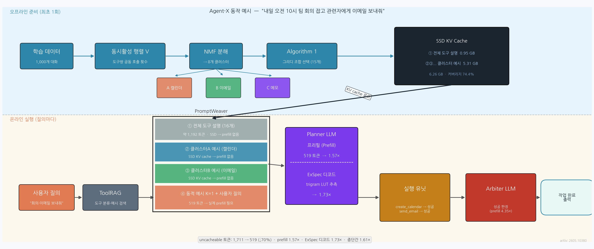
</p>

#### 완전 동작 예시 — "내일 오전 10시 팀 회의 잡고 관련자에게 이메일 보내줘"

##### 오프라인 준비 (최초 1회)

```
[Step 1] 도구 동시활성 행렬 계산 (학습 데이터 1,000개 대화 기준)

  도구 목록 (16개):
  0:create_calendar_event  1:query_calendar  2:set_alarm
  3:send_email             4:search_email    5:add_attachment
  6:create_note            7:search_note     8:open_app
  ...

  동시활성 행렬 V (16×16, 일부):
  V[0][1] = 287  (캘린더 생성 + 조회 자주 함께 쓰임)
  V[3][5] = 241  (이메일 전송 + 파일 첨부 자주 함께 쓰임)
  V[0][3] =  18  (캘린더와 이메일은 가끔만 함께)

[Step 2] NMF 적용 → V ≈ W(16×8) × H(8×16)

  발견된 클러스터:
  클러스터 A: create_calendar_event, query_calendar, set_alarm   → "캘린더"
  클러스터 B: send_email, search_email, add_attachment           → "이메일"
  클러스터 C: create_note, search_note                           → "메모"
  클러스터 D: open_app, get_phone_number, ...                    → "앱/연락처"
  ... (총 8개)

[Step 3] 테마 기반 고정 순서: A → B → C → D → ... (항상 동일)

[Step 4] Algorithm 1 (그리디 조합 선택, 예산 15개 prefix):
  커버리지 기준 상위 15개 조합 선택 (예: [A], [B], [A,B], [C], [A,C], ...)
  → 각 조합의 KV cache 사전계산

[Step 5] SSD 저장:
  - 전체 도구 설명(정적 prefix) KV: 0.95 GB
  - 15개 클러스터 조합 KV: 5.31 GB
  합계: 6.26 GB / 질의의 74.4% 커버
```

##### 온라인 실행 (질의마다)

```
입력 질의: "내일 오전 10시 팀 회의 잡고 관련자에게 이메일 보내줘"

──────────────────────────────────────────────────────────────
[ToolRAG]
  분류기 → 활성 도구: create_calendar_event, send_email (+ 관련 도구)
  임베딩 유사도 검색 → 동적 예시 1개 선택
──────────────────────────────────────────────────────────────

[PromptWeaver — 프롬프트 재구성]

  ┌────────────────────────────────────────────────────────┐
  │ ① 전체 도구 설명 (16개, 항상 동일)                      │ ← SSD KV cache 로드
  │    create_calendar_event(title, date, time, attendees)  │   prefill 없음
  │    send_email(to, subject, body, attachment)            │
  │    ...                                                  │
  ├────────────────────────────────────────────────────────┤
  │ ② 클러스터 A 예시 (캘린더 패턴)                         │ ← SSD KV cache 로드
  │    Q: "3시에 스탠드업 미팅 잡아줘"                       │   prefill 없음
  │    A: create_calendar_event(title="스탠드업", ...)       │
  ├────────────────────────────────────────────────────────┤
  │ ③ 클러스터 B 예시 (이메일 패턴)                         │ ← SSD KV cache 로드
  │    Q: "김팀장에게 보고서 보내줘"                          │   prefill 없음
  │    A: send_email(to="manager@...", subject="보고서", ...) │
  ├────────────────────────────────────────────────────────┤
  │ ④ 동적 예시 K=1 (유사도 top-1)          약 200 토큰     │ ← 실제 prefill
  │ ⑤ 사용자 질의                           약 30 토큰      │ ← 실제 prefill
  └────────────────────────────────────────────────────────┘

  실제 prefill 토큰: 519개 (①②③ 약 1,192토큰은 캐시로 처리)
  → prefill 1.57배 가속

──────────────────────────────────────────────────────────────

[ExSpec — Planner 디코드]

  trigram LUT 구축 (위 ②③④ 예시에서 즉석 생성, 83ms):
  "create_calendar_event(", "title" → "="
  "title", "="                      → " \""
  "send_email(", "to"               → "="
  "time", "="                       → " \""

  디코드 진행:
  LLM이 "create_calendar_event(" 까지 생성
    토큰 t1: LUT["create_calendar_event(", "title"] = "=" → draft
             target LLM 검증 ✓ → 확정
    토큰 t2: LUT["title", "="] = " \"" → draft
             검증 ✓ → 확정
    토큰 t3: LUT["=", "\""] = "팀" → draft
             검증 ✗ (실제: "오") → 폐기, 일반 디코딩으로 1토큰 생성

  결과: 전체 출력 토큰 중 ~25%를 LUT draft로 건너뜀
  → 디코드 1.73배 가속

──────────────────────────────────────────────────────────────

[실행 유닛]
  create_calendar_event(title="팀 회의", date="2026-06-21", time="10:00",
                        attendees=["alice@...", "bob@..."])
  → 성공, attendees 목록 반환

  send_email(to=["alice@...", "bob@..."],
             subject="내일 오전 10시 팀 회의 안내",
             body="안녕하세요, 내일 오전 10시에 팀 회의가 있습니다...")
  → 성공

──────────────────────────────────────────────────────────────

[Arbiter LLM]
  입력: [시스템 지시(정적)] + [관찰 결과(동적)]
  → 88~90%가 정적 → PromptWeaver prefix cache 재사용 → prefill 4.35배 가속
  판정: "두 도구 모두 성공 → 작업 완료"

──────────────────────────────────────────────────────────────
[최종 출력] "내일 오전 10시 팀 회의를 등록하고 관련자에게 안내 이메일을 보냈습니다."
```

---

## 1. Introduction

"ChatGPT 효과"로 LLM은 일상 곳곳에 스며들었고, 그 활용도를 한 단계 끌어올린 것이 **도구 호출(tool calling)** 을 갖춘 AI 에이전트다. 에이전트는 사용자 질의를 받아 적절한 도구를 고르고(예: Contacts, Calendar, Email), 그 도구를 호출해 환경과 상호작용한 뒤, 이전 출력을 보고 다음 행동을 정하는 방식으로 사람 개입 없이 작업을 끝까지 수행한다.

<p align='center'>
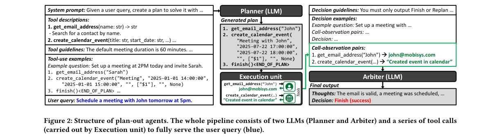
</p>

특히 사용자 기기에서 전부 실행되는 **온디바이스 에이전트**는 두 가지 고유한 장점이 있다. (1) 가용성 — 인터넷이 없거나 클라우드 서버가 다운돼도 항상 즉시 쓸 수 있고, (2) 프라이버시 — 데이터가 기기를 벗어나지 않는다. 그러나 엣지의 자원 제약 때문에 간단한 작업도 매우 느리다. 저자들은 TinyAgent + TinyAgent-7B를 Mac mini(M4 Pro)에서 측정해, 평균 작업 한 건에 35.4초가 걸림을 확인했다.

이 논문의 핵심 관찰은 다음과 같다. 클라우드 LLM은 지연이 디코드 단계에 압도적으로 몰리지만(95% 이상), **온디바이스 에이전트는 프리필과 디코드가 모두 큰 비중을 차지한다.** 따라서 어느 한 단계만이 아니라 전체 시스템 파이프라인을 가속해야 한다.

저자들은 이를 위해 정확도를 떨어뜨리지 않는 순수 소프트웨어 가속 기법 **Agent-X** 를 제안한다. 기여는 세 가지다.

* **온디바이스 에이전트 분석.** Planner와 Arbiter 두 LLM 인스턴스가 주요 병목임을 밝히고, 토큰 수준 분석으로 (1) 프롬프트 구조 때문에 prefix caching 적용이 막혀 있고, (2) 디코드 출력이 few-shot 예시에 강하게 종속돼 LLM의 추론 능력을 거의 쓰지 않는다는 두 성질을 발견한다.
* **정확도 보존 가속 알고리즘.** 프리필을 가속하는 PromptWeaver와 디코드를 가속하는 ExSpec을 제안한다. PromptWeaver는 프롬프트를 동적으로 재구성해 prefix caching을 살리고, ExSpec은 LLM 없는 경량 draft 모델로 speculative decoding을 가능하게 한다.
* **실제 시스템 통합.** Apple의 MLX-LM, MLX-engine 위에 구현하고 TinyAgent에 통합해, 프리필 1.97배·디코드 1.73배, 종단 간 평균 1.61배 가속을 달성한다.

본 논문은 온디바이스 에이전트의 지연 병목을 체계적으로 특성화하고 제거한 최초의 연구라고 주장한다.

## 2. Method

### 2.1. 배경: plan-out 에이전트와 ToolRAG

이 논문이 대상으로 삼는 것은 도구 호출 전에 전체 실행 경로를 미리 계획하는 **plan-out 에이전트**(대표: LLMCompiler)다. ReAct는 $N$단계 계획에 $2N$번의 LLM 호출이 필요하지만, plan-out 에이전트는 (1) **Planner** 가 한 번에 전체 계획을 생성하고 (2) **Arbiter** 가 한 번에 모든 관찰 결과를 검증하므로 총 2번의 LLM 호출로 끝난다.

Planner 입력은 시스템 프롬프트, 선택된 도구의 설명·가이드라인, 그리고 검색된 도구 사용 예시(few-shot)로 구성된다. 어떤 도구와 예시를 넣을지는 **ToolRAG** 가 결정한다. ToolRAG는 (i) 오프라인 예시 DB 구축, (ii) 분류기(classification model)로 임계값 $\tau$ 이상의 도구만 선택, (iii) 사용자 질의 임베딩과의 코사인 유사도로 top-$K$ 예시 검색의 세 단계로 동작한다.

### 2.2. 특성화: 왜 두 단계 모두 병목인가

전체 지연의 90.4%가 Planner(43.5%)와 Arbiter(46.9%)에 있다. 그중 디코드가 68.7%로 가장 크지만 프리필도 21.7%로 무시할 수 없다(클라우드는 디코드가 95% 이상). 토큰 수준 분석은 다음을 보인다.

<p align='center'>
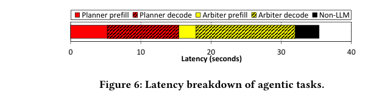
</p>

* **Planner 프리필.** 전체 1,739토큰 중 정적 시스템 프롬프트가 32.7%이지만, 동적으로 검색된 도구 설명·가이드라인이 프롬프트의 단 1.6% 지점부터 끼어들어 그 이후 KV cache 재사용을 막는다. 그런데 이 동적 부분은 사실 **정적 조각들의 다른 조합**일 뿐이어서, 이를 정적화하면 사용 불가 토큰이 32% 줄어든다(1,711→1,171).
* **도구 동시활성 지역성(co-activation locality).** 같은 테마의 도구(이메일·연락처·지도·노트)는 함께 호출되는 경향이 크다. 예: `get_zoom_meeting_link`는 `get_email_address`와 91% 함께 활성화된다.
* **디코드 예측 가능성.** Planner 출력의 96%, Arbiter 출력의 87%가 입력 프롬프트 토큰과 겹친다. 즉 출력은 few-shot 예시의 템플릿을 거의 그대로 베껴 쓴다.

<p align='center'>
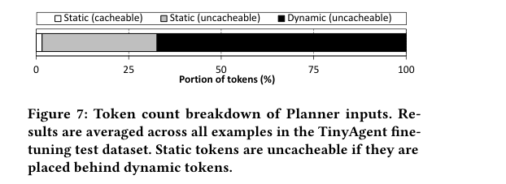
</p>

또한 naive speculative decoding이 온디바이스에서 실패하는 이유로 **multi-token tax** 를 든다. MLX-LM에서 토큰 1개 자기회귀 추론은 131ms이지만 2개 검증은 244ms로 오히려 1.86배 느리다. 단일 배치에 최적화된 온디바이스 환경에서는 여러 토큰을 한 번에 검증하는 것이 손해다.

### 2.3. PromptWeaver: 정확도 보존 프롬프트 재구성

PromptWeaver는 위 세 성질을 이용해 프롬프트를 (1) 전체 도구 설명·가이드라인(정적 prefix), (2) 클러스터링된 준-캐시 가능 예시, (3) 사용 불가 동적 예시 순으로 재구성한다.

<p align='center'>
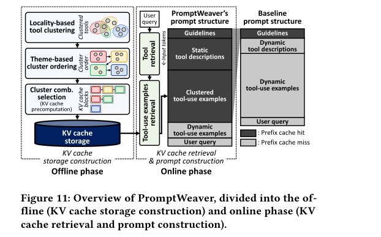
</p>

* **초기 동적 토큰 제거.** 선택된 도구만 넣던 설명을 **시스템의 모든 도구 설명**으로 대체한다. KV cache는 커지지만 한 번 계산해 SSD에 저장하면 모든 질의에서 재사용된다. 도구 1개 설명은 평균 120토큰이고, 100개 도구를 다 넣어도 추가 KV cache는 1.4GB에 불과하다.
* **도구 사용 예시 선택.** 예시까지 모든 조합을 정적화하려면 도구 $t$개에 대해 $2^t-1$개 조합($16$개 도구면 800GB)이 필요해 불가능하다. 대신 오프라인에서 (1) 동시활성 기반 클러스터링, (2) 테마 기반 정렬, (3) 조합 선택으로 재사용 가능한 고정 예시 집합을 고른다.

<p align='center'>
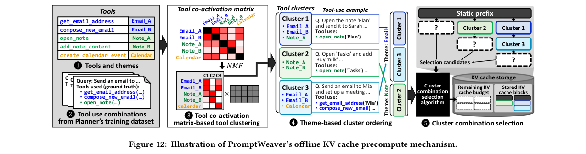
</p>

클러스터링은 도구 쌍이 함께 호출된 횟수를 담은 동시활성 행렬에 **비음수 행렬 분해(NMF, Non-negative Matrix Factorization)** 를 적용해 8개 클러스터(각 2~6개 도구)를 만든다. 클러스터 순서가 다르면 KV cache 값도 달라지므로, 같은 테마끼리 묶어 순서를 고정한다("A-B" 또는 "B-A" 중 하나로). 예를 들어 클러스터를 "1-3-2" 순으로 저장해 두면, 클러스터 2가 미활성일 때 꼬리(2)만 잘라내고 "1-3"의 캐시를 재사용할 수 있다.

> **[NMF란?]** 행렬 V를 두 비음수 행렬 W × H로 근사 분해하는 기법이다.
> ```
> V (도구 16개 × 도구 16개)  ≈  W (16 × 8클러스터)  ×  H (8클러스터 × 16)
> V[i][j] = 도구 i와 도구 j가 같은 대화에서 함께 호출된 횟수
> ```
> 모든 값이 0 이상(비음수)이므로 각 클러스터는 "부분들의 합" 형태로 해석된다.
> W의 열(column) 하나가 곧 클러스터 하나 — 해당 열에서 큰 값을 가진 도구들이 묶인다.
> ```
> 예: 학습 대화 1,000개에서 동시활성 행렬 계산 결과
>   V["캘린더 추가"]["캘린더 조회"] = 312   ← 자주 함께 호출
>   V["이메일 전송"]["파일 첨부"]   = 287
>   V["캘린더 추가"]["이메일 전송"] =  14   ← 거의 같이 안 씀
>
> NMF 적용 후 발견된 클러스터:
>   클러스터 1 (W 1열): 캘린더 추가 0.91, 캘린더 조회 0.87, 알람 설정 0.74  → "캘린더 클러스터"
>   클러스터 2 (W 2열): 이메일 전송 0.89, 이메일 검색 0.82, 파일 첨부 0.71  → "이메일 클러스터"
>   ...
> ```
> k-means와 달리 NMF는 한 도구가 여러 클러스터에 부분적으로 속할 수 있다("파일 첨부"는 이메일 클러스터에도, 메모 클러스터에도 0이 아닌 가중치를 가질 수 있다).

> **[PromptWeaver 동작 예시]** 질의: *"내일 오전 10시 팀 회의 잡고 관련자에게 이메일 보내줘"*
>
> **기존 방식 (ToolRAG):** 캘린더·이메일 도구 2개 설명 + 동적 few-shot 예시 + 질의
> → 매 질의마다 전부 prefill (uncacheable 토큰 ≈ 1,711개)
>
> **PromptWeaver 적용 후:**
> ```
> ┌─────────────────────────────────────────────────────────────────┐
> │ [전체 도구 설명 16개]              ← SSD KV cache 로드, prefill 생략│
> │ [클러스터 1 예시: 캘린더 패턴]     ← SSD KV cache 로드, prefill 생략│
> │ [클러스터 2 예시: 이메일 패턴]     ← SSD KV cache 로드, prefill 생략│
> ├─────────────────────────────────────────────────────────────────┤
> │ [동적 top-1 예시] + [사용자 질의]  ← 519토큰만 실제 prefill        │
> └─────────────────────────────────────────────────────────────────┘
> ```
> "바뀌는 부분(질의·동적 예시)"을 맨 뒤로 밀었기 때문에
> 앞부분 prefix가 항상 동일 → KV cache 재사용 가능.
> 실측: uncacheable 토큰 1,711 → 519 (↓70%), prefill **1.57배** 가속.

조합 선택은 Algorithm 1의 그리디 방식이다. 캐시 예산 $N$개 클러스터가 주어지면, 학습 데이터의 모든 클러스터 prefix를 모은 뒤 매 단계 **커버리지(coverage)** 증가량이 가장 큰 prefix를 추가한다.

$$\hat p = \arg\max_{p \in \text{options}} \big[\text{coverage}(\mathcal D, \mathcal C \cup \{p\}) - \text{coverage}(\mathcal D, \mathcal C)\big]$$

여기서 $\mathcal D$는 Planner 학습 데이터, $\mathcal C$는 현재까지 캐싱한 클러스터 조합 집합, coverage는 각 질의의 활성 클러스터 시퀀스가 $\mathcal C$로 재사용할 수 있는 선두 클러스터 개수의 총합이다. 후보 $p$는 단일 클러스터이거나, 이미 가진 prefix를 한 클러스터 확장한 것이어야 한다. 이렇게 단 15개 클러스터(예시 클러스터 오버헤드 5.87GB, Arbiter 정적 캐시 포함 총 저장 6.26GB)만으로 예시의 74.4%를 커버한다.

마지막으로 정확도 보존을 위해, 활성 도구의 단일 도구 예시와 ToolRAG의 top-$K$($K=1$이 최적) 예시를 클러스터 예시 뒤에 덧붙인다.

### 2.4. ExSpec: 예시 기반 선택적 speculative decoding

<p align='center'>
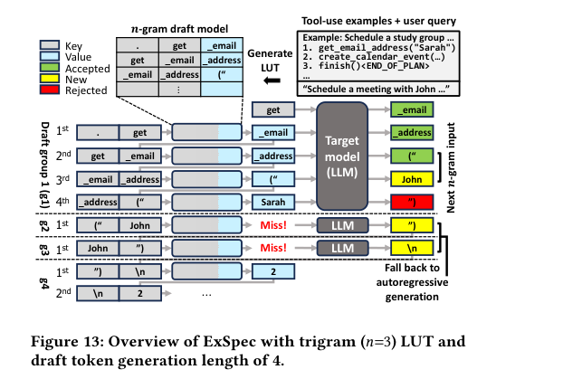
</p>

ExSpec의 두 메커니즘은 (1) $n$-gram 모델을 이용한 경량 draft 토큰 생성과 (2) 비효율이 예상될 때 일반 디코딩으로 빠지는 선택적 fallback이다.

* **LUT 구축.** 질의가 들어올 때마다 few-shot 예시(Planner는 도구 사용 예시, Arbiter는 결정 예시)와 사용자 질의를 한 줄 토큰 스트림으로 보고, $n$개 토큰 창을 한 칸씩 밀며 쌍 $\langle t_{1:n-1}, t_n \rangle$을 기록한다. prefix $t_{1:n-1}$를 key로, 그 key와 가장 자주 함께 나온 토큰 $t_n$을 value로 저장한다. LUT 크기는 수 KB에 불과하다.
* **$n$ 선택.** $n=1$(unigram)은 항상 최빈 토큰만 제안해 품질이 낮고, $n$이 너무 크면 본 적 없는 시퀀스에서 자주 실패한다. **trigram($n=3$)** 이 draft 품질과 적중률의 최적 균형을 준다.
* **선택적 디코딩으로 multi-token tax 회피.** 첫 draft 토큰을 만들기 전 LUT를 조회해, 유효 항목이 없으면 즉시 일반 자기회귀 디코딩으로 fallback한다. $n$-gram LUT는 어떤 문맥을 커버하는지 결정론적으로 알기 때문에 이 판단에 오버헤드가 0이다(LLM draft로는 불가능).

> **[ExSpec 동작 예시]** Planner가 도구 호출 JSON을 디코드하는 상황
>
> **오프라인 LUT 구축** (few-shot 예시 토큰 스트림에서 trigram 집계):
> ```
> key (앞 2토큰)           → value (다음 토큰 최빈값)
> "send_email(", "to"      → "="
> "to", "="                → " \""
> "=", " \""               → "y"               ← 이메일 주소 첫 글자
> "subject", "="           → " \""
> "search_calendar(", "q"  → "="
> ```
>
> **런타임 디코드** — Planner가 `send_email(` 까지 생성한 상황:
> ```
> 현재 문맥: "send_email(", "to"
>   ① LUT 조회 → hit: "="   ← draft 토큰
>   ② LLM에 "=" 병렬 검증 → 일치 ✓ → 확정, 다음 문맥 전진
>
> 현재 문맥: "to", "="
>   ① LUT 조회 → hit: " \""  ← draft
>   ② 검증 ✓ → 확정
>
> 현재 문맥: "=", "\""
>   ① LUT 조회 → hit: "y"   (이메일 첫 글자)
>   ② LLM 검증 → 일치 ✓ → 확정
>
> 현재 문맥: "\"", "y"
>   ① LUT 조회 → miss       ← 해당 trigram 없음
>   ② 즉시 일반 자기회귀 fallback (multi-token tax 없이)
>   → LLM이 직접 "o", "u", "n"... 순차 생성
> ```
>
> LUT miss는 "draft 토큰 생성 → 검증 실패 → 폐기"의 3-step 낭비 없이 즉시 fallback하므로 overhead = 0.
> 실측: 비선택적 ExSpec 1.38× → **선택적 ExSpec 1.73×** (Planner 17회·Arbiter 37회/질의 fallback).

## 3. Experiments

### 3.1. 실험 설정

* **모델/데이터:** TinyAgent(macOS용 오픈소스 에이전트, LLMCompiler 기반) + TinyAgent-7B(WizardLM-2-7B 파인튜닝). TinyAgent 파인튜닝 데이터셋의 train split은 클러스터링·조합 선택에, test split(1,022개 예시)은 평가에 사용.
* **하드웨어/소프트웨어:** Apple Mac mini M4 Pro(64GB 메모리, 512GB SSD, 12 CPU·16 GPU 코어). MLX-LM, MLX-engine 위에 구현. 각 작업 전 page cache를 flush해 SSD 로드 비용을 격리.
* **정확도 지표:** 출력 계획을 DAG로 변환해 정답 DAG와 비교(Planner accuracy). 도구 호출이 결정론적이라 Planner 정확도가 곧 종단 간 작업 정확도가 된다.

### 3.2. PromptWeaver 결과

* **정확도:** $K=0$은 0.832(baseline 0.836보다 낮음), $K=1$에서 0.841로 최고, 이후 감소. 따라서 $K=1$ 채택. $K=1$ 기준 사용 불가 토큰은 평균 519개로 baseline 1,711 대비 70% 감소.
* **저장 오버헤드:** 예산 0(정적만)은 0.95GB, 15개 클러스터에서 6.26GB로 커버리지 74.4%에 도달하고 이후 평탄해져 15개로 고정.
* **프리필 가속:** 정적 토큰만 캐싱하는 Static 설계는 Planner에서 1.01배에 그치지만(동적 토큰이 거의 안 줄어듦), 클러스터 동적 캐싱을 더한 PromptWeaver는 사용 불가 토큰을 49.6% 줄여 **1.57배(Planner)**, 입력이 대부분 정적인 Arbiter는 88.9% 줄여 **4.35배** 가속. SSD 로드 오버헤드는 프리필 지연의 5.8%(Planner)·11.7%(Arbiter)에 불과.

<p align='center'>
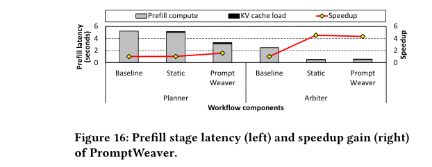
</p>

### 3.3. ExSpec 결과

* **디코드 가속:** Llama-3.2-1B draft 기반 speculative decoding(SpecDec)은 multi-token tax와 토크나이저 불일치 오버헤드로 오히려 baseline보다 느려진다. 반면 비선택적 ExSpec은 1.38배, 선택적 디코딩까지 적용하면 **1.73배** 가속(Planner 17회·Arbiter 37회/질의 fallback).
* **draft 정확도:** 선택적 디코딩은 비선택적과 동일한 수의 draft 토큰을 수용하면서도 생성량을 크게 줄여, draft 정확도를 Planner 0.13→0.25, Arbiter 0.09→0.26으로 높인다.
* **오버헤드:** LUT 생성은 질의당 83ms로 무시할 만하다.

<p align='center'>
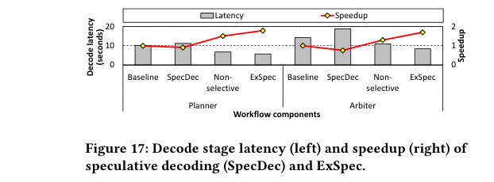
</p>

### 3.4. 종단 간 통합 및 추가 분석

* **종단 간 가속:** PromptWeaver 단독 1.16배, ExSpec 단독 1.43배, 둘을 합친 Agent-X는 **1.61배**. 정확도 저하 없이 기존 시스템에 바로 적용 가능.
* **작은 모델 일반화:** TinyAgent-1.1B에서도 프리필 1.62배·디코드 1.42배로 효과 확인.
* **파인튜닝 draft 무용성:** TinyAgent-1.1B를 draft LLM으로 쓰면 baseline보다 1.81배 느리고, 파인튜닝에만 약 75시간이 필요해 비효율적.
* **분포 변화 강건성:** 노트 관련 도구를 비활성화해도 정확도 0.8%p 하락에 그치고 커버리지 75.7% 유지.
* **추출 영역/$n$ 민감도:** LUT를 few-shot 예시+질의에서만 추출하는 것이 전체 입력 사용보다 Planner 3%·Arbiter 1% 더 빠름. bigram은 정확도 0.10으로 급락, quadgram은 정확도 0.31로 올라가나 draft 토큰이 trigram의 72%로 줄어 결국 5.1% 느림 → trigram이 최적.

<p align='center'>
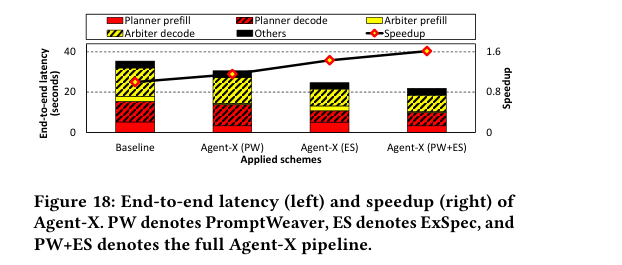
</p>

## 4. Conclusion

Agent-X는 온디바이스 에이전트의 지연 병목이 클라우드와 달리 프리필·디코드 양쪽에 있음을 처음으로 체계적으로 규명하고, 프롬프트를 재구성해 prefix caching을 살리는 **PromptWeaver**(프리필 1.97배)와 LLM 없는 $n$-gram 기반 선택적 추측 디코딩 **ExSpec**(디코드 1.73배)으로 이를 해결한다. 두 기법을 합쳐 정확도 손실 없이 종단 간 1.61배 가속을 달성하며, 순수 소프트웨어이므로 기존 온디바이스 에이전트에 곧바로 통합할 수 있다.

(작성자 commentary) 이 논문의 강점은 "에이전트 출력은 사실상 프롬프트의 예시를 베껴 쓴다"는 단순하지만 강력한 관찰을, 비싼 draft LLM 대신 수 KB짜리 trigram LUT라는 가벼운 해법으로 곧장 연결한 점이다. 특히 온디바이스 특유의 multi-token tax를 정량화하고, 추측 디코딩을 무조건 켜는 대신 "이득이 예상될 때만 켜는" 선택적 fallback으로 대응한 설계가 실용적이다. 다만 TinyAgent/macOS에 한정된 평가, 도구 수가 수백 개로 늘 때의 KV cache 저장 증가, 사용자별 도구 분포가 크게 바뀔 때의 클러스터 재구축 비용, 그리고 PromptWeaver의 정적 블록 확장으로 프롬프트가 길어져 decode 단계 TPOT가 122ms→125ms(+2.2%) 소폭 증가하는 trade-off는 향후 검증이 필요한 지점이다.

---

## 부록: 사전 지식 (Prerequisites)

### A.1. 알아야 할 핵심 개념

- **Prefill / Decode 단계 (LLM 추론 2단계)** — LLM 추론은 입력 토큰을 병렬 처리하는 prefill과 출력 토큰을 한 개씩 순차 생성하는 autoregressive decode로 나뉜다.
  - 본문 위치: §1, §2.2 — 온디바이스에서 prefill이 21.7%, decode가 68.7%를 차지함을 실측하고, 클라우드(decode 95%+)와 달리 두 단계 모두 가속이 필요함을 논증.

- **KV Cache (Key-Value Cache)** — Transformer attention의 Key·Value 행렬을 메모리에 저장해 재계산을 피하는 기법. Prefill 단계에서 생성되고 decode 단계에서 재사용된다.
  - 본문 위치: §2.3 PromptWeaver — 클러스터별 KV cache를 사전 계산해 SSD에 저장해 두고, 온라인 질의 때 로드·재사용함.

- **Prefix Caching (접두사 캐싱)** — 두 입력의 앞부분(prefix)이 동일하면 그 구간의 KV cache를 공유·재사용하는 기법. 첫 번째로 다른 토큰이 나타나는 순간 그 이후 캐시는 전부 무효화된다.
  - 본문 위치: §2.2~2.3 — 에이전트 프롬프트는 1.6% 지점부터 동적 토큰이 끼어들어 캐시가 거의 작동하지 않음을 분석; PromptWeaver가 이 "early dynamicity"를 제거해 캐시를 살림.

- **Speculative Decoding (추측 디코딩)** — 작은 draft 모델이 여러 토큰을 미리 제안하면 target 모델이 한 번의 forward pass로 일괄 검증·수용하는 기법. 수용된 만큼 생성 속도가 빨라진다.
  - 본문 위치: §2.4 ExSpec — 기존 draft LLM 방식이 온디바이스에서 오히려 느려짐을 실측하고, ExSpec이 이를 대체하는 동기로 사용됨.

- **n-gram LUT (n-gram 룩업 테이블 / Prompt Lookup Decoding)** — 입력 컨텍스트 내에서 직전 n-1개 토큰을 key로, 가장 자주 뒤따르는 토큰을 value로 저장한 조회 테이블. 별도 모델 없이 프롬프트 자체에서 draft 토큰을 생성하며 크기가 수 KB에 불과하다.
  - 본문 위치: §2.4 — ExSpec의 draft 메커니즘 핵심. trigram(n=3)이 draft 품질·적중률의 최적 균형임을 ablation으로 확인.

- **Multi-Token Tax** — 온디바이스 단일 배치 환경에서 여러 토큰을 한 번에 검증하는 연산이 1개씩 처리하는 것보다 오히려 느려지는 현상. MLX-LM 기준 토큰 1개→131ms, 2개→244ms(1.86배 증가).
  - 본문 위치: §2.2 — 이 현상을 정량화하고, ExSpec의 "LUT 미적중 시 즉시 일반 디코딩으로 fallback"하는 선택적 설계의 핵심 근거.

- **Plan-out 에이전트 (Planner-Arbiter 구조)** — 도구 호출 전에 전체 실행 계획을 한 번에 생성(Planner)하고, 실행 결과를 한 번에 검증(Arbiter)하는 에이전트 패턴. ReAct의 2N번 LLM 호출을 2회로 줄인다.
  - 본문 위치: §2.1 — Agent-X가 가속하는 대상 시스템 구조. LLMCompiler 기반 TinyAgent가 구현체이며, Planner/Arbiter 각각에 PromptWeaver·ExSpec이 적용됨.

- **ToolRAG (도구 검색 증강)** — 분류기로 후보 도구를 필터링하고, 사용자 질의 임베딩과의 코사인 유사도로 관련 few-shot 예시를 검색해 프롬프트에 삽입하는 retrieval 파이프라인.
  - 본문 위치: §2.1~2.3 — PromptWeaver가 ToolRAG 위에서 동작하며, ToolRAG가 삽입하는 동적 도구 설명이 prefix caching을 방해하는 원인.

- **NMF (비음수 행렬 분해 / Non-negative Matrix Factorization)** — 행렬을 두 개의 비음수 행렬의 곱으로 근사하는 기법. 잠재 구조(클러스터)를 해석 가능한 형태로 발굴하는 데 쓰인다.
  - 본문 위치: §2.3 PromptWeaver — 도구 동시활성 행렬에 NMF를 적용해 함께 호출되는 도구들의 8개 클러스터를 추출.

- **그리디 커버리지 최적화 (Greedy Coverage Optimization)** — 매 단계 학습 데이터 커버리지 증가량이 가장 큰 후보를 선택하는 집합 커버(set cover)의 근사 알고리즘.
  - 본문 위치: §2.3 Algorithm 1 — KV cache로 저장할 클러스터 조합을 선택하는 핵심 알고리즘. 15개 조합으로 74.4% 커버리지를 달성.


### A.2. 먼저 읽으면 좋은 논문

1. **[2024][TinyAgent]** ([arxiv:2409.00608](https://arxiv.org/abs/2409.00608)) — "TinyAgent: Function Calling at the Edge", Erdogan et al., EMNLP 2024 Demo.
   - 한 줄 설명: macOS에서 소형 LLM(TinyAgent-7B)을 에이전트로 파인튜닝하고 ToolRAG를 도입한 온디바이스 에이전트 시스템.
   - **왜?** Agent-X의 실험 전체가 TinyAgent 데이터셋·모델·ToolRAG 구조를 그대로 사용한다. ToolRAG 동작 방식과 파인튜닝 데이터 형식을 이해해야 §3 실험 수치를 해석할 수 있다.
   - **Repo 내 정리**: 없음.

2. **[2024][LLMCompiler]** ([arxiv:2312.04511](https://arxiv.org/abs/2312.04511)) — "An LLM Compiler for Parallel Function Calling", Kim et al., ICML 2024.
   - 한 줄 설명: Planner가 전체 DAG 실행 계획을 한 번에 생성하고 Executor가 병렬 실행하는 plan-out 에이전트 아키텍처.
   - **왜?** TinyAgent의 기반 프레임워크로, Agent-X가 분석하는 Planner/Arbiter 분리 구조와 2회 LLM 호출 패턴이 여기서 비롯된다. "Arbiter prefill의 88~90%가 정적"이라는 핵심 관찰을 이해하는 전제.
   - **Repo 내 정리**: 없음.

3. **[2023][Speculative Decoding]** ([arxiv:2211.17192](https://arxiv.org/abs/2211.17192)) — "Fast Inference from Transformers via Speculative Decoding", Leviathan et al., ICML 2023.
   - 한 줄 설명: draft 모델 + target 모델의 2단계 구조로 자기회귀 디코딩을 가속하는 원형 기법.
   - **왜?** ExSpec이 이 기법의 직접적 확장이며, §2.4에서 "왜 기존 speculative decoding이 온디바이스에서 실패하는가"를 설명하는 기준점. Draft-verify 수용 조건을 알아야 ExSpec의 selective fallback 설계를 이해할 수 있다.
   - **Repo 내 정리**: [General_AI/[논문][2023][ICML][Speculative Decoding] Fast Inference from Transformers via Speculative Decoding.md](../General_AI/[논문][2023][ICML][Speculative Decoding]%20Fast%20Inference%20from%20Transformers%20via%20Speculative%20Decoding.md)

4. **[2023][Prompt Lookup Decoding]** ([GitHub](https://github.com/apoorvumang/prompt-lookup-decoding)) — Saxena, 2023.
   - 한 줄 설명: 입력 프롬프트 내 n-gram을 draft 토큰 소스로 활용하는 LLM-free speculative decoding.
   - **왜?** ExSpec의 핵심 아이디어(프롬프트 내 few-shot 예시에서 draft 토큰 추출)의 직접 선행 기법이며, 논문 참고문헌 [8]로 명시 인용됨. 이 기법과 ExSpec의 차이(선택적 fallback, 에이전트 특화 소스)를 이해하면 ExSpec의 기여가 더 명확해진다.
   - **Repo 내 정리**: 없음.

5. **[2023][ReAct]** ([arxiv:2210.03629](https://arxiv.org/abs/2210.03629)) — "ReAct: Synergizing Reasoning and Acting in Language Models", Yao et al., ICLR 2023.
   - 한 줄 설명: LLM이 chain-of-thought 추론과 도구 행동을 교대로 수행하는 에이전트 패러다임.
   - **왜?** Agent-X가 대상으로 삼는 plan-out 방식은 ReAct의 2N 호출 비효율을 개선한 구조다. §2.1에서 직접 대비하며, 에이전트 시스템의 출발점 개념으로 필수.
   - **Repo 내 정리**: [Agentic_AI/[논문][2023][ICLR][ReAct][Summary] ReAct - Synergizing Reasoning and Acting in Language Models.md](../Agentic_AI/[논문][2023][ICLR][ReAct][Summary]%20ReAct%20-%20Synergizing%20Reasoning%20and%20Acting%20in%20Language%20Models.md)

6. **[2026][DynamicReasoning]** ([arxiv:2506.04301](https://arxiv.org/abs/2506.04301)) — "The Cost of Dynamic Reasoning: Demystifying AI Agents and Test-Time Scaling from an AI Infrastructure Perspective", Kim et al., HPCA 2026.
   - 한 줄 설명: AI 에이전트의 동적 추론이 초래하는 시스템 비용(지연, 에너지, LLM 호출 수)을 처음으로 정량 측정·분석한 특성 연구.
   - **왜?** 동일 저자 그룹(KAIST Rhu lab)의 직전 연구로, "온디바이스에서 prefill+decode 양쪽이 병목"이라는 Agent-X의 관찰 배경을 제공한다. 두 논문의 흐름(특성 분석 → 가속)을 함께 읽으면 동기가 명확해진다.
   - **Repo 내 정리**: [Agentic_AI/[논문][2026][HPCA][DynamicReasoning][Summary] The Cost of Dynamic Reasoning - Demystifying AI Agents and Test-Time Scaling from an AI Infrastructure Perspective.md](../Agentic_AI/[논문][2026][HPCA][DynamicReasoning][Summary]%20The%20Cost%20of%20Dynamic%20Reasoning%20-%20Demystifying%20AI%20Agents%20and%20Test-Time%20Scaling%20from%20an%20AI%20Infrastructure%20Perspective.md)


### A.3. 관련/후속 논문

- **[2023][vLLM / PagedAttention]** ([arxiv:2309.06180](https://arxiv.org/abs/2309.06180)) — Kwon et al., SOSP 2023 — KV cache를 가상 메모리 방식의 페이지로 관리해 prefix caching을 포함한 고급 캐싱을 가능하게 한 LLM 서빙 시스템. 논문에서 "prefix caching [37]"로 직접 인용하는 기반 시스템이며, PromptWeaver의 prefix 재사용 메커니즘의 원형.

- **[2024][Prompt Cache]** (MLSys 2024) — Gim et al., "Prompt Cache: Modular Attention Reuse for Low-latency Inference" — 프롬프트를 재사용 가능한 모듈 단위로 분리해 KV cache를 선택적으로 재조합하는 기법. 논문 참고문헌 [23]으로 인용되며, PromptWeaver의 정적 prefix 설계와 유사한 동기를 가지는 동시대 접근.

- **[2025][Efficient On-Device Agents via Adaptive Context Management]** ([arxiv:2511.03728](https://arxiv.org/abs/2511.03728)) — LoRA 어댑터로 대화 기록을 압축하고 just-in-time 도구 스키마 로딩으로 컨텍스트 길이를 줄이는 온디바이스 에이전트 효율화 연구. Agent-X가 prefill/decode 지연에 집중하는 반면 이 연구는 컨텍스트 메모리 한계에 집중해 상보적 접근을 보인다.
