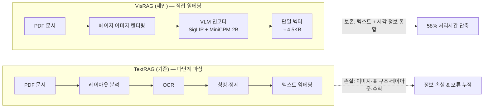

# VISRAG: VISION-BASED RETRIEVAL-AUGMENTED GENERATION ON MULTI-MODALITY DOCUMENTS

저자 :

Shi Yu1∗, Chaoyue Tang2∗, Bokai Xu2∗, Junbo Cui2∗, Junhao Ran3, Yukun Yan1†,

Zhenghao Liu4, Shuo Wang1, Xu Han1, Zhiyuan Liu1†, Maosong Sun1

1Department of Computer Science and Technology, Tsinghua University

2ModelBest Inc. 3Rice University 4Northeastern University

yus21@mails.tsinghua.edu.cn

발표 : ICLR 2025

논문 : [PDF](https://arxiv.org/pdf/2410.10594)

코드 : [GitHub - OpenBMB/VisRAG](https://github.com/OpenBMB/VisRAG)

---

## 0. Summary

<p align = 'center'>

</p>

<p algin = 'center'>

</p>


### 0.1. 문제 (Problem)

* 기존의 RAG(TextRAG) 시스템의 한계.
    * 정보 손실: 문서에서 텍스트를 추출하기 위해 레이아웃 인식, OCR(광학 문자 인식) 등의 복잡한 파싱 과정을 거치는데, 이 과정에서 이미지, 도표, 레이아웃 등 중요한 시각적 정보가 유실되거나 오류가 발생합니다.
        * 레이아웃 인식(Layout Recognition), 광학 문자 인식(OCR), 텍스트 결합(Text Joining)과 같은 여러 단계가 얽힌 복잡한 과정
    * 멀티모달 대응 불가: 텍스트만 활용하기 때문에 이미지와 텍스트가 섞인 실제 환경의 복합 문서를 충분히 활용하지 못합니다.

### 0.2. 핵심 아이디어 (Core Idea)

* VisRAG는 문서에서 텍스트를 파싱하는 대신, 문서 페이지 자체를 이미지로 보고 직접 처리하는 VLM(Vision-Language Model) 기반의 파이프라인을 제안합니다.
* VisRAG-Ret (검색기):
    * 텍스트 쿼리와 문서 이미지를 동일한 임베딩 공간으로 매핑합니다.
    * 가중 평균 풀링(Weighted Mean Pooling)을 사용하여 임베딩 벡터를 생성합니다.
    * (여기서 $w_{i}$는 토큰 가중치, $h_{i}$는 은닉 상태)

$$v=\sum_{i=1}^{S}w_{i}h_{i}$$

* VisRAG-Gen (생성기):
    * 검색된 상위 k개의 문서 이미지를 VLM에 직접 입력하여 답변을 생성합니다.
    * 여러 이미지를 처리하기 위해 '페이지 이어붙이기(Concatenation)'나 '가중치 기반 선택(Weighted Selection)' 기법 등을 사용합니다.

### 0.3. 효과 (Effects)

* 데이터 보존: 파싱 과정을 생략함으로써 원본 문서의 모든 정보(레이아웃, 이미지, 글꼴 등)를 손실 없이 활용합니다.
* 효율적인 학습: 텍스트 기반 모델에 비해 적은 양의 데이터로도 더 높은 성능을 달성하는 데이터 효율성을 보여줍니다.
* 메모리 효율성: 기존 시각 검색 모델(예: ColPali) 대비 단일 벡터를 사용하여 훨씬 적은 메모리(4.5KB vs 256KB)를 차지하면서도 우수한 성능을 유지합니다.

### 0.4. 결과 (Results)

* 성능 향상: 기존 TextRAG 대비 20~40%의 상대적 성능 향상을 기록했습니다.
* 검색 능력: VisRAG-Ret은 최신 텍스트 및 시각 기반 검색기들을 뛰어넘는 성능을 보였으며, 특히 데이터가 적은 상황(Out-of-domain)에서 더 강력한 일반화 능력을 입증했습니다.
* 사례 연구: 텍스트 추출이 어려운 화려한 폰트나 레이아웃 정보가 중요한 문항에서 VisRAG가 훨씬 더 정확한 답변을 생성함을 확인했습니다.

### 0.5. 검색 엔진의 메커니즘 (VisRAG-Ret)

* 가중 평균 풀링(Weighted Mean Pooling):
    * 생성형 VLM의 특성을 고려해, 마지막 레이어의 히든 스테이트(Hidden states) 중 뒤쪽 토큰에 더 높은 가중치를 주는 방식을 채택했습니다.
    * 인과적 어텐션(Causal Attention) 구조
    * 뒤쪽 토큰일수록 앞서 나온 모든 정보에 대한 요약본을 담고 있을 확률이 높기 때문에, 뒤쪽 은닉 상태(Hidden States)에 더 높은 가중치를 부여

$$v=\sum_{i=1}^{S}w_{i}h_{i}, \quad w_{i}=\frac{i}{\sum_{j=1}^{S}j}$$

* 가중치 분모 계산: $1 + 2 + 3 = 6$
* 각 토큰의 가중치:
    * 첫 번째 토큰 ( $w_1$ ): $1/6 \approx 16.7\%$
    * 두 번째 토큰 ( $w_2$ ): $2/6 \approx 33.3\%$
    * 세 번째 토큰 ( $w_3$ ): $3/6 \approx 50.0\%$

* 단일 벡터 임베딩: 페이지당 수천 개의 벡터를 사용하는 다른 시각 검색 모델(예: ColPali)과 달리, 페이지당 하나의 벡터(4.5KB)만 사용하여 대규모 시스템 구축에 훨씬 유리합니다.

### 0.6. 멀티 페이지 생성 전략 (VisRAG-Gen)

* 페이지 이어붙이기 (Page Concatenation): 여러 이미지를 하나로 합쳐 단일 이미지 모델이 읽게 만듭니다.
    * 이 방식은 생성 단계에서 사용되며, 검색된 여러 개의 문서를 모델에 한 번에 입력하기 위한 전략
* 가중치 기반 선택 (Weighted Selection): 각 페이지별 답변의 생성 신뢰도(Perplexity, **낮을수록 모델이 확신하는 답**)와 검색 점수를 조합해 최적의 답변을 고릅니다.
    * 단순히 점수가 높은 것을 고르는 것이 아니라, 검색 모델의 확신과 생성 모델의 확신을 곱해서 최종 승자를 정하는 방식입니다.
* 멀티 이미지 입력: 최신 VLM(MiniCPM-V 2.6 등)의 기능을 활용해 여러 장의 이미지를 동시에 넣고 교차 추론을 수행합니다.

### 0.7. 학습 및 운영 효율성

* 데이터 효율성: TextRAG 모델이 75,000개의 예제로 도달하는 성능을 VisRAG는 단 20,000개의 예제만으로 달성할 만큼 학습 효율이 좋습니다.
* 파이프라인 단순화: 레이아웃 분석, OCR, 텍스트 정제 등의 복잡한 단계(Cascade of processes)를 생략하므로 시스템 구조가 훨씬 간결해집니다.
* 속도: 오프라인 문서 처리 단계에서 파싱 과정을 건너뛰기 때문에, 전체 처리 시간을 약 58% 절감할 수 있습니다.


<p align='center'>

</p>

---

## 1. VLM 구조 상세 (Backbone Architecture)

VisRAG는 **VisRAG-Ret(검색기)** 과 **VisRAG-Gen(생성기)** 두 컴포넌트로 구성되며, 둘 다 VLM을 backbone으로 사용합니다.

### 1.1. VisRAG-Ret: MiniCPM-V 2.0 기반 검색기

* **Backbone**: MiniCPM-V 2.0 (총 **3.43B 파라미터**)
    * **비전 인코더**: SigLIP-400M (HuggingFace M4의 `siglip-so400m-14-980-flash-attn2-navit` 사용)
    * **언어 모델**: MiniCPM-2B
    * 두 모듈 사이에 **Perceiver-style resampler**가 들어가 visual token을 압축
* **고해상도 처리**: PDF 페이지처럼 큰 이미지는 **image slicing**으로 여러 조각에 나누어 SigLIP에 통과시킨 후 결합
* **Dual-encoder (Siamese) 구조**:
    * 텍스트 쿼리와 문서 이미지를 **동일한 VLM**으로 인코딩 (가중치 공유)
    * 검색 시점에는 cosine similarity로 매칭

### 1.2. 임베딩 생성 흐름

```
[입력]
  ├─ 텍스트 쿼리 → MiniCPM-2B에 직접 입력
  └─ 문서 이미지 → SigLIP-400M → Resampler → MiniCPM-2B
                                                  ↓
                          마지막 레이어 hidden states  h₁, h₂, ..., h_S
                                                  ↓
                          Weighted Mean Pooling   wᵢ = i / Σⱼ
                                                  ↓
                          단일 임베딩 벡터 v  (≈ 4.5KB / 페이지)
```

* **Causal attention 가정**: MiniCPM-2B는 causal LLM이므로 뒤쪽 토큰일수록 앞 문맥 전체를 누적적으로 attend → 뒤쪽 hidden state에 더 큰 가중치 부여

### 1.3. VisRAG-Gen: 생성기

* **학습되지 않음** (off-the-shelf로 사용)
* 논문에서 실험한 generator 후보:
    * **MiniCPM-V 2.0** (single-image, 3.43B)
    * **MiniCPM-V 2.6** (multi-image, 8.5B, SigLIP-400M + Qwen2-7B 기반)
    * **GPT-4o** (multi-image, closed-source)
* MiniCPM-V 2.6과 GPT-4o는 multi-image를 받을 수 있어 멀티 페이지 추론에 유리

---

## 2. OCR 기반 TextRAG vs Vision 기반 VisRAG

### 2.1. 파이프라인 복잡도 비교

**TextRAG (기존)** — 4~5개의 독립 모델/규칙을 순차로 태우는 cascade:

```
PDF → [Layout Detection] → [OCR] → [Reading Order] → [Cleaning + Chunking] → [Text Embedding]
       (LayoutLMv3 등)     (Tesseract,    (다단 처리)    (정제 규칙)            (BGE, E5 등)
                            PaddleOCR)
```
* 각 단계의 오류가 **곱셈으로 누적** (Layout이 그림을 텍스트로 오인 → OCR이 헛소리 추출 → 임베딩에 그대로 반영)

**VisRAG (제안)** — 단일 모델, 단일 파이프라인:

```
PDF → [Page Image 렌더링] → [VLM 인코더 (SigLIP + MiniCPM)] → [단일 벡터]
```

### 2.2. OCR이 손실하는 정보 — 구체적 실패 케이스

| 케이스 | OCR 결과 | 손실되는 정보 |
|---|---|---|
| 수식 ($\int_0^\infty e^{-x^2}dx$) | "0 e dx" 같은 깨진 토큰 | LaTeX 구조, 변수 관계 |
| 차트/그래프 | 축 레이블·범례 텍스트만 (대부분 실패) | 데이터 추세, 막대 높이, 색 구분 |
| 표(Table) | 셀 텍스트가 한 줄로 이어붙음 | **행/열 관계 (가장 큰 문제)** |
| 다단 레이아웃 | 좌→우 잘못된 순서로 읽기 | 단락의 논리적 흐름 |
| 폰트 강조 (굵게, 색, 형광펜) | 일반 텍스트와 동일 | 강조·중요도 단서 |
| 도표 + 라벨 (예: 회로도) | 라벨 텍스트만 추출, 도형 무시 | 공간적 관계 |
| 화려한 폰트/세리프 | 인식 오류 다수 | 가독성 자체 |
| 손글씨·서명 | 거의 인식 불가 | 해당 영역 전체 |

> 논문의 case study(Table 8, 9)도 이런 사례들임. 특히 **ArxivQA, ChartQA, InfographicsVQA** 같은 그림 중심 벤치마크에서 격차가 크게 벌어짐.

### 2.3. 효율성 비교 (논문 수치)

| 항목 | TextRAG | VisRAG |
|---|---|---|
| 오프라인 전처리 시간 | 100% | **약 42%** (58% 단축) |
| 학습 데이터 효율 | 75,000 쌍 필요 | **20,000 쌍**으로 동일 성능 |
| 페이지당 벡터 크기 (vs ColPali) | — | **4.5KB** (ColPali 다중 벡터 ~256KB) |
| End-to-end 정확도 (GPT-4o 생성기) | baseline | **+20% 상대 향상** |
| End-to-end 정확도 (MiniCPM-V 2.6 생성기) | baseline | **+40% 상대 향상** |

### 2.4. "OCR을 아예 안 쓰는가?"

VisRAG-Gen의 backbone인 **MiniCPM-V 2.6 자체가 강력한 OCR 능력을 내재화**하고 있음. 즉,
* **외부 OCR 엔진을 cascade로 붙이는 게 아니라**, VLM이 픽셀에서 직접 텍스트와 시각 정보를 동시에 이해
* 명시적 OCR 단계는 사라지지만, **OCR 능력은 모델 안에 흡수**되어 있음
* 이게 "parsing-free RAG"의 핵심 차이

### 2.5. 파이프라인 비교 다이어그램 (Mermaid)



---

## 3. 학습 방법 및 데이터셋

### 3.1. 손실 함수

* **InfoNCE Contrastive Loss** 사용
* **In-batch negatives**: 배치 내 다른 (query, doc) 쌍을 negative로 활용
* Query-document positive 쌍은 가깝게, 다른 쌍은 멀게 학습

### 3.2. 학습 데이터 구성

* **총 362,110개** Query-Document (Q-D) 쌍
* **구성**:
    * **34%**: open-source VQA 데이터셋의 train split
    * **66%**: 웹 크롤링 PDF + GPT-4o로 합성한 pseudo-query
* HuggingFace의 [VisRAG Collection](https://huggingface.co/openbmb/VisRAG-Ret)에서 공개

---

## 4. 평가 (Evaluation)

### 4.1. 평가 벤치마크 (6개)

| 데이터셋 | 문서 유형 | 특징 |
|---|---|---|
| **MP-DocVQA** | 산업 문서 | single-page QA |
| **ArXivQA** | 학술 논문 그림 | 그림 중심 |
| **ChartQA** | 차트 | 데이터 시각화 |
| **InfographicsVQA** | 인포그래픽 | 복잡한 시각 디자인 |
| **PlotQA** | 플롯/그래프 | 수치 추론 |
| **SlideVQA** | 발표 슬라이드 | **multi-hop (멀티페이지) QA** |

* SlideVQA만 멀티페이지 추론을 요구 → VisRAG-Gen의 멀티 이미지 입력 전략의 동기

### 4.2. 비교 베이스라인

**검색 (Retrieval):**
* 텍스트 기반: **bge-large**, **NV-Embed-v2**
* 비전 기반: **ColPali** (multi-vector)
* Ablation: **SigLIP 단독**, **MiniCPM (OCR)** (OCR + 텍스트 임베딩), **MiniCPM (Captioner)** (이미지 캡션 + 텍스트 임베딩)

**생성 (Generation):**
* TextRAG-Gen 베이스라인: OCR로 추출한 텍스트를 같은 VLM에 입력
* VisRAG-Gen: 이미지 직접 입력

> **핵심 ablation 결과**: SigLIP 단독 < MiniCPM(OCR) < **VisRAG**
> → 비전 인코더만 쓰거나 LLM만 쓰는 것보다 **VLM 결합이 필수적**임을 입증

---

## 5. 한계점 및 향후 연구 방향

* **단일 벡터의 한계**: 매우 긴 문서나 페이지 내 세밀한 패치 매칭에서는 ColPali 같은 multi-vector 방식이 유리할 수 있음
* **언어 커버리지**: 학습 데이터가 영어 중심 → 한국어/중국어/일본어 등 다국어 페이지에 대한 일반화는 별도 검증 필요
* **VisRAG-Gen은 학습되지 않음**: off-the-shelf VLM을 그대로 사용 → 생성기를 fine-tuning하면 추가 성능 향상 여지
* **페이지 이어붙이기의 해상도 손실**: 여러 이미지를 한 장에 합치면 개별 페이지의 디테일이 흐려짐
* **Weighted Selection의 한계**: 페이지별 독립 추론이라 **cross-page 추론(multi-hop)** 이 불가능 → SlideVQA 같은 멀티홉 데이터에서 성능 제약

---

## 6. 발표/리뷰 시 강조 포인트

1. **Parsing-free**가 핵심 키워드 — "OCR을 안 쓴다"가 아니라 "OCR을 cascade로 분리하지 않고 VLM에 흡수시킨다"
2. **Dual-encoder + Weighted Mean Pooling** — Causal attention의 특성을 활용한 단일 벡터 임베딩
3. **데이터 효율성 (20K vs 75K)** — 시각 정보가 학습 신호로 풍부함을 시사
4. **메모리 효율성 (4.5KB vs ColPali 256KB)** — 대규모 검색 시스템에 실용적
5. **End-to-end +20~40% 향상** — generator를 GPT-4o로 바꿔도 일관된 효과 (cascade 효과)
