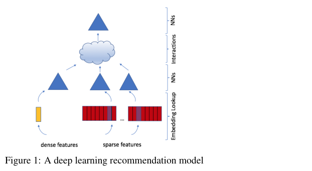
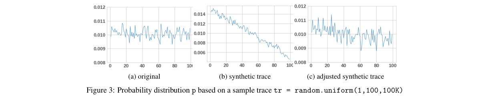
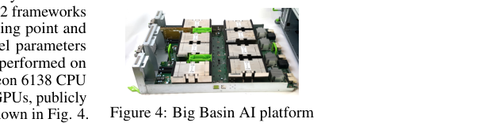
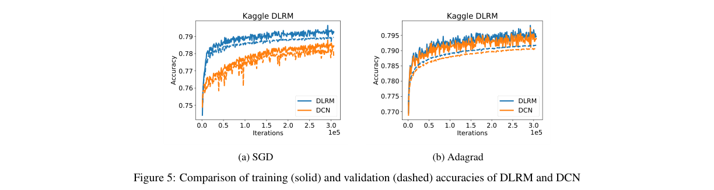
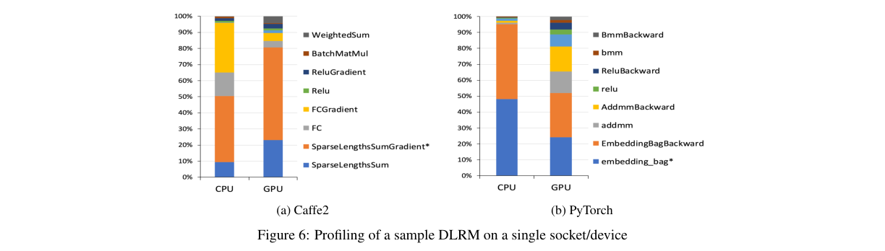

# Deep Learning Recommendation Model for Personalization and Recommendation Systems

저자 :

Maxim Naumov, Dheevatsa Mudigere, Hao-Jun Michael Shi (Northwestern University), Jianyu Huang, Narayanan Sundaraman, Jongsoo Park, Xiaodong Wang, Udit Gupta (Harvard University), Carole-Jean Wu, Alisson G. Azzolini, Dmytro Dzhulgakov, Andrey Mallevich, Ilia Cherniavskii, Yinghai Lu, Raghuraman Krishnamoorthi, Ansha Yu, Volodymyr Kondratenko, Stephanie Pereira, Xianjie Chen, Wenlin Chen, Vijay Rao, Bill Jia, Liang Xiong, Misha Smelyanskiy

Facebook AI

발표 : arXiv 2019

논문 : [PDF](https://arxiv.org/pdf/1906.00091)

출처 : [https://arxiv.org/abs/1906.00091](https://arxiv.org/abs/1906.00091)

---

## 0. Summary

<p align='center'>

</p>

### 0.1. 문제 (Problem)

* 추천 시스템은 광고 클릭률(CTR) 예측 등 인터넷 기업의 핵심 기술이지만, 학술 커뮤니티에서는 상대적으로 연구가 적게 이루어짐.
* 추천 모델은 범주형(categorical) 피처를 대규모로 처리해야 하므로 이미지·텍스트 중심의 기존 딥러닝 모델과 구조적으로 매우 다름.
* 임베딩 테이블(embedding table)은 파라미터 수가 수십억에 달해 단순 데이터 병렬(data parallelism)로는 메모리를 감당할 수 없음.
* 산업계에서 사용하는 state-of-the-art 추천 모델이 공개된 벤치마크·구현으로 제공되지 않아 후속 연구와 시스템 설계 실험이 어려움.

### 0.2. 핵심 아이디어 (Core Idea)

DLRM(Deep Learning Recommendation Model)은 추천 시스템과 예측 분석(predictive analytics)이라는 두 가지 관점을 통합하여 설계된 모델이다. ML 측면의 핵심 구성요소 네 가지와 시스템 측면 기여 하나로 이루어진다.

**(1) 임베딩 테이블(Embedding Table) — 카테고리를 dense vector로 변환하는 사전**

범주형 피처(예: 사용자 ID, 상품 카테고리)는 수백만 가지 값을 가지는 sparse한 데이터다. 임베딩 테이블은 이 카테고리 ID를 조밀한(dense) 실수 벡터로 변환하는 '사전(lookup dictionary)'이다. 여러 항목을 동시에 조회할 때는 multi-hot 가중 조합으로 표현한다.

$$w_i^T = e_i^T W$$

여기서 $e_i$는 i번째 카테고리를 나타내는 one-hot 벡터, $W \in \mathbb{R}^{m \times d}$는 임베딩 테이블이다.

**(2) Bottom MLP — dense 피처를 임베딩과 같은 차원으로 맞추는 정렬기**

연속형 피처(예: 클릭 시간, 가격)는 MLP를 거쳐 임베딩 벡터와 동일한 차원의 dense 표현으로 변환된다. 이를 통해 범주형·연속형 피처를 같은 공간에서 비교·결합할 수 있다.

**(3) 쌍별 내적 상호작용(Pairwise Dot-Product Interaction) — 팩터라이제이션 머신 방식의 feature 간 궁합 측정**

FM(Factorization Machine)의 아이디어를 빌려, 모든 임베딩 벡터 쌍 간의 내적(dot product)을 계산한다. "상품 카테고리 임베딩"과 "사용자 관심사 임베딩"이 얼마나 가까운지를 수치로 측정하는 것과 같다. 이 방식은 같은 벡터 내부 원소 간 교차항(cross-term)을 만들지 않으므로, Deep and Cross 등 다른 모델보다 파라미터 수를 크게 줄이면서도 의미 있는 2차 상호작용만 포착한다.

**(4) Top MLP + Sigmoid — 최종 클릭 확률 산출**

dot product 결과와 dense 피처를 concatenate한 뒤 또 하나의 MLP를 거쳐 sigmoid 활성함수로 클릭 확률(0~1)을 출력한다.

**(5) 하이브리드 병렬화(Hybrid Parallelism) — 임베딩은 모델 병렬, MLP는 데이터 병렬**

임베딩 테이블은 크기가 수 GB에 달해 각 디바이스에 복제하는 데이터 병렬이 불가능하다. 따라서 임베딩은 여러 GPU에 분산(모델 병렬)하고, MLP는 각 GPU에 복제하여 mini-batch를 분산 처리(데이터 병렬)한다. 두 방식을 결합하는 과정에서 각 GPU가 보유한 임베딩 결과를 적절한 디바이스로 재배분하는 버터플라이 셔플(butterfly shuffle) 통신 연산이 사용된다. 이는 마치 릴레이 선수들이 바통을 교차하여 전달하듯 임베딩 벡터 조각을 재정렬하는 것과 같다.

### 0.3. 효과 (Effects)

* 추천 시스템에 특화된 최초의 공개 벤치마크 모델로, PyTorch·Caffe2 구현 코드와 함께 배포되어 후속 연구와 시스템 공동 설계(co-design)의 기준점을 제공한다.
* FM 방식의 2차 상호작용만 사용함으로써 더 높은 차수의 상호작용을 사용하는 경쟁 모델(Wide&Deep, DCN 등)과 유사한 정확도를 더 낮은 계산·메모리 비용으로 달성한다.
* 하이브리드 병렬화를 통해 단일 GPU 메모리로는 수용 불가능한 대규모 임베딩 테이블을 여러 GPU에 분산하여 현실적인 규모의 학습이 가능해진다.

### 0.4. 결과 (Results)

* Criteo Ad Kaggle 데이터셋(약 4500만 샘플, 13개 dense + 26개 categorical 피처)에서 DLRM은 SGD 및 Adagrad 옵티마이저 모두에서 DCN 대비 약간 높은 훈련·검증 정확도를 기록(파라미터 수 동일, 약 5억 4000만 개).
* 단일 소켓 프로파일링(8개 임베딩 테이블 × 100만 벡터, dim=64; dense 512차원; 배치 2048K)에서 Caffe2 기준 CPU 256초, GPU 62초로 수행.
* 임베딩 룩업과 FC 레이어가 연산 시간의 대부분을 차지하며, GPU에서는 FC 레이어 비중이 크게 감소하는 특성이 확인됨.

### 0.5. 상세 동작 방식 (How DLRM Works)

#### 입력: 두 종류의 피처

추천 모델은 두 가지 성격이 다른 피처를 받습니다.

* **연속형(dense)**: 가격, 클릭 시간, 조회 수 같은 실수값
* **범주형(categorical/sparse)**: 사용자 ID, 상품 카테고리처럼 수백만 가지 값 중 하나

#### Step 1 — 임베딩 룩업 (범주형 피처 처리)

범주형 피처는 one-hot 벡터로 임베딩 테이블 $W$를 조회합니다.

$$w_i^T = e_i^T W$$

"사용자 ID=42817"을 $d$차원 실수 벡터로 변환하는 것. 카테고리마다 임베딩 테이블이 따로 있으며, 전체 파라미터의 대부분(수억~수십억 개)이 여기 있습니다.

#### Step 2 — Bottom MLP (연속형 피처 처리)

연속형 피처는 MLP를 통과해 임베딩과 **같은 차원 $d$**로 맞춰집니다. 이 단계가 없으면 두 종류의 피처를 같은 공간에서 비교할 수 없습니다.

```
연속형 피처 (예: 512차원) → MLP(512-256-64) → 64차원 벡터
임베딩 벡터들 → 각각 64차원
```

#### Step 3 — Pairwise Dot-Product Interaction (핵심 차별점)

모든 임베딩 벡터 쌍 + bottom MLP 출력 간의 **내적(dot product)**을 계산합니다.

* "사용자 관심사 임베딩" · "상품 카테고리 임베딩" = 얼마나 잘 맞는가?
* Factorization Machine(FM)에서 온 아이디어로, 2차 상호작용만 포착

**DCN/DeepFM과의 차이**: 다른 모델은 벡터 내부 원소끼리 교차항도 만들지만, DLRM은 서로 다른 임베딩 벡터 쌍 사이의 내적만 사용 → 파라미터 수를 크게 줄이면서 비슷한 정확도.

#### Step 4 — Top MLP + Sigmoid

내적 결과들과 dense 표현을 concatenate해 Top MLP를 통과시킨 뒤 sigmoid로 0~1 확률을 출력합니다.

```
[dot-product 결과 벡터] + [bottom MLP 출력] → Top MLP(512-256) → sigmoid → 클릭 확률
```

#### 시스템 측면: 하이브리드 병렬화

임베딩 테이블은 수 GB라 GPU 한 장에 다 못 넣습니다.

| 구성요소 | 병렬화 방식 | 이유 |
|----------|------------|------|
| 임베딩 테이블 | 모델 병렬 (GPU에 분산) | 너무 커서 복제 불가 |
| MLP | 데이터 병렬 (각 GPU에 복제) | 상대적으로 작고 빠름 |

임베딩 조회 후에는 **버터플라이 셔플(all-to-all 통신)**로 각 GPU가 갖고 있는 임베딩 조각을 샘플 단위로 재배분한 뒤 상호작용 연산을 수행합니다.

#### 전체 데이터 흐름

```
범주형 피처 → [임베딩 룩업] ─┐
                              ├─→ [Pairwise Dot-Product] → [Top MLP] → sigmoid → 클릭 확률
연속형 피처 → [Bottom MLP] ──┘
```

---

## 1. Introduction

추천 시스템과 개인화 서비스는 광고 클릭률(CTR) 예측, 상품 랭킹, 콘텐츠 큐레이션 등 대형 인터넷 기업에서 핵심적인 역할을 담당한다. 딥러닝이 부상하면서 이 분야도 신경망 기반 모델을 적극 채택하기 시작했지만, 추천 모델은 이미지·텍스트 모델과는 본질적으로 다른 특성을 가진다.

첫 번째 관점은 추천 시스템의 역사에서 비롯된다. 초기에는 전문가가 제품을 분류하는 콘텐츠 필터링(content filtering)이 쓰였고, 이후 사용자 과거 행동에 기반한 협업 필터링(collaborative filtering)으로 발전했다. 행렬 분해(matrix factorization)를 통한 잠재 인수(latent factor) 방법은 사용자와 상품을 동일한 잠재 공간에 임베딩하여 내적만으로 평점을 예측할 수 있음을 보여주었다.

두 번째 관점은 예측 분석(predictive analytics)에서 온다. 로지스틱 회귀에서 시작한 분류 모델은 딥 네트워크를 채택하면서 크게 발전했다. 범주형 데이터를 처리하기 위해 임베딩(embedding)을 활용하는 방식이 도입되었고, 이 임베딩 공간은 행렬 분해의 잠재 인수 공간과 같은 것으로 해석된다.

저자들은 이 두 관점을 결합하여 DLRM(Deep Learning Recommendation Model)을 제안한다. DLRM은 임베딩으로 범주형 피처를, MLP로 연속형 피처를 처리하고, FM(Factorization Machine)의 아이디어에 따라 피처 간 명시적인 2차 상호작용을 계산한 뒤, 최종 클릭 확률을 출력한다. PyTorch와 Caffe2 두 가지 프레임워크로 구현되어 공개됨으로써, 추천 시스템 알고리즘 연구와 하드웨어·시스템 공동 설계를 위한 오픈소스 벤치마크를 제공하는 것이 이 논문의 핵심 기여다.

## 2. Method

### 2.1. DLRM 구성요소

DLRM의 구조는 네 가지 핵심 기술을 통합하여 구성된다.

**임베딩(Embedding)**

범주형 피처를 dense 표현으로 변환한다. one-hot 벡터 $e_i$로 임베딩 테이블 $W \in \mathbb{R}^{m \times d}$를 조회하면:

$$w_i^T = e_i^T W$$

여러 항목을 동시에 처리하는 multi-hot 시나리오에서는 가중 조합으로 확장된다:

$$S = A^T W$$

여기서 $A = [a_1, \ldots, a_t]$는 가중치로 구성된 sparse 행렬, $t$는 mini-batch 크기다.

**행렬 분해(Matrix Factorization)**

사용자-상품 평점 행렬 $R \approx WV^T$로 근사하는 것이 추천 임베딩의 이론적 근거다. 이는 임베딩 벡터의 내적이 의미 있는 예측값을 산출할 수 있음을 시사한다.

**팩터라이제이션 머신(Factorization Machine)**

FM은 2차 상호작용을 갖는 선형 모델로 분류 문제를 정의한다:

$$\hat{y} = b + w^T x + x^T \operatorname{upper}(VV^T) x$$

여기서 $V \in \mathbb{R}^{n \times d}$는 잠재 인수 행렬, $\operatorname{upper}$는 상삼각 부분만 선택하는 연산이다. FM은 SVM의 다항식 커널과 달리 상호작용 행렬을 잠재 인수로 분해하여 희소 데이터에서도 효과적으로 동작한다.

**다층 퍼셉트론(MLP)**

$$\hat{y} = W_k \sigma(W_{k-1} \sigma(\cdots \sigma(W_1 x + b_1) \cdots) + b_{k-1}) + b_k$$

여기서 $\sigma$는 componentwise 활성함수, $W_l \in \mathbb{R}^{n_l \times n_{l-1}}$, $b_l \in \mathbb{R}^{n_l}$은 각 레이어의 가중치와 편향이다.

### 2.2. DLRM 아키텍처

DLRM은 다음 흐름으로 동작한다.

* 각 범주형 피처 → 임베딩 테이블 조회 → 동일 차원($d$)의 dense 벡터
* 연속형 피처 → Bottom MLP → 임베딩과 동일 차원 $d$의 표현
* 모든 임베딩 벡터 쌍 및 bottom MLP 출력 간 내적(dot product)을 계산 → 2차 상호작용 포착
* 내적 결과와 dense 표현을 concatenate → Top MLP → sigmoid → 클릭 확률

다른 모델(Deep and Cross Network 등)은 피처 벡터 내부 원소 간의 교차항도 생성하여 차원이 높아지지만, DLRM은 서로 다른 임베딩 벡터 쌍 사이의 내적만 사용하므로 파라미터 수와 계산량을 크게 줄일 수 있다.

### 2.3. 병렬화

<p align='center'>

</p>

대규모 DLRM은 수십 GB에 달하는 임베딩 테이블을 포함하므로, 단순 데이터 병렬(data parallelism)로는 각 디바이스에 모델을 복제하기 불가능하다. 이를 해결하기 위해 **모델 병렬(model parallelism)과 데이터 병렬(data parallelism)을 결합**한다.

* 임베딩 테이블: 여러 GPU에 분산 배치(모델 병렬). 각 GPU는 자신에게 배정된 임베딩 테이블의 모든 mini-batch 샘플에 대한 조회 결과를 보유.
* MLP: 각 GPU에 복제(데이터 병렬). 파라미터 업데이트 시 allreduce 연산으로 동기화.

임베딩 조회 이후, 각 GPU는 mini-batch 전체에 대한 일부 임베딩을 갖고 있지만 상호작용 연산을 위해서는 샘플 단위로 모든 임베딩이 필요하다. 이를 해결하기 위해 **버터플라이 셔플(butterfly shuffle)** 연산을 사용하여 임베딩 벡터를 적절한 디바이스로 재분배한다(개인화 all-to-all 통신). PyTorch의 `nn.EmbeddingBag`, Caffe2의 `SparseLengthSum`을 각기 다른 디바이스에 명시적으로 할당하여 모델 병렬을 구현하며, 이 기능은 기본 프레임워크에서 지원하지 않아 커스텀 구현이 필요하다.

### 2.4. 데이터 생성

DLRM 벤치마킹을 위해 세 가지 데이터 유형을 지원한다.

* **랜덤 데이터**: numpy의 균등/정규 분포로 연속형 피처를, 균등 분포로 범주형 인덱스를 생성. 스토리지 의존성 없이 하드웨어 특성 실험에 적합.
* **합성 데이터(Synthetic Trace)**: 실제 접근 패턴을 스택 거리(stack distance) 기반 확률 분포 $p$로 프로파일링한 뒤(Alg. 1), 해당 분포를 재현하는 인덱스 시퀀스를 생성(Alg. 2)하는 2단계 구조. 프라이버시 보호가 필요한 상황에서 실제 데이터 대신 사용 가능하며, 캐시 시뮬레이션에서 원본 트레이스와 유사한 hit/miss rate를 재현한다.

<p align='center'>

</p>

* **공개 데이터**: Criteo Ad Kaggle(4500만 샘플, 7일) 및 Criteo Ad Terabyte(24일). 13개 연속형 + 26개 범주형 피처로 구성.

## 3. Experiments

<p align='center'>

</p>

### 3.1. 실험 환경

실험은 Facebook의 Big Basin AI 플랫폼(Dual Socket Intel Xeon 6138 @ 2.00GHz, Nvidia Tesla V100 16GB GPU × 8)에서 수행되었다. 모델은 PyTorch 및 Caffe2 프레임워크로 구현되었으며 fp32 부동소수점, int32(Caffe2)/int64(PyTorch) 인덱스 타입을 사용한다.

### 3.2. 모델 정확도 비교 (DLRM vs DCN)

<p align='center'>

</p>

Criteo Ad Kaggle 데이터셋에서 DLRM과 DCN(Deep and Cross Network)을 비교한다. 두 모델 모두 약 **5억 4000만 개(540M)**의 파라미터를 가지도록 크기를 맞추었으며, 임베딩 차원은 16으로 설정했다.

* DLRM 구성: Bottom MLP(512-256-64 노드, 3 hidden layer) + Top MLP(512-256 노드, 2 hidden layer)
* DCN 구성: 6개 cross layer + deep network(512-256 노드)

SGD와 Adagrad 두 옵티마이저 모두에서 DLRM이 DCN보다 약간 높은 훈련·검증 정확도를 기록했다. 하이퍼파라미터 튜닝 없이 얻은 결과이므로 추가 최적화 여지가 있다.

### 3.3. 단일 소켓 성능 프로파일링

<p align='center'>

</p>

샘플 모델 구성: 8개 범주형 피처(임베딩 테이블 각 100만 벡터, 차원 64) + 512차원 연속형 피처. Bottom MLP 2레이어, Top MLP 4레이어. 204만 8000개 샘플(1000 mini-batch, 배치 크기 2048).

| 환경 | 실행 시간 |
|------|----------|
| Caffe2 CPU | ~256초 |
| Caffe2 GPU | ~62초 |

CPU에서는 FC 레이어가 전체 연산 시간에서 상당한 비중을 차지하는 반면, GPU에서는 FC 레이어 소요 시간이 거의 무시할 수 있는 수준으로 줄어든다. 임베딩 룩업(SparseLengthSum / EmbeddingBag)과 FC 레이어가 두 환경 모두에서 핵심 병목임을 확인했다. 이 프로파일링 결과는 미래의 하드웨어 및 시스템 설계 방향을 제시하는 벤치마크로 활용된다.

## 4. Conclusion

이 논문은 Facebook의 실제 추천 시스템에서 영감을 받아 설계된 딥러닝 추천 모델 DLRM을 제안하고, PyTorch 및 Caffe2 오픈소스 구현을 제공한다. 추천 시스템(행렬 분해, 협업 필터링)과 예측 분석(MLP, FM)의 두 관점을 통합하여 범주형·연속형 피처를 처리하고, FM 방식의 2차 pairwise 상호작용으로 희소 데이터의 복잡한 패턴을 포착한다. 또한 임베딩에는 모델 병렬, MLP에는 데이터 병렬을 조합한 하이브리드 병렬화 방식을 도입하여 메모리 용량 제약을 해결한다. Criteo 데이터셋에서 DCN 대비 동등하거나 소폭 높은 정확도를 기록하였으며, Big Basin 플랫폼에서의 성능 프로파일링을 통해 향후 알고리즘·시스템 연구를 위한 벤치마크 기반을 마련한다.

**한 줄 코멘트**: DLRM은 ML 정확도보다 "대규모 추천 시스템의 시스템 특성을 연구할 수 있는 공개 기준점"을 제시하는 데 더 큰 의의가 있으며, 이후 산업·학술 추천 시스템 연구의 표준 벤치마크로 널리 활용된다.

---

## 부록: 사전 지식 (Prerequisites)

### A.1. 알아야 할 핵심 개념

- **임베딩 테이블 / 원-핫 조회 (Embedding Table / One-Hot Lookup)** — 범주형 ID를 dense 실수 벡터로 변환하는 학습 가능한 행렬; one-hot 벡터로 해당 행을 조회하는 방식.
  - 본문 위치: §2.1.1, 식 (1) $w_i^T = e_i^T W$

- **협업 필터링 / 행렬 분해 (Collaborative Filtering / Matrix Factorization)** — 사용자-아이템 평점 행렬을 $R \approx WV^T$로 분해하여 잠재 인수(latent factor)로 선호도를 예측하는 기법.
  - 본문 위치: §1 Introduction(두 번째 관점), §2.1.2; 임베딩 내적이 의미 있는 예측값을 산출하는 이론적 근거로 사용됨.

- **팩터라이제이션 머신 (Factorization Machine, FM)** — 희소 데이터에서 모든 피처 쌍의 2차 상호작용을 잠재 벡터의 내적으로 파라미터화하는 선형 모델.
  - 본문 위치: §2.1.3, 식 $\hat{y} = b + w^T x + x^T \operatorname{upper}(VV^T) x$; DLRM의 pairwise dot-product interaction layer의 직접적인 이론 근거.

- **다층 퍼셉트론 (Multi-Layer Perceptron, MLP)** — 비선형 활성함수를 포함하는 완전 연결 신경망 계층 묶음.
  - 본문 위치: §2.1.4; Bottom MLP(dense 피처 → 임베딩 차원 정렬), Top MLP(상호작용 결과 → 클릭 확률)로 두 단계에서 사용됨.

- **CTR 예측 / 범주형·연속형 피처 (CTR Prediction / Sparse-Dense Features)** — 광고 클릭률(CTR) 예측은 수백만 가지 값을 가지는 범주형(sparse) 피처와 연속형(dense) 피처를 동시에 다루는 분류 문제.
  - 본문 위치: §1, §3.2; Criteo Ad Kaggle 데이터셋(13개 dense + 26개 categorical 피처)으로 모델을 평가하는 배경 개념.

- **데이터 병렬 vs 모델 병렬 (Data Parallelism vs Model Parallelism)** — 데이터 병렬은 모델 복사본을 각 디바이스에 두고 mini-batch를 분산 처리; 모델 병렬은 모델 파라미터 자체를 여러 디바이스에 분할 배치.
  - 본문 위치: §2.3; 임베딩 테이블은 수 GB 규모이므로 모델 병렬, MLP는 데이터 병렬로 조합한 하이브리드 방식이 핵심 시스템 기여.

- **All-to-All 통신 / 버터플라이 셔플 (All-to-All / Butterfly Shuffle)** — 분산 컴퓨팅에서 모든 디바이스가 서로 데이터를 교환하는 집합 통신 연산; 버터플라이 패턴은 단계별로 쌍을 바꿔가며 데이터를 재분배.
  - 본문 위치: §2.3; 임베딩 조회 이후 각 GPU가 보유한 임베딩 벡터 조각을 샘플 단위로 재배치하는 데 사용됨.

- **Adagrad 옵티마이저 (Adagrad Optimizer)** — 각 파라미터별로 과거 기울기의 제곱합을 누적하여 학습률을 개별 적응시키는 최적화 알고리즘; 희소 피처에 효과적.
  - 본문 위치: §3.2; SGD와 함께 두 옵티마이저 모두에서 DLRM이 DCN을 소폭 상회하는 정확도를 보임을 비교 실험에서 사용.

---

### A.2. 먼저 읽으면 좋은 논문

1. **[2010][FM] Factorization Machines** (Rendle, ICDM 2010) — 희소 데이터에서 피처 쌍 간 2차 상호작용을 잠재 벡터 내적으로 파라미터화하는 FM 모델.
   - **왜?** DLRM의 interaction layer가 FM의 pairwise dot-product를 직접 채택하므로, FM을 모르면 핵심 설계 선택을 이해할 수 없음.

2. **[2016][Wide&Deep] Wide & Deep Learning for Recommender Systems** ([arxiv 1606.07792](https://arxiv.org/abs/1606.07792)) — Google이 제안한 memorization(wide)과 generalization(deep)을 결합한 추천 모델.
   - **왜?** DLRM의 전신 아키텍처 패턴을 확립한 논문으로, DLRM과의 구조적 차이를 비교하는 기준점.

3. **[2017][DCN] Deep & Cross Network for Ad Click Predictions** ([arxiv 1708.05123](https://arxiv.org/abs/1708.05123)) — explicit cross feature interaction을 Cross Network로 구현한 모델.
   - **왜?** §3.2에서 DLRM의 직접 비교 대상(동일 파라미터 수 540M으로 정확도 비교)이므로 반드시 구조를 파악해야 함.

4. **[2017][DeepFM] DeepFM: A Factorization-Machine based Neural Network for CTR Prediction** ([arxiv 1703.04247](https://arxiv.org/abs/1703.04247)) — FM과 DNN을 shared embedding 위에서 결합한 CTR 예측 모델.
   - **왜?** DLRM과 가장 유사한 FM+DNN 하이브리드 계열로, 구조적 유사성과 차이(shared vs separate embedding)를 비교하는 데 유용.

5. **[2017][NCF] Neural Collaborative Filtering** ([arxiv 1708.05031](https://arxiv.org/abs/1708.05031)) — 행렬 분해를 신경망으로 일반화하여 implicit feedback 추천에 적용.
   - **왜?** DLRM의 이론적 뿌리인 협업 필터링 → 신경망 연결 고리를 보여주는 직계 선행 연구.

6. **[2009][MF] Matrix Factorization Techniques for Recommender Systems** (Koren, Bell, Volinsky — IEEE Computer 2009) — 추천 시스템의 핵심 기법인 SVD 기반 행렬 분해를 체계적으로 정리한 서베이.
   - **왜?** 임베딩 내적이 예측값을 산출한다는 DLRM의 이론적 근거($R \approx WV^T$)가 이 논문의 MF 체계에서 직접 비롯됨.

> Repo 내 관련 정리: 없음 (cross-referenced in repo: 0)

---

### A.3. 관련 / 후속 논문

- **[2020][MLPerf] MLPerf Training Benchmark** (Mattson et al., MLSys 2020) — DLRM이 MLPerf Recommendation 벤치마크의 기반 모델로 채택됨. DLRM의 시스템 벤치마크 역할을 직접 계승.

- **[2022][DHEN] DHEN: A Deep and Hierarchical Ensemble Network for Large-Scale Click-Through Rate Prediction** ([arxiv 2203.11014](https://arxiv.org/abs/2203.11014)) — Meta가 제안한 계층적 상호작용 네트워크. DLRM의 단순 pairwise dot-product interaction을 더 풍부한 hierarchical interaction으로 확장.

- **[2024][HSTU] Actions Speak Louder than Words: Trillion-Parameter Sequential Transducers for Generative Recommendations** ([arxiv 2402.17152](https://arxiv.org/abs/2402.17152)) — Meta의 생성형 추천 모델. DLRM의 순차적 발전 방향인 대규모 generative recommendation 패러다임을 대표함.
