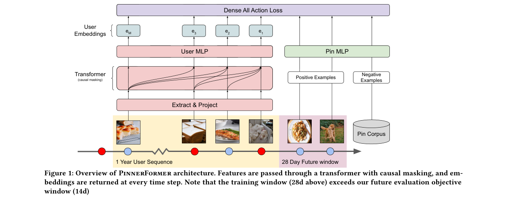
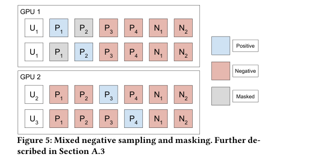
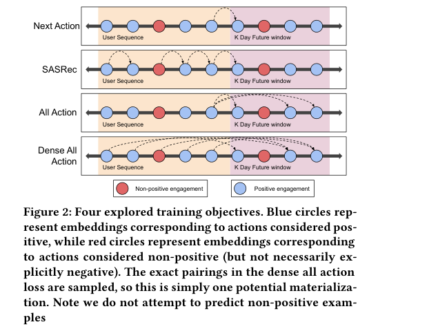
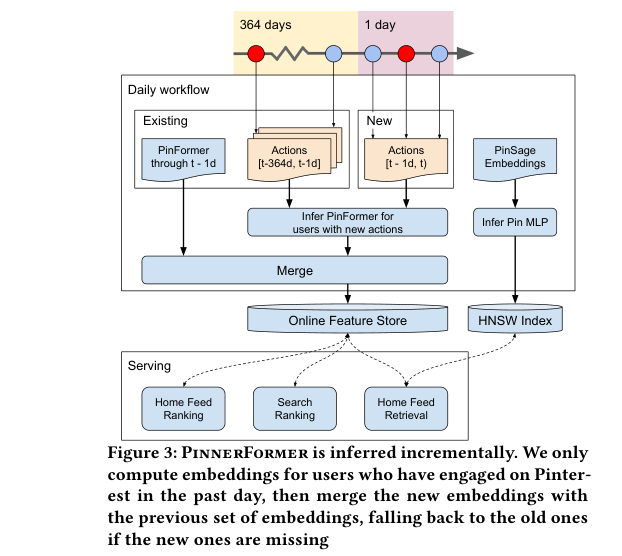
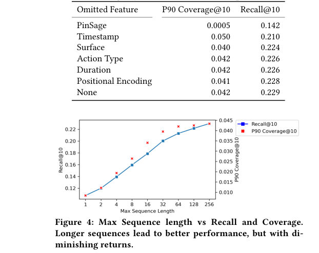
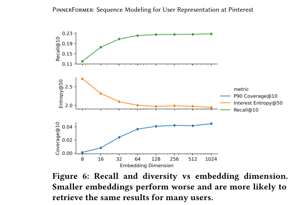

# PinnerFormer: Sequence Modeling for User Representation at Pinterest

저자 :

Nikil Pancha, Andrew Zhai, Jure Leskovec, Charles Rosenberg

Pinterest, San Francisco, USA

Stanford University, USA

발표 : KDD 2022

논문 : [PDF](https://arxiv.org/pdf/2205.04507)

출처 : [https://arxiv.org/abs/2205.04507](https://arxiv.org/abs/2205.04507)

---

## 0. Summary

### 0.1. 문제 (Problem)

* 기존 순차적 사용자 모델링(Sequential User Modeling)은 사용자의 다음 행동(next action)을 예측하도록 설계되어, **단기 관심사** 위주로 임베딩이 학습된다.
* 실시간(realtime) 추론을 전제로 하므로, 프로덕션 배포 시 두 가지 장벽이 생긴다:
  * **높은 계산 비용**: 사용자가 행동할 때마다 전체 시퀀스를 다시 인코딩해야 한다.
  * **높은 인프라 복잡도**: 상태(hidden state)를 스트리밍으로 유지하다가 데이터 손상이 발생하면 복구가 어렵다.
* Pinterest처럼 사용자가 하루에 수십~수백 번 행동하는 플랫폼에서는, 매 행동마다 재추론하는 비용이 일별 배치 모델 대비 수십 배에 달한다.
* 이전 시스템 PinnerSage는 사용자당 여러 개(최대 20개)의 임베딩을 생성해 다양성을 확보했으나, 수십억 행의 랭킹 학습 데이터에서 저장 및 연산 비용이 크게 증가한다는 문제가 있었다.

### 0.2. 핵심 아이디어 (Core Idea)

PinnerFormer는 세 가지 설계 요소가 맞물려 "하루 한 번 추론, 장기 관심사 포착"이라는 목표를 달성한다.

**1. Dense All Action Loss — 장기 관심사를 배우는 손실 함수**

* **정의**: 트랜스포머 출력의 여러 시점(position)마다, 해당 시점 이후 K일(실험상 28일) 이내에 사용자가 긍정적으로 반응한 핀(Pin) 중 하나를 무작위로 골라 예측하도록 학습하는 손실 함수.
* **왜 필요한가**: 기존 next-action 예측 방식은 "바로 다음에 클릭할 핀 하나"만 맞히도록 학습하므로, 임베딩이 순간적인 충동에 과적합된다. 매일 한 번 추론하는 배치 환경에서는 그 임베딩이 이미 구식이 될 가능성이 높다. 반면 "앞으로 2주 내 긍정 행동들"을 예측하게 하면, 임베딩이 단기 노이즈 대신 사용자의 안정적인 장기 관심사를 담게 된다.
* **비유**: Next-action 예측은 "내일 아침에 먹을 메뉴 한 가지 맞히기"이고, Dense All Action 예측은 "앞으로 2주간 즐겨 먹을 음식들 중 아무거나 맞히기"다. 후자로 훈련된 모델은 그날그날의 기분이 아닌 평소 식성을 학습한다.

수식으로 표현하면, 임의로 선택된 시퀀스 인덱스 집합 $\{s_i\}$ 각각에 대해 임베딩 $e_{s_i}$와 미래 긍정 핀 $p^+$의 쌍으로 손실을 계산한다.

$$\mathcal{L} = \sum_i \mathcal{L}_{\text{softmax}}(e_{s_i},\, p^+_{s_i})$$

여기서 $e_{s_i}$는 인과 마스킹(causal masking)이 적용된 트랜스포머의 $s_i$ 번째 출력 임베딩, $p^+_{s_i}$는 해당 시점 이후 K일 내 무작위로 샘플링된 긍정 핀 임베딩이다.

**2. Causal-Masked Transformer + 일일 배치 추론**

* **정의**: 인과 마스킹(causal masking)이란 각 시퀀스 위치가 자신보다 미래 위치를 볼 수 없도록 어텐션을 제한하는 기법으로, 과거·현재 행동만 참조해 현재 임베딩을 계산한다.
* **왜 필요한가**: Dense All Action Loss는 시퀀스의 여러 위치에서 손실을 계산하므로, 마스킹 없이는 모델이 "미래 행동"을 그대로 참조해 치팅(cheating)할 수 있다. 또한 이 구조 덕에 임베딩을 매일 한 번만 추론하고 특성 스토어(feature store)에 저장해두면 되므로, 스트리밍 인프라 없이도 서비스가 가능하다.
* **비유**: 실시간 임베딩은 "사용자가 핀을 클릭할 때마다 새 초상화를 그리는 화가"와 같아서 비용이 크다. 배치 추론은 "매일 아침 어제까지의 행동만 보고 초상화 한 장을 그린 뒤 하루 종일 써먹는 것"이며, 이 초상화가 단기 충동이 아닌 2주 치 관심사를 담으므로 하루가 지나도 정확도 손실이 작다.

**3. Mixed Negatives + logQ 보정 Sampled Softmax**

* **정의**: 학습 중 음성 예시(negatives)를 두 소스에서 혼합한다 — (a) 같은 배치 내 다른 사용자들의 긍정 핀(in-batch negatives), (b) 전체 코퍼스에서 균등 샘플링된 랜덤 핀(random negatives). 그 후 인기 핀이 배치에 더 자주 등장하는 편향을 logQ 보정(sample probability correction)으로 상쇄한다.
* **왜 필요한가**: 랜덤 음성만 쓰면 쉬운 문제만 풀어 임베딩이 모든 사용자에게 비슷한 인기 핀을 추천하는 모드 붕괴(model collapse)가 발생한다. 배치 음성만 쓰면 인기 핀이 음성으로 과다 등장해 부당하게 페널티를 받는다. 둘을 혼합하면 난이도와 분포 균형을 동시에 잡을 수 있다.
* **비유**: 학생에게 시험 문제를 낼 때, 너무 쉬운 문제만 출제하면 성적 변별력이 없고, 오늘 수업 내용에서만 내면 특정 주제가 편향된다 — 두 유형을 섞고 빈도 편향을 보정하는 셈이다.

### 0.3. 효과 (Effects)

* **배치 추론과 실시간 추론의 성능 격차 축소**: Dense All Action Loss를 사용하면 실시간 → 일별 전환 시 Recall@10 저하가 -8.3%에 그치는 반면, 기존 SASRec 목표는 -13.9% 저하를 보여 격차가 거의 절반 수준으로 줄어든다.
* **단일 임베딩으로 PinnerSage 다중 임베딩 초과**: 사용자당 256차원 임베딩 하나로도 PinnerSage 20개 클러스터 오라클 평가보다 높은 Recall@10을 달성한다.
* **다운스트림 범용성**: Homefeed 랭킹, 검색 랭킹, 광고 랭킹 등 별도로 훈련된 여러 모델에 단일 임베딩 피처로 플러그인 가능, 인프라 복잡도를 크게 줄인다.

### 0.4. 결과 (Results)

* **오프라인 Recall@10**: PinnerFormer 0.229 vs PinnerSage(20개 클러스터 오라클) 0.046으로 약 5배 향상.
* **A/B — Homefeed 랭킹**: Time Spent +1%, DAU +0.4%, WAU +0.12%, Homefeed Repins +7.5%, Closeups +6%, Clickthroughs +1%.
* **A/B — 광고 랭킹**: Related Pins CTR +7.1%, Search CTR +7.3%, Homefeed CTR +10.0%.
* 2021년 가을부터 Pinterest 프로덕션에 배포되어 수개월 간 회귀(regression) 없이 안정적으로 운영.

### 0.5. 상세 동작 방식 (How PinnerFormer Works)

#### 입력: 사용자의 행동 이력

Pinterest 사용자가 핀(Pin)을 저장하거나 클릭할 때마다 행동 기록이 쌓입니다. PinnerFormer는 최근 256개 행동을 입력으로 받습니다.

```
사용자 행동 시퀀스 (시간 순, 최대 256개)
─────────────────────────────────────────────
핀A 저장  →  핀B 클릭  →  핀C 확대  →  ...  →  핀Z 저장
  t-256        t-200        t-150             t (현재)
```

#### Step 1 — Feature Encoding (각 행동을 벡터로 변환)

각 행동에 대해 네 가지 정보를 결합해 하나의 입력 벡터를 만듭니다.

```
[핀 내용(PinSage 임베딩, 256차원)]
[행동 유형(저장/클릭/확대 등) → 학습 가능한 임베딩]
[서피스(Homefeed/Search 등) → 학습 가능한 임베딩]
[타임스탬프(절대 시각·경과 시간·간격, 사인/코사인 변환)]
        ↓ concatenate
   입력 벡터 aᵢ ∈ ℝᴰ
```

#### Step 2 — Causal-Masked Transformer (시퀀스 전체를 한 번에 처리)

256개 입력 벡터를 Transformer에 넣습니다. **인과 마스킹(causal masking)**으로 각 위치는 자신보다 미래 행동을 볼 수 없습니다 — 치팅 방지.

```
 행동:  [핀A]  [핀B]  [핀C]  ...  [핀Z]
          ↓      ↓      ↓           ↓
       Causal-Masked Transformer (L layer)
          ↓      ↓      ↓           ↓
 임베딩:  [e₂₅₆] [e₂₅₅] [e₂₅₄] ...  [e₁]
                                       ↑
                              서빙 시 e₁만 사용
                           (가장 최근 행동 기준 임베딩)
```

#### Step 3 — Dense All Action Loss (핵심 아이디어: 장기 관심사 학습)

기존 모델은 "바로 다음 클릭 핀" 하나만 예측하도록 학습합니다. PinnerFormer는 **시퀀스 내 여러 위치**에서 **앞으로 28일 내 긍정 행동** 중 하나를 예측합니다.

```
훈련 중 임의 선택된 시퀀스 위치 {s₁, s₂, s₃}

위치 s₁: 임베딩 eₛ₁ → "28일 내 클릭할 핀 중 하나" 예측
위치 s₂: 임베딩 eₛ₂ → "28일 내 클릭할 핀 중 하나" 예측
위치 s₃: 임베딩 eₛ₃ → "28일 내 클릭할 핀 중 하나" 예측

↳ 단기 충동이 아니라 "평소 관심사"를 학습하게 됨
↳ 여러 위치에 그라디언트가 분산 → 평균화 효과 방지
```

#### Step 4 — 하루 한 번 배치 추론 & 서빙

학습이 끝나면 매일 새벽 한 번만 추론합니다. 당일 행동이 있는 사용자만 업데이트(증분 처리).

```
[기존 실시간 방식]               [PinnerFormer 배치 방식]
  사용자 행동 발생                  매일 새벽 1회
       ↓                                ↓
  전체 시퀀스 재인코딩            증분 배치 추론
       ↓                                ↓
  즉시 임베딩 갱신                Feature Store 저장
  (수십 배 비용, 복잡한 인프라)   (저비용, 단순 인프라)
                                        ↓
                                랭킹 / 검색 / 광고 모델
                               (단일 임베딩을 공유 사용)
```

#### 전체 데이터 흐름

```
[사용자 행동 이력 (최근 256개)]
         ↓
[Feature Encoding: PinSage + 행동유형 + 서피스 + 시간]
         ↓
[Causal-Masked Transformer]
         ↓
[Dense All Action Loss로 학습 → 장기 관심사 임베딩]
         ↓
[e₁: 256차원 사용자 임베딩] → Feature Store
         ↓
  Homefeed 랭킹 / 검색 랭킹 / 광고 랭킹
  (CTR +7~10%, Repins +7.5%)
```

---

## 1. Introduction

Pinterest는 매달 4억 명 이상의 사용자가 수십억 개의 핀(Pin)을 탐색하는 콘텐츠 발견 플랫폼이다. Homefeed(개인화 추천), Related Pins(맥락 기반 추천), Search(텍스트 쿼리 기반 검색) 등 주요 서비스 모두 사용자 관심사의 정확한 모델링에 의존한다. 사용자들은 핀 저장(Repin), 클릭, 확대(Close-up), 숨기기 등 다양한 피드백을 남기며, 이 행동 이력이 사용자 표현 학습의 핵심 재료가 된다.

사용자 임베딩 학습은 YouTube, Google Play, Airbnb, Alibaba 등 대형 추천 시스템에서 이미 핵심 기술로 자리 잡았다. 특히 사용자 행동이 시간 순서를 갖는다는 점에서 RNN, Transformer 등 순차 모델이 활발히 연구되고 있으며, SASRec, BERT4Rec 등이 대표적이다. 이 방법들은 대부분 실시간(realtime) 또는 근실시간(near-realtime) 환경을 전제로 하며, 직전 행동을 포함한 전체 시퀀스로부터 다음 행동을 예측한다.

그러나 Pinterest 규모의 서비스에서 이를 그대로 적용하면 두 가지 병목이 생긴다. 첫째, **상태 비저장(stateless) 방식**은 행동이 발생할 때마다 전체 시퀀스를 다시 인코딩해야 하므로 계산 비용이 선형적으로 증가한다. 둘째, **상태 저장(stateful) 방식**은 스트리밍 인프라가 필수적이며 데이터 손상 복구가 복잡하다. 한 명의 사용자가 하루에 수십~수백 번 행동할 수 있으므로, 실시간 모델은 동일 규모의 배치 모델 대비 수십 배 자원을 소모한다.

또한 Pinterest에는 수십 개의 랭킹 모델이 있으며, 각각에 별도의 사용자 표현을 만드는 것은 비효율적이다. 이전 시스템 PinnerSage는 사용자당 가변 수의 임베딩을 생성해 다양한 관심사를 포착했지만, 랭킹 모델 훈련 데이터셋(수십억 행)에 사용자당 20개 이상의 256차원 임베딩을 저장하는 것은 비용이 지나쳤다.

이러한 배경에서 저자들은 **PinnerFormer**를 제안한다. 핵심 기여는 (1) 배치 인프라에 최적화된 새로운 손실 함수 **Dense All Action Loss**와, (2) 이를 통해 실현되는 **일별 배치 추론** 파이프라인이다. 이 설계를 통해 실시간 대비 성능 격차를 대폭 줄이면서, 인프라 복잡도와 비용은 실질적으로 낮추었다.

## 2. Method

### 2.1. 문제 정의

코퍼스 내 핀 집합 $P = \{P_1, P_2, \ldots, P_N\}$($N$은 수십억 규모)과 사용자 집합 $U = \{U_1, U_2, \ldots\}$($|U| > 5$억)가 주어진다. 각 핀에는 PinSage [28] 임베딩 $p_i \in \mathbb{R}^{256}$이 있으며, 이는 시각·텍스트·참여 정보를 종합한 표현이다. 각 사용자는 과거 1년간 핀과의 상호작용 시퀀스 $A_U = \{A_1, A_2, \ldots, A_S\}$(타임스탬프 오름차순)를 가진다.

목표는 사용자 표현 함수 $f: U \mapsto \mathbb{R}^d$와 핀 표현 함수 $g: P \mapsto \mathbb{R}^d$를 코사인 유사도 기반으로 함께 학습하는 것이다. 구체적으로, 사용자 임베딩 $u_k$가 임베딩 생성 후 14일 이내에 긍정 참여할 핀 $p_i$를 더 가까이 배치하는 것을 목표로 한다.

### 2.2. Feature Encoding

각 행동에 대해 다음 피처들을 인코딩한다:

* **PinSage 임베딩** (256차원): 해당 핀의 내용 표현.
* **행동 유형(Action Type)**, **서피스(Surface)**: 학습 가능한 임베딩 테이블로 인코딩.
* **행동 지속 시간**: $\log(\text{duration})$ 스칼라.
* **타임스탬프**: Time2Vec 방식을 변형하여 여러 주기(period)의 사인·코사인 변환과 $\log(t)$를 결합한 고정 주기 인코딩. 절대 시각, 최신 행동으로부터의 경과 시간, 연속 행동 간 시간 간격의 세 가지 시간 값을 각각 인코딩한다.

모든 피처를 이어붙여(concatenate) 입력 벡터 $a_i \in \mathbb{R}^{D_{\text{in}}}$을 구성한다.

### 2.3. 모델 아키텍처

<p align='center'>

</p>

$M$개의 최근 행동으로 입력 행렬 $A = [a_T^\top \cdots a_{T-M+1}^\top]^\top \in \mathbb{R}^{M \times D_{\text{in}}}$을 구성하고, 학습 가능한 행렬로 히든 차원 $H$에 투영한 뒤 완전 학습 가능한 위치 인코딩(positional encoding)을 더한다. 이어서 PreNorm 잔차 연결을 사용하는 표준 트랜스포머를 적용한다:

$$U^{(l)} = V^{(l-1)} + \text{MHSA}\!\left(\text{LayerNorm}\!\left(V^{(l-1)}\right)\right)$$

$$V^{(l)} = U^{(l)} + \text{FFN}\!\left(\text{LayerNorm}\!\left(U^{(l)}\right)\right), \quad l = 1, \ldots, L$$

여기서 $\text{MHSA}$는 인과 마스킹이 적용된 멀티헤드 셀프 어텐션(Multi-Head Self Attention), $\text{FFN}$은 히든 크기가 $4H$인 2층 피드포워드 네트워크다. 최종 출력 $V^{(L)} \in \mathbb{R}^{M \times H}$를 2층 MLP에 통과시킨 후 $L_2$ 정규화하여 임베딩 행렬 $E = [e_1 \cdots e_M]^\top \in \mathbb{R}^{M \times D}$를 얻는다. 서빙 시에는 $e_1$(가장 최근 행동에 해당하는 출력)이 최종 사용자 임베딩으로 사용된다.

핀 표현은 PinSage 임베딩을 입력으로 받는 소형 MLP + $L_2$ 정규화로 구한다.

### 2.4. Negative Sampling

두 가지 음성 소스를 혼합(mixed negatives)한다:

* **In-batch negatives**: 동일 배치 내 다른 사용자들의 긍정 핀. 어렵고 정보성이 높지만, 인기 핀이 음성으로 과다 등장하는 편향이 생긴다.
* **Random negatives**: 전체 Homefeed 코퍼스에서 균등 샘플링. 편향은 없으나 너무 쉬워 단독 사용 시 모드 붕괴(model collapse)가 발생한다.

두 소스를 합친 후, 인기 핀의 과대 표현을 logQ 보정(Sample Probability Correction, SPC)으로 상쇄한다. 샘플링 편향 보정이 포함된 Sampled Softmax 손실은 다음과 같다:

$$\mathcal{L}(u_i, p_i) = -\log \frac{e^{s(u_i, p_i) - \log Q_i(p_i)}}{e^{s(u_i, p_i) - \log Q_i(p_i)} + \sum_{j=1}^{N} e^{s(u_i, n_j) - \log Q_i(n_j)}}$$

여기서 $s(u, p) = \langle u, p \rangle / \tau$는 학습 가능한 온도 $\tau$로 나눈 내적, $Q_i(v) = P(\text{Pin } v \in \text{batch} \mid \text{User } U_i \in \text{batch})$는 샘플링 확률이며 count-min sketch로 근사한다.

<p align='center'>

</p>

### 2.5. Dense All Action Loss

<p align='center'>

</p>

네 가지 훈련 목표를 탐색하였다:

* **Next Action**: 가장 최근 임베딩 $e_1$으로만 다음 긍정 행동을 예측. 실시간 모델에 적합하지만 단기 편향이 강하다.
* **SASRec**: 시퀀스 내 모든 위치에서 다음 긍정 행동을 예측.
* **All Action (K일)**: $e_1$으로만 향후 K일 이내 긍정 행동 전부(최대 32개 샘플)를 예측. 장기 관심사를 학습하지만 모든 미래 레이블의 그라디언트가 하나의 임베딩에 집중되는 평균화(averaging) 효과가 생긴다.
* **Dense All Action (K일, 채택)**: 임의 인덱스 집합 $\{s_i\}$를 선택하고, 각 $e_{s_i}$마다 향후 K일 이내 긍정 행동 중 하나를 무작위 선택해 예측. 그라디언트가 서로 다른 트랜스포머 출력을 통해 역전파되므로 평균화 효과가 분산된다. **인과 마스킹 적용이 필수적**이며 이를 제거하면 성능이 크게 저하된다.

훈련 윈도우는 28일, 평가 윈도우는 14일로 설정한다 — 더 많은 레이블로 학습 효율이 높아지기 때문이다.

### 2.6. 모델 서빙

<p align='center'>

</p>

하루 한 번 증분(incremental) 배치 추론을 수행한다. 당일 행동이 있는 사용자에 대해서만 임베딩을 재계산하고, 기존 임베딩과 병합(merge)한 후 온라인 특성 스토어(feature store)에 업로드한다. 핀 임베딩은 매일 전체 재계산하여 HNSW 그래프로 구성, 사용자 임베딩을 쿼리 벡터로 근사 최근접 이웃 검색에 활용한다.

## 3. Experiments

### 3.1. 오프라인 평가 지표

* **Recall@10**: 1M개 랜덤 핀 인덱스에서, 사용자 임베딩이 향후 14일간 긍정 참여할 핀을 상위 10개 안에 검색해내는 비율.
* **Interest Entropy@50**: 검색 결과 상위 50개의 관심사 분포 엔트로피 — 개인별 다양성.
* **P90 Coverage@10**: 전체 사용자의 상위 10개 검색 결과 90%를 설명하는 고유 핀 비율 — 전체적 다양성.

### 3.2. PinnerSage와 비교 (Table 1)

| 모델 | Recall@10 | Interest Entropy@50 | P90 Coverage@10 |
|------|-----------|---------------------|-----------------|
| PinnerSage (5 클러스터, 오라클) | 0.026 | 1.69 | 0.130 |
| PinnerSage (20 클러스터, 오라클) | 0.046 | 2.10 | 0.133 |
| **PinnerFormer** | **0.229** | 1.97 | 0.042 |

PinnerSage에 오라클 평가(가장 가까운 클러스터를 사용)를 적용해도, PinnerFormer의 단일 임베딩이 Recall@10에서 약 5배 이상 앞선다. PinnerSage는 다수의 클러스터를 활용할 때 전체 인덱스 커버리지(P90 Coverage)가 높지만, 유저 참여 예측 정확도는 크게 뒤처진다.

### 3.3. 실시간 vs. 일별 추론 격차 (Table 2)

| 추론 빈도 | 모델 | Recall@10 |
|----------|------|-----------|
| 1회(배치) | SASRec | 0.198 |
| 1회(배치) | PinnerFormer | 0.229 |
| 일별 | SASRec | 0.216 |
| 일별 | PinnerFormer | 0.243 |
| 실시간 | SASRec | 0.251 |
| 실시간 | PinnerFormer | 0.264 |

실시간 → 일별 전환 시 Recall@10 손실: SASRec **-13.9%**, PinnerFormer **-8.3%**. Dense All Action Loss가 실시간과 배치의 성능 격차를 유의미하게 줄인다.

> **한 줄 직관**: SASRec은 "오늘 기분"을 배우고, PinnerFormer는 "평소 취향"을 배운다. 하루 한 번 배치로 바꿔도 평소 취향은 크게 안 달라지니 손실이 작다(-8.3% vs -13.9%).

### 3.4. 훈련 목표 비교 (Table 3)

| 훈련 목표 | Recall@10 | P90 Coverage@10 |
|---------|-----------|-----------------|
| Next Action | 0.186 | 0.050 |
| SASRec (Softmax) | 0.198 | 0.048 |
| All Action (28d) | 0.224 | 0.028 |
| Dense All Action (14d) | 0.223 | 0.043 |
| **Dense All Action (28d)** | **0.229** | 0.042 |

28일 훈련 윈도우가 14일보다 성능이 높으며, 평가는 모두 14일 기준으로 고정했다.

### 3.5. 피처 Ablation (Table 6)

PinSage 임베딩 제거 시 Recall@10이 0.229 → 0.142로 급락하고 전체 다양성도 크게 감소한다. 타임스탬프 제거(→ 0.210)와 서피스 정보 제거(→ 0.224)도 눈에 띄는 성능 저하를 유발한다. 반면 Action Type 제거(→ 0.226)나 Duration 제거(→ 0.226)는 성능 영향이 미미하여, 이 두 피처는 최소 기여 그룹에 속한다.

시퀀스 길이는 256까지 늘릴수록 성능이 향상되지만, 32 이후로는 수확 체감(diminishing returns)이 나타난다.

<p align='center'>

</p>

임베딩 차원 ablation에서는 작은 임베딩 차원일수록 성능이 낮고 다수 사용자에게 동일한 결과를 반환하는 경향이 강해졌다. 256차원이 Recall과 다양성 사이의 실용적인 균형점으로 선택되었다.

<p align='center'>

</p>

### 3.6. 온라인 A/B 실험

**Homefeed 랭킹 모델** (PinnerSage 대체, Table 7):

* Time Spent +1%, DAU +0.4%, WAU +0.12%
* Homefeed Repins +7.5%, Closeups +6%, Clickthroughs +1%

**광고 랭킹 모델** (PinnerFormer 추가, Table 8):

* CTR: Related Pins +7.1%, Search +7.3%, Homefeed +10.0%
* gCTR(장기 클릭률): Related Pins +6.9%, Search +5.2%, Homefeed +10.1%

광고 모델에는 PinnerSage를 유지하면서 PinnerFormer를 추가 피처로 넣은 것임에도 불구하고, 모든 서피스에서 유의미한 CTR 향상이 나타났다. 이는 PinnerFormer가 훈련 목표에 없는 광고 클릭 예측에도 범용적으로 전이됨을 보여준다.

## 4. Conclusion

PinnerFormer는 사용자의 장기 관심사를 단일 임베딩에 담아 배치 인프라에서 하루 한 번 서빙하는 사용자 표현 모델이다. 핵심 기여는 Dense All Action Loss로, 시퀀스의 여러 시점마다 미래 K일 이내 긍정 행동을 예측하도록 학습해 임베딩의 장기 안정성을 확보한다. 오프라인 Recall@10에서 이전 시스템 PinnerSage(오라클 기준) 대비 5배 이상 향상되었고, A/B 실험에서도 Homefeed 참여 지표와 광고 CTR 모두 유의미한 개선을 보였다.

**한계 및 향후 과제**: 실시간 추론 대비 일별 배치 추론의 성능 격차(-8.3%)는 실용적으로 수용 가능하지만 여전히 비자명한(nontrivial) 수준이다. 배치 임베딩이 하루 중 사용자의 최신 행동을 반영하지 못하는 시간 지연(staleness) 문제는 근본적으로 해소되지 않는다. 또한 후보 생성(candidate generation) 태스크에서의 성능은 아직 충분히 조사되지 않았으며, 현재 시퀀스 입력이 핀(Pin) 참여 행동에 국한되어 있어 검색, 광고 클릭 등 비핀 행동(non-Pin engagement)을 시퀀스에 포함하는 것이 향후 과제로 남아 있다.

**Commentary**: PinnerFormer의 가장 인상적인 점은 "실시간 추론 없이도 충분히 좋다"는 실용주의적 결론이다. 실시간 대비 성능 격차가 -8.3%에 불과한데, 이를 달성한 원리가 단지 손실 함수의 훈련 윈도우 확장이라는 사실은 간단하면서도 강력하다. 단일 고품질 임베딩을 여러 랭킹 모델이 공유하는 설계는 대규모 시스템에서 ML 인프라 복잡도를 줄이는 실용적인 패턴으로, 유사한 규모의 서비스에서 참고할 만한 아키텍처 원칙을 제시한다.

## 부록: 사전 지식 (Prerequisites)

### A.1. 알아야 할 핵심 개념

- **Transformer / 인과 마스킹 셀프 어텐션 (Causal-Masked Self-Attention)** — 쿼리·키·밸류 행렬로 문맥을 집계하되, 각 위치가 자신보다 미래 위치를 참조하지 못하도록 상삼각 마스크를 씌우는 기법.
  - 본문 위치: §2.3 모델 아키텍처. 인과 마스킹은 Dense All Action Loss에서 치팅 방지에 필수적이며, §2.5에서 제거 시 성능이 급락함을 확인.

- **순차 추천 패러다임 (Sequential Recommendation)** — 사용자 행동 이력을 시간 순서 시퀀스로 보고, 다음 행동 또는 미래 참여를 예측하는 추천 학습 프레임워크. SASRec·BERT4Rec이 대표 모델.
  - 본문 위치: §1 Introduction, §2.5 Dense All Action Loss. 기존 next-action 예측의 단기 편향 문제를 다루는 배경 지식.

- **Two-Tower / Dual-Encoder 검색 (Two-Tower Retrieval)** — 사용자 인코더와 아이템 인코더를 각각 두고, 코사인 유사도 또는 내적으로 매칭하는 표현 학습 구조. 훈련 후 아이템 인덱스를 미리 구축해 실시간 ANN 검색에 사용.
  - 본문 위치: §2.1 문제 정의, §2.3. 사용자 임베딩 $u_k$와 핀 임베딩 $p_i$를 코사인 유사도로 매칭하는 전체 학습 구조.

- **Sampled Softmax + logQ 보정 (Sampling-Bias-Corrected Softmax)** — 대규모 아이템 집합에서 일부만 샘플링해 Softmax 분모를 근사할 때, 인기 아이템이 음성으로 과대 등장하는 편향을 로그 샘플링 확률로 보정하는 기법.
  - 본문 위치: §2.4 수식. 배치 내 음성(in-batch negatives)의 인기 편향을 상쇄하기 위해 사용.

- **In-batch Negatives vs. Random Negatives** — In-batch negatives는 동일 배치 내 다른 사용자의 긍정 예시를 음성으로 재사용하는 효율적 기법이며, Random negatives는 전체 코퍼스에서 균등 샘플링한 음성이다. 두 방식을 혼합하면 난이도·분포 균형을 함께 확보할 수 있다.
  - 본문 위치: §2.4 Negative Sampling. 혼합(mixed negatives) 전략이 ablation에서 모드 붕괴 방지에 기여함을 확인.

- **PinSage 임베딩** — Pinterest 핀(Pin)의 시각·텍스트·참여 정보를 Graph Convolutional Network로 통합한 256차원 콘텐츠 임베딩. PinnerFormer의 입력 피처 중 가장 중요한 요소.
  - 본문 위치: §2.2 Feature Encoding. 제거 시 Recall@10이 0.229 → 0.142로 급락(§3.5).

- **Time2Vec 스타일 시간 인코딩 (Temporal Encoding)** — 스칼라 시각 값을 여러 주기의 사인·코사인 변환과 선형 항으로 매핑해 시퀀스 모델에 시간 정보를 주입하는 기법.
  - 본문 위치: §2.2. 절대 시각·경과 시간·행동 간 간격 세 가지를 각각 인코딩하여 입력 벡터 구성.

- **HNSW / 근사 최근접 이웃 검색 (ANN Search)** — 계층적 소세계 그래프(Hierarchical Navigable Small World)를 이용해 수십억 규모 벡터 인덱스에서 실시간으로 가장 가까운 아이템을 검색하는 알고리즘.
  - 본문 위치: §2.6 모델 서빙. 사용자 임베딩을 쿼리로 핀 인덱스를 HNSW 그래프로 구축해 후보 생성에 사용.

- **특성 스토어 / 배치 임베딩 서빙 (Feature Store & Batch Serving)** — 추론된 임베딩을 키-값 저장소에 캐싱해두고 랭킹 모델 등 다운스트림에서 조회하는 ML 인프라 패턴. 스트리밍 실시간 추론과 대비되는 일별 배치 패턴.
  - 본문 위치: §2.6. PinnerFormer가 하루 한 번만 추론하고 특성 스토어에 업로드하는 배치 파이프라인의 핵심 인프라 개념.

---

### A.2. 먼저 읽으면 좋은 논문

1. **[2018][SASRec]** Self-Attentive Sequential Recommendation ([arxiv](https://arxiv.org/abs/1808.09781)) — 인과 마스킹 트랜스포머를 순차 추천에 최초 적용한 논문.
   - **왜?** PinnerFormer의 직접 비교 기준선이며, 아키텍처가 SASRec을 확장한 형태. Table 2·3에서 head-to-head 비교 수행.

2. **[2020][PinnerSage]** PinnerSage: Multi-Modal User Embedding Framework for Recommendations at Pinterest ([arxiv](https://arxiv.org/abs/2007.03634)) — 사용자당 가변 수의 임베딩을 클러스터링으로 생성하는 Pinterest 이전 시스템.
   - **왜?** PinnerFormer가 대체하는 시스템이며, "단일 임베딩 vs. 다중 임베딩" 논점 전체가 PinnerSage 이해 없이는 이해하기 어렵다.

3. **[2018][PinSage]** Graph Convolutional Neural Networks for Web-Scale Recommender Systems ([arxiv](https://arxiv.org/abs/1806.01973)) — 핀 콘텐츠 임베딩 PinSage의 원논문.
   - **왜?** PinnerFormer 입력 피처의 가장 중요한 구성 요소이며, 제거 시 성능 저하폭이 가장 크다(§3.5 ablation).

4. **[2019][Sampling-Bias-Corrected]** Sampling-Bias-Corrected Neural Modeling for Large Corpus Item Recommendations ([paper](https://research.google/pubs/sampling-bias-corrected-neural-modeling-for-large-corpus-item-recommendations/)) — YouTube Two-Tower 모델에 logQ 보정 Sampled Softmax를 도입한 논문.
   - **왜?** §2.4의 수식과 logQ 보정 개념이 이 논문에서 직접 차용됨.

5. **[2019][BERT4Rec]** BERT4Rec: Sequential Recommendation with Bidirectional Encoder Representations from Transformer ([arxiv](https://arxiv.org/abs/1904.06690)) — 양방향 MLM 목표를 순차 추천에 적용한 논문.
   - **왜?** SASRec과 함께 순차 추천의 주요 비교 기준선 계열로 언급되며, "인과 마스킹(단방향) vs. 양방향" 선택의 맥락을 이해하는 데 필요.

6. **[2019][Time2Vec]** Time2Vec: Learning a Vector Representation of Time ([arxiv](https://arxiv.org/abs/1907.05321)) — 시간 값을 주기 함수 기반 벡터로 인코딩하는 기법.
   - **왜?** §2.2 타임스탬프 인코딩이 Time2Vec을 변형하여 사용한다고 명시됨.

---

### A.3. 관련/후속 논문

- **[2023][TransAct]** TransAct: Transformer-based Realtime User Action Model for Recommendation at Pinterest ([arxiv](https://arxiv.org/abs/2306.00248)) — Pinterest가 PinnerFormer 이후 발표한 실시간 순차 랭킹 모델. 행동 시퀀스를 랭킹 모델 내부에서 직접 처리하는 방향으로 발전.

- **[2024][HSTU]** Actions Speak Louder Than Words: Trillion-Parameter Sequential Transducers for Generative Recommendations (Meta, ICML 2024) ([arxiv](https://arxiv.org/abs/2402.17152)) — 산업 규모 순차 사용자 모델링을 조 단위 파라미터로 확장한 후속 연구. PinnerFormer의 설계 원칙이 대규모 생성 추천으로 진화하는 흐름을 보여줌.

- **[2023][TIGER]** Recommender Systems with Generative Retrieval ([arxiv](https://arxiv.org/abs/2305.05065)) — 사용자 시퀀스 모델링에 생성적 검색(generative retrieval)을 결합하는 새로운 패러다임. 배치 임베딩 서빙의 한계를 다른 방식으로 돌파하려는 시도.
