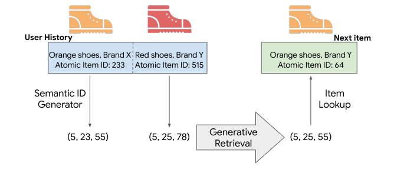
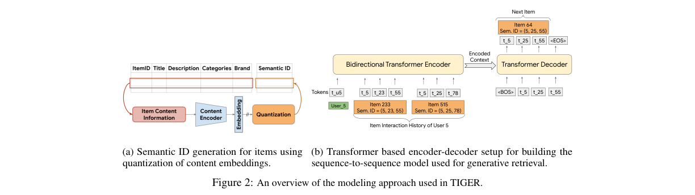
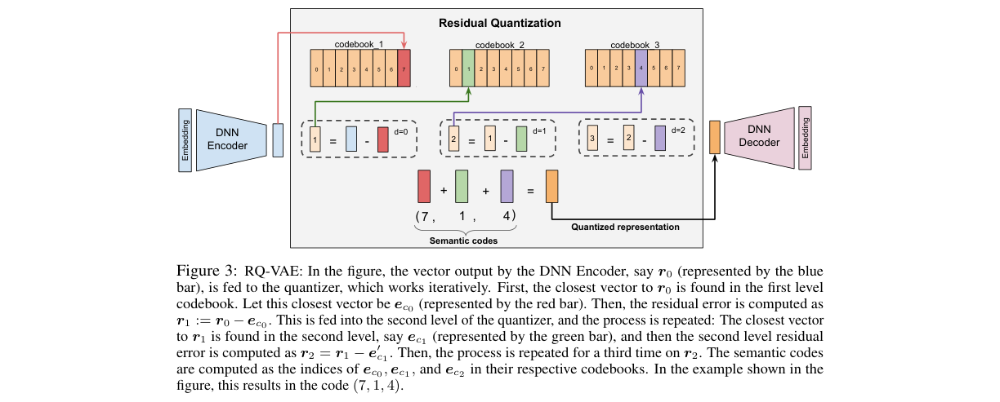
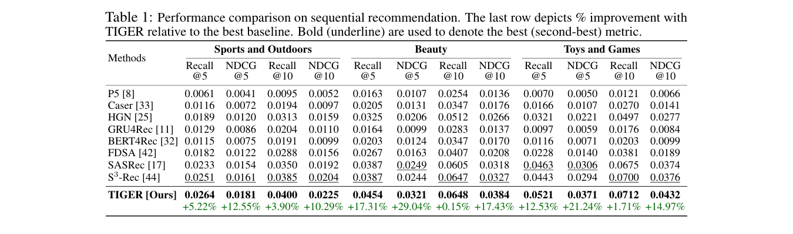
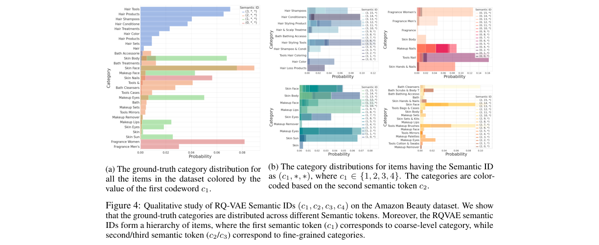
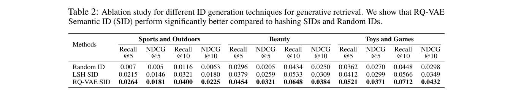
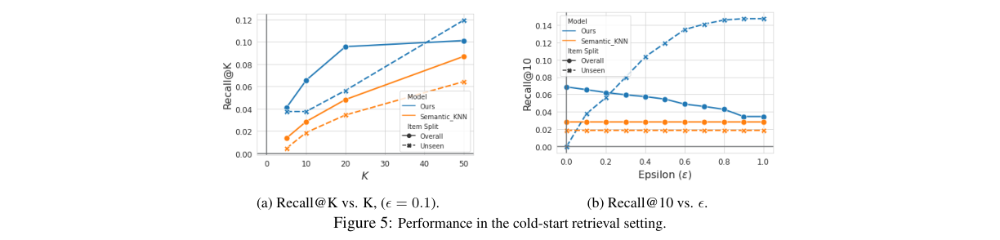

# Recommender Systems with Generative Retrieval

저자 :

Shashank Rajput, Nikhil Mehta, Anima Singh, Raghunandan Keshavan, Trung Vu, Lukasz Heldt, Lichan Hong, Yi Tay, Vinh Q. Tran, Jonah Samost, Maciej Kula, Ed H. Chi, Maheswaran Sathiamoorthy

University of Wisconsin-Madison

Google DeepMind

Google

발표 : NeurIPS 2023

논문 : [PDF](https://arxiv.org/pdf/2305.05065)

출처 : [https://arxiv.org/abs/2305.05065](https://arxiv.org/abs/2305.05065)

---

## 0. Summary

<p align='center'>

</p>

### 0.1. 문제 (Problem)

* 기존 추천 시스템은 아이템마다 임의의 정수 ID(원자 ID, Atomic ID)를 부여하고, 각 아이템에 대한 고차원 임베딩 벡터를 학습한 뒤, 최근접 이웃 탐색(ANN, Approximate Nearest Neighbor Search)으로 후보를 추출한다.
* 이 방식은 두 가지 근본적인 한계를 가진다.
  * **Cold-start 문제**: 훈련 데이터에 상호작용 이력이 없는 신규 아이템은 임베딩을 학습할 수 없어 추천 대상에서 제외된다.
  * **메모리 비효율**: 아이템 수 N에 비례하는 임베딩 테이블을 유지해야 하므로 수십억 규모의 카탈로그에서는 메모리 부담이 극심하다.
* 또한 아이템 간 의미적 유사성이 ID 표현에 반영되지 않아, 모델이 유사한 아이템 간 지식을 공유하기 어렵다.

### 0.2. 핵심 아이디어 (Core Idea)

TIGER(Transformer Index for GEnerative Recommenders)는 세 가지 핵심 요소를 결합해 기존 추천 시스템의 한계를 해결한다.

**① Semantic ID — 의미 있는 코드워드 튜플로 아이템을 표현**

아이템 하나를 임의 정수(예: 233) 대신 의미가 담긴 코드워드 튜플(예: (5, 23, 55))로 표현한 것이 Semantic ID다. 각 코드워드는 다른 수준의 의미 범주를 담당하여, 같은 카테고리의 아이템일수록 앞쪽 코드워드가 일치한다. 예를 들어 (5, 23, 55)와 (5, 23, 60)은 첫 두 자리가 같으므로 매우 유사한 아이템이고, (5, 99, 10)은 첫 자리만 같으므로 큰 카테고리만 공유한다. 마치 도서관의 듀이 십진 분류처럼, 첫 번호가 대분류(예: "Hair" 전체)를, 뒷 번호가 세분류(예: "Hair Styling Products")를 담당한다. 덕분에 신규 아이템도 콘텐츠 정보만 있으면 즉시 Semantic ID를 부여받아 추천 후보가 될 수 있다(cold-start 해결).

**② RQ-VAE — 잔차 기반 단계적 양자화로 계층적 ID 생성**

RQ-VAE(Residual-Quantized Variational AutoEncoder)는 아이템의 텍스트 임베딩을 여러 단계에 걸쳐 점진적으로 코드워드로 변환하는 학습 가능한 양자화기다. 먼저 Sentence-T5 같은 사전 훈련된 텍스트 인코더로 아이템의 제목·가격·브랜드·카테고리 등을 768차원 벡터 $x$로 변환한다. 이후 DNN 인코더가 이를 32차원 잠재 표현 $z$로 압축한다. 이 $z$를 한 번에 양자화하면 정보 손실이 크기 때문에, RQ-VAE는 잔차(residual)를 단계별로 양자화한다.

$$c_d = \arg\min_k \|r_d - e_k\|, \quad r_{d+1} := r_d - e_{c_d}$$

여기서 $r_d$는 $d$번째 단계의 잔차이고, $e_{c_d}$는 $d$번째 코드북에서 선택된 가장 가까운 벡터, $c_d$는 그 인덱스다. 잔차는 단계마다 줄어들어 처음엔 큰 의미 범주를, 나중엔 세밀한 차이를 포착한다. 마치 화가가 먼저 전체 윤곽을 잡고 점차 세부를 더해 완성하는 과정과 같다. 손실 함수는 재구성 오차와 코드북 학습을 동시에 최적화한다.

$$L = L_{recon} + L_{rqvae}, \quad L_{rqvae} = \sum_d \left(\|\mathrm{sg}[r_d] - e_{c_d}\|^2 + \beta \|r_d - \mathrm{sg}[e_{c_d}]\|^2\right)$$

여기서 $L_{recon} = \|x - \hat{x}\|^2$는 재구성 손실, $\mathrm{sg}[\cdot]$는 기울기 중단(stop-gradient) 연산, $\beta = 0.25$는 균형 계수다. 각 아이템은 3개의 RQ-VAE 레벨에서 코드워드를 얻고, 충돌(동일 Semantic ID를 가진 아이템)을 방지하기 위해 4번째 고유 토큰을 추가하여 최종 길이 4의 Semantic ID를 생성한다. 충돌이 없는 경우에도 4번째 코드워드로 0을 할당하여 일관된 길이를 유지한다.

**③ Generative Retrieval — Transformer가 ID를 토큰 단위로 직접 생성**

기존 방식은 아이템 임베딩과 사용자 쿼리 임베딩을 비교해 ANN으로 후보를 고르지만, TIGER는 Transformer 인코더-디코더 모델이 사용자 상호작용 이력의 Semantic ID 시퀀스를 입력받아 다음 아이템의 Semantic ID를 토큰 하나씩 자기회귀적(autoregressive)으로 생성한다. 추천 후보 목록을 "검색"하는 것이 아니라 LLM이 문장을 써내려가듯 답을 직접 "생성"하는 방식이다. 이로써 별도의 ANN 인덱스가 불필요하고, Transformer의 파라미터 메모리 자체가 의미 인덱스(semantic index)로 기능한다.

### 0.3. 효과 (Effects)

* **Cold-start 추천 가능**: 신규 아이템도 콘텐츠 특징만으로 RQ-VAE를 통해 Semantic ID를 생성하면 기존 모델 재훈련 없이 추천 대상에 포함된다.
* **메모리 효율**: 임베딩 테이블 크기가 아이템 수 N에서 코드북 크기(256 × 4 = 1024 임베딩)로 대폭 감소한다.
* **다양성 제어**: 디코딩 시 온도(temperature)를 조절하면 계층적 Semantic ID 구조 덕분에 추천 다양성을 직관적으로 제어할 수 있다.
* **지식 공유**: 의미적으로 유사한 아이템이 코드워드를 공유하므로, 모델이 유사 아이템 간 패턴을 자연스럽게 학습한다.

### 0.4. 결과 (Results)

* Amazon Product Reviews 3개 카테고리(Beauty, Sports and Outdoors, Toys and Games) 기준으로 SASRec, S3-Rec, BERT4Rec, FDSA 등 기존 SOTA를 모든 지표에서 일관되게 상회한다.
* Beauty 데이터셋: 2위 대비 Recall@5 +17.31%(vs S3-Rec), NDCG@5 +29%(vs SASRec).
* Toys and Games: NDCG@5 +21.2%, NDCG@10 +14.97% 향상.
* Cold-start 환경(테스트 아이템 5% 미노출)에서 Semantic_KNN 베이스라인 대비 우수한 Recall@K 달성($\epsilon \geq 0.1$ 조건).
* 온도 상승(T: 1.0 → 2.0) 시 Entropy@10이 0.76에서 1.38로 증가하여 추천 다양성이 실질적으로 향상됨을 확인.

### 0.5. 상세 동작 방식 (How It Works)

TIGER는 **오프라인 ID 생성**과 **온라인 추천 추론** 두 단계로 나뉜다.

**[오프라인] Semantic ID 생성 파이프라인**

```
아이템 메타데이터                     Semantic ID
(제목, 설명, 가격, 카테고리)
       │
       ▼
[Sentence-T5 인코더]  ──→  콘텐츠 임베딩 벡터 z  (1회 계산, 모든 아이템)
       │
       ▼
[RQ-VAE 잔차 양자화]
  Level 1: z와 가장 가까운 코드북 벡터 e_c1 선택  →  코드워드 c1
  Level 2: 잔차 (z - e_c1) 에서 e_c2 선택      →  코드워드 c2
  Level 3: 잔차 ((z - e_c1) - e_c2) 에서 e_c3 선택 → 코드워드 c3
  Level 4: 충돌 방지용 고유 토큰               →  코드워드 c4
       │
       ▼
 Semantic ID = (c1, c2, c3, c4)   ← 4개 정수 튜플, 의미 계층 내포
```

- c1은 대분류(예: 스킨케어 전체), c2는 중분류, c3는 소분류를 나타내는 계층 구조가 자연스럽게 형성된다.
- c4는 c1~c3가 충돌하는 아이템에만 부여되며, 충돌이 없어도 0을 할당해 길이를 고정한다.

**[온라인] 추천 추론 파이프라인**

```
사용자 상호작용 이력
[아이템1, 아이템2, ..., 아이템N]
       │  각 아이템을 Semantic ID로 변환
       ▼
입력 시퀀스: [c1¹,c2¹,c3¹,c4¹, c1²,..., c1ᴺ,c2ᴺ,c3ᴺ,c4ᴺ]
       │
       ▼
[T5 Seq2Seq 모델]  ── 토큰 하나씩 자기회귀(autoregressive) 생성
       │
       ▼
예측 Semantic ID: (ĉ1, ĉ2, ĉ3, ĉ4)   ← 빔 서치(Beam Search)로 상위-K 후보 생성
       │
       ▼
[아이템 조회 테이블]  →  최종 추천 아이템 리스트
```

- 훈련: 정답 아이템의 Semantic ID를 교사 강제(teacher forcing)로 학습하며, 어휘 크기는 코드북 크기(예: 256)로 고정된다.
- 추론: 빔 서치가 생성한 ID 튜플 중 실제 아이템 테이블에 없는 것(invalid ID)은 필터링하고 유효한 상위-K개를 반환한다.

**전체 데이터 흐름 요약**

```
[메타데이터] → Sentence-T5 → RQ-VAE → Semantic ID (오프라인)
                                              │
                              사용자 이력 시퀀스 구성
                                              │
                                       T5 Seq2Seq
                                              │
                                  빔 서치 → 유효 ID 필터링 → 추천 결과
```

---

## 1. Introduction

추천 시스템은 영상, 앱, 상품, 음악 등 다양한 도메인에서 사용자가 관심 있는 콘텐츠를 발견하도록 돕는 핵심 인프라다. 현대 추천 시스템은 대부분 "검색-순위 결정(retrieve-and-rank)" 전략을 따른다. 검색 단계에서 관련성 높은 후보 집합을 추출하고, 순위 결정 단계에서 정밀하게 랭킹한다. 따라서 검색 단계의 품질이 전체 성능의 상한을 결정한다.

현재 주류 검색 방식은 행렬 분해(Matrix Factorization)나 듀얼 인코더(Dual Encoder) 구조다. 듀얼 인코더는 사용자 쿼리와 아이템 후보를 각각 별도 타워(tower)로 인코딩하여 같은 임베딩 공간에 매핑한 뒤, 최근접 이웃 탐색(ANN)으로 상위 후보를 선정한다. 최근에는 GRU4Rec, BERT4Rec, SASRec 같은 순차 추천(Sequential Recommendation) 모델이 사용자-아이템 상호작용의 순서를 명시적으로 고려하며 좋은 성능을 보여왔다.

그러나 이 모든 방법은 공통적인 한계를 가진다. 첫째, 각 아이템에 임의로 부여된 원자 ID(Atomic ID)는 의미 정보를 전혀 담지 않아 유사한 아이템 간 지식 공유가 어렵다. 둘째, 훈련 중에 등장하지 않은 신규 아이템은 임베딩이 없어 추천이 불가능하다(cold-start). 셋째, 아이템 수 N에 비례하는 거대한 임베딩 테이블을 메모리에 유지해야 한다.

본 논문은 이를 해결하기 위해 TIGER(Transformer Index for GEnerative Recommenders)를 제안한다. TIGER의 핵심 아이디어는 두 가지다. (1) RQ-VAE를 이용해 아이템 콘텐츠 임베딩을 의미 있는 코드워드 튜플인 Semantic ID로 변환하고, (2) Transformer 기반 seq2seq 모델이 사용자 이력의 Semantic ID 시퀀스를 받아 다음 아이템의 Semantic ID를 직접 생성하는 생성적 검색(Generative Retrieval)을 수행한다. 이 접근법은 문서 검색 분야의 DSI(Differentiable Search Index) 패러다임을 추천 시스템에 최초로 적용한 사례이며, 아이템마다 고유한 인덱스를 유지하지 않고 Transformer의 파라미터 자체를 의미 인덱스로 활용한다.

---

## 2. Method

TIGER 프레임워크는 두 단계로 구성된다: (1) Semantic ID 생성, (2) 생성적 추천 모델 학습.

<p align='center'>

</p>

### 2.1. Semantic ID 생성

아이템의 텍스트 특징(제목, 가격, 브랜드, 카테고리)을 사전 훈련된 Sentence-T5로 인코딩하여 768차원 시맨틱 임베딩 $x$를 얻는다. 이 임베딩을 RQ-VAE로 양자화하여 Semantic ID를 생성한다.

**RQ-VAE의 잔차 양자화 과정**

<p align='center'>

</p>

RQ-VAE는 DNN 인코더($E$), 잔차 양자화기, DNN 디코더로 구성된다. 인코더는 $x$를 32차원 잠재 표현 $z = E(x)$로 압축한다. 양자화는 다음과 같이 진행된다.

초기 잔차를 $r_0 := z$로 설정한다. 각 레벨 $d$에서 코드북 $C_d = \{e_k\}_{k=1}^{K}$의 가장 가까운 벡터를 찾아 코드워드를 결정한다.

$$c_d = \arg\min_k \|r_d - e_k\|$$

이후 잔차를 업데이트한다.

$$r_{d+1} := r_d - e_{c_d}$$

이 과정을 $m$번 반복하면 길이 $m$의 Semantic ID $(c_0, c_1, \ldots, c_{m-1})$를 얻는다. 양자화된 표현 $\hat{z} = \sum_{d=0}^{m-1} e_{c_d}$를 디코더에 입력하여 $\hat{x}$를 재구성한다.

학습 손실은 재구성 손실과 코드북 학습 손실의 합이다.

$$L = \underbrace{\|x - \hat{x}\|^2}_{L_{recon}} + \underbrace{\sum_{d=0}^{m-1} \left(\|\mathrm{sg}[r_d] - e_{c_d}\|^2 + \beta\|r_d - \mathrm{sg}[e_{c_d}]\|^2\right)}_{L_{rqvae}}$$

여기서 $\mathrm{sg}[\cdot]$는 기울기 중단(stop-gradient) 연산, $\beta = 0.25$는 균형 계수다. 코드북 붕괴(codebook collapse)를 방지하기 위해 k-means 군집화로 코드북을 초기화한다.

구현에서는 3개의 RQ-VAE 레벨과 각 레벨당 256개의 코드북을 사용한다. 동일한 Semantic ID를 갖는 아이템이 생기는 충돌(collision)을 해소하기 위해, 공유된 앞 3개 코드워드에 고유 인덱스를 4번째 토큰으로 추가하여 최종 길이 4의 Semantic ID를 생성한다. 예를 들어 같은 (7, 1, 4)를 갖는 두 아이템은 (7, 1, 4, 0)과 (7, 1, 4, 1)로 구분된다. 충돌이 없는 아이템에도 4번째 코드워드로 0을 할당하여 모든 Semantic ID가 동일한 길이를 갖도록 한다.

### 2.2. 생성적 추천 모델

사용자의 아이템 상호작용 이력 $(item_1, \ldots, item_n)$을 각 아이템의 Semantic ID 토큰 시퀀스로 변환한다.

$$\text{입력}: (c_{1,0}, \ldots, c_{1,m-1}, c_{2,0}, \ldots, c_{2,m-1}, \ldots, c_{n,0}, \ldots, c_{n,m-1})$$

T5X 기반 Transformer 인코더-디코더 모델이 이 시퀀스를 입력받아 다음 아이템의 Semantic ID $(c_{n+1,0}, \ldots, c_{n+1,m-1})$를 자기회귀적으로 생성한다. 입력 시퀀스 앞에는 사용자 ID 토큰을 추가하여 개인화를 지원한다.

**모델 구성**: 인코더와 디코더 각각 4개 레이어, 6개 어텐션 헤드(차원 64), MLP 차원 1024, 입력 차원 128, 드롭아웃 0.1. 전체 파라미터 약 1,300만 개. 어휘(vocabulary)는 코드워드 1024개(256 × 4)와 사용자 ID 2000개로 구성된다.

추론 시에는 빔 서치(Beam Search)로 상위 K개의 Semantic ID를 생성하고, 룩업 테이블로 실제 아이템을 식별한다. 모델이 유효하지 않은 ID를 생성할 경우(top-10 기준 약 0.1-1.6%), 빔 크기를 늘려 걸러낸다.

---

## 3. Experiments

### 3.1. 실험 설정

**데이터셋**: Amazon Product Reviews의 3개 카테고리를 사용한다.

| 데이터셋 | 사용자 수 | 아이템 수 | 평균 시퀀스 길이 |
|---|---|---|---|
| Beauty | 22,363 | 12,101 | 8.87 |
| Sports and Outdoors | 35,598 | 18,357 | 8.32 |
| Toys and Games | 19,412 | 11,924 | 8.63 |

5개 미만 리뷰 사용자를 제외하고, leave-one-out 평가 프로토콜을 따른다(마지막 아이템 테스트, 직전 아이템 검증, 나머지 훈련).

**평가 지표**: Recall@K, NDCG@K (K = 5, 10).

**비교 모델**: GRU4Rec, Caser, HGN, SASRec, BERT4Rec, FDSA, S3-Rec, P5.

### 3.2. 순차 추천 성능

<p align='center'>

</p>

**Table 1** 기준으로 TIGER는 3개 데이터셋 모든 지표에서 기존 최고 성능 모델을 상회한다.

* Beauty: Recall@5 +17.31%(vs S3-Rec), NDCG@5 +29%(vs SASRec).
* Toys and Games: NDCG@5 +21.2%, NDCG@10 +14.97%.
* Sports and Outdoors: Recall@5 +5.22%, NDCG@5 +12.55%.

### 3.3. Semantic ID 분석

<p align='center'>

</p>

Beauty 데이터셋 정성 분석에서 RQ-VAE Semantic ID의 계층적 구조가 확인된다. 첫 번째 코드워드 $c_1$은 "Hair", "Makeup", "Skin" 같은 대분류 카테고리를 구분하고, 두 번째 $c_2$는 그 안에서 세분류를 담당한다. 이 계층성이 TIGER가 기존 시스템보다 높은 성능을 달성하는 주요 원인이다.

<p align='center'>

</p>

ID 생성 방식 비교 실험(Table 2)에서 RQ-VAE Semantic ID > LSH Semantic ID > Random ID 순의 성능이 일관되게 확인된다. 임의 할당 Random ID는 의미 정보를 전혀 포함하지 않아 성능이 가장 낮고, RQ-VAE가 비선형 DNN 아키텍처를 통해 LSH 대비 더 나은 양자화를 달성한다.

### 3.4. 새로운 능력 (New Capabilities)

**Cold-start 추천**

<p align='center'>

</p>

테스트 아이템의 5%를 훈련 데이터에서 제외하여 신규 아이템 상황을 시뮬레이션한다. TIGER는 신규 아이템에 대해 RQ-VAE로 생성된 Semantic ID를 활용하여 KNN 기반 베이스라인(Semantic_KNN)을 $\epsilon \geq 0.1$인 모든 조건에서 상회한다. 신규 아이템은 앞 3개의 코드워드가 일치하는 경우에 후보로 포함된다.

**추천 다양성 제어**

온도 파라미터 $T$를 높이면 디코딩 분포가 평탄해져 다양한 카테고리의 아이템이 추천된다. Entropy@10은 $T=1.0$에서 0.76, $T=2.0$에서 1.38로 증가한다. 계층적 Semantic ID 덕분에 첫 번째 토큰에서 온도를 높이면 대분류 다양성을, 뒷 토큰에서 높이면 세분류 다양성을 조절할 수 있다.

### 3.5. 어블레이션 연구

레이어 수(3~5개)를 변경해도 성능 변동이 미미하여 모델이 레이어 수에 robust하다. 사용자 ID 토큰을 추가하면 Recall@5 기준 약 +0.9% 향상이 확인된다(Table 8: No user id 0.04458 → With user id 0.04540).

---

## 4. Conclusion

TIGER는 추천 시스템에 생성적 검색 패러다임을 최초로 적용한 프레임워크다. RQ-VAE 기반 Semantic ID를 통해 아이템을 의미 있는 계층적 코드워드 튜플로 표현하고, Transformer seq2seq 모델이 이를 자기회귀적으로 생성함으로써 별도 ANN 인덱스 없이 추천을 수행한다. 세 가지 Amazon 데이터셋에서 기존 SOTA 대비 최대 29% NDCG 향상을 달성했으며, cold-start 추천과 다양성 제어라는 새로운 능력도 실증했다.

한 가지 주목할 점은 추론 시 빔 서치 기반 자기회귀 디코딩이 ANN 기반 모델보다 계산 비용이 높다는 것이다. 논문은 이를 한계로 인정하며, 추론 효율화를 향후 과제로 제시한다. 그럼에도 임베딩 테이블 크기가 아이템 수 N에서 코드북 크기(1024)로 줄어드는 메모리 효율 측면의 이점은 대규모 시스템에서 실질적인 가치가 있다.

**Summary 작성 소감**: TIGER는 LLM의 생성적 특성을 추천 시스템의 검색 단계에 접목한 참신한 시도다. Semantic ID의 계층적 구조가 cold-start와 다양성이라는 실용적 문제를 동시에 해결하는 방식이 특히 인상적이며, 향후 대규모 산업 추천 시스템에서 임베딩 테이블 압축과 신규 아이템 대응 문제를 함께 해결하는 방향으로 발전할 가능성이 높다.

---

## 부록: 사전 지식 (Prerequisites)

### A.1. 알아야 할 핵심 개념

- **순차 추천 / Next-Item Prediction (Sequential Recommendation)** — 사용자의 과거 아이템 상호작용 이력을 시퀀스로 보고, 다음에 상호작용할 아이템을 예측하는 태스크.
  - 본문 위치: §1 Introduction, §3 Experiments — TIGER가 풀고자 하는 핵심 문제이며, SASRec·BERT4Rec 등이 이 태스크의 SOTA 베이스라인으로 등장.

- **Two-Tower (Dual Encoder) 구조 / 양탑 구조** — 쿼리(사용자)와 후보(아이템)를 각각 독립된 인코더로 임베딩한 뒤 내적(inner product)으로 유사도를 계산하는 검색 구조. 검색 시에는 ANN(Approximate Nearest Neighbor) 인덱스를 활용.
  - 본문 위치: §1 Introduction — TIGER가 대체하고자 하는 기존 패러다임.

- **ANN 검색 (Approximate Nearest Neighbor Search)** — 수십억 개 아이템 임베딩 중에서 주어진 쿼리 벡터와 가장 유사한 후보를 근사적·효율적으로 탐색하는 기법. FAISS, ScaNN 등이 대표 구현체.
  - 본문 위치: §1 Introduction — 기존 시스템의 검색 단계; TIGER는 이 인덱스 자체를 Transformer 파라미터로 대체.

- **VQ-VAE (Vector Quantized Variational AutoEncoder)** — 연속 잠재 표현을 유한한 코드북(codebook) 벡터로 이산 양자화하여 학습하는 생성 모델. Stop-gradient 트릭과 commitment loss로 코드북을 학습.
  - 본문 위치: §2.1 — RQ-VAE의 직접 선조. 코드북, stop-gradient ($\mathrm{sg}[\cdot]$), 코드북 붕괴(codebook collapse) 개념 모두 여기서 도입됨.

- **RQ (Residual Quantization) / 잔차 양자화** — 단일 코드북으로 양자화한 뒤 남은 잔차를 다음 코드북으로 반복 양자화하여 표현 오차를 단계적으로 줄이는 기법. SoundStream·Jukebox 등 오디오 코덱에서 활용됨.
  - 본문 위치: §2.1 — RQ-VAE의 핵심 메커니즘. $c_d = \arg\min_k\|r_d - e_k\|$, $r_{d+1} := r_d - e_{c_d}$ 식이 이 개념의 직접 구현.

- **코드북 붕괴 (Codebook Collapse)** — 양자화 학습 중 전체 코드북의 일부 엔트리만 사용되고 나머지는 사용되지 않는 불안정 현상. K-means 초기화나 EMA 업데이트로 완화.
  - 본문 위치: §2.1 — "코드북 붕괴 방지를 위해 k-means 군집화로 코드북 초기화"라고 명시.

- **DSI (Differentiable Search Index) / 생성적 검색 패러다임** — 문서 검색에서 외부 인덱스 없이 Transformer 하나가 쿼리를 받아 관련 문서 ID를 직접 자기회귀적으로 생성하는 패러다임. 이 논문의 직접적 지적 선조.
  - 본문 위치: §1 Introduction — "본 논문은 문서 검색 분야의 DSI 패러다임을 추천 시스템에 최초로 적용"이라고 명시.

- **T5 / Seq2Seq Transformer** — "Text-to-Text Transfer Transformer". 인코더-디코더 구조의 범용 seq2seq 사전훈련 모델. 입력 시퀀스 전체를 보는 인코더와 자기회귀 디코더로 구성.
  - 본문 위치: §2.2 — TIGER의 생성적 추천 모델 백본으로 T5X 기반 아키텍처 사용.

- **Sentence-T5 / 텍스트 임베딩 모델** — T5를 기반으로 문장·문서 수준의 밀집 벡터(dense embedding)를 생성하도록 파인튜닝한 모델.
  - 본문 위치: §2.1 — 아이템의 제목·브랜드·카테고리 텍스트를 768차원 벡터 $x$로 변환하는 데 사용.

- **빔 서치 (Beam Search)** — 자기회귀 디코딩 시 각 스텝에서 상위 K개 가설을 유지하며 최종 시퀀스를 탐색하는 기법. 추천 상위 K개 후보를 동시에 생성하는 데 활용.
  - 본문 위치: §2.2 — "빔 서치로 상위 K개의 Semantic ID를 생성"하여 실제 아이템을 조회.

---

### A.2. 먼저 읽으면 좋은 논문

1. **[2022][DSI] Transformer Memory as a Differentiable Search Index** ([arxiv:2202.06991](https://arxiv.org/abs/2202.06991))
   - 한 줄 설명: 문서 검색을 생성 문제로 재정의하여 Transformer 하나가 docid를 직접 생성하게 하는 패러다임을 제시.
   - **왜?** TIGER가 §1에서 명시적으로 "DSI 패러다임의 추천 적용"이라 밝힌 직접적 지적 선조. 이 논문을 모르면 TIGER의 novelty를 이해하기 어렵다.

2. **[2017][VQ-VAE] Neural Discrete Representation Learning** ([arxiv:1711.00937](https://arxiv.org/abs/1711.00937))
   - 한 줄 설명: 연속 잠재 표현을 이산 코드북 벡터로 양자화하는 VQ-VAE를 제안. Stop-gradient, commitment loss 등 코드북 학습의 핵심 기법 도입.
   - **왜?** RQ-VAE의 직접 선조. VQ-VAE를 모르면 §2.1의 손실 함수($L_{rqvae}$)와 stop-gradient 트릭이 이해되지 않는다.

3. **[2021][SoundStream] SoundStream: An End-to-End Neural Audio Codec** ([arxiv:2107.03312](https://arxiv.org/abs/2107.03312))
   - 한 줄 설명: 오디오 코덱에 잔차 양자화(RQ)를 도입하여 계층적이고 효율적인 오디오 표현을 학습.
   - **왜?** TIGER의 RQ-VAE가 사용하는 잔차 양자화 알고리즘($r_{d+1} := r_d - e_{c_d}$)의 원형. 왜 "잔차" 방식이 단순 VQ보다 우월한지 이해하는 데 필수.

4. **[2018][SASRec] Self-Attentive Sequential Recommendation** ([arxiv:1808.09781](https://arxiv.org/abs/1808.09781))
   - 한 줄 설명: Transformer 어텐션 메커니즘을 순차 추천에 적용하여 사용자 이력 시퀀스에서 관련 아이템을 선택적으로 참조.
   - **왜?** TIGER의 1차 비교 베이스라인. Beauty 데이터셋 NDCG@5 기준 SASRec 대비 +29% 개선을 주장하므로, SASRec의 구조를 알아야 그 차이를 이해할 수 있다.

5. **[2019][BERT4Rec] BERT4Rec: Sequential Recommendation with Bidirectional Encoder Representations from Transformer** ([arxiv:1904.06690](https://arxiv.org/abs/1904.06690))
   - 한 줄 설명: BERT의 양방향 어텐션과 Cloze 태스크 마스킹을 순차 추천에 적용.
   - **왜?** SASRec와 함께 TIGER의 핵심 비교 베이스라인. 단방향(SASRec) vs 양방향(BERT4Rec) 구조의 차이를 이해하면 TIGER가 seq2seq를 선택한 이유가 더 명확해진다.

6. **[2020][T5] Exploring the Limits of Transfer Learning with a Unified Text-to-Text Transformer** ([arxiv:1910.10683](https://arxiv.org/abs/1910.10683))
   - 한 줄 설명: 모든 NLP 태스크를 텍스트-to-텍스트 문제로 통일하는 T5 모델 제안.
   - **왜?** TIGER의 생성 모델 백본(T5X)의 아키텍처 기반. 인코더-디코더 구조, 상대 위치 임베딩, 어텐션 메커니즘을 이해하려면 참고 필요.

---

### A.3. 관련/후속 논문

- **[2023][LC-Rec] Adapting Large Language Models by Integrating Collaborative Semantics for Recommendation** ([arxiv:2311.09049](https://arxiv.org/abs/2311.09049)) — LLM에 협업 필터링 시맨틱을 결합한 양자화 기반 아이템 인덱싱. TIGER와 달리 충돌 없는 균일한 시맨틱 매핑을 학습.

- **[2025][OneRec] OneRec: Unifying Retrieve and Rank with Generative Recommender and Iterative Preference Alignment** ([arxiv:2502.18965](https://arxiv.org/abs/2502.18965)) — Kuaishou(쾌수)가 4억 DAU 플랫폼에 배포한 산업 규모 생성적 추천 시스템. MoE 기반 인코더-디코더로 세션 단위 리스트를 생성하며, TIGER 패러다임의 산업 확장 사례.

- **[2026][DSID] Differentiable Semantic ID for Generative Recommendation** ([arxiv:2601.19711](https://arxiv.org/abs/2601.19711)) — Semantic ID 생성 과정을 미분 가능하게 만들어 추천 목적함수와 end-to-end 학습을 가능케 한 후속 연구.

- **Repo 내 관련 정리**:
  - DLRM (2019): [[논문][2019][Summary][DLRM] Deep Learning Recommendation Model for Personalization and Recommendation Systems.md]([논문][2019][Summary][DLRM]%20Deep%20Learning%20Recommendation%20Model%20for%20Personalization%20and%20Recommendation%20Systems.md) — Two-tower 이전 세대의 임베딩 기반 추천 구조 참고.
  - PinnerFormer (2022): [[논문][2022][Summary][PinnerFormer] PinnerFormer - Sequence Modeling for User Representation at Pinterest.md]([논문][2022][Summary][PinnerFormer]%20PinnerFormer%20-%20Sequence%20Modeling%20for%20User%20Representation%20at%20Pinterest.md) — 순차 사용자 표현 학습의 산업 적용 사례.
