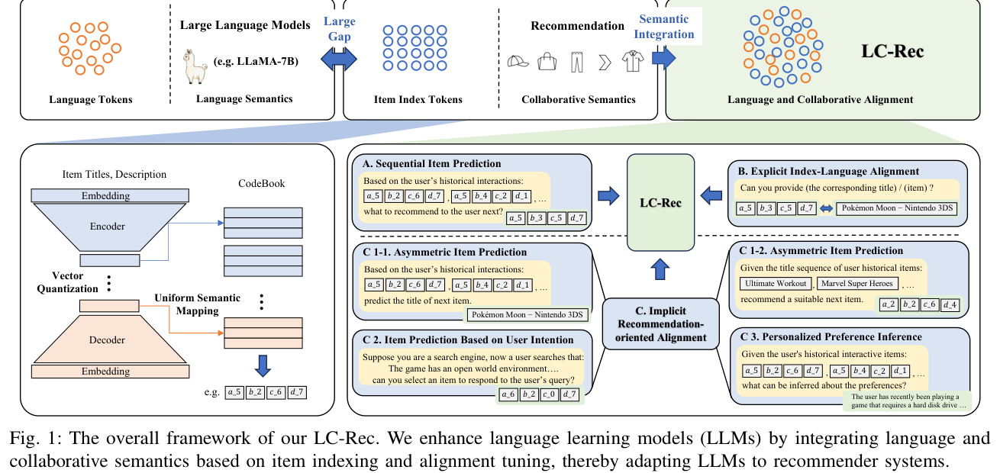
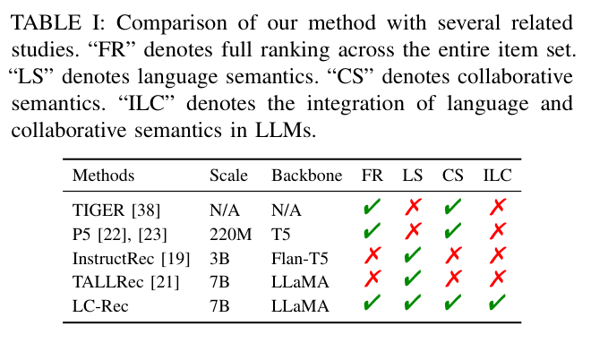
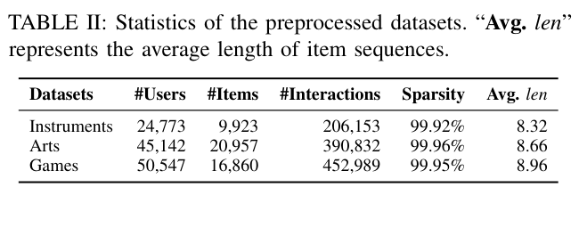
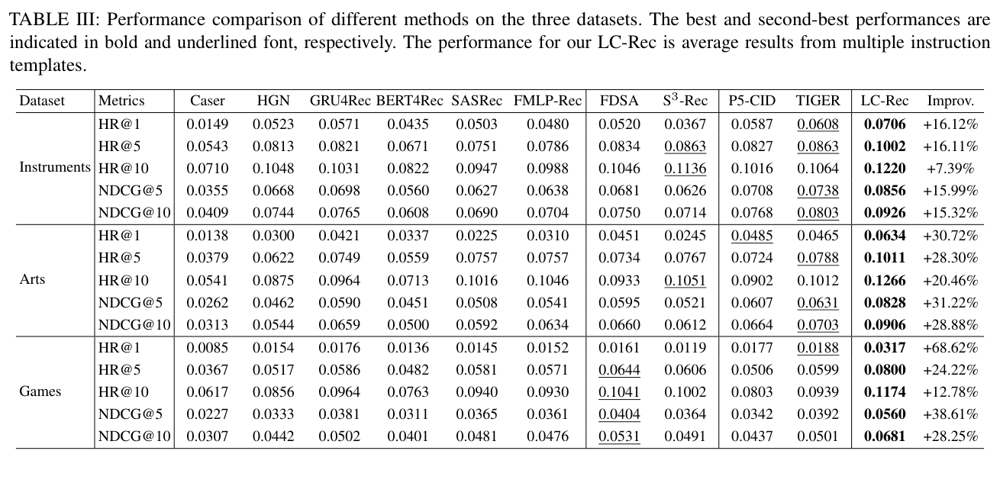

# Adapting Large Language Models by Integrating Collaborative Semantics for Recommendation

저자: Bowen Zheng, Yupeng Hou, Hongyu Lu, Yu Chen, Wayne Xin Zhao, Ming Chen, Ji-Rong Wen

소속: RUCAIBox, 중국인민대학교

발표: ICDE 2024 (IEEE 40th International Conference on Data Engineering)

논문: [PDF](https://arxiv.org/pdf/2311.09049)

출처: [https://arxiv.org/abs/2311.09049](https://arxiv.org/abs/2311.09049) | [GitHub](https://github.com/RUCAIBox/LC-Rec)

---

## 0. Summary

<p align='center'>

</p>

### 0.1. 문제 (Problem)

LLM 기반 추천 시스템은 크게 두 가지 흐름으로 나뉜다.

* **텍스트 기반 접근** (P5, VQ-Rec 등): 아이템을 자연어 제목·설명으로 표현 → 언어 의미론은 풍부하나 **협업 신호(Collaborative Signal)가 전혀 없음**. 누가 어떤 아이템을 함께 구매하는지, 비슷한 취향의 사용자가 어떤 아이템을 좋아하는지 등 상호작용 패턴이 LLM에 전달되지 않는다.
* **임의 ID 기반 접근** (BIGRec 등): 아이템마다 정수 ID를 부여 → LLM 어휘 밖의 토큰이므로 **의미론적 연결 없음**. LLM이 "아이템 3849"라는 토큰이 "스포츠 용품"이라는 사실을 알 길이 없다.

결국 두 접근 모두 **언어 의미론 ↔ 협업 의미론** 사이의 간극을 해소하지 못한다.

### 0.2. 핵심 아이디어 (Core Idea)

**LC-Rec** (Language and Collaborative Recommendation)은 두 단계로 이 간극을 메운다.

**① 협업 ID 인덱싱 (Collaborative Item Indexing)**

**SASRec (Self-Attentive Sequential Recommendation)**이란 사용자의 과거 상호작용 아이템 시퀀스를 Transformer의 Self-Attention으로 처리하여 "다음에 클릭할 아이템"을 예측하는 순차 추천 모델이다. 단방향(causal) 어텐션으로 각 위치에서 이전 아이템들만 참조하며, 전체 시퀀스가 아닌 최근 상호작용에 선택적으로 집중한다. 핵심은 개별 사용자 임베딩 없이도 아이템 시퀀스만으로 사용자 취향을 포착한다는 점이다. LC-Rec에서는 이 SASRec 학습 과정의 부산물로 생성되는 **아이템 임베딩 $h_i$** — "함께 클릭된 패턴"과 "유사 취향 사용자 클러스터"가 압축된 벡터 — 를 협업 신호의 원천으로 사용한다.

**Self-Attention의 입력과 전체 상품 비교 시점**

Self-Attention의 입력은 **history 내 아이템들**이다. 전체 상품 카탈로그는 이 단계에 개입하지 않는다. 동작은 두 단계로 분리된다.

**[Step 1] Self-Attention — history 내부에서만 작동**

사용자 history가 `[무선이어폰 → 스마트폰 케이스 → 보조배터리]`라면, 각 아이템의 임베딩 벡터를 입력으로 Self-Attention이 수행된다:

```
입력 시퀀스 (아이템 임베딩 3개):
  e1 = 무선이어폰의 임베딩
  e2 = 스마트폰 케이스의 임베딩
  e3 = 보조배터리의 임베딩

Self-Attention (causal mask):
  e1 → e1만 참조          → h1 (문맥화된 표현)
  e2 → e1, e2 참조        → h2
  e3 → e1, e2, e3 참조   → h3  ← 마지막 위치의 출력

# "보조배터리를 구매한 시점에서, 이전 이어폰·케이스 구매 맥락을
#  반영한 h3가 '이 사용자가 다음에 원하는 것'의 표현이 된다"
```

Self-Attention은 Q, K, V 모두 이 history 시퀀스에서만 나온다. 카탈로그 전체 상품은 이 단계에서 보이지 않는다.

**[Step 2] 전체 상품 비교 — Attention 이후 별도 스코어링**

마지막 위치의 출력 $h_3$를 카탈로그의 **모든 아이템 임베딩**과 내적(dot product)하여 점수를 계산한다:

```
score(아이템 j) = h3 · e_j    (j = 전체 카탈로그의 모든 아이템)

예시:
  score(USB-C 케이블)   = h3 · e_{USB} = 0.92  ← 높음
  score(립스틱)         = h3 · e_{립}  = 0.11  ← 낮음
  score(충전독)         = h3 · e_{독}  = 0.87  ← 높음
  ...

→ 상위 K개 아이템 반환: [USB-C 케이블, 충전독, ...]
```

즉, **Self-Attention은 history 안에서 문맥을 파악**하는 단계이고, **전체 상품 비교는 그 결과물 $h_n$을 쿼리로 사용하는 별도 검색 단계**다. 학습 시에는 이 내적 점수로 다음 아이템을 맞추는 Cross-Entropy Loss를 역전파한다. LC-Rec에 쓰이는 아이템 임베딩 $h_i$는 각 아이템이 이 Step 2의 $e_j$ 역할을 할 때 사용하는 임베딩 테이블의 벡터다.

SASRec 같은 협업 필터링 모델로 아이템의 협업 임베딩 $h_i$를 학습한 뒤, 이를 **학습 기반 벡터 양자화(VQ)**로 이산 코드워드 시퀀스 $(c_i^{(1)}, c_i^{(2)}, \ldots)$로 변환한다. 핵심은 **균일 의미 매핑(Uniform Semantic Mapping)**: 모든 코드워드가 고르게 사용되도록 강제하여 코드북 붕괴(codebook collapse) 없이 충돌 없는 아이템 ID 포트폴리오를 확보한다. 이 코드워드들을 LLaMA-7B의 특수 토큰으로 추가하면 LLM이 협업 패턴을 직접 처리할 수 있게 된다.

**② 정렬 튜닝 (Alignment Tuning)**

LLM이 협업 ID의 의미를 언어 수준에서 이해하도록 6가지 전용 지시 튜닝 태스크를 설계:

| 태스크 | 입력 | 출력 | 목적 |
|---|---|---|---|
| `seqrec` | 사용자 이력 (협업 ID 시퀀스) | 다음 아이템 협업 ID | 기본 추천 |
| `item2index` | 아이템 텍스트 설명 | 협업 ID | 텍스트→ID 정렬 |
| `index2item` | 협업 ID | 아이템 텍스트 설명 | ID→텍스트 정렬 |
| `fusionseqrec` | 이력 + 아이템 텍스트 혼합 | 협업 ID | 언어+협업 융합 |
| `itemsearch` | 사용자 선호 쿼리 | 협업 ID 목록 | 선호 기반 검색 |
| `preferenceobtain` | 사용자 이력 | 선호 텍스트 요약 | 사용자 선호 추출 |

### 0.3. 효과 (Effects)

* **언어-협업 의미론 통합**: LLM이 협업 ID를 자신의 어휘로 처리 → 언어 이해력과 협업 패턴을 동시에 활용
* **코드북 충돌 방지**: 균일 의미 매핑으로 서로 다른 아이템에 동일 ID가 부여되는 문제 해소
* **양방향 정렬**: `item2index` + `index2item` 태스크로 ID↔텍스트 양방향 매핑 강화

### 0.4. 결과 (Results)

Amazon 페버리원 3개 데이터셋(Instruments, Arts, Games)에서 전통 협업 필터링(BPR-MF, SASRec, BERT4Rec), LLM 기반(P5, PALR, LLaRA, BIGRec), 혼합 방식(VQ-Rec, VIP5) 대비 **모든 지표에서 SOTA** 달성.

특히 임의 정수 ID를 쓰는 BIGRec 대비 일관된 우위 → 협업 의미론을 ID에 인코딩하는 것의 효과 실증.

### 0.5. 상세 동작 방식 (How It Works)

**[오프라인] 협업 ID 생성 파이프라인**

```
사용자-아이템 상호작용 데이터
        │
        ▼
[SASRec — Transformer Self-Attention 순차 추천 모델]
  - 아이템 시퀀스를 단방향(causal) Self-Attention으로 처리
  - 각 위치에서 이전 아이템들만 참조하여 "다음 아이템" 예측
  - 학습 후 아이템 임베딩 테이블 h_i (협업 신호가 압축된 벡터) 추출
        │  → 아이템별 협업 임베딩 h_i ∈ R^d
        ▼
[학습 기반 벡터 양자화 (VQ)]
  - 균일 의미 매핑으로 모든 코드워드 균등 사용 보장
  - 코드북 붕괴 방지 (k-means 초기화 + 균일 제약)
  - 다단계 계층 코드워드: (c_i^(1), c_i^(2), ...) 
        │
        ▼
협업 ID = [COL_c1][COL_c2]...   ← LLaMA 특수 토큰으로 추가
```

> **6가지 튜닝 = 하나의 모델**: 6개의 태스크를 별도 모델로 각각 학습하는 것이 아니다. LLaMA-7B 단일 모델에 6종의 지시문(instruction) 형식 데이터를 **동시에 섞어서** 파인튜닝한다. 모델은 지시문의 패턴을 보고 어떤 태스크인지 구분하여 대응한다. 결과물은 6가지 능력을 모두 갖춘 **하나의 LLaMA-7B** 체크포인트다.

**[온라인] 추천 추론 파이프라인**

```
사용자 상호작용 이력
[아이템1 협업ID, 아이템2 협업ID, ..., 아이템N 협업ID]
        │
        ▼
[LLaMA-7B (단일 모델, 6가지 태스크 동시 학습 완료)]
  - seqrec 지시문 형식으로 입력 구성
  - Beam Search로 다음 아이템의 협업 ID 토큰 자기회귀 생성
        │
        ▼
생성된 협업 ID = [COL_8][COL_31]...
        │
        ▼ 아이템 조회 (오프라인에 미리 구축한 역색인)
  - 오프라인 단계에서 모든 아이템의 협업 ID → 아이템 매핑 테이블 구축
  - 생성된 ID를 해시맵에서 O(1) 조회
  - 유효하지 않은 ID(카탈로그에 없는 조합)는 Beam Search 단계에서
    Constrained Decoding으로 사전 차단 (Trie 구조로 유효 ID만 탐색)
        │
        ▼
최종 추천 아이템 반환
```

---

## 1. Introduction

추천 시스템은 LLM의 등장으로 새로운 전환점을 맞이했다. GPT, LLaMA 같은 대규모 언어 모델은 방대한 텍스트에서 학습한 세계 지식과 언어 이해 능력을 보유하며, 이를 추천에 활용하려는 시도가 이어지고 있다.

**기존 LLM 추천의 두 갈래**

첫 번째 갈래는 아이템을 자연어로 표현하는 방식이다. P5는 모든 추천 태스크를 텍스트-to-텍스트 문제로 변환하여 LLM을 파인튜닝한다. VQ-Rec은 아이템 텍스트 임베딩을 이산 코드로 양자화하여 사용한다. 이 방식들은 LLM의 언어 이해력을 잘 활용하지만, **수백만 사용자-아이템 상호작용에서 추출되는 협업 신호를 전혀 활용하지 못한다**. "이 제품을 산 사람들이 저 제품도 샀다"는 패턴은 텍스트에 담기지 않는다.

두 번째 갈래는 아이템에 임의 정수 ID를 부여하는 방식이다. BIGRec은 LLM에 아이템 ID를 직접 예측하게 한다. 그러나 이 정수들은 LLM의 사전 학습 어휘에 포함되지 않으므로, 모델이 이 토큰들에서 의미 있는 패턴을 학습하기 어렵다.

**LC-Rec의 핵심 통찰**: 협업 필터링에서 학습된 아이템 임베딩을 **LLM이 처리할 수 있는 이산 토큰으로 변환**하면, 두 접근의 장점을 동시에 가질 수 있다. 협업 신호를 담은 코드워드를 LLM 어휘에 추가하고, 이 코드워드의 의미를 LLM이 이해하도록 정렬 튜닝을 수행하는 것이 LC-Rec의 전략이다.

<p align='center'>

</p>

---

## 2. Method

### 2.1. 협업 ID 인덱싱

**Step 1: 협업 임베딩 학습**

SASRec (또는 유사한 순차 추천 모델)을 사용자-아이템 상호작용 데이터로 학습하여 각 아이템의 협업 임베딩 $h_i \in \mathbb{R}^d$를 얻는다. 이 임베딩에는 "함께 구매된 패턴", "유사 취향 사용자 클러스터" 등의 협업 신호가 압축되어 있다.

**Step 2: 균일 의미 매핑을 통한 벡터 양자화**

일반 VQ는 일부 코드워드만 집중적으로 사용되는 코드북 붕괴(codebook collapse) 문제가 있다. LC-Rec은 이를 **균일 의미 매핑**으로 해결한다:

$$c_i = \arg\min_{k \in [K]} \| h_i - e_k \|^2 \quad \text{s.t.} \quad \left|\{i : c_i = k\}\right| \approx N/K$$

각 코드워드가 전체 아이템의 $1/K$ 개씩 담당하도록 강제한다. 이는 온라인 k-means 형태의 균형 클러스터링으로 구현된다.

다단계 잔차 양자화를 통해 계층적 협업 ID를 생성:
- 1단계: $h_i$를 첫 번째 코드북으로 양자화 → $c_i^{(1)}$
- 2단계: 잔차 $h_i - e_{c_i^{(1)}}$를 두 번째 코드북으로 양자화 → $c_i^{(2)}$
- 이를 $L$단계 반복 → 최종 협업 ID = $(c_i^{(1)}, c_i^{(2)}, \ldots, c_i^{(L)})$

**Step 3: LLM 어휘 확장**

생성된 코드워드들을 `[COL_0]`, `[COL_1]`, ..., `[COL_K-1]` 형태의 특수 토큰으로 LLaMA-7B의 어휘에 추가하고, 임베딩 레이어를 그에 맞게 확장한다.

### 2.2. 정렬 튜닝

6가지 지시 튜닝 태스크를 Instruction-following 형식으로 동시에 학습한다:

**기본 추천 태스크 (`seqrec`)**
```
입력: "사용자가 [COL_5][COL_23], [COL_12][COL_7], ... 을 순서대로 구매했습니다. 
       다음에 구매할 아이템을 추천해주세요."
출력: "[COL_8][COL_31]"
```

**양방향 매핑 태스크**
- `item2index`: "'{아이템 제목}'의 협업 ID는?" → `[COL_5][COL_23]`
- `index2item`: "`[COL_5][COL_23]`는 어떤 아이템?" → `'{아이템 제목}'`

**융합 태스크 (`fusionseqrec`)**
협업 ID와 아이템 텍스트를 함께 제공 → 두 정보를 통합하여 추천

**검색 및 선호 추출 태스크**
- `itemsearch`: 사용자 선호 텍스트 → 관련 아이템 협업 ID 목록
- `preferenceobtain`: 이력 → 사용자 선호 텍스트 요약

**학습 목적 함수:**
$$\mathcal{L} = -\sum_{\tau \in \mathcal{T}} \sum_{t} \log P(y_t \mid x_\tau, y_{<t}; \theta)$$

모든 태스크 $\tau$에 대해 교차 엔트로피 손실로 동시 학습한다.

### 2.3. 학습 설정

* **백본**: LLaMA-7B
* **GPU**: 8×GPU 분산 학습 (DeepSpeed ZeRO)
* **정밀도**: bfloat16
* **에폭**: 4
* **학습률**: 5e-5
* **배치 크기**: 디바이스당 8, 기울기 누적으로 유효 배치 확대
* **모델 공유**: Hugging Face에 델타 가중치 공개

---

## 3. Experiments

### 3.1. 실험 설정

**데이터셋**: Amazon 페버리원 3개 카테고리

<p align='center'>

</p>

| 데이터셋 | 도메인 | 아이템 수 | 상호작용 수 |
|---|---|---|---|
| Instruments | 악기/음악 장비 | ~10K | ~100K |
| Arts | 예술 용품 | ~8K | ~90K |
| Games | 비디오게임 | ~17K | ~200K |

**평가**: Leave-one-out, HR@K, NDCG@K (K=5, 10, 20)

**비교 베이스라인**

| 종류 | 방법 |
|---|---|
| 전통 협업 필터링 | BPR-MF, SASRec, BERT4Rec |
| LLM 기반 (텍스트) | P5, PALR, LLaRA |
| LLM 기반 (ID) | BIGRec |
| 혼합 방식 | VQ-Rec, VIP5 |

### 3.2. 주요 결과

<p align='center'>

</p>

* LC-Rec이 3개 데이터셋 모든 지표에서 SOTA 달성
* BIGRec (임의 정수 ID) 대비 일관된 우위 → **협업 신호를 담은 ID의 효과** 실증
* SASRec 대비에서도 우위 → LLM의 언어 이해력이 추가적 가치를 제공함을 확인

### 3.3. Ablation: 핵심 컴포넌트 기여도

| 설정 | 성능 | 해석 |
|---|---|---|
| 전체 LC-Rec | 최고 | 기준 |
| 협업 ID 제거 (임의 정수 ID) | 하락 | 협업 신호 직접 활용의 효과 |
| Uniform Mapping 제거 | 하락 | 코드북 다양성의 중요성 |
| `item2index` 태스크 제거 | 하락 | 텍스트→ID 정렬의 중요성 |
| `index2item` 태스크 제거 | 하락 | 양방향 매핑의 중요성 |
| `fusionseqrec` 제거 | 하락 | 언어+협업 융합의 중요성 |

### 3.4. Uniform Semantic Mapping 효과

일반 VQ vs. 균일 의미 매핑 비교:
* 일반 VQ: 일부 코드워드에 아이템이 편중 → 충돌 발생, ID 다양성 저하
* 균일 매핑: 모든 코드워드가 고르게 사용 → 충돌 최소화, 성능 향상

---

## 4. Conclusion

LC-Rec은 LLM 기반 추천에서 언어 의미론과 협업 의미론의 통합이라는 핵심 문제를 체계적으로 해결한 연구다.

**핵심 기여**:
1. 협업 임베딩을 균일 VQ로 LLM 어휘 토큰화 → 두 의미론의 다리 역할
2. 6가지 정렬 태스크로 LLM이 협업 ID의 의미를 언어 수준에서 내면화
3. Amazon 3개 데이터셋에서 SOTA 달성

**한계 및 향후 방향**:
* 협업 임베딩과 정렬 튜닝이 분리된 2단계 학습 → end-to-end 통합 가능성
* LLaMA-7B 기반으로 더 큰 모델(70B 등)에서의 확장성 미확인
* 실시간 서빙 시 LLM 자기회귀 생성의 지연 문제 (NEZHA 등 후속 연구에서 해결 시도)

---

## 부록: 사전 지식 (Prerequisites)

### A.1. 알아야 할 핵심 개념

- **협업 필터링 (Collaborative Filtering)** — 사용자-아이템 상호작용 행렬에서 패턴을 학습하여 유사 취향 사용자를 찾거나 함께 소비되는 아이템을 발견하는 기법. MF, LightGCN, SASRec이 대표 구현체.
  - 본문 위치: §1 Introduction, §2.1 — LC-Rec의 협업 임베딩 학습에 SASRec을 사용.

- **벡터 양자화 (Vector Quantization, VQ)** — 연속 벡터를 유한한 코드북(codebook)의 가장 가까운 벡터로 매핑하는 이산화 기법. VQ-VAE에서 체계화됨.
  - 본문 위치: §2.1 — 협업 임베딩을 이산 협업 ID로 변환하는 핵심 기법.

- **코드북 붕괴 (Codebook Collapse)** — VQ 학습 시 전체 코드북 중 일부 엔트리만 사용되고 나머지는 사라지는 불안정 현상. 아이템이 소수 코드워드에 쏠려 ID 충돌 발생.
  - 본문 위치: §2.1 — 균일 의미 매핑으로 해결.

- **지시 튜닝 (Instruction Tuning)** — LLM을 다양한 태스크의 지시-응답 쌍으로 파인튜닝하여 범용 태스크 수행 능력을 부여하는 학습 방법.
  - 본문 위치: §2.2 — LC-Rec의 6가지 정렬 태스크 모두 지시 튜닝 형식으로 학습.

- **LLaMA** — Meta AI가 공개한 오픈소스 대규모 언어 모델 시리즈. 7B~70B 파라미터 규모.
  - 본문 위치: §2 — LC-Rec의 백본 모델.

- **DeepSpeed ZeRO** — 대규모 모델의 분산 학습을 위한 메모리 최적화 프레임워크. 모델 파라미터, 기울기, 옵티마이저 상태를 여러 GPU에 분산.
  - 본문 위치: §2.3 — 8-GPU 학습에 사용.

### A.2. 먼저 읽으면 좋은 논문

1. **[2018][SASRec] Self-Attentive Sequential Recommendation** ([arxiv:1808.09781](https://arxiv.org/abs/1808.09781))
   - LC-Rec이 협업 임베딩 학습에 사용하는 순차 추천 모델.

2. **[2017][VQ-VAE] Neural Discrete Representation Learning** ([arxiv:1711.00937](https://arxiv.org/abs/1711.00937))
   - 협업 ID 생성에 사용되는 벡터 양자화의 근간.

3. **[2022][P5] Recommendation as Language Processing (RLP): A Unified Pretrain, Personalized Prompt & Predict Paradigm (P5)** ([arxiv:2203.13366](https://arxiv.org/abs/2203.13366))
   - LLM 기반 추천의 선구 연구. LC-Rec의 주요 비교 베이스라인.

4. **[2023][TIGER] Recommender Systems with Generative Retrieval** ([arxiv:2305.05065](https://arxiv.org/abs/2305.05065))
   - Semantic ID(콘텐츠 기반 RQ-VAE ID)로 생성적 추천을 수행. LC-Rec은 여기서 협업 신호를 추가.

### A.3. 관련/후속 논문

- **[2023][NeurIPS][TIGER]** (이 폴더 내 파일 참고) — 콘텐츠 기반 Semantic ID. LC-Rec은 여기에 협업 신호를 추가한 방향으로 이해할 수 있음.
- **[2026][SIGIR][GenRec]** (이 폴더 내 파일 참고) — 대규모 산업 배포 시 발생하는 추가 문제(출력 불일치, 계산 비용, 선호 정렬)를 해결.
- **[2026][WWW][NEZHA]** (이 폴더 내 파일 참고) — LC-Rec 류의 LLM 기반 추천이 갖는 추론 지연 문제를 Speculative Decoding으로 해결.
