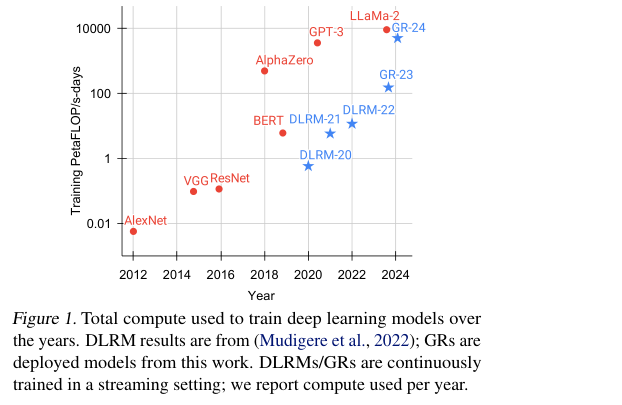
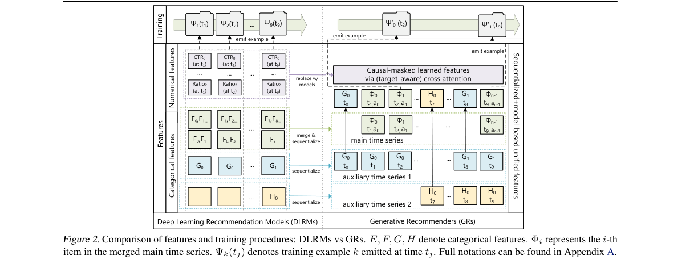
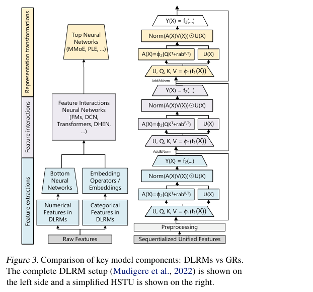
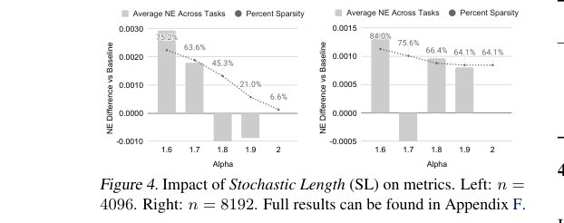
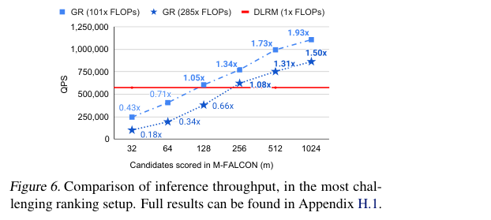
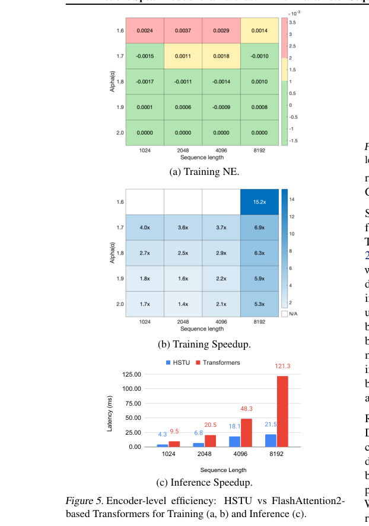
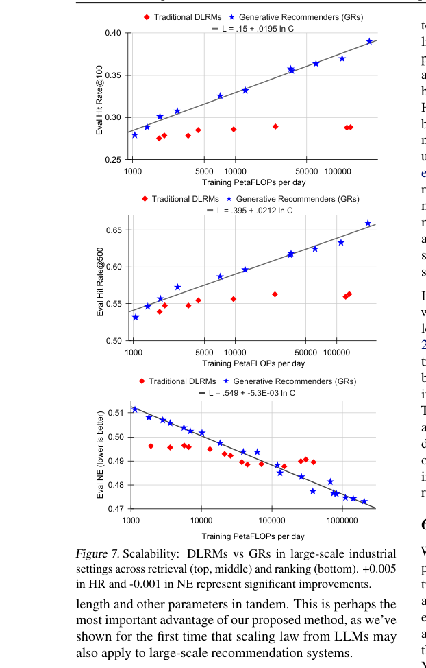

# Actions Speak Louder than Words: Trillion-Parameter Sequential Transducers for Generative Recommendations

저자 :

Jiaqi Zhai, Lucy Liao, Xing Liu, Yueming Wang, Rui Li, Xuan Cao, Leon Gao, Zhaojie Gong, Fangda Gu, Michael He, Yinghai Lu, Yu Shi

MRS, Meta AI

발표 : ICML 2024

논문 : [PDF](https://arxiv.org/pdf/2402.17152)

출처 : [https://arxiv.org/abs/2402.17152](https://arxiv.org/abs/2402.17152)

---

## 0. Summary

### 0.1. 문제 (Problem)

* 산업계 추천 시스템은 수십억 건의 일일 사용자 행동을 처리해야 하지만, 기존 딥러닝 추천 모델(DLRM)은 계산 자원을 늘려도 성능이 거의 향상되지 않는 **스케일링 한계**에 직면해 있다.
* DLRMs는 수천 개의 이종(異種) 피처(범주형 임베딩, 수치형 카운터, 비율 피처 등)를 수작업으로 결합해야 하며, 이 feature engineering 부담이 크고 확장이 어렵다.
* 기존 순차 추천 모델은 소규모 환경에서는 작동하지만, 수십억 규모 비정적(non-stationary) 어휘와 10만 길이에 이르는 사용자 시퀀스에서는 $O(n^2)$ 어텐션 비용 때문에 현실적으로 적용 불가능하다.

### 0.2. 핵심 아이디어 (Core Idea)

이 논문은 추천 문제를 **순차 변환(Sequential Transduction) 과제로 재정의**하여, LLM의 성공을 추천 시스템으로 가져오는 방법론 "Generative Recommenders(GR)"를 제안한다.

**① 추천의 생성형 재정의 (Generative Reformulation)**

기존에는 각 사용자-아이템 쌍에 대해 독립적인 학습 예시를 만들었다(인상(impression)당 1회 비용). GR에서는 한 사용자의 전체 행동 이력을 하나의 시계열로 보고, 순차적으로 다음 행동을 예측하는 방식으로 학습한다. 마치 "과거에 매번 문제 하나씩 채점받던 방식에서, 한 학생의 시험지 전체를 한 번에 펼쳐 인코딩 비용을 여러 정답에 걸쳐 분산"하는 것과 같다. 이렇게 하면 인코더 비용이 여러 타깃에 분산되어, 동일 계산량으로 훨씬 많은 데이터를 학습할 수 있다.

**② HSTU 아키텍처 (Hierarchical Sequential Transduction Unit)**

HSTU는 기존 Transformer의 세 단계(피처 추출 → 피처 상호작용 → 표현 변환)를 하나의 통일된 블록으로 대체하는 새로운 인코더다. 각 HSTU 레이어는 세 단계로 구성된다.

**Pointwise Projection (1단계):** 입력 $X$로부터 쿼리·키·밸류·게이팅 가중치를 한 번에 생성한다.

$$U(X),\, V(X),\, Q(X),\, K(X) = \text{Split}(\phi_1(f_1(X)))$$

여기서 $f_1$은 선형 변환, $\phi_1$은 SiLU 활성화 함수, $U(X)$는 게이팅에 쓰이는 가중치다.

**Spatial Aggregation (2단계):** 포인트와이즈 집계 어텐션(Pointwise Aggregated Attention)을 수행한다.

$$A(X)V(X) = \phi_2\bigl(Q(X)K(X)^T + r^{ab}_{p,t}\bigr)V(X)$$

여기서 $r^{ab}_{p,t}$는 위치(position)와 시간(temporal) 정보를 동시에 인코딩하는 상대 어텐션 편향이다. softmax 대신 포인트와이즈 정규화를 써서, 사용자가 특정 카테고리를 몇 번이나 좋아했는지 같은 **선호 강도 정보**를 손실 없이 유지한다.

**Pointwise Transformation (3단계):** 어텐션 결과와 게이팅을 원소별 곱으로 결합한다.

$$Y(X) = f_2\bigl(\text{Norm}(A(X)V(X)) \odot U(X)\bigr)$$

$\odot$는 원소별 곱으로, Mixture of Experts의 라우팅과 유사한 조건부 계산 역할을 한다.

**③ 확률적 시퀀스 길이(Stochastic Length, SL)**

사용자 행동은 시간 스케일에 걸쳐 반복되는 경향이 있으므로, 매우 긴 시퀀스에서 일부를 확률적으로 잘라내도 정보 손실이 작다. SL은 훈련 시 긴 시퀀스를 랜덤 서브시퀀스로 대체하여 어텐션 비용을 $O(N^{\alpha}d)$로 줄인다(기본 $O(N^2 d)$ 대비). 길이 4096 시퀀스의 80% 이상 토큰을 제거해도 성능 저하가 0.2% 이하였다.

**④ M-FALCON (Microbatched Fast Attention Leveraging Cacheable OperatioNs)**

랭킹 단계에서 수만 개의 후보를 각각 독립적으로 인코딩하면 비용이 폭발한다. M-FALCON은 사용자 시퀀스 인코딩을 한 번만 수행하고, 후보를 작은 마이크로배치(microbatch) 단위로 나누어 어텐션 마스크만 교체하며 처리한다. 285배 복잡한 GR 모델을 기존 DLRM과 동일한 추론 예산으로 1.5~3배 높은 처리량(QPS)으로 서빙할 수 있었다.

### 0.3. 효과 (Effects)

* 이종 피처 공간을 단일 시계열로 통합하여 feature engineering 부담을 대폭 줄이고, 추천·검색·광고에서 공유 가능한 통합 특징 공간을 형성한다.
* GR 모델 품질이 학습 컴퓨팅의 **파워 법칙(power-law)** 을 따르며 스케일 업됨을 처음으로 입증 — GPT-3 / LLaMA-2 규모(약 3자릿수 연산량 범위)까지 확인.
* 추천 시스템용 **파운데이션 모델(Foundation Model)** 로 나아가는 경로를 제시한다.

### 0.4. 결과 (Results)

* 공개 데이터셋(ML-1M, ML-20M, Books)에서 SASRec 대비 NDCG@10 최대 **65.8% 향상** (Books 데이터셋 기준).
* 산업 규모 스트리밍 설정에서 Transformer(FlashAttention2 기반) 대비 훈련 **최대 15.2배**, 추론 **최대 5.6배 속도 향상** (8192 길이 시퀀스).
* 온라인 A/B 테스트에서 DLRM 대비 주요 참여 지표(E-Task) **12.4% 개선**, 수십억 사용자가 사용하는 플랫폼 다중 서비스에 실제 배포.
* 1.5조(1.5 trillion) 파라미터 GR 모델 구축 — DLRM은 약 2000억 파라미터에서 성능이 포화됨.

---

## 1. Introduction

추천 시스템은 수십억 명의 사용자 경험을 매일 개인화하는 핵심 인프라다. 지난 10년간 산업계의 표준 접근법은 DLRM(Deep Learning Recommendation Models)이었다. DLRM은 수천 개의 이종 피처 — 범주형 임베딩(아이템 ID, 크리에이터 ID, 지역 등), 수치형 피처(가중 카운터, CTR 비율 등) — 를 복잡한 신경망으로 결합하여 추천 점수를 산출한다.

그러나 DLRM에는 근본적인 확장성 문제가 있다. 계산 자원을 수배로 늘려도 모델 성능이 거의 개선되지 않는다. 이는 NLP·비전 분야에서 Transformer + 대규모 학습이 계산량에 비례하여 지속 개선되는 것과 대조적이다.

저자들은 이 문제의 원인을 세 가지로 진단한다. 첫째, 추천 시스템의 피처 공간은 명확한 구조가 없다. 둘째, 어휘 크기가 언어 모델의 10만 규모가 아니라 수십억 규모이며 매분 새로운 콘텐츠가 추가되는 비정적(non-stationary) 환경이다. 셋째, 수만 명의 사용자를 처리하는 순차 모델은 $O(n^2)$ 어텐션 비용 때문에 현실적으로 불가능하다.

본 논문은 이에 대한 대답으로 "Generative Recommenders(GR)"를 제안한다. 사용자 행동(user action)을 언어·시각과 동등한 새로운 모달리티로 취급하고, 랭킹과 검색 과제를 순차 변환(sequential transduction) 문제로 재정의한다. 이를 통해 학습 방식을 인상(impression) 단위에서 생성형(generative) 방식으로 전환하고, 새로운 인코더 아키텍처 HSTU를 제안한다. 결과적으로 DLRM 대비 3자릿수 더 복잡한 모델을 배포하면서도 12.4% 지표 개선을 달성했다.

---

## 2. Method

### 2.1. 이종 피처 공간의 단일 시계열 통합

기존 DLRM은 범주형 피처와 수치형 피처를 별도로 처리한다. GR에서는 이 모든 피처를 하나의 통합 시계열로 합쳐낸다.

**범주형(Categorical) 피처:** 가장 긴 시계열(주로 사용자 참여 아이템 시퀀스)을 메인 시계열로 삼고, 나머지 보조 시계열(팔로우한 크리에이터, 가입 커뮤니티 등)은 연속 구간별 최초 항목만 남긴 뒤 메인 시계열에 병합한다. 이 보조 피처는 느리게 변하므로 시퀀스 길이 증가가 크지 않다.

**수치형(Numerical) 피처:** CTR 비율 같은 수치 피처는 모든 인터랙션마다 값이 바뀌어 완전 순차화가 불가능하다. 그러나 해당 피처가 집계되는 범주형 피처(아이템 주제, 지역 등)는 이미 시퀀스에 포함되어 있으므로, 시퀀스 길이와 표현력을 충분히 키우면 수치형 피처 없이도 근사할 수 있다.

### 2.2. 랭킹과 검색의 순차 변환 과제 재정의

$n$개의 토큰 $x_0, x_1, \ldots, x_{n-1}$이 시간 순으로 주어질 때, 순차 변환 과제는 이 시퀀스를 출력 $y_0, y_1, \ldots, y_{n-1}$로 매핑한다. 여기서 $y_i = \emptyset$이면 해당 위치의 출력이 정의되지 않음을 의미한다.

| 과제 | 입력 $x_i$ | 출력 $y_i$ |
|------|-----------|-----------|
| 랭킹 | $\Phi_0, a_0, \Phi_1, a_1, \ldots, \Phi_{n_c-1}, a_{n_c-1}$ | $a_0, \emptyset, a_1, \emptyset, \ldots, a_{n_c-1}, \emptyset$ |
| 검색 | $(\Phi_0, a_0), (\Phi_1, a_1), \ldots$ | $\Phi'_1, \Phi'_2, \ldots$ (긍정 행동 시 $\Phi_i$, 아니면 $\emptyset$) |

여기서 $\Phi_i$는 시스템이 제공한 콘텐츠, $a_i$는 사용자 행동(좋아요, 건너뛰기, 시청 완료 등)이다. 랭킹에서는 타깃 아이템 $\Phi_{i+1}$과 이력 피처의 상호작용이 초기에 이루어져야 하므로, 아이템과 행동을 교대(interleaving)로 배치하여 단일 패스에서 타깃 인식(target-aware) 크로스 어텐션을 가능하게 한다.

### 2.3. 생성형 학습 (Generative Training)

기존 인상(impression) 단위 학습에서 자기 어텐션 기반 모델의 총 비용은 $\sum_i n_i(n_i^2 d + n_i d_{ff} d)$로, 최악의 경우 $O(N^3 d + N^2 d^2)$가 된다.

생성형 학습에서는 사용자 $i$를 $s_u(n_i)$ 비율로 샘플링한다. $s_u(n_i) = 1/n_i$로 설정하면 전체 비용이 $O(N^2 d + N d^2)$로 줄어들고, 인코더 비용이 여러 학습 예시에 분산된다. 실무에서는 사용자 세션 종료 시 한 번 학습 예시를 생성하는 방식으로 구현한다.

### 2.4. HSTU 아키텍처

HSTU는 동일한 레이어를 잔차 연결(residual connection)로 쌓아 구성하며, 각 레이어는 3개의 서브레이어로 이루어진다.

**Pointwise Projection:**

$$U(X),\, V(X),\, Q(X),\, K(X) = \text{Split}(\phi_1(f_1(X)))$$

$f_1(X) = W_1 X + b_1$은 단일 선형 변환이다. 한 번의 행렬 연산으로 쿼리, 키, 밸류, 게이팅 가중치를 동시에 생성하여 커널 융합(kernel fusion)이 가능하다.

**Spatial Aggregation (포인트와이즈 집계 어텐션):**

$$A(X)V(X) = \phi_2\bigl(Q(X)K(X)^T + r^{ab}_{p,t}\bigr)V(X)$$

여기서 $r^{ab}_{p,t}$는 위치(position)와 시간(temporal) 정보를 함께 인코딩하는 상대 어텐션 편향이다. softmax 대신 포인트와이즈 정규화를 사용하므로, 비정적 어휘 환경에서 안정적이며 사용자 선호 강도 정보가 보존된다.

**Pointwise Transformation:**

$$Y(X) = f_2\bigl(\text{Norm}(A(X)V(X)) \odot U(X)\bigr)$$

$\odot$는 원소별 곱(element-wise product)이다. SiLU가 $U(X)$에 적용되므로, 이 항은 SwiGLU의 변형으로도 해석 가능하다. 이 게이팅 구조는 Mixture of Experts의 조건부 라우팅을 근사한다.

이 단순화된 설계로 HSTU는 Transformer 대비 활성화 메모리를 레이어당 33d에서 14d로 절감하여, 동일 메모리로 2배 이상 깊은 네트워크 구성이 가능하다.

### 2.5. 확률적 시퀀스 길이 (Stochastic Length, SL)

사용자 행동 시퀀스는 시간적으로 반복성이 높기 때문에, 일부 토큰을 제거해도 정보 손실이 작다. SL은 다음 규칙으로 훈련 시 입력 시퀀스를 선택한다.

$$\text{선택 시퀀스} = \begin{cases} (x_i)_{i=0}^{n_{c,j}} & \text{if } n_{c,j} \le N_c^{\alpha/2} \\ (x_{i_k})_{k=0}^{N_c^{\alpha/2}} & \text{if } n_{c,j} > N_c^{\alpha/2}, \text{ 확률 } 1 - N_c^\alpha/n_{c,j}^2 \\ (x_i)_{i=0}^{n_{c,j}} & \text{if } n_{c,j} > N_c^{\alpha/2}, \text{ 확률 } N_c^\alpha/n_{c,j}^2 \end{cases}$$

여기서 $n_{c,j}$는 사용자 $j$의 시퀀스 길이, $N_c$는 최대 시퀀스 길이, $\alpha \in (1, 2]$는 희소성 조절 파라미터다. 이를 통해 어텐션 관련 복잡도를 $O(N^\alpha d)$로 낮춘다.

### 2.6. M-FALCON 추론 알고리즘

랭킹에서 $m$개의 후보를 처리할 때, 표준 방식은 후보별로 전체 인코딩을 반복하여 $O(m \cdot n^2 d)$ 비용이 든다. M-FALCON은 다음 두 가지를 결합한다.

1. **KV 캐싱:** 사용자 컨텍스트 인코딩을 한 번만 수행하고 KV를 캐시한다.
2. **마이크로배치 병렬 처리:** $m$개의 후보를 $\lceil m / b_m \rceil$개의 마이크로배치로 나누어, 배치 내 $b_m$개 후보를 어텐션 마스크 수정만으로 단일 패스에서 처리한다.

크로스 어텐션 비용이 $O(b_m n^2 d)$에서 $O((n + b_m)^2 d) \approx O(n^2 d)$로 줄어든다.

---

## 3. Experiments

### 3.1. 설정 (Setup)

**공개 데이터셋 평가:** MovieLens(ML-1M, ML-20M)와 Amazon Reviews(Books)에서 SASRec을 기준선으로 사용. HR@K와 NDCG@K를 전체 코퍼스에 대해 측정.

**산업 규모 스트리밍 평가:** 100B 학습 예시, H100 GPU 64~256개. 랭킹 평가 지표는 Normalized Entropy(NE), 검색은 로그 퍼플렉서티. NE 0.001 감소가 수십억 사용자 대상 약 0.5% 성능 개선에 해당.

### 3.2. 공개 데이터셋 결과

| 방법 | ML-1M NDCG@10 | Books NDCG@10 |
|------|--------------|--------------|
| SASRec (2023) | .1603 | .0156 |
| HSTU | .1720 (+7.3%) | .0219 (+40.6%) |
| HSTU-large | .1893 (+18.1%) | .0257 (+65.8%) |

HSTU는 동일 설정에서 SASRec 대비 일관되게 우월하며, 스케일 업 시 추가 개선이 관찰된다.

### 3.3. 인코더 효율성

HSTU(포인트와이즈 어텐션 + SL)와 FlashAttention2 기반 Transformer를 동일 설정($d=512, h=8, d_{qk}=64$)으로 비교한 결과:

* 훈련 속도: 최대 **15.2배** 빠름 (SL 적용 시)
* 추론 속도: 최대 **5.6배** 빠름
* HBM 사용량: Transformer 대비 **50% 절감** → 동일 메모리로 2배 이상 깊은 레이어 구성 가능

확률적 시퀀스 길이(SL)에서 $\alpha=1.6$, 길이 4096 설정 시 80.5% 스파시티를 달성하면서도 NE 저하가 0.002 이하로 유지된다.

### 3.4. GR vs. DLRM 산업 규모 비교

검색(Retrieval)과 랭킹 모두에서 DLRM은 일정 계산량 이상에서 성능이 포화되는 반면, GR은 파워 법칙을 따라 계속 개선된다. 실험된 최대 규모(시퀀스 길이 8192, 임베딩 차원 1024, HSTU 24레이어)에서의 학습 컴퓨팅은 GPT-3/LLaMA-2와 비슷한 수준에 도달했다.

| 모델 | 파라미터 수 | HR@100 (Retrieval) | 랭킹 E-Task NE | 온라인 A/B (E-Task) |
|------|------------|-------------------|--------------|-------------------|
| DLRM | ~200B (포화) | 29.0% | .4982 | +0% |
| GR | 1.5T | 36.9% | .4845 | **+12.4%** |

GR이 사용하는 피처 셋만을 DLRM에 주면(DLRM abl. features) DLRM 성능이 크게 하락하는데, 이는 GR이 해당 피처들을 아키텍처 자체적으로 더 잘 포착함을 시사한다.

M-FALCON을 적용한 결과, 285배 복잡한 GR 모델이 1024개 후보 채점 시 기존 DLRM 대비 1.50배, 16384개 후보 채점 시 2.99배 높은 QPS를 달성했다.

---

## 4. Conclusion

이 논문은 추천 시스템의 패러다임 전환을 제시한다. 수천 개의 이종 피처를 수작업으로 결합하는 DLRM 방식에서 벗어나, 사용자 행동 이력을 단일 시계열로 통합하고 랭킹·검색을 순차 변환 과제로 재정의하는 Generative Recommenders(GR)를 제안했다. 핵심 인코더인 HSTU는 포인트와이즈 집계 어텐션, 확률적 시퀀스 길이, 메모리 효율적 설계를 통해 FlashAttention2 기반 Transformer 대비 최대 15.2배 빠른 훈련 속도를 달성한다. M-FALCON 알고리즘은 285배 복잡한 모델을 기존 추론 예산으로 서빙 가능하게 했다. 실제 수십억 사용자 플랫폼에서 12.4% 온라인 지표 개선과 함께 스케일링 법칙이 추천 시스템에도 적용됨을 처음으로 입증했다.

한 줄 코멘트: 이 논문은 "추천 시스템도 LLM처럼 스케일링된다"는 것을 처음으로 산업 규모에서 검증한 이정표적 연구로, 수작업 feature engineering의 종말과 추천용 파운데이션 모델 시대의 개막을 예고한다.

---

## 부록: 사전 지식 (Prerequisites)

### A.1. 알아야 할 핵심 개념

- **DLRM (Deep Learning Recommendation Model)** — 범주형(임베딩) 피처와 수치형(카운터·비율) 피처를 수작업으로 결합하는 산업계 표준 추천 아키텍처.
  - 본문 위치: §1 Introduction, §2.1, §3.4 — GR이 대체하려는 기준선으로 전반에 걸쳐 등장.

- **순차 추천 모델 / SASRec (Sequential Recommendation)** — 사용자의 과거 상호작용 시퀀스를 자기 어텐션(self-attention)으로 인코딩해 다음 아이템을 예측하는 방법론. SASRec(2018)이 대표 모델.
  - 본문 위치: §3.1 공개 데이터셋 기준선, §3.2 비교 실험 — NDCG@10 기준 최대 65.8% 향상 대비 기준선.

- **자기 어텐션 / Transformer (Self-Attention)** — Query, Key, Value 행렬 연산과 softmax 정규화로 시퀀스 내 모든 위치 간 상관관계를 한 번에 계산하는 핵심 메커니즘. 시퀀스 길이 $n$에 $O(n^2)$ 비용이 발생한다.
  - 본문 위치: §2.4 HSTU 설계 동기 — HSTU가 수정·대체하는 기반 메커니즘.

- **포인트와이즈 어텐션 vs. softmax 어텐션 (Pointwise vs. Softmax Attention)** — softmax는 각 행 합을 1로 정규화해 상대적 선호만 남기지만, 포인트와이즈 정규화는 절대 선호 강도(빈도 정보)를 보존한다. 비정적(non-stationary) 어휘에서 softmax 대신 사용.
  - 본문 위치: §2.4 Spatial Aggregation — HSTU의 핵심 변형 포인트.

- **상대 위치·시간 어텐션 편향 (Relative Positional and Temporal Bias)** — 어텐션 logit에 위치(position)와 타임스탬프(temporal gap) 정보를 동시에 담은 편향 행렬 $r^{ab}_{p,t}$를 더해, RoPE 없이 상대 위치 및 시간 정보를 주입하는 기법.
  - 본문 위치: §2.4 Spatial Aggregation 수식.

- **SwiGLU / GLU 게이팅 (Gated Linear Unit)** — 두 선형 변환의 결과를 원소별 곱($\odot$)으로 결합하는 게이팅 구조. SiLU(σ(x)·x) 활성화와 함께 쓰이며, LLaMA 계열 LLM에도 널리 사용된다.
  - 본문 위치: §2.4 Pointwise Transformation — HSTU의 $U(X)\odot$ 항이 SwiGLU 변형으로 해석됨.

- **KV 캐시 (KV Cache)** — 자기회귀(autoregressive) 또는 배치 추론 시 이미 계산된 Key/Value를 재사용해 중복 연산을 제거하는 추론 최적화 기법.
  - 본문 위치: §2.6 M-FALCON — 사용자 컨텍스트 인코딩을 1회만 수행하고 KV를 캐시해 후보 채점 비용을 절감.

- **스케일링 법칙 (Scaling Laws)** — 모델 품질이 학습 컴퓨팅(FLOPs)의 파워 법칙(power-law)을 따라 예측 가능하게 향상된다는 경험적 원칙(Kaplan et al., 2020).
  - 본문 위치: §3.4 GR vs. DLRM — GR이 3자릿수 컴퓨팅 범위에서 스케일링 법칙을 따름을 처음 추천 시스템에서 입증.

- **2단계 추천 파이프라인: 검색(Retrieval) + 랭킹(Ranking)** — 수십억 아이템 중 수백 후보를 거르는 검색 단계와, 수만 후보를 정밀 점수화하는 랭킹 단계로 나뉘는 산업계 표준 구조.
  - 본문 위치: §2.2 순차 변환 과제 재정의 — 랭킹과 검색을 각각 다른 출력 정의의 순차 변환 문제로 통합.

---

### A.2. 먼저 읽으면 좋은 논문

1. **[2019][DLRM]** Deep Learning Recommendation Model for Personalization and Recommendation Systems ([arxiv 1906.00091](https://arxiv.org/abs/1906.00091)) — 범주형·수치형 이종 피처를 결합하는 Meta(Facebook)의 산업 표준 추천 아키텍처.
   - **왜?** GR이 직접 대체하고자 하는 기준선 아키텍처이며, DLRM의 스케일링 한계가 이 논문의 출발점.
   - **Repo 내 정리**: [Generative_Recommendation/[논문][2019][Summary][DLRM] Deep Learning Recommendation Model for Personalization and Recommendation Systems.md](../Generative_Recommendation/[논문][2019][Summary][DLRM]%20Deep%20Learning%20Recommendation%20Model%20for%20Personalization%20and%20Recommendation%20Systems.md)

2. **[2018][SASRec]** Self-Attentive Sequential Recommendation ([arxiv 1808.09781](https://arxiv.org/abs/1808.09781)) — 자기 어텐션으로 사용자 행동 시퀀스를 인코딩해 다음 아이템을 예측하는 순차 추천 모델.
   - **왜?** 공개 데이터셋 실험(ML-1M, ML-20M, Books)에서 직접 비교 기준선으로 사용되며, HSTU의 설계 참조점.

3. **[2022][PinnerFormer]** PinnerFormer: Sequence Modeling for User Representation at Pinterest ([arxiv 2205.04507](https://arxiv.org/abs/2205.04507)) — Pinterest에서 장기 사용자 시퀀스를 Transformer로 인코딩해 산업 규모 추천에 적용한 선행 연구.
   - **왜?** 순차 모델을 산업 규모 추천에 적용하는 방법론적 선례로, GR과 직접 연결됨.
   - **Repo 내 정리**: [Generative_Recommendation/[논문][2022][Summary][PinnerFormer] PinnerFormer - Sequence Modeling for User Representation at Pinterest.md](../Generative_Recommendation/[논문][2022][Summary][PinnerFormer]%20PinnerFormer%20-%20Sequence%20Modeling%20for%20User%20Representation%20at%20Pinterest.md)

4. **[2023][TIGER]** Recommender Systems with Generative Retrieval ([arxiv 2305.05065](https://arxiv.org/abs/2305.05065)) — 아이템을 Semantic ID로 양자화하고 언어 모델처럼 자동회귀 생성으로 추천하는 생성형 검색 방법.
   - **왜?** "생성형 추천(Generative Recommendation)"이라는 패러다임을 공유하며, GR과 같은 방향의 동시대 연구.
   - **Repo 내 정리**: [Generative_Recommendation/[논문][2023][Summary][TIGER] Recommender Systems with Generative Retrieval.md](../Generative_Recommendation/[논문][2023][Summary][TIGER]%20Recommender%20Systems%20with%20Generative%20Retrieval.md)

5. **[2020][Scaling Laws]** Scaling Laws for Neural Language Models ([arxiv 2001.08361](https://arxiv.org/abs/2001.08361)) — 모델 크기·데이터·컴퓨팅 간 파워 법칙 관계를 언어 모델에서 정량화한 OpenAI 연구.
   - **왜?** GR의 핵심 주장인 "추천 시스템에도 스케일링 법칙이 적용된다"의 이론적 근거이며 직접 인용됨.

6. **[2017][Transformer]** Attention Is All You Need ([arxiv 1706.03762](https://arxiv.org/abs/1706.03762)) — Multi-head self-attention 기반 Transformer 아키텍처 원논문.
   - **왜?** HSTU는 Transformer 설계를 추천 데이터 특성에 맞게 재설계한 아키텍처로, Transformer 구조 이해가 필수.

7. **[2018][DIN]** Deep Interest Network for Click-Through Rate Prediction ([arxiv 1706.06978](https://arxiv.org/abs/1706.06978)) — 타깃 아이템과 사용자 이력 간 크로스 어텐션을 수행하는 타깃 인식(target-aware) 추천 방법.
   - **왜?** GR의 랭킹 공식화에서 아이템($\Phi$)과 행동($a$)을 교대 배치하는 "타깃 인식 상호작용"의 원형.

---

### A.3. 관련/후속 논문

- **[2025][OneRec]** OneRec Technical Report ([arxiv 2506.13695](https://arxiv.org/abs/2506.13695)) — Kuaishou가 GR 패러다임(인코더-디코더, Semantic ID, DPO 정렬)을 적용해 4억 DAU 플랫폼에 배포한 후속 산업 연구.

- **[2025][Context Parallelism on HSTU]** Scaling Generative Recommendations with Context Parallelism on Hierarchical Sequential Transducers ([arxiv 2508.04711](https://arxiv.org/abs/2508.04711)) — HSTU에 컨텍스트 병렬화(context parallelism)를 도입해 지원 시퀀스 길이를 5.3배 확장한 Meta의 후속 시스템 논문.

- **[2024][HLLM]** (ByteDance) HLLM: Enhancing Sequential Recommendations via Hierarchical Large Language Models — 계층적 LLM 구조로 GR과 동일한 방향의 스케일링을 시도한 ByteDance 연구.

- **[2025][MiniOneRec]** MiniOneRec: An Open-Source Framework for Scaling Generative Recommendation ([arxiv 2510.24431](https://arxiv.org/abs/2510.24431)) — OneRec 아키텍처의 오픈소스 재현 프레임워크로, GR 패러다임 실험 진입장벽을 낮춤.
