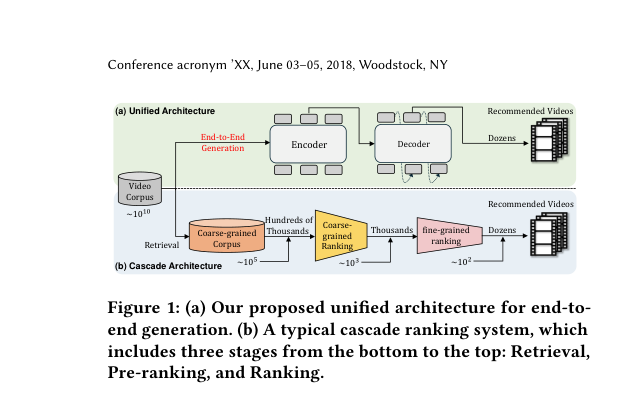
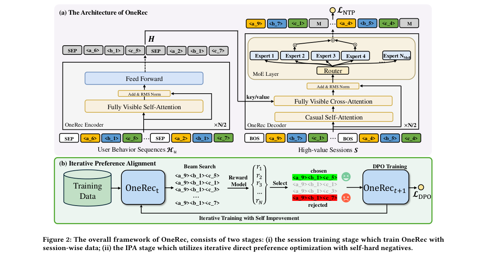
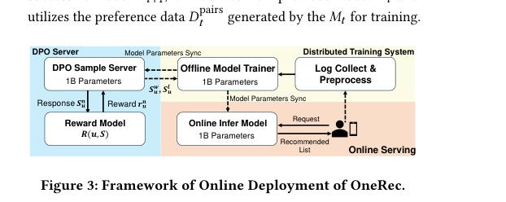
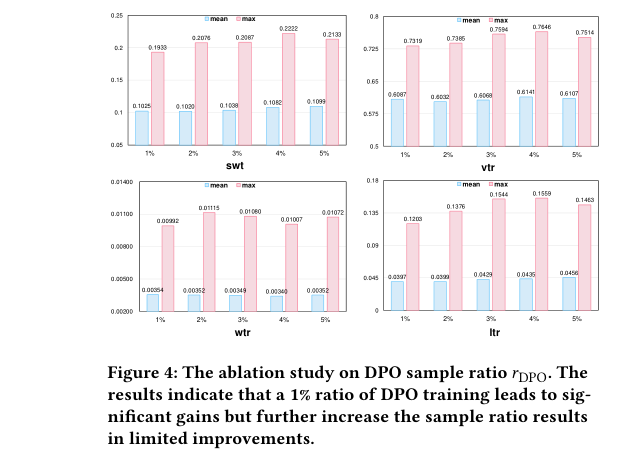
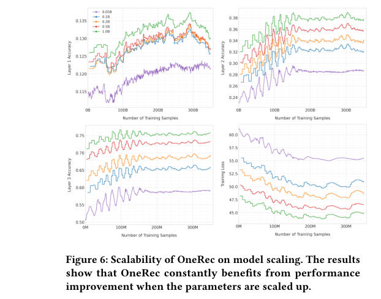
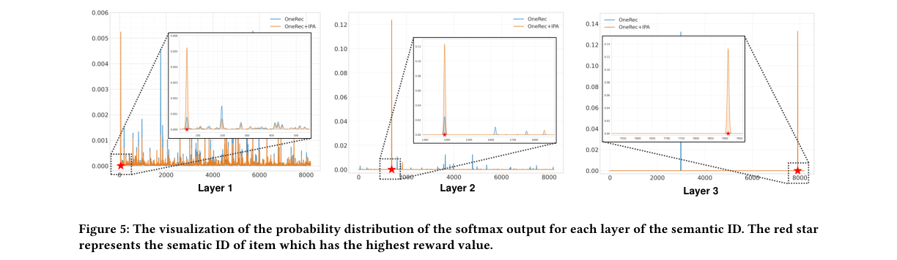

# OneRec: Unifying Retrieve and Rank with Generative Recommender and Iterative Preference Alignment

저자 :

Jiaxin Deng, Shiyao Wang, Kuo Cai, Lejian Ren, Qigen Hu, Weifeng Ding, Qiang Luo, Guorui Zhou

KuaiShou Inc., Beijing, China

발표 : arXiv 2025

논문 : [PDF](https://arxiv.org/pdf/2502.18965)

출처 : [https://arxiv.org/abs/2502.18965](https://arxiv.org/abs/2502.18965)

---

## 0. Summary

<p align='center'>

</p>

### 0.1. 문제 (Problem)

* 현대 추천 시스템은 회수(Retrieval) → 사전 순위(Pre-ranking) → 정밀 순위(Ranking)로 이어지는 **다단계 캐스케이드 파이프라인**을 사용한다. 각 단계가 독립적으로 학습되기 때문에, 앞 단계의 성능 한계가 뒷 단계의 상한선이 된다.
* 생성형 검색 추천(Generative Retrieval Recommendation)이 주목받고 있으나, 기존 생성 모델은 다단계 시스템의 **첫 번째 회수 단계**에서만 동작하며 다단계 랭커만큼의 정확도를 내지 못한다.
* 전통적 포인트별(point-wise) 다음-아이템 예측 방식은 추천 결과 목록을 조합하기 위해 수작업 규칙(hand-crafted rules)이 필요하며, 목록 전체의 맥락적 일관성(contextual coherence)을 확보하기 어렵다.
* NLP에서의 DPO(Direct Preference Optimization) 방식을 추천 시스템에 그대로 적용하기 어렵다. NLP와 달리 추천 시스템은 사용자에게 한 번만 결과를 보여주므로, 선호/비선호 쌍(positive/negative pair)을 자연스럽게 수집할 수 없다.

### 0.2. 핵심 아이디어 (Core Idea)

OneRec은 세 가지 핵심 구성 요소로 다단계 캐스케이드를 단일 생성 모델로 통합한다.

**(a) Balanced K-means 시맨틱 ID (Semantic Tokenization)**

각 영상을 L=3개의 계층적 코드 토큰 $\langle s^1, s^2, s^3 \rangle$으로 변환해 "영상의 언어"를 만든다. 기존 RQ-VAE 방식은 일부 코드에만 영상이 몰리는 "모래시계 현상(hourglass phenomenon)" 문제가 있었는데, OneRec은 **균형 K-means(Balanced K-means)** 알고리즘을 적용해 $K=8192$개의 코드 각각에 영상이 고르게 배분되도록 강제한다.

비유: 도서관의 청구기호처럼, 의미가 비슷한 영상은 첫 번째 코드($s^1$)가 같고, 더 세부적인 특성을 표현하는 코드가 뒤로 이어진다. 잔차(residual)를 단계적으로 줄여가며 점점 세밀하게 인코딩하는 방식이다.

$$
s^l_i = \arg\min_k \|r^l_i - c^l_k\|^2_2, \quad r^{l+1}_i = r^l_i - c^l_{s^l_i}
$$

여기서 $r^l_i$는 $l$번째 레벨의 잔차 벡터, $c^l_k$는 $l$번째 레벨 코드북의 $k$번째 중심(centroid)이다.

**(b) 세션별 리스트 생성 (Session-wise List Generation)**

"다음 영상 하나"를 예측하는 포인트별 방식 대신, 사용자가 한 번 스크롤할 때 보게 되는 **5~10개짜리 영상 묶음(세션) 전체**를 한 번에 자기회귀(autoregressive) 방식으로 생성한다. T5와 유사한 인코더-디코더 구조를 사용하며, 디코더의 FFN 레이어는 **희소 MoE(Sparse Mixture-of-Experts)**로 교체되어 파라미터는 24개 전문가($N_{MoE}=24$) 중 2개만($K_{MoE}=2$) 활성화되어 계산 효율을 높인다.

비유: 한 곡씩 추천하는 것이 아니라, "이 유저에게 맞는 플레이리스트 5곡"을 작곡가가 처음부터 끝까지 한꺼번에 구성하는 것과 같다. 목록 내 영상 간의 일관성·다양성을 모델이 직접 학습하므로 수작업 규칙이 불필요하다.

훈련 목적 함수는 세션 내 시맨틱 ID에 대한 다음-토큰 예측(NTP) 손실이다:

$$
\mathcal{L}_{NTP} = -\sum_{i=1}^{m} \sum_{j=1}^{L} \log P(s^{j+1}_i \mid [s^{BOS}, s^1_1, \ldots, s^j_i]; \Theta)
$$

**(c) 반복 선호 정렬 (Iterative Preference Alignment, IPA)**

추천 시스템에서는 사용자에게 결과를 한 번만 보여주므로 선호/비선호 쌍을 직접 수집할 수 없다. 이 문제를 해결하기 위해 사전 학습된 **보상 모델(Reward Model, RM)**이 심판 역할을 한다. 현재 모델로 빔 서치(beam search)를 통해 $N=128$개의 추천 세션 후보를 생성하고, RM이 각 후보에 점수를 부여한다. 최고 점수 세션을 chosen(선호), 최저 점수 세션을 rejected(비선호)로 선정하여 DPO 학습 쌍을 자동 구성한다.

비유: 선생님(RM)이 학생(모델)이 쓴 답안 128개를 채점해, 최고 답안과 최저 답안을 골라 "이 둘의 차이를 배워"라고 알려주는 구조다. 이 과정을 반복하면 모델이 점점 더 나은 세션을 생성하도록 정렬(align)된다. 전체 학습의 1%($r_{DPO}=1\%$)에만 DPO 데이터를 섞어도 충분한 효과를 얻는다:

$$
\mathcal{L} = \mathcal{L}_{NTP} + \lambda \mathcal{L}_{DPO}
$$

### 0.3. 효과 (Effects)

* 다단계 캐스케이드 파이프라인을 단일 생성 모델로 완전히 대체하여, 단계 간 정보 손실 없이 엔드-투-엔드(end-to-end) 추천이 가능하다.
* MoE 구조 덕분에 추론 시 전체 파라미터의 **13%만 활성화**되어 1B 파라미터 모델을 실서비스에서 효율적으로 운용할 수 있다.
* 세션별 생성 방식으로 추천 목록의 맥락 일관성이 향상되며, 사전 정의된 다양성 규칙 없이도 다양성이 확보된다.
* IPA를 통해 단 1%의 DPO 샘플로도 사용자 선호 정렬이 이루어져 생성 품질이 크게 향상된다.

### 0.4. 결과 (Results)

* 오프라인 평가 (세션별 생성 효과): OneRec-1B는 TIGER-1B 대비 최대 swt **+1.78%**, 최대 ltr **+3.36%** 향상.
* 오프라인 평가 (IPA 효과): OneRec-1B+IPA는 베이스 OneRec-1B 대비 최대 swt **+4.04%**, 최대 ltr **+5.43%** 향상.
* 온라인 A/B 테스트(쿠아이쇼우 메인피드, 일 수억 명 규모): OneRec-1B+IPA 기준 총 시청 시간(Total Watch Time) **+1.68%**, 평균 시청 시간(Average View Duration) **+6.56%** 향상.
* 스케일링: 0.05B → 1B까지 파라미터 증가에 따라 성능이 일관되게 향상되는 스케일링 법칙 확인.

### 0.5. 상세 동작 방식 (How It Works)

OneRec의 전체 파이프라인은 **오프라인 전처리** → **세션 학습** → **IPA(반복 선호 정렬)** → **온라인 추론**의 네 단계로 구성된다.

---

**전체 데이터 흐름 (ASCII Diagram)**

```
입력: 영상 멀티모달 임베딩 e_i, 사용자 행동 로그
        │
        ▼
┌──────────────────────────────────────────┐
│  Step 1. Balanced K-means 잔차 양자화
│  e_i → 레벨 1 클러스터 배정 → 잔차 계산
│  → 레벨 2 → 레벨 3  (L=3 반복)
│  출력: 시맨틱 ID 튜플 (s¹, s², s³)
└──────────────────────────────────────────┘
        │
        ▼
┌──────────────────────────────────────────┐
│  Step 2. 인코더 — 행동 시퀀스 인코딩
│  H_u = 최근 n=256개 영상 시맨틱 ID 시퀀스
│  Fully Visible Self-Attention 적용
│  출력: 컨텍스트 표현 H
└──────────────────────────────────────────┘
        │
        ▼
┌──────────────────────────────────────────┐
│  Step 3. MoE 디코더 — 세션 자동회귀 생성
│  Cross-Attention(H) + Causal Self-Attn
│  희소 MoE: 24개 전문가 중 2개 활성화(13%)
│  [BOS] → 5개 영상 × 3토큰 순서대로 생성
│  출력: 세션 S = {v1, v2, v3, v4, v5}
└──────────────────────────────────────────┘
        │
        ▼
┌──────────────────────────────────────────┐
│  Step 4. 빔 서치 + 보상 모델 채점
│  빔 서치로 N=128개 세션 후보 생성
│  RM이 swt/vtr/wtr/ltr 종합 점수 부여
│  최고: chosen S^w / 최저: rejected S^l
└──────────────────────────────────────────┘
        │
        ▼
┌──────────────────────────────────────────┐
│  Step 5. IPA — DPO 선호 정렬 (반복)
│  L = L_NTP + λ·L_DPO  (DPO 비율 1%)
│  M_t → M_{t+1} → 다시 Step 4로 반복
└──────────────────────────────────────────┘
        │
        ▼
┌──────────────────────────────────────────┐
│  Step 6. 온라인 추론
│  인코더-디코더 빔 서치로 세션 직접 생성
│  출력: 추천 세션 S → 사용자 피드 노출
└──────────────────────────────────────────┘
```

**Step 1 — 아이템 토큰화 (Balanced K-means 잔차 양자화)**

* **입력**: 각 영상의 멀티모달 임베딩 $e_i \in \mathbb{R}^d$
* **처리**: 3개 레벨($L=3$)의 잔차 K-means를 순차 적용. 레벨 1에서 $K=8192$개 클러스터 중심 중 가장 가까운 $c^1_k$에 배정하고, 잔차 $r^2_i = e_i - c^1_{s^1_i}$를 레벨 2 입력으로 넘긴다. 기존 RQ-VAE의 "모래시계 현상"(인기 영상이 소수 코드에 집중) 방지를 위해 각 클러스터에 $w = |V|/K$개씩 강제 균등 배정한다.
* **출력**: 각 영상의 3-레벨 시맨틱 ID 튜플 $\langle s^1_i, s^2_i, s^3_i \rangle$

**Step 2 — 인코더: 사용자 행동 시퀀스 인코딩**

* **입력**: 사용자 최근 $n=256$개 영상 시맨틱 ID 시퀀스 $H_u$
* **처리**: T5형 인코더의 완전 가시 셀프-어텐션이 $H_u$ 전체를 한꺼번에 참조해 장기·단기 관심사를 모두 반영한 컨텍스트 표현 $H$를 생성한다.
* **출력**: 컨텍스트 행렬 $H$ (디코더 크로스 어텐션의 키/밸류로 사용)

**Step 3 — MoE 디코더: 세션 자동회귀 생성**

* **입력**: $H$와 앞서 생성된 토큰들
* **처리**: 인과적 셀프-어텐션 + 크로스 어텐션으로 다음 토큰을 예측한다. FFN은 희소 MoE($N_{MoE}=24$개 전문가, 상위 $K_{MoE}=2$개 활성화)로 교체돼 추론 시 파라미터의 13%만 계산에 참여한다. 영상 1개 = 3토큰, 세션 1개(5영상) = 15토큰을 순서대로 생성한다.
* **출력**: 추천 세션 $S = \{v_1, \ldots, v_5\}$

**Step 4 — 빔 서치 + 보상 모델 채점**

* **처리**: 빔 서치로 $N=128$개 세션 후보를 생성한 뒤, 사전 학습된 보상 모델(RM)이 swt·vtr·wtr·ltr 4개 목표를 종합해 점수를 부여한다.
* **출력**: chosen $S^w_u$ (최고 점수) / rejected $S^l_u$ (최저 점수) 선호 쌍

**Step 5 — IPA: 반복 선호 정렬**

* **처리**: DPO 손실을 NTP 손실에 결합해 모델을 업데이트한다:

$$\mathcal{L} = \mathcal{L}_{NTP} + \lambda \mathcal{L}_{DPO}$$

  전체 샘플의 $r_{DPO}=1\%$만 DPO 쌍으로 처리. 업데이트된 $M_{t+1}$로 다시 빔 서치를 돌려 자기 개선 루프를 반복한다.
* **출력**: 선호 정렬된 신규 모델 $M_{t+1}$

---

## 1. Introduction

현대 대규모 추천 시스템은 효율과 정확도를 동시에 만족하기 위해 **캐스케이드 랭킹(cascade ranking)** 전략을 채택한다. Figure 1(b)에서 보듯이, 약 1,000억 개(~$10^{10}$)의 전체 영상 후보가 회수(Retrieval) 단계에서 수십만 개로, 사전 순위(Pre-ranking)에서 수천 개로, 정밀 순위(Ranking)에서 수십 개로 점진적으로 걸러진다. 각 단계는 독립적으로 학습되는데, 이 구조의 본질적 한계는 각 단계의 성능 상한선이 이전 단계의 출력 품질에 종속된다는 점이다. 다단계 간 상호 학습 시도가 있었지만 여전히 캐스케이드 패러다임을 유지하고 있다.

최근 생성형 검색(Generative Retrieval, GR) 기반 추천이 주목받고 있다. 아이템에 시맨틱 ID를 할당하고, 인코더-디코더 모델로 시퀀스를 자동회귀적으로 생성하여 후보 아이템을 직접 생성하는 방식이다. TIGER, LC-Rec, EAGER 등이 이 계열에 해당하며, TIGER는 RQ-VAE 기반 시맨틱 토큰화를 추천에 도입한 선구적 연구이다. 그러나 기존 생성 모델은 회수 단계에서만 동작하며, 정밀 순위 단계의 다단계 랭커 수준의 정확도를 아직 달성하지 못하고 있다.

이 논문에서 저자들은 단일 단계 엔드-투-엔드 생성 추천 프레임워크 **OneRec**을 제안한다. 핵심 아이디어는 세 가지다. 첫째, MoE 기반 확장 인코더-디코더 구조로 계산 비용 대비 높은 모델 용량을 확보한다. 둘째, 포인트별 다음-아이템 예측 대신 세션 단위 리스트 생성(session-wise generation)으로 목록 내 맥락 일관성을 모델이 직접 학습하게 한다. 셋째, 보상 모델과 DPO를 결합한 반복 선호 정렬(IPA) 모듈로 생성 품질을 한층 더 끌어올린다.

쿠아이쇼우(Kuaishou) 메인 피드에 실제 배포하여 총 시청 시간 +1.68%, 평균 시청 시간 +6.56%를 달성했다. 저자들은 이것이 실세계 시나리오에서 복잡하게 설계된 다단계 시스템을 유의미하게 넘어선 최초의 엔드-투-엔드 생성 모델이라고 주장한다.

---

## 2. Method

<p align='center'>

</p>

### 2.1. 시맨틱 ID 구축 — Balanced K-means 잔차 양자화

각 영상 $v_i$를 멀티모달 임베딩 $e_i \in \mathbb{R}^d$로 표현한 뒤, **잔차 K-means 양자화(Residual K-means Quantization)**로 계층적 시맨틱 토큰 $(s^1_i, s^2_i, \ldots, s^L_i)$을 생성한다. $L=3$ 레벨, 코드북 크기 $K=8192$를 사용하며 각 레벨에서 잔차를 가장 가까운 중심에 매핑한다:

$$
s^l_i = \arg\min_k \|r^l_i - c^l_k\|^2_2, \quad r^{l+1}_i = r^l_i - c^l_{s^l_i}
$$

기존 RQ-VAE의 "모래시계 현상"—일부 코드에만 아이템이 집중되어 코드 활용률이 불균형해지는 문제—을 해결하기 위해, **균형 K-means(Balanced K-means)** 를 도입한다. 총 영상 수 $|V|$를 $K$로 나눈 $w = |V|/K$개씩 정확히 각 클러스터에 배분하도록 강제한다(Algorithm 1). 이를 통해 코드 공간의 활용률을 고르게 유지한다.

### 2.2. 세션별 리스트 생성 — 인코더-디코더 + MoE

세션(session)은 사용자의 한 번 요청에 반환되는 5~10개짜리 영상 묶음을 뜻한다. 고품질 세션 기준: (1) 사용자가 실제 시청한 영상 수 ≥ 5, (2) 총 시청 시간이 임계값 초과, (3) 좋아요·저장·공유 등 상호작용 발생.

모델 $M$은 사용자의 과거 행동 시퀀스 $H_u = \{(s^1_1, \ldots, s^L_1), \ldots, (s^1_n, \ldots, s^L_n)\}$ ($n=256$)을 입력받아 목표 세션 $S = \{v_1, \ldots, v_m\}$ ($m=5$)을 출력한다:

$$
S := M(H_u)
$$

**인코더**는 완전 가시 셀프-어텐션(fully visible self-attention)으로 $H_u$를 처리해 컨텍스트 표현 $H = \text{Encoder}(H_u)$를 생성한다. **디코더**는 인과적 셀프-어텐션(causal self-attention) + 크로스 어텐션으로 세션 토큰을 자동회귀적으로 생성한다.

디코더의 FFN 레이어는 **희소 MoE 레이어**로 교체된다:

$$
H^{l+1}_t = \sum_{i=1}^{N_{MoE}} g_{i,t} \cdot \text{FFN}_i(H^l_t) + H^l_t
$$

여기서 $g_{i,t}$는 게이트 값으로, $N_{MoE}=24$개 전문가 중 상위 $K_{MoE}=2$개만 활성화된다. 나머지 전문가의 게이트 값은 0이므로 계산량이 비례적으로 증가하지 않는다. 훈련 손실은 시맨틱 ID에 대한 다음-토큰 예측(NTP) 교차 엔트로피 손실이다:

$$
\mathcal{L}_{NTP} = -\sum_{i=1}^{m} \sum_{j=1}^{L} \log P(s^{j+1}_i \mid [\text{prefix}]; \Theta)
$$

### 2.3. 반복 선호 정렬 (IPA) — 보상 모델 + DPO

**보상 모델(Reward Model)** $R(u, S)$는 사용자 $u$에 대한 세션 $S$의 가치를 점수화한다. 아이템별 타깃-인식 표현 $e_i = v_i \odot u$를 구한 뒤 셀프-어텐션으로 아이템 간 정보를 융합하고, 시청 시간(swt), 시청 확률(vtr), 팔로우(wtr), 좋아요(ltr) 등 다중 목표에 대해 각각 독립 타워(tower)로 예측한다. 이진 교차 엔트로피 손실 $\mathcal{L}_{RM}$으로 사전 학습된다.

**IPA 절차** (Algorithm 2):
* 현재 모델 $M_t$로 빔 서치를 통해 사용자당 $N=128$개의 세션 후보 생성
* RM으로 각 후보에 보상 점수 $r^n_u = R(u, S^n_u)$ 부여
* 최고 점수 세션 $S^w_u$ (chosen), 최저 점수 세션 $S^l_u$ (rejected)로 선호 쌍 구성
* DPO 손실로 신규 모델 $M_{t+1}$ 업데이트:

$$
\mathcal{L}_{DPO} = -\log \sigma \!\left( \beta \log \frac{M_{t+1}(S^w_u | H_u)}{M_t(S^w_u | H_u)} - \beta \log \frac{M_{t+1}(S^l_u | H_u)}{M_t(S^l_u | H_u)} \right)
$$

전체 훈련 손실은 $\mathcal{L} = \mathcal{L}_{NTP} + \lambda \mathcal{L}_{DPO}$이며, 전체 학습 데이터 중 **$r_{DPO} = 1\%$** 에만 DPO 쌍을 적용한다.

**chosen/rejected 쌍은 "모델 자신의 출력" 간 비교다.** 일반 NLP의 DPO는 인간 라벨러가 두 출력 중 하나를 선택해 쌍을 구성한다. OneRec IPA는 인간 라벨 없이, $M_t$가 빔 서치로 생성한 128개 후보를 보상 모델이 자동 채점해 1위(chosen)와 128위(rejected)를 뽑는다. 즉 다른 모델과 비교하거나 카테고리 유사도를 기준으로 하는 것이 아니라, **같은 모델이 스스로 생성한 좋은 출력 vs 나쁜 출력** 사이의 거리를 벌리는 방식이다. 업데이트된 $M_{t+1}$이 다시 빔 서치에 쓰이며 루프가 반복되는 것이 "iterative"의 의미다.

---

## 3. Experiments

<p align='center'>

</p>

### 3.1. 실험 설정

* **옵티마이저**: Adam, 학습률 $2 \times 10^{-4}$, NVIDIA A800 GPU
* **시맨틱 ID**: 코드북 크기 $K=8192$, 레이어 수 $L=3$
* **MoE**: 총 전문가 $N_{MoE}=24$, 활성 전문가 $K_{MoE}=2$
* **세션/컨텍스트**: 목표 세션 길이 $m=5$, 과거 행동 시퀀스 $n=256$
* **IPA**: DPO 샘플 비율 $r_{DPO}=1\%$, 후보 수 $N=128$

**기준 모델(Baselines)**: 포인트별 판별 모델(SASRec, BERT4Rec, FDSA), 포인트별 생성 모델(TIGER-0.1B/1B), DPO 변형들(IPO, cDPO, rDPO, CPO, simPO, S-DPO).

**평가 지표**: 사전 학습된 보상 모델로 평균/최댓값 추정. session watch time (swt), view probability (vtr), follow probability (wtr), like probability (ltr).

### 3.2. 오프라인 성능 비교 (Table 1)

주요 관찰:

* **세션별 생성 우위**: OneRec-1B는 TIGER-1B 대비 최대 swt +1.78%, 최대 ltr +3.36% 향상. 포인트별 생성의 맥락 일관성 한계를 세션 단위 모델링이 극복함을 보여준다.
* **소량 DPO의 큰 효과**: OneRec-1B+IPA는 베이스 OneRec-1B 대비 최대 swt +4.04%, 최대 ltr +5.43% 향상. 1% DPO 데이터만으로도 사용자 선호 정렬에 효과적이다.
* **IPA의 DPO 변형 대비 우위**: 일부 DPO 변형은 비정렬 OneRec-1B보다도 성능이 낮다. 자기-생성 출력에서 선호 쌍을 반복적으로 채굴하는 IPA 전략이 정적 선호 데이터를 사용하는 방법보다 효과적이다.

### 3.3. Ablation Study

<p align='center'>

</p>

**DPO 샘플 비율 Ablation (Figure 4)**: $r_{DPO}$를 1%에서 5%까지 늘려도 성능 향상이 미미하다. 1%가 95%의 최대 성능을 달성하면서 5% 대비 20%의 GPU 자원만 사용하는 최적 trade-off다.

**모델 스케일링 Ablation (Figure 6)**: 0.05B → 0.1B에서 최대 +14.45% 정확도 향상, 이후 0.2B → 0.5B → 1B로 증가 시 각각 +5.09%, +5.70%, +5.69%의 추가 향상. 일관된 스케일링 법칙을 보인다.

<p align='center'>

</p>

**예측 동역학 분석 (Figure 5)**: 레이어별 소프트맥스 확률 분포를 시각화하면, IPA 적용 후 목표 시맨틱 ID에 대한 신뢰도가 뚜렷하게 증가한다. 첫 번째 레이어의 엔트로피(6.00)가 이후 레이어(3.71, 0.048)보다 높은 계층적 불확실성 감소 패턴은 자동회귀 디코딩의 맥락 누적 효과를 반영한다.

<p align='center'>

</p>

### 3.4. 온라인 A/B 테스트 (Table 2)

쿠아이쇼우 메인피드에서 1% 트래픽 대상으로 다단계 시스템 대비 비교:

| 모델 | Total Watch Time | Average View Duration |
|---|---|---|
| OneRec-0.1B | +0.57% | +4.26% |
| OneRec-1B | +1.21% | +5.01% |
| OneRec-1B+IPA | **+1.68%** | **+6.56%** |

모델 크기 및 IPA 적용에 따라 성능이 단조적으로 향상된다. 온라인 추론 시 MoE 덕분에 전체 파라미터의 13%만 활성화되어 1B 파라미터 모델을 실서비스에서 효율적으로 운용할 수 있다.

---

## 4. Conclusion

OneRec은 다단계 캐스케이드 추천 파이프라인을 단일 인코더-디코더 생성 모델로 통합한 최초의 산업 규모 시스템으로, 세션별 리스트 생성, MoE 기반 스케일링, IPA 선호 정렬의 세 가지 기여를 통해 쿠아이쇼우 메인피드에서 총 시청 시간 +1.68%, 평균 시청 시간 +6.56%를 달성했다. 다만 저자 스스로 인정하듯 좋아요·팔로우 등 인터랙션 지표에서는 기존 다단계 시스템 대비 한계가 있으며, 이는 단일 생성 목표의 다목적 최적화 한계를 시사한다.

> **Commentary**: 단일 생성 모델이 복잡한 다단계 시스템을 실서비스 수준에서 처음으로 넘어섰다는 점은 매우 의미있다. 그러나 watch-time 중심 최적화가 인터랙션 지표를 다소 희생한다는 점은, 단순 시청 시간 극대화가 플랫폼과 사용자 모두에게 장기적으로 이상적인 목표인지 재고하게 만든다.

---

## 부록: 사전 지식 (Prerequisites)

### A.1. 알아야 할 핵심 개념

- **캐스케이드 랭킹 파이프라인 (Cascade Ranking Pipeline)** — 대규모 추천 시스템에서 효율과 정확도를 동시에 만족하기 위해 회수(Retrieval) → 사전 순위(Pre-ranking) → 정밀 순위(Ranking) 단계를 순차적으로 연결하는 구조. 각 단계가 독립적으로 학습되며 앞 단계의 출력이 뒷 단계의 상한선이 된다.
  - 본문 위치: §1 Introduction, Figure 1(b)

- **시맨틱 ID / 생성형 검색 추천 (Semantic ID / Generative Retrieval)** — 아이템(영상)에 의미 기반 계층적 토큰 코드를 할당하고, 인코더-디코더 모델이 해당 코드 시퀀스를 자동회귀(autoregressive) 방식으로 생성해 후보 아이템을 직접 출력하는 패러다임.
  - 본문 위치: §1 Introduction, §2.1

- **RQ-VAE (Residual Quantization VAE)** — 임베딩 벡터를 잔차(residual)를 단계적으로 줄여가며 다단계 VQ(Vector Quantization) 코드로 표현하는 방법. TIGER 등 선행 연구에서 시맨틱 ID 생성에 사용. 일부 코드에 아이템이 집중되는 "모래시계 현상(hourglass phenomenon)"이 한계.
  - 본문 위치: §2.1 (OneRec이 이 방식을 Balanced K-means로 대체하는 배경)

- **균형 K-means 잔차 양자화 (Balanced K-means Residual Quantization)** — 각 클러스터에 아이템 수를 균등 배분하도록 제약을 두는 K-means 변형. OneRec의 핵심 기여로, 코드북 활용률 불균형을 해소하고 시맨틱 ID 공간을 고르게 사용한다.
  - 본문 위치: §2.1, Algorithm 1

- **T5 스타일 인코더-디코더 (T5-style Encoder-Decoder)** — 인코더가 완전 가시 셀프-어텐션으로 입력 시퀀스를 처리하고, 디코더가 인과적 셀프-어텐션 + 크로스-어텐션으로 출력을 자동회귀적으로 생성하는 seq2seq 구조. OneRec의 기반 아키텍처.
  - 본문 위치: §2.2

- **희소 MoE (Sparse Mixture-of-Experts)** — 여러 FFN "전문가(expert)" 중 입력별로 소수(top-K)만 활성화하는 구조. 전체 파라미터 수를 늘리면서도 추론 연산량(FLOPs)은 비례적으로 증가하지 않는다. OneRec은 24개 전문가 중 2개만 활성화해 추론 시 전체 파라미터의 13%만 사용.
  - 본문 위치: §2.2 (디코더 FFN 교체)

- **DPO (Direct Preference Optimization)** — 모델 출력을 인간(또는 보상 모델) 선호에 맞게 정렬하는 학습 방법.
  - **배경 (RLHF의 문제)**: 기존 RLHF는 ① 선호 쌍으로 보상 모델 학습 → ② PPO 강화학습으로 정책 업데이트, 2단계 구조라 복잡하고 불안정하다.
  - **DPO의 핵심**: 보상 모델 없이 선호 쌍(chosen $y^w$ / rejected $y^l$)에서 **직접** 정책을 업데이트한다.

$$\mathcal{L}_{DPO} = -\log \sigma\!\left(\beta \log \frac{\pi_\theta(y^w|x)}{\pi_{ref}(y^w|x)} - \beta \log \frac{\pi_\theta(y^l|x)}{\pi_{ref}(y^l|x)}\right)$$

  - $\pi_\theta$: 학습 중인 모델, $\pi_{ref}$: 기준 모델(고정), $\beta$: KL 페널티 강도
  - **직관**: chosen 출력의 확률은 올리고, rejected 출력의 확률은 내린다. 기준 모델 대비 얼마나 달라졌는지를 로그 비율로 측정한다.
  - **OneRec에서**: 보상 모델이 채점한 최고/최저 세션이 각각 $y^w$/$y^l$이 되어 DPO 손실 계산에 사용됨.
  - 본문 위치: §2.3 IPA 모듈의 핵심 손실 함수

- **빔 서치 (Beam Search)** — 자동회귀 생성 시 매 스텝마다 상위 K개 가설(hypothesis)만 유지하며 탐색하는 디코딩 알고리즘. OneRec IPA에서 N=128개의 세션 후보를 생성하는 데 사용되며, 이 중 최고/최저 보상 후보를 chosen/rejected 쌍으로 선택한다.
  - 본문 위치: §2.3, Algorithm 2

- **순차 추천 모델 (Sequential Recommendation)** — 사용자의 과거 행동 시퀀스를 입력으로 다음 아이템을 예측하는 태스크. SASRec(자기-어텐션 기반), BERT4Rec(양방향 트랜스포머 기반)이 대표적이며, OneRec이 대체하려는 기존 포인트별(point-wise) 예측 패러다임의 기반.
  - 본문 위치: §1, §3.1 (Baselines: SASRec, BERT4Rec, FDSA)

---

### A.2. 먼저 읽으면 좋은 논문

1. **[2023][TIGER]** Recommender Systems with Generative Retrieval ([arxiv](https://arxiv.org/abs/2305.05065)) — RQ-VAE 기반 시맨틱 ID를 추천에 처음 도입한 생성형 검색 추천 선구 연구.
   - **왜?** OneRec의 직접 베이스라인으로, TIGER-0.1B/1B와 오프라인 성능을 비교하며 세션별 생성 방식의 우위를 입증한다. OneRec의 시맨틱 ID 설계(Balanced K-means)는 TIGER의 RQ-VAE 한계를 직접 개선한 것이다.
   - **Repo 내 정리**: [[논문][2023][Summary][TIGER] Recommender Systems with Generative Retrieval.md]([논문][2023][Summary][TIGER] Recommender Systems with Generative Retrieval.md)

2. **[2023][DPO]** Direct Preference Optimization: Your Language Model is Secretly a Reward Model ([arxiv](https://arxiv.org/abs/2305.18290)) — RLHF를 우회하여 선호/비선호 쌍으로 LLM을 직접 정렬하는 방법을 제안.
   - **왜?** IPA 모듈의 핵심 손실 함수가 DPO이다. $\mathcal{L}_{DPO}$의 유도 과정을 이해해야 OneRec의 chosen/rejected 선택 전략의 의미를 파악할 수 있다.

3. **[2022][DSI]** Transformer Memory as a Differentiable Search Index ([arxiv](https://arxiv.org/abs/2202.06991)) — 문서에 구조화된 시맨틱 ID를 부여하고 인코더-디코더 모델로 문서를 직접 생성하는 개념을 처음 제안.
   - **왜?** TIGER와 OneRec의 시맨틱 ID 패러다임의 개념적 원형(parent). "아이템 = 토큰 시퀀스로 표현하고 seq2seq로 생성한다"는 아이디어의 기원을 이해하는 데 필수.

4. **[2017][MoE]** Outrageously Large Neural Networks: The Sparsely-Gated Mixture-of-Experts Layer ([arxiv](https://arxiv.org/abs/1701.06538)) — 희소 게이팅(top-K activation)으로 파라미터 수를 늘리면서도 연산량을 일정하게 유지하는 MoE 레이어 원형.
   - **왜?** OneRec의 디코더가 FFN 레이어를 Sparse MoE로 교체한다. 전문가 라우팅 메커니즘과 gate 값 수식($g_{i,t}$)을 이해하는 배경 지식.

5. **[2018][SASRec]** Self-Attentive Sequential Recommendation ([arxiv](https://arxiv.org/abs/1808.09781)) — 단방향 자기-어텐션으로 사용자 행동 시퀀스에서 다음 아이템을 예측하는 대표적 순차 추천 모델.
   - **왜?** OneRec의 Table 1 베이스라인 중 하나. 포인트별 판별 모델의 한계와 세션별 생성 방식의 우위를 대조하는 맥락에서 등장.

6. **[2024][HSTU]** Actions Speak Louder than Words: Trillion-Parameter Sequential Transducers for Generative Recommendations ([arxiv](https://arxiv.org/abs/2402.17152)) — Meta의 대규모 생성형 추천 시스템. 동시기에 나온 산업 규모 생성 추천 연구로 OneRec과 같은 방향성.
   - **왜?** OneRec과 동일한 "단일 대형 생성 모델로 추천 통합" 맥락. 비교 대조하면 각 접근법의 설계 철학 차이를 이해하는 데 도움이 된다.
   - **Repo 내 정리**: [[논문][2024][Summary][HSTU] Actions Speak Louder than Words - Trillion-Parameter Sequential Transducers for Generative Recommendations.md]([논문][2024][Summary][HSTU] Actions Speak Louder than Words - Trillion-Parameter Sequential Transducers for Generative Recommendations.md)

---

### A.3. 관련 / 후속 논문

- **[2025][OneRec-V2]** OneRec-V2 Technical Report ([arxiv](https://arxiv.org/abs/2508.20900)) — OneRec의 공식 후속 연구. 시퀀스 인코딩에 97.66%의 연산이 집중되는 비효율을 해소하고, 보상 모델 이외 강화학습 방법론을 통합해 다목적 추천 균형을 개선. 쿠아이쇼우 A/B 테스트에서 App Stay Time +0.467%~+0.741%.

- **[2025][OneRec-Think]** OneRec-Think: In-Text Reasoning for Generative Recommendation ([arxiv](https://arxiv.org/abs/2510.11639)) — 생성형 추천 모델에 in-text reasoning(추론 과정 생성)을 도입하여 사용자 의도를 더 깊이 모델링하는 시도. OneRec 시리즈의 추론 강화 방향.

- **[2025][OpenOneRec]** OpenOneRec: An Open Foundation Model and Benchmark to Accelerate Generative Recommendation ([GitHub](https://github.com/Kuaishou-OneRec/OpenOneRec)) — OneRec 구조를 기반으로 한 오픈소스 파운데이션 모델. Amazon 벤치마크 10개 데이터셋에서 zero-shot/few-shot 전이 시 Recall@10 평균 +26.8% 달성.
