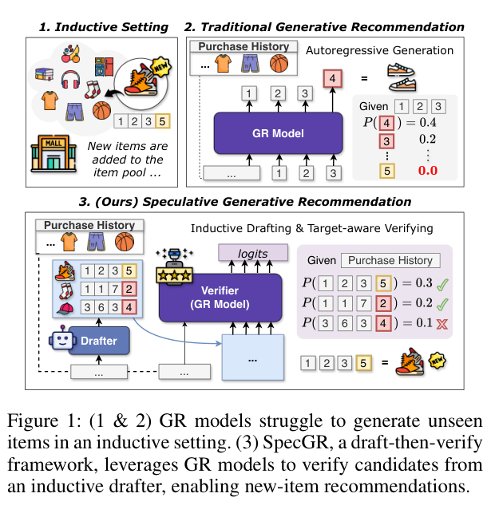
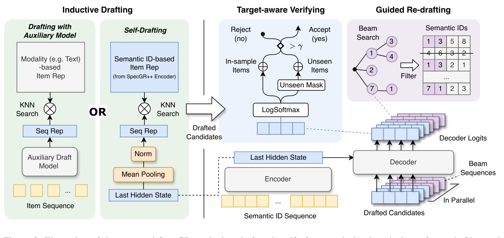
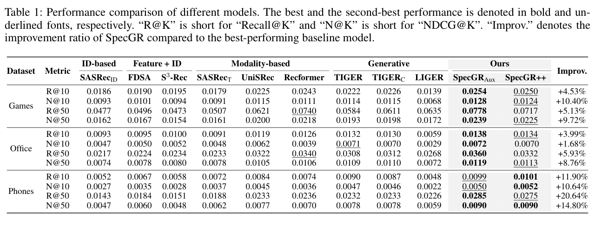
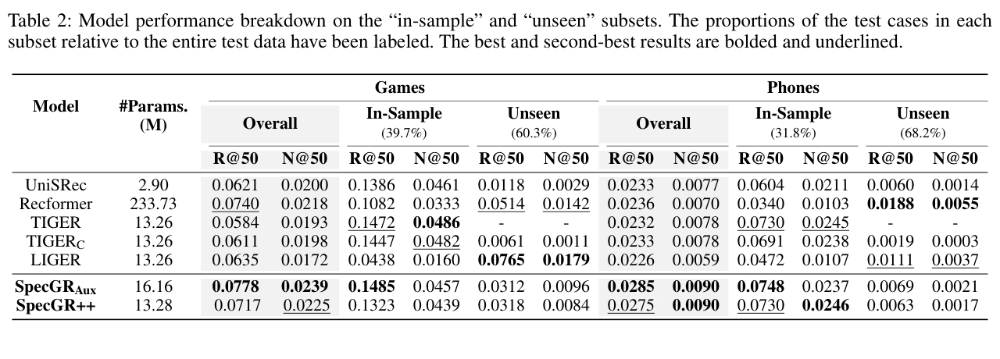
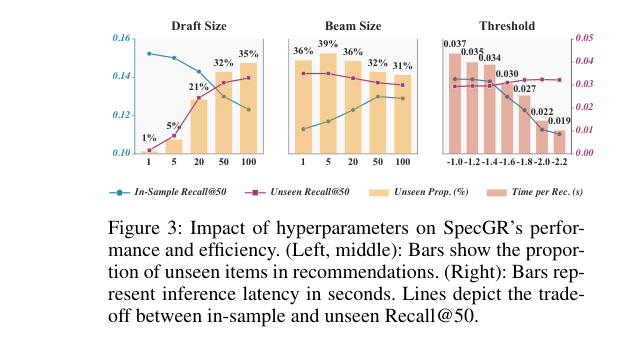

# Inductive Generative Recommendation via Retrieval-based Speculation

저자 :

Yijie Ding, Jiacheng Li, Julian McAuley, Yupeng Hou

University of California, San Diego

발표 : AAAI 2026

논문 : [PDF](https://arxiv.org/pdf/2410.02939)

출처 : [https://arxiv.org/abs/2410.02939](https://arxiv.org/abs/2410.02939)

코드 : [https://github.com/Jamesding000/SpecGR](https://github.com/Jamesding000/SpecGR)

---

## 0. Summary

<p align='center'>

</p>

### 0.1. 문제 (Problem)

* Generative Recommendation(GR) 모델(TIGER, DSI 등)은 아이템을 semantic ID(이산 토큰 시퀀스)로 토큰화하고 autoregressive하게 다음 토큰을 생성하여 추천한다. 의미 기반이므로 unseen item 추천 능력(inductive capability)이 있을 것으로 기대된다.
* 그러나 저자들의 실험 분석에 따르면 GR 모델은 **학습 중 본 semantic ID 시퀀스에만 높은 확률을 부여**하고, 새 아이템의 ID 패턴은 거의 생성하지 못한다. Table 2에서 TIGER의 unseen 부분 성능은 사실상 0이다.
* 기존 절충안(TIGER-C: 휴리스틱하게 unseen 아이템 섞기, LIGER: dense retrieval 결과 blending)은 GR 모델의 강한 ranking 능력을 충분히 활용하지 못하고, in-sample 성능을 희생시켜 overall 품질이 떨어진다.
* News/short-video처럼 새 아이템이 실시간으로 추가되는 환경에서 GR 모델은 사실상 사용 불가에 가깝다.

### 0.2. 핵심 아이디어 (Core Idea)

본 논문의 핵심은 LLM의 **speculative decoding(추측 디코딩)**을 추천 시스템 inductive 문제로 재해석하는 것이다.

* **(a) Speculative decoding이란?** — 원래 LLM 가속 기법으로, "작은 모델(drafter)이 빠르게 후보 토큰들을 미리 만들어 놓으면, 큰 모델(verifier)이 그 후보들을 한 번에 평가해서 받아들이거나 거절"하는 방식이다. 비유: **학생이 미리 답안을 적어두면 선생님이 채점만** 하는 식. 토큰을 매번 하나씩 생성하는 것보다 빠르다.

* **(b) SpecGR의 재해석** — 본 논문에서는 *가속*이 아니라 *능력 확장*을 위해 이 구조를 쓴다.
  * Drafter: **inductive 능력이 있는 모델**(KNN 기반, 예: UniSRec). 새 아이템도 검색 가능.
  * Verifier: **GR 모델**(예: TIGER). 입력 시퀀스에 대해 후보의 likelihood를 매겨 accept/reject.
  * 즉, "새 아이템을 *생성*하기는 어렵지만 *평가*하는 능력은 살아있다"는 통찰을 활용. GR 모델은 후보 아이템 $x_t$의 semantic ID 패턴이 입력 시퀀스 $X$ 다음에 올 확률 $P(\text{ID}_t \mid X)$만 계산하면 되므로, 학습에서 본 적 없는 ID 조합이라도 score를 줄 수 있다.

* **(c) Target-aware verification score** — Query Likelihood Model로 정의:

  $$V(x_t, X) = \frac{1}{l}\sum_{i=1}^{l}\log P(c_i^t \mid c_{<i}^t, X)$$

  여기서 $l$은 semantic ID 자릿수, $c_i^t$는 타겟 아이템의 $i$번째 ID digit이다. Unseen 아이템은 마지막 자리(item identification token)가 의미적 시그널이 없어 noise로 작용하므로 $l-1$자리까지만 평균낸다. 임계값 $\gamma$ 이상이면 accept.

* **(d) Guided re-drafting** — 첫 batch에서 K개를 못 채우면 drafter를 재호출해야 하는데, 그냥 다음 순위 후보를 가져오면 acceptance rate가 떨어진다. 그래서 verifier가 **beam search로 만든 ID prefix 집합 $B_j$**로 drafter의 후보 공간을 제약한다. 비유: 선생님이 "정답은 '3'으로 시작할 것 같아"라고 힌트를 주면 학생이 그 영역만 다시 뒤져보는 셈.

* **(e) SpecGR++ (self-drafting)** — 별도 drafter 유지 비용을 없애기 위해 **GR 모델 자신의 encoder**를 KNN drafter로 재활용. Contrastive pretraining + LTR fine-tuning으로 encoder hidden state를 좋은 inductive embedding으로 정렬한다.

### 0.3. 효과 (Effects)

* **Plug-and-play**: 기존 GR 모델 가중치를 건드리지 않고 (TIGER, DSI 모두) 그대로 verifier로 사용 가능.
* **Inductive 능력 부여**: 본래 unseen 추천이 거의 불가능했던 GR 모델이 unseen subset에서도 의미 있는 성능 확보.
* **In-sample 성능 보존**: 단순 blending과 달리 모든 최종 추천이 GR verifier의 score로 ranking되므로 기존 in-sample 강점을 유지.
* **파라미터 효율**: SpecGR++는 TIGER 대비 약 +0.02M 파라미터만 추가(13.26M → 13.28M)하고도 별도 drafter 버전(16.16M)에 준하는 성능 달성.
* **Adaptive exiting**: K개 accept되면 즉시 종료하므로 최악의 경우에도 일반 beam search보다 느리지 않다.

### 0.4. 결과 (Results)

세 Amazon Reviews 2023 데이터셋(Games, Office, Phones)에서 timestamp 기반 split로 평가.

* **Overall 성능 (Table 1)**: 최고 기존 baseline 대비 NDCG@50 기준 +9.72%(Games) / +8.76%(Office) / +14.80%(Phones), Recall@50 기준 최대 +20.64%(Phones) 향상.
* **Subset 분석 (Table 2, Games)**: TIGER는 Unseen R@50이 거의 0이지만 SpecGR-Aux는 0.0312, SpecGR++는 0.0318까지 도달하면서도 In-Sample R@50은 각각 0.1485 / 0.1323으로 TIGER(0.1472)에 비해 유지/향상.
* **Plug-and-play (Table 4)**: TIGER에는 +16.6\~23.8% NDCG@50 향상, DSI 백본에서도 +9.6\~11.1% 향상으로 backbone 무관 효과 입증.
* **Ablation (Table 3)**: inductive drafting, likelihood adjustment, guided re-drafting, re-ranking, adaptive exiting 모두 제거 시 성능 하락 확인.

### 0.5. 상세 동작 방식 (How It Works)

전체 inference loop은 "draft → verify → (필요 시 re-draft) → exit"의 반복이다.

```
[유저 시퀀스 X]
        │
        ▼
┌───────────────────────────┐
│ Step 1: Inductive Drafting│   Drafter D(·) — UniSRec or GR Encoder
│   D(X) → 후보 δ개 (Q)      │   modality/semantic-ID KNN 검색
└──────────────┬────────────┘   (in-sample + unseen 혼합 가능)
               ▼
┌───────────────────────────┐
│ Step 2: Target-aware      │   GR Verifier V(·) — TIGER
│   Verifying               │   각 x_t에 대해 V(x_t, X) 계산
│   V(x_t,X) > γ ? accept   │   unseen은 마지막 ID digit 제외
└──────────────┬────────────┘
        accept 개수 < K ?
        ├── Yes ──┐
        │        ▼
        │  ┌──────────────────────┐
        │  │ Step 3: Guided        │   Verifier가 beam search로
        │  │   Re-drafting         │   ID prefix B_j 생성 →
        │  │   Q_j = D(X) ∩ B_j    │   다음 round 후보 공간 제약
        │  └──────────┬───────────┘
        │             │ loop (최대 l회)
        │             ▼
        │       Step 1로 복귀
        │
        └── No ──▶ Step 4: Adaptive Exiting
                   accepted K개를 V score로 ranking
                   (부족 시 beam sequences 보충)
                          │
                          ▼
                  [Top-K 추천 리스트]
```

**Step 1. Inductive Drafting**
입력 시퀀스 $X = [x_1, ..., x_w]$를 drafter에 통과시켜 $\delta$개 후보 $Q = D(X)$ 검색.
- *Auxiliary 방식*: UniSRec의 modality 기반 item embedding으로 KNN. 새 아이템 representation을 그대로 pool에 추가 가능.
- *Self-drafting (SpecGR++)*: GR encoder의 last hidden state를 mean-pool해서 아이템/시퀀스 representation을 얻고 KNN. 단, 그냥 쓰면 representation 품질이 낮아 contrastive loss $L_{CL}$로 사전학습 + cross-entropy로 fine-tuning한 multi-task 학습 필수($L = \lambda_1 L_{CL} + L_{Gen}$).

**Step 2. Target-aware Verifying**
각 후보 $x_t \in Q$에 대해 GR 모델이 $P(\text{ID}_t \mid X)$를 token-by-token으로 계산 → 식 (2)의 $V(x_t, X)$ score 산출. 임계값 $\gamma$를 넘기면 accept, 아니면 reject. Unseen 아이템은 identification token(마지막 digit)이 학습 분포 밖이라 noise만 발생하므로 score 계산에서 제외해 공정 비교.

**Step 3. Guided Re-drafting** (accept 부족 시)
Verifier가 beam search로 $j$자리 prefix 집합 $B_j$를 생성하고, drafter는 다음 round에서 prefix가 $B_j$에 속하는 후보만 제안: $Q_j = \{x_i \in D(X) \mid (c^i_1,...,c^i_j) \in B_j\}$. 이렇게 verifier 분포에 align된 후보를 다시 받음 → acceptance rate 회복. 최대 $l$(ID 길이) 회 반복.

**Step 4. Adaptive Exiting**
누적 accepted가 K개에 도달하면 즉시 loop 종료, 최종 list를 $V$ score 기준 정렬. K 미달 시 beam sequence를 채워 보강. 최악의 경우에도 beam decoding과 동일한 latency 보장.

---

## 1. Introduction

Generative Recommendation(GR)은 sequential recommendation의 새 패러다임으로, 각 아이템을 짧은 discrete token sequence(**semantic ID**)로 토큰화한 뒤 transformer가 다음 토큰을 autoregressive하게 생성하도록 학습한다. TIGER, OneRec과 같은 대표 모델들이 이 패러다임을 따르며, 기존 SASRec/BERT4Rec같은 transductive ID 기반 모델보다 scaling law 측면에서 유리하고, 메모리 효율적이며, retrieval-ranking 통합 가능성도 보였다.

GR의 *이론적* 장점 중 하나는 **inductive 능력**이다. semantic ID는 의미 기반 토큰이므로, 학습 시 본 적 없는 아이템이라도 같은 토큰 조합이 등장하면 모델이 자연스레 생성할 수 있을 것이라 기대된다. 하지만 저자들의 분석은 정반대였다: GR 모델은 학습 데이터의 ID 패턴에 강하게 overfit되어 unseen ID 시퀀스에 거의 0에 가까운 likelihood를 부여한다. Beam search로 디코딩해도 결과는 "본 적 있는 ID"의 조합에 집중된다.

이 문제를 풀려는 기존 시도는 두 갈래였다.
- *Heuristic blending*: TIGER-C처럼 unseen 아이템을 고정 비율로 추천 리스트에 끼워 넣는 방식. 단순하지만 ranking 품질이 무너진다.
- *Dense retrieval blending*: LIGER처럼 KNN retrieval 결과와 GR 출력을 섞기. 그러나 *섞는* 단계에서 GR 모델의 평가 능력을 충분히 활용하지 못한다.

저자들의 통찰은, GR 모델이 unseen 아이템을 **생성**하지 못해도 입력 시퀀스 다음에 그 아이템이 올 **확률을 채점**하는 능력은 살아있다는 점이다. 따라서 *생성* 책임을 inductive drafter(예: UniSRec, GR encoder)에 위임하고, GR은 *verifier* 역할에 집중시키는 draft-then-verify 구조가 자연스럽다. 본 논문은 이를 LLM의 speculative decoding 프레임에서 차용하여 **SpecGR**을 제안한다.

## 2. Method

### 2.1 Problem Formulation

입력은 시간순으로 정렬된 아이템 시퀀스 $\{x_1, x_2, ..., x_w\}$이며 각 아이템 $x \in I$는 텍스트(title, description, category 등) feature를 갖는다. 다음 아이템을 예측하는 것이 task이며, *inductive setting*에서는 target이 학습셋에 없는 새 아이템일 수 있다.

GR 모델은 각 아이템 $x_i$를 semantic ID $\text{ID}_i = [\langle c^i_1\rangle, \langle c^i_2 \rangle, ..., \langle c^i_l \rangle]$로 토큰화하고, 입력을 다음과 같이 구성한다:

$$X = [\langle \text{bos} \rangle, \text{ID}_1, \text{ID}_2, ..., \text{ID}_w, \langle \text{eos} \rangle]$$

학습 후에는 top-K 확률의 semantic ID 패턴을 디코딩하여 추천 아이템으로 parse한다. 새 아이템도 미리 semantic ID가 할당되어 있다고 가정.

<p align='center'>

</p>

### 2.2 SpecGR Framework

네 컴포넌트로 구성:

1. **Inductive Drafting**: drafter $D(\cdot)$가 $Q = D(X)$, $|Q|=\delta$개의 후보를 제안. 기존 speculative decoding과 달리 drafter가 verifier의 homologous 모델일 필요가 없다. 대신 **새 능력(inductive)**을 verifier에 주입하는 것이 목표.

2. **Target-aware Verifying**: GR 모델을 Query Likelihood Model로 사용. 후보 $x_t$의 verification score는

   $$V(x_t, X) = \begin{cases} \dfrac{1}{l}\displaystyle\sum_{i=1}^{l}\log P(c^t_i \mid c^t_{<i}, X) & \text{if } x_t \in I \\[6pt] \dfrac{1}{l-1}\displaystyle\sum_{i=1}^{l-1}\log P(c^t_i \mid c^t_{<i}, X) & \text{if } x_t \in I^* \setminus I \end{cases}$$

   여기서 $l$은 semantic ID 자릿수. Unseen 아이템은 마지막 자리(item identification token, 충돌 회피용으로 추가된 의미 없는 토큰)를 score 계산에서 제외하여 unseen에 대한 unfair penalty를 제거. ID 길이 정규화로 길이 편향도 보정. $V(x_t, X) > \gamma$이면 accept.

3. **Guided Re-drafting**: 첫 batch에서 K개를 못 채우면 후속 batch가 필요. 자연스럽게 ranking 하위 후보를 가져오면 acceptance rate가 급락하므로, verifier가 beam search로 만든 $j$자리 prefix 집합 $B_j$로 drafter의 후보 공간을 제약:

   $$Q_j = \{x_i \mid x_i \in D(X), (c^i_1, c^i_2, ..., c^i_j) \in B_j\}$$

   $\beta$는 beam size 하이퍼파라미터. 이 과정은 verifier의 beam decoding과 동기 진행되며 최대 $l$회.

4. **Adaptive Exiting**: accepted 개수가 K에 도달하면 즉시 종료. K개에 못 미치면 beam sequences로 채움. 최악 case에서도 일반 beam search 대비 추가 latency 없음.

### 2.3 Drafting Strategies

**(1) Auxiliary draft model.** UniSRec 등 modality 기반 inductive 모델 사용. 새 아이템 representation을 바로 item pool에 추가하면 KNN으로 즉시 검색 가능. 유연성은 좋지만 별도 모델 유지/통신 overhead, distribution shift 위험.

**(2) Self-drafting via GR Encoder (SpecGR++).** GR encoder를 그대로 drafter로 재활용.
- *Representations*: 시퀀스는 식 (1) 형식, 단일 아이템은 $[\langle\text{bos}\rangle, \text{ID}_i, \langle\text{eos}\rangle]$로 인코딩. 둘 다 encoder의 last hidden state에 mean pooling을 적용.
- *Contrastive pretraining*: encoder hidden state가 그냥 쓰기엔 representation으로 부적합하다는 선행 연구를 따라, InfoNCE 형태의 contrastive loss

  $$L_{CL} = -\frac{1}{B_{emb}} \sum_{j=1}^{B_{emb}} \log \frac{\exp(s_j \cdot i_j / \tau)}{\sum_{j'} \exp(s_j \cdot i_{j'} / \tau)}$$

  를 next-token generation loss $L_{Gen}$과 multi-task로 학습. $L = \lambda_1 L_{CL} + L_{Gen}$, $B_{emb}=2048 > B_{gen}=256$로 in-batch negative 확보.
- *Learning-to-rank fine-tuning*: 큰 negative batch(전체 $|I|$)에 대한 cross-entropy $L_{CE}$로 추가 finetune, item rep는 freeze하여 효율화. $L' = \lambda_2 L_{CE} + L_{Gen}$.

## 3. Experiments

### 3.1 Setup

- **데이터셋**: Amazon Reviews 2023의 Video Games, Office Products, Cell Phones & Accessories 3개 카테고리. 5-core 필터링, **timestamp 기반 split**(leave-last-out이 아닌 시간 cut-off)으로 자연스럽게 unseen 아이템이 valid/test에 등장.
- **Baseline**: SASRec-ID / SASRec-T(텍스트 feature 사용 변형), FDSA / S3-Rec(feature+ID), UniSRec / RecFormer(modality), TIGER / TIGER-C / LIGER(generative).
- **변형**: SpecGR-Aux(UniSRec drafter + TIGER verifier), SpecGR++(GR encoder self-drafter + TIGER verifier).
- **Metric**: Recall@K, NDCG@K (K ∈ {10, 50}). 전체뿐 아니라 **In-Sample / Unseen subset** 분리 평가.
- **하이퍼파라미터**: 시퀀스 길이 20, $\lambda_1=\lambda_2=6.0$, 임계값 $\gamma$ / beam size $\beta$ / draft size $\delta$는 validation으로 tuning.

### 3.2 Overall Performance (RQ1)

<p align='center'>

</p>

Table 1: 세 데이터셋 모두에서 SpecGR-Aux 또는 SpecGR++가 best.
- Games R@50: UniSRec 0.0621 → SpecGR-Aux **0.0778** (+5.13% over best baseline RecFormer 0.0740)
- Phones N@50: UniSRec 0.0077 → SpecGR-Aux/++ **0.0090** (+14.80%)
- Phones R@50: +20.64%로 가장 큰 향상

Table 2 (Games / Phones subset 분석):
- TIGER: In-Sample R@50 = 0.1472(Games) 강력하지만 Unseen에서는 사실상 0
- LIGER: Unseen R@50 = 0.0765 높지만 In-Sample 0.0438로 trade-off가 나쁨
- **SpecGR-Aux**: In-Sample 0.1485 (TIGER와 동급) + Unseen 0.0312 → 양쪽 모두 견조
- SpecGR++: 13.28M params로 16.16M짜리 SpecGR-Aux와 거의 동등한 성능

### 3.3 Ablation (RQ2)

<p align='center'>

</p>

Table 3 — SpecGR++의 inference / training 컴포넌트 제거 실험:
- (1.1) inductive drafting 제거 → R@50 0.0717 → 0.0609 (Games)
- (1.2) likelihood adjustment 제거 → unseen에 대한 unfair penalty 발생, in-sample 살짝 올라가지만 전체 N@50 하락
- (1.3) guided re-drafting 제거 → 거의 모든 metric에서 하락
- (1.4) re-ranking 제거 / (1.5) adaptive exiting 제거 모두 성능 저하
- (2.1) 그냥 TIGER encoder만 → unseen 추천 능력 거의 없음
- (2.2) contrastive pretraining 제거 → representation 품질 폭락
- (2.3) fine-tuning 제거 → ranking 능력 약화

### 3.4 Hyperparameter Sensitivity (RQ3)

<p align='center'>

</p>

Figure 3 (Games):
- **Draft size $\delta$**: 클수록 unseen 비율 증가하지만 in-sample 떨어질 수 있음 (accept slot 고정)
- **Beam size $\beta$**: 클수록 in-sample은 좋아지지만 unseen 능력 감소
- **Threshold $\gamma$**: latency-성능 trade-off 조절. 너무 낮으면 in-sample 무너짐. elbow rule로 선정.

### 3.5 Plug-and-Play Test (RQ4)

Table 4 — TIGER, DSI 두 GR backbone × Semantic-KNN / UniSRec / GR Encoder 세 drafter 조합:
- TIGER 기반: O-N@50 0.0193 → 최대 0.0239 (UniSRec drafter, +23.8%)
- DSI 기반: 0.0198 → 0.0220 (+11.1%)
- 모든 조합에서 일관된 향상 + unseen 능력 확보 → drafter/backbone 무관 plug-and-play 입증.

## 4. Conclusion

본 논문은 GR 모델이 새 아이템을 거의 추천하지 못한다는 실증 문제를 출발점으로, **LLM의 speculative decoding을 가속이 아닌 능력 확장 용도로 재해석**한 SpecGR 프레임워크를 제안한다. inductive drafter가 후보를 만들고 GR verifier가 target-aware likelihood로 채점/순위화함으로써, in-sample 성능 손실 없이 unseen 추천 능력을 GR 모델에 주입한다. Guided re-drafting과 adaptive exiting으로 효율도 보장하며, SpecGR++는 GR encoder를 재활용해 추가 파라미터 없이 동등 성능을 낸다. 세 Amazon Reviews 데이터셋에서 다양한 GR backbone과 drafter 조합에 대해 일관된 향상을 보였다.

**(요약자 commentary)** "생성은 못해도 채점은 잘 한다"는 통찰을 speculative decoding이라는 깔끔한 구조로 풀어낸 점이 인상적이다. 특히 verifier likelihood에서 item identification token을 제외하는 식 (2)의 보정은 작지만 결정적인 디테일이다. 다만 drafter 품질에 inductive 능력이 사실상 종속되므로, drafter가 약한 도메인(예: 콜드 텍스트가 빈약한 카테고리)에서는 한계가 있을 것이다. 또한 모든 후보에 대해 GR forward를 돌려야 하므로 draft size가 커질수록 inference cost가 늘어, latency-quality trade-off를 production에서 정밀하게 잡아야 할 것으로 보인다.

---

## 부록: 사전 지식 (Prerequisites)

### A.1. 알아야 할 핵심 개념

- **Generative Recommendation (GR) / Semantic ID** — 각 아이템을 이산 토큰 시퀀스(semantic ID)로 변환한 뒤, Transformer가 다음 토큰을 autoregressive하게 생성하는 방식으로 추천을 수행하는 패러다임.
  - 본문 위치: §Problem Formulation(§2.1), Introduction 전반. 본 논문의 verifier(검증자) 역할을 담당하는 TIGER가 GR 모델임.

- **RQ-VAE (Residual Quantization VAE)** — 아이템의 텍스트/모달리티 임베딩을 Residual Vector Quantization으로 이산화하여 계층적 semantic ID를 생성하는 모델.
  - 본문 위치: TIGER의 토큰화 방식이자 semantic ID 구성 기반(§2.1). 각 자릿수(digit)의 의미 구조를 이해하려면 필수.

- **순차 추천 (Sequential Recommendation)** — 사용자의 아이템 상호작용 시간 순 이력을 입력으로 다음에 클릭/구매할 아이템을 예측하는 태스크. SASRec, BERT4Rec이 대표 모델.
  - 본문 위치: 논문의 전체 task 정의(§2.1). 비교 baseline 대부분이 이 패러다임을 따름.

- **Speculative Decoding (추측 디코딩)** — 작은 draft 모델이 토큰 후보를 미리 제안하면 큰 verifier 모델이 한 번에 accept/reject해 autoregressive 생성을 가속하는 LLM 기법.
  - 본문 위치: SpecGR의 핵심 구조적 영감원(§Core Idea, §SpecGR Framework). 단, 본 논문은 가속이 아닌 inductive 능력 확장 목적으로 이 구조를 재해석함.

- **Inductive vs. Transductive 추천 설정** — Transductive: 학습 시 본 아이템 ID만 추천 가능. Inductive: 학습 때 없었던 새 아이템도 추천 가능. GR 모델의 이론적 장점으로 기대되지만 실제로는 inductive 능력이 극히 제한됨.
  - 본문 위치: 논문의 핵심 문제 정의(Introduction, §2.1). unseen/in-sample subset 분리 평가(§3.2)와 직결.

- **Query Likelihood Model (쿼리 우도 모델)** — 정보 검색에서 문서가 쿼리를 생성할 확률로 문서를 스코어링하는 모델. 본 논문에서는 GR verifier가 타겟 아이템의 semantic ID를 생성할 likelihood로 후보를 채점하는 방식으로 적용됨.
  - 본문 위치: Target-aware Verifying(§2.2, 식 (2)). verification score V(x_t, X) 정의의 수식적 기반.

- **Beam Search 디코딩** — 각 스텝에서 상위 β개 가설(prefix)을 유지하며 확률이 높은 시퀀스를 탐색하는 생성 알고리즘.
  - 본문 위치: Guided Re-drafting(§2.2 Step 3)에서 verifier가 ID prefix 집합 B_j를 생성할 때 사용. Adaptive Exiting의 폴백(fallback)으로도 등장.

- **InfoNCE / Contrastive Learning** — 양성 쌍의 유사도를 높이고 배치 내 음성 쌍과의 유사도를 낮추는 대조 학습 손실함수. 표현 공간의 품질을 높이는 데 효과적.
  - 본문 위치: SpecGR++ self-drafting의 encoder contrastive pretraining(§2.3, L_CL 식). GR encoder hidden state를 KNN 검색에 적합한 표현으로 정렬하기 위해 사용.

- **KNN 기반 밀집 검색 (Dense Retrieval / KNN)** — 쿼리와 아이템 임베딩 간 cosine 또는 내적 유사도로 근접 이웃을 검색하는 방법. 새 아이템 임베딩을 풀에 추가하면 즉시 검색 가능해 inductive 설정에 적합.
  - 본문 위치: Inductive Drafting(§2.2 Step 1, §2.3). Auxiliary 및 Self-drafting 모두 KNN으로 후보를 제안함.

---

### A.2. 먼저 읽으면 좋은 논문

1. **[2023][TIGER]** ([arxiv:2209.07663](https://arxiv.org/abs/2209.07663)) — RQ-VAE로 semantic ID를 생성하고 T5 기반 GR 모델로 추천하는 대표 generative recommendation 모델.
   - **왜?** 본 논문의 주 verifier backbone이자 핵심 비교 대상. TIGER의 구조와 한계(unseen 추천 불가)를 이해해야 SpecGR의 동기를 파악할 수 있음.
   - **Repo 내 정리**: [[논문][2023][Summary][TIGER] Recommender Systems with Generative Retrieval.md]([논문][2023][Summary][TIGER]%20Recommender%20Systems%20with%20Generative%20Retrieval.md)

2. **[2023][Speculative Decoding]** ([arxiv:2211.17192](https://arxiv.org/abs/2211.17192)) — draft 모델과 verifier 모델의 draft-then-verify 구조로 LLM 추론을 가속하는 기법.
   - **왜?** SpecGR의 핵심 구조적 영감원. draft/verify 분리, acceptance 기준, adaptive exiting의 개념이 모두 여기서 비롯됨.
   - **Repo 내 정리**: [[논문][2023][Speculative Decoding] Fast Inference from Transformers via Speculative Decoding.md](../General_AI/[논문][2023][Speculative%20Decoding]%20Fast%20Inference%20from%20Transformers%20via%20Speculative%20Decoding.md)

3. **[2022][UniSRec]** ([arxiv:2206.05941](https://arxiv.org/abs/2206.05941)) — 아이템 텍스트 기반 universal sequence representation을 학습해 cross-domain inductive 추천을 가능하게 하는 모델 (KDD 2022).
   - **왜?** SpecGR-Aux의 auxiliary drafter로 직접 사용됨. modality 기반 KNN drafting의 원리를 이해하는 데 필수.

4. **[2018][SASRec]** ([arxiv:1808.09781](https://arxiv.org/abs/1808.09781)) — Transformer self-attention으로 사용자 행동 시퀀스를 모델링하는 순차 추천의 표준 baseline (ICDM 2018).
   - **왜?** 논문의 transductive baseline 중 가장 핵심. sequential recommendation task의 정의와 일반적인 평가 프로토콜(leave-last-out, Recall/NDCG)을 이해하는 기준점.

5. **[2022][DSI]** ([arxiv:2202.06991](https://arxiv.org/abs/2202.06991)) — Transformer 모델 파라미터에 문서 corpus를 인덱싱하고 관련 문서 ID를 직접 생성하는 generative retrieval의 원형 (NeurIPS 2022).
   - **왜?** TIGER와 함께 SpecGR의 plug-and-play 실험(Table 4)에서 두 번째 GR backbone으로 사용됨. GR의 개념적 뿌리이기도 함.

6. **[2024][LIGER]** ([arxiv:2411.18814](https://arxiv.org/abs/2411.18814)) — generative retrieval과 dense retrieval을 통합하여 cold-start 아이템 추천을 개선하는 hybrid 모델.
   - **왜?** 본 논문이 직접 비교/극복 대상으로 지목하는 가장 강력한 경쟁 기법. LIGER의 "blending" 방식의 한계(in-sample 성능 희생)가 SpecGR의 동기를 구체화함.

---

### A.3. 관련/후속 논문

- **[2026][Cold-Starts in GR: A Reproducibility Study]** ([arxiv:2603.29845](https://arxiv.org/abs/2603.29845)) — SpecGR 등 cold-start 대응 GR 모델들을 통일된 평가 설정으로 재현하고 key design choice의 효과를 분리 분석한 연구. SpecGR의 평가 설계 상의 논점을 점검하는 데 유용.

- **[2026][GenRecEdit]** ([arxiv:2603.14259](https://arxiv.org/abs/2603.14259)) — model editing 기법으로 GR 모델에 cold-start 아이템 정보를 주입하는 접근. SpecGR과 같은 cold-start 문제를 retraining 없이 푸는 다른 방향.

- **[2024][HSTU]** — 트릴리언 파라미터 규모의 sequential transducer 기반 GR 확장 연구. GR 패러다임의 산업 규모 scaling 방향을 보여주는 관련 연구.
  - **Repo 내 정리**: [[논문][2024][Summary][HSTU] Actions Speak Louder than Words - Trillion-Parameter Sequential Transducers for Generative Recommendations.md]([논문][2024][Summary][HSTU]%20Actions%20Speak%20Louder%20than%20Words%20-%20Trillion-Parameter%20Sequential%20Transducers%20for%20Generative%20Recommendations.md)
