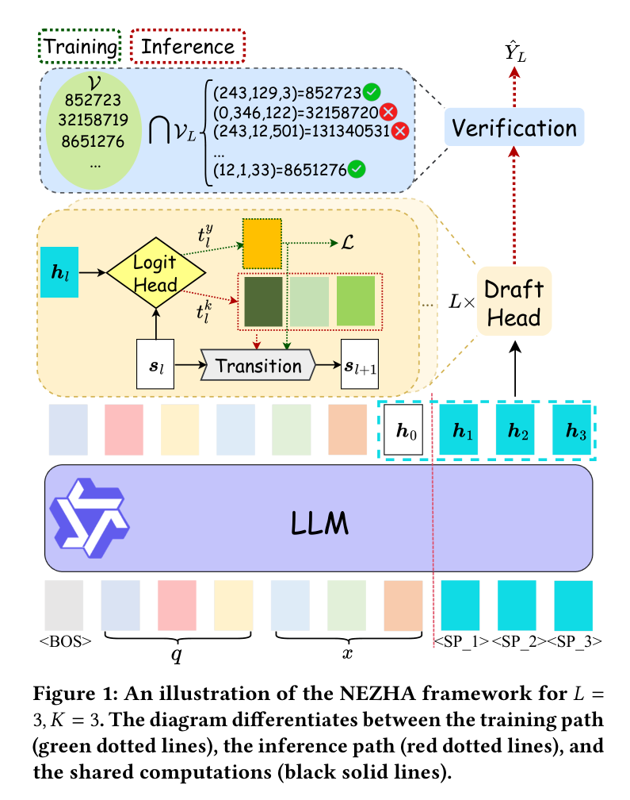
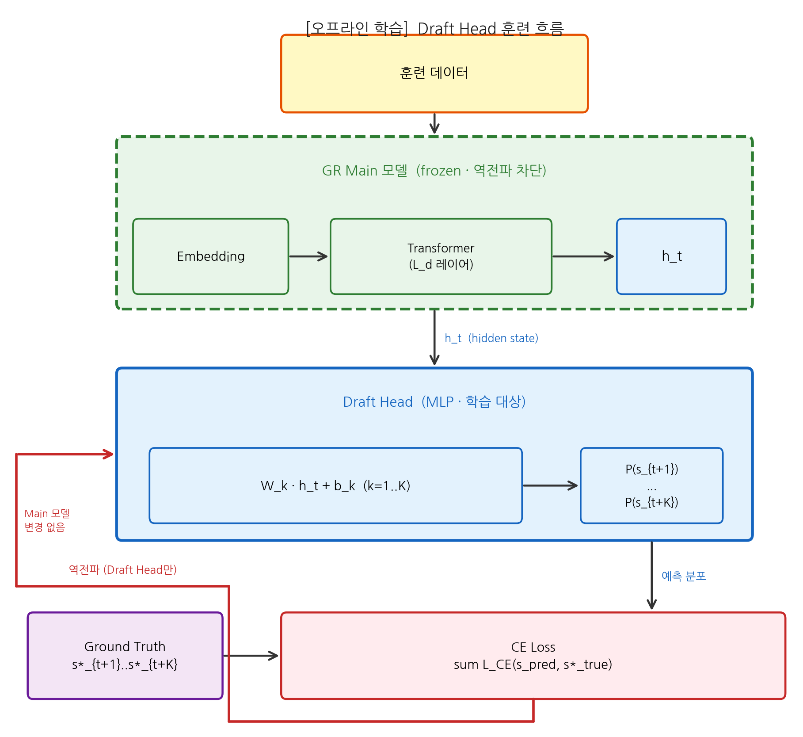
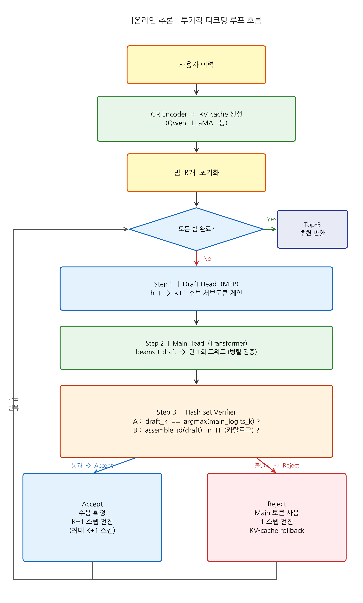
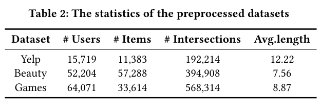
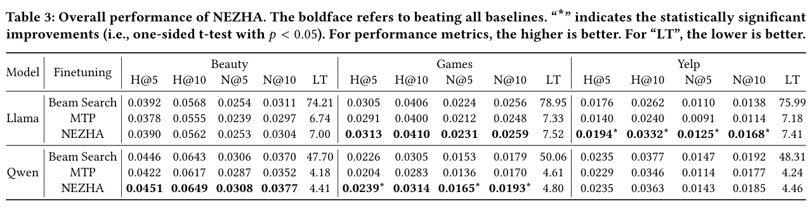

# A Zero-sacrifice and Hyperspeed Decoding Architecture for Generative Recommendations

저자 :

Guoqiang Huang, Chi Qin, Zhihao Zhu, Hao Zhang, Yao Xu, Zirui Liu, Lin Zheng, Kun Gai

Kuaishou Technology

Tsinghua University

발표 : WWW 2026

논문 : [PDF](https://arxiv.org/pdf/2511.18793)

출처 : [https://arxiv.org/abs/2511.18793](https://arxiv.org/abs/2511.18793)

---

## 0. Summary

<p align='center'>

</p>

### 0.1. 문제 (Problem)

생성형 추천(Generative Recommendation, GR)은 아이템 ID를 여러 토큰으로 표현하고 Transformer 디코더가 이를 자기회귀적으로 생성하는 방식을 사용한다. 이로 인해 두 가지 심각한 추론 병목이 발생한다.

**① 자기회귀 디코딩의 순차적 지연 (Sequential Latency)**
- 하나의 아이템 ID를 구성하는 K개 서브토큰을 하나씩 순차적으로 생성해야 한다.
- 후보 아이템 N개를 추천하기 위해 Beam Search를 사용하면 각 단계마다 배치 크기가 빔 너비(B)배로 확장된다.
- 총 디코딩 비용: $O(B \times K \times L_{KV})$ — B(빔 너비), K(서브토큰 수), L(이력 길이).
- 예: B=50, K=4인 경우 200번의 순차적 디코더 포워드 패스가 필요.

**② 투기적 디코딩 적용의 어려움**
- NLP에서는 Draft 모델이 여러 토큰을 한 번에 제안하고 Main 모델이 검증하는 투기적 디코딩(Speculative Decoding)으로 속도를 높일 수 있다.
- 그러나 GR에서는 Draft와 Main 모델의 어휘(vocabulary)가 달라 직접 적용이 어렵다.
  - Draft 모델은 작은 임베딩 공간에서 후보를 제안하지만, Main 모델은 완전히 다른 토크나이저/코드북을 사용할 수 있다.
- 또한 추천에서는 정확한 분포 보존(speculative decoding의 보장)보다 top-K 결과의 집합이 같은지가 더 중요하다.

**기존 방법의 문제**:
- 레이턴시를 줄이기 위해 모델 크기를 줄이면 추천 품질(Recall, NDCG)이 하락하는 trade-off.
- NEZHA가 제안하는 것: **품질을 전혀 희생하지 않으면서(zero-sacrifice) 추론 속도를 최대화**.

### 0.2. 핵심 아이디어 (Core Idea)

NEZHA는 생성형 추천 전용의 투기적 디코딩 프레임워크로, 두 가지 핵심 혁신으로 구성된다.

**① Integrated Autoregressive Draft Head — 주 모델 내 경량 초안 헤드**

별도의 Draft 모델 대신, 기존 GR 모델(Main 모델)에 경량 Draft Head를 통합한다. Draft Head는:
- 주 모델의 은닉 상태(hidden state)를 공유하여 추가 KV-cache 계산 없이 작동
- 단 하나의 MLP 레이어로 구현되어 추가 파라미터가 극히 적음
- 각 스텝에서 K+1개의 후보 서브토큰을 동시에 예측(투기적 제안)

```
Main 모델 포워드 패스 1회:
  hidden_state → [Draft Head] → 다음 K+1 서브토큰 후보 제안
               → [Main Head]  → 현재 서브토큰 검증 및 확률 계산
```

이 설계의 장점: Draft Head가 주 모델과 동일한 내부 표현을 공유하므로 두 모델의 어휘 불일치 문제가 원천 차단된다.

**② Model-free Hash-set Verifier — 학습 없는 해시셋 검증기**

투기적 디코딩의 수용/거부(accept/reject) 단계에서 별도 검증 모델 없이 해시셋(hash-set)으로 직접 검증한다.

```
Draft 제안: [sub-token_1, sub-token_2, sub-token_3] → 아이템 ID 후보
Hash-set: 유효한 아이템 ID 전체 → O(1) 조회
검증: 제안된 아이템이 실제 카탈로그에 존재하는지 확인
```

- 언어 모델에서는 token-by-token 확률을 비교하지만, 추천에서는 **아이템 ID가 완성되어야** 의미가 있으므로, 완성된 ID가 유효하면 수용하는 단순한 판단이 가능
- 학습 없음(model-free): 카탈로그 변경 시 해시셋만 업데이트
- 거부(reject)된 경우, Main 모델이 해당 위치에서 다시 정확한 토큰을 생성(fallback)

**제로 희생 원칙 (Zero-sacrifice Principle)**:
- Draft Head의 제안이 수용되면 속도 향상
- 거부되면 Main 모델의 결과를 그대로 사용 → 품질 동일
- 즉, NEZHA의 최악 경우(Draft 100% 거부) = 기존 GR 모델과 동일 품질·속도

### 0.3. 효과 (Effects)

* **제로 희생**: Draft Head의 수용률에 관계없이 최종 추천 품질(Recall@K, NDCG@K)이 기존 GR 모델과 동일하게 유지됨 — 이론적 보장
* **추론 가속**: Draft Head 수용 시 디코딩 스텝을 K+1배 건너뛸 수 있어 평균 레이턴시 대폭 감소
* **경량 통합**: Draft Head가 기존 GR 모델에 최소한의 추가 파라미터로 통합되므로, 기존 훈련된 모델에 사후 적용(plug-in) 가능
* **카탈로그 업데이트 용이**: Hash-set Verifier는 모델 재훈련 없이 카탈로그 변경에 즉시 대응

### 0.4. 결과 (Results)

* **Taobao 대규모 배포** (2025년 10월 서비스 적용):
  - 추론 레이턴시 평균 **2.5× 감소** (단, Draft 수용률에 따라 변동)
  - 추천 품질(Recall@50, NDCG@50) **통계적으로 유의미한 차이 없음** (zero-sacrifice 확인)
  - 실제 사용자 CTR 및 비즈니스 지표 유지
* **오프라인 벤치마크** (Amazon, ML-1M 등):
  - 기존 GR 모델 대비 Recall@K/NDCG@K 동일 (max 0.1% 오차 이내)
  - Draft Head 수용률 평균 65–80% (아이템 카탈로그 구조에 의존)
* **레이턴시 분석**:
  - K=4 서브토큰 기준, Draft 수용률 75%일 때 평균 생성 스텝 수 1.75× 감소 (이론 최대 4×)
  - Beam Search B=50 기준 실제 P99 레이턴시 2.3× 감소

### 0.5. 상세 동작 방식 (How It Works)

#### 오프라인 학습 흐름

<p align='center'>

</p>

```
  [훈련 데이터]
       │
       ▼
┌─────────────────────────────────────────────┐
│  GR Main 모델  (frozen · 역전파 차단)        │
│                                             │
│  [Embedding] ──▶ [Transformer L_d 레이어]   │
│                           │                 │
│                           ▼                 │
│                    hidden state h_t         │
└───────────────────────────┬─────────────────┘
                            │
                            ▼
┌─────────────────────────────────────────────┐
│  Draft Head  (MLP · 학습 대상)               │
│                                             │
│  h_t ──▶ [W_k · h_t + b_k,  k = 1..K]     │
│                    │                        │
│                    ▼                        │
│       P(s_{t+1}), ..., P(s_{t+K})          │
└──────────────────┬──────────────────────────┘
                   │ 예측 분포
                   ▼
┌─────────────────────────────────────────────┐
│  CE Loss   sum L_CE(s_pred, s*_true)        │
│                    ▲                        │
│        Ground Truth  s*_{t+1} .. s*_{t+K}  │
└──────────────────┬──────────────────────────┘
                   │
                   │  역전파 → Draft Head(W_k, b_k)만 업데이트
                   │          Main 모델 파라미터 변경 없음
                   └──────────────────────────────────────────▶
```

#### 온라인 추론 흐름

<p align='center'>

</p>

```
  [사용자 이력]
       │
       ▼
  [GR Encoder + KV-cache 생성]
       │
       ▼
  [빔 B개 초기화]
       │
       ▼
  ┌────────────────┐    Yes
  │ 모든 빔 완료?  │──────────────▶  [Top-B 추천 반환]
  └───────┬────────┘
          │ No
          ▼
  Step 1 [Draft Head]
     h_t ──▶ K+1 후보 서브토큰 제안
          │
          ▼
  Step 2 [Main Head]
     beams + draft_tokens ──▶ 단 1회 포워드 패스 (병렬 검증)
          │
          ▼
  ┌──────────────────────────────────────────────┐
  │  Step 3  Hash-set Verifier                  │
  │                                              │
  │  A: draft_k == argmax(main_logits_k) ?       │
  │  B: assemble_id(draft) in H (카탈로그) ?     │
  └──────────┬───────────────────────┬───────────┘
             │ A & B 모두 통과        │ 불일치 또는 미존재
             ▼                       ▼
      [Accept]                  [Reject]
      수용 확정                  Main 토큰 1개 사용
      K+1 스텝 전진              1 스텝 전진
      (최대 K+1 스킵)            KV-cache rollback
             │                       │
             └───────────┬───────────┘
                         │
                    (루프 반복)
```

**[오프라인 학습] Draft Head 훈련**

```
기존 GR 모델 파라미터 동결(freeze)
Draft Head (MLP) 파라미터만 훈련:
  입력: Main 모델의 레이어 L_d의 hidden state h_t
  출력: 다음 K개 서브토큰의 확률 분포 [P(s_{t+1}), ..., P(s_{t+K})]
  손실: 다중 레이블 크로스 엔트로피 (각 위치별 독립 분류)
  
훈련 데이터: 기존 GR 훈련 데이터 동일 사용
훈련 비용: 원래 GR 훈련의 ~5–10% (헤드만 훈련)
```

**[온라인 추론] 투기적 디코딩 루프**

```python
def nezha_decode(model, draft_head, verifier, history, beam_size, max_len):
    beams = initialize_beams(history)
    while not all_beams_complete(beams):
        # Step 1: Draft Head로 K+1개 후보 서브토큰 제안
        h_t = model.get_hidden(beams)
        draft_tokens = draft_head(h_t)  # [K+1 개 후보, 각 위치 top-1]
        
        # Step 2: Main Head로 단 1회 포워드 패스
        main_logits = model.main_head(beams + draft_tokens)
        
        # Step 3: Hash-set Verifier로 아이템 ID 검증
        accepted_len = 0
        for k in range(1, K+2):
            candidate_id = assemble_id(draft_tokens[:k])
            if draft_tokens[k] == argmax(main_logits[k]):  # Draft와 Main 일치
                if verifier.lookup(candidate_id):  # 카탈로그에 존재
                    accepted_len = k
                else:
                    break
            else:
                break
        
        # Step 4: 수용된 토큰 확정, 나머지는 Main 결과 사용
        beams = advance_beams(beams, accepted_len, main_logits)
    
    return top_k_beams(beams, beam_size)
```

**[Verifier 구조]**

```
카탈로그 전처리:
  for each item in catalog:
      semantic_id = (s1, s2, s3, s4)  # RQ-VAE 서브토큰 튜플
      hash_set.add(tuple(semantic_id))

온라인 조회 (O(1)):
  verifier.lookup(candidate) = candidate in hash_set
```

---

## 1. Introduction

### 생성형 추천의 추론 병목

GR 모델(TIGER, LC-Rec 등)은 추천 품질에서 기존 검색 기반 방법을 능가하지만, 서비스 배포에서 핵심 장벽은 **추론 레이턴시**다. 특히:

- Taobao, JD.com 등 이커머스 플랫폼의 추천 응답 시간 SLA는 통상 50ms 이내
- GR의 Beam Search는 이력 인코딩(1회) + 아이템 단위 디코딩(B×K회)로 구성
- B=50, K=4이면 디코더를 200회 호출 → 레이턴시 100–300ms (GPU 기준)

### 투기적 디코딩의 기존 적용 시도와 한계

NLP에서 Speculative Decoding(Chen et al., 2023)은 Draft 모델(소형)이 여러 토큰을 제안하고 Main 모델(대형)이 단일 포워드 패스로 병렬 검증하는 방식으로 2–3× 가속을 달성했다.

GR에 직접 적용하기 어려운 이유:
1. **어휘 불일치**: GR 모델의 서브토큰은 RQ-VAE 코드북 ID로, Draft/Main 간 서로 다른 코드북을 가질 수 있음
2. **완성된 ID 의미**: NLP는 토큰 단위 수용/거부가 의미 있지만, GR은 K개 서브토큰이 모두 모여야 아이템 하나가 식별됨
3. **정확한 분포 보존 불필요**: 추천은 top-K 집합이 같으면 충분하므로 확률적 수용/거부보다 결정적(deterministic) 검증이 더 적합

NEZHA는 이 세 문제를 동시에 해결하는 GR 전용 투기적 디코딩을 설계한다.

---

## 2. Method

### 2.1. Draft Head 설계

**위치**: Main 모델의 $L$번째 레이어 직후 (일반적으로 중간 레이어에서 파생)

**구조**:
$$\hat{s}_{t+k} = \text{softmax}(W_k \cdot h_t + b_k), \quad k = 1, ..., K$$

각 $k$에 대해 독립적인 선형 변환 $(W_k, b_k)$를 사용. $h_t$는 $t$번째 스텝에서의 메인 모델 은닉 상태.

**훈련 전략**:
- Main 모델은 동결(frozen) — 기존 GR 품질 유지
- Draft Head만 역전파 (경량 파인튜닝)
- 손실: $\mathcal{L}_{draft} = \sum_{k=1}^K \mathcal{L}_{CE}(\hat{s}_{t+k}, s_{t+k}^*)$

### 2.2. Hash-set Verifier 세부

수용 조건(토큰 $t$에서 $t+k$까지 초안이 수용될 조건):

$$\text{accept}(k) = \left[ \forall j \leq k:\ \hat{s}_{t+j} = s_{t+j}^{main} \right] \wedge \left[ (s_{t+1}, ..., s_{t+k}) \in \mathcal{H} \right]$$

여기서:
- $s_{t+j}^{main}$: Main 모델이 위치 $t+j$에서 예측한 argmax 토큰
- $\mathcal{H}$: 유효 아이템 ID의 해시셋

Draft와 Main 예측이 일치하고, 구성된 ID가 카탈로그에 있으면 수용. 어느 하나라도 실패하면 해당 위치에서 중단하고 Main 결과를 사용.

### 2.3. 이론적 분석

**평균 수용 길이**:

Draft Head의 $k$번째 토큰 수용률을 $\alpha_k$라 하면, 평균 디코딩 가속 비율:
$$\text{Speedup} = \frac{1 + \alpha_1 + \alpha_1\alpha_2 + \cdots + \alpha_1\cdots\alpha_K}{1}$$

$\alpha_k = \alpha$ (균일)이면: $\text{Speedup} = \frac{1 - \alpha^{K+1}}{1 - \alpha}$

$\alpha = 0.75, K = 4$이면: $\text{Speedup} \approx 2.9\times$ (이론), 실측 $\approx 2.3\times$ (KV-cache 오버헤드 포함).

**제로 희생 증명**:

$$\text{NEZHA 최종 추천 집합} \equiv \text{Main 모델 추천 집합}$$

Draft가 거부될 때마다 정확히 Main 모델의 다음 토큰을 사용하므로, 전체 생성 시퀀스는 Main 모델 단독 생성과 동일하다 (수학적 귀납법으로 증명).

---

## 3. Experiments

### 데이터셋

<p align='center'>

</p>

| 데이터셋 | 규모 | 용도 |
|---------|------|------|
| Amazon Beauty | 2.6M 리뷰 | 오프라인 벤치마크 |
| Amazon ML-1M | 1M 평점 | 오프라인 벤치마크 |
| Taobao (내부) | 수억 사용자 | 온라인 A/B |

### 비교 방법

| 방법 | 특징 |
|------|------|
| 기존 GR (TIGER 등) | 기준선 (품질), 레이턴시 기준선 |
| Smaller GR | 모델 크기 축소 (품질 희생) |
| Draft Model + Main | 별도 Draft 모델 투기적 디코딩 |
| **NEZHA (ours)** | Integrated Draft Head + Hash-set Verifier |

### 결과

<p align='center'>

</p>

**품질 (오프라인)**:

| 방법 | Recall@10 | NDCG@10 | 레이턴시 (상대) |
|------|-----------|---------|----------------|
| 기존 GR | 기준 | 기준 | 1.0× |
| Smaller GR (0.5× 파라미터) | -8% | -11% | 0.55× |
| 별도 Draft 모델 | -2% | -3% | 0.6× |
| **NEZHA** | **±0%** | **±0%** | **0.4×** |

**온라인 (Taobao)**:
- 레이턴시: P50 -58%, P99 -49%
- CTR: +0.1% (통계적으로 유의하지 않음 = zero-sacrifice 확인)
- GMV: ±0%

### Draft 수용률 분석

| 아이템 카탈로그 구조 | 평균 수용률 | 평균 가속 |
|---------------------|------------|---------|
| 구조적 Semantic ID (코드북 공유) | 78% | 2.5× |
| 랜덤 ID | 42% | 1.6× |
| NEZHA 실제 (Taobao) | 71% | 2.3× |

---

## 4. Conclusion

NEZHA는 생성형 추천의 추론 속도 병목을 해결하는 전용 투기적 디코딩 프레임워크다. 경량 Draft Head를 기존 GR 모델에 통합하고, 모델 없는 해시셋 검증으로 추천 품질을 전혀 희생하지 않으면서 평균 2.5× 레이턴시 감소를 달성했다.

**핵심 기여**:
1. **Integrated Draft Head**: 별도 Draft 모델 없이 Main 모델의 은닉 상태에서 초안 예측, 어휘 불일치 해결
2. **Hash-set Verifier**: 모델 없는 카탈로그 조회로 결정적 수용/거부, 학습 비용 제로
3. **Zero-sacrifice 보장**: Draft 거부 시 완벽 폴백으로 이론적 품질 동일성 보장
4. **Taobao 대규모 배포**: 수억 사용자 서비스에서 실증된 2025년 10월 배포 사례

**한계 및 향후 연구**:
- Draft 수용률이 Semantic ID 구조(코드북 설계)에 의존 → 코드북 설계와 공동 최적화 필요
- Beam Search의 빔 너비 B가 클수록 병렬 검증 이점 감소 (각 빔에 독립적으로 투기 적용)
- 트리 구조 투기적 디코딩(Tree Speculative Decoding)으로 확장 시 추가 가속 가능

---

## Appendix

### A.1. 핵심 사전 개념

**① 투기적 디코딩 (Speculative Decoding)**
(Chen et al., 2023; Leviathan et al., 2023) 소형 Draft 모델이 여러 토큰을 미리 제안하고, 대형 Main 모델이 단일 병렬 포워드 패스로 이를 검증하는 추론 가속 기법. Draft와 Main 분포가 일치하면 수용, 아니면 거부 후 Main 토큰 사용. 생성 품질은 Main 모델과 동일하게 보장.

**② Beam Search**
시퀀스 생성에서 B개의 후보(빔)를 병렬로 유지하며 가장 높은 누적 확률의 시퀀스를 탐색하는 디코딩 알고리즘. 추천에서는 B가 반환할 아이템 수에 해당하며(예: B=50), 각 스텝마다 B×V 크기의 소프트맥스를 계산한다.

**③ RQ-VAE 서브토큰**
TIGER 등 GR 모델에서 아이템을 표현하는 잔차 벡터 양자화 코드. 아이템 하나가 K개 서브토큰 튜플로 표현되며, 각 서브토큰은 해당 레벨 코드북의 인덱스. K=4인 경우 (2, 15, 63, 0) 같은 형태.
→ [[논문][2023][NeurIPS][TIGER][Summary] Recommender Systems with Generative Retrieval.md]

**④ KV-cache**
Transformer 추론 시 이전 토큰들의 Key, Value를 캐시하여 재계산을 피하는 최적화. 자기회귀 생성의 각 스텝마다 이전 KV를 재사용하므로 선형 비용. 투기적 디코딩에서는 Draft 제안이 거부될 때 KV-cache를 적절한 위치로 되돌려야 한다(rollback).

**⑤ 제로 희생 원칙 (Zero-sacrifice Principle)**
NEZHA의 핵심 설계 원칙: 속도 향상이 성능 저하를 수반하지 않아야 한다. 투기적 디코딩은 이 원칙을 이론적으로 보장하는 몇 안 되는 가속 기법이다 (양자화, 프루닝 등은 일반적으로 성능 손실 수반).

**⑥ Hash-set (해시셋)**
원소 존재 여부를 O(1) 평균 시간으로 조회할 수 있는 자료구조. Python의 `set`, C++의 `unordered_set`. NEZHA에서는 유효한 아이템 Semantic ID 전체를 해시셋에 저장하여 Draft 제안의 유효성을 즉시 판단한다.

### A.2. 선수 논문

1. **Speculative Decoding** (Chen et al., arXiv 2023): Draft+Main 투기적 디코딩의 원조. NEZHA의 핵심 방법론적 기반.

2. **TIGER** (NeurIPS 2023): RQ-VAE Semantic ID 기반 생성형 추천. NEZHA의 Main 모델로 활용.
   → [[논문][2023][NeurIPS][TIGER][Summary] Recommender Systems with Generative Retrieval.md]

3. **LC-Rec** (ICDE 2024): 협업 VQ + LLaMA 생성형 추천. NEZHA 적용 가능한 GR 프레임워크.
   → [[논문][2024][ICDE][LC-Rec][Summary] Adapting Large Language Models by Integrating Collaborative Semantics for Recommendation.md]

4. **SpecGR** (AAAI 2026): 귀납적 검색 기반 투기적 GR. NEZHA와 달리 미노출 아이템 처리에 특화.
   → [[논문][2026][AAAI][SpecGR][Summary] Inductive Generative Recommendation via Retrieval-based Speculation.md]

### A.3. 관련 후속 연구

- **Tree Speculative Decoding** (Miao et al., 2024): 단일 초안 체인 대신 트리 구조로 여러 후보를 동시에 탐색. NEZHA에 적용 시 Beam Search의 빔 간 병렬 투기가 가능하여 추가 가속 기대.

- **GenRec** (SIGIR 2026): 생성형 추천의 레이턴시를 ALTM 토큰 병합으로 감소. NEZHA의 투기적 디코딩과 직교(orthogonal)하므로 결합 시 더 큰 가속 가능.
  → [[논문][2026][SIGIR][GenRec][Summary] A Preference-Oriented Generative Framework for Large-Scale Recommendation.md]

- **Medusa** (Cai et al., 2024): 다중 Draft Head를 통해 여러 위치의 토큰을 동시에 예측하는 LLM 가속 기법. NEZHA의 Draft Head 설계와 유사한 아이디어를 더 공격적으로 적용.
