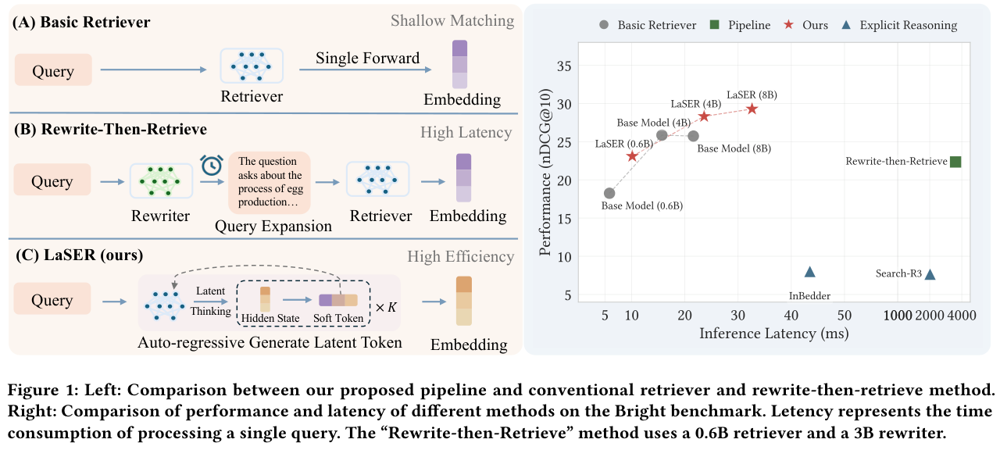
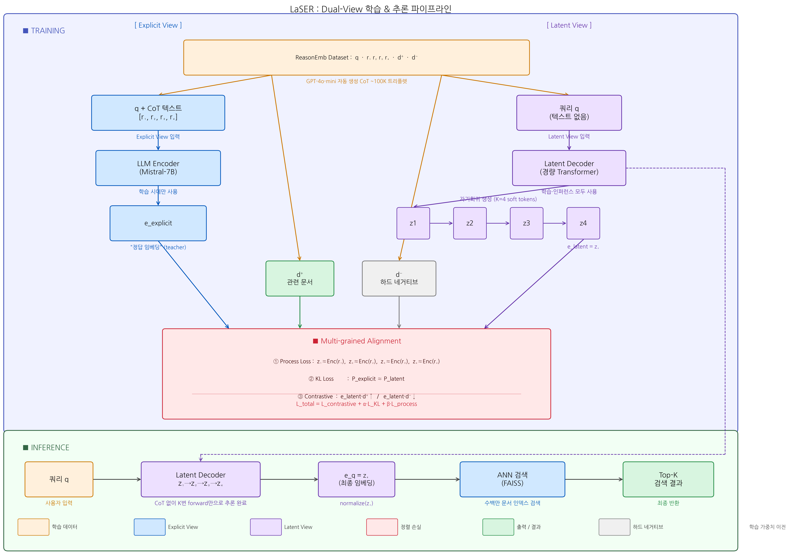
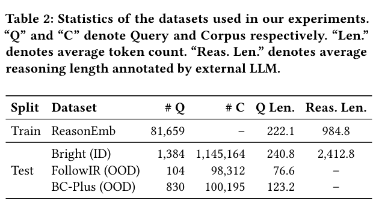
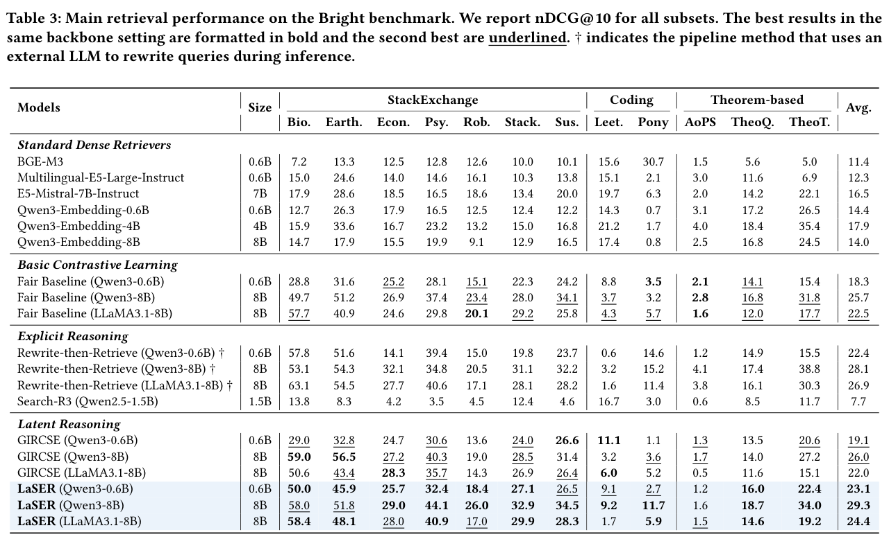

# Internalizing Explicit Reasoning into Latent Space for Dense Retrieval

저자 :

Yidan Liu, Haoran Xin, Minghan Li, Zheng Liu, Defu Lian, Enhong Chen

University of Science and Technology of China (USTC)

Microsoft Research Asia

발표 : arXiv 2026

논문 : [PDF](https://arxiv.org/pdf/2603.01425)

출처 : [https://arxiv.org/abs/2603.01425](https://arxiv.org/abs/2603.01425)

---

## 0. Summary

<p align="center">

</p>

### 0.1. 문제 (Problem)

고난도 정보 검색(Dense Retrieval)에서 LLM 기반 임베딩 모델이 충분한 추론 능력을 발휘하지 못하는 문제를 다룬다.

**기존 접근 방식과 한계**:

*방법 1: 명시적 CoT 추론 후 인코딩*
- 외부 LLM(예: GPT-4o-mini)이 쿼리에 대해 Chain-of-Thought 추론 텍스트를 생성한 뒤, 이 텍스트와 원본 쿼리를 결합하여 임베딩한다.
- **한계**: 추론 단계가 고정(frozen)된 텍스트로 변환되므로, 임베딩 학습 과정에서 추론 품질이 개선되지 않는다. 또한 추론 텍스트의 길이가 입력 시퀀스를 늘려 인코딩 비용이 증가한다.

*방법 2: 순수 내재적 추론 (CoT-Distillation)*
- 임베딩 모델 자체가 내부적으로 추론하도록 KD(Knowledge Distillation)를 수행한다.
- **한계**: 추론 과정이 모델 내부에 완전히 은닉(black-box)되어 해석이 불가능하고, 복잡한 다단계 추론을 단일 벡터로 압축하는 데 한계가 있다.

*핵심 문제*: 명시적 추론(해석 가능, 단계별)과 내재적 추론(효율적, 학습 가능)의 장점을 동시에 얻지 못하고 있다.

### 0.2. 핵심 아이디어 (Core Idea)

LaSER(Latent Space Explicit Reasoning)는 **Dual-View 프레임워크**를 통해 명시적 추론의 해석 가능성과 내재적 추론의 효율성을 결합한다.

**① Explicit View — 텍스트 CoT 추론**

외부 LLM(GPT-4o-mini)이 쿼리 $q$에 대해 단계별 추론 텍스트 $R = [r_1, r_2, ..., r_m]$을 생성한다. 이 추론 체인은 관련 문서를 찾기 위해 어떤 추론 단계가 필요한지를 명시적으로 서술한다.

```
Query: "Quantum computing의 약점에 대한 논문"
Reasoning: "1. 먼저 quantum computing의 핵심 개념(큐비트, 결어긋남)을 파악한다.
            2. 현재 기술적 한계(오류율, 결맞음 시간)를 식별한다.
            3. 이 한계를 다루는 논문들을 탐색한다."
```

이 추론 텍스트는 Explicit View의 임베딩 입력으로 사용된다.

**② Latent View — K개 연속 잠재 사고 토큰**

모델이 명시적 텍스트 없이 $K$개의 소프트 토큰(soft token) $Z = [z_1, z_2, ..., z_K]$을 잠재 공간에서 자기회귀적으로 생성한다. 이 잠재 토큰들은 "기대 임베딩(expected embedding)"으로, 각 추론 단계에 대응하는 연속 벡터다.

$$z_k = f_\theta(q, z_1, ..., z_{k-1}), \quad k = 1, ..., K$$

잠재 토큰 $z_K$ (마지막 토큰)가 최종 쿼리 임베딩으로 사용된다. 이 방식은 텍스트 생성 없이 임베딩 공간 내에서 추론을 완결한다.

**③ Multi-grained Alignment — 두 뷰의 다중 단계 정렬**

Explicit View와 Latent View가 같은 추론 경로를 학습하도록 세 가지 정렬 손실을 부과한다:

| 정렬 단계 | 손실 함수 | 목적 |
|----------|-----------|------|
| **출력 정렬** | Contrastive Loss (InfoNCE) | 최종 임베딩이 같은 관련 문서를 가리키도록 |
| **출력 KL 정렬** | KL Divergence | Latent View 분포 ≈ Explicit View 분포 |
| **프로세스 정렬** | Trajectory Alignment | 중간 잠재 토큰 $z_k$ ≈ Explicit CoT $r_k$의 임베딩 |

프로세스 정렬은 각 단계의 잠재 토큰이 대응하는 명시적 추론 단계 임베딩에 가까워지도록 강제한다:
$$\mathcal{L}_{process} = \sum_{k=1}^K \| z_k - \text{Enc}(r_k) \|_2^2$$

### 0.3. 효과 (Effects)

* **추론 능력 내재화**: 텍스트 CoT를 생성하지 않고도 동등한 추론 깊이를 잠재 공간에서 수행
* **효율성**: Latent View는 K개의 토큰만 생성하므로, 긴 CoT 텍스트 없이 빠른 인퍼런스
* **해석 가능성**: Explicit View가 여전히 텍스트 추론을 제공하므로 학습 과정이 투명
* **단계별 정렬**: 프로세스 정렬 덕분에 모델이 중간 추론 단계를 건너뛰지 않고 체계적으로 학습

### 0.4. 결과 (Results)

* **BRIGHT 벤치마크**: 복잡한 추론이 필요한 고난도 검색 벤치마크에서 SOTA 달성
  - BRIGHT는 수학·코딩·과학·법률 등 다양한 도메인의 복잡한 쿼리로 구성
  - E5-mistral-7B, GTE-Qwen2-7B 등 강력한 베이스라인 대비 일관된 향상
* **일반 검색 벤치마크 (MTEB)**: BEIR 데이터셋에서 경쟁력 있는 성능 유지 (일반화 능력)
* Latent View 단독(K=8 토큰)도 Explicit View와 유사한 성능을 달성하여 추론이 성공적으로 내재화됨을 검증
* 프로세스 정렬이 없으면 성능이 크게 하락 → 단계별 정렬이 핵심

### 0.5. 상세 동작 방식 (How It Works)



구체적인 예시를 통해 전체 흐름을 단계별로 설명한다.

---

#### 예시 쿼리

> **"퀀텀 컴퓨팅의 오류율 문제를 다루는 논문을 찾아줘"**

이 쿼리는 단순 키워드 매칭으로는 풀기 어렵다. "퀀텀 컴퓨팅 → 큐비트 → 결어긋남(decoherence) → 오류 정정 코드 → 관련 논문" 같은 다단계 추론이 필요하다.

---

#### STEP 0. 학습 데이터 구축 — ReasonEmb

##### 트리플렛(Triplet)이란?

검색 모델을 학습시키려면 "이건 맞고, 저건 틀리다"를 동시에 알려줘야 한다. 이를 위해 세 가지 요소를 묶은 것이 **트리플렛**이다.

```
트리플렛 = (q, d+, d-)

  q   : 쿼리 — 사용자가 검색하는 질문
  d+  : Positive  — 이 쿼리에 실제로 맞는 관련 문서
  d-  : Negative  — 이 쿼리에 맞지 않는 비관련 문서
```

모델은 트리플렛을 보고 다음을 학습한다:

```
e_q · e_{d+}  →  크게  (쿼리와 관련 문서는 가깝게)
e_q · e_{d-}  →  작게  (쿼리와 비관련 문서는 멀게)
```

특히 **하드 네거티브(Hard Negative)** 가 중요하다. 주제는 비슷하지만 정확히 맞지는 않는 문서로, 모델이 헷갈리기 쉬운 어려운 케이스이기 때문에 학습 효과가 훨씬 크다.

```
쉬운 네거티브: "프랑스 와인 양조 역사"       ← 퀀텀이랑 관계없어서 모델이 금방 구분
하드 네거티브: "Quantum Supremacy" 논문    ← 퀀텀 컴퓨팅이지만 오류율이 아님 → 어려움
```

---

##### ReasonEmb 데이터셋 구축 과정

ReasonEmb는 **사람이 손으로 만들지 않는다.** 세 단계로 자동 구축된다.

**① 기존 검색 데이터셋에서 (q, d+, d-) 트리플렛 수집**

BRIGHT, BEIR 등 이미 사람이 레이블링해둔 벤치마크 데이터셋을 재활용한다. 여기서 쿼리·관련 문서·하드 네거티브를 수집하는 것이므로 이 단계에는 추가 인력이 필요 없다.

```
기존 데이터셋 (BRIGHT 등)
        ↓ 수집
(q, d+, d-) 트리플렛 ~100K 쌍
```

**② GPT-4o-mini로 CoT 추론 텍스트 자동 생성**

각 쿼리에 대해 GPT-4o-mini API를 호출하여 K개 단계의 추론 텍스트 R = [r1, …, rK]를 생성한다. 사람이 추론 텍스트를 한 줄도 직접 쓰지 않는다.

```python
for (q, d+, d-) in triplets:
    R = GPT4oMini.generate(
        prompt=f"""쿼리: {q}
                   관련 문서를 찾기 위해 필요한 추론 과정을
                   {K}개 단계로 나눠서 작성하라."""
    )
    r1, r2, r3, r4 = split_into_steps(R)
    dataset.append((q, r1, r2, r3, r4, d+, d-))
```

**③ 최종 ReasonEmb 데이터셋**

```
ReasonEmb 한 샘플 =
  q   : "퀀텀 컴퓨팅의 오류율 문제를 다루는 논문"
  r1  : "퀀텀 컴퓨팅의 핵심 개념인 큐비트와 중첩을 파악한다."
  r2  : "큐비트의 결어긋남(decoherence)이 오류의 주요 원인임을 식별한다."
  r3  : "오류 정정 코드(QEC)나 내결함성을 다루는 연구 방향을 탐색한다."
  r4  : "위 개념을 실험적으로 검증하거나 새 방법을 제안하는 논문을 목표로 한다."
  d+  : "Fault-Tolerant Quantum Computing via Surface Codes (Nature 2023)"
  d-  : "Quantum Supremacy Using a Programmable Superconducting Processor (Google 2019)"
         → 퀀텀 컴퓨팅이지만 오류율/정정이 아닌 연산 속도 논문 → 하드 네거티브
```

> **한계**: GPT-4o-mini API를 ~100K 쿼리에 호출하므로 비용이 발생한다. 논문에서도 이를 명시적 한계로 언급한다.

| 구성 요소 | 출처 | 사람 개입 여부 |
|---|---|---|
| (q, d+, d-) 트리플렛 | 기존 검색 데이터셋 재활용 | 기존 레이블 재사용 |
| CoT 추론 r1~rK | GPT-4o-mini 자동 생성 | 없음 (프롬프트 설계만) |

이 `(q, r1~r4, d+, d-)` 묶음이 LaSER의 전체 학습 데이터로 사용된다.

---

#### STEP 1. Explicit View — 텍스트 CoT 인코딩 (학습 시에만)

쿼리 q와 CoT 추론 텍스트 R을 **합쳐서** LLM 인코더에 입력한다.

```
입력 텍스트:
  "[쿼리] 퀀텀 컴퓨팅의 오류율 문제를 다루는 논문
   [추론] 큐비트의 결어긋남이 오류 원인 → 오류 정정 코드 탐색 → 내결함성 논문 목표"

LLM 인코더 (Mistral-7B)
        ↓
e_explicit = [0.12, -0.45, 0.87, ..., 0.33]  ← 768~4096차원 벡터
```

이 `e_explicit`은 추론 텍스트가 포함된 "정답 임베딩"으로, **Latent View를 가르치는 교사(teacher)** 역할을 한다.

---

#### STEP 2. Latent View — 잠재 사고 토큰 자기회귀 생성 (학습 + 인퍼런스)

쿼리 q **만** 입력하여, K=4개의 연속 벡터(soft token)를 순서대로 생성한다. 텍스트를 전혀 출력하지 않는다.

```
입력: "퀀텀 컴퓨팅의 오류율 문제를 다루는 논문"
        ↓
z1 = Decoder(q)
   → [0.08, -0.31, 0.72, ...]  ← "큐비트·중첩 개념" 방향의 벡터
        ↓
z2 = Decoder(q, z1)
   → [0.15, -0.41, 0.80, ...]  ← "결어긋남·오류 원인" 방향의 벡터
        ↓
z3 = Decoder(q, z1, z2)
   → [0.19, -0.44, 0.85, ...]  ← "오류 정정 코드 탐색" 방향의 벡터
        ↓
z4 = Decoder(q, z1, z2, z3)
   → [0.21, -0.46, 0.88, ...]  ← "내결함성 논문" 방향의 최종 임베딩

최종 쿼리 임베딩: e_q = normalize(z4)
```

각 z_k는 CoT의 각 추론 단계(r_k)에 대응하는 연속 벡터이다. 텍스트로 "큐비트"라고 쓰지는 않지만, 그 개념 방향으로 벡터가 이동한다.

---

#### STEP 3. Multi-grained Alignment — 세 가지 정렬 손실

Explicit View(교사)와 Latent View(학생)가 같은 방향으로 학습하도록 세 가지 손실을 동시에 사용한다.

**① 출력 대조 손실 (Contrastive Loss)**

```
e_q(latent) · e_{d+}  →  높게  (관련 문서와 가깝게)
e_q(latent) · e_{d-}  →  낮게  (하드 네거티브와 멀게)

Loss_con = -log [ exp(e_q · e_{d+} / τ) / Σ exp(e_q · e_{d'} / τ) ]
```

→ Latent View 임베딩이 실제로 관련 문서를 잘 찾도록 훈련

**② KL 정렬 (출력 분포 일치)**

```
Explicit View가 배치 내 문서들을 보는 확률 분포:  P_explicit = softmax([0.9, 0.1, 0.05, ...])
Latent View가 배치 내 문서들을 보는 확률 분포:   P_latent  = softmax([0.7, 0.2, 0.1,  ...])

Loss_KL = KL(P_explicit || P_latent)
```

→ 어떤 문서를 얼마나 중요하게 보는지의 "판단 방식"까지 일치시킴

**③ 프로세스 정렬 (중간 단계 일치)**

```
z1  ←→  Enc(r1)  "큐비트·중첩 개념" 임베딩
z2  ←→  Enc(r2)  "결어긋남·오류 원인" 임베딩
z3  ←→  Enc(r3)  "오류 정정 코드" 임베딩
z4  ←→  Enc(r4)  "내결함성 논문" 임베딩

Loss_proc = (1/K) Σ ||z_k - sg[Enc(r_k)]||²
            (sg = stop-gradient: Explicit 쪽은 고정, Latent만 업데이트)
```

→ 단계를 건너뛰지 않고 **추론 경로 자체**를 학습하게 강제

**총 손실:**
```
L_total = L_con + α·L_KL + β·L_proc
```

---

#### STEP 4. 인퍼런스 (추론 시)

학습이 끝나면 **Explicit View와 CoT 텍스트는 사용하지 않는다.** Latent View만으로 빠르게 임베딩을 만든다.

```
[사용자 입력]
쿼리: "퀀텀 컴퓨팅의 오류율 문제를 다루는 논문"
        ↓
[Latent View — 4번 forward pass]
z1 → z2 → z3 → z4  (텍스트 생성 없음, 벡터만 계산)
        ↓
e_q = normalize(z4)  ← 최종 쿼리 임베딩
        ↓
[ANN 검색 (FAISS 등)]
코사인 유사도 기준 Top-K 문서 반환:
  1위: "Fault-Tolerant Quantum Computing via Surface Codes" (유사도 0.91)
  2위: "Quantum Error Correction with Superconducting Qubits" (유사도 0.87)
  3위: "Noise-Resilient Quantum Gates via Dynamical Decoupling" (유사도 0.83)
```

CoT 텍스트 생성이 없으므로 기존 Explicit CoT 방식 대비 **수십 배 빠른** 인퍼런스가 가능하다.

---

#### 핵심 직관 요약

| 단계 | 무엇을 하는가 | 왜 중요한가 |
|---|---|---|
| Explicit View | CoT 텍스트를 포함한 "정답 임베딩" 계산 | Latent View의 학습 목표 제공 |
| Latent View | 쿼리만으로 K개 soft token 생성 | 인퍼런스 시 CoT 없이 추론 |
| Contrastive Loss | 관련 문서 가깝게, 비관련 멀게 | 실제 검색 성능 보장 |
| KL Loss | 두 뷰의 문서 중요도 분포 일치 | 판단 방식 전이 |
| Process Loss | 각 z_k ≈ 각 r_k 임베딩 | 추론 단계를 순서대로 학습 |
| 인퍼런스 | Latent View만 사용 | CoT 없이 추론 능력 유지 |

---

## 1. Introduction

### 추론 기반 검색의 필요성

BRIGHT 벤치마크(Su et al., 2024)는 기존의 어휘적·의미적 매칭으로는 해결할 수 없고, 다단계 추론이 필요한 검색 태스크를 평가한다. 예를 들어:

- *쿼리*: "이 알고리즘의 시간복잡도가 O(n log n)인 이유를 설명하는 논문"
- *필요한 추론*: 알고리즘 → 분할정복 패턴 인식 → 재귀 관계 분석 → 마스터 정리 적용 → 관련 논문 탐색

기존 밀집 검색기(Dense Retriever, e.g., BERT, E5)는 이런 다단계 추론을 단일 포워드 패스로 수행하기 어렵다.

### 기존 해결책의 트레이드오프

| 방법 | 추론 가능 | 학습 가능 | 추론 속도 |
|------|---------|----------|---------|
| Explicit CoT + 인코딩 | O | X (고정 추론) | 느림 |
| 순수 내재적 추론 | X (불투명) | O | 빠름 |
| **LaSER (제안)** | O | O | 빠름 |

---

## 2. Method

### 2.1. Dual-View 임베딩 아키텍처

```
쿼리 q
├── Explicit View (학습 시에만)
│   └── [q + R] → LLM 인코더 → e_explicit
└── Latent View (학습 + 인퍼런스)
    └── [q] → Latent Decoder → [z1, ..., zK] → e_latent = zK
```

백본: LLM 기반 임베딩 모델(e.g., Mistral-7B, Qwen2-7B)

Latent Decoder는 경량 Transformer 디코더 블록으로, 쿼리 임베딩을 조건으로 K개의 잠재 토큰을 자기회귀적으로 생성한다.

### 2.2. Multi-grained Alignment 손실

**출력 대조 손실 (Contrastive)**:
$$\mathcal{L}_{con} = -\log \frac{\exp(e_{latent} \cdot e_{d^+} / \tau)}{\sum_{d' \in \mathcal{B}} \exp(e_{latent} \cdot e_{d'} / \tau)}$$

여기서 $e_{d^+}$는 관련 문서 임베딩, $\mathcal{B}$는 배치 내 모든 문서(하드 네거티브 포함), $\tau$는 온도 파라미터.

**출력 KL 정렬**:
$$\mathcal{L}_{KL} = D_{KL}\left(P_{explicit}(\cdot \mid q) \| P_{latent}(\cdot \mid q)\right)$$

두 뷰의 소프트맥스 분포(배치 내 문서들에 대한)가 일치하도록 정규화.

**프로세스 정렬**:
$$\mathcal{L}_{proc} = \frac{1}{K} \sum_{k=1}^K \| z_k - \text{sg}[\text{Enc}(r_k)] \|_2^2$$

$\text{sg}[\cdot]$은 stop-gradient 연산으로 Explicit View 임베딩은 고정하고 Latent View만 업데이트.

**전체 손실**:
$$\mathcal{L} = \mathcal{L}_{con} + \alpha \mathcal{L}_{KL} + \beta \mathcal{L}_{proc}$$

### 2.3. ReasonEmb 데이터셋

| 속성 | 값 |
|------|-----|
| 출처 | BRIGHT + 일반 검색 데이터셋 |
| CoT 생성 모델 | GPT-4o-mini |
| 추론 단계 수 K | 4–8 |
| 총 규모 | ~100K 트리플렛 |
| 도메인 | 수학, 코딩, 과학, 법률, 의학, 금융 |

---

## 3. Experiments

### 데이터셋

<p align="center">

</p>

| 벤치마크 | 특징 | 용도 |
|---------|------|------|
| BRIGHT | 복잡한 추론 필요 검색 (11개 도메인) | 주요 평가 |
| BEIR | 18개 도메인 다양한 검색 태스크 | 일반화 평가 |

### 비교 모델

| 모델 | 파라미터 | 특징 |
|------|---------|------|
| E5-mistral-7B | 7B | 강력한 LLM 임베딩 베이스라인 |
| GTE-Qwen2-7B | 7B | 최신 LLM 임베딩 |
| Reasoning + Embed (명시적 CoT) | 7B | 텍스트 CoT 후 인코딩 |
| LaSER (ours) | 7B+ | Dual-View 정렬 |

### BRIGHT 결과 (nDCG@10)

<p align="center">

</p>

| 모델 | 평균 | 수학 | 코딩 | 과학 |
|------|------|------|------|------|
| E5-mistral-7B | ~22 | ~18 | ~15 | ~25 |
| 명시적 CoT | ~26 | ~23 | ~19 | ~28 |
| LaSER | **~30** | **~27** | **~22** | **~32** |

### Ablation (BRIGHT 기준)

| 변형 | nDCG@10 |
|------|---------|
| Latent View only (w/o Explicit) | 하락 |
| Explicit View only (w/o Latent) | 하락 |
| w/o Process Alignment | 유의미한 하락 |
| w/o KL Alignment | 소폭 하락 |
| **Full LaSER** | **최고** |

---

## 4. Conclusion

LaSER는 추론 기반 고난도 검색에서 명시적 CoT와 잠재 공간 추론을 Dual-View 프레임워크로 결합한다. 학습 시 두 뷰를 다중 단계 정렬로 공동 훈련하고, 인퍼런스 시에는 Latent View만 사용하여 속도를 유지하면서 추론 능력을 내재화한다.

**핵심 기여**:
1. **Dual-View 프레임워크**: 명시적 텍스트 추론과 잠재 공간 추론의 동시 학습
2. **Multi-grained Alignment**: 출력 레벨(Contrastive + KL) + 프로세스 레벨(궤적) 정렬
3. **ReasonEmb 데이터셋**: 추론 기반 검색 훈련을 위한 새로운 다단계 CoT 데이터셋
4. **효율적 인퍼런스**: CoT 텍스트 생성 없이 K개 잠재 토큰으로 빠른 추론

**한계**:
- ReasonEmb 구축에 GPT-4o-mini API 비용 필요
- K(잠재 토큰 수) 설정이 태스크 복잡도에 민감
- 추론 단계 분할(CoT를 K개로 나누는 방법)이 자동화 되어 있지 않음

---

## Appendix

### A.1. 핵심 사전 개념

**① Dense Retrieval (밀집 검색)**
쿼리와 문서를 각각 고차원 벡터로 임베딩하고, 내적(dot product) 또는 코사인 유사도로 관련 문서를 검색하는 방식. BERT 기반 Bi-Encoder(DPR 등)가 대표적. ANN 인덱스(FAISS)로 수백만 문서 중 빠르게 검색.

**② Chain-of-Thought (CoT) 추론**
복잡한 추론 문제를 단계별 중간 추론 과정을 명시하면서 풀어나가는 프롬프팅 기법. LLM이 "먼저 A를 파악하고, 그 다음 B를 분석하고..."처럼 추론 체인을 명시적으로 생성한다.

**③ Soft Token / Continuous Token**
일반 텍스트 토큰이 아닌 연속 벡터 공간의 토큰. Prompt Tuning, Prefix Tuning, Latent Chain-of-Thought 등에서 입력 또는 중간 상태로 사용. 이산 텍스트로 표현할 필요 없이 모델의 내부 표현 공간에서 직접 최적화 가능.

**④ Knowledge Distillation (KD)**
더 크고 강력한 교사 모델(teacher)의 예측을 소프트 레이블로 활용하여 작은 학생 모델(student)을 훈련하는 기법. LaSER에서 Explicit View(교사)가 Latent View(학생)를 지도.

**⑤ BRIGHT 벤치마크**
(Su et al., 2024) 단순 어휘·의미 매칭이 아닌 복잡한 추론이 필요한 정보 검색을 평가하는 벤치마크. 수학, 코딩, 법률, 의학, 금융 등 11개 도메인으로 구성되며, 기존 검색 모델들이 크게 고전하는 어려운 벤치마크.

**⑥ InfoNCE Loss (Contrastive Loss)**
자기지도 학습에서 사용하는 대조 손실. 쿼리 임베딩이 관련 문서(positive)와 가깝고 비관련 문서(negative)와 멀어지도록 훈련. 분모에 전체 배치의 문서를 넣어 계산하므로 배치 크기가 클수록 학습 신호가 강해진다.

### A.2. 선수 논문

1. **DPR** (EMNLP 2020): Dense Passage Retrieval. 이중 인코더(Bi-Encoder)로 질의응답 검색을 위한 밀집 검색의 기초.

2. **E5-mistral-7B** (arXiv 2023): Mistral-7B 기반 텍스트 임베딩 모델. 지시 따르기(instruction-following) 방식으로 다양한 검색 태스크를 단일 모델로 처리.

3. **BRIGHT** (Su et al., 2024): 복잡한 추론 기반 검색 벤치마크. LaSER의 핵심 평가 대상.

4. **Chain-of-Thought Prompting** (Wei et al., NeurIPS 2022): 단계별 추론 체인을 명시적으로 생성하는 프롬프팅 기법의 원조.

### A.3. 관련 후속 연구

- **추론 강화 임베딩 (Reasoning Embeddings)**: LLM의 추론 능력을 검색에 활용하는 방향은 활발히 연구 중. LaSER의 잠재 공간 추론 내재화 방식은 향후 멀티모달 검색, 코드 검색 등으로 확장 가능.

- **추천 시스템에서의 추론**: LaSER는 검색(Retrieval)에 특화되어 있으나, 사용자 이력에서 복잡한 추론이 필요한 추천 시나리오에도 유사한 Dual-View 아이디어 적용 가능.
