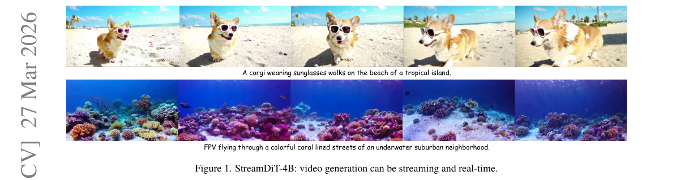
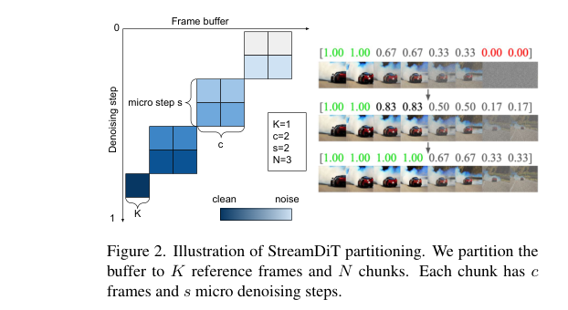
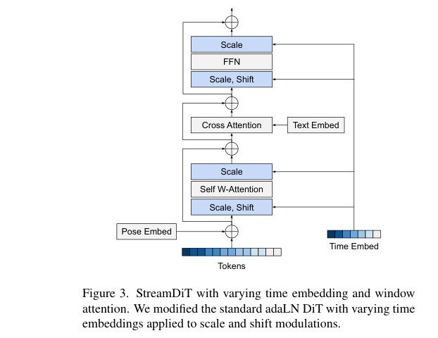
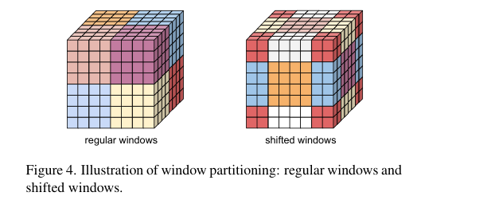
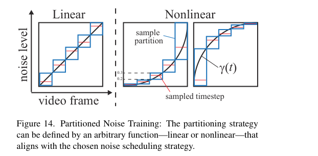
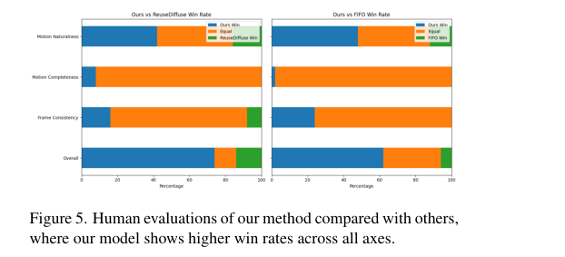
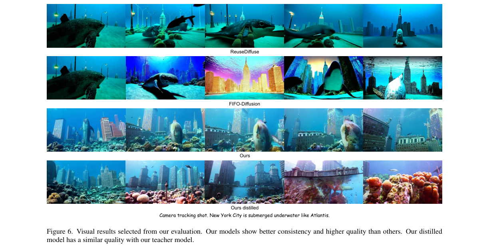
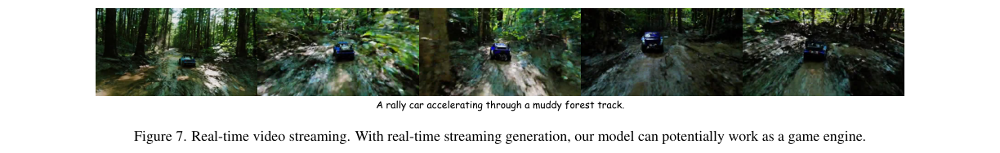

# StreamDiT: Real-Time Streaming Text-to-Video Generation

저자 :

Akio Kodaira¹², Tingbo Hou², Ji Hou², Markos Georgopoulos², Felix Juefei-Xu², Masayoshi Tomizuka¹, Yue Zhao²

¹UC Berkeley

²Meta

발표 : arXiv 2025 (v4: 2026-03-27)

논문 : [PDF](https://arxiv.org/pdf/2507.03745)

출처 : [https://arxiv.org/abs/2507.03745](https://arxiv.org/abs/2507.03745)

프로젝트 페이지 : [https://cumulo-autumn.github.io/StreamDiT/](https://cumulo-autumn.github.io/StreamDiT/)

---

## 0. Summary

### 0.1. 문제 (Problem)

* 기존 T2V(Text-to-Video) 모델의 한계
  * 양방향 attention 기반 DiT는 화질은 좋지만 **짧은 클립**만 오프라인으로 생성 가능 — interactive/real-time 응용 불가.
  * 시퀀스 길이에 대해 transformer의 복잡도가 **quadratic**이라 긴 영상으로 확장하면 비용 폭증.
* 기존 streaming 접근의 한계
  * **Autoregressive(AR) 기반**: 프레임별 latency는 낮지만, 한 프레임당 전체 denoising을 끝내야 하고 causal attention이 quality를 떨어뜨림.
  * **Training-free** (StreamDiffusion, FIFO-Diffusion): 학습 없이 inference trick만 사용 — 프레임 간 일관성(consistency) 부족 + visual artifact 발생.
  * **Sampling distillation 미적용**: queue가 매 denoising step마다 갱신되므로 step distillation, consistency distillation 등 기존 방법을 그대로 못 씀.

### 0.2. 핵심 아이디어 (Core Idea)

> *이 섹션은 background 없는 독자도 이해 가능하게 풀어 썼습니다. 익숙한 분은 0.5 이후 detail 섹션부터 보셔도 됩니다.*

**먼저 문제 그림을 직관적으로 잡기.**

영상 생성 모델(diffusion)이 영상 한 클립을 만드는 일반적인 방식은 이렇습니다. "전체 프레임(예: 16장)을 한꺼번에 백지(노이즈) 상태로 두고, 16번 정도 거쳐서 점점 깨끗하게 만든다." 그림으로 표현하면 *모든 프레임이 동시에 같은 noise level*에 있고, 모두 같이 깨끗해집니다. 화질은 좋지만, **첫 프레임을 보려면 16번 denoising이 다 끝날 때까지 기다려야** 합니다. → real-time/streaming 불가.

반면 streaming을 하려면 "1번 denoising 끝나면 첫 프레임은 곧장 화면에 띄우고, 새 프레임은 뒤에 채워 넣으며 계속 흘려보내야" 합니다. 본 논문은 그걸 가능하게 하는 학습·모델·압축 방법을 한 묶음으로 제안합니다.

**핵심 component 4가지** — 각 항목 `(개념 한 줄) + (왜 필요) + (비유)`:

1. **Buffered Flow Matching** (학습 방식)
   * **개념**: 영상의 프레임 시퀀스를 **길이 B의 슬라이딩 버퍼**처럼 다룬다. 버퍼 안의 프레임마다 **서로 다른 노이즈 정도**를 부여한 채로 동시에 denoising한다. 한 step 끝나면 가장 깨끗해진 앞쪽 프레임은 buffer에서 pop, 새 noise 프레임을 뒤에 push.
   * **왜?** 모든 프레임이 같은 noise level이면 한꺼번에 끝나야 첫 프레임을 볼 수 있다. **버퍼 안에서 noise level이 점진적으로 다르면**, 1 step 단위로 앞쪽이 계속 깨끗해져 끊임없이 새 프레임을 내보낼 수 있다.
   * **비유**: *공장의 컨베이어 벨트*. 벨트 위에 16개의 자동차가 줄지어 있고 각각 다른 조립 단계에 있다. 벨트가 한 칸 움직일 때마다 맨 앞 자동차는 "완성"으로 라인 밖으로 나가고, 맨 뒤에 새 차체가 들어온다. 모든 차가 한꺼번에 완성될 필요 없이, **출고는 한 대씩 끊임없이** 이루어진다.

2. **통합 Partitioning Scheme** (학습/추론 모드 통일)
   * **개념**: 버퍼를 다음 4가지 변수로 분할. `K` (참조용으로 남기는 깨끗한 reference frame 수), `N` (denoising 청크 수), `c` (한 청크에 들어가는 프레임 수), `s` (한 청크에서 noise level 한 단계 진행하기 전 추가 denoising 반복 수, "micro step").
   * **왜?** 기존 방법들 — `uniform noise` (모두 같은 noise level, c=B, s=1), `diagonal noise` (FIFO-Diffusion 식, c=1, s=1) 등 — 가 사실은 **같은 framework의 special case들**임을 보였다. 그래서 한 모델로 양쪽 모드를 다 흡수할 수 있다.
   * **비유**: *세탁기의 모드 다이얼*. "표준 세탁", "강력 세탁", "이불 코스" 등 외관상 다른 모드가 사실 같은 다이얼 위 다른 위치일 뿐. StreamDiT는 모드별 따로 학습하지 않고, **다이얼 전체 범위에서 학습**해서 어느 위치에 두든 잘 동작하게 만든다.

3. **Mixed Training** (스킴 혼합 학습)
   * **개념**: 학습 중 다양한 `(c, s, N)` 조합을 무작위로 섞어 사용한다.
   * **왜?** 한 스킴만 학습하면 그 스킴에 overfit. 여러 스킴을 섞어 학습하면 모델이 "noise level이 어떻게 분포하든 잘 denoise하는 일반화된 함수"가 된다. 결과적으로 추론 시 어떤 스킴으로 돌려도 안정적.
   * **비유**: *다양한 코스를 달려본 마라톤 선수*가 새 코스에서도 잘 뛰는 것과 같다. 한 코스만 죽어라 연습한 선수는 그 코스 밖에선 약함.

4. **Multistep Distillation** (모델 가속)
   * **개념**: 잘 학습된 teacher 모델(128 step + CFG 사용)을 8 step + no CFG의 student로 압축. 단, FM trajectory를 **N개 segment로 쪼개서 각 segment마다 따로 distillation**.
   * **왜?** Streaming 모델은 매 step마다 buffer가 바뀌므로 기존 step distillation을 그대로 적용 불가. Segment 단위로 쪼개야 streaming 구조를 깨지 않고 학습 가능.
   * **비유**: 16번 붓질로 그림 그리는 선생님 옆에서, 학생은 "이 단계까지의 결과를 1번에 그려라"를 16번 연습. 한 번에 다 흉내내는 게 아니라 *구간별 압축*.

**모델 구조 보강** — 위 학습 방식을 잘 따라가도록 모델도 살짝 수정:

* **Varying time embedding** — 기존 DiT는 한 시점 `t` 하나로 전체 프레임에 동일한 modulation 적용. 그런데 우리는 프레임마다 noise level이 다르므로 **프레임 차원으로 다른 time embedding을 broadcast**. ("같은 시계 하나 → 프레임마다 다른 시계 16개"와 같은 변화.)
* **Window attention** (Swin 방식) — 모든 토큰이 모든 토큰을 보는 full attention은 비싸다. 화면을 작은 윈도우로 자르고 윈도우 안에서만 attention. 다음 layer에선 윈도우를 반만큼 옮겨서, 결국 정보가 전역적으로 퍼진다. (= "줌인 한 부분만 보다가 한 칸씩 옮기며 전체 그림 파악".)

### 0.3. 효과 (Effects)

* **Real-time 성능**: 4B 파라미터 모델이 H100 GPU 1장에서 **16 FPS @ 512p** 달성 (1 step ≈ 482 ms).
* **무한 streaming**: 5분짜리 영상도 일관된 quality로 생성 가능 (Fig. 8).
* **Interactive 생성**: streaming 중간에 prompt를 바꿔 영상의 흐름을 바꿀 수 있음 (Fig. 9).
* **Video-to-Video editing**: SDEdit 방식으로 실시간 영상 편집 가능 (Fig. 10).
* **확장성**: 동일 framework를 30B 모델에도 적용 — 화질 더 좋음.

### 0.4. 결과 (Results)

* VBench quality metric (Table 2):

| 방법 | Subject Cons. | Background Cons. | Dynamic Degree | Quality Score |
|---|---|---|---|---|
| ReuseDiffuse | 0.9501 | 0.9615 | 0.2900 | 0.8019 |
| FIFO-Diffusion | 0.9412 | 0.9576 | 0.3094 | 0.7981 |
| **Ours (teacher)** | **0.9622** | **0.9625** | **0.5240** | **0.8185** |
| **Ours (distilled)** | 0.9491 | 0.9555 | **0.7040** | 0.8163 |

* **Dynamic Degree**가 baseline 대비 큰 폭으로 향상 — 기존 방법은 화면이 너무 정적임.
* Distilled 모델이 teacher와 비슷한 quality 유지 + 훨씬 빠름.
* Human evaluation (Fig. 5)에서도 모든 axis에서 win rate 우세.
* Mixed training ablation (Table 3): chunk size `[1, 2, 4, 8, 16]` 전체 혼합이 quality score 0.8144로 최고.

### 0.5. Buffered Flow Matching 메커니즘 (수식)

기본 Flow Matching은 데이터 $\mathbf{X}_1$과 Gaussian noise $\mathbf{X}_0$ 사이를 선형으로 연결합니다.

$$\mathbf{X}_t = t \cdot \mathbf{X}_1 + (1 - (1-\sigma_{\min})t) \cdot \mathbf{X}_0$$

여기서 $t \in [0, 1]$은 시간 (1: 데이터, 0: 노이즈). 모델은 이 path를 따르는 velocity $\mathbf{V}_t = d\mathbf{X}_t/dt$를 예측하고, Euler solver로 denoising합니다.

**Buffered 확장**은 버퍼 $\mathbf{X}_1^i = [f_{i+1}, \ldots, f_{i+B}]$의 각 프레임에 서로 다른 noise level $\tau = [\tau_1, \ldots, \tau_B]$ (단조 증가)를 부여합니다.

$$\mathbf{X}_\tau^i = \tau \circ \mathbf{X}_1^i + (1 - (1-\sigma_{\min})\tau) \circ \mathbf{X}_0$$

여기서 $\circ$는 element-wise 곱. 추론 시:

$$\mathbf{X}_{\tau + \Delta\tau}^i = \mathbf{X}_\tau^i + u(\mathbf{X}_\tau^i, P, \tau; \Theta) \circ \Delta\tau$$

한 step 후 깨끗해진 프레임은 pop, 새 noise 프레임을 buffer 앞쪽에 push → 연속 streaming.

### 0.6. Partitioning Scheme

* 버퍼 구성: `B = K + N × c`, 전체 inference step 수 `T = s × N`.
* **Chunk size c**: 프레임을 묶어 chunk 단위로 denoising — chunk별로 동일 noise level 부여.
* **Micro step s**: 한 chunk가 다음 noise level로 넘어가기 전 같은 위치에서 추가 denoising step 수.
* Special case:
  * **Uniform noise** (full bidirectional DiT) ⟺ `c = B, s = 1` — 일관성↑, streaming 불가.
  * **Diagonal noise** (FIFO-Diffusion, [39]) ⟺ `c = 1, s = 1` — streaming 가능, 일관성↓.
  * StreamDiT는 `c ∈ [1, …, B]`, `s = T/N`을 **mixed training**으로 학습 → 양쪽 장점 모두 흡수.

### 0.7. 모델 구조 (Time-Varying DiT + Window Attention)

* **Varying time embedding**: 기존 adaLN DiT는 scalar timestep $t$를 사용 — 모든 토큰에 동일 modulation. StreamDiT는 latent를 `[F, H, W]`로 reshape하고 frame 차원 $F$를 따라 **시간 조건이 다른** scale/shift 적용. (시간 조건이 frame 차원에서 separable해야 한다는 요구.)
* **Window attention** (Swin 방식):

* 3D latent `[F, H, W]`를 `[F_w, H_w, W_w]` 비중첩 윈도우로 자르고 윈도우 내 self-attention 수행.
  * 한 layer 건너 윈도우를 반만큼 shift → 누적적으로 global token communication 달성.
  * 복잡도: $\dfrac{F_w H_w W_w}{F H W}$ × full attention.
* **VAE/Text Encoder**: Movie Gen의 TAE (4× temporal, 8× spatial compression) + UL2 + ByT5 + MetaCLIP. Text encoder는 prompt가 바뀔 때만 실행 (negligible cost).

### 0.8. Multistep Distillation 전략

* StreamDiT는 partitioning + micro step 구조 때문에 기존 step / consistency distillation을 직접 적용 불가.
* 본 논문 distillation 설정:
  * Teacher: `K=0, c=2, s=16, N=8` → 총 128 denoising step + CFG.
  * Student: 같은 partitioning이지만 `s = 1`로 줄임 → **8 step, no CFG**.
* FM trajectory를 N segment로 분할, **segment마다 step distillation + guidance distillation 동시** 수행.
* 결과: 128 step → 8 step 으로 16배 가속 + CFG 추가 forward 제거 → real-time 진입.

### 0.9. 학습 파이프라인 (3단계)

| Stage | 데이터 | LR | 목적 |
|---|---|---|---|
| 1. Task learning | 고품질 영상 3K | 1e−4 | T2V → streaming 적응 |
| 2. Task generalization | pretraining set 2.6M | 1e−5 | 다양성 확보 |
| 3. Quality fine-tuning | 고품질 영상 3K | 1e−5 | 최종 quality tuning |

* 각 stage 10K iteration, 128×H100.
* Distillation: 3K 고품질 영상, 64×H100, 10K iteration.

---

## 1. Introduction

본 논문은 T2V 생성에서 **scale ↔ latency**의 본질적 trade-off를 다룬다. Modern T2V 모델들(Hunyuan, MovieGen, Step-Video-T2V 등)은 수십억 파라미터를 가지며 bidirectional attention DiT 기반이라 화질은 좋지만, 영상 길이를 늘리면 attention의 quadratic 비용이 문제. AR 방식은 frame-by-frame이지만 한 프레임당 full denoising이 필요해 streaming latency가 여전히 큼.

저자들은 **(1) 낮은 latency + (2) 높은 throughput + (3) 높은 quality**를 동시에 만족하는 streaming 솔루션을 제안. 영감은 training-free 방법인 StreamDiffusion (image)과 FIFO-Diffusion (video)에서 받았지만, 두 한계 — frame-to-frame 일관성 부족, distillation 부재 — 를 **학습 기반 buffered FM + 맞춤 multistep distillation**으로 동시 해결.

기여:

1. **StreamDiT training**: moving buffer + 통합 partitioning scheme (uniform / diagonal / 그 사이를 모두 포괄). 시간 조건이 frame 축에서 separable이어야 한다는 모델링 요구사항 명시.
2. **StreamDiT modeling**: adaLN DiT + varying time embedding + window attention. 4B 파라미터, 512p.
3. **StreamDiT distillation**: partitioning scheme에 맞춘 multistep distillation. 16 FPS @ H100 달성.

## 2. Method

### 2.1. Buffered Flow Matching (Sec 3.1)

**Flow Matching 복습**: $\mathbf{X}_1$ (데이터)과 $\mathbf{X}_0$ (Gaussian) 사이를 잇는 선형 path. 모델은 velocity $u(\mathbf{X}_t, P, t; \Theta)$를 학습.

$$\mathcal{L}_{FM} = \mathbb{E}_{t, \mathbf{X}_t} \| u(\mathbf{X}_t, P, t; \Theta) - \mathbf{V}_t \|^2$$

**버퍼 확장**: 프레임 시퀀스 $[f_1, \ldots, f_N]$ (N은 잠재적으로 무한)에서 길이 $B$의 슬라이딩 버퍼 사용. 버퍼 내 프레임들에 단조 증가하는 noise level $\tau$ 부여. 깨끗해진 프레임은 pop, 새 noise frame이 push되며 연속 streaming.

### 2.2. 통합 Partitioning (Sec 3.2)

* 버퍼 = $K$개 reference 프레임 (denoising 대상 아닌 context) + $N$개 chunk × $c$ frames × $s$ micro steps.
* `K = 0`이 본 논문 기본값 (학습된 모델은 reference 없이도 충분).
* Chunk 단위 denoising으로 noise level granularity를 조절, micro step으로 buffer 크기 안 늘리고 denoising 횟수 증가.
* **Mixed training**: $i$번째 chunk의 timestep을 다음에서 샘플링.

$$\tau_i \sim \text{Uniform}\left(\left[\tfrac{T}{N}(i-1), \tfrac{T}{N} i\right]\right)$$

다양한 `(c, s)` 조합을 학습하면 inference 시 어떤 scheme을 골라도 잘 동작.

### 2.3. Time-Varying DiT + Window Attention (Sec 4.1)

* Latent를 `[F, H, W]`로 reshape, time embedding을 frame 차원으로 broadcast.
* Self-attention을 모두 **window attention**으로 교체 — 윈도우 크기 `[F_w, H_w, W_w]`, half-shift cross-layer.
* TAE: 4×t, 8×s. Latent channel = 8 (소형 latent로 작은 모델에서도 학습 용이).

### 2.4. Multistep Distillation (Sec 4.2)

* Partitioning이 분리되어 있으므로 segment마다 student의 1 forward로 teacher의 여러 step + CFG를 모사.
* CFG는 학생 단계에서 제거 → forward 1번 절감.

## 3. Experiments

### 3.1. Implementation

* Base T2V 모델 [30] (Movie Gen) finetune, 4B params, latent `[16, 64, 64]` → 64 frames @ 512p.
* 3-stage 학습 (위 0.9 표 참고), 각 10K iter / 128 H100.
* Teacher inference scheme: `c=2, s=16, N=8` → 128 step CFG. Distillation 후 `s=1` → 8 step no-CFG.

### 3.2. Quantitative + Human Eval

* VBench 7개 metric (Table 2): subject consistency, dynamic degree에서 큰 폭 우위. Aesthetic / imaging quality는 base model 공유라 비슷.
* Human eval (Fig 5): overall quality, frame consistency, motion completeness, motion naturalness — **모든 axis에서 win**.

### 3.3. Visual Results

* 1분짜리 비디오 — Ours가 더 일관된 content + 더 많은 motion. 다른 방법들은 정적임.

### 3.4. Ablation: Mixed Training (Table 3)

| Chunk size | Quality |
|---|---|
| [1] | 0.8129 |
| [1, 2] | 0.8100 |
| [1, 2, 4] | 0.8080 |
| [1, 2, 4, 8] | 0.8076 |
| **[1, 2, 4, 8, 16]** | **0.8144** |

* 모든 chunk size 혼합이 최고. `[1]`만 쓰면 0.8129로 차선 — 단일 scheme overfitting 시사.

### 3.5. Applications

* **Real-time**: 16 FPS, 1 step ≈ 482 ms. 게임 엔진처럼 활용 가능.
* **Infinite streaming** (Fig 8): 5분 영상 — content 유지.
* **Interactive** (Fig 9): "낮의 호수" → "달밤 호수" → "불꽃놀이"처럼 prompt 시퀀스로 영상 흐름 제어.
* **Video-to-video** (Fig 10): SDEdit으로 prompt-based real-time edit. 예: 돼지 → 고양이.

## 4. Conclusion & Limitations

* StreamDiT는 streaming T2V를 위한 *training + modeling + distillation* 통합 framework.
* Buffered FM + 통합 partitioning + window attention + multistep distillation의 조합으로 4B 모델이 H100 1장에서 16 FPS 달성.
* **한계**:
  1. **모델 capacity**: 4B는 base T2V quality에 한계. → 30B 확장본(Fig 15)에서 화질 크게 개선됨을 확인 (appendix).
  2. **Context length 부족**: out-of-context 객체가 다시 등장하면 외형이 바뀌는 현상. KV-cache로 context window 확장하면 완화 가능.
* 두 한계 모두 framework 자체의 근본 문제는 아니고 후속 작업으로 개선 가능.

**Reviewer's note**: streaming-friendly partitioning을 *학습 가능한 형태*로 통합하고 그에 맞는 distillation까지 design한 것이 강점. FIFO-Diffusion이 training-free라서 가지던 일관성 문제를 직접 해결. 4B로 real-time을 잡았다는 점도 실용적.

---

## 부록: 사전 지식 (Prerequisites)

### A.1. 알아야 할 핵심 개념

* **Flow Matching (FM)** — 데이터↔prior 사이의 ODE path를 학습. 본 논문에서 base training objective. ([Lipman et al., ICLR 2023](https://arxiv.org/abs/2210.02747))
  * 본문 위치: §3.1
* **Diffusion Transformer (DiT) / adaLN** — U-Net 대신 transformer로 diffusion을 모델링. AdaLN은 time embedding으로 scale/shift modulation. ([Peebles & Xie, ICCV 2023](https://arxiv.org/abs/2212.09748))
  * 본문 위치: §4.1 (architecture 기반)
* **Window Attention (Swin)** — 윈도우 내 self-attention + half-shift로 global token communication. ([Liu et al., ICCV 2021](https://arxiv.org/abs/2103.14030))
  * 본문 위치: §4.1
* **Classifier-Free Guidance (CFG)** — conditional/unconditional forward를 섞어 sample quality 향상. distillation 시 forward 1번으로 줄이는 게 핵심.
  * 본문 위치: §4.2
* **Step / Consistency / Multistep Distillation** — diffusion sampling 가속 방법. Progressive distillation, Consistency models, Multistep consistency models 계열.
  * 본문 위치: §2.3, §4.2
* **VAE / Temporal Auto-Encoder (TAE)** — pixel ↔ latent 변환. Movie Gen TAE는 시간 4×, 공간 8× 압축.
  * 본문 위치: §4.1

### A.2. 먼저 읽으면 좋은 논문

1. **[2023][FM] Flow Matching for Generative Modeling** ([arXiv](https://arxiv.org/abs/2210.02747)) — 본 논문의 학습 objective의 base.
2. **[2023][DiT] Scalable Diffusion Models with Transformers** ([arXiv](https://arxiv.org/abs/2212.09748)) — adaLN DiT 아키텍처.
   * **Repo 내 정리**: [Diffusion/[논문][2022][DiT] Scalable Diffusion Models with Transformers.md](../Diffusion/%5B%EB%85%BC%EB%AC%B8%5D%5B2022%5D%5BDiT%5D%20Scalable%20Diffusion%20Models%20with%20Transformers.md)
3. **[2024][FIFO-Diffusion] Generating Infinite Videos from Text without Training** (NeurIPS 2024, [arXiv](https://arxiv.org/abs/2405.11473)) — training-free streaming의 baseline. 본 논문이 직접 비교 대상.
4. **[2021][Swin Transformer]** ([arXiv](https://arxiv.org/abs/2103.14030)) — window attention의 원조.
5. **[2024][Multistep Consistency Models]** ([arXiv](https://arxiv.org/abs/2403.06807)) — distillation을 segment 단위로 쪼개는 발상의 base.
6. **[2023][StreamDiffusion]** ([arXiv](https://arxiv.org/abs/2312.12491)) — image domain streaming. 본 논문 first author의 선행작.
7. **[2024][Movie Gen]** ([arXiv](https://arxiv.org/abs/2410.13720)) — base T2V 모델 + TAE의 출처.

### A.3. 관련/후속 논문

* **[2025][Self-Forcing]** (NeurIPS 2025) — AR video diffusion의 train-test gap 해소. 또 다른 streaming 접근.
* **[2024][StreamingT2V]** — chunk + memory 기반 long video.
* **Hunyuan Video, Step-Video-T2V** — large-scale T2V의 최근 state-of-the-art (본 논문이 base 후보로 비교).

### A.4. Repo 내 관련 자료

* `Diffusion/` 폴더 전반 — diffusion 기본기 (DDPM, DDIM, LDM, DiT 등).
* `Diffusion_VLA/[논문][2023][Diffusion Policy] ...` — diffusion + control 결합 사례.
