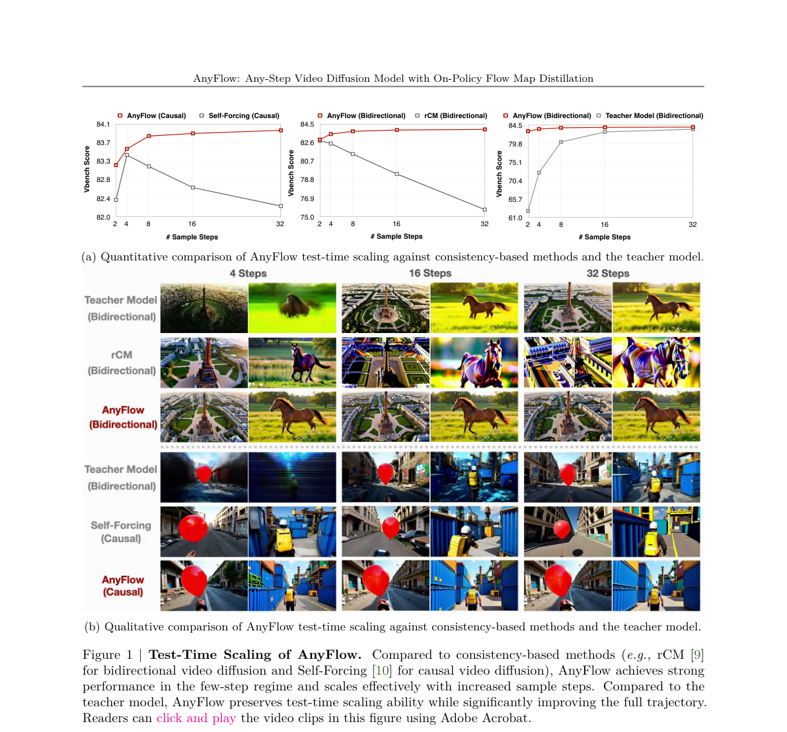
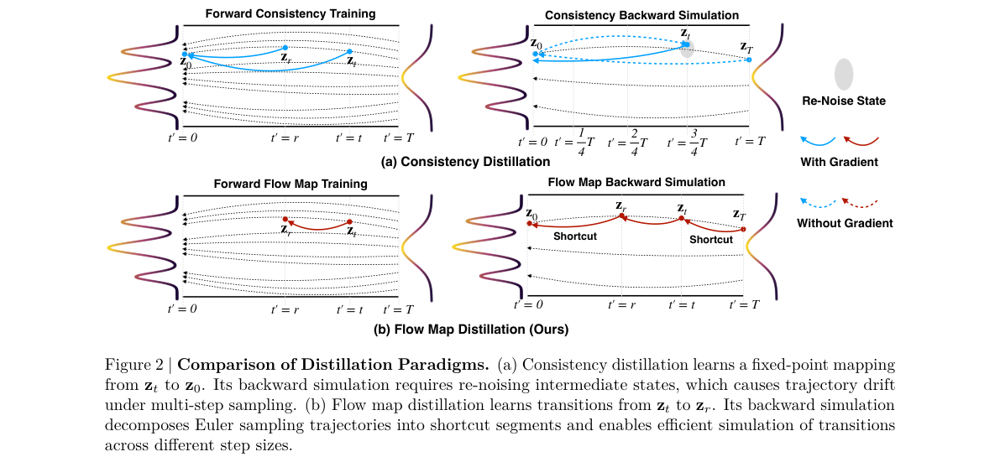
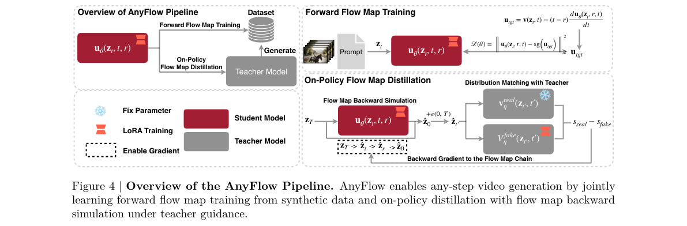
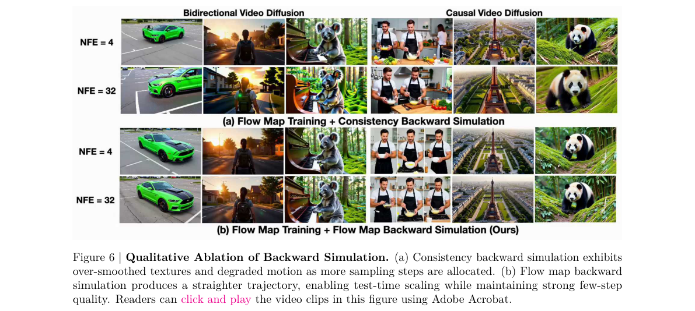
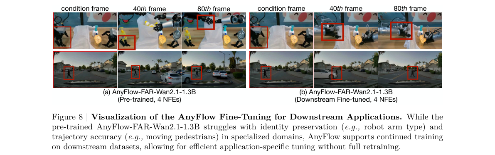

# AnyFlow: Any-Step Video Diffusion Model with On-Policy Flow Map Distillation

저자 :

Yuchao Gu, Guian Fang, Yuxin Jiang, Weijia Mao, Song Han, Han Cai, Mike Zheng Shou

NVIDIA

Show Lab, National University of Singapore

MIT

발표 : arXiv 2026

논문 : [PDF](https://arxiv.org/pdf/2605.13724)

출처 : [https://arxiv.org/abs/2605.13724](https://arxiv.org/abs/2605.13724)

---

## 0. Summary

<p align='center'>

</p>

### 0.1. 문제 (Problem)

* 기존 few-step video distillation은 대부분 **consistency model** 기반 (e.g., rCM, Self-Forcing)으로, 적은 sampling step에서는 잘 동작하지만 **step 수를 늘릴수록 오히려 품질이 떨어진다**.
* 원인: consistency 학습은 PF-ODE(확률 흐름 ODE) trajectory를 따라가지 않고, "끝점($z_0$)으로의 fixed-point mapping"을 학습하기 때문. multi-step inference 시 중간 상태를 다시 noise를 섞어 만들어야(re-noising) 하는데, 이 과정이 누적 bias를 만들어 trajectory가 PF-ODE에서 점점 벗어난다.
* 결과적으로 사용자가 "빠르게 미리 보기 (few-step)"와 "고품질 최종 결과 (multi-step)"를 **하나의 모델로** 자유롭게 선택할 수 없다 — any-step 비디오 생성 불가능.
* causal video generation에서는 추가로 **exposure bias** (학습-추론 불일치로 인한 누적 오차)가 심각.

### 0.2. 핵심 아이디어 (Core Idea)

* **Flow Map**: "특정 시각 $t$에서 다른 시각 $r$로 latent state를 한 번에 옮겨주는 함수" $f_\theta(z_t, t, r) \approx z_r$. consistency model은 항상 $r=0$ (끝점)으로 고정되어 있다면, flow map은 **임의의 $(t, r)$ 쌍**으로 학습한다. → 비유: consistency는 "기차역에서 종착역까지만 가는 직행", flow map은 "임의의 두 정거장 사이를 자유롭게 오가는 일반 노선".
  * 왜 필요한가: 작은 시간 간격(소규모 step) = 안정적 local refinement, 큰 시간 간격(대규모 step) = 빠른 long-range jump. 둘 다 같은 모델로 지원되므로 자연스럽게 any-step inference가 가능.

* **Forward Flow Map Training (Stage 1)**: pretrained video diffusion을 flow map model로 변환. MeanFlow objective $f_\theta(z_t, t, r) = z_t - (t-r) u_\theta(z_t, r, t)$를 사용하되, video post-training에 맞춰 네 가지 개선 추가:
  * **Interpolated timestep conditioning**: $g \cdot \text{emb}(t) + (1-g) \cdot \text{emb}'(r)$ — zero-init 방식이 embedding norm 폭주를 일으키는 문제를 회피.
  * **Guidance-fused training**: CFG(classifier-free guidance)를 모델 prediction에 융합 → 추론 시 CFG 생략 가능.
  * **Differential derivation equation (Eq. 4)**: JVP(Jacobian-vector product) 대신 유한차분으로 $du/dt$를 근사 → FSDP 호환.
  * **Adaptive loss reweighting**: 경계조건 $t=r$의 loss를 기준으로 다른 시간의 loss를 동적으로 scaling → 학습 안정화.

* **On-Policy Flow Map Distillation (Stage 2)**: forward training만으로는 discretization error와 exposure bias가 남음. student가 만든 self-rollout 위에서 teacher의 distribution matching (DMD)으로 보정. 단, 핵심 trick은 **Flow Map Backward Simulation**:
  * 전체 rollout $T \to 0$을 (a) shortcut $T \to t$ + (b) target step $t \to r$ + (c) shortcut $r \to 0$ **3 segment로 분해**.
  * flow map의 composition property $f_\theta(z_t, t, q) \approx f_\theta(f_\theta(z_t, t, r), r, q)$ 덕분에 임의의 step budget $N$을 같은 비용으로 시뮬레이션 가능. 비유: "16번 그려야 할 그림을 매번 16번 그려보지 않고, 중간 한 점만 정확히 그리고 나머지는 지름길로 점프".

### 0.3. 효과 (Effects)

* **Test-time scaling 복원**: step 수가 늘어날수록 품질이 향상 (consistency 계열은 오히려 하락).
* **단일 모델로 4~32 NFEs 자유 선택**: 빠른 preview ↔ 고품질 final delivery 트레이드오프 지원.
* **Causal model의 exposure bias 완화**: self-rollout 기반 DMD가 누적 오차 보정.
* **Downstream fine-tuning 가능**: pretrained model의 instantaneous flow field를 보존하므로, Self-Forcing 계열과 달리 robotics/driving 등 specialized domain으로 continued training 가능.
* **학습 비용 절감 (multi-step)**: 16-step 시뮬레이션 시 consistency 대비 43~47% 비용 감소.

### 0.4. 결과 (Results)

* **14B Bidirectional T2V (VBench)**: AnyFlow 4 NFEs **84.04** > rCM-14B 4 NFEs 83.73, 32 NFEs에서 84.10까지 향상.
* **14B Causal T2V (VBench)**: AnyFlow-FAR 4 NFEs **84.05** → 32 NFEs **84.41**, Krea-Realtime-14B 4 NFEs 83.25 능가.
* **14B I2V (VBench-I2V)**: AnyFlow-FAR 4 NFEs **87.87**, Wan2.1-I2V-14B 50×2 NFEs (87.71)과 동등 — **25배 적은 step**으로 동급 품질.
* **Training cost (16 steps)**: consistency backward sim 대비 **causal -43.4% / bidirectional -47.0%**.

### 0.5. 상세 동작 방식 (How It Works)

전체 pipeline은 2-stage로 구성된다. 입력은 teacher가 생성한 synthetic prompt-video pair, 출력은 any-step inference가 가능한 distilled flow map model.

```
[Pretrained Video Diffusion]
        |
        v
[Stage 1: Forward Flow Map Training] -- teacher synthetic data
        |   (interpolated timestep cond. + guidance-fused
        |    + differential derivation + adaptive reweight)
        v
[Stage 1 checkpoint: f_theta(z_t, t, r) ≈ z_r]
        |
        v
[Stage 2: On-Policy Distillation w/ Flow Map Backward Simulation]
        |   (student self-rollout + DMD teacher guidance)
        v
[AnyFlow model: any-step 4~32 NFEs]
```

**Step 1. Flow Map 정의 학습 (Stage 1)**

입력: noised latent $z_t$, 시각 $(t, r)$ where $t > r$.
처리: MeanFlow objective로 averaged velocity $u_\theta$를 학습. target은 $u_{tgt} = v(z_t, t) - (t-r) \cdot du_\theta/dt$. derivative는 유한차분(Eq. 4)으로 근사하여 FSDP 호환.
출력: 임의의 $(t, r)$에 대해 $f_\theta(z_t, t, r) \approx z_r$를 예측하는 transition operator.

**Step 2. Student Self-Rollout 생성 (Stage 2 — Backward Simulation)**

입력: noise $z_T$, target NFE 수 $N$, intermediate timestep $t$, 다음 timestep $r = t - T/N$.
처리: 3 segment shortcut decomposition —
```
[z_T] --shortcut f(z_T,T,t)--> [z_t]
[z_t] --target step f(z_t,t,r)--> [z_r]   (gradient 흐름)
[z_r] --shortcut f(z_r,r,0)--> [z_0]
```
모든 segment에 gradient를 흘려서 chain 전체에 backprop. 핵심: composition property $f_\theta(z_t, t, q) \approx f_\theta(f_\theta(z_t, t, r), r, q)$ 덕에 N이 커도 forward pass는 3번만.
출력: student가 만든 $\hat z_0$.

**Step 3. Teacher와의 Distribution Matching (DMD)**

입력: student rollout $\hat z_0$, teacher score $s_{real}$, fake score $s_{fake}$.
처리: $\hat z_0$를 $t \in [0,T]$로 re-noise → $z_t' = (1-t)\hat z_0 + t\epsilon$. DMD gradient 계산:
$\nabla_\theta \mathcal{L}_{DMD} = -\mathbb{E}[(s_{real}(z_t', t) - s_{fake}(z_t', t)) \partial f_\theta / \partial \theta]$.
출력: student가 teacher의 분포에 더 가까워지도록 update.

**Step 4. Any-Step Inference**

학습 완료 후 표준 Euler scheduler로 sampling. flow map은 임의 시간 간격에 학습되어 있으므로, 4-step / 8-step / 16-step / 32-step 모두 같은 weight로 지원.

데이터 흐름 요약 (단일 학습 iteration):
```
prompt + noise z_T
   |
   v (Flow Map Backward Sim, 3 forward passes)
\hat z_0 (student)
   |
   v (re-noise at random t)
z_t'  -->  [teacher s_real]  -- s_real - s_fake -->  backprop --> theta update
       \->  [student fake s_fake]
```

---

## 1. Introduction

비디오 diffusion model은 대규모 학습으로 인상적인 생성 품질에 도달했지만, 대부분은 고정된 inference step budget에 묶여 있다. 실제 사용자는 **빠른 preview용 적은 step**과 **최종 delivery용 많은 step**을 자유롭게 선택하기를 원한다. 이러한 "any-step" 모델은 재학습 없이 latency-quality trade-off를 가능하게 한다.

기존 few-step distillation의 주류는 **consistency model** (CM)이다. rCM (bidirectional), Self-Forcing (causal) 등이 대표적이며, 매우 작은 step budget에서는 효과적이다. 하지만 Fig. 1처럼 step 수를 늘려도 품질이 개선되기는커녕 **오히려 하락**하는 경향이 있다. 구조적 원인은 consistency 학습이 $z_0$로의 fixed-point mapping을 강제하기 때문 — multi-step inference 시 매번 중간 상태를 re-noise해야 하고, 그 과정이 trajectory를 PF-ODE 경로로부터 점점 멀어지게 만든다.

이를 해결하기 위해 저자들은 **AnyFlow**를 제안한다. AnyFlow는 **two-time flow map** 공식을 사용해 endpoint mapping이 아닌 **임의 시각 쌍 $(t, r)$ 사이의 transition** $z_t \to z_r$을 학습한다. 이는 작은 시간 간격(안정적 local refinement)과 큰 시간 간격(efficient long-range jump)을 모두 자연스럽게 지원한다.

AnyFlow는 2-stage pipeline으로 구성: (1) **Forward flow map training** — pretrained model을 flow map model로 전환하여 강한 초기값 제공. (2) **On-policy distillation** — student의 self-rollout 위에서 teacher의 DMD로 reverse divergence를 최적화하여 discretization error와 exposure bias를 완화. 두 번째 stage의 핵심은 **Flow Map Backward Simulation**으로, 전체 Euler rollout을 shortcut transition으로 분해하여 효율적인 학습을 가능하게 한다.

기여 요약:
* 최초의 flow map 기반 any-step video diffusion distillation framework 제시.
* 임의 step budget에 대한 효율적 trajectory decomposition (flow map backward simulation) 제안.
* bidirectional/causal 양쪽 architecture와 1.3B~14B scale에서 검증.

## 2. Method

<p align='center'>

</p>

### 2.1. Flow Map 공식

PF-ODE를 따르는 latent state $z_t$, $t \in [0,1]$:

$$\frac{dz_t}{dt} = v(z_t, t)$$

여기서 $v$는 velocity field. **Exact flow map** $\Phi_{r \leftarrow t}(z_t) = z_r$는 (i) identity $\Phi_{t \leftarrow t}(z) = z$와 (ii) composition $\Phi_{q \leftarrow r} \circ \Phi_{r \leftarrow t} = \Phi_{q \leftarrow t}$를 만족한다.

Neural approximation:

$$f_\theta(z_t, t, r) \approx z_r, \quad 1 \geq t > r \geq 0$$

boundary는 $f_\theta(z_t, t, t) = z_t$. 이 parameterization은 끝점만 학습하는 consistency와 달리 **임의의 시간 쌍 사이의 transition**을 학습한다.

**MeanFlow objective**. averaged transport velocity $u_\theta$로 parameterize: $f_\theta(z_t, t, r) = z_t - (t-r) u_\theta(z_t, r, t)$. loss:

$$\mathcal{L}(\theta) = \mathbb{E} \left[ \| u_\theta(z_t, r, t) - \text{sg}(u_{tgt}) \|_2^2 \right]$$

여기서 $u_{tgt} = v(z_t, t) - (t-r) du_\theta(z_t, r, t)/dt$, sg는 stop-gradient. derivative term의 JVP는 FSDP와 비호환 → **differential derivation equation** (Eq. 4)으로 유한차분 근사:

$$\frac{d}{dt} u(z_t, r, t) \approx \frac{u(z_{t+\Delta t}, r, t+\Delta t) - u(z_{t-\Delta t}, r, t-\Delta t)}{2 \Delta t}$$

forward pass 2회만 필요, FSDP 호환.

### 2.2. Forward Flow Map Training (Stage 1)

video post-training에 맞춰 4가지 design 추가:

* **Interpolated Timestep Conditioning**: 새 timestep $r$ 도입 시 TMD는 zero-init projection을 쓰지만, 학습 중 embedding norm이 폭주하여 over-saturation 발생 (Fig. 11). 대신:

  $$g \cdot \text{emb}(t) + (1-g) \cdot \text{emb}'(r), \quad g = 0.25$$

  $\text{emb}'$는 pretrained $\text{emb}$로 초기화. 경계조건 $t=r$에서 pretrained embedding과 일치.

* **Time Sampler**: $t, r$을 uniform sampling 후 정렬. timestep weight $w(t) = \text{Beta}(2, 1.5)$가 가장 안정적 (Fig. 10).

* **Guidance-Fused Training**: MeanFlow와 달리 prediction 측에 CFG를 융합:

  $$u = \frac{1}{g}\left( u_c - (1-g) \cdot \text{sg}(u_\emptyset) \right)$$

  추론 시 CFG 생략 가능 → inference 가속.

* **Adaptive Loss Reweighting**: 경계 $t=r$의 평균 loss $\mu_{t=r}$를 기준으로:

  $$w_{t,r} = \begin{cases} 1 & t = r \\ \dfrac{\mu_{t=r}}{\|\Delta\|_2^2 + c} & t \neq r \end{cases}$$

  iteration마다 batch의 50%를 boundary case로 sampling. 잘 학습된 instantaneous velocity를 보존하고 gradient instability 방지.

### 2.3. On-Policy Flow Map Distillation (Stage 2)

<p align='center'>

</p>

forward training만으로는 (a) low-NFE에서 discretization error, (b) causal generation의 exposure bias가 남는다. teacher 지도하의 on-policy distillation으로 보정.

**Consistency Backward Simulation의 한계**: consistency sampler는 multi-step 시 중간 상태를 re-noise해야 하고, 이 noise가 PF-ODE에서 벗어남. 또한 임의 step 수 시뮬레이션을 위해 전체 trajectory를 매번 rollout해야 함 → 매우 비싸다.

**Flow Map Backward Simulation**. flow map의 composition property:

$$f_\theta(z_t, t, q) \approx f_\theta\bigl(f_\theta(z_t, t, r), r, q\bigr), \quad t > r > q$$

를 이용해 target sampling budget $N$에 대해 intermediate $t$와 $r = t - T/N$을 선택. 전체 $T \to 0$ trajectory를 3 segment로 분해:

* $T \to t$ : shortcut (학습된 flow map)
* $t \to r$ : target transition (gradient flow)
* $r \to 0$ : shortcut

KL gradient는 $z_0$에서 계산되어 chain 전체로 backprop. $N$을 학습 중 변화시켜도 **고정된 3회 forward pass 비용**으로 다양한 step budget을 동시 학습.

추론 시에는 표준 Euler scheduler만 사용. flow map이 다양한 time interval로 학습되어 있으므로 같은 weight로 4~32 NFEs 모두 지원.

### 2.4. Application

* **Bidirectional**: 위 pipeline 그대로 적용.
* **Causal**: FAR pipeline을 채택. asymmetric patchify (kernel 2 for 3 chunks, kernel 4 for rest)로 context compression. I2V와 T2V를 동시에 지원하기 위해 첫 chunk size를 1, 이후를 3으로 하는 non-uniform partition.
* **Downstream fine-tuning**: pretrained instantaneous flow field가 보존되므로 robotics/driving 등 specialized domain에 continued training 가능 (Self-Forcing은 어려움).

## 3. Experiments

<p align='center'>

</p>

### 3.1. Setup

* **Backbone**: Wan2.1 (1.3B, 14B), Diffusers framework.
* **Data**: Wan2.1-T2V-14B로 생성한 256K prompt-video pair (최대 81 frames, 480×832).
* **Stage 1**: AdamW, lr 5e-5, batch 32(1.3B)/16(14B), 6000/4000 iter.
* **Stage 2**: lr 2e-6, 800 iter. 두 stage 모두 LoRA rank 256.
* **Metric**: VBench (T2V 16-dim → Quality/Semantic), VBench-I2V (Quality/I2V).

### 3.2. Main Results

**T2V (Table 3)**:
* AnyFlow-Wan2.1-T2V-14B 4 NFEs: **84.04** vs rCM-14B 84 NFEs: 83.73.
* AnyFlow-FAR-Wan2.1-14B (causal): 4 NFEs **84.05** → 32 NFEs **84.41**, Krea-Realtime-14B 83.25 능가.

**I2V (Table 4)**:
* AnyFlow-FAR-Wan2.1-14B 4 NFEs: **87.87** ≈ Wan2.1-I2V-14B 50×2 NFEs (87.71).

**Test-time scaling (Fig. 1)**: AnyFlow는 step 증가에 따라 단조 향상, consistency 계열 (rCM, Self-Forcing)은 32 NFEs에서 오히려 하락.

### 3.3. Ablations

* **Forward training comparison (Table 2)**: flow map training이 flow matching/consistency ODE-Init보다 few-step 초기값으로 더 강하다.
* **Backward simulation (Table 2)**: flow map training + flow map backward simulation 조합이 4/32 NFEs 모두에서 최고 성능 (causal 83.54 → 83.96 at 32 NFEs).
* **Timestep conditioning (Fig. 11)**: zero-init은 embedding norm 폭주 → over-saturation. interpolated 방식은 norm 안정.
* **Loss weight (Fig. 10)**: $w(t) = \text{Beta}(2, 1.5)$ 최적, uniform이 최악.
* **Training cost (Table 5)**: 16-step backward sim에서 flow map은 consistency 대비 causal -43.4%, bidirectional -47.0%.

### 3.4. Downstream Fine-Tuning

<p align='center'>

</p>

AnyFlow-FAR-Wan2.1-1.3B는 robotics(로봇팔 identity 보존)/driving(보행자 trajectory) 등 specialized domain에서 부족하지만, continued training으로 효과적으로 적응 가능. Self-Forcing 계열은 distilled 후 추가 학습이 어려운 것과 대비.

## 4. Conclusion

AnyFlow는 **two-time flow map** 공식을 기반으로 한 최초의 any-step video diffusion distillation framework이다. 임의의 시간 쌍 사이의 transition을 학습함으로써 단일 모델이 광범위한 sampling budget을 지원하고, **flow map backward simulation**이라는 효율적 trajectory decomposition으로 discretization error와 exposure bias를 동시에 완화한다. bidirectional/causal 양쪽 architecture와 1.3B~14B scale에서 consistency 기반 method를 능가하며, step이 늘수록 품질도 향상되는 진정한 test-time scaling을 복원한다.

**Limitation**: 외부 dataset 의존성. synthetic data를 써도 base model 학습 분포와 mild shift (smooth texture 등) 가능. base model의 원본 학습 데이터를 쓰면 완화 가능.

**Commentary (작성자 한 줄)**: consistency model의 "endpoint mapping" 한계를 "any-pair transition learning"으로 일반화하고, composition property로 학습 비용까지 잡은 우아한 설계 — diffusion distillation의 사실상 superset framework이며, autoregressive long-video로의 확장이 자연스러운 다음 수순으로 보인다.

---

## 부록: 사전 지식 (Prerequisites)

### A.1. 알아야 할 핵심 개념

- **Flow Matching / Rectified Flow (흐름 매칭 / 정류 흐름)** — velocity field $v(z_t, t)$를 학습하여 noise 분포와 data 분포 사이를 직선 경로로 연결하는 생성 모델 학습 패러다임. PF-ODE $dz_t/dt = v(z_t, t)$가 이 논문 전체의 기반 수식.
  - 본문 위치: §2.1 Flow Map 공식 전체, Stage 1/2 공통

- **Probability Flow ODE (PF-ODE) / Score 기반 SDE** — stochastic differential equation에서 유도된 결정론적 ODE로, 동일한 주변 분포를 따르면서도 deterministic sampling을 가능하게 함. AnyFlow가 "보존하고자 하는" target trajectory.
  - 본문 위치: §1 Introduction, §2.3 consistency backward simulation 비판의 핵심 근거

- **Consistency Model (일관성 모델)** — $z_t \to z_0$ endpoint mapping을 학습하여 1-step 혹은 few-step 생성을 가능하게 하는 distillation 방식. AnyFlow가 극복 대상으로 삼는 방법론 — multi-step inference 시 re-noising 때문에 PF-ODE trajectory에서 벗어나 품질이 저하됨.
  - 본문 위치: §1, Fig. 1, §2.3 "Consistency Backward Simulation의 한계"

- **MeanFlow (평균 속도 흐름)** — averaged transport velocity $u_\theta$를 parameterize하여 $f_\theta(z_t,t,r)=z_t-(t-r)u_\theta$로 flow map을 표현하는 프레임워크. AnyFlow Stage 1의 핵심 objective ($u_{tgt}$ 계산 포함)가 MeanFlow에서 직접 파생.
  - 본문 위치: §2.1 MeanFlow objective, Eq. (1)–(4)

- **Shortcut Model / Two-time Flow Map (숏컷 모델)** — 단일 네트워크가 current noise level과 desired step size 두 개의 time을 conditioning으로 받아 임의의 시간 쌍 $(t,r)$ 사이의 transition을 학습하는 방식. AnyFlow의 flow map이 이 formulation을 계승하며 composition property를 활용.
  - 본문 위치: §2.1, Fig. 2(b), §2.3 Flow Map Backward Simulation

- **Distribution Matching Distillation (DMD / DMD2)** — student rollout과 teacher 분포의 KL divergence를 reverse-KL gradient $s_{real} - s_{fake}$로 추정해 student를 teacher 분포에 맞추는 on-policy distillation. AnyFlow Stage 2의 DMD loss가 이 방식을 채택.
  - 본문 위치: §2.3 Step 3, Eq. for $\nabla_\theta \mathcal{L}_{DMD}$

- **Classifier-Free Guidance (CFG, 분류기 없는 유도)** — unconditional/conditional 예측 차이로 샘플 품질을 향상하는 기법. AnyFlow Stage 1에서 guidance-fused training으로 CFG 예측을 모델에 흡수하여 추론 시 CFG forward pass를 제거.
  - 본문 위치: §2.2 "Guidance-Fused Training"

- **Exposure Bias (노출 편향)** — autoregressive/causal 생성에서 학습 시 ground truth context를 사용하지만 추론 시 자신의 생성 결과를 context로 사용함으로써 생기는 누적 오차. causal video generation에서 특히 심각하며, AnyFlow Stage 2의 self-rollout on-policy 학습으로 완화.
  - 본문 위치: §0.1, §2.3

- **LoRA (Low-Rank Adaptation)** — 대형 모델의 weight를 freeze하고 낮은 랭크의 adapter만 학습하는 파라미터 효율적 fine-tuning 기법. AnyFlow에서 두 stage 모두 rank 256 LoRA로 학습.
  - 본문 위치: §3.1 Setup

- **VBench (비디오 벤치마크)** — 16개 dimension에서 생성 비디오의 quality와 semantic alignment를 자동 평가하는 표준 benchmark. T2V 및 I2V 실험 결과 지표로 사용.
  - 본문 위치: §3.1, §3.2

---

### A.2. 먼저 읽으면 좋은 논문

1. **[2505.13447][MeanFlow] Mean Flows for One-step Generative Modeling** ([arxiv](https://arxiv.org/abs/2505.13447)) — averaged velocity $u_\theta$를 사용한 flow map objective를 제안한 논문. AnyFlow Stage 1 학습 목표 전체가 이 논문에서 파생되며, differential derivation equation(Eq. 4), interpolated timestep conditioning 등의 개선은 모두 MeanFlow를 video post-training에 맞게 수정한 것.
   - **왜?** §2.1의 수식을 이해하려면 반드시 선행 필요.

2. **[2410.12557][Shortcut] One Step Diffusion via Shortcut Models** ([arxiv](https://arxiv.org/abs/2410.12557)) — Frans et al. (2024). 네트워크가 두 개의 time을 conditioning으로 받아 임의 $(t,r)$ 사이를 학습하는 two-time formulation의 원조. AnyFlow의 flow map composition property와 flow map backward simulation이 이 lineage에서 출발.
   - **왜?** §2.1 "Flow Map 공식"과 §2.3 "Flow Map Backward Simulation"의 직접 선행 논문.

3. **[2303.01469][CM] Consistency Models** ([arxiv](https://arxiv.org/abs/2303.01469)) — Song et al. (ICML 2023). $z_t \to z_0$ endpoint mapping을 학습하여 few-step 생성을 가능하게 한 논문. AnyFlow가 일관성 있게 "비판"하는 방법론이므로, CM이 왜 multi-step에서 실패하는지(re-noising cumulative bias)를 이해해야 AnyFlow의 동기를 파악 가능.
   - **왜?** §1, §2.3의 핵심 contrast point.

4. **[2311.18828][DMD] One-step Diffusion with Distribution Matching Distillation** ([arxiv](https://arxiv.org/abs/2311.18828)) — Yin et al. (CVPR 2024). reverse-KL gradient를 real/fake score 차이로 추정하는 on-policy distillation. AnyFlow Stage 2의 DMD loss가 이 공식을 직접 채용.
   - **왜?** Stage 2 수식($\nabla_\theta \mathcal{L}_{DMD}$)을 이해하는 데 필수.

5. **[2510.08431][rCM] Large Scale Diffusion Distillation via Score-Regularized Continuous-Time Consistency** ([arxiv](https://arxiv.org/abs/2510.08431)) — NVIDIA/NVLabs (ICLR 2026). 14B video diffusion에 consistency distillation을 적용한 논문으로, AnyFlow의 primary baseline. Fig. 1과 Table 3의 head-to-head 비교 대상.
   - **왜?** AnyFlow의 성능 우위를 해석하려면 rCM의 한계(test-time step 증가 시 quality 저하)를 알아야 함.

6. **[2506.08009][Self-Forcing] Self Forcing: Bridging the Train-Test Gap in Autoregressive Video Diffusion** ([arxiv](https://arxiv.org/abs/2506.08009)) — causal video generation에서의 consistency distillation baseline. AnyFlow-FAR와 Fig. 1에서 직접 비교되는 causal 계열 방법론.
   - **왜?** exposure bias 문제와 causal distillation의 현황을 파악하는 데 필요.

7. **[2503.19325][FAR] Long-Context Autoregressive Video Modeling with Next-Frame Prediction** ([arxiv](https://arxiv.org/abs/2503.19325)) — AnyFlow가 causal 세팅(§2.4)에서 채택한 FAR pipeline의 원래 논문. asymmetric patchify, context compression 등 causal 구조를 이해하는 데 필요.
   - **왜?** AnyFlow-FAR 계열의 architecture를 이해하려면 필수.

**Repo 내 관련 배경 정리 (foundational background):**
- DDPM: [Diffusion/[논문][2020][DDPM] Denoising Diffusion Probabilistic Models.md](../Diffusion/[논문][2020][DDPM]%20Denoising%20Diffusion%20Probabilistic%20Models.md)
- DDIM: [Diffusion/[논문][2020][DDIM] Denoising Diffusion Implicit Models.md](../Diffusion/[논문][2020][DDIM]%20Denoising%20Diffusion%20Implicit%20Models.md)
- LDM: [Diffusion/[논문][2021][LDM] High-Resolution Image Synthesis with Latent Diffusion Models.md](../Diffusion/[논문][2021][LDM]%20High-Resolution%20Image%20Synthesis%20with%20Latent%20Diffusion%20Models.md)
- CFG: [Diffusion/[논문][2022] CLASSIFIER-FREE DIFFUSION GUIDANCE.md](../Diffusion/[논문][2022]%20CLASSIFIER-FREE%20DIFFUSION%20GUIDANCE.md)
- DiT: [Diffusion/[논문][2022][DiT] Scalable Diffusion Models with Transformers.md](../Diffusion/[논문][2022][DiT]%20Scalable%20Diffusion%20Models%20with%20Transformers.md)
- SDE: [Diffusion/[논문][2020][SDE] Score-Based Generative Modeling through Stochastic Differential Equations.md](../Diffusion/[논문][2020][SDE]%20Score-Based%20Generative%20Modeling%20through%20Stochastic%20Differential%20Equations.md)
- StreamDiT (causal video DiT): [Video_DiT/[논문][2025][Summary][StreamDiT] StreamDiT - Real-Time Streaming Text-to-Video Generation.md](../Video_DiT/[논문][2025][Summary][StreamDiT]%20StreamDiT%20-%20Real-Time%20Streaming%20Text-to-Video%20Generation.md)

---

### A.3. 관련/후속 논문

- **[2602.02214][Causal Forcing] Causal Forcing: Autoregressive Diffusion Distillation Done Right for High-Quality Real-Time Interactive Video Generation** ([arxiv](https://arxiv.org/abs/2602.02214)) — AR teacher를 ODE 초기값으로 사용해 Self-Forcing 대비 Dynamic Degree +19.3% 달성. AnyFlow-FAR와 같은 causal 계열이지만 distillation 방향이 다름.

- **[2605.15141][Causal Forcing++] Causal Forcing++: Scalable Few-Step Autoregressive Diffusion Distillation** ([arxiv](https://arxiv.org/abs/2605.15141)) — frame-wise autoregression + 1-2 step 공격적 distillation. AnyFlow와 동시기(May 2026) 연구로 causal video few-step 생성의 최전선.

- **[2503.20314][Wan2.1] Wan: Open and Advanced Large-Scale Video Generative Models** ([arxiv](https://arxiv.org/abs/2503.20314)) — AnyFlow의 backbone(1.3B/14B)으로 사용된 오픈소스 video diffusion foundation model. 실험 세팅 이해를 위한 background.
