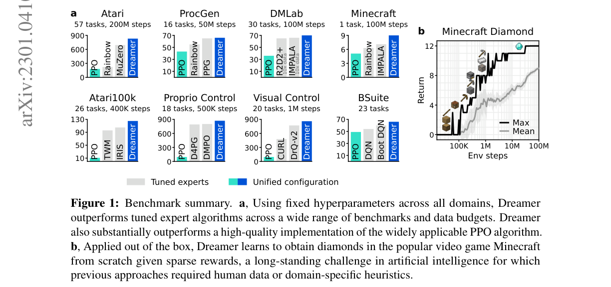
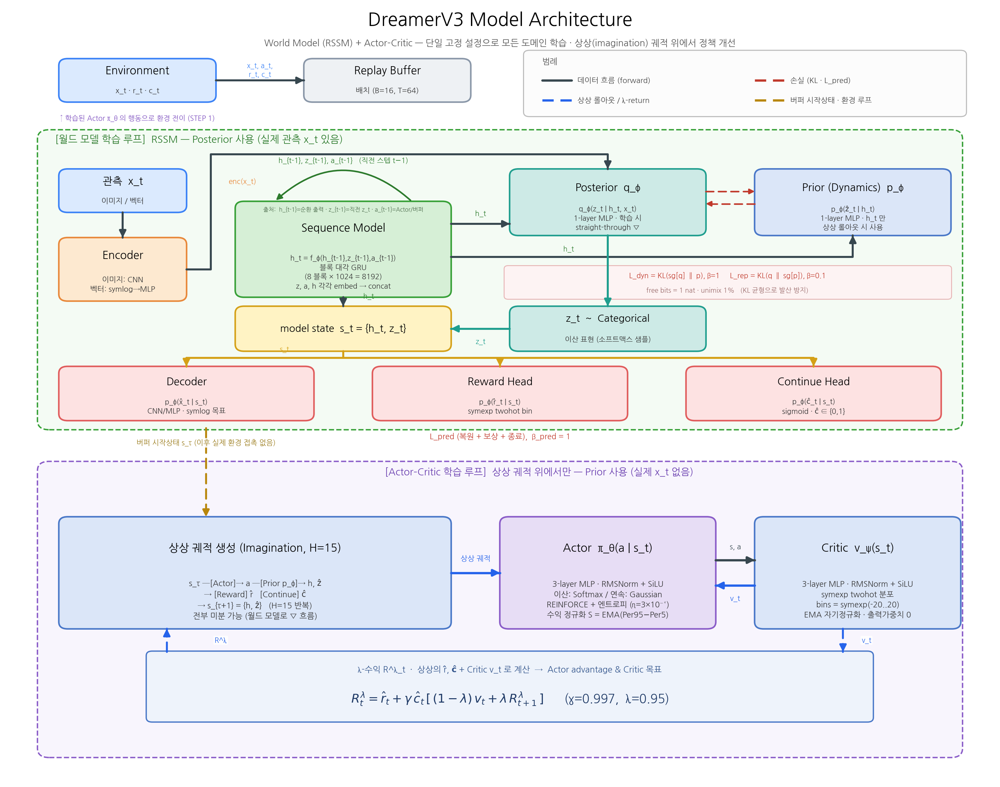
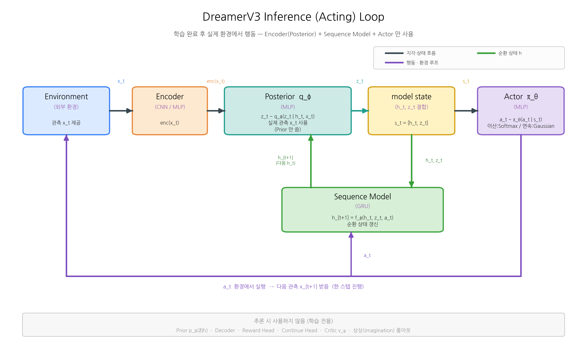
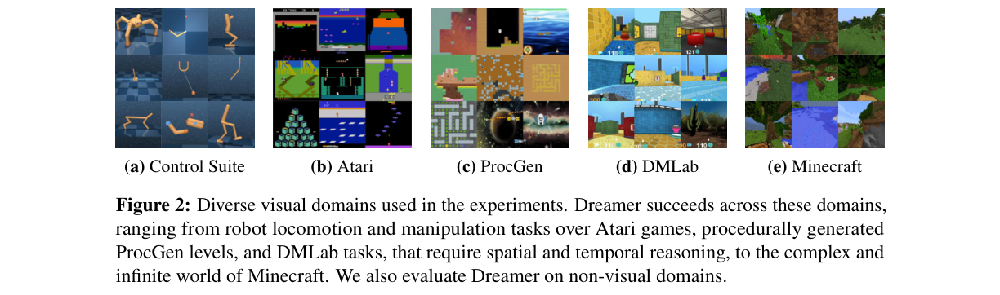
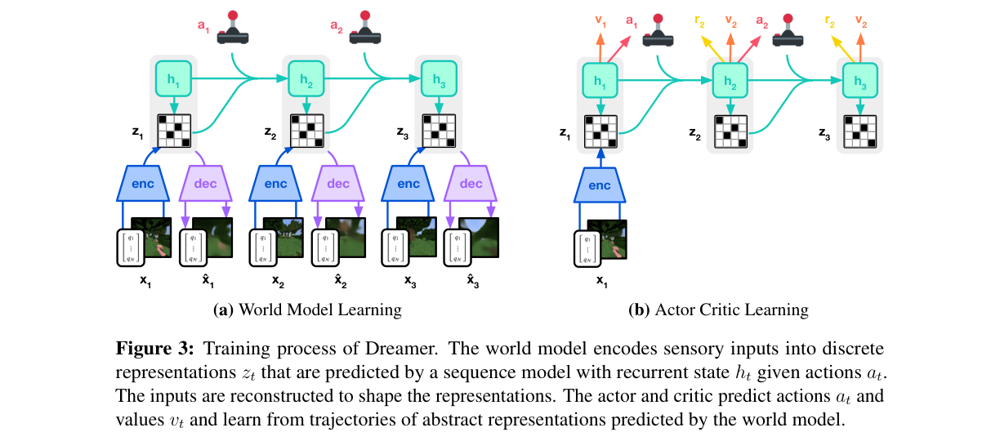
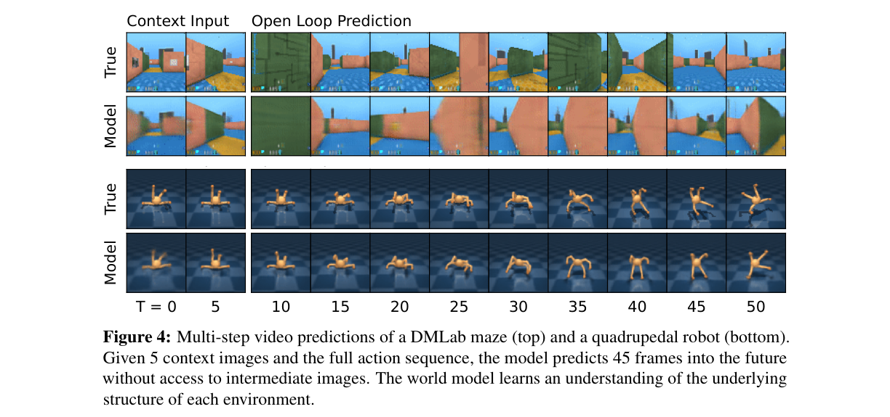
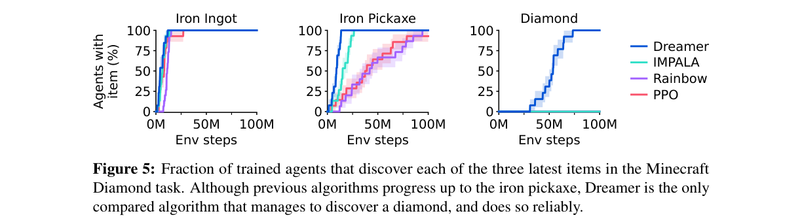
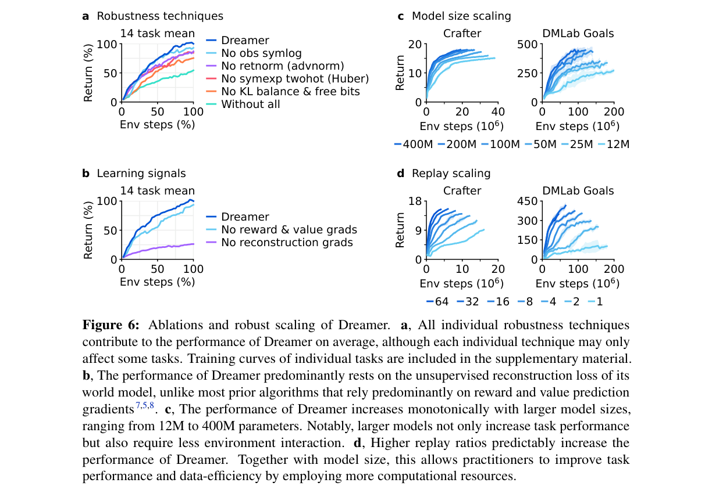

# Mastering Diverse Domains through World Models

저자 :

Danijar Hafner, Jurgis Pasukonis, Jimmy Ba, Timothy Lillicrap

Google DeepMind

University of Toronto

발표 : arXiv 2023

논문 : [PDF](https://arxiv.org/pdf/2301.04104)

출처 : [https://arxiv.org/abs/2301.04104](https://arxiv.org/abs/2301.04104)

---

## 0. Summary

<p align='center'>

</p>

본 논문은 **DreamerV3**, 즉 Dreamer 계열의 3세대 강화학습(RL) 알고리즘을 제안한다. 핵심 메시지는 단 하나의 고정된 하이퍼파라미터 설정(single fixed configuration)으로 8개 도메인, 150개 이상의 과제에서 각 분야에 맞춰 튜닝된 전문 알고리즘(tuned experts)을 능가한다는 것이다. 특히 사람 데이터나 커리큘럼 없이 Minecraft에서 처음부터(from scratch) 다이아몬드를 채굴한 최초의 알고리즘이다.

### 0.1. 문제 (Problem)

* 기존 RL 알고리즘은 개발된 과제와 비슷한 환경에는 잘 적용되지만, **새로운 도메인으로 옮기면(예: 비디오 게임 → 로봇 제어)** 하이퍼파라미터 튜닝에 막대한 전문 지식·실험·연산이 필요하다.
* 이런 취약성(brittleness) 때문에 PPO 같은 범용 알고리즘조차 전문 알고리즘보다 성능이 낮고, 튜닝 비용이 큰 과제에는 RL 적용 자체가 어렵다.
* **월드 모델(world model) 기반 접근**은 직관적으로 매력적이지만, 보상의 크기(scale)와 빈도(frequency)가 도메인마다 수십~수만 배씩 다르기 때문에 손실 항들의 균형을 맞추며 안정적으로 학습하기가 오랫동안 미해결 문제였다.

### 0.2. 핵심 아이디어 (Core Idea)

* **월드 모델(World Model)** — (a) 환경의 동작 규칙을 신경망으로 학습한 "머릿속 시뮬레이터"다. (b) 실제 환경에서 매번 행동을 시험하면 느리고 위험하므로, 모델 안에서 미래를 미리 그려보고 학습한다. (c) 비유: 체스 선수가 손을 대기 전에 머릿속으로 몇 수 앞을 두어보는 것과 같다. Dreamer는 관측을 **이산 표현(discrete representation, 작은 숫자 코드들의 집합)** $z_t$ 로 압축하고, 순환 상태 $h_t$ 로 다음 표현을 예측한다.
* **상상 학습(Imagination)** — (a) 행동(actor)과 가치(critic)를 실제 데이터가 아니라 월드 모델이 만들어낸 가상 궤적(trajectory) 위에서 학습한다. (b) 실제 상호작용은 비싸므로, 한 번 본 경험으로부터 머릿속에서 수많은 미래를 굴려 정책을 개선한다. (c) 비유: 행동하기 전에 머릿속으로 결과를 시뮬레이션해보는 것.
* **견고성 기법(Robustness Techniques) — 이 논문의 진짜 contribution.** 하나의 설정으로 모든 도메인을 다루기 위한 5가지 장치다.
  * **symlog 변환** — (a) 큰 값과 작은 값을 같은 "자(scale)"로 압축하는 함수 $\mathrm{symlog}(x)=\mathrm{sign}(x)\ln(|x|+1)$. (b) 보상·관측의 크기가 도메인마다 달라도 한 설정으로 학습되게 한다. (c) 비유: 로그 자처럼 큰 수도 작은 수도 한눈에 보이게 눌러주되, 부호는 보존.
  * **symexp twohot 손실** — (a) 보상/가치를 하나의 실수로 회귀하지 않고, 지수 간격으로 배치된 칸(bin)들에 대한 **분포**로 예측한다. (b) 그래디언트 크기를 예측 목표값의 크기로부터 분리해 발산을 막는다. (c) 비유: 정확한 값을 콕 찍는 대신 인접한 두 칸에 확률을 나눠 거는 것.
  * **백분위 수익 정규화(percentile return normalization)** — 수익(return)을 5~95 백분위 범위로 나눠 대략 $[0,1]$ 에 맞추어, 고정된 엔트로피 스케일 $\eta=3\times10^{-4}$ 로 희소 보상에서도 탐험을 유지한다.
  * **KL 균형 + free bits**, **1% unimix** — KL 손실의 두 방향을 분리해 가중치를 다르게 주고(가중치 $\beta_{dyn}=1$, $\beta_{rep}=0.1$), 1나트(nat) 이하에서는 손실을 끄며, 분포를 1% 균등분포와 섞어 결정론적으로 붕괴하지 않게 한다.

### 0.3. 효과 (Effects)

* **하나의 설정으로 모든 도메인**: Atari, ProcGen, DMLab, Minecraft, Atari100k, 자기수용 제어(Proprio Control), 시각 제어(Visual Control), BSuite 등 8개 도메인에서 동일한 하이퍼파라미터로 동작.
* **예측 가능한 스케일링**: 모델 크기(12M→400M)와 리플레이 비율(replay ratio)을 키울수록 성능이 단조 증가하고, 큰 모델은 더 적은 상호작용으로 과제를 해결한다.
* **재현성**: 각 에이전트가 단 1개의 Nvidia A100 GPU로 학습되어 많은 연구실에서 재현 가능.
* **비지도 신호 의존**: 성능이 대부분 월드 모델의 비지도 복원(reconstruction) 손실에 의존 → 향후 비지도 사전학습 활용 가능성.

### 0.4. 결과 (Results)

* **Minecraft Diamond**: Dreamer가 100M 스텝 내에 학습한 모든 에이전트가 다이아몬드를 발견(학습 전체 기준 100%), baseline은 0%. 100M 스텝 평균 수익 Dreamer 9.1 vs IMPALA 7.1 / Rainbow 6.3 / PPO 5.1.
* **Atari (57개, 200M)**: gamer-median 830% 로 MuZero(693%), PPO(180%)를 능가.
* **DMLab (30개, 100M)**: 1B 스텝까지 학습한 IMPALA/R2D2+ baseline을 100M 스텝만으로 능가 → 1000% 이상의 데이터 효율 향상.
* **Proprio / Visual Control, BSuite**: 각각 D4PG·DMPO, DrQ-v2·CURL, Boot DQN 등 전문 알고리즘 대비 새로운 SOTA. 모든 도메인에서 PPO를 큰 격차로 능가.

### 0.5. 상세 동작 방식 (How It Works)

Dreamer는 **(1) 월드 모델 학습**과 **(2) Actor-Critic 학습** 두 루프가 리플레이된 경험으로부터 동시에(concurrently) 돌아가는 구조다.

**Step 1. 인코딩(Encoding)** — 입력: 환경 관측 $x_t$(이미지는 CNN, 벡터는 symlog 후 MLP). 처리: 인코더가 관측을 **이산 표현** $z_t$(소프트맥스 분포에서 샘플, straight-through 그래디언트)로 압축. 출력: 작은 코드 벡터 $z_t$.

**Step 2. 시퀀스 모델(RSSM)** — 입력: 직전 상태 $h_{t-1}$, 직전 표현 $z_{t-1}$, 직전 행동 $a_{t-1}$. 처리: GRU 기반 순환 모델 $h_t=f_\phi(h_{t-1},z_{t-1},a_{t-1})$ 가 다음 표현을 예측($\hat z_t$). 출력: 순환 상태 $h_t$. 이때 model state $s_t=\{h_t,z_t\}$ 가 정의된다.

**Step 3. 복원/예측(Heads)** — model state로부터 디코더는 관측 $\hat x_t$, 보상 예측기는 $\hat r_t$, 종료 예측기는 $\hat c_t$ 를 예측. 복원 손실로 표현이 정보를 담도록 만든다.

**Step 4. 상상(Imagination)** — 입력: 리플레이된 관측의 표현. 처리: 월드 모델 + actor가 실제 환경 없이 가상 궤적 $s_{1:T},a_{1:T},r_{1:T}$ 를 생성(예측 지평 $T=16$). 출력: 미래 궤적.

**Step 5. Critic & Actor 학습** — Critic은 부트스트랩 $\lambda$-수익 $R^\lambda_t$ 를 twohot 분포로 예측하고, Actor는 정규화된 수익으로 Reinforce 그래디언트 + 엔트로피 정규화로 행동을 개선. 학습된 Actor를 환경에 적용해 새 경험을 모으고 다시 Step 1로.

```
[관측 x_t] → [Encoder] → [이산 표현 z_t] ─┐
                                          ├─→ [model state s_t=(h_t,z_t)] → [Decoder/Reward/Continue 복원]
[a_{t-1}] → [RSSM seq model] → [h_t] ─────┘
                  (1) 월드 모델 학습 루프
─────────────────────────────────────────────────────────
[replay s 시작] → [월드 모델로 미래 상상] → [Critic: λ-return] → [Actor: 행동 선택] → [환경 상호작용] ↺
                  (2) Actor-Critic 학습 루프
```

### 0.6. 모델 아키텍처 (Architecture Block Diagram)

DreamerV3는 **월드 모델(RSSM)**, **Actor**, **Critic** 세 신경망으로 구성된다. 아래는 기본 200M 모델(hidden size d=1024) 기준의 전체 구조와 데이터 흐름이다.

<p align='center'>

</p>

위 개념도는 두 학습 루프를 한눈에 보여준다. **위쪽(초록)** 은 월드 모델(RSSM) 학습 루프로, 실제 관측 $x_t$ 가 있으므로 **Posterior $q_\phi(z_t\mid h_t,x_t)$** 를 사용해 $z_t$ 를 추정하고 Decoder·Reward·Continue 헤드로 복원한다($L_{pred}$, $L_{dyn}$, $L_{rep}$). **아래쪽(보라)** 은 Actor-Critic 학습 루프로, 실제 환경 접촉 없이 **Prior $p_\phi(\hat z_t\mid h_t)$** 만으로 상상 궤적(H=15)을 굴려 $\lambda$-수익으로 Critic·Actor를 학습한다. 학습된 Actor는 다시 환경에 적용되어 새 경험을 모은다(우측 점선 루프). 아래는 동일 구조를 텍스트로 상세히 펼친 것이다.

```
━━━━━━━━━━━━━━━━━━━━━━━━━━━━━━━━━━━━━━━━━━━━━━━━━━━━━━━━━━━━━━━━━━━━━━━━
  [A] 환경 ↔ 리플레이 버퍼                     [B] 학습 (배치 길이 T=64)
━━━━━━━━━━━━━━━━━━━━━━━━━━━━━━━━━━━━━━━━━━━━━━━━━━━━━━━━━━━━━━━━━━━━━━━━

  Environment
     │  x_t (관측), r_t, c_t, a_t
     ▼
  Replay Buffer ──────────────────────────────► 배치 샘플
                                                    │
                     ┌──────────────────────────────┘
                     ▼
━━━━━━━━━━━━━━━━━━━━━━━━━━━━━━━━━━━━━━━━━━━━━━━━━━━━━━━━━━━━━━━━━━━━━━━━
  [C] 월드 모델 학습 루프 — RSSM (Recurrent State-Space Model)
━━━━━━━━━━━━━━━━━━━━━━━━━━━━━━━━━━━━━━━━━━━━━━━━━━━━━━━━━━━━━━━━━━━━━━━━

  관측 x_t
    │
    ├─[이미지]── CNN encoder (stride-2 conv → 6×6 또는 4×4, ch=d/16=64) ─► enc(x_t)
    └─[벡터]─── symlog 변환 → 3-layer MLP (h=d=1024) ──────────────────► enc(x_t)
                                                                              │
                                                                              ▼
  ┌──────────────────────────────────────────────────────────────────────────────┐
  │  시퀀스 모델 (Sequence Model)    h_t = f_φ(h_{t-1}, z_{t-1}, a_{t-1})       │
  │                                                                              │
  │   z_{t-1} ──► linear embed ──┐                                              │
  │   a_{t-1} ──► linear embed ──┼─► concat ─► 블록 대각 GRU (1 스텝)            │
  │   h_{t-1} ──► linear embed ──┘             (8 블록 × 1024 = 8192 유닛)       │
  │                  ↑                               │                          │
  │    h_{t-1}도 embed하는 이유:                      ▼                          │
  │    블록 대각 구조는 블록 간 recurrent              h_t (결정론적 순환 상태)      │
  │    가중치가 없으므로, embed 단계에서                                           │
  │    cross-block 정보 혼합이 이루어짐                                            │
  └──────────────────────────────────────────────────┬───────────────────────────┘
                                                     │ h_t
                        ┌────────────────────────────┤
                        │                            │
                        ▼                            ▼
         ┌───────────────────────────┐  ┌──────────────────────────────┐
         │  Prior (Dynamics)         │  │  Posterior (Encoder)         │
         │  p_φ(ẑ_t | h_t)          │  │  q_φ(z_t | h_t, x_t)        │
         │                           │  │                              │
         │  입력: h_t 만             │  │  입력: h_t  +  enc(x_t)      │
         │  구조: 1-layer MLP        │  │  구조: 1-layer MLP           │
         │  출력: categorical logits │  │  출력: categorical logits    │
         │                           │  │                              │
         │  관측 없이 미래 latent 예측 │  │  실제 관측을 반영한 z_t 추정  │
         │  → 상상 롤아웃에서만 사용   │  │  → 학습 시에만 사용          │
         │                           │  │  straight-through ∇          │
         └──────────────┬────────────┘  └──────────────────┬───────────┘
                    │                               │
            L_dyn = KL(sg(posterior) || prior)      │ L_rep = KL(posterior || sg(prior))
            β_dyn = 1                               │ β_rep = 0.1
            free bits = 1 nat (양쪽 적용)             │ 1% unimix (KL 발산 방지)
                    └───────────────────────────────┘
                                    │
                          z_t ~ Categorical (코드 수 = d/16 = 64 / latent)
                                    │
                            s_t = {h_t,  z_t}
                     ┌──────────────┼──────────────────┐
                     ▼              ▼                  ▼
          ┌──────────────┐  ┌───────────────┐  ┌───────────────────┐
          │   Decoder    │  │  Reward Head  │  │  Continue Head    │
          │ p_φ(x̂_t|s_t)│  │p_φ(r̂_t|s_t) │  │ p_φ(ĉ_t | s_t)   │
          │              │  │               │  │                   │
          │ 이미지: CNN† │  │ 1-layer MLP   │  │ 1-layer MLP       │
          │ 벡터: 3-MLP  │  │ symexp twohot │  │ logistic (sigmoid) │
          │ (symlog 목표) │  │ (지수 간격 bin│  │ → ĉ_t ∈ {0,1}    │
          └──────────────┘  │  B=symexp     │  └───────────────────┘
                 L_pred(복원)│  (-20..+20))  │      L_pred(종료)
                 β_pred=1   └───────────────┘      (β_pred=1)
                                L_pred(보상)
                                β_pred=1

  †  decoder: transposed stride-2 conv, sigmoid 출력

━━━━━━━━━━━━━━━━━━━━━━━━━━━━━━━━━━━━━━━━━━━━━━━━━━━━━━━━━━━━━━━━━━━━━━━━
  [D] Actor-Critic 학습 루프 — 상상 궤적 위에서만 학습
━━━━━━━━━━━━━━━━━━━━━━━━━━━━━━━━━━━━━━━━━━━━━━━━━━━━━━━━━━━━━━━━━━━━━━━━

  ▶ 매 훈련 스텝 순서 (3단계):
  ┌────────────────────────────────────────────────────────────────────┐
  │  STEP 1  실제 환경 접촉                                            │
  │   Environment → a_t (현재 Actor로 샘플) → x_t, r_t → Replay Buffer │
  │   (소량의 실제 경험만 수집 — 보통 replay ratio 32배)               │
  ├────────────────────────────────────────────────────────────────────┤
  │  STEP 2  월드 모델(RSSM) 파라미터 업데이트                         │
  │   Buffer에서 배치(B=16, T=64) 샘플 → Posterior 사용 → L_pred/dyn/rep│
  │   (실제 관측 x_t가 있으므로 Posterior q_φ(z_t|h_t,x_t) 사용)     │
  ├────────────────────────────────────────────────────────────────────┤
  │  STEP 3  Actor / Critic 파라미터 업데이트  ← 실제 환경 접촉 없음   │
  │   Buffer에서 시작 상태 s_τ 샘플 → Prior로 H=15 상상 → 손실 계산   │
  └────────────────────────────────────────────────────────────────────┘

  ▶ 상상 궤적 생성 (STEP 3 상세):

  Prior를 쓰는 이유: 학습 후 Prior는 h_t만으로 ẑ_t를 예측할 수 있음
                    → 실제 x_t 없이도 "머릿속으로" 세계를 시뮬레이션 가능
                    (Posterior는 x_t가 필요하므로 상상 시 사용 불가)

  버퍼에서 꺼낸 s_τ = {h_τ, z_τ}
        │
        │  ← 이 이후로 실제 환경에 접촉하지 않음
        ▼
  ┌─────────────────────────────────────────────────────────────────────┐
  │  상상 궤적 생성  (H=15 transitions = T=16 states)                   │
  │                                                                     │
  │  s_τ ─[Actor π_θ]─► a_τ ─[RSSM Prior p_φ]─► h_{τ+1}, ẑ_{τ+1}    │
  │                              │                      │               │
  │                   [Reward Head]              s_{τ+1} = {h, ẑ}      │
  │                   [Continue Head]                   │               │
  │                              │                      ▼               │
  │                            r̂, ĉ           반복 (H=15번)            │
  │                                                                     │
  │  결과: (s_τ, a_τ, r̂_τ, ĉ_τ), ..., (s_{τ+H}, v_{τ+H})             │
  │        ↑ 전부 미분 가능(월드 모델 파라미터에 대해 gradient 흐름)    │
  └──────────────────────────────────────────┬──────────────────────────┘
                                             │
                  ┌──────────────────────────┤
                  │                          │
                  ▼                          ▼
  ┌───────────────────────────────┐   ┌──────────────────────────────────────┐
  │  Actor  π_θ(a_t | s_t)       │   │  Critic  v_ψ(s_t)                    │
  │                               │   │                                      │
  │  3-layer MLP (h=d=1024)      │   │  3-layer MLP (h=d=1024)              │
  │  RMSNorm + SiLU 활성화        │   │  RMSNorm + SiLU 활성화               │
  │                               │   │                                      │
  │  이산 행동 → Softmax           │   │  출력: symexp twohot 분포             │
  │  연속 행동 → 가우시안 파라미터  │   │   B = symexp(-20,...,+20) 지수 간격 빈│
  │  (둘 다 1% unimix)            │   │   v_t = E[v_ψ(·|s_t)]               │
  │                               │   │                                      │
  │  손실: REINFORCE 추정기         │   │  λ-수익 목표 (상상 궤적에서 계산):    │
  │   +  엔트로피 H[π] (η=3×10⁻⁴) │   │   R^λ_t = r̂_t + γĉ_t·(            │
  │                               │   │    (1-λ)v_t + λR^λ_{t+1})           │
  │  수익 정규화 S:                 │   │   γ=0.997, λ=0.95                   │
  │  EMA(Per(R^λ,95)-Per(R^λ,5), │   │                                      │
  │       decay=0.99), 한계 L=1   │   │  EMA 자기 정규화 (decay=0.98)         │
  │                               │   │  출력 가중치 0 초기화                  │
  └───────────────────────────────┘   │  상상 손실(β_val=1)+리플레이(β_repval=0.3)│
                                      └──────────────────────────────────────────┘

━━━━━━━━━━━━━━━━━━━━━━━━━━━━━━━━━━━━━━━━━━━━━━━━━━━━━━━━━━━━━━━━━━━━━━━━
  [E] 학습 인프라 (200M 기본 모델, 단일 설정 — 모든 도메인 공통)
━━━━━━━━━━━━━━━━━━━━━━━━━━━━━━━━━━━━━━━━━━━━━━━━━━━━━━━━━━━━━━━━━━━━━━━━

  Hidden size d = 1024     │  GRU 유닛 = 8d = 8192 (8 블록 × 1024)
  CNN base ch  = d/16 = 64 │  Latent codes = d/16 = 64 / latent
  Batch size B = 16        │  Batch length T = 64 스텝
  Learning rate = 4×10⁻⁵  │  Optimizer: LaProp (ε=10⁻²⁰) + AGC(0.3)
  β_pred=1, β_dyn=1        │  β_rep=0.1 │ free bits=1 nat │ unimix=1%
  Activation: RMSNorm + SiLU
```

핵심 설계 포인트 요약:

| 컴포넌트 | 역할 | 핵심 설계 |
|---|---|---|
| **Encoder** | x_t → enc(x_t) | 이미지: CNN stride-2; 벡터: symlog + MLP |
| **RSSM 시퀀스 모델** | → h_t (결정론적) | z,a,h 각각 linear embed → concat → 블록 대각 GRU 1스텝; h도 embed해야 cross-block mixing 가능 |
| **Posterior** q_φ | (h_t, enc(x_t)) → z_t | 1-layer MLP; h_t + enc(x_t) 입력; 학습 시에만 사용 |
| **Prior** p_φ | h_t → ẑ_t | 1-layer MLP; h_t만 입력; 상상 롤아웃 시 사용 |
| **Decoder** | s_t → x̂_t | 이미지: transposed CNN; 벡터: MLP |
| **Reward Head** | s_t → r̂_t | 1-layer MLP, symexp twohot |
| **Continue Head** | s_t → ĉ_t | 1-layer MLP, sigmoid |
| **Actor** | s_t → a_t | 3-layer MLP, REINFORCE + entropy |
| **Critic** | s_t → v_t | 3-layer MLP, symexp twohot, λ-return |

#### 0.6.1. 보충 설명 — 백분위 수익 정규화 (Percentile Return Normalization)

위 다이어그램의 Actor 박스에 있는 `수익 정규화 S = EMA(Per95−Per5)` 는 DreamerV3가 **단일 고정 설정으로 모든 도메인**을 다루게 하는 핵심 robustness 장치다. 한 문장에 압축돼 있어 따로 풀어 설명한다.

**(1) 왜 정규화가 필요한가 — 문제의 본질**

Actor 손실은 두 항의 균형이다.

$$L(\theta) = -\sum_{t}\mathrm{sg}\!\left(\frac{R^\lambda_t - v_\psi(s_t)}{\max(1,\,S)}\right)\log\pi_\theta(a_t\mid s_t)\;+\;\underbrace{\eta\,H[\pi_\theta]}_{\text{탐험 항}}$$

* **앞 항(정책 그래디언트)**: advantage $A_t = R^\lambda_t - v_\psi(s_t)$ 가 클수록 그 행동을 강화 → **활용(exploit)**
* **뒤 항(엔트로피)**: 정책을 무작위에 가깝게 유지 → **탐험(explore)**, 조기 붕괴 방지

균형은 두 항의 **상대적 크기**로 정해지는데, 도메인마다 수익(return) 규모가 수십~수만 배씩 다르다(밀집 보상 Atari ~수백~수천, 희소 보상 Minecraft ~0–10, 일부 제어 ~0.001). $\eta$ 를 고정하면 return이 큰 도메인은 advantage가 엔트로피를 압도해 탐험이 사라지고, return이 작은 도메인은 엔트로피가 압도해 활용을 못 한다. **하나의 $\eta$ 로 모든 도메인을 쓰려면 advantage를 도메인 무관하게 $O(1)$ 스케일로 맞춰야 한다.**

**(2) 무엇으로 나누는가 — 백분위 "범위" $S$**

advantage를 수익의 전형적 변동폭 $S$ 로 나눠 $O(1)$ 로 만든다.

$$S = \mathrm{EMA}\big(\underbrace{\mathrm{Per}(R^\lambda,\,95) - \mathrm{Per}(R^\lambda,\,5)}_{\text{95분위값} - \text{5분위값}},\;\;0.99\big)$$

상·하위 5%를 잘라낸 "수익이 퍼져 있는 폭"으로 나누면 수익이 대략 $[0,1]$ 로 압축된다.

**(3) 세 가지 설계 선택의 "왜"**

| 선택 | 이유 |
|---|---|
| **5–95 백분위 범위** (min/max·std 대신) | `max−min`은 단일 outlier 에피소드에 폭발하고, `std`는 RL 수익의 다봉·heavy-tailed·희소(대부분 0+가끔 스파이크) 분포에서 스파이크에 휘둘린다. 백분위 범위는 양 끝 5%를 무시해 **outlier에 강건(robust)** 하다. |
| **$\max(1, S)$ — 큰 값만 줄이고 작은 값은 안 키움 (비대칭)** | $S>1$ 이면 나눠서 줄이지만, $S<1$ 이면 분모를 **1로 고정**해 키우지 않는다. 수익이 진짜 작은 구간(희소 보상·학습 초기)의 advantage는 대부분 **critic의 근사 오차(노이즈)** 라, 작은 $S$ 로 나눠 증폭하면 정책이 노이즈를 쫓아 발산한다. 안 키우면 엔트로피가 상대적으로 우세 → **보상을 찾을 때까지 탐험 유지.** |
| **EMA (decay 0.99)** | 백분위는 매 배치 상상 수익에서 계산돼 출렁이고 정책 개선에 따라 분포도 변한다. 느린 이동평균으로 평활화해 정규화 스케일을 안정화한다. |

이 **비대칭**이 핵심이다. 같은 고정 $\eta$ 하나로 — 밀집 보상에선 큰 수익이 $O(1)$ 로 정규화돼 엔트로피와 균형을 이뤄 적절히 활용하고, 희소 보상에선 작은 수익이 안 키워져 엔트로피가 우세해 보상을 찾을 때까지 탐험을 지속한다.

**(4) 마지막 퍼즐 — `sg(·)` 와 고정 $\eta = 3\times10^{-4}$**

정규화 스케일 $S$ 에는 **stop-gradient `sg`** 를 씌워 상수로 취급(그래디언트는 $\log\pi$ 로만 흐름)한다. advantage가 도메인 무관하게 $O(1)$ 이 됐으므로 작고 고정된 $\eta=3\times10^{-4}$ 가 모든 곳에서 동작한다 — 실제 신호($A_t\sim O(1)$)가 있으면 활용이 이기고, 신호가 0에 가까우면 작은 엔트로피 보너스가 이겨 탐험한다.

> **한 줄 요약**: advantage를 **5–95 백분위로 robust하게** $O(1)$ 로 맞추되, **큰 수익만 줄이고 작은 수익은 그대로 둬서**(`max(1,S)`) 보상이 없을 땐 탐험이 자연히 이기게 만드는 장치. 도메인마다 보상 스케일·엔트로피 계수를 튜닝하던 일을 **단일 고정 $\eta$** 로 대체한다.

#### 0.6.2. 보충 설명 — KL 균형 + free bits + 1% unimix

위 다이어그램의 KL 박스(`L_dyn = KL(sg[q] ‖ p), β=1`, `L_rep = KL(q ‖ sg[p]), β=0.1`, `free bits = 1 nat · unimix 1%`)에 담긴 세 장치는 모두 **월드 모델의 KL 손실을 안정적으로 학습**시키기 위한 것이다. 셋이 서로 다른 실패 모드를 막는다.

**(1) 배경 — RSSM의 KL 손실이 하는 일**

RSSM에는 두 분포가 있다.

* **Posterior $q_\phi(z_t\mid h_t, x_t)$** — 인코더. **실제 관측 $x_t$ 를 본** 뒤 $z_t$ 를 추정.
* **Prior $p_\phi(\hat z_t\mid h_t)$** — dynamics 예측기. **$h_t$ 만 보고**(관측 없이) 다음 latent 예측.

이 둘의 KL을 줄이는 데는 두 목적이 섞여 있다 — (i) **prior가 posterior를 예측하도록** 학습(상상 롤아웃에서 관측 없이 latent를 만들려면 필수), (ii) 표현이 너무 예측 불가능해지지 않도록 **posterior를 규제**. 그런데 단일 KL $\mathrm{KL}[q\|p]$ 를 그냥 최소화하면 **나쁜 방향**으로도 줄일 수 있다: prior를 posterior에 맞추는 대신(좋음), **posterior가 정보를 버려 prior처럼 단순해지는 것**(나쁨 — 표현 붕괴)으로도 KL이 줄어든다.

**(2) KL 균형 (KL balancing) — 두 방향 분리 + 비대칭 가중치**

그래서 KL을 **stop-gradient 위치만 다른 두 복사본**으로 쪼개고 가중치를 다르게 준다.

$$L_{dyn}(\phi) = \max\big(1,\ \mathrm{KL}[\,\mathrm{sg}(q_\phi(z_t\mid h_t,x_t))\ \|\ p_\phi(z_t\mid h_t)\,]\big),\qquad \beta_{dyn}=1$$

$$L_{rep}(\phi) = \max\big(1,\ \mathrm{KL}[\,q_\phi(z_t\mid h_t,x_t)\ \|\ \mathrm{sg}(p_\phi(z_t\mid h_t))\,]\big),\qquad \beta_{rep}=0.1$$

* **$L_{dyn}$**: posterior에 `sg` → posterior를 고정한 채 **prior $p$ 만 학습**(dynamics가 표현을 따라가도록). "dynamics 손실".
* **$L_{rep}$**: prior에 `sg` → prior를 고정한 채 **posterior $q$ 만 학습**(표현이 prior 쪽으로 약간 끌려가도록). "표현 손실".

**왜 비대칭($\beta_{dyn}=1 \gg \beta_{rep}=0.1$)인가?** 우리는 **prior가 열심히 posterior를 예측하길** 원한다(dynamics 학습이 주목적) → $L_{dyn}$ 에 큰 가중치. 반대로 **posterior를 미성숙한 prior에 맞추려고 정보를 버리게 하면 안 된다** → $L_{rep}$ 에 작은 가중치. 표현은 주로 복원 손실 $L_{pred}$ 가 빚어내고, KL은 "표현을 따라잡는 dynamics" 쪽에 압력을 집중시킨다. (DreamerV2의 KL balancing을 계승.)

**(3) free bits — 1 nat 이하면 손실 끔**

두 손실 모두 $\max(1,\ \cdot)$ 로 감싸, KL이 이미 **1 nat(≈1.44 비트)** 아래면 손실을 상수로 만들어 **그래디언트를 0으로**(=꺼버림) 한다.

* **posterior collapse 방지**: KL을 0까지 계속 밀면 $z_t$ 가 관측 정보를 안 담고 prior로 붕괴한다. free bits는 "1 nat까지는 **공짜**(페널티 없음)"라는 예산을 줘서 latent가 실제로 정보를 쓰도록 유도한다.
* **낭비 방지**: dynamics가 이미 잘 맞추는 스텝을 더 짜내봐야 의미 없다. 충분히 작아진 KL은 끄고, 그래디언트를 **예측이 어려운 스텝**에 집중시킨다. (VAE의 free bits, Kingma 2016 계열.)

> **왜 `1 nat ≈ 1.44 bit`인가?** 정보량은 **로그 밑(base)** 에 따라 단위가 갈린다 — **nat**은 자연로그 $\ln$(밑 $e$), **bit**은 $\log_2$(밑 2)로 잰 같은 양이다. 밑변환 $\log_2(x)=\ln(x)/\ln 2$ 에서 $1\ \text{nat} = \tfrac{1}{\ln 2}\ \text{bit} = \log_2(e) \approx 1.443\ \text{bit}$. 직관적으로 1 bit는 확률이 **2배**, 1 nat은 **$e\approx2.718$배** 좁혀진 정보량이라 $e$-배가 2-배보다 커서 1 nat이 더 크다. DreamerV3의 임계값은 코드상 **1 nat**(자연로그로 계산한 KL=1)이고, 비트 표기는 독자 직관을 위한 병기일 뿐 실제 손실은 nat 기준으로 계산된다.

**(4) 1% unimix — 99% 신경망 출력 + 1% 균등분포**

인코더·dynamics의 범주형(categorical) 분포를 신경망 출력 그대로 쓰지 않고 균등분포와 섞는다.

$$\text{mixed} = 0.99\cdot\mathrm{softmax}(\text{logits}) + 0.01\cdot\text{Uniform}$$

* **KL 폭주 방지**: 한 분포가 어떤 범주에 확률 ≈0을 주고 다른 분포가 0이 아니면 KL이 **무한대로 발산**한다. 1% 균등분포를 섞으면 모든 범주가 최소 확률을 가져 **KL이 유한하게 유지**된다.
* **결정론적 붕괴 방지**: 분포가 거의 one-hot(결정론적)이 되면 그래디언트가 사라져 회복 불능이 된다. 1% 바닥이 약간의 확률성을 남겨 분포가 한 점으로 무너지지 않게 한다.

**세 장치 요약**

| 장치 | 막는 실패 모드 | 핵심 |
|---|---|---|
| **KL 균형** | 학습 압력이 엉뚱한 방향(표현 붕괴)으로 흐름 | KL을 두 방향으로 분리, `sg`로 한쪽씩만 학습; $\beta_{dyn}=1\gg\beta_{rep}=0.1$ 로 "prior가 posterior를 따라가게" |
| **free bits** | over-regularization → posterior collapse | $\max(1,\mathrm{KL})$ — 1 nat 이하면 손실 끔; latent가 정보를 담을 "예산" 부여 |
| **1% unimix** | KL 발산 · 결정론적 붕괴 | $0.99\cdot$net $+\,0.01\cdot$uniform; 0 확률 제거로 KL 유한화 + 확률성 유지 |

이 손실들은 복원 손실과 합쳐 월드 모델 전체 손실을 이룬다($\beta_{pred}=1,\ \beta_{dyn}=1,\ \beta_{rep}=0.1$).

$$L(\phi) = \mathbb{E}_{q_\phi}\Big[\textstyle\sum_{t=1}^{T}\big(\beta_{pred}L_{pred} + \beta_{dyn}L_{dyn} + \beta_{rep}L_{rep}\big)\Big]$$

> **한 줄 요약**: **KL 균형**은 학습 압력을 옳은 방향(prior→posterior 추종)으로 돌리고, **free bits**는 과도한 규제로 latent가 붕괴하는 것을 막으며, **1% unimix**는 KL이 발산하거나 분포가 결정론적으로 무너지는 것을 막는다 — 세 장치가 함께 KL 학습을 안정화해 "단일 설정으로 모든 도메인"을 떠받친다.

#### 0.6.3. 추론(Inference) 루프 — 학습이 끝난 뒤 실제 환경에서 행동

위 다이어그램은 **학습 루프 2개**(월드 모델 / Actor-Critic)다. 학습이 끝나 **실제로 행동할 때(inference)** 는 구조가 훨씬 단순해진다 — 상상도, Critic도, 복원·예측 헤드도 쓰지 않는다.

<p align='center'>

</p>

**추론 시 한 스텝의 흐름**:

1. 환경에서 관측 $x_t$ 받음
2. Encoder → **Posterior** $q_\phi(z_t\mid h_t, x_t)$ 로 $z_t$ 추정 — 실제 관측이 있으므로 Prior가 아니라 **Posterior**를 쓴다
3. model state $s_t = \{h_t, z_t\}$ 구성
4. **Actor** $\pi_\theta(a_t\mid s_t)$ 로 행동 $a_t$ 선택
5. $a_t$ 를 환경에서 실행 → 다음 관측 $x_{t+1}$
6. Sequence Model로 순환 상태 갱신 $h_{t+1} = f_\phi(h_t, z_t, a_t)$ → 1번으로 반복

* **사용**: Encoder(Posterior) · Sequence Model(GRU) · Actor
* **불필요(학습 전용)**: Prior, Decoder, Reward/Continue Head, Critic, 상상(imagination) 롤아웃

**왜 RSSM 학습 후에 Actor-Critic 학습이 또 필요한가?**

둘은 **서로 다른 질문에 답한다.**

| | RSSM (월드 모델) | Actor-Critic |
|---|---|---|
| 답하는 질문 | "세계가 **어떻게 작동**하는가?" | "그래서 **무엇을 해야** 하는가?" |
| 정체 | 예측기 / **시뮬레이터** | **정책 + 가치함수** |
| 학습 방식 | 자기지도 (복원·다음 latent·보상·종료 예측) | 보상 최대화 RL |
| 보상 최대화? | **모름** (현실을 모델링할 뿐) | **이게 목적** |

비유하면 RSSM은 **체스의 규칙·물리**를 배우는 것(어떤 수가 가능하고 두면 판이 어떻게 변하는지)이고, Actor-Critic은 **잘 두는 법(전략)**을 배우는 것이다 — **규칙을 안다고 잘 두는 게 아니다.** 그래서 별도 학습이 필요하다.

* **상상 속 학습**: 학습된 월드 모델은 *미분 가능한 빠른 시뮬레이터*다. Actor-Critic은 실제 환경 없이 그 안에서 H=15 궤적을 수없이 굴려 정책을 개선한다 → 압도적 샘플 효율.
* **목적함수 분리**: 월드 모델은 "예측 정확도", Actor는 "수익 최대화"라는 다른 손실을 최적화하므로 분리하는 편이 안정적이다.
* **Critic이 필요한 이유**: 상상 지평이 유한(H=15)하므로 그 너머의 장기 수익을 Critic이 bootstrap으로 추정($\lambda$-return)해 Actor에 알려준다. Critic이 없으면 Actor는 15스텝 앞만 보는 근시안이 된다.
* **왜 월드 모델이 직접 최적 행동을 못 내놓나**: 월드 모델은 생성·예측 모델이지 최적화기가 아니다. 좋은 행동을 얻으려면 매 스텝 계획·탐색(MPC/MCTS, 비쌈)을 하거나 **정책망(Actor)에 미리 학습**해야 하는데, Dreamer는 후자를 택했다.

> **요약**: RSSM은 "상상 엔진"을 만들고, Actor-Critic은 **그 엔진을 써서 행동을 배운다.** 두 루프는 동시에 돌지만 목표가 달라 둘 다 필요하다. 그리고 추론 시에는 Encoder(Posterior)+GRU+Actor만으로 행동한다.

---

## 1. Introduction

강화학습은 Go·Dota에서 인간을 능가하고, 대규모 언어모델을 사전학습 데이터 너머로 개선(RLHF)하는 핵심 요소가 될 만큼 발전했다. 그러나 현장에서는 PPO 같은 표준 알고리즘보다 **각 도메인 특성(연속 제어, 이산 행동, 희소 보상, 이미지 입력, 공간 환경, 보드게임 등)에 맞춰 설계·튜닝된 전문 알고리즘**이 더 높은 성능을 위해 흔히 사용된다. 문제는 이런 알고리즘을 충분히 새로운 과제로 옮길 때(비디오 게임 → 로봇) 하이퍼파라미터 조정에 많은 노력·전문성·연산이 든다는 점이다. 이 취약성은 RL을 새 문제에 적용하는 데 병목이 되며, 튜닝 비용이 큰 모델·과제에는 적용 자체를 막는다.

저자들은 **재구성 없이도 새 도메인을 정복하는 범용 알고리즘**을 인공지능의 중심 과제로 보고, 고정 하이퍼파라미터로 전문 알고리즘을 능가하는 Dreamer를 제안한다. 핵심은 **월드 모델을 학습**해 에이전트에게 풍부한 지각과 미래 상상 능력을 부여하는 것이다. 월드 모델은 잠재 행동의 결과를 예측하고, critic 신경망이 각 결과의 가치를 판단하며, actor 신경망이 최선의 결과로 이끄는 행동을 고른다. 직관적으로는 단순하지만 월드 모델을 견고하게 학습·활용하는 일은 미해결 문제였고, Dreamer는 정규화·균형·변환에 기반한 일련의 견고성 기법으로 이를 극복한다.

<p align='center'>

</p>

RL의 한계를 더 밀어붙이기 위해, 저자들은 최근 연구의 초점이 된 비디오 게임 **Minecraft**를 다룬다. 무작위로 생성되는 무한한 3D 오픈월드에서, 희소 보상·어려운 탐험·긴 시간 지평·절차적 다양성 때문에 다이아몬드 채굴은 인공지능의 큰 도전으로 여겨져 왔다. 기존 접근은 사람 전문가 데이터와 도메인 특화 커리큘럼에 의존했지만, Dreamer는 기본 설정 그대로 **사람 데이터 없이 처음부터 다이아몬드를 채굴한 최초의 알고리즘**이다.

## 2. Method

Dreamer(DreamerV3)는 세 신경망으로 구성된다: 잠재 행동의 결과를 예측하는 **월드 모델**, 각 결과의 가치를 판단하는 **critic**, 가장 가치 있는 결과로 이끄는 행동을 고르는 **actor**. 세 요소는 리플레이된 경험으로부터 동시에 학습된다.

<p align='center'>

</p>

### 2.1. 월드 모델 학습 (World Model Learning)

월드 모델은 **Recurrent State-Space Model(RSSM)** 로 구현된다. 인코더가 관측 $x_t$ 를 확률적 표현 $z_t$ 로 매핑하고, 순환 상태 $h_t$ 를 가진 시퀀스 모델이 과거 행동을 조건으로 표현 시퀀스를 예측한다. $h_t$ 와 $z_t$ 의 결합이 model state를 이루며, 여기서 보상 $r_t$, 에피소드 지속 플래그 $c_t\in\{0,1\}$ 를 예측하고 입력을 복원한다.

$$h_t = f_\phi(h_{t-1}, z_{t-1}, a_{t-1}),\quad z_t \sim q_\phi(z_t \mid h_t, x_t),\quad \hat z_t \sim p_\phi(\hat z_t \mid h_t)$$

여기서 $f_\phi$ 는 시퀀스 모델(블록 대각 GRU), $q_\phi$ 는 인코더(posterior), $p_\phi$ 는 dynamics 예측기(prior)다. 표현은 소프트맥스 분포 벡터에서 샘플링되고 straight-through 그래디언트를 사용한다.

월드 모델 파라미터 $\phi$ 는 예측 손실 $L_{pred}$, dynamics 손실 $L_{dyn}$, 표현 손실 $L_{rep}$ 의 가중합으로 학습된다($\beta_{pred}=1$, $\beta_{dyn}=1$, $\beta_{rep}=0.1$).

$$L(\phi) = \mathbb{E}_{q_\phi}\Big[\textstyle\sum_{t=1}^{T}\big(\beta_{pred}L_{pred} + \beta_{dyn}L_{dyn} + \beta_{rep}L_{rep}\big)\Big]$$

dynamics 손실과 표현 손실은 stop-gradient $\mathrm{sg}(\cdot)$ 의 위치와 스케일만 다른 KL 발산이며, **free bits** 로 두 손실을 1나트($\approx 1.44$비트) 아래로 클리핑해 이미 충분히 작아진 경우 학습을 끈다.

$$L_{dyn}(\phi) = \max\big(1,\ \mathrm{KL}[\,\mathrm{sg}(q_\phi(z_t\mid h_t,x_t))\ \|\ p_\phi(z_t\mid h_t)\,]\big)$$

$$L_{rep}(\phi) = \max\big(1,\ \mathrm{KL}[\,q_\phi(z_t\mid h_t,x_t)\ \|\ \mathrm{sg}(p_\phi(z_t\mid h_t))\,]\big)$$

여기서 KL의 첫 인자가 사후분포, 둘째 인자가 사전분포다. 또한 인코더·dynamics 예측기의 범주형 분포를 99% 신경망 출력 + 1% 균등분포(**unimix**)로 두어 KL 폭주를 막는다.

<p align='center'>

</p>

### 2.2. Critic 학습

Actor·critic은 월드 모델이 예측한 추상 궤적만으로 행동을 학습하며, model state $s_t=\{h_t,z_t\}$ 에서 동작한다. 할인율 $\gamma=0.997$ 로 수익 $R_t$ 를 정의하고, 예측 지평 $T=16$ 너머의 보상을 고려하기 위해 critic은 수익 분포를 근사한다. 부트스트랩 $\lambda$-수익은 다음과 같다.

$$R^\lambda_t = r_t + \gamma c_t\big((1-\lambda)v_t + \lambda R^\lambda_{t+1}\big),\quad R^\lambda_T = v_T$$

critic은 $-\sum_t \ln p_\psi(R^\lambda_t\mid s_t)$ 의 최대우도 손실로 학습되며, 수익이 여러 모드를 갖고 자릿수가 크게 변하므로 정규분포 대신 **지수 간격 칸(bin)에 대한 범주형 분포**로 매개화한다. 상상 궤적(가중치 $\beta_{val}=1$)과 리플레이 궤적(가중치 $\beta_{repval}=0.3$) 모두에 손실을 적용하고, 자기 파라미터의 지수이동평균(EMA)으로 critic을 정규화하며, 보상·critic 출력 가중치를 0으로 초기화해 초기 학습을 가속한다.

### 2.3. Actor 학습

actor는 수익을 최대화하되 엔트로피 정규화로 탐험한다. 고정 엔트로피 스케일 $\eta=3\times10^{-4}$ 를 모든 도메인에 쓰기 위해, 수익을 대략 $[0,1]$ 로 정규화한다. 단, 함수근사 잡음 증폭을 막기 위해 $L=1$ 이하의 작은 수익은 건드리지 않고 큰 수익만 줄인다. 이산·연속 행동 모두에 Reinforce 추정기를 사용한다.

$$L(\theta) = -\sum_{t=1}^{T}\mathrm{sg}\!\left(\frac{R^\lambda_t - v_\psi(s_t)}{\max(1, S)}\right)\log \pi_\theta(a_t\mid s_t)\ +\ \eta\, H[\pi_\theta(a_t\mid s_t)]$$

여기서 $S$ 는 수익 범위, $H$ 는 정책 엔트로피다. 이상치에 강건하도록 $S$ 는 5~95 백분위 범위를 EMA(0.99)로 평활화한다.

$$S = \mathrm{EMA}\big(\mathrm{Per}(R^\lambda_t, 95) - \mathrm{Per}(R^\lambda_t, 5),\ 0.99\big)$$

### 2.4. 견고한 예측 (Robust Predictions)

도메인마다 보상·수익의 크기가 다르므로, 제곱 손실은 발산하고 절대·Huber 손실은 학습이 정체된다. 이를 해결하기 위해 **symlog 변환**과 그 역함수 symexp를 쓴다.

$$\mathrm{symlog}(x) = \mathrm{sign}(x)\ln(|x|+1),\quad \mathrm{symexp}(x) = \mathrm{sign}(x)\big(\exp(|x|)-1\big)$$

symlog는 큰 양수·음수 크기를 모두 압축하되 원점 근처에서는 항등함수에 가까워, 부호를 보존하면서 스케일 문제를 흡수한다. 확률적 목표(보상·수익)에는 **symexp twohot 손실**을 쓴다. 신경망이 지수 간격 칸 $B=\mathrm{symexp}([-20,\dots,+20])$ 에 대한 로짓을 출력하고, 예측값은 칸 위치의 확률 가중 평균으로 읽는다. 목표는 가까운 두 칸에 선형 가중치를 나눠 거는 twohot 인코딩이며, 교차 엔트로피로 학습해 **그래디언트 크기를 목표값 크기로부터 분리**한다.

$$L(\theta) = -\,\mathrm{twohot}(y)^\top \log \mathrm{softmax}(f(x,\theta))$$

여기서 $y$ 는 회귀할 스칼라 목표, $f(x,\theta)$ 는 칸별 로짓이다.

## 3. Experiments

**설정(Setup)**: 8개 도메인(연속·이산 행동, 시각·저차원 입력, 밀집·희소 보상, 2D·3D, 절차 생성 포함) 150개 이상 과제를 **고정 하이퍼파라미터**로 평가한다. baseline은 각 벤치마크에 맞춰 튜닝된 전문 알고리즘과, 도메인 전반 성능을 최대화하도록 튜닝한 고품질 PPO(Acme 구현)다. 모든 Dreamer 에이전트는 **단일 A100 GPU** 로 학습된다. 기본 모델 크기는 200M(제어 도메인은 12M)이다.

<p align='center'>

</p>

**주요 결과(Results)**:

* **Atari (57개, 200M 프레임)**: MuZero를 일부 연산만으로 능가, Rainbow·IQN도 능가. gamer-median 830%(MuZero 693%, PPO 180%), gamer-mean 3381%.
* **ProcGen (16개, 50M)**: 정규화 평균 66.01로 튜닝된 PPG(64.89)와 동급, Rainbow 능가. 고정 설정 PPO가 공개된 고도 튜닝 PPO(41.16)와 동급(42.80)임을 검증.
* **DMLab (30개, 100M)**: 1B 스텝의 IMPALA·R2D2+ 를 100M 스텝만으로 능가 → 1000%+ 데이터 효율.
* **Atari100k (26개, 400K)**: 트랜스포머 기반 IRIS·TWM, model-free SPR, SimPLe 등을 능가.
* **Proprio Control (18개) / Visual Control (20개)**: D4PG·DMPO·MPO, DrQ-v2·CURL 대비 새로운 SOTA.
* **BSuite (23개)**: Boot DQN 등 능가, 특히 보상 스케일 견고성(scale) 범주에서 큰 향상.

**Minecraft**: 무작위 생성 무한 3D 월드에서 12개 마일스톤(통나무→…→다이아몬드)을 희소 보상으로 달성해야 한다. 사람 데이터·커리큘럼 없이 기본 설정으로 적용한 Dreamer는 **학습한 모든 에이전트가 100M 스텝 내 다이아몬드를 발견(전체 기준 100%)**, baseline은 철 곡괭이(iron pickaxe)까지 진행하지만 다이아몬드는 0%. 100M 스텝 평균 수익 Dreamer 9.1 > IMPALA 7.1 > Rainbow 6.3 > PPO 5.1. 에피소드 단위로는 100M 스텝에서 0.4%의 에피소드에서 다이아몬드를 얻어 향후 연구 과제를 남긴다. VPT(720 GPU·9일·사람 데이터)와 달리 Dreamer는 1 GPU·9일·사람 데이터 없이 달성한다.

<p align='center'>

</p>

**Ablation·스케일링**: 14개 과제에서 견고성 기법을 제거하면 모두 평균 성능에 기여하며, 특히 월드 모델의 KL 목표, 다음으로 수익 정규화와 symexp twohot 회귀가 중요하다(개별 기법은 일부 과제에서만 결정적). 학습 신호 분석 결과 Dreamer 성능은 **비지도 복원 손실**에 주로 의존하고, 보상·가치 그래디언트는 일부 과제만 추가 개선한다. 모델 크기(12M→400M)와 리플레이 비율을 키우면 성능이 단조 증가하고 필요한 상호작용은 감소한다.

## 4. Conclusion

저자들은 Dreamer 계열 3세대(DreamerV3)를 제시했다. 이는 **고정 하이퍼파라미터로 광범위한 도메인을 정복하는 범용 RL 알고리즘**으로, 150개 이상 과제뿐 아니라 데이터·연산 예산 변화에서도 견고하게 학습한다. 기본 설정 그대로 Minecraft에서 처음부터 다이아몬드를 채굴한 최초의 알고리즘이라는 이정표를 세웠으며, 학습된 월드 모델 기반이라는 점에서 인터넷 영상으로부터 세계 지식 학습, 도메인을 가로지르는 단일 월드 모델 같은 향후 연구의 길을 연다.

**Commentary**: DreamerV3의 가치는 새로운 한 가지 큰 아이디어보다, symlog·twohot·백분위 수익 정규화·KL 균형·unimix 같은 **"스케일 불변성을 만드는 작은 공학적 장치들의 조합"** 이 모여 "하나의 설정으로 모든 것"이라는 RL의 오랜 꿈을 실증했다는 데 있다. 성능 대부분이 비지도 복원 신호에서 나온다는 ablation은, 향후 대규모 비지도 사전학습과 RL의 결합 가능성을 시사하는 가장 흥미로운 지점이다.

---

## 부록: 사전 지식 (Prerequisites)

### A.1. 알아야 할 핵심 개념

- **강화학습 (Reinforcement Learning, RL)** — 에이전트가 환경과 상호작용하며 보상 신호로 행동 정책을 학습하는 패러다임. 상태(state), 행동(action), 보상(reward), 정책(policy), 가치함수(value function)의 개념을 이해해야 한다.
  - 본문 위치: 전반 (§2.2 Critic, §2.3 Actor)

- **Actor-Critic 알고리즘** — 정책을 직접 파라미터화하는 Actor와, 상태(또는 상태-행동)의 가치를 추정하는 Critic을 동시에 학습하는 RL 구조. REINFORCE 그래디언트 추정기를 사용해 Actor를 업데이트하고, Critic의 가치 추정으로 분산을 줄인다.
  - 본문 위치: §2.2 (Critic 학습), §2.3 (Actor 학습)

- **λ-수익 (Lambda Return / TD(λ))** — $n$-step 부트스트랩을 λ 가중 혼합으로 결합한 수익 추정기. $n$ 이 작으면 편향(bias)이 높고, 크면 분산(variance)이 높은 트레이드오프를 조정하는 데 사용된다.
  - 본문 위치: §2.2, 식 $R^\lambda_t = r_t + \gamma c_t((1-\lambda)v_t + \lambda R^\lambda_{t+1})$

- **VAE (Variational Autoencoder) / ELBO / KL 발산** — 잠재 변수 모델을 변분 추론으로 학습하는 프레임워크. 인코더(posterior $q$)와 디코더를 동시에 학습하며, ELBO(Evidence Lower Bound) = 재구성 손실 + KL 페널티로 정의된다. DreamerV3의 월드 모델이 이 구조 위에 세워진다.
  - 본문 위치: §2.1, $L_{dyn}$/$L_{rep}$ KL 손실 항

- **순환 신경망 / GRU (Gated Recurrent Unit)** — 시퀀스 데이터를 처리하는 순환 신경망 구조. GRU는 게이팅 메커니즘으로 장기 의존성을 포착하면서 LSTM보다 단순하다. DreamerV3의 RSSM이 GRU를 시퀀스 모델 $h_t = f_\phi(h_{t-1}, z_{t-1}, a_{t-1})$ 로 사용한다.
  - 본문 위치: §2.1 (RSSM 시퀀스 모델)

- **RSSM (Recurrent State-Space Model)** — 결정론적(deterministic) 순환 상태 $h_t$ 와 확률적(stochastic) 잠재 표현 $z_t$ 를 결합한 잠재 동역학 모델. PlaNet에서 제안되어 Dreamer 계열 전반에 사용된다. Prior $p(z_t \mid h_t)$ 와 Posterior $q(z_t \mid h_t, x_t)$ 를 분리해 예측과 인식을 구분한다.
  - 본문 위치: §2.1, 식 $h_t$/$z_t$/$\hat{z}_t$

- **이산 잠재 표현 / 범주형 재매개변수화 (Categorical Reparameterization / Straight-Through Gradient)** — 범주형(categorical) 분포에서 샘플링한 이산 벡터를 역전파 가능하게 만드는 기법. 순전파에서는 argmax(또는 샘플)를 사용하고, 역전파에서는 소프트맥스 로짓의 그래디언트를 그대로 통과시킨다(straight-through estimator).
  - 본문 위치: §2.1 (표현 $z_t$ 샘플링)

- **모델 기반 RL (Model-Based RL)** — 환경의 전이 동역학 모델을 학습해 실제 환경 없이도 가상(상상) 궤적으로 정책을 개선하는 RL 접근. 샘플 효율이 높지만 모델 오차가 축적될 수 있다. DreamerV3는 월드 모델 내부 상상으로만 Actor-Critic을 학습한다.
  - 본문 위치: §0.1–§0.2, §2 전반

- **twohot 인코딩 / 분포형 수익 예측 (Distributional RL)** — 스칼라 보상이나 수익을 단일 실수가 아닌 이산 칸(bin)에 대한 확률 분포로 예측하는 기법. C51, QR-DQN 등에서 유래했으며, DreamerV3는 지수 간격(symexp) 칸에 twohot 인코딩으로 목표를 표현해 그래디언트 크기가 목표값 크기에 의존하지 않게 한다.
  - 본문 위치: §2.4, §2.2 (Critic의 범주형 분포 예측)

- **CNN (Convolutional Neural Network) / MLP (Multi-Layer Perceptron)** — 이미지 입력에는 CNN 인코더, 저차원 벡터 입력에는 MLP 인코더를 사용하는 기본 신경망 구조. DreamerV3는 두 가지 입력 모드를 모두 지원한다.
  - 본문 위치: §0.5 Step 1 (인코딩), §3 (설정)

---

### A.2. 먼저 읽으면 좋은 논문

1. **[2020][DreamerV2] Mastering Atari with Discrete World Models** ([arxiv:2010.02193](https://arxiv.org/abs/2010.02193)) — DreamerV3의 직전 세대. 이산 범주형 잠재 표현, KL 균형(KL balancing), 이산 world model을 Atari에 적용한 최초 성공 사례.
   - **왜?** DreamerV3의 RSSM 구조, KL 손실 분리($\beta_{dyn}$/$\beta_{rep}$), 이산 표현 모두가 V2를 직접 계승·개선한다. V3의 novelty를 파악하려면 V2와의 차이를 이해해야 한다.
   - **Repo 내 정리**: 없음

2. **[2019][DreamerV1] Dream to Control: Learning Behaviors by Latent Imagination** ([arxiv:1912.01603](https://arxiv.org/abs/1912.01603)) — Dreamer 계열의 시초. 잠재 상상(latent imagination)만으로 Actor-Critic을 학습하는 아이디어를 처음 제안.
   - **왜?** "상상 학습"의 원개념을 확립한 논문이며, DreamerV3가 계승하는 핵심 패러다임(월드 모델 내부 policy 학습)을 이해하는 데 필수다.
   - **Repo 내 정리**: 없음

3. **[2018][PlaNet] Learning Latent Dynamics for Planning from Pixels** ([arxiv:1811.04551](https://arxiv.org/abs/1811.04551)) — RSSM(결정론적 $h_t$ + 확률적 $z_t$ 이중 구조)을 처음 제안한 논문. 픽셀 입력에서 잠재 공간 플래닝을 실현.
   - **왜?** DreamerV3의 월드 모델 핵심 구성요소인 RSSM이 이 논문에서 도입됐다. §2.1의 수식 구조를 이해하려면 PlaNet 읽기를 권장한다.
   - **Repo 내 정리**: 없음

4. **[2019][MuZero] Mastering Atari, Go, Chess and Shogi by Planning with a Learned Model** ([arxiv:1911.08265](https://arxiv.org/abs/1911.08265)) — 환경 모델 없이 MCTS와 잠재 모델만으로 다양한 게임을 정복한 DeepMind의 대표 model-based RL 알고리즘.
   - **왜?** DreamerV3의 Atari 실험에서 직접 비교되는 baseline이다(gamer-median: MuZero 693% vs DreamerV3 830%). model-based RL의 대안 패러다임으로 DreamerV3와의 접근 차이를 이해하는 데 유용하다.
   - **Repo 내 정리**: 없음

5. **[2023][IRIS] Transformers are Sample-Efficient World Models** ([arxiv:2209.00588](https://arxiv.org/abs/2209.00588)) — VQ-VAE로 이미지를 토큰화하고 Transformer로 autoregressive 월드 모델을 구성한 연구. Atari100k benchmark에서 DreamerV3와 비교되는 경쟁 방법.
   - **왜?** DreamerV3의 Atari100k 결과(§3)에서 직접 대비되는 방법으로, DreamerV3가 GRU 기반 RSSM을 택한 이유(Transformer 대비 설계 선택)를 이해하는 데 참고가 된다.
   - **Repo 내 정리**: 없음

---

### A.3. 관련/후속 논문

- **[2023][Safe DreamerV3] Safe Reinforcement Learning with World Models** ([arxiv:2307.07176](https://arxiv.org/abs/2307.07176)) — DreamerV3에 안전 제약(safety constraint)을 통합한 확장. 제약 위반 없이 복잡한 환경에서 학습.

- **[2023][STORM] Efficient Stochastic Transformer based World Models for Reinforcement Learning** ([arxiv:2310.09615](https://arxiv.org/abs/2310.09615)) — DreamerV3의 GRU 시퀀스 모델을 Transformer로 대체해 Atari100k에서 경쟁력 있는 효율을 달성.

- **[2024][DIAMOND] Diffusion for World Modeling: Visual Details Matter in Atari** ([arxiv:2405.12399](https://arxiv.org/abs/2405.12399)) — 이산 잠재 표현 대신 diffusion 모델로 월드 모델을 구성해 시각적 디테일을 보존하며 Atari100k SOTA를 경신.

- **[2025][DreamerV3 Nature] Mastering diverse control tasks through world models** ([Nature 640, 647–653](https://www.nature.com/articles/s41586-025-08744-2)) — 본 arXiv 논문의 동료 심사 게재 버전. block GRU, RMSNorm, SiLU 활성화, adaptive gradient clipping 등 추가 견고성 기법이 포함된 최종판.
