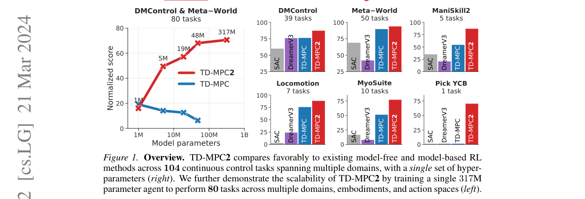
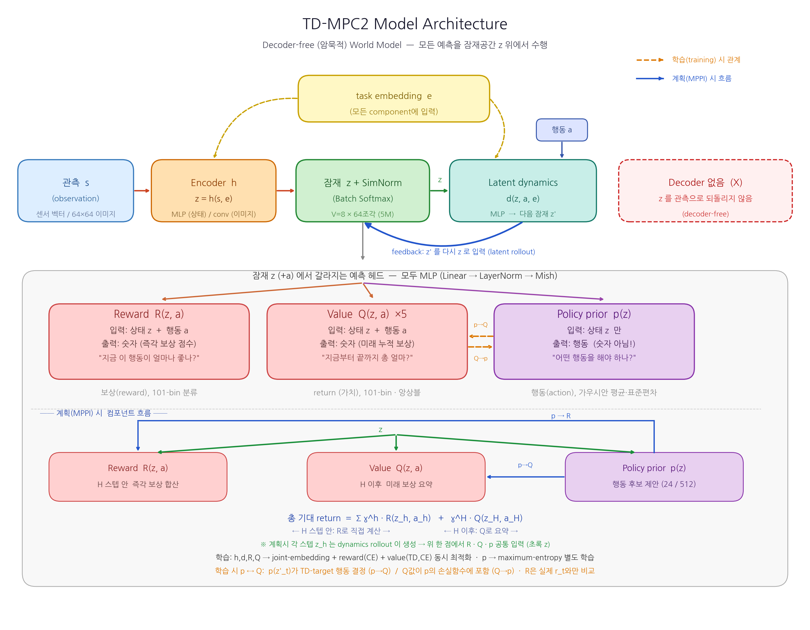
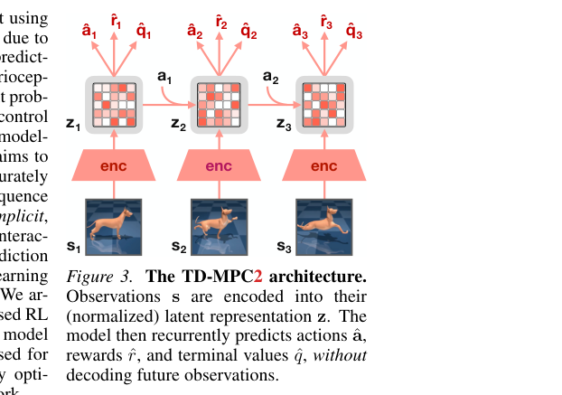
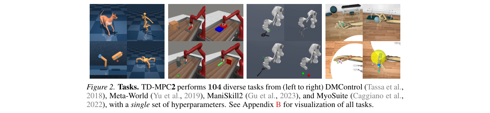
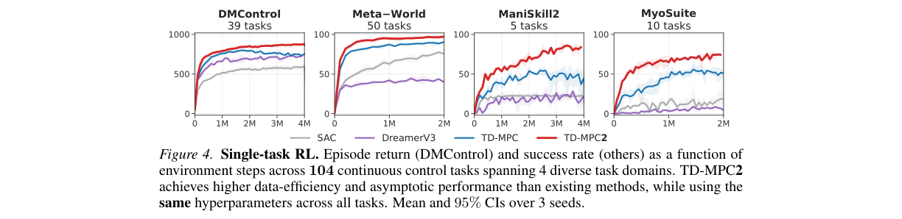
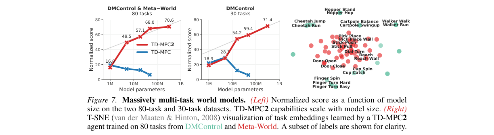
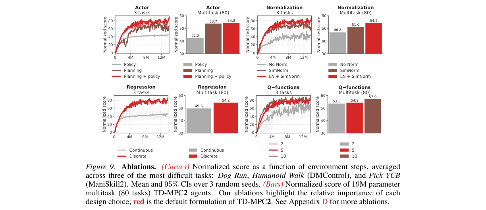

# TD-MPC2: Scalable, Robust World Models for Continuous Control

저자 :

Nicklas Hansen, Hao Su, Xiaolong Wang

University of California San Diego

발표 : ICLR 2024

논문 : [PDF](https://arxiv.org/pdf/2310.16828)

출처 : [https://arxiv.org/abs/2310.16828](https://arxiv.org/abs/2310.16828)

---

## 0. Summary

<p align='center'>

</p>

> **Figure 1 축 읽는 법** — 성격이 다른 두 부분으로 구성된다.
> - **왼쪽 (확장성 곡선)**: 가로축 x = **모델 크기(파라미터 수, log 스케일 1M→1B)**, 세로축 y = **80개 task 평균 normalized score**. 빨강(TD-MPC2)은 키울수록 상승(확장 O), 파랑(전작 TD-MPC)은 하락(확장 X). 빨강이 거의 직선 = score가 log(파라미터)에 비례.
> - **오른쪽 (도메인별 막대 6개)**: 가로축 x = **방법 4종**(SAC, DreamerV3, TD-MPC, TD-MPC2, 범주형), 세로축 y = **그 도메인의 성능 점수**(패널마다 범위 다름). 모든 도메인에서 빨강(TD-MPC2)이 가장 높음.

### 0.1. 문제 (Problem)

* 강화학습(RL) 알고리즘은 대부분 **단일 task 학습**에 맞춰져 있고, task마다 hyperparameter를 따로 튜닝해야 한다. 어떤 hyperparameter를 골라야 하는지에 대한 원리적 방법도 없다.
* 대규모·다양한(여러 embodiment·action space) 데이터를 한 모델로 소화하려면 task 간 차이(행동 차원 수, 탐험 난이도, 보상 크기 분포 등)에 **robust**해야 하는데, 기존 RL은 그렇지 못하다.
* Gato, RT-1 같은 generalist agent는 **거의 expert 수준의 시연(near-expert demonstration)** 을 가정한 behavior cloning에 의존해 사용 가능한 데이터가 크게 제한되고, action을 토큰화(discretization)해 고차원 연속 제어에 확장하기 어렵다.
* 전작인 TD-MPC는 단일 task에서는 강했지만, **모델·데이터 크기를 단순히 키우면 오히려 성능이 떨어지는**(gradient 폭주로 발산까지 하는) 확장성 문제가 있었다.

### 0.2. 핵심 아이디어 (Core Idea)

* **암묵적(decoder-free) 월드 모델(Implicit World Model)**: "월드 모델"은 환경이 앞으로 어떻게 변할지 예측하는 환경의 내부 시뮬레이터다. TD-MPC2는 미래 관측(이미지·센서값)을 **복원(decode)하지 않는다**. 대신 행동 시퀀스에 대해 "결과(보상의 합, return)"만 정확히 예측하는 데 집중한다. 비유하면, 자동차를 운전할 때 모든 픽셀을 머릿속에 그리는 대신 "이렇게 핸들을 돌리면 결국 어디에 도착할지"만 예측하는 것이다. 픽셀 복원은 비싸고 제어에 꼭 필요하지도 않기 때문이다.

* **잠재 공간에서의 계획(Latent-space Planning, MPC)**: 인코딩된 잠재 표현 $z$ 위에서 여러 후보 행동 시퀀스를 모델로 빠르게 굴려보고(rollout), return이 가장 높은 시퀀스를 고른다. "16수 앞을 머릿속으로 시뮬레이션해 보고 첫 수를 두는 체스 기사"와 같다. 단, 짧은 horizon 너머는 학습된 **terminal value 함수 $Q$** 로 보충(bootstrap)해 근시안적 최적화 문제를 해결한다.

* **SimNorm (Simplicial Normalization)**: 잠재 벡터 $z$ 를 여러 개의 작은 조각(simplex)으로 나눠 각 조각에 softmax를 적용하는 정규화다. 직관적으로는 "표현을 sparse하게(몇 개 차원만 켜지게) 부드럽게 유도"해 gradient 폭주를 막는 안전장치다. 이것이 TD-MPC2의 학습 안정성의 핵심이다.

  $$z^{\circ} = [g_1, \dots, g_L], \quad g_i = \mathrm{softmax}(z_{i:i+V}/\tau)$$

  여기서 $z^{\circ}$ 는 정규화된 잠재 표현, $L$ 은 simplex(조각)의 개수, $V$ 는 각 조각의 차원, $\tau$ 는 sparsity를 조절하는 temperature다. 즉 잠재 벡터를 $L$ 개 그룹으로 나눈 뒤 각 그룹에 softmax를 적용해 이어붙인다.

* **이산 회귀(Discrete Regression)로 보상·가치 예측**: task마다 보상의 크기가 천차만별이라(작은 값 vs 매우 큰 값) 일반 회귀는 불안정하다. 그래서 보상·가치를 log 변환 공간에서 **여러 bin 중 하나를 맞추는 분류 문제**로 바꿔 cross-entropy로 학습한다. "정확한 숫자 대신 어느 구간에 속하는지 맞히게" 해 보상 크기에 둔감하게 만든다.

* **학습 가능한 task embedding + action masking**: 여러 task·embodiment를 한 모델로 다루기 위해, 각 task를 나타내는 벡터 $e$ ($\ell_2$-norm $\le 1$로 제약)를 데이터로부터 학습하고 모든 component에 조건으로 넣는다. action space 크기가 다른 task는 최대 차원으로 zero-padding한 뒤 유효하지 않은 차원을 masking해, domain 지식 없이도 섞어 학습한다.

### 0.3. 효과 (Effects)

* **단일 hyperparameter set**으로 4개 도메인 104개 연속 제어 task를 모두 처리. task별 튜닝이 사라진다.
* TD-MPC와 달리 **모델·데이터 크기를 키울수록 성능이 일관되게 향상**(확장성 확보).
* SAC·DreamerV3가 발산하는 고차원 task(Dog $A\in\mathbb{R}^{38}$, Humanoid)에서도 **안정적**으로 학습.
* batch size 256, update-to-data ratio 1 등 더 가벼운 설정으로도 더 강한 baseline들을 능가.

### 0.4. 결과 (Results)

* 104개 task에서 model-free(SAC), model-based(DreamerV3, TD-MPC)를 데이터 효율·최종 성능 모두에서 능가.
* 단일 **317M 파라미터** agent로 80개 task(여러 도메인·embodiment·action space)를 수행. 모델 크기에 따라 normalized score가 **16.0 → 49.5 → 57.1 → 68.0 → 70.6** (1M→5M→19M→48M→317M)으로 상승, log(파라미터) 대비 거의 선형 확장.
* Few-shot finetuning: 70개 task로 사전학습한 19M agent가 미관측 10개 task에서 scratch 대비 약 **2배**(24.0 → 47.0) 향상.
* Pick YCB(74개 객체 manipulation)에서 60% 이상 성공, 다른 방법들은 같은 예산 내에 학습 실패.

### 0.5. 상세 동작 방식 (How It Works)

TD-MPC2는 (A) 월드 모델 **학습 루프**와 (B) 학습된 모델로 행동을 고르는 **계획(추론) 루프**가 번갈아 도는 구조다.

Step 1. **인코딩**: 환경 관측 $s$ (센서값 또는 이미지)를 인코더 $h$ 에 넣어 잠재 표현 $z$ (잠재 공간의 좌표값)로 변환하고, SimNorm으로 정규화한다.
Step 2. **잠재 예측**: 잠재 동역학 $d(z,a)$ 가 다음 잠재 상태를, $R(z,a)$ 가 보상을, $Q(z,a)$ 가 미래 return을 예측한다. 이 과정에서 미래 관측은 복원하지 않는다(decoder-free).
Step 3. **모델 학습**: replay buffer에서 뽑은 데이터로 (a) joint-embedding 예측 오차, (b) 보상 예측(이산 cross-entropy), (c) 가치 예측(TD-target, 이산 cross-entropy)을 합한 손실을 줄여 $h,d,R,Q$ 를 동시 업데이트한다. 별도로 maximum-entropy 목적함수로 policy prior $p$ 를 학습한다.
Step 4. **계획(추론)**: 매 결정 시점마다 MPPI 옵티마이저가 여러 행동 시퀀스를 샘플링해 모델로 굴려보고(latent rollout), horizon 끝은 $Q$ 로 보충한 return을 계산한다. 후보 중 일부는 policy prior $p$ 가 제공해 수렴을 가속한다.
Step 5. **행동 실행 → 데이터 수집**: return이 높도록 갱신한 가우시안 분포 $\mathcal{N}(\mu^*,\sigma^*)$ 에서 첫 행동을 실행하고, 새 transition을 replay buffer에 저장한다. 이후 Step 1로 돌아가 반복한다.

전체 데이터 흐름 요약:

```
[관측 s] → [Encoder h] → [잠재 z + SimNorm]
            │
            ├─(추론)→ [MPPI: d/R/Q 로 후보 rollout] ← [policy prior p 가 후보 일부 제공]
            │                       │
            │                       └→ [최적 행동 a 실행] → [replay buffer]
            │
            └─(학습)→ [Joint-embedding + Reward(CE) + Value(TD,CE) loss] → h,d,R,Q 갱신
                                                              → policy loss → p 갱신
                                                              → (다시 Step 1 반복)
```

### 0.6. Architecture

TD-MPC2 월드 모델은 **5개의 신경망 component**로 이루어지며, 모두 동일한 building block(선형층 → LayerNorm → Mish)으로 만든 MLP다. 미래 관측을 복원하는 **decoder가 없다**는 것이 가장 큰 구조적 특징이다.

#### 0.6.1. 모델 구성요소 (Model Components)

5개 component는 모두 학습 가능한 task embedding $e$ 를 조건으로 받는다 (단일 task에서는 $e$ 생략). (식 2)

| Component | 수식 | 입력 → 출력 | 역할 |
|---|---|---|---|
| **Encoder** $h$ | $z = h(s, e)$ | 관측 $s$ → 잠재 $z$ | 센서/이미지 관측을 잠재 표현으로 인코딩 (출력에 SimNorm 적용) |
| **Latent dynamics** $d$ | $z' = d(z, a, e)$ | 잠재 $z$ + 행동 $a$ → 다음 잠재 $z'$ | 잠재 공간에서의 forward 동역학 (decoder 없이 latent만 예측) |
| **Reward** $R$ | $\hat r = R(z, a, e)$ | 잠재 $z$ + 행동 $a$ → 보상 $\hat r$ | transition의 즉시 보상 예측 (이산 회귀, 101 bins) |
| **Terminal value** $Q$ | $\hat q = Q(z, a, e)$ | 잠재 $z$ + 행동 $a$ → return $\hat q$ | 미래 할인 보상 합(return) 예측 (5개 앙상블, 이산 회귀) |
| **Policy prior** $p$ | $\hat a = p(z, e)$ | 잠재 $z$ → 행동 $\hat a$ | $Q$ 를 최대화하는 maximum-entropy 정책 (계획 시 후보 일부 제공) |

- 학습 시에는 $h, d, R, Q$ 를 하나의 손실로 **동시 최적화**하고, policy prior $p$ 는 별도의 maximum-entropy 목적함수로 학습한다.
- $Q$ 는 **5개 앙상블**로 학습하며, TD-target 계산 시 무작위 2개를 뽑아 그 **최솟값**을 사용해 가치 과대추정을 억제한다. 각 Q에는 1% dropout을 적용한다.

**Q1. 인코더 입력 $s$ 에는 무엇이 들어가나?** $s$ 는 매 timestep의 **환경 관측(observation)** 이다. 두 종류를 지원한다.

| 관측 종류 | 내용 | 그때의 Encoder $h$ |
|---|---|---|
| **상태 관측 (이 논문 기본)** | proprioceptive state — 관절 각도·속도, 몸/물체의 위치·자세 등 **센서 수치 벡터** | **MLP** |
| 이미지 관측 (선택) | 64×64 RGB 이미지 | **얕은 4층 conv** (+ random shift augmentation) |

- 주 실험은 **상태 관측(숫자 벡터)** 이라 기본 인코더는 MLP다. 이미지를 쓸 때만 인코더를 conv로 교체하고 나머지 component는 그대로 둔다.
- multi-task에서는 학습 가능한 **task embedding $e$**(dim 96)도 함께 입력된다.
- fig_03에서 $s_1,s_2,s_3$ 가 강아지 사진으로 그려진 것은 "이미지도 가능"하다는 예시일 뿐, 기본은 센서 벡터다.

**Q2. $d, R, Q, p$ 도 전부 MLP인가? → 그렇다.** 5개 component 모두 동일 building block(`Linear → LayerNorm → Mish`)을 쌓은 MLP다(이미지일 때 인코더만 conv 예외). `z + SimNorm`으로 잠재 벡터 $z$ 를 만든 뒤, 나머지는 모두 이 $z$(벡터) 위에서 동작하는 MLP다.

- **$d(z,a)$** — 잠재 동역학 MLP. "이 상태에서 이 행동을 하면 다음 잠재 상태는?"을 예측하고, 출력 $z'$ 에 다시 SimNorm 적용. **이걸 반복하는 것이 상상 속 rollout**이다.
- **$R(z,a)$** — 보상 예측 MLP. 스칼라를 직접 내지 않고 **101-bin 분류(softmax)** 로 출력.
- **$Q(z,a)$** — 가치(미래 보상 합) 예측 MLP. 역시 101-bin 분류이며 **5개 앙상블**.
- **$p(z)$** — 정책(policy prior) MLP. 행동 분포(가우시안 평균·표준편차)를 출력해 계획 시 좋은 후보 행동을 제안.

핵심 2가지: ① 모든 예측이 **잠재 $z$ 위에서만** 일어나며, $d$ 로 다음 잠재를 만들어 미래를 굴리는 동안 **한 번도 관측으로 decode 하지 않는다**(decoder-free). ② $R, Q$ 는 회귀가 아니라 **"어느 bin에 속하나"를 맞히는 분류기**처럼 동작해 task별 보상 크기 차이에 둔감하다.

5M 모델 기준 차원까지 붙이면:

```
s(센서 벡터) ─h(MLP,256)→ z(512)+SimNorm(V=8 × 64조각)
z(512)+a+e(96) ─d(MLP,512)→ z'(512)+SimNorm     (← 반복 = latent rollout)
z+a ─R(MLP,512)→ 101 logits → 보상
z+a ─Q(MLP,512)×5 → 101 logits → return
z   ─p(MLP,512)→ (행동 평균, 표준편차)
```

#### 0.6.2. 모델 아키텍처 (Model Architecture)

전체 구성요소와 데이터 흐름을 한눈에 보면 다음과 같다 (개념도).

<p align='center'>

</p>

논문 원본 그림(Figure 3)은 동일 구조를 시간축으로 펼쳐 재귀적 rollout을 강조한다.

<p align='center'>

</p>

관측 $s$ 를 인코더로 잠재 $z$ 로 만든 뒤, latent dynamics $d$ 가 행동 $a$ 와 함께 다음 잠재 $z'$ 를 **재귀적으로(recurrent)** 굴린다. 각 step의 잠재에서 $\hat a$(policy prior), $\hat r$(reward), $\hat q$(value)를 예측하며, **미래 관측은 복원하지 않는다(decoder-free)**.

핵심 구조 설계는 다음과 같다.

- **공통 building block**: 모든 component는 `Linear → LayerNorm → Mish`를 쌓은 MLP다. LayerNorm + Mish 조합이 학습 안정성에 기여한다(전작 TD-MPC의 ELU 대비 개선).
- **SimNorm (Simplicial Normalization)**: 인코더 출력 잠재 $z$ 를 차원 $V$ 의 여러 simplex로 나눠 각 조각에 softmax를 적용한다. gradient 폭주를 막고 표현을 sparse하게 유도하는 안전장치다. 5M 모델 기준 latent dim 512, $V=8$ 이므로 $L = 512/8 = 64$ 개 simplex로 사영된다.

  $$z^{\circ} = [g_1, \dots, g_L], \quad g_i = \mathrm{softmax}(z_{iV:(i+1)V}/\tau), \quad \tau = 1$$

  **SimNorm ≠ LayerNorm.** 둘은 목적·동작이 다르며 TD-MPC2에서는 **둘 다** 쓰인다. SimNorm은 $z$ 를 크기 $V$ 의 그룹으로 쪼개 **각 그룹에 softmax**를 적용하므로, 각 그룹이 합 1인 작은 확률분포(soft one-hot)가 된다 — VQ-VAE의 vector-of-categoricals를 부드럽게 완화한 형태(diagram에서 *(Batch Softmax)* 로 표기). 반면 LayerNorm은 벡터를 평균 0·분산 1로 표준화하는 일반 정규화다.

  | | **LayerNorm** | **SimNorm** |
  |---|---|---|
  | 동작 | 평균 0·분산 1 표준화 후 scale·shift | 그룹별 softmax (그룹 합 = 1) |
  | 출력 형태 | 실수, 범위 제약 없음 | 0~1, 음수 없음 (확률분포 묶음) |
  | 적용 위치 | **모든 MLP 층 내부**(Linear 뒤) | **잠재 $z$ 에만**(인코더·dynamics 출력) |
  | 목적 | 일반적 학습 안정화 | sparsity 유도 + 잠재/gradient 폭주 방지 |
  | 표현 구조 변경 | 거의 없음 | soft one-hot 구조 부여 |

  배치 요약: `MLP 내부 = Linear → LayerNorm → Mish`, `잠재 출력 = ... → SimNorm`. ablation에서도 **LN + SimNorm**(둘 다)이 최고였다 (No Norm 46.8 → SimNorm 51.0 → LN+SimNorm 54.2).

- **이산 회귀 헤드(Discrete Regression)**: $R$ 과 $Q$ 는 스칼라를 직접 회귀하지 않고, log 변환 공간에서 **101개 bin 중 하나를 맞히는 분류(cross-entropy)** 로 출력한다. task 간 보상 크기 차이에 둔감해진다.
- **task embedding 조건화**: 학습 가능한 task embedding $e$ ($\ell_2$-norm $\le 1$)를 모든 component 입력에 concat한다. action space 크기가 다른 task는 최대 차원으로 zero-padding 후 무효 차원을 masking한다.

데이터 흐름:

```
s ─[Encoder h]→ z(+SimNorm) ─┬─[d(z,a)]→ z' ─┬─[d]→ z'' ─ ... (recurrent rollout)
                             │               │
              각 step의 z 에서:  ├─[R(z,a)]→ r̂ (101-bin CE)
                             ├─[Q(z,a)]→ q̂ (5개 앙상블, 101-bin CE)
                             └─[p(z)]→ â   (maximum-entropy policy)
              ※ s 를 복원하는 decoder 없음 (control-centric)
```

#### 0.6.3. 주요 하이퍼파라미터 (5M 기준, Table 8)

모든 task에 동일한 단일 hyperparameter set을 사용한다.

| 구분 | 항목 | 값 |
|---|---|---|
| **Planning** | Horizon $H$ | 3 |
| | Iterations | 6 (+2 if $\lVert A\rVert \ge 20$) |
| | Population size | 512 |
| | Policy prior samples | 24 |
| | Number of elites | 64 |
| | Min / Max std | 0.05 / 2 |
| | Temperature | 0.5 |
| **Architecture** | Encoder dim | 256 |
| | MLP dim | 512 |
| | Latent state dim | 512 |
| | Task embedding dim | 96 |
| | Activation | LayerNorm + Mish |
| | Q-function dropout | 1% |
| | # Q-functions | 5 |
| | # reward/value bins | 101 |
| | SimNorm dim $V$ / $\tau$ | 8 / 1 |
| **Optimization** | Update-to-data ratio | 1 |
| | Batch size | 256 |
| | Optimizer / LR | Adam / $3\times10^{-4}$ (encoder $1\times10^{-4}$) |
| | Gradient clip norm | 20 |
| | Discount $\gamma$ | heuristic (DMControl=0.99) |

#### 0.6.4. 모델 크기 스케일링 (Table 9)

fully-connected 차원, latent state dim $z$, 인코더 층 수, Q-함수 개수만 바꿔 1M~317M로 확장한다 (그 외 아키텍처·하이퍼파라미터는 동일). task embedding dim은 96으로 고정.

| | 1M | 5M\* | 19M | 48M | 317M |
|---|---|---|---|---|---|
| Encoder dim | 256 | 256 | 1024 | 1792 | 4096 |
| MLP dim | 384 | 512 | 1024 | 1792 | 4096 |
| Latent state dim | 128 | 512 | 768 | 768 | 1376 |
| # encoder layers | 2 | 2 | 3 | 4 | 5 |
| # Q-functions | 2 | 5 | 5 | 5 | 8 |
| Task embedding dim | 96 | 96 | 96 | 96 | 96 |

\* 5M이 단일 task RL 실험의 기본(base) 구성이다.

---

## 1. Introduction

인터넷 규모 데이터로 거대 모델을 학습하는 패러다임은 언어·비전에서 generalist 모델을 만들어냈다. 그 성공의 핵심은 (1) 방대한 데이터와 (2) 모델·데이터 크기에 따라 안정적으로 확장되는 아키텍처였다. 로보틱스에도 이 패러다임을 옮기려는 시도가 있었지만, 저수준 action으로 여러 embodiment를 넘나들며 다양한 제어 task를 수행하는 generalist embodied agent는 여전히 멀다.

저자들은 현재 접근의 두 가지 한계를 지적한다. (a) behavior cloning을 위해 **거의 expert 수준의 시연**을 가정하기 때문에 사용 가능한 데이터가 심하게 제한된다. (b) 크고 정제되지 않은(uncurated, 품질이 섞인) 데이터를 소화할 수 있는 **확장 가능한 연속 제어 알고리즘**이 부재하다.

강화학습(RL)은 정제되지 않은 데이터에서 전문가 행동을 추출하기에 이상적인 틀이지만, 기존 RL은 대부분 단일 task용이며 task별 hyperparameter에 의존한다. 대규모 multi-task 데이터를 다루려면 task 간 차이(행동 차원, 탐험 난이도, 보상 분포)에 robust해야 한다.

이 논문은 그 목표를 향한 큰 진전인 **TD-MPC2**를 제안한다. 전작 TD-MPC는 학습된 암묵적(decoder-free) 월드 모델의 잠재 공간에서 국소 궤적 최적화(planning)를 수행하는 model-based RL이었으나, 모델·데이터를 단순히 키우면 오히려 성능이 떨어졌다. TD-MPC2의 알고리즘적 기여는 두 가지다. (1) 핵심 설계 선택들을 재검토해 **알고리즘 robust성**을 확보(모든 task에 동일 hyperparameter 사용), (2) domain 지식 없이 여러 embodiment·action space를 수용하는 **아키텍처 설계**.

저자들은 DMControl, Meta-World, ManiSkill2, MyoSuite 4개 도메인의 **104개** 연속 제어 task에서 평가한다. 고차원 상태·행동(최대 $A\in\mathbb{R}^{39}$), 이미지 관측, 희소 보상, 다중 객체 manipulation, 생리학적으로 정확한 근골격 제어, 복잡한 locomotion(Dog·Humanoid)을 포함한다. 동일 hyperparameter로 기존 model-based·model-free 방법을 일관되게 능가하며, 단일 **317M** 파라미터 월드 모델로 80개 task를 수행한다. 또한 300개 이상의 모델 checkpoint, 데이터셋, 코드를 공개한다.

## 2. Method

<p align='center'>

</p>

### 2.1. 암묵적 월드 모델 학습

복원(decoder) 목적함수로 생성 모델을 학습하는 것은 풍부한 학습 신호 때문에 매력적이지만, 긴 horizon에 걸쳐 원시 미래 관측을 정확히 예측하는 것은 어렵고 효과적인 제어로 이어지지도 않는다(objective mismatch). 그래서 TD-MPC2는 **결과(return)를 정확히 예측하는 최대한 유용한 모델**을 목표로, joint-embedding 예측 + 보상 예측 + TD-learning을 결합해 관측을 복원하지 않는 control-centric 월드 모델을 학습한다.

**5개 component** (식 2):

* Encoder: $z = h(s, e)$ — 관측을 잠재 표현으로 매핑
* Latent dynamics: $z' = d(z, a, e)$ — 잠재 forward 동역학
* Reward: $\hat r = R(z, a, e)$ — transition의 보상 예측
* Terminal value: $\hat q = Q(z, a, e)$ — return(할인된 보상 합) 예측
* Policy prior: $\hat a = p(z, e)$ — $Q$ 를 최대화하는 action 예측

여기서 $e$ 는 multi-task 모델용 학습 가능한 task embedding이다.

**모델 목적함수** (식 3): $h, d, R, Q$ 를 함께 최적화한다.

$$\mathcal{L}(\theta) = \mathbb{E}_{(s,a,r,s')_{0:H}\sim\mathcal{B}}\left[\sum_{t=0}^{H}\lambda^t\Big(\underbrace{\|z'_t - \mathrm{sg}(h(s'_t))\|_2^2}_{\text{joint-embedding}} + \underbrace{\mathrm{CE}(\hat r_t, r_t)}_{\text{reward}} + \underbrace{\mathrm{CE}(\hat q_t, q_t)}_{\text{value}}\Big)\right]$$

여기서 $\mathrm{sg}$ 는 stop-gradient, $q_t = r_t + \gamma\bar Q(z'_t, p(z'_t))$ 는 TD-target, $\lambda\in(0,1]$ 는 먼 미래 step의 가중치를 줄이는 계수, $\mathrm{CE}$ 는 cross-entropy다. $\bar Q$ 는 $Q$ 의 EMA(지수이동평균)다. 보상·가치는 log 변환 공간에서 **이산 회귀(다중 클래스 분류)** 로 정식화해 task 간 보상 크기 차이에 둔감하게 만든다.

**정책 목적함수** (식 4): policy prior $p$ 는 maximum-entropy 정책으로, $\alpha Q - \beta\mathcal{H}$ 형태(가치 항 + 엔트로피 항)를 최대화한다. 엔트로피 조기 붕괴를 막기 위해 $\alpha$ 를 이동 통계로 자동 조정한다.

**아키텍처**: 모든 component는 LayerNorm + Mish 활성화를 쓰는 MLP다. gradient 폭주를 막기 위해 잠재 표현 $z$ 를 $L$ 개의 simplex로 사영하는 **SimNorm**(식 5)을 적용한다. simplex 임베딩은 hard constraint 없이 표현을 sparse하게 유도한다. TD-target의 편향을 줄이기 위해 **5개 Q-함수 앙상블**을 학습하고, 무작위로 2개를 뽑아 그 최솟값을 target으로 쓴다.

### 2.2. Policy Prior를 활용한 MPC 계획

TD-MPC2는 학습된 월드 모델로 계획(planning)해 closed-loop 정책을 도출한다. MPC 틀에서 **MPPI**(Model Predictive Path Integral)를 미분 없는(derivative-free) 옵티마이저로 사용해, 길이 $H$ 의 행동 시퀀스를 모델로 굴려 평가한다. 매 결정 시점마다 대각 공분산 가우시안의 파라미터 $\mu^*, \sigma^*$ 를 다음을 최대화하도록 추정한다 (식 6):

$$\mu^*, \sigma^* = \arg\max_{(\mu,\sigma)} \mathbb{E}_{(a_t,\dots,a_{t+H})\sim\mathcal{N}(\mu,\sigma^2)}\left[\gamma^H Q(z_{t+H}, a_{t+H}) + \sum_{h=t}^{H-1}\gamma^h R(z_h, a_h)\right]$$

여기서 $\gamma$ 는 할인율이며, horizon $H$ 너머는 terminal value $Q$ 로 bootstrap해 2절에서 정의한 전체 RL 목적을 근사한다. $\mathcal{N}(\mu,\sigma^2)$ 에서 시퀀스를 반복 샘플링·평가하고 return 가중 평균으로 $\mu,\sigma$ 를 갱신한다. 수렴 가속을 위해 후보 시퀀스 일부는 policy prior $p$ 에서 나오고, 직전 결정 결과를 한 칸 shift해 warm-start한다.

### 2.3. Generalist Agent 학습

* **학습 가능한 task embedding**: 자연어 같은 domain 지식이 없을 때, task embedding $e$ 를 데이터로부터 학습해 5개 component 모두에 조건으로 넣는다. 학습 안정성과 의미적으로 일관된 embedding을 위해 $\ell_2$-norm을 $\le 1$ 로 제약한다. 새 task로 finetuning할 때는 의미적으로 유사한 task의 embedding이나 무작위 벡터로 초기화한다.
* **Action masking**: 모든 입출력을 최대 차원으로 zero-padding하고, policy prior $p$ 가 유효하지 않은 action 차원을 학습·추론 모두에서 masking한다. 이로써 무효 차원의 예측 오차가 TD-target 추정에 영향을 주지 않고, 작은 action space task에서 엔트로피가 거짓으로 부풀려지는 것을 막는다.

### 2.4. TD-MPC 대비 주요 개선 (Appendix A)

* **아키텍처**: ELU→Mish + LayerNorm, latent에 SimNorm, Q-함수 2→5개 + 1% Dropout. TD-MPC는 latent 제약이 없어 gradient 폭주로 일부 task에서 발산.
* **Policy prior**: 결정론적 정책 + 가우시안 노이즈 → maximum-entropy RL (task-agnostic hyperparameter 적용 용이).
* **모델 목적함수**: 연속 회귀 → log 공간 이산 회귀(보상·가치)로 보상 크기에 robust.
* **Multi-task 프레임워크**: 정규화된 task embedding + zero-padding/action masking 도입.
* **단순화**: MPPI momentum 제거, prioritized replay → uniform sampling, code-level 최적화로 더 큰 모델(5M)임에도 wall-time을 TD-MPC(1M) 수준으로 유지.

## 3. Experiments

<p align='center'>

</p>

**Setup**: DMControl(39), Meta-World(50), ManiSkill2(5), MyoSuite(10) 등 4개 도메인 104개 연속 제어 task. 고차원 상태·행동(최대 $A\in\mathbb{R}^{39}$), 희소 보상, 다중 객체 manipulation, 근골격 제어, Dog·Humanoid locomotion 포함. 이미지 관측 DMControl task 10개도 포함. 기본은 **5M 파라미터** TD-MPC2를 사용한다.

**Baseline**: (1) SAC(model-free, maximum-entropy), (2) DreamerV3(model-based, 생성 월드 모델 rollout으로 model-free 정책 최적화, 약 20M 파라미터), (3) TD-MPC(원본), 시각 RL용으로 (4) CURL, (5) DrQ-v2. SAC·TD-MPC는 task별 hyperparameter를 쓰지만 TD-MPC2는 **모든 task에 동일 hyperparameter**. 또한 SAC·TD-MPC는 batch 512, DreamerV3는 UTD 512인 반면 TD-MPC2는 batch 256, UTD 1로 더 가볍다.

<p align='center'>

</p>

> **Figure 4 축 읽는 법 (single-task RL 학습 곡선)** — 가로축 x = **environment steps**(환경과 상호작용한 횟수 = 모은 데이터 양, 오른쪽일수록 많음), 세로축 y = **성능**(DMControl은 episode return, 나머지는 success rate), 연한 음영 = 3 seed의 95% 신뢰구간.
> - **데이터 효율**: 곡선이 *얼마나 빨리(왼쪽에서) 올라가나* → 같은 데이터량에서 더 높으면 적은 경험으로 잘 배운 것. 실제 로봇처럼 상호작용 비용이 큰 환경에서 핵심 장점.
> - **최종 성능(asymptotic)**: 곡선이 오른쪽에서 *도달하는 천장 높이*.
> - 빨강(TD-MPC2)이 "더 왼쪽에서, 더 높이" 올라감 = 데이터 효율·최종 성능 모두 우위. ManiSkill2·MyoSuite처럼 어려운 도메인일수록 격차가 큼.

**기존 방법과 비교**: 104개 task 전 도메인에서 TD-MPC2가 데이터 효율·최종 성능 모두 우위(Figure 4). 특히 고차원 locomotion(Dog $A\in\mathbb{R}^{38}$, Humanoid)과 다중 객체 manipulation(Pick YCB, 74개 객체)에서 큰 격차로 능가하며 Pick YCB는 60% 이상 성공(다른 방법은 예산 내 실패). MyoSuite 결과는 사전 실험 없이 얻은 것이라 더 주목할 만하다. TD-MPC는 gradient 폭주로 종종 발산하지만 TD-MPC2는 안정적이며, DreamerV3는 Dog에서 수치적 불안정, 정밀 객체 manipulation(lift/pick/stack)에서 고전한다.

<p align='center'>

</p>

**대규모 Multi-task 확장**: 240개 단일 task TD-MPC2 agent의 replay buffer에서 모은 545M transition(무작위~전문가 행동 혼합)으로 80개 task를 학습. 1M~317M 5개 모델을 평가한 결과 모델 크기에 따라 normalized score가 일관되게 상승.

| Params (M) | GPU days | Score |
|---|---|---|
| 1 | 3.7 | 16.0 |
| 5 | 4.2 | 49.5 |
| 19 | 5.3 | 57.1 |
| 48 | 12 | 68.0 |
| 317 | 33 | 70.6 |

317M에서도 포화 조짐이 없고, normalized score는 log(파라미터)에 거의 선형으로 확장된다(scaling law는 단정하지 않음). 317M 모델은 단일 RTX 3090으로 약 33 GPU-day에 학습 가능하다. 학습된 task embedding은 의미적으로 유사한 task(Door Open / Door Close)가 가깝게 모이며, 목적(walk/run)보다 **동역학(embodiment·객체)** 과 더 잘 정렬된다.

**Few-shot learning**: 70개 task로 사전학습한 19M agent를 미관측 10개 task에 20k step 동안 online finetuning하면, scratch 학습 대비 약 **2배**(24.0 → 47.0) 향상(Figure 8).

<p align='center'>

</p>

**Ablation** (Figure 9, 가장 어려운 3개 task + 80-task multitask): actor(planning + policy > policy/planning 단독), normalization(LN + SimNorm > SimNorm > No Norm, 46.8→51.0→54.2), 회귀 방식(discrete > continuous, 49.6→54.2), Q-함수 개수(2→5→10, 53.5→54.2→57.0). 모든 설계 선택이 단일·다중 task 모두에서 의미 있게 기여하며, 상대적 중요도가 두 설정에서 일관된다. task embedding 정규화($\ell_2$-norm 1)도 안정적 multitask 학습에 중간 정도로 중요하다.

**시각 RL**: 인코더를 얕은 conv 인코더로 교체하면, hyperparameter 변경 없이 10개 이미지 기반 DMControl task에서 최고 baseline(DrQ-v2, DreamerV3)과 동등한 성능을 낸다(Figure 10).

## 4. Conclusion

이 논문에는 별도의 "Conclusion" 절이 없고, §5 "Lessons, Opportunities, and Risks"가 사실상 결론 역할을 한다.

* **Lessons**: RL은 역사적으로 아키텍처·hyperparameter·seed에 극도로 민감했다. TD-MPC2는 robust성을 높여 작은 팀·개인도 RL을 쓸 수 있게 **민주화**하는 흐름의 일부다. 다만 "모든 것을 out-of-the-box로 푸는" 알고리즘은 아직 없으며, DreamerV3가 강한 이산 action(Atari·Minecraft)과 달리 TD-MPC2는 어려운 **연속 제어**에서 더 강하다. 이산 action space 확장은 미해결 과제다.
* **Opportunities**: 대규모 multi-task 월드 모델을 generalist 월드 모델로 활용하는 길을 제시. 암묵적 월드 모델은 시각 변화가 큰 task에서 복원 기반보다 유리할 수 있으며, zero-shot 수행, 새 embodiment로의 빠른 finetuning, vision-language 모델과의 결합을 전망. "보상"을 success label·인간 선호·goal 임베딩 거리 같은 일반화된 task 완료 지표로 확장할 수 있다.
* **Risks**: 보상 misspecification으로 인한 의도치 않은 결과, 물리 로봇에 대한 무제약 자율성의 안전 위험, 일부 응용에서 데이터 확보 비용으로 인한 권력 집중.

**Commentary**: TD-MPC2는 "거창한 새 모델"이 아니라 SimNorm·이산 회귀·Q-앙상블·maximum-entropy policy 같은 **기존 설계 선택의 robust화**를 누적해 RL에서 좀처럼 보기 힘든 "단일 hyperparameter로 104개 task + 크기에 따른 일관된 확장"을 달성했다는 점이 인상적이다. decoder-free 월드 모델 + 잠재 공간 planning이 연속 제어 generalist agent의 현실적 한 축임을 설득력 있게 보여준다.

---

## 부록: 사전 지식 (Prerequisites)

### A.1. 알아야 할 핵심 개념

- **Model-Based RL vs. Model-Free RL** — 환경 동역학 모델을 명시적으로 학습해 계획(planning)에 쓰는 방식(MBRL) vs. 경험에서 직접 정책을 최적화하는 방식(MFRL)의 대비.
  - 본문 위치: §1 Introduction, §3 Experiments (SAC·DreamerV3·TD-MPC 비교)

- **암묵적(Decoder-Free) 월드 모델 / Implicit World Model** — 미래 관측을 픽셀 수준으로 복원(decode)하지 않고 잠재 공간에서만 미래 상태·보상·가치를 예측하는 control-centric 월드 모델. 복원 없이 "결과"만 정확히 예측하므로 계산 비용과 objective mismatch를 줄인다.
  - 본문 위치: §2.1 암묵적 월드 모델 학습 (핵심 설계 원칙)

- **MPC (Model Predictive Control)** — 매 결정 시점마다 짧은 horizon H 앞을 모델로 시뮬레이션해 최적 행동 시퀀스를 찾고, 그 첫 번째 행동만 실행 후 다시 계획을 반복하는 receding-horizon 제어 기법.
  - 본문 위치: §2.2 Policy Prior를 활용한 MPC 계획

- **MPPI (Model Predictive Path Integral)** — MPC에서 행동 시퀀스를 미분 없이(derivative-free) 가우시안 분포에서 대량 샘플링해 return 가중 평균으로 분포를 갱신하는 sampling-based optimizer. TD-MPC2의 추론 루프에 그대로 채택됨.
  - 본문 위치: §2.2 식 (6)

- **TD-Learning & Value Bootstrapping** — Bellman 방정식을 이용해 미래 return을 현재 가치 추정으로 대체(bootstrap)하며 가치 함수를 반복 개선하는 강화학습의 기본 원리. TD-target = r + γQ̄(z', p(z'))로 정의됨.
  - 본문 위치: §2.1 모델 목적함수 식 (3)

- **Maximum-Entropy RL / SAC-style Policy** — 기대 return 최대화에 더해 정책 엔트로피를 최대화해 다양한 행동을 탐험하는 프레임워크. TD-MPC2의 policy prior p는 αQ − βH 형태의 maximum-entropy 목적함수로 학습됨.
  - 본문 위치: §2.1 정책 목적함수 식 (4)

- **분산 RL / 이산 가치 회귀 (Distributional RL / Discrete Value Regression)** — 보상·가치의 기댓값 대신 분포(또는 bin별 확률)를 학습하는 기법. C51이 원형이며, DreamerV3의 symlog two-hot encoding도 동류. TD-MPC2는 log 변환 공간에서 cross-entropy로 이산 회귀를 수행해 task 간 보상 크기 차이에 둔감하게 만든다.
  - 본문 위치: §2.1, §2.4 "이산 회귀(Discrete Regression)로 보상·가치 예측"

- **Joint-Embedding Predictive Architecture (JEPA 계열 자기예측 표현)** — 미래 입력을 픽셀 공간에서 복원하는 대신, 미래 잠재 표현을 현재 잠재 표현에서 예측하고 stop-gradient로 타깃을 고정해 표현을 학습하는 기법. TD-MPC2의 joint-embedding loss ||z'_t − sg(h(s'_t))||² 가 이 아이디어를 채택함.
  - 본문 위치: §2.1 모델 목적함수 식 (3) joint-embedding 항

- **Q-앙상블 / Clipped Double-Q (Q-Ensemble / Conservative Value Estimation)** — Q 과대추정을 막기 위해 여러 Q 함수를 학습하고 그 최솟값(또는 하한)을 TD-target으로 사용하는 기법. TD-MPC2는 Q 5개 앙상블에서 무작위 2개를 선택해 최솟값을 씀.
  - 본문 위치: §2.1 "5개 Q-함수 앙상블"

- **Multi-Task / Task-Conditioned RL** — 단일 정책이 여러 task·embodiment를 수행하도록 task 식별 정보(embedding, one-hot 등)를 조건으로 넣어 학습하는 패러다임. action space 크기가 다른 task를 통합 학습하는 방법(zero-padding, masking)도 필요함.
  - 본문 위치: §2.3 Generalist Agent 학습

---

### A.2. 먼저 읽으면 좋은 논문

1. **[2022][TD-MPC]** ([arxiv 2203.04955](https://arxiv.org/abs/2203.04955)) — Temporal Difference Learning for Model Predictive Control. decoder-free 잠재 월드 모델 + MPC + TD-learning의 원형.
   - **왜?** TD-MPC2는 TD-MPC의 직접적 후속작이다. TD-MPC2가 "어디를 왜 바꿨는가"(§2.4)를 이해하려면 전작을 먼저 봐야 한다.
   - **Repo 내 정리**: 없음

2. **[2023][DreamerV3]** ([arxiv 2301.04104](https://arxiv.org/abs/2301.04104)) — Mastering Diverse Domains through World Models. symlog 변환 + two-hot encoding으로 보상 크기에 robust한 생성 월드 모델.
   - **왜?** 이산 가치 회귀와 보상 정규화 기법의 직접적 선행 연구이며, 논문 전반에 걸쳐 주요 baseline으로 비교된다.
   - **Repo 내 정리**: 없음

3. **[2020][MuZero]** ([arxiv 1911.08265](https://arxiv.org/abs/1911.08265)) — Mastering Atari, Go, Chess and Shogi by Planning with a Learned Model. 규칙을 모르는 환경에서 잠재 dynamics 모델로 MCTS planning을 수행하는 첫 번째 대규모 성공 사례.
   - **왜?** "decoder 없이 latent space에서만 계획한다"는 TD-MPC2의 핵심 아이디어의 개념적 조상. control-centric 월드 모델의 논거를 이해하는 데 필수.
   - **Repo 내 정리**: 없음

4. **[2018][SAC]** ([arxiv 1801.01290](https://arxiv.org/abs/1801.01290)) — Soft Actor-Critic: Off-Policy Maximum Entropy Deep RL with a Stochastic Actor. 연속 행동 공간에서 최대 엔트로피 RL의 표준 알고리즘.
   - **왜?** TD-MPC2의 policy prior가 SAC-style maximum-entropy 목적함수를 채택하며, 연속 제어 benchmark의 model-free 기준선으로 직접 비교된다.
   - **Repo 내 정리**: 없음

5. **[2017][C51]** ([arxiv 1707.06887](https://arxiv.org/abs/1707.06887)) — A Distributional Perspective on Reinforcement Learning. 가치를 스칼라가 아닌 범주형 분포로 학습하는 distributional RL의 원형.
   - **왜?** TD-MPC2의 "이산 회귀(cross-entropy) 가치 헤드"가 이 계열의 기법을 연속 제어·다중 task에 적용한 것이다.
   - **Repo 내 정리**: 없음

6. **[2017][MPPI]** ([arxiv 1707.02342](https://arxiv.org/abs/1707.02342)) — Information Theoretic Model Predictive Control: Theory and Applications to Autonomous Driving. 가우시안 샘플링 기반 MPC optimizer인 MPPI의 핵심 논문.
   - **왜?** TD-MPC2의 추론 루프(§2.2)가 MPPI를 그대로 채택한다. 식 (6)의 return-weighted Gaussian update를 이해하려면 이 논문이 필요하다.
   - **Repo 내 정리**: 없음

---

### A.3. 관련/후속 논문

- **[2024][HWM]** ([arxiv 2405.18418](https://arxiv.org/abs/2405.18418)) — Hierarchical World Models as Visual Whole-Body Humanoid Controllers. Hansen et al. (TD-MPC2 저자진)이 TD-MPC2 프레임워크를 계층적으로 확장해 56-DoF 시각 기반 휴머노이드 전신 제어에 적용한 직접 후속 연구.

- **[2024][SimBa]** ([arxiv 2410.09754](https://arxiv.org/abs/2410.09754)) — Simplicity Bias for Scaling Up Parameters in Deep RL. TD-MPC2와 같은 흐름에서 대형 모델을 RL에 안정적으로 확장하는 아키텍처 편향을 연구한 관련 후속 연구.

- **[2026][Dreamer-CDP]** ([arxiv 2603.07083](https://arxiv.org/abs/2603.07083)) — Improving Reconstruction-free World Models via Continuous Deterministic Representation Prediction. decoder-free 월드 모델의 표현 학습을 개선하는 방향으로 TD-MPC2 계열을 발전시킨 연구.
