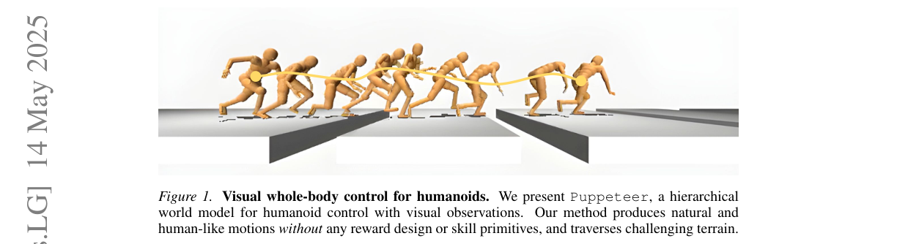
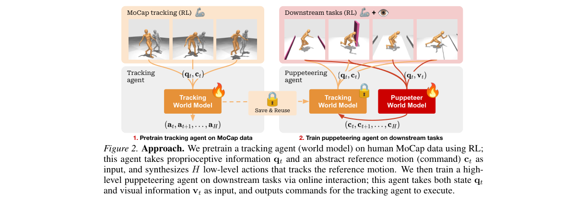
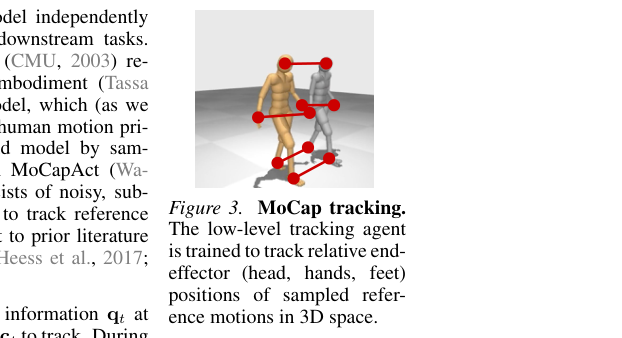
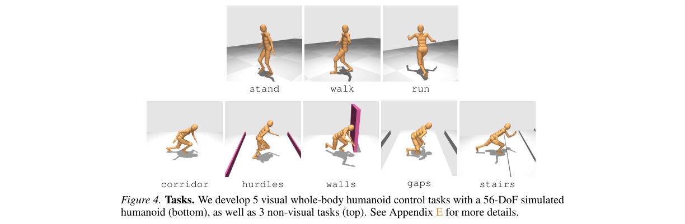
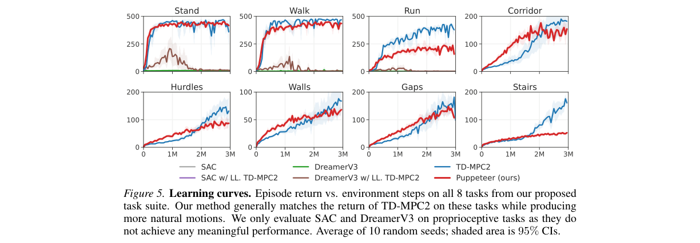
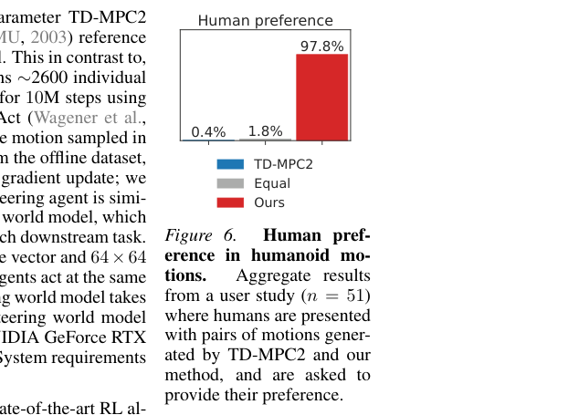
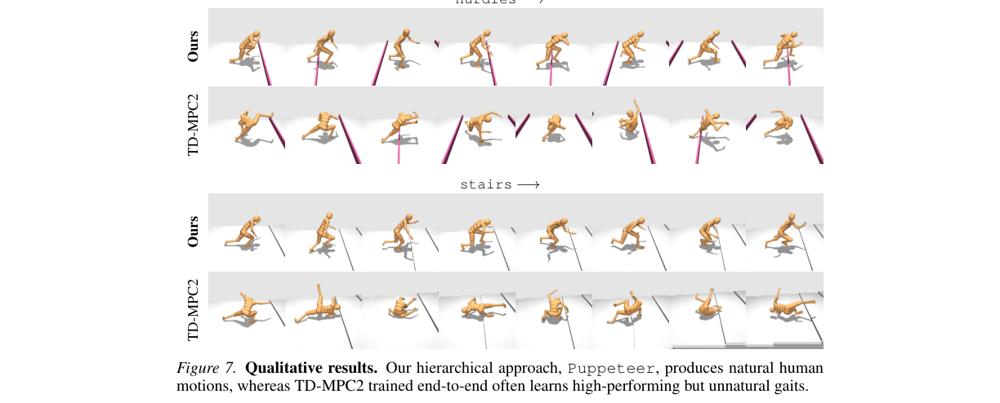
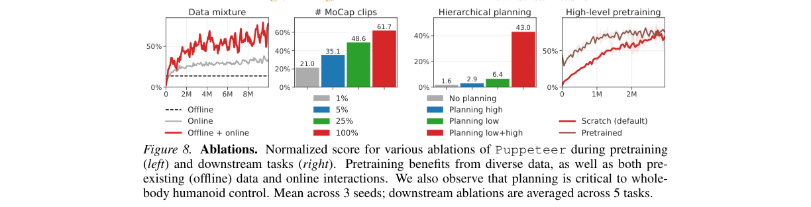
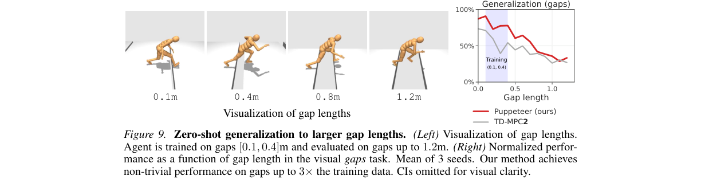

# Hierarchical World Models as Visual Whole-Body Humanoid Controllers

저자 :

Nicklas Hansen, Jyothir S V, Vlad Sobal, Yann LeCun, Xiaolong Wang, Hao Su

UC San Diego

New York University

Meta AI

발표 : ICLR 2025

논문 : [PDF](https://arxiv.org/pdf/2405.18418v3)

출처 : [https://arxiv.org/abs/2405.18418](https://arxiv.org/abs/2405.18418)

---

## 0. Summary

<p align='center'>

</p>

### 0.1. 문제 (Problem)

* 휴머노이드(인간형 로봇)의 **전신 제어(Whole-Body Control)** 는 매우 어렵다. 관절 자유도(DoF)가 56개로 매우 높고, 두 발로 서는 구조 자체가 불안정하며, 여기에 **시각 입력(RGB 이미지)** 까지 더해지면 학습 난이도가 폭발적으로 증가한다.
* 기존 연구들은 문제를 단순화하기 위해 우회로를 택했다.
  * **저차원(특권) 관측/행동**만 사용하거나(실제 카메라 영상 대신 정답 좌표를 직접 줌),
  * 사람이 손으로 설계한 **보상 함수(reward design)** 나 **스킬 프리미티브(skill primitive, 미리 학습된 동작 단위)** 에 의존했다.
* 가장 가까운 선행 연구인 **MoCapAct** 은 약 2,600개의 개별 추적 정책을 따로 학습한 뒤 이를 하나로 증류(distillation)하는 무거운 파이프라인을 거치고, 단순한 도달/속도 제어 과제에 약 150M 스텝의 상호작용을 요구했다.
* 즉, "단순화 가정 없이, 보상 설계 없이, 영상만 보고, 게다가 자연스러운(사람 같은) 동작으로" 전신 제어를 학습하는 방법은 부재했다.

### 0.2. 핵심 아이디어 (Core Idea)

* 이 논문의 방법 **Puppeteer(퍼펫티어, 인형술사)** 는 제어 문제를 두 개의 계층(hierarchy)으로 쪼갠다. 비유하자면 **줄 인형(마리오네트) 조종** 이다.
  * **(저수준) 추적 에이전트(Tracking Agent) = 줄 인형 자체**
    * (a) 한 줄 정의: 머리·양손·양발 5개 말단(end-effector)의 목표 3D 좌표를 받아, 실제로 그 위치에 도달하도록 56개 관절을 움직이는 모듈.
    * (b) 왜 필요한가: 관절 단위의 물리(어떻게 근육을 써야 넘어지지 않고 그 자세가 되는가)는 과제와 무관하게 항상 똑같다. 그래서 한 번만 학습해 놓고 **모든 과제에서 동결(frozen)한 채 재사용** 할 수 있다.
    * (c) 비유: "어디로 손을 뻗어"라는 명령만 들으면 알아서 균형을 잡고 손을 뻗는 숙련된 몸. 사람 모션캡처(MoCap) 데이터로 사전학습해 동작이 자연스럽다.
  * **(고수준) 퍼펫티어 에이전트(Puppeteer Agent) = 인형을 조종하는 사람**
    * (a) 한 줄 정의: 카메라 영상 $v_t$ 와 자기 상태 $q_t$ 를 보고, 5개 말단이 다음에 **어디로 가야 하는지** 그 좌표(명령 $c_t$)를 출력하는 모듈.
    * (b) 왜 필요한가: "장애물을 넘으려면 발을 어디에 둬야 하나"는 영상을 봐야 알 수 있고 과제마다 다르다. 이 판단만 따로 담당한다.
    * (c) 비유: 무대를 보며 "지금 왼발을 저기 둬"라고 줄을 당기는 인형술사. 관절 물리는 전혀 몰라도 된다.
* **가장 중요한 차별점**: 두 에이전트를 잇는 명령 $c_t$ 는 추상적인 **목표 임베딩(goal embedding, 의미를 알 수 없는 벡터)이 아니라, 5개 점의 기하학적 3D 좌표(15차원 = 5점 × 3D)** 이다. 이 덕분에 저수준 에이전트는 "물리"만 배우면 되고, 그래서 과제 간 공유·일반화가 쉬워진다.
* 또 하나의 단순함: 두 에이전트는 **알고리즘적으로 완전히 동일한 TD-MPC2 월드 모델** 이며, 입력/출력만 다르다. 즉 "계층"은 새로운 복잡한 구조가 아니라 **데이터 출처와 입력 모달리티의 계층** 일 뿐이다.

### 0.3. 효과 (Effects)

* 단 하나의 추적 월드 모델을 사전학습해 **8개 과제 전부에서 재사용** → MoCapAct처럼 2,600개 정책을 학습/증류할 필요가 없다.
* 새로운 과제 학습에 **≤3M 스텝** 만 필요 (MoCapAct의 약 150M 대비 수십~수백 배 효율적).
* 보상 설계·스킬 프리미티브·도메인 지식 없이도 **사람이 봤을 때 자연스러운 동작** 을 합성.
* 학습 데이터 범위를 넘어선 환경(gaps 과제에서 3배 넓은 틈)에도 **zero-shot 일반화**.

### 0.4. 결과 (Results)

* 56-DoF 휴머노이드 시뮬레이션 기반 신규 벤치마크 8개 과제(시각 5 + 비시각 3)에서, 강력한 베이스라인(SAC, DreamerV3, TD-MPC2)과 비교.
* **에피소드 리턴(성능)**: 대부분 과제에서 TD-MPC2와 동등 수준. SAC·DreamerV3는 3M 스텝 예산 내에서 유의미한 성능 미달.
* **자연스러움 사용자 연구(n=51)**: 우리 방법 vs TD-MPC2 동작 비교에서 참가자의 **97.8%가 우리 방법을 더 자연스럽다고 선택**, 동등 1.8%, TD-MPC2 선호 0.4%.
* **정량 지표(gaps 과제)**: 1M 스텝 시점 생존 길이(eplen@1M) 115.9 vs 66.9, 평균 몸통 높이 96.0cm vs 85.9cm로 우리 방법이 우세(서서 걸음 vs 구르며 이동). 단, 수렴 시점 에피소드 길이는 TD-MPC2가 더 길다(181.6 vs 159.3).

### 0.5. 상세 동작 방식 (How It Works)

전체 파이프라인은 **2단계(stage)** 로 구성된다. 핵심은 "저수준 추적 모델은 한 번만 학습해 얼리고, 고수준 퍼펫티어 모델만 과제별로 새로 학습"하는 것이다.

```
[Stage 1: 추적 에이전트 사전학습 — 과제와 무관, 1회만]
  사람 MoCap 836개 클립
        → 56-DoF 휴머노이드로 리타게팅(retarget)
        → 오프라인 데이터(노이즈 롤아웃) + 온라인 상호작용 50:50 혼합
        → [추적 월드 모델 학습] (말단 5점 목표좌표 → 관절 행동 추적)
        → ★ 동결(FROZEN), 모든 과제에서 재사용 ★

[Stage 2: 퍼펫티어 에이전트 학습 — 과제마다 처음부터 온라인]
  [RGB 64x64 영상 v_t + 자기수용 상태 q_t (212차원)]
        → [퍼펫티어 월드 모델] --계획(planning)--> 명령 c_t (5점 × 3D = 15차원)
        → [동결된 추적 월드 모델] --계획--> 관절 행동 a_t (56차원)
        → [휴머노이드 시뮬레이터] --> 보상 r_t (전진 속도)
        → 보상으로 퍼펫티어 모델만 업데이트 (추적 모델은 그대로)
```

* **Step 1. 추적 모델 사전학습.** 입력은 자기수용 상태 $q_t$(관절 위치·속도 등)와 추적할 참조 동작 명령 $c_t$(미래 시점 말단 5점의 상대 좌표). 처리는 TD-MPC2 월드 모델로 미래를 시뮬레이션하며 계획해 $H$개의 관절 행동을 합성. 출력은 참조 동작을 따라가는 관절 제어 시퀀스. 사람 데이터로 배우므로 자연스러움(motion prior)이 암묵적으로 내장된다.
* **Step 2. 퍼펫티어 모델 학습.** 입력은 영상 $v_t$ + 상태 $q_t$. 처리는 다시 TD-MPC2 월드 모델로 계획해 **명령 $c_t$ 를 생성**(여기서는 명령이 곧 고수준 에이전트의 행동 공간). 출력은 저수준 모델이 따라갈 5점 목표 좌표.
* **Step 3. 두 모델 연결.** 퍼펫티어가 낸 $c_t$ 를 동결된 추적 모델에 넣어 실제 관절 행동 $a_t$ 로 변환 → 시뮬레이터 실행 → 전진 속도 기반 보상으로 퍼펫티어만 학습.
* **Step 4. 종료 조건 처리(§3.3).** 발 이외 부위가 바닥에 닿으면 에피소드 종료. 월드 모델에 **종료 예측 헤드 $D$** 를 추가하고, 계획 시 예측된 종료 확률을 누적 가중치로 **부드럽게(soft) 잘라내어** 가치 추정의 분산을 줄인다.

전체 데이터 흐름 요약:

```
[MoCap → 추적 WM(동결)]  ⨁  [영상+상태 → 퍼펫티어 WM]
                  └────────→ c_t ─────────┘
                          → 추적 WM → a_t(56-DoF) → 시뮬 → 보상
```

---

## 1. Introduction

물리 세계에서 다양한 일을 해내는 범용 에이전트(generalist agent)를 만드는 것은 AI의 오랜 목표다. 그중 **휴머노이드** 는 전신 제어와 지각을 통합해 여러 과제를 수행할 수 있는 만능 플랫폼으로 주목받지만, 동시에 가장 어려운 대상이다. 관측·행동 공간이 고차원이고, 두 발 구조의 동역학이 복잡하기 때문에, 강화학습(RL)으로 "성공적이면서도 자연스러운" 전신 제어를 학습하기란 극도로 어렵다. 예를 들어 그림 1처럼 바닥의 틈(gap)을 뛰어넘으며 전진하는 과제에서는, 다가오는 틈의 위치·길이를 정확히 지각하고 동시에 충분한 추진력과 도달 범위를 갖도록 전신 동작을 정교하게 조율해야 한다.

이런 난이도 때문에 선행 연구들은 **단순화 가정** 을 택했다. 저차원(특권) 관측/행동을 쓰거나, (학습된) 스킬 프리미티브에 의존하는 식이다. 본 연구와 가장 가까운 **MoCapAct** 은 약 2,600개의 개별 추적 정책을 RL로 학습한 뒤 모방학습으로 멀티-클립 추적 정책으로 증류하고, 그 위에 목표 임베딩을 출력하는 고수준 RL 정책을 다시 학습한다. 이런 접근은 단순한 도달·속도 제어에는 통했지만, 복잡한 **시각 기반 전신 제어** 를, 그것도 최대한 가정 없이 데이터 주도로 풀지는 못했다.

저자들은 모델 기반 RL과 기존 대규모 모션캡처(CMU MoCap) 데이터를 활용해, 고차원 휴머노이드 관절을 **직접** 제어하는 시각 컨트롤러를 학습할 것을 제안한다. 이 방법 **Puppeteer** 는 두 개의 구별되는 에이전트로 구성된 **계층적 JEPA 스타일 월드 모델** 이다. (1) 관절 단위로 참조 동작을 추적하는 **자기수용 추적 에이전트**, (2) 영상을 보고 저수준 에이전트가 따라갈 저차원 참조 동작을 합성하는 **시각 퍼펫티어 에이전트**. 두 에이전트는 모두 **TD-MPC2** 를 백본으로, **각각 독립된 2단계** 로 학습된다. 전통적 계층 RL과 달리 고수준 정책은 목표 임베딩이 아니라 **소수 말단 관절의 기하학적 위치** 를 출력하므로, 저수준 에이전트는 관절 물리만 배우면 되고 과제 간 공유·일반화가 쉬워진다.

저자들의 주요 기여는 (i) 56-DoF 휴머노이드용 신규 **시각 전신 제어 벤치마크(8개 과제)**, (ii) 계획용 **계층적 월드 모델** 방법, (iii) 동작의 **"자연스러움(naturalness)"** 을 정량/사용자 연구로 평가하는 지표 도입, (iv) 각 설계 선택에 대한 정밀한 **ablation 분석** 이다.

## 2. Method

<p align='center'>

</p>

**문제 정의.** 시각 전신 휴머노이드 제어를 에피소드형 MDP $(\mathcal{S}, \mathcal{A}, \mathcal{T}, R, \gamma, \Delta)$ 로 모델링한다. 여기서 상태 $s$ 는 자기수용 정보 $q$ 와 시각 정보 $v$ 를 모두 포함하고, $\Delta: \mathcal{S} \to \{0,1\}$ 는 종료 조건이다. 목표는 할인 누적 보상을 최대화하는 정책 $\pi$ 를 학습하되, 동시에 "자연스러운(human-like)" 동작을 합성하는 것이다.

**백본: TD-MPC2.** 연속 제어 SOTA인 모델 기반 RL 알고리즘 TD-MPC2를 사용한다. 디코더 없이(decoder-free) 잠재 공간에서 월드 모델을 학습하고, 추론 시에는 **MPC(Model Predictive Control)** 프레임워크 하에 **MPPI** 라는 샘플링 기반 최적화로 계획해 행동을 고른다. 학습을 가속하기 위해 모델-프리 정책 사전(policy prior)도 함께 학습해 샘플링을 웜스타트한다.

**계층적 월드 모델.** Puppeteer는 두 에이전트로 구성된다.

* **저수준 추적 에이전트**: 상태 $q_t$ 와 추상 명령 $c_t$ 를 받아, 계획을 통해 명령을 (근사적으로) 따르는 $H$개 제어 행동 $\{a_t, \dots, a_{t+H}\}$ 를 합성.
* **고수준 퍼펫티어 에이전트**: 같은 $q_t$ 와 (선택적으로) 영상 $v_t$ 등을 받아, 저수준이 실행할 $H$개 고수준 명령 $\{c_t, \dots, c_{t+H}\}$ 를 합성.

두 월드 모델은 알고리즘적으로 동일하며 다음 **6개 구성요소** 로 이루어진다.

* 인코더: $z = h(s)$ — 상태를 잠재 임베딩(벡터 공간의 좌표값)으로 인코딩
* 잠재 동역학: $z' = d(z, a)$ — 다음 잠재 상태 예측
* 보상: $\hat r = R(z, a)$ — 상태 전이의 보상 예측
* **종료: $\hat\delta = D(z, a)$ — 종료 확률 예측 (본 논문이 추가한 헤드)**
* 종단 가치: $\hat q = Q(z, a)$ — 할인 누적 보상 예측
* 정책 사전: $\hat a = p(z)$ — $Q$ 를 최대화하는 행동 예측

<p align='center'>

</p>

**저수준 추적 월드 모델 (§3.1).** 사람 MoCap 데이터(CMU)를 56-DoF "CMU Humanoid"로 리타게팅해 학습하며, 이를 통해 사람 동작 사전(motion prior)이 암묵적으로 주입된다. 구체적으로 MoCapAct가 제공하는 836개 클립의 노이즈·준최적 롤아웃(오프라인 데이터)에서 시퀀스를 샘플링한다. 학습 시 명령은 $c_t \doteq (q^{ref}_{t+1\dots t+H})$ 로 정의되며, 각 $q^{ref}$ 는 미래 시점의 **상대 말단(머리·양손·양발) 위치** 다(15차원, 5점×3D). 상태-행동 커버리지를 높이기 위해 **오프라인 50% + 온라인 50%** 비율로 매 업데이트마다 데이터를 혼합 샘플링한다. 저자들은 이 혼합이 다수 클립을 하나의 모델로 학습할 때 핵심적임을 발견했다.

**고수준 퍼펫티어 월드 모델 (§3.2).** 다운스트림 과제에서 온라인 상호작용으로 학습한다. 이때 명령 $c$ 는 퍼펫티어의 **행동 공간** 으로 재정의되며, 추적 월드 모델은 **완전히 동결** 되어 가중치 갱신이 없다(→ 모든 과제 재사용). 계획을 쓰므로 여러 명령을 한 번에 출력해 **시간 추상화(temporal abstraction)** 를 자연스럽게 지원하며, 고수준 1스텝당 저수준 $k$ 스텝을 잡아 동작 사전(큰 $k$)과 제어 세밀도(작은 $k$)를 절충한다(기본 $k=1$).

**종료 조건이 있는 계획 (§3.3).** 발 이외 부위의 바닥 접촉이 흔한 종료 조건인데, 월드 모델 학습과 계획 모두에서 다단계 롤아웃을 시뮬레이션하므로 종료 처리에 주의가 필요하다. 종료 예측 헤드 $D$ 를 다음 손실로 함께 학습한다.

$$L_{Puppeteer}(\theta) \doteq L_{TD\text{-}MPC2}(\theta) + \alpha \cdot CE(\hat\delta, \delta)$$

여기서 $\hat\delta, \delta$ 는 예측/실제 종료 신호, $CE$ 는 이진 교차 엔트로피, $\alpha$ 는 손실 균형 계수다. 학습 시 종단 상태에서 TD-타깃을 잘라내고(truncate), 테스트 시 계획에서도 롤아웃·가치 추정을 잘라야 한다. 다만 테스트 시에는 예측된(노이즈가 있는) 종료 신호만 쓸 수 있어 가치 추정 분산이 커질 수 있으므로, 롤아웃 시 종료 확률의 **누적 가중치(discount)** 를 유지(0에서 캡)해 **부드러운(soft) 절단** 만 적용한다.

## 3. Experiments

<p align='center'>

</p>

**과제 구성.** DMControl의 "CMU Humanoid"(56-DoF, 행동 $\mathcal{A} \in \mathbb{R}^{56}$) 기반으로 신규 벤치마크를 제안한다. 시각 조건 전신 보행 5개(corridor, hurdles, walls, gaps, stairs) + 비시각 3개(stand, walk, run), 총 8개다. 관측은 항상 212차원 자기수용 상태를 포함하고, 고수준은 추가로 64×64 RGB(3인칭 카메라), 저수준은 15차원 명령을 받는다. 시각 과제 보상은 전진 속도에 비례하며, 비음수로 클리핑된다.

$$R(s) \doteq \text{clip}(\text{linvel}_x, [0, v_{target}])$$

에피소드는 타임아웃(500스텝) 또는 발 이외 관절의 바닥 접촉 시 종료된다.

**구현.** 추적/퍼펫티어 모두 **5M 파라미터 TD-MPC2 월드 모델**. 추적 모델은 836개 CMU MoCap 클립 전부를 하나의 모델로(오프라인 50% + 온라인 50%) **10M 스텝** 학습 — MoCapAct가 약 2,600개 개별 정책을 학습하는 것과 대조적이다. 퍼펫티어 모델은 각 다운스트림 과제마다 처음부터 온라인으로 학습한다($k=1$). RTX 3090 단일 GPU에서 추적 학습 약 12일, 퍼펫티어 학습 약 4일.

**베이스라인.** (1) 모델-프리 SAC, (2) 생성형 월드 모델 DreamerV3, (3) 계획 기반 TD-MPC2, (4) 저수준은 동일 TD-MPC2지만 고수준에 SAC를 쓴 계층 베이스라인, (5) 고수준에 DreamerV3를 쓴 계층 베이스라인. MoCapAct·DeepMimic은 시각 관측 미지원·수십~수백 배 많은 상호작용 필요로 직접 비교에서 제외.

<p align='center'>

</p>

**메인 결과.** 8개 과제 전반에서 우리 방법은 TD-MPC2와 동등한 리턴을 달성(stairs 제외). SAC·DreamerV3는 3M 스텝 예산 내 유의미한 성능 미달, 계층 DreamerV3(저수준 TD-MPC2)는 비자명하지만 여전히 낮은 성능. stairs에서 TD-MPC2가 더 높은 리턴을 내지만 "굴러 올라가는" 비현실적 보행으로, 저자들은 이를 **보상 해킹(reward hacking)** 의 징후로 본다.

<p align='center'>

</p>

**자연스러움 평가.** 사용자 연구(n=51)에서 TD-MPC2와 우리 방법의 동작 쌍을 보여주고 선호를 물었다. 집계 결과 **우리 방법 97.8%, 동등 1.8%, TD-MPC2 0.4%** 로 압도적 다수가 우리 방법을 자연스럽다고 평가했다. 정량 지표(Table 1, gaps 과제)도 이를 뒷받침한다.

| 지표 | TD-MPC2 | Ours |
| --- | --- | --- |
| eplen@1M ↑ | 66.9 ± 9.8 | **115.9 ± 5.2** |
| eplen(수렴) ↑ | **181.6 ± 28.1** | 159.3 ± 5.9 |
| 몸통 높이(cm) ↑ | 85.9 ± 4.7 | **96.0 ± 0.2** |

우리 방법은 초기 생존(eplen@1M)과 몸통 높이(서서 걷는 자세)에서 우세하다. 수렴 시점 에피소드 길이는 TD-MPC2가 더 길지만, 이는 자연스러움이 아니라 비현실적 보행으로 더 오래 버틴 결과에 가깝다.

<p align='center'>

</p>

<p align='center'>

</p>

**Ablation (§4.3).**

* **사전학습(추적)**: 오프라인+온라인 혼합이 단일 소스보다 우수하다. 오프라인은 점프·외다리 균형 같은 어려운 동작 학습을, 온라인은 상태-행동 커버리지 향상을 돕는다고 추정. MoCap 클립 다양성도 클수록 좋아 836개 전부를 쓸 때 최적(추적 성공률 88.3%, 추적 오차 0.187).
* **계층 계획**: 고·저수준 **양쪽 모두에서 계획(planning)** 을 쓰는 것이 결정적. 한쪽이라도 계획을 모델-프리 정책으로 대체하면 성능이 급락(고수준만 계획 시 정규화 점수가 크게 떨어짐) — 고차원 제어에서 계획의 중요성을 시사.
* **고수준 사전학습**: corridor에서 사전학습 후 각 시각 과제로 파인튜닝하면 큰 이득. "저수준 추적 에이전트를 조종한다"는 과제 공통 구조 덕분으로 추정.

<p align='center'>

</p>

**일반화.** gaps 과제에서 [0.1, 0.4]m 틈으로만 학습했는데, 추가 학습 없이 최대 1.2m(학습 데이터의 약 3배) 틈까지 비자명한 성능으로 **zero-shot 일반화** 한다.

## 4. Conclusion

Puppeteer는 보상 설계·스킬 프리미티브·도메인 지식 없이, 완전히 데이터 주도 방식으로 **사람 평가자가 자연스럽다고 인정하는 휴머노이드 동작** 을 합성한다는 것을 보였다. 핵심은 (i) 사람 MoCap으로 사전학습해 동결·재사용하는 단일 저수준 추적 월드 모델, (ii) 영상을 보고 **목표 임베딩이 아닌 기하학적 말단 좌표** 를 명령으로 출력하는 고수준 퍼펫티어 월드 모델, (iii) 종료 조건을 계획에 통합하는 soft truncation 기법이다. 저자들이 인정하는 한계는 (a) 제안 과제가 주로 시각-보행 능력에 치우쳐 있어 더 다양한 과제 개발이 필요하다는 점, (b) 현재 계층이 2단계이며 대부분 실험에서 한 단계(저수준)만 사전학습되어, 전체 계층 월드 모델을 어떻게 사전학습·전이할지에 대한 추가 연구가 필요하다는 점이다.

**한 줄 코멘트(요약 작성자)**: "고수준이 추상 임베딩 대신 사람이 해석 가능한 기하 좌표(5개 점)를 명령으로 내보낸다"는 단순한 설계 변경이, 저수준의 재사용성·일반화·자연스러움을 동시에 끌어올린 점이 인상적이다. 성능(리턴)이 만능 지표가 아니며 "자연스러움" 같은 정성적 축을 사용자 연구로 정량화한 것도, 보상 해킹을 드러내는 좋은 사례다.

---

## 부록: 사전 지식 (Prerequisites)

### A.1. 알아야 할 핵심 개념

- **모델 기반 강화학습 / Model-Based RL (MBRL)** — 환경과 상호작용해 월드 모델(전이·보상 예측기)을 함께 학습하고, 이를 이용해 계획(planning)으로 행동을 선택하는 RL 패러다임. 모델-프리 RL보다 샘플 효율이 높다.
  - 본문 위치: §2 전반 — Puppeteer 양쪽 에이전트 모두 TD-MPC2 월드 모델을 백본으로 사용.

- **TD-MPC2 / Temporal Difference Model Predictive Control 2** — 디코더 없는(decoder-free) 잠재 공간 월드 모델과 MPC 계획을 결합한 연속 제어 SOTA 알고리즘. 인코더, 잠재 동역학, 보상·가치·정책 예측 헤드 6개로 구성된다.
  - 본문 위치: §2 "백본" — 추적 에이전트와 퍼펫티어 에이전트 둘 다 동일한 5M-파라미터 TD-MPC2 구조를 사용.

- **MPPI (Model Predictive Path Integral)** — 월드 모델로 수많은 행동 시퀀스를 샘플링해 기댓값 기반 가중 평균으로 최적 행동을 선택하는 샘플링 기반 MPC 최적화 기법.
  - 본문 위치: §2 — 두 에이전트 모두 추론 시 MPPI로 계획(planning)해 행동(또는 명령)을 선택.

- **계층적 강화학습 / Hierarchical RL** — 고수준 정책이 저수준 정책에 부목표(sub-goal)를 지시하고, 저수준 정책이 이를 실행하는 2단계 구조. 고수준은 시간 추상화(temporal abstraction)를, 저수준은 세밀한 제어를 담당한다.
  - 본문 위치: §2 전반, §3.2 — 본 논문의 핵심 설계. 고수준이 "부목표 임베딩" 대신 기하학적 말단 좌표를 명령으로 출력하는 점이 차별점.

- **자기수용 상태 / Proprioception** — 외부 카메라 없이 로봇 내부 센서(관절 위치·속도·토크 등)로만 구성된 상태 표현. 시뮬레이터에서 "정답 좌표"에 해당하는 특권(privileged) 정보.
  - 본문 위치: §2 — 추적 에이전트의 입력 $q_t$ (212차원), 퍼펫티어도 동일한 $q_t$를 함께 사용.

- **말단 효과기 / End-Effector** — 로봇 링크 체인의 끝에 위치한 부위(머리·양손·양발). 본 논문에서는 5개 말단의 3D 위치(15차원)가 두 에이전트를 잇는 인터페이스 명령 $c_t$가 된다.
  - 본문 위치: §3.1 — 추적 명령의 정의; §2 "계층 설계" — 목표 임베딩 대신 기하 좌표를 쓰는 핵심 아이디어.

- **모션캡처 리타게팅 / MoCap Retargeting** — 사람 동작 캡처(MoCap) 데이터를 다른 체형(여기서는 56-DoF CMU Humanoid)에 맞게 재매핑하는 과정. 동작 사전(motion prior)을 암묵적으로 주입하는 경로.
  - 본문 위치: §3.1 — CMU MoCap 836개 클립을 리타게팅해 추적 에이전트를 사전학습.

- **소프트 절단 / Soft Truncation (종료 예측 헤드)** — 종료 조건이 있는 MDP에서 월드 모델 롤아웃 시, 예측된 종료 확률의 누적 가중치를 이용해 가치 추정을 부드럽게 잘라내는 기법. 하드 절단 대비 분산을 줄인다.
  - 본문 위치: §3.3 — 본 논문이 TD-MPC2에 추가한 종료 예측 헤드 $D$와 soft truncation 계획.

- **보상 해킹 / Reward Hacking** — 에이전트가 의도한 행동(자연스러운 보행) 대신 보상을 극대화하는 비의도적 방법(굴러서 이동)을 학습하는 현상. 성능 지표가 높아도 실제 행동 품질이 낮을 수 있음을 시사.
  - 본문 위치: §3 "메인 결과" — stairs 과제에서 TD-MPC2가 더 높은 리턴을 내지만 "굴러 올라가는" 비현실적 보행을 보이는 사례로 언급.

- **JEPA (Joint Embedding Predictive Architecture)** — 디코더 없이 잠재 공간에서 미래 상태를 예측하는 자기지도 학습 구조. LeCun (2022)이 제안. 픽셀 복원 없이 추상 표현만 학습한다.
  - 본문 위치: §1 Introduction — Puppeteer를 "계층적 JEPA 스타일 월드 모델"로 설명. 디코더-프리 설계의 이론적 근거.

---

### A.2. 먼저 읽으면 좋은 논문

1. **[2024][TD-MPC2]** ([arxiv:2310.16828](https://arxiv.org/abs/2310.16828)) — *TD-MPC2: Scalable, Robust World Models for Continuous Control* (Hansen et al., ICLR 2024)
   - **왜?** Puppeteer의 알고리즘 백본. 두 에이전트 모두 TD-MPC2 구조(인코더·잠재 동역학·보상·가치·정책 6-헤드)를 그대로 사용하므로, 이 논문을 모르면 §2 Method를 이해할 수 없다.
   - **Repo 내 정리**: [World_Model/[논문][2024][ICLR][TD-MPC2][Summary] TD-MPC2 Scalable, Robust World Models for Continuous Control.md](../World_Model/%5B%EB%85%BC%EB%AC%B8%5D%5B2024%5D%5BICLR%5D%5BTD-MPC2%5D%5BSummary%5D%20TD-MPC2%20Scalable%2C%20Robust%20World%20Models%20for%20Continuous%20Control.md)

2. **[2022][MoCapAct]** ([arxiv:2208.07363](https://arxiv.org/abs/2208.07363)) — *MoCapAct: A Multi-Task Dataset for Simulated Humanoid Control* (Wagener et al., NeurIPS 2022)
   - **왜?** 본 논문의 직접적 선행 연구이자 데이터 소스. CMU MoCap 836개 클립과 노이즈 롤아웃 오프라인 데이터를 제공하며, "2,600개 개별 정책 학습 + 증류" 파이프라인과 대비되는 방법론 비교의 핵심 축이다. §3.1의 추적 에이전트 학습 셋업 전체가 MoCapAct 데이터 위에 구축된다.
   - **Repo 내 정리**: 없음.

3. **[2023][DreamerV3]** ([arxiv:2301.04104](https://arxiv.org/abs/2301.04104)) — *Mastering Diverse Domains through World Models* (Hafner et al., 2023)
   - **왜?** 주요 베이스라인 중 하나이며, 생성형(픽셀 복원) 월드 모델 방식. 본 논문의 디코더-프리 JEPA 접근법과 설계 철학이 대조되므로, 두 방식의 차이를 이해하는 데 도움이 된다.
   - **Repo 내 정리**: [World_Model/[논문][2023][arXiv][DreamerV3][Summary] Mastering Diverse Domains through World Models.md](../World_Model/%5B%EB%85%BC%EB%AC%B8%5D%5B2023%5D%5BarXiv%5D%5BDreamerV3%5D%5BSummary%5D%20Mastering%20Diverse%20Domain%20through%20World%20Models.md)

4. **[2018][DeepMimic]** ([arxiv:1804.02717](https://arxiv.org/abs/1804.02717)) — *DeepMimic: Example-Guided Deep Reinforcement Learning of Physics-Based Character Skills* (Peng et al., SIGGRAPH 2018)
   - **왜?** MoCap 모션 추적 기반 물리 캐릭터 제어의 원조 논문. "MoCap 데이터로 동작 사전을 심는다"는 아이디어의 기원이며, 저수준 추적 에이전트의 설계 동기를 이해하는 데 필수 배경이다.
   - **Repo 내 정리**: 없음.

5. **[2018][SAC]** ([arxiv:1801.01290](https://arxiv.org/abs/1801.01290)) — *Soft Actor-Critic: Off-Policy Maximum Entropy Deep Reinforcement Learning with a Stochastic Actor* (Haarnoja et al., ICML 2018)
   - **왜?** 실험에서 모델-프리 베이스라인으로 등장하는 SAC의 원 논문. 연속 제어 RL의 기본 방법론으로, Puppeteer가 SAC 대비 왜 샘플 효율이 높은지를 이해하기 위한 비교 기준점이다.
   - **Repo 내 정리**: 없음.

---

### A.3. 관련/후속 논문

- **[2026][MetaWorld-X]** ([arxiv:2603.08572](https://arxiv.org/abs/2603.08572)) — *MetaWorld-X: Hierarchical World Modeling via VLM-Orchestrated Experts for Humanoid Loco-Manipulation* — VLM이 MoE 전문가 정책들을 동적으로 라우팅하는 계층적 월드 모델. Puppeteer와 같은 "계층적 월드 모델 + 사람 동작 사전" 방향을 VLM 지시 방식으로 발전시킨 관련 연구.

- **[2026][HAIC]** ([arxiv:2602.11758](https://arxiv.org/abs/2602.11758)) — *HAIC: Humanoid Agile Object Interaction Control via Dynamics-Aware World Model* — 고유수용 센서 기반 동역학 예측기와 비대칭 파인튜닝 월드 모델로 물체 인터랙션을 다루는 관련 연구. Puppeteer의 이동(locomotion) 중심 설계를 물체 조작(manipulation)으로 확장하는 방향과 같은 흐름.
