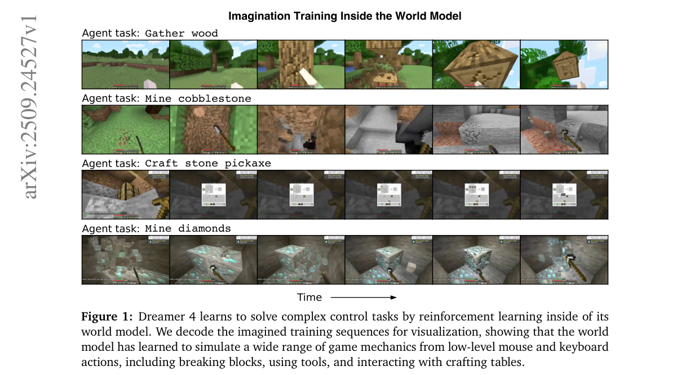
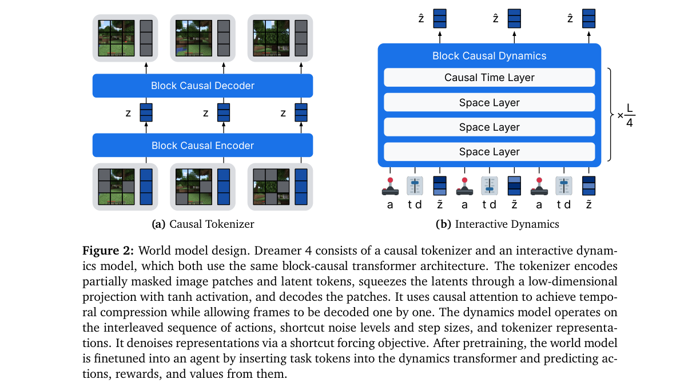
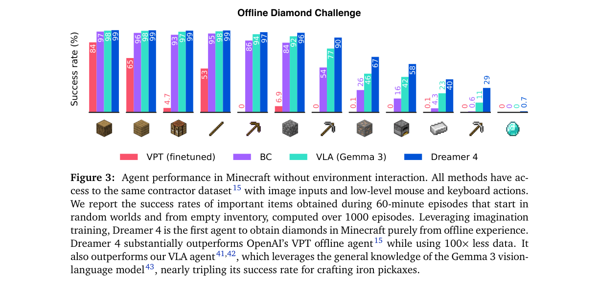
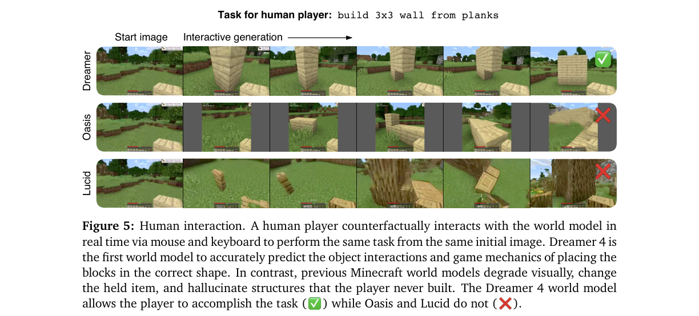
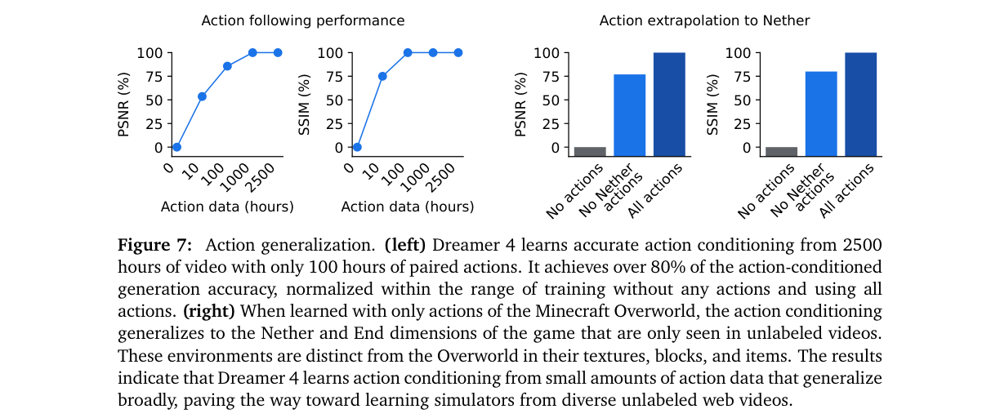
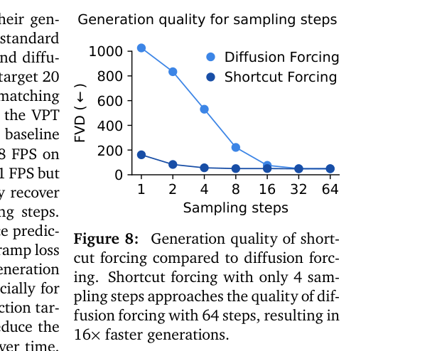

# Training Agents Inside of Scalable World Models

저자 :

Danijar Hafner*, Wilson Yan*, Timothy Lillicrap (*equal contribution)

Google DeepMind, San Francisco, USA

발표 : arXiv 2025

논문 : [PDF](https://arxiv.org/pdf/2509.24527)

출처 : [https://arxiv.org/abs/2509.24527](https://arxiv.org/abs/2509.24527)

---

## 0. Summary

<p align='center'>

</p>

### 0.1. 문제 (Problem)

* 에이전트가 복잡한 환경에서 행동을 학습하려면 "이 행동을 하면 어떻게 될까"를 예측하는 월드 모델(world model)이 필요한데, 기존 월드 모델은 두 진영 모두 한계가 있었다.
  * Dreamer 3 같은 RL 월드 모델은 빠르고 정확하지만, 아키텍처 용량이 작아 복잡한 실제 분포를 학습하지 못한다.
  * Genie 3, Oasis 같은 controllable video model은 확장성은 좋지만 물체 상호작용/게임 메커니즘의 정확한 물리를 학습하지 못하고, 한 장면을 실시간 시뮬레이션하는 데 여러 GPU가 필요해 상상 학습(imagination training)에 비실용적이다.
* 로봇처럼 환경과 직접 상호작용하는 것이 위험하거나 느린 분야에서는, 고정된 오프라인 데이터만으로 행동을 학습하는 것이 매우 중요하지만 아직 풀리지 않은 과제였다.
* 구체적 도전 과제로 "환경 상호작용 없이 오프라인 데이터만으로 Minecraft에서 다이아몬드 캐기"를 제시한다. 이는 raw 픽셀로부터 20,000회가 넘는 마우스/키보드 행동을 선택해야 하는 장기 과제(long-horizon task)다.

### 0.2. 핵심 아이디어 (Core Idea)

* **월드 모델 안에서의 상상 학습(Imagination Training)**: 에이전트가 실제 환경이 아니라 학습된 월드 모델 내부에서 강화학습으로 행동을 익힌다.
  * 왜 필요한가: 실제 로봇/게임에서 미완성 정책을 굴리면 위험하고 느리다. 월드 모델이 "머릿속 시뮬레이터" 역할을 해 주면, 환경 없이도 무한히 안전하게 연습할 수 있다.
  * 비유: 운전을 배울 때 실제 도로에 나가기 전에 머릿속으로 코스를 수없이 시뮬레이션해 보는 것과 같다.

* **Shortcut Forcing (이 논문의 핵심 기여)**: 빠르면서도 정확한 영상 생성을 가능하게 하는 학습 목표.
  * 한 줄 정의: 노이즈 레벨뿐 아니라 "스텝 크기(step size)"까지 모델에 조건으로 주어, 추론 시 적은 횟수(K=4)의 순전파만으로 다음 프레임을 만들어내는 방식.
  * 왜 필요한가: 일반적인 diffusion model은 한 프레임을 만드는 데 64번 이상 신경망을 돌려야 해서 실시간 상호작용이 불가능하다.
  * 비유: 선생님이 한 그림을 64번 덧칠하며 그리는 과정을, 학생이 4번 만에 거의 똑같이 따라 그리도록 distill(증류)하는 것. (multistep distillation)
  * Flow matching(노이즈에서 데이터로 흐르는 "강물 따라가는 배")을 기반으로 하되, 속도(velocity)가 아닌 깨끗한 데이터를 직접 예측하는 **x-prediction**을 써서 오차 누적을 막는다.

* **언라벨 영상으로부터의 일반 지식 학습**: 행동 라벨이 없는 대량의 영상에서 세상에 대한 지식을 흡수하고, 행동 조건화(action conditioning)는 소량의 라벨 데이터만으로 학습한다.
  * 직관: 영상만 보면 "무슨 일이 일어나는지"는 배울 수 있고, 행동 라벨은 "내가 무엇을 하면 그 일이 일어나는지"를 연결해 줄 최소한의 다리 역할만 하면 된다.
  * 실제로 2541시간 영상 중 100시간의 행동 라벨만으로 전체 학습 대비 80% 이상의 행동 조건화 정확도를 달성한다.

* 핵심 수식 — flow matching에서 신호 레벨 $\tau$에 따라 노이즈와 데이터를 섞고, 네트워크가 깨끗한 데이터를 향하는 방향을 학습한다.

$$x_\tau = (1-\tau)\,x_0 + \tau\,x_1,\qquad x_0 \sim \mathcal{N}(0, I),\ x_1 \sim \mathcal{D}$$

여기서 $\tau \in [0,1]$는 신호 레벨($\tau=0$은 순수 노이즈, $\tau=1$은 깨끗한 데이터), $x_0$는 가우시안 노이즈, $x_1$은 실제 데이터(여기서는 영상 프레임의 잠재 표현)다.

### 0.3. 효과 (Effects)

* **단일 GPU에서 실시간 추론**: H100 한 장에서 21 FPS로 동작(Minecraft의 20 FPS tick rate 초과), 컨텍스트 길이 9.6초로 기존 모델(0.8~1.6초) 대비 약 6배 길다.
* **오프라인 학습 가능**: 환경과의 어떤 상호작용도 없이 고정된 데이터셋만으로 다이아몬드 획득에 성공.
* **데이터 효율**: 기존 키보드/마우스 에이전트(VPT) 대비 100배 적은 데이터(2.5K시간)만 사용.
* **정확한 물체 상호작용**: 블록 설치/파괴, 도구 전환, 몹 사냥, 보트 타기 등 복잡한 게임 메커니즘을 정확히 시뮬레이션.

### 0.4. 결과 (Results)

* Minecraft 오프라인 다이아몬드 챌린지에서 **다이아몬드 0.7%, 철 곡괭이 29.0%, 돌 곡괭이 90.1%** 성공률 달성 (1000 에피소드 평균, Table 7).
* 환경 상호작용 없이 다이아몬드를 획득한 **최초의 에이전트**. OpenAI VPT 오프라인 에이전트(다이아몬드 0%)를 큰 폭으로 능가.
* 월드 모델 자체 비교에서 사람이 직접 조작하는 16개 상호작용 과제 중 **14개 성공** (Oasis large 5/16, Lucid-v1 0/16, Table 1).
* Shortcut forcing은 4 스텝으로 diffusion forcing 64 스텝의 품질에 근접 → 약 16배 빠른 생성 (Figure 8).
* 아키텍처/목적함수 ablation: 단순 diffusion forcing transformer 대비 FVD를 306 → 57로 크게 개선 (Table 2).

### 0.5. 상세 동작 방식 (How It Works)

Dreamer 4는 "3단계 학습 + 추론 루프"로 동작한다. 핵심은 영상을 압축하는 **Causal Tokenizer**(토크나이저: 영상을 작은 좌표값들로 압축하는 모듈)와, 그 좌표값의 미래를 예측하는 **Dynamics Model**(다이내믹스 모델: 행동을 받아 다음 프레임을 생성하는 모듈)이다.

```
[입력 비디오] 
   → [Causal Tokenizer: 프레임을 잠재 표현 z로 압축]
   → [Dynamics Model: 행동 a + 노이즈레벨 τ + 스텝 d 조건으로 다음 z 예측]
   → [Agent 토큰 삽입: 정책/보상/가치 헤드 부착]
   → [월드 모델 안에서 상상 rollout 생성]
   → [PMPO 강화학습으로 정책 개선]
   → [최종 에이전트 정책]
```

Step 1. **월드 모델 사전학습 (Phase 1).** 입력은 비디오 프레임. 토크나이저가 masked autoencoding(일부 패치를 가린 채 복원 학습)으로 프레임을 잠재 표현 $z$(벡터 공간의 좌표값)로 압축한다. 그 후 다이내믹스 모델이 행동 $a$, 신호 레벨 $\tau$, 스텝 크기 $d$, 노이즈가 섞인 표현 $\tilde z$를 입력받아 깨끗한 표현 $z_1$을 예측하도록 **shortcut forcing**으로 학습한다. 출력은 "행동을 주면 다음 프레임을 그려내는" 월드 모델.

Step 2. **에이전트 파인튜닝 (Phase 2).** 입력은 (영상, 행동, 과제 $q$, 보상 $r$) 데이터. 트랜스포머에 agent token을 새 modality로 끼워 넣고, 여기서 정책(policy)과 보상(reward)을 MLP 헤드로 예측한다(행동 복제, behavior cloning). 핵심 트릭: agent token은 다른 토큰을 보지만 다른 토큰은 agent token을 못 보게 막아, 미래 예측이 "과제"가 아니라 "행동"으로만 결정되게 한다(인과 혼동 방지).

Step 3. **상상 학습 (Phase 3).** 입력은 데이터셋의 context 프레임. 월드 모델을 스스로 굴려(rollout) 미래 궤적을 생성하고, 보상 헤드로 보상을, 가치(value) 헤드로 미래 보상의 할인합을 매긴다. 트랜스포머는 동결한 채 정책/가치 헤드만 PMPO(advantage의 부호만 쓰는 강건한 RL 목적)로 업데이트한다. 출력은 데이터에 없던 더 나은 전략까지 학습한 정책.

추론 루프. 한 프레임당 $K=4$번의 순전파로 다음 프레임의 잠재 표현을 샘플링하고, 토크나이저 디코더로 이미지를 복원한다. 과거 입력은 $\tau_{ctx}=0.1$로 살짝 노이즈를 섞어 생성 오차에 강건하게 만든다.

전체 데이터 흐름 요약:

```
비디오 ─► Tokenizer ─► z (잠재 표현)
                          │
        행동 a, τ, d ─────┤
                          ▼
                   Dynamics Model ─► ẑ (다음 프레임 예측)
                          │
              agent token ┤─► [정책 / 보상 / 가치 헤드]
                          ▼
                  상상 rollout ─► PMPO RL ─► 정책 π
```

---

## 1. Introduction

복잡한 환경(embodied environment)에서 과제를 풀려면 에이전트가 세상을 깊이 이해하고 성공적인 행동을 골라야 한다. 월드 모델은 에이전트 시점에서 "어떤 행동을 하면 미래에 무슨 일이 일어날지"를 예측함으로써, 계획(planning)이나 상상 속 강화학습으로 행동을 선택할 수 있게 해 준다. 특히 월드 모델은 원리적으로 고정된 데이터셋만으로 학습할 수 있어, 온라인 상호작용 없이 순수 오프라인으로 에이전트를 훈련할 수 있다. 이는 부분적으로만 학습된 정책을 실제 환경에 굴리는 것이 위험한 로봇 같은 응용에서 큰 가치를 가진다.

기존에는 두 갈래의 접근이 있었다. (1) Dreamer 3 같은 월드 모델 에이전트는 게임/로보틱스에서 가장 성능 좋고 강건한 RL 알고리즘이지만, 좁은 환경에 특화돼 있어 복잡한 실세계 분포를 담기에는 아키텍처 용량이 부족하다. (2) Genie 3 같은 controllable video model은 diffusion transformer 같은 확장성 있는 아키텍처에 기반해 다양한 장면 생성과 간단한 상호작용을 해내지만, 물체 상호작용의 정밀한 물리와 게임 메커니즘을 학습하지 못하고, 한 장면을 실시간 시뮬레이션하려면 여러 GPU가 필요하다.

저자들은 빠르고 정확한 월드 모델 안에서 상상 학습으로 제어 과제를 푸는 확장 가능한 에이전트 **Dreamer 4**를 제안한다. Dreamer 4는 환경 상호작용 없이 표준 오프라인 데이터셋만으로 Minecraft에서 다이아몬드를 획득한 최초의 에이전트다. 새로운 **shortcut forcing** 목적함수와 효율적 트랜스포머 아키텍처를 결합해, 복잡한 물체 상호작용을 정확히 학습하면서도 실시간 인간 상호작용과 효율적인 상상 학습을 동시에 가능하게 했다.

주요 기여는 다음과 같다.

* 월드 모델 안에서의 상상 학습으로 어려운 제어 과제를 푸는 확장 가능한 에이전트 Dreamer 4 제안.
* 오프라인 데이터만으로 Minecraft 다이아몬드를 획득한 최초의 에이전트 — VPT 오프라인 에이전트 대비 100배 적은 데이터 사용.
* shortcut forcing + 효율적 트랜스포머로 단일 GPU 실시간 추론을 달성하는 고용량 월드 모델 제시.
* 기존 월드 모델 대비 Minecraft의 다양한 물체 상호작용/게임 메커니즘을 훨씬 정확히 예측함을 입증.
* 언라벨 영상으로부터 학습 가능하며, 소량의 정렬된 행동 데이터만으로 강한 일반화를 가진 행동 조건화를 학습함을 입증.

## 2. Method

<p align='center'>

</p>

Dreamer 4는 토크나이저와 다이내믹스 모델로 구성되며, 둘 다 동일한 block-causal 트랜스포머 아키텍처를 사용한다. 토크나이저는 영상 프레임을 연속 표현으로 압축하고, 다이내믹스 모델은 행동이 끼워진(interleaved) 시퀀스를 받아 표현을 예측한다.

### 2.1. 배경: Flow Matching과 Shortcut Models

월드 모델은 diffusion model 계열인 flow matching에 기반한다. 네트워크 $f_\theta$는 손상된 입력 $x_\tau$로부터 데이터를 복원하도록 학습되며, 신호 레벨 $\tau$에 따라 노이즈와 데이터를 섞는다. flow matching에서는 네트워크가 깨끗한 데이터를 향하는 속도 벡터 $v = x_1 - x_0$를 예측하도록 학습한다.

$$\mathcal{L}(\theta) = \lVert f_\theta(x_\tau, \tau) - (x_1 - x_0) \rVert^2$$

추론 시에는 순수 노이즈 $x_0$에서 시작해 $K$ 스텝($d = 1/K$) 동안 점진적으로 깨끗한 데이터로 변환한다($x_{\tau+d} = x_\tau + f_\theta(x_\tau,\tau)\,d$).

**Shortcut models**는 신호 레벨 $\tau$뿐 아니라 요청된 스텝 크기 $d$도 조건으로 받는다. 가장 작은 스텝 $d_{min}$에서는 flow matching loss로, 더 큰 스텝에서는 두 개의 작은 스텝을 distill하는 bootstrap loss로 학습한다.

$$v_{target} = \begin{cases} x_1 - x_0 & \text{if } d = d_{min} \\ \mathrm{sg}(b' + b'')/2 & \text{else} \end{cases}$$

여기서 $b', b''$는 각각 $d/2$ 크기의 두 작은 스텝 예측, $\mathrm{sg}(\cdot)$는 gradient stop이다. 덕분에 추론 시 2~4 스텝만으로 (보통 diffusion의 64 스텝 대비) 고품질 샘플을 생성한다.

### 2.2. Causal Tokenizer

토크나이저는 raw 영상을 다이내믹스 모델이 소비/생성할 연속 표현 시퀀스로 압축한다. 인코더와 디코더 사이에 저차원 bottleneck이 있고, 시간 축으로 causal하여 시간 압축을 하면서도 프레임을 하나씩 디코딩할 수 있다. 학습은 MSE와 LPIPS를 결합한 재구성 목적으로 한다.

$$\mathcal{L}(\theta) = \mathcal{L}_{MSE}(\theta) + 0.2\,\mathcal{L}_{LPIPS}(\theta)$$

인코더 입력 패치를 확률 $p \sim U(0, 0.9)$로 드롭하는 masked autoencoding을 적용해, 다이내믹스 모델이 생성하는 영상의 공간적 일관성을 높인다.

### 2.3. Interactive Dynamics와 Shortcut Forcing

다이내믹스 모델은 행동 $a = \{a_t\}$, 신호 레벨 $\tau = \{\tau_t\}$, 스텝 크기 $d = \{d_t\}$, 손상된 표현 $\tilde z = \{z_t^{(\tau_t)}\}$를 입력받아 깨끗한 표현 $z_1$을 예측한다. 여기서 $t$는 시퀀스 타임스텝, $\tau_t$는 그 스텝의 신호 레벨이다(diffusion forcing처럼 각 프레임마다 다른 신호 레벨 부여).

shortcut models의 v-prediction(속도 예측)은 영상을 한 블록으로 생성할 때는 좋지만, 프레임 단위로 긴 영상을 만들 때 고주파 오차가 시간에 따라 누적된다. 저자들은 대신 깨끗한 표현을 직접 예측하는 **x-prediction**을 사용해 임의 길이의 고품질 rollout을 가능하게 했다. bootstrap loss를 계산할 때는 출력을 v-space로 변환한 뒤 다시 x-space로 스케일한다.

$$\mathcal{L}(\theta) = \begin{cases} \lVert \hat z_1 - z_1 \rVert_2^2 & \text{if } d = d_{min} \\ (1-\tau)^2 \left\lVert \tfrac{\hat z_1 - \tilde z}{1-\tau} - \mathrm{sg}(b_1 + b_2)/2 \right\rVert_2^2 & \text{else} \end{cases}$$

낮은 신호 레벨은 학습 신호가 적으므로(flow matching 항이 데이터 평균을 예측하는 것으로 퇴화), 모델 용량을 신호가 풍부한 곳에 집중시키기 위해 신호 레벨 $\tau$에 선형 비례하는 ramp loss weight를 도입한다.

$$w(\tau) = 0.9\,\tau + 0.1$$

추론 시에는 시간 축으로 autoregressive하게 샘플링하며, 각 프레임을 $K=4$ 스텝($d=1/4$)으로 생성한다. 과거 입력은 $\tau_{ctx}=0.1$로 살짝 손상시켜 자기 생성 오차에 강건하게 만든다.

### 2.4. Imagination Training

* **행동 복제 + 보상 모델 (Phase 2).** 사전학습 후, 트랜스포머에 agent token을 끼워 넣고 task embedding을 입력으로 받아 정책/보상 헤드를 학습한다. 길이 $L=8$의 multi-token prediction(MTP)으로 미래 행동/보상을 동시에 예측한다.

$$\mathcal{L}(\theta) = -\sum_{n=0}^{L} \ln p_\theta(a_{t+n}\mid h_t) - \sum_{n=0}^{L} \ln p_\theta(r_{t+n}\mid h_t)$$

agent token은 모든 modality를 attend하지만, 다른 modality는 agent token을 attend하지 못하게 막는다. 이는 월드 모델의 미래 예측이 과제가 아니라 행동에 의해서만 직접 영향받게 하여 인과 혼동을 방지하는 핵심 장치다.

* **강화학습 (Phase 3).** 트랜스포머는 동결하고 정책/가치 헤드만 갱신한다. 데이터 context에서 시작해 월드 모델을 스스로 굴려 rollout을 만들고, 보상/가치를 매긴다. 가치 헤드는 TD-learning으로 $\lambda$-return을 예측한다($\gamma = 0.997$).

$$R^\lambda_t = r_t + \gamma c_t\left[(1-\lambda)v_t + \lambda R^\lambda_{t+1}\right],\qquad R^\lambda_T = v_T$$

여기서 $c_t$는 비종료 상태 표시자다. 정책은 advantage $A_t = R^\lambda_t - v_t$의 **부호만** 사용하는 강건한 목적 PMPO로 학습하여, return 정규화 없이도 과제 간 균형을 맞춘다.

$$\mathcal{L}(\theta) = \frac{1-\alpha}{|\mathcal{D}^-|}\sum_{i \in \mathcal{D}^-} \ln \pi_\theta(a_i|s_i) - \frac{\alpha}{|\mathcal{D}^+|}\sum_{i \in \mathcal{D}^+} \ln \pi_\theta(a_i|s_i) + \frac{\beta}{N}\sum_{i=1}^{N} \mathrm{KL}[\pi_\theta(a_i|s_i)\,\Vert\,\pi_{prior}]$$

$\mathcal{D}^+, \mathcal{D}^-$는 advantage가 양/음인 상태 집합, $\alpha=0.5$로 양/음 피드백 균형, $\beta=0.3$로 행동 복제 prior에 대한 KL 정규화 강도를 둔다.

### 2.5. Efficient Transformer

* 시간/공간 2D 트랜스포머이며, 상호작용 생성을 위해 attention을 시간 축으로 causal하게 마스킹한다(한 타임스텝 내 토큰끼리 + 과거만 attend).
* RMSNorm, RoPE, SwiGLU에 더해 QKNorm과 attention logit soft capping으로 학습 안정성을 확보.
* 추론 속도 최적화: (1) dense attention을 공간 전용/시간 전용 레이어로 분리, (2) 시간 attention은 4 레이어마다 한 번만, (3) GQA로 KV 캐시 축소.
* 긴/짧은 배치 길이를 번갈아 학습해 길이 일반화를 확보하고, 컨텍스트 길이보다 긴 배치를 써서 시작 프레임에 과적합되는 것을 방지한다.

## 3. Experiments

<p align='center'>

</p>

실험은 주로 Minecraft에서 수행된다. VPT 데이터셋(360p, 20 FPS, 마우스/키보드 행동의 contractor 게임플레이 2541시간)을 사용한다. 모델은 토크나이저 400M + 다이내믹스 1.6B = 총 2B 파라미터로, 256~1024 TPU-v5p에서 FSDP로 학습한다.

### 3.1. 오프라인 다이아몬드 챌린지

* **세팅**: 환경 상호작용 없이 VPT contractor 데이터셋만 사용. raw 픽셀 입력 + low-level 마우스/키보드 행동, 인게임 UI를 통한 크래프팅. 에피소드는 60분, 빈 인벤토리/랜덤 월드에서 시작. 사람은 평균 20분(약 24,000 행동)에 다이아몬드를 캔다.
* **베이스라인**: VPT (finetuned), BC (행동 복제), VLA (Gemma 3 기반 vision-language-action), WM+BC (상상 학습 전 Dreamer 4 BC 정책).
* **주요 결과 (Table 7, 1000 에피소드 평균 성공률)**:

| Item | VPT (ft) | BC | VLA (Gemma 3) | WM+BC | Dreamer 4 |
|---|---|---|---|---|---|
| Stick | 52.6 | 95.0 | 97.7 | 98.9 | 98.7 |
| Stone pickaxe | 0.0 | 53.8 | 76.7 | 89.4 | **90.1** |
| Iron pickaxe | 0.0 | 0.6 | 11.2 | 16.9 | **29.0** |
| Diamond | 0.0 | 0.0 | 0.0 | 0.0 | **0.7** |

* Dreamer 4는 돌 곡괭이까지 90% 이상, 철 곡괭이 29.0%, 다이아몬드 0.7%를 달성한 **유일한** 에이전트다.
* 상상 학습(RL)은 난이도가 높은 마일스톤일수록 행동 복제 대비 개선폭이 크다. 또한 성공률뿐 아니라 마일스톤 도달 시간도 단축한다(Table 8: 더 적은 분 = 더 효율적).
* 월드 모델 표현으로 행동 복제(WM+BC)하는 것이 Gemma 3나 scratch 학습보다 우수 → 영상 예측이 의사결정에 유용한 세상 이해를 암묵적으로 학습함을 시사.

### 3.2. 사람 상호작용 (월드 모델 비교)

<p align='center'>

</p>

* 사람이 동일한 시작 프레임에서 월드 모델 안으로 들어가 마우스/키보드로 직접 과제를 수행, 16개 과제 성공 여부를 비교 (Table 1).

| Model | Params | 해상도 | Context | FPS | Success |
|---|---|---|---|---|---|
| Lucid-v1 | 1.1B | 640×360 | 1.0s | 44 | 0/16 |
| Oasis (small) | 500M | 640×360 | 1.6s | 20 | 0/16 |
| Oasis (large) | — | 360×360 | 1.6s | ~5 | 5/16 |
| **Dreamer 4** | 2B | 640×360 | **9.6s** | 21 | **14/16** |

* Dreamer 4는 블록을 올바른 모양으로 설치하는 등 물체 상호작용/게임 메커니즘을 정확히 예측한 최초의 월드 모델. Oasis는 블록 몇 개를 놓으면 구조물을 환각(autocompletion)하는 실패 모드를 보인다.
* H100 한 장에서 21 FPS로 실시간 추론(20 FPS tick rate 초과)하며, 컨텍스트 9.6초로 기존 대비 약 6배 길다.
* 로보틱스 데이터셋(SOAR)에서도 물체 집기/뒤집기/던지기 등 정확한 물리와 counterfactual 상호작용을 생성, 실세계 영상으로의 확장 가능성을 보인다.

### 3.3. 행동 일반화

<p align='center'>

</p>

* 2541시간 전체 영상으로 학습하되 행동 라벨은 0/10/100/1000/2541시간만 제공해 행동 조건화에 필요한 데이터양을 측정(PSNR/SSIM).
* 10시간만으로 전체 대비 PSNR 53%/SSIM 75%, 100시간이면 PSNR 85%/SSIM 100% → 월드 모델은 지식의 대부분을 언라벨 영상에서 흡수하고 행동 라벨은 소량이면 충분.
* **행동 외삽**: Overworld 행동만 학습했는데도, 행동을 한 번도 본 적 없는 Nether/End 차원(텍스처/블록/아이템이 완전히 다름)에 대해 전체 학습 대비 PSNR 76%/SSIM 80% 달성 → 언라벨 영상으로만 아는 영역에도 행동 조건화가 일반화됨.

### 3.4. 모델 설계 Ablation

<p align='center'>

</p>

* naive diffusion forcing transformer에서 출발해 개선을 누적 적용(Table 2). 핵심: shortcut model 도입, x-prediction/x-loss, ramp weight, 배치 길이 교대, 4 레이어마다 시간 attention, GQA, 공간 토큰 증가.
* 최종 모델은 FVD **306 → 57**로 개선, 동시에 추론 속도 0.8 → 21+ FPS.
* Shortcut forcing은 4 스텝으로 diffusion forcing 64 스텝 품질에 근접 → 약 16배 빠른 생성(Figure 8).

## 4. Conclusion

Dreamer 4는 빠르고 정확한 월드 모델 안에서의 상상 학습으로 어려운 장기 제어 과제를 푸는 확장 가능한 에이전트로, 환경 상호작용 없이 오프라인 데이터만으로 Minecraft 다이아몬드를 획득한 최초의 에이전트다. 그 핵심은 (1) 적은 스텝으로 정확한 영상을 생성하는 shortcut forcing 목적함수와 (2) 단일 GPU 실시간 추론을 가능하게 하는 효율적 트랜스포머 아키텍처다. 또한 소량의 행동 라벨만으로 강하게 일반화하는 행동 조건화를 학습해, 향후 다양한 웹 영상에서 일반 지식을 흡수할 길을 연다. 다만 월드 모델은 아직 게임의 완전한 복제와는 거리가 있어(짧은 메모리, 부정확한 인벤토리 예측), Minecraft는 여전히 좋은 벤치마크로 남는다. 향후 방향으로 일반 인터넷 영상 사전학습, 장기 메모리 통합, 언어 이해 결합, 소량의 교정용 온라인 데이터 활용 등을 제시한다.

작성자 commentary: "월드 모델을 단순한 영상 생성기가 아니라 RL 에이전트가 안전하게 연습할 수 있는 빠른 시뮬레이터로 끌어올렸다"는 점이 이 논문의 진짜 기여다. shortcut forcing(증류로 64→4 스텝)과 x-prediction(오차 누적 방지)이라는 두 공학적 결정이 "확장성 vs 실시간성 vs 정확성"의 삼중 딜레마를 동시에 해결한 점이 특히 인상적이다.

---

## 부록: 사전 지식 (Prerequisites)

### A.1. 알아야 할 핵심 개념

- **Flow Matching (플로우 매칭)** — 노이즈 $x_0$에서 데이터 $x_1$으로 향하는 직선 경로를 따라 속도 벡터 $v = x_1 - x_0$를 학습하는 생성 모델 패러다임. DDPM보다 단순하고 추론 스텝이 적다.
  - 본문 위치: §2.1 Background, 식 (1). 다이내믹스 모델 전체가 flow matching 위에 설계됨.

- **Shortcut Models (숏컷 모델)** — flow matching에서 신호 레벨 $\tau$뿐 아니라 스텝 크기 $d$도 조건으로 주어 큰 스텝을 두 개의 작은 스텝으로 bootstrap distill하는 기법. 추론 시 2~4 스텝으로 고품질 샘플 생성.
  - 본문 위치: §2.1 후반부(shortcut models 절), §2.3 shortcut forcing에서 직접 확장됨.

- **Diffusion Forcing (디퓨전 포싱)** — 시퀀스의 각 프레임마다 서로 다른 독립적인 노이즈 레벨을 부여해 긴 영상을 autoregressive하게 denoising하는 기법. 본 논문의 baseline 아키텍처.
  - 본문 위치: §2.3 시작부, ablation Table 2의 베이스라인.

- **x-prediction vs v-prediction** — diffusion/flow matching 모델이 예측 대상을 속도 벡터 $v$로 할지 깨끗한 데이터 $x_1$으로 할지의 선택. v-prediction은 짧은 시퀀스엔 좋지만 긴 autoregressive rollout에서 오차가 누적됨. x-prediction이 이를 해결.
  - 본문 위치: §2.3 (x-prediction 도입 이유 설명), 최종 loss 식.

- **Causal Tokenizer (인과 토크나이저) / Masked Autoencoding** — 영상 프레임을 저차원 연속 표현으로 압축하는 인코더-디코더 모듈. 시간 축으로 causal하여 스트리밍 디코딩 가능. 인코더 패치를 무작위로 드롭하는 masked autoencoding으로 공간 일관성을 강화.
  - 본문 위치: §2.2 전체.

- **Imagination Training (상상 학습) / World Model** — 실제 환경 없이 학습된 월드 모델 안에서 에이전트가 강화학습을 수행하는 패러다임. 오프라인 데이터만으로 안전하게 정책을 개선할 수 있음.
  - 본문 위치: §1 Introduction 전체, §2.4 Phase 3.

- **Behavior Cloning (행동 복제, BC) / Offline RL** — 환경 상호작용 없이 고정된 시연 데이터에서 정책을 학습하는 방법. BC는 지도학습 방식, Offline RL은 보상을 활용해 시연을 넘어서는 것이 목표.
  - 본문 위치: §2.4 Phase 2(BC로 초기 정책 습득), §3.1 실험 베이스라인 비교.

- **PMPO (Proximal Masked Policy Optimization)** — advantage의 부호(+/-)만 사용하는 강건한 정책 경사 목적함수. return 정규화 없이도 복수의 과제 간 학습 균형을 유지하며, KL 정규화로 BC prior에서 과도한 이탈을 방지.
  - 본문 위치: §2.4 Phase 3 RL 목적함수 식.

- **TD-Learning / λ-return (TD 학습 / 람다 반환)** — 시간차(temporal difference) 학습으로 가치 함수를 추정하는 방법. λ-return은 1-스텝 TD와 Monte Carlo return을 λ로 혼합해 편향-분산을 조절. $\gamma = 0.997$, $R^\lambda_t$ 형식으로 사용.
  - 본문 위치: §2.4 Phase 3 가치 헤드 학습.

- **Efficient Transformer 구성요소 (RoPE, RMSNorm, SwiGLU, GQA, QKNorm)** — 최신 LLM에서 표준화된 트랜스포머 구성 요소들. RoPE는 상대 위치 인코딩, RMSNorm은 레이어 정규화, SwiGLU는 활성화 함수, GQA(Grouped Query Attention)는 KV 캐시 압축, QKNorm+logit soft capping은 학습 안정성 확보.
  - 본문 위치: §2.5 Efficient Transformer 전체. 단일 GPU 실시간 추론의 핵심 구현 요소.

---

### A.2. 먼저 읽으면 좋은 논문

1. **[2023][DreamerV3]** "Mastering Diverse Domains through World Models" ([arXiv:2301.04104](https://arxiv.org/abs/2301.04104)) — Hafner et al.
   - RSSM 기반의 월드 모델 에이전트로, Dreamer 4의 직계 선행 모델. 사람 데이터 없이 Minecraft 다이아몬드를 최초 달성한 온라인 RL 에이전트.
   - **왜?** Dreamer 4가 DreamerV3의 상상 학습 패러다임을 계승하면서 오프라인 설정과 확장 가능한 아키텍처로 나아가는 맥락을 이해하는 데 필수.
   - **Repo 내 정리**: [World_Model/[논문][2023][arXiv][DreamerV3][Summary] Mastering Diverse Domains through World Models.md](../World_Model/[논문][2023][arXiv][DreamerV3][Summary]%20Mastering%20Diverse%20Domains%20through%20World%20Models.md)

2. **[2022][Flow Matching]** "Flow Matching for Generative Modeling" ([arXiv:2210.02747](https://arxiv.org/abs/2210.02747)) — Lipman et al.
   - 노이즈에서 데이터로 향하는 직선 경로를 학습하는 생성 모델 프레임워크. DDPM보다 단순하고 안정적.
   - **왜?** Dreamer 4 다이내믹스 모델 전체가 flow matching 위에 설계되어 있으며, §2.1의 수식을 이해하려면 필수.

3. **[2024][Shortcut Models]** "One Step Diffusion via Shortcut Models" ([arXiv:2410.12557](https://arxiv.org/abs/2410.12557)) — Frans et al.
   - 스텝 크기 $d$를 조건으로 추가하고 bootstrap distillation으로 대형 스텝을 학습하는 기법. Dreamer 4 shortcut forcing의 직접적 기반.
   - **왜?** §2.1의 shortcut model 설명과 §2.3 shortcut forcing이 이 논문의 확장이므로, 원리 이해를 위해 선행 필독.

4. **[2024][Diffusion Forcing]** "Diffusion Forcing: Next-token Prediction Meets Full-Sequence Diffusion" ([arXiv:2407.01392](https://arxiv.org/abs/2407.01392)) — Chen et al.
   - 시퀀스 각 프레임에 독립적인 노이즈 레벨을 부여해 autoregressive video generation을 가능하게 한 기법. Dreamer 4 ablation의 베이스라인.
   - **왜?** Dreamer 4가 diffusion forcing transformer에서 출발해 shortcut forcing으로 개선하는 흐름(Table 2)을 이해하는 데 필요.

5. **[2022][VPT]** "Video PreTraining (VPT): Learning to Act by Watching Unlabeled Online Videos" ([arXiv:2206.11795](https://arxiv.org/abs/2206.11795)) — Baker et al. (OpenAI)
   - Minecraft 마우스/키보드 행동 역추정 모델 + BC 파인튜닝으로 게임 과제를 수행한 방법. Dreamer 4가 사용하는 VPT contractor 데이터셋의 출처.
   - **왜?** 실험 데이터셋의 구성, 베이스라인 비교 대상, 오프라인 다이아몬드 챌린지의 의미를 파악하려면 필수.

6. **[2022][MAE]** "Masked Autoencoders Are Scalable Vision Learners" ([arXiv:2111.06377](https://arxiv.org/abs/2111.06377)) — He et al.
   - 입력 패치를 무작위로 마스킹한 채 복원하는 자기지도 사전학습 방법. Dreamer 4 causal tokenizer의 masked autoencoding이 이 원리를 차용.
   - **왜?** §2.2의 tokenizer 학습 방식과 공간 일관성 향상 효과를 이해하는 데 도움.

7. **[2024][ICLR][TD-MPC2]** "TD-MPC2: Scalable, Robust World Models for Continuous Control" ([arXiv:2310.16828](https://arxiv.org/abs/2310.16828)) — Hansen et al.
   - TD 학습 기반 잠재 공간 월드 모델로, 연속 제어 과제에서 확장성을 보인 선행 연구.
   - **왜?** 본 논문과 같은 "확장 가능한 월드 모델 에이전트" 흐름의 다른 축을 보여주며 비교 관점 제공.
   - **Repo 내 정리**: [World_Model/[논문][2024][ICLR][TD-MPC2][Summary] TD-MPC2 Scalable, Robust World Models for Continuous Control.md](../World_Model/[논문][2024][ICLR][TD-MPC2][Summary]%20TD-MPC2%20Scalable%2C%20Robust%20World%20Models%20for%20Continuous%20Control.md)

---

### A.3. 관련/후속 논문

- **[2024][Genie 2]** "Genie 2: A Large-Scale Foundation World Model" (DeepMind, 2024) — 다양한 환경에서 행동 조건화 비디오 생성을 수행하는 대규모 월드 모델. Dreamer 4가 극복 대상으로 언급한 controllable video model 계열.

- **[2025][Genie 3]** "Genie 3" ([DeepMind](https://sites.google.com/view/genie-3)) — 확장된 버전으로, Dreamer 4의 직접 비교 대상. 물체 상호작용 정확도와 실시간성에서 Dreamer 4에 뒤처짐.

- **[2024][Oasis]** "Oasis: A Universe in a Transformer" ([arXiv:2410.15754](https://arxiv.org/abs/2410.15754)) — Minecraft 실시간 대화형 세계 생성 모델. Dreamer 4와 Table 1에서 직접 비교되며 16개 과제 중 5/16 vs Dreamer 4의 14/16.

- **[2026][AnyFlow]** "AnyFlow: Any-Step Video Diffusion Model with On-Policy Flow Map Distillation" ([arXiv:2605.13724](https://arxiv.org/abs/2605.13724)) — flow matching 가속화의 다른 접근으로, on-policy distillation 활용. Dreamer 4 shortcut forcing과 유사한 목적(적은 스텝으로 고품질 생성).
  - **Repo 내 정리**: [Video_DiT/[논문][2026][arXiv][AnyFlow][Summary] AnyFlow - Any-Step Video Diffusion Model with On-Policy Flow Map Distillation.md](../Video_DiT/[논문][2026][arXiv][AnyFlow][Summary]%20AnyFlow%20-%20Any-Step%20Video%20Diffusion%20Model%20with%20On-Policy%20Flow%20Map%20Distillation.md)

- **[2025][DIAMOND]** "DIAMOND: Diffusion for World Modeling: Visual Details Matter in Atari" ([arXiv:2405.12399](https://arxiv.org/abs/2405.12399)) — diffusion 기반 월드 모델로 Atari에서 이미지 품질 중심 에이전트 학습. Dreamer 4와 같은 diffusion world model 에이전트 계열의 병행 연구.
